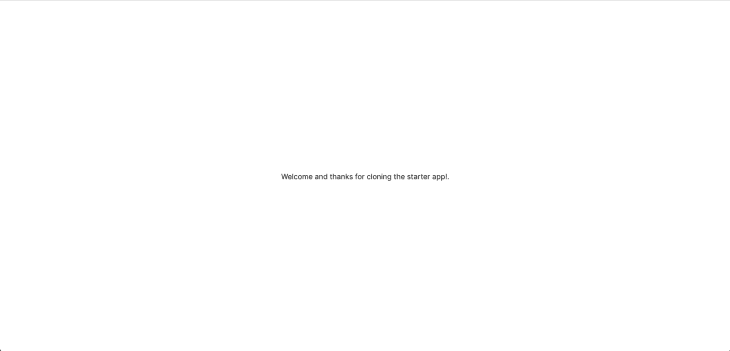
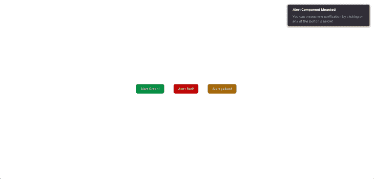

# 在 React with Reapop 中实现通知

> 原文：<https://blog.logrocket.com/implementing-notifications-react-reapop/>

根据[2020 Stack Overflow developer study](https://survey.stackoverflow.co/2022/#section-most-popular-technologies-web-frameworks-and-technologies)，React 被列为仅次于 Node.js 的第二大使用的 web 开发框架，因为 React 的流行，很多库都是为 React 开发的。

在本文中，我们将了解 Reapop API，并构建一个简单的 React 应用程序来用 Reapop 实现通知。为了从本文中获得最大收益，您需要在您的系统中安装 Node.js，并具备 JavaScript 和 React 的基础知识。我们开始吧！

*向前跳转:*

## React 与 Reapop API 入门

在本文中，我们将了解 React 的一个简单且可定制的系统 [Reapop](https://louisbarranqueiro.github.io/reapop/) 。如上所述，虽然还有[和其他 React 通知库](https://blog.logrocket.com/spinners-notifications-react-app/)，但 Reapop 大放异彩，因为它易于使用、功能丰富且可定制。另外，Reapop 内置了[类型脚本](https://blog.logrocket.com/how-use-typescript-react-tutorial-examples/)、 [Redux](https://blog.logrocket.com/understanding-redux-tutorial-examples/) 和 [Redux thunk](https://blog.logrocket.com/async-actions-bare-redux-thunk-custom-middleware/) 。正如所料，它的 API 内置了对 Redux 的支持。如果您在没有任何状态管理的情况下使用它，Reapop 还提供了钩子和上下文 API。

Reapop API 由六个 API 组成。每个 API 都公开了一组用于构建 Reapop 通知的属性或函数。让我们更详细地看看这些 API。

### 实体

这个 API 公开了`Notification`对象，顾名思义表示通知。这个 API 包含几个属性和函数，例如:

*   `Notification`的`ID`——如果提供的话
*   `Notification`标题
*   消息还是`Notification`
*   `Notification`的状况
*   显示的位置`Notification`
*   `onAdd`函数:显示通知时执行的方法
*   `onDismiss`函数:在通知被解除之前执行的方法

从下面的`Notification`接口指定的对象签名中可以看到`Notification`对象属性的完整列表:

```
{
    id: string
    title?: string
    message?: string
    status: Status
    position: Position
    buttons: NotificationButton[]
    image?: string
    dismissAfter?: number
    dismissible?: boolean
    onAdd?: (...args: any[]) => void
    onDismiss?: (...args: any[]) => void
    showDismissButton?: boolean
    allowHTML?: boolean
    [index: string]: any
}

```

正如您在上面的代码中所看到的，`NotificationButton`是一个对象，它表示单击**按钮**来触发通知。它是一个具有三种属性的对象:`Name`、`Primary`和`onClick`。点击 **`NotificationButton`** 时触发`onClick`功能，界面如下:

```
{
    name: string
    primary?: boolean
    onClick?: (...args: any[]) => void
}

```

### 行动

这个 API 公开了三个函数，`notify`、`dismissNotification`和`dismissNotifications`。`notify`动作用于创建或更新具有以下签名的通知:

```
notify(notification: Partial<Notification>)
notify(message: string, options?: Partial<Notification>)
notify(message: string, status: Status, options?: Partial<Notification>)

```

**`dismissNotification`** 动作用于解除通知，具有以下功能签名:

```
dismissNotification(id: string)

```

`dismissNofications`动作用于消除所有通知，具有以下函数签名:

```
dismissNotifications()

```

### 钩住

[钩子 API](https://blog.logrocket.com/react-reference-guide-hooks-api/) 需要 [React v16.8.0](https://reactjs.org/blog/2019/02/06/react-v16.8.0.html) 或更高版本，并且打算在不使用另一个状态管理器时使用。也就是说，Reapop 用下面的语法提供了用于构建`Notifications`的`useNotification`钩子:

```
const {notifications, notify, dismissNotification, dismissNotifications} = 
useNotifications()

```

Reapop 提供的其他钩子是`useTheme`和`useComponentsContext`。

### 成分

这个 API 公开了几个组件，包括负责显示通知的`[NotificationSystem](https://github.com/LouisBarranqueiro/reapop/blob/main/src/components/NotificationsSystem.tsx)`组件。其他组件的列表可以在[这里](https://github.com/LouisBarranqueiro/reapop/tree/main/src/components)找到。

### 助手

这个 API 公开了一组助手函数。其中一个函数`setUpNotifications`用于定义默认属性、修改通知的自定义函数以及用于生成通知 id 的函数。该函数具有以下签名:

```
type NotificationConfig = {
    defaultProps: Partial<Notification>
    customizeNotification: ((notification: NewNotification) => void) | null
    generateId: ((notification: NewNotification) => string) | null
}

setUpNotifications(NotificationConfig)

```

您可以使用此功能设置`default notifications`属性，如下所示:

```
import {setUpNotifications} from 'reapop'

// run this function when your application starts before creating any notifications
setUpNotifications({
    defaultProps: {
        position: 'top-right',
        dismissible: true
    } 
})

```

您还可以定义自定义函数来修改通知，如下所示:

```
const ATopLevelComponent = () => {
    return (
        <div>
            <NotificationsSystem
                smallScreenBreakpoint={500}
                {...otherProps}
            />
        </div>
    )
}

```

在上面的代码中，`ATopLevelComponent`函数指定何时显示通知——在屏幕的`top-center`处。这是通过定制`NotificationsSystem`组件的`smallScreenBreakpoint`属性来完成的。`resetNotificationsConfig`功能用于将自定义通知配置的值重置回默认值。

### 主题

这个 API 提供了三个内置主题:`atalhoTheme`、`wyboTheme`和`bootstrapTheme`。您可以通过下面的代码导入和使用它们:

```
import {atalhoTheme, wyboTheme, bootstrapTheme} from 'reapop'

const ATopLevelComponent = () => {
    return (
        <div>
            <NotificationsSystem
                theme={atalhoTheme}
                {...otherProps}
            />
        </div>
    )
}

```

## 使用 Reapop 实现通知

在上一节中，我们学习了 Reapop 的通知 API 以及如何实现通知。

如前所述，Reapop 是用 Redux 构建的，因此 API 可以开箱即用地使用 Redux。但是，它也为 [React 钩子](https://blog.logrocket.com/create-your-own-custom-react-hooks/)和[上下文 API](https://blog.logrocket.com/react-context-api-deep-dive-examples/) 提供了 API。在本文中，我们将使用 React 钩子和上下文 API 来实现我们的通知。

### 获取启动文件

首先，从这个 [GitHub 库](https://github.com/lawrenceagles/reapop-starter)中克隆 starter 应用程序，然后通过运行`npm install`安装依赖项。starter 应用程序是一个简单的 [Create React App](https://blog.logrocket.com/getting-started-with-create-react-app-d93147444a27/) 和 [Tailwind CSS](https://blog.logrocket.com/applying-dynamic-styles-tailwind-css/) 应用程序样板。您可以通过使用`npm start`运行 dev 服务器来测试您的安装。

如果一切顺利，您应该会看到以下内容:



### 设置`NotificationsProvider`上下文 API

在使用 Reapop API 之前，通过运行`npm i reapop`来安装该包。然后，在`index.js`文件中，用这行代码导入`NotificationsProvider`:

```
import { NotificationsProvider } from 'reapop'

```

现在，用`NotificationProvider`包裹`App`组件，如下所示:

```
...
const root = ReactDOM.createRoot(document.getElementById('root'));
root.render(
  <React.StrictMode>
    <NotificationsProvider>
      <App />
    </NotificationsProvider>
  </React.StrictMode>
);
...

```

该组件必须包装您想要访问和处理通知的所有组件。

### 创建`notification`组件

要创建这个定制组件，在`src`文件夹中创建一个`components`文件夹，并创建两个组件:`Notification.js`和`NotificationButtons.js`。然后，将下面的代码添加到`NotificationButtons.js`中:

```
import React from "react";
import { useNotifications } from 'reapop'
const NotificationButtons = () => {
    const { notify } = useNotifications()

    const notification1 = {
        id: '1',
        title: 'Notification 1!',
        message: 'Lorem Ipsum is simply dummy text of the printing and typesetting industry.',
        dismissible: true,
        dismissAfter: 3,
    }
    const notification2 = {
        id: '2',
        title: 'NOficaition 2!',
        message: 'Lorem Ipsum is simply dummy text of the printing and typesetting industry.',
        dismissible: true,
        dismissAfter: 2,
    }
    const notification3 = {
        id: '3',
        title: 'Notification 3!',
        message: 'Lorem Ipsum is simply dummy text of the printing and typesetting industry.',
        dismissible: true,
        dismissAfter: 1,
    }

    return (
        <div className="grid h-screen place-items-center">
            <div className="flex gap-x-8">
                <button
                    className="focus:outline-none text-white bg-green-700 hover:bg-green-800 focus:ring-4 focus:ring-green-300 font-medium rounded-lg text-sm px-5 py-2.5 mr-2 mb-2 dark:bg-green-600 dark:hover:bg-green-700 dark:focus:ring-green-800"
                    onClick={() => notify(notification1)}>
                    Alert Green!
                </button>
                <button
                    className="focus:outline-none text-white bg-red-700 hover:bg-red-800 focus:ring-4 focus:ring-red-300 font-medium rounded-lg text-sm px-5 py-2.5 mr-2 mb-2 dark:bg-red-600 dark:hover:bg-red-700 dark:focus:ring-red-800"
                    onClick={() => notify(notification2)}>
                    Alert Red!
                </button>

                <button
                    className="focus:outline-none text-white bg-yellow-700 hover:bg-yellow-800 focus:ring-4 focus:ring-yellow-300 font-medium rounded-lg text-sm px-5 py-2.5 mr-2 mb-2 dark:bg-yellow-600 dark:hover:bg-yellow-700 dark:focus:ring-yellow-800"
                    onClick={() => notify(notification3)} >
                    Alert yellow!
                </button>
            </div>
        </div>
    );
}
export default NotificationButtons;

```

我们在上面的代码中创建了三个通知对象:`notification1`、`notification2`和`notification3`。我们还创建了三个按钮:`Alert Green!`、`Alert Red!`和`Alert Yellow!`。

当点击一个**按钮**时，我们通过调用`notify`创建一个新的通知。接下来，将以下代码添加到`Notification.js`组件中:

```
import React, { useState, useEffect } from "react";
import NotificationsSystem, { atalhoTheme, setUpNotifications, useNotifications } from 'reapop'
import NotificationButtons from "./NotificationBottons";
const Notification = () => {
    const [transitionName, setTransitionName] = useState('Slide')
    // 1\. Retrieve the notifications to display, and the function used to dismiss a notification.
    const { notifications, dismissNotification, notify } = useNotifications()
    useEffect(() => {
        const notification = {
            id: '4',
            title: 'Alert Component Mounted!',
            message: 'You can create new notification by clicking on any of the button s below!',
            dismissible: true,
            dismissAfter: 2,
        }
        // 2\. Create a notification.
        notify(notification)
    }, [])
    return (
        <section>
            <NotificationButtons />
            <NotificationsSystem
                // 2\. Pass the notifications you want Reapop to display.
                notifications={notifications}
                // 4\. Pass a builtIn theme or a custom theme.
                theme={atalhoTheme}
                components={{
                    Transition: transitionName,
                }}
            />
        </section>
    );
}
export default Notification;

```

一旦安装了`Notification`组件，上面的代码就会创建一个新的通知。这是在 [`useEffect`](https://blog.logrocket.com/useeffect-vs-uselayouteffect-examples/) 中设置的挂钩。另外，设置了`NotificationSystem`组件，主题设置为`altalhoTheme`。

### 设置默认通知行为

要设置默认通知行为，请更新`App`组件，如下所示:

```
import React from 'react';
import { setUpNotifications } from 'reapop'
import Notification from './components/Notification';

setUpNotifications({
  defaultProps: {
    position: 'top-right',
    dismissible: true
  }
})

function App() {
  return (
    <div>
      <Notification />
    </div>
  )
}

export default App;

```

前面调用了`setUpNotifications`函数来设置上面代码中的默认通知行为。此外，`notification`组件被传递给`App`组件。

## 测试 React 应用程序

为了测试 React 应用程序，通过运行`npm start`启动开发服务器。一旦服务器启动并且安装了`Notification`组件，我们将得到以下内容:



最后，我们可以通过单击任何显示的**按钮**来创建其他通知。创建的通知将显示如下:


## 结论

在本文中，我们了解了 Reapop，这是一个简单的、经过深思熟虑的 React 通知库，用 TypeScript、Redux 和 Redux thunk 构建。

我们还学习了 re pop 通知 API，并构建了一个简单的 React 应用程序，其中我们使用 re pop 的钩子和上下文 API 实现了一个通知系统。当我们在本文中使用钩子和上下文 API 时，我们提到 Reopop 也为 [Redux](https://github.com/LouisBarranqueiro/reapop#integration--usage) 提供 API。

阅读完本文后，我希望您已经了解了足够多的知识，可以在下一个 React 项目中开始用 Reapop 实现通知。

## 使用 LogRocket 消除传统反应错误报告的噪音

[LogRocket](https://lp.logrocket.com/blg/react-signup-issue-free)

是一款 React analytics 解决方案，可保护您免受数百个误报错误警报的影响，只针对少数真正重要的项目。LogRocket 告诉您 React 应用程序中实际影响用户的最具影响力的 bug 和 UX 问题。

[ ](https://lp.logrocket.com/blg/react-signup-general) [  ](https://lp.logrocket.com/blg/react-signup-general) [LogRocket](https://lp.logrocket.com/blg/react-signup-issue-free)

自动聚合客户端错误、反应错误边界、还原状态、缓慢的组件加载时间、JS 异常、前端性能指标和用户交互。然后，LogRocket 使用机器学习来通知您影响大多数用户的最具影响力的问题，并提供您修复它所需的上下文。

关注重要的 React bug—[今天就试试 LogRocket】。](https://lp.logrocket.com/blg/react-signup-issue-free)