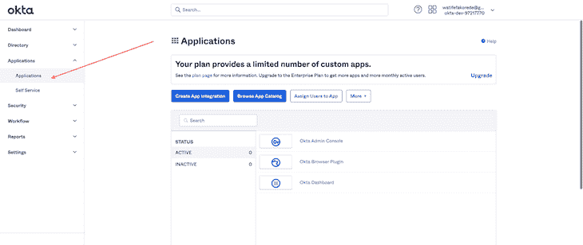
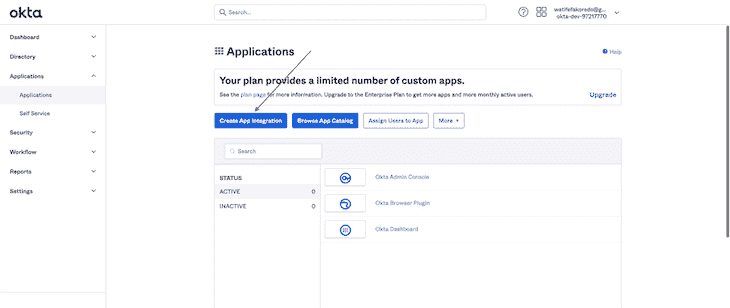
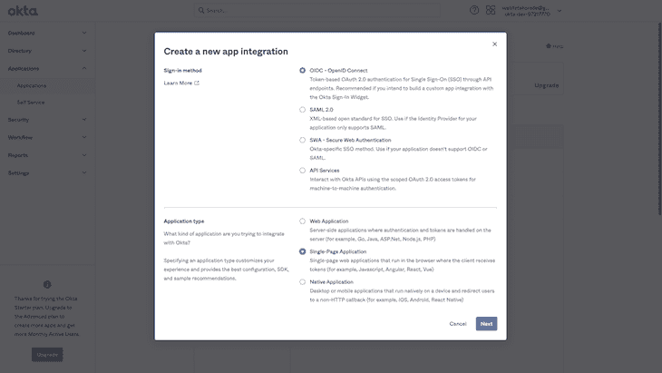
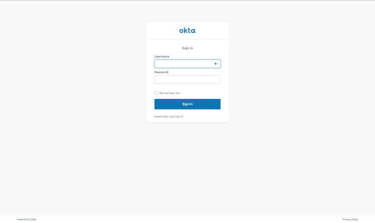
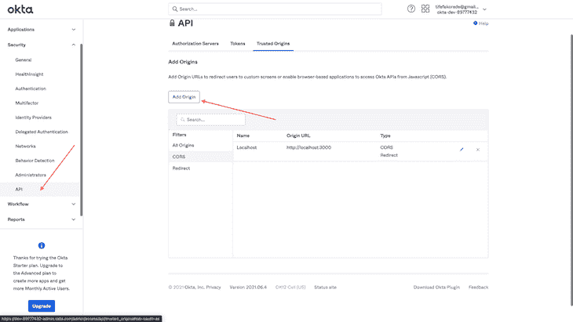

# 在 React app - LogRocket 博客中实现 Okta 认证

> 原文：<https://blog.logrocket.com/implementing-okta-authentication-react-app/>

对于大多数应用程序来说，验证用户的身份是最重要的。建立自己的身份验证系统起初可能很简单，但是当您考虑安全桥梁以及与第三方(如谷歌或脸书)集成的便利性时，您会发现构建和维护自己的身份验证系统会变得非常繁琐和复杂。

一个好的方法是使用专门处理认证的解决方案，比如 Okta。Okta 为您提供了一个专门的安全专家团队，因此您不必担心管理用户数据的麻烦。

在本教程中，我们将向您展示如何在 React 中实现 Okta 认证。为了跟上进度，您应该熟悉 JavaScript 和 [React 钩子](https://blog.logrocket.com/react-hooks-the-good-the-bad-and-the-ugly/)。

## 设置 React 应用程序

第一个要求是[报名 Okta](https://developer.okta.com/signup/) 的开发者版。这使我们可以访问[管理仪表板](https://developer.okta.com/login/)，在这里我们将创建登录方法和应用程序类型——在我们的例子中，是一个单页应用程序(SPA)。



Application route to begin integration with Okta.

在应用路线下，我们可以生成一个 app 集成(我们的签到方式)。



App integration button to select sign-in method.

点击**创建应用程序集成**按钮，会生成一个包含登录方法的对话框。因为我们的应用程序是一个 SPA，我们没有连接到后端，所以我们将使用 OpenID Connect 登录方法，它为我们提供了一个登录小部件(我们稍后还将构建自己的自定义登录表单)。



选择应用程序集成后，我们要选择**单页应用程序**并继续。

下一步是指定一个登录重定向 URI(一个回调 URI)。这一点非常重要，因为当使用 OpenID Connect 登录方法时，我们被重定向到 Okta 托管的登录小部件(与我们的应用程序不同的端点),并且需要一个回调 URL，Okta 通过这个 URL 将用户的详细信息返回到我们的应用程序。

您还可以指定其他路径，例如注销重定向 URI，这是当我们注销应用程序时，应用程序应该被重定向到的页面。对于我们的用例，我们可以指定基本 URL/登录路由作为我们的注销端点，这意味着用户被重定向到登录页面或登录页面，这取决于我们指定的端点。如果不指定端点，用户将被重定向到 Okta 登录小部件

URI 基地是可选的。如果您计划自己托管 Okta 登录小部件，这是很有用的，但是超出了本教程的范围。

## 与 React 集成

现在，我们已经准备好了应用程序与 Okta 的集成，让我们将它与 React 应用程序集成。

在处理这种集成时，要特别注意客户端 ID 和 Okta 域，它们都可以在**应用程序**选项卡中找到。

第一步是安装 Okta SDK 和 Okta Auth JavaScript SDK:

```
# yarn
yarn add @okta/okta-auth-js @okta/okta-react

# npm
npm install --save @okta/okta-auth-js @okta/okta-react

```

让我们为 Okta 配置数据创建环境变量(以`.env`文件的形式)。

```
OKTA_DOMAIN=<YOUR_OKTA_DOMAIN>
CLIENT_ID=<YOUR_CLIENT_ID>
CALLBACK_PATH='/login/callback'
ISSUER='https://<YOUR_OKTA_DOMAIN>/oauth2/default'
HOST='window.location.host'
SCOPES='openid profile email'

```

现在我们可以配置我们的应用程序来使用 Okta。

```
import React from "react";
import { BrowserRouter as Router, Route, useHistory } from "react-router-dom";
import { Security, SecureRoute } from "@okta/okta-react";
import { OktaAuth, toRelativeUrl } from "@okta/okta-auth-js";
import { LandingPage } from "./LandingPage";
import { Dashboard } from "./Dashboard";
import { Header } from "./Header";
const CLIENT_ID = process.env.CLIENT_ID;
const CALLBACK_PATH = process.env.CALLBACK_PATH;
const ISSUER = process.env.ISSUER;
const HOST = process.env.HOST;
const REDIRECT_URI = `http://${HOST}${CALLBACK_PATH}`;
const SCOPES = process.env.SCOPES;

if (!SCOPES || !CLIENT_ID || !CALLBACK_PATH || !ISSUER || !HOST) {
  throw new Error("All environmental variables must be set");
}

const config = {
  issuer: ISSUER,
  clientId: CLIENT_ID,
  redirectUri: REDIRECT_URI,
  scopes: SCOPES.split(/\s+/),
};

const oktaAuth = new OktaAuth(config);

const App = () => {
  const history = useHistory();
  const restoreOriginalUri = async (_oktaAuth: any, originalUri: any) => {
    history.replace(toRelativeUrl(originalUri || "/", window.location.origin));
  };
  return (
    <Router>
      <Security restoreOriginalUri={restoreOriginalUri} oktaAuth={oktaAuth}>
        <Header />
        <Route path="/" exact={true} component={LandingPage} />
        <SecureRoute path="/dashboard" exact={true} component={Dashboard} />
      </Security>
    </Router>
  );
};

export default App;

```

用配置对象创建一个新的`oktaAuth`实例。这被传递到安全组件中，该组件包装了我们应用程序的所有路由，并向它的所有子组件(路由中的组件)提供了`oktaAuth`和`authState`对象。

对象可以用来改变或读取认证状态的信息。

`authState`对象包含:

*   `isAuthenticated`，一个布尔值，表示用户是否通过身份验证。如果`idToken`和`accessToken`出现在`tokenManager`中，则该值为真
*   `accessToken`，分配给当前认证用户的 JWT 访问令牌
*   `idToken`，分配给当前认证用户的 JWT ID 令牌
*   `error`，认证过程失败时返回

还要注意，我们不需要处理一个`SecureRoute ourselves`；Okta 为此提供了一个开箱即用的路由，它保护了指定的路径。

让我们实现一个登录按钮来触发登录小部件。这在 header 组件中很常见，所以我们将在那里处理它。

我们提供了一个`useOktaAuth`钩子，它让我们可以访问`oktaAuth`和`authState`对象。

```
import React from "react";
import { useOktaAuth } from "@okta/okta-react";

function Header() {
  const { authState, oktaAuth } = useOktaAuth();
  const loginWithRedirect = () =>
    oktaAuth.signInWithRedirect({ originalUri: "/dashboard" });
  const logOut = () => oktaAuth.signOut();

  const buttonText = authState.isAuthenticated ? "Logout" : "Login";
  const btnLogic = authState.isAuthenticated ? logOut : loginWithRedirect;

  return (
    <>
      <div>Okta React</div>
      <button onClick={btnLogic}>{buttonText}</button>
    </>
  );
}

export { Header };

```

我们使用`authState`来确定我们是否想要登录或退出我们的应用程序。

`loginWithRedirect`函数处理登录触发器，并在成功登录时重定向回仪表板路由，如下所示:



登录后，用户会立即被重定向到仪表板路由。

为了让注销功能在 localhost 中工作，我们需要将 localhost 添加到可信路由列表中。这将允许在我们的应用程序中交叉起源。



现在，如果我们单击标题中的注销按钮，它会成功地将我们的用户注销，并将他们重定向到登录页面。

我们成功了！我们已经在 React 应用程序中成功实现了 Okta 认证。

## 自定义登录表单

Okta 登录界面很好，也很容易上手，但是假设我们想要实现一个具有独特设计的自定义登录表单，并且让我们的用户保持在页面上，而不重定向到 Okta。

我们可以用调用`useOktaAuth`钩子时提供的`oktaAuth`来实现这一点。

让我们实现一个自定义的登录表单:

```
import React from "react";
import { useOktaAuth } from "@okta/okta-react/bundles/types";

function SignIn() {
  const { oktaAuth } = useOktaAuth();
  const [sessionToken, setSessionToken] = React.useState<string | null>(null);

  const onSubmit = (event: React.SyntheticEvent<HTMLFormElement>) => {
    event.preventDefault();

    const username = event.currentTarget.elements.namedItem(
      "username"
    ) as HTMLInputElement;
    const password = event.currentTarget.elements.namedItem(
      "password"
    ) as HTMLInputElement;

    const data = {
      username: username.value,
      password: password.value,
    };

    oktaAuth
      .signInWithCredentials(data)
      .then((res) => {
        const sessionToken = res.sessionToken;
        if (!sessionToken) {
          throw new Error("authentication process failed");
        }
        setSessionToken(sessionToken);
        oktaAuth.signInWithRedirect({
          originalUri: "/dashboard",
          // @ts-ignore
          sessionToken: sessionToken,
        });
      })
      .catch((err) => console.log("handle error here": err));
  };

  if (sessionToken) return <div />;

  return (
    <div>
      <form onSubmit={onSubmit}>
        <label htmlFor="username">Username</label>
        <input type="text" id="username" />
        <label htmlFor="password">Password</label>
        <input type="password" id="password" />
        <button type="submit">SignIn</button>
      </form>
    </div>
  );
}
export { SignIn };

```

我们有自己的表单，我们正在利用`oktaAuth`中的`signInWithCredentials`选项来处理自定义表单提交。`sessionToken`是一个一次性令牌，是身份验证成功后收到的值。当调用`useOktaAuth`钩子时，我们仍然可以通过在`authState`对象中提供的 ID 或访问令牌获得详细信息。

成功登录后，我们可以使用`signInWithRedirect`功能将用户发送到原来的 URI(主要是受保护的仪表板路线),还包括`sessionToken`。

让我们运行我们的应用程序，连接登录按钮以重定向到这个登录表单端点，并更新我们的路由:

```
import React from "react";
import { useOktaAuth } from "@okta/okta-react";
import { Link } from "react-router-dom";

function Header() {
  const { authState, oktaAuth } = useOktaAuth();

  if (!authState) return null;

  const logOutRedirect = async () => await oktaAuth.signOut();

  function btnToRender() {
    return authState.isAuthenticated ? (
      <button onClick={logOutRedirect}>LogOut</button>
    ) : (
      <button>
        <Link to="/login">Login</Link>
      </button>
    );
  }

  return (
    <>
      <div>Okta React</div>
      {btnToRender()}
    </>
  );
}
export { Header };

```

路线更新如下所示:

```
<Security restoreOriginalUri={restoreOriginalUri} oktaAuth={oktaAuth}>
  <Header />
  <Route path="/" exact={true} component={LandingPage} />
  <Route path="/login" component={SignIn} />
  <SecureRoute path="/dashboard" exact={true} component={Dashboard} />
  <Route path={CALLBACK_PATH} component={LoginCallback} />
</Security>

```

现在，当我们点击登录按钮时，我们被重定向到登录页面。

恭喜你！你已经成功地用 Okta 在 React 应用中实现了一个定制的登录屏幕。

## 结论

用户数据是非常敏感的信息，如果泄露会导致严重的隐私问题。在本教程中，我们向您展示了如何在带有 Okta 的 React 应用程序中实现一种更安全的方式来处理身份验证。

对于不构建后端服务的前端开发人员来说——考虑到 Jamstack 和 serverless 等框架的兴起，这些框架使您能够在没有实际 API 服务器的情况下构建应用程序——Okta 提供了一种在 React 应用程序中实现身份验证的好方法，而不会带来过多的复杂性。

## 使用 LogRocket 消除传统反应错误报告的噪音

[LogRocket](https://lp.logrocket.com/blg/react-signup-issue-free)

是一款 React analytics 解决方案，可保护您免受数百个误报错误警报的影响，只针对少数真正重要的项目。LogRocket 告诉您 React 应用程序中实际影响用户的最具影响力的 bug 和 UX 问题。

[ ](https://lp.logrocket.com/blg/react-signup-general) [  ](https://lp.logrocket.com/blg/react-signup-general) [LogRocket](https://lp.logrocket.com/blg/react-signup-issue-free)

自动聚合客户端错误、反应错误边界、还原状态、缓慢的组件加载时间、JS 异常、前端性能指标和用户交互。然后，LogRocket 使用机器学习来通知您影响大多数用户的最具影响力的问题，并提供您修复它所需的上下文。

关注重要的 React bug—[今天就试试 LogRocket】。](https://lp.logrocket.com/blg/react-signup-issue-free)