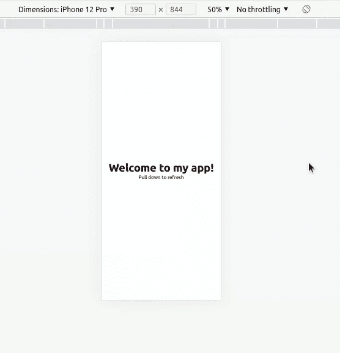
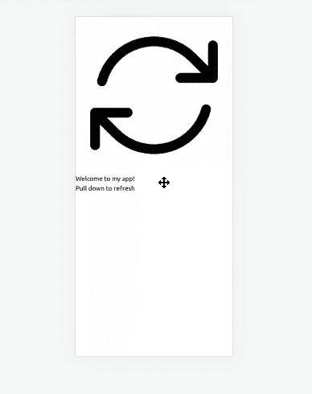

# 在 React with Tailwind CSS 中实现拉至刷新

> 原文：<https://blog.logrocket.com/implementing-pull-to-refresh-react-tailwind-css/>

我们中的许多人可能已经被社交媒体上特别迷人的视频和帖子吸引住了，不想停止滚动。当媒体算法开始推荐不太吸引人的帖子时，你的最佳选择可能是滑动下拉屏幕，这将启动一个检索新建议数据或帖子的手势。如果这没有引起你的注意，你可以在某些情况下重复这个过程，直到算法令你满意。

开始检索下一篇有趣文章的手势是“拉至刷新”,我们将在整篇文章中讨论。

*向前跳转:*

## 什么是拉式更新？

当用户从页面顶部拖动时，应该会出现一个加载器，此时应该只在顶部屏幕下方一点处可见。整个操作向用户表明正在检索新数据。

当用户放开触摸触发的拖动时，加载器消失，同时，新的数据应该出现在提要中。在文章的最后，我们应该有类似下面的 GIF 的东西:



这个动作是通过拖动页面顶部来执行的，如果有新的更新，它会立即显示出来。滑动或拉动使得检索信息变得容易；这个动作是由 Loren Brichter 于 2008 年在 Tweetie 应用程序中创建的，它像任何优秀的东西一样迅速流行起来。

### 拉动式更新的优势

许多智能手机应用程序都使用拉至刷新手势，这并不新鲜。他们这样做的原因如下:

*   此操作减少了屏幕混乱并释放了空间
*   它为查看来自服务器的新数据提供了空间

CSS 属性决定了当浏览器接近滚动区的底部或顶部边缘时会做什么。默认情况下，移动浏览器倾向于在到达页面顶部时刷新页面。在大多数情况下，作为打算实现自定义拉至刷新的开发人员，这种默认行为是不可取的，因此您可以使用 overscroll 行为来覆盖浏览器的默认拉至刷新手势。

下面的代码是来自 [MDN 文档](https://developer.mozilla.org/en-US/docs/Web/CSS/overscroll-behavior)的 overscroll 行为的一般实现:

```
/* Keyword values */
overscroll-behavior: auto; /* default */
overscroll-behavior: contain;
overscroll-behavior: none;

/* Two values */
overscroll-behavior: auto contain;

/* Global values */
overscroll-behavior: inherit;
overscroll-behavior: initial;
overscroll-behavior: revert;
overscroll-behavior: revert-layer;
overscroll-behavior: unset;

```

在我们构建自己的浏览器时，为了覆盖浏览器内置的拉刷新手势，我们将使用`overscroll-behavior: contain`；财产。然而，因为我们的目标是滚动区域的垂直边缘，所以这里的`overscroll-behavior`将是`overscroll-behavior-y: contain`。

为了使用它，我们将在我们的`index.css`文件中赋予通用选择器`overscroll-behavior-y: contain`属性，这就是全部:

```
* {
  overscroll-behavior-y: contain;
}

```

## 项目概述

我们在开发上投入大量时间的原因是为了确保我们的最终用户完全满意。拉至刷新手势旨在始终保持一致。尽管动画和 SVG 风格可能需要独特性，但拖动刷新手势本身应该允许用户在需要时进行刷新。

本文将关注在 CSS 中使用 React 和 overscroll 行为实现自定义的拉至刷新手势。自定义的拉至刷新手势应该出现在我们的移动浏览器的顶部，只有当用户滚动页面边框时才可见。

### 先决条件

您必须满足这些要求才能正确地阅读本文:

*   安装了一个 [Node.js](https://nodejs.org/en/) 的副本
*   JavaScript 语法的基础知识
*   反应钩和反应钩[的工作抓爪](https://reactjs.org/)
*   熟悉 CLI 及其命令
*   熟悉[顺风 CSS](https://tailwindcss.com/)

## 建立我们的开发区

要启动并运行我们的开发区域，打开您的终端并运行命令:

```
cd Desktop
npx create-react-app pull-to-refresh
npm start

```

要安装 Tailwind，[请遵循文档中的这些步骤](https://v1.tailwindcss.com/docs/installation)。此时，我们的应用程序应该已经启动并运行了，您应该清除`app.js`文件以重新开始。

## 使用 React 实施拉至刷新

为了能够实现拉至刷新手势，我们必须首先认识到，在第一次触摸之前，这个手势是不完整的；然后向下一扫，就是拖拽；然后拖到最后。这些动作是用我们称之为`[EventListeners](https://developer.mozilla.org/en-US/docs/Web/API/EventTarget/addEventListener)`的东西来实现的，每当一个动作被提交到浏览器窗口时就会被调用。

有几个不同的`EventListeners`，但只有三个能完成任务。这三个是:

1.  `touchstart`
2.  `touchmove`
3.  `touchend`

只有在感应到第一次触摸时才会触发。`touchmove`将在触摸后移动或拖动时触发。最后，当窗口/屏幕上不再记录触摸时，将触发`touchend`。

`useEffect`钩子将负责添加和删除我们的事件监听器。导入`useEffect()`后，我们可以将下面的代码复制并粘贴到我们的`App.js`文件中:

```
// add and remove event listeners
  useEffect(() => {
    window.addEventListener("touchstart", pullStart);
    window.addEventListener("touchmove", pull);
    window.addEventListener("touchend", endPull);
    return () => {
      window.removeEventListener("touchstart", pullStart);
      window.removeEventListener("touchmove", pull);
      window.removeEventListener("touchend", endPull);
    };
  });

```

由于我们处理的是拉动手势，因此不可避免地会有触摸触发拉动手势。因此，我们首先关注的是有一个状态来存储用户对屏幕顶部的第一次触摸。

### 设置`startPoint`和`pullChange`

首先，我们将设置`startPoint`，这是一个当用户的初始触摸被注册时保存`startPoint`的`[screenY](https://developer.mozilla.org/en-US/docs/Web/API/Window/screenY)`值的状态。

为了创建状态，我们需要首先导入`useState()`并使用钩子声明一个状态。

```
  /**
    state to hold the start point
  */
    const [startPoint, setStartPoint] = useState(0);

```

我们要做的下一件事是创建一个状态，该状态将计算用户将屏幕向下拉了多远——这将是保存从起点到当前点的变化的状态。拉动变化将等同于`current point - start point`；因此，我们将这种状态称为`pullChange`。当前点是用户能够从`startPoint`拖动的地方。

```
/**
   * 
    state to hold the change in the start point and current point
    the pull change is equivalent to current point - start point
  */
  const [pullChange, setPullChange] = useState();

```

然后我们需要一个`ref`来定位 DOM 中的`.Refresh-container`元素。我们可以通过首先[从 React](https://blog.logrocket.com/complete-guide-react-refs/) 导入`useRef()`并声明它来实现，如下所示:

```
 /**
    ref to target the `.refresh-container` element in the DOM
   */
    const refreshCont = useRef(0);

```

### 强制刷新

我们还需要一个函数来初始化加载，并强制页面在一秒钟内刷新。现在是创建名为`initLoading`的函数的时候了，该函数将`.loading`类添加到刷新容器元素中，以表示加载状态。我们还需要一个`setTimeout`功能，它将在 1000 毫秒后重新加载页面。

```
const initLoading = () => {
  refreshCont.current.classList.add("loading");
  setTimeout(() => {
    window.location.reload();
  }, 1000);
};

```

现在，我们需要一个函数来监听起点状态并处理我们的`touchstart`事件。我们将这个函数称为`pullStart`。这个函数获取用户触摸手势的起点和拉动起点，它只在你第一次触摸屏幕时运行——所以这个函数对于获取起点位置非常有用。

```
const pullStart = (e) => {
  const { screenY } = e.targetTouches[0];
  setStartPoint(screenY);
};

```

如上面的`useEffect()`钩子所示，当你的手指在屏幕上移动时，拉动功能将运行。当您从顶部向下移动到屏幕中间时，它会计算当前位置和起始位置之间的差异，并将其保存到我们的`pullChange`函数中。

```
const pull = (e) => {
  /**
   * get the current user touch event data
   */
  const touch = e.targetTouches[0];
  /**
   * get the touch position on the screen's Y axis
   */
  const { screenY } = touch;
  /**
   * The length of the pull
   *
   * if the start touch position is lesser than the current touch position, calculate the difference, which gives the `pullLength`
   *
   * This tells us how much the user has pulled
   */
  let pullLength = startPoint < screenY ? Math.abs(screenY - startPoint) : 0;
  setPullChange(pullLength);
  console.log({ screenY, startPoint, pullLength, pullChange });
};

```

如上面的`useEffect`所示，`endPull`是在触摸手势结束时运行的功能。

```
, endPull = (e) => {
  setStartPoint(0);
  setPullChange(0);
  if (pullChange > 220) initLoading();
};

// function to reset the refresh button and start the loading by running the `initLoading()` function when `pullChange` has passed a certain threshold
```

## 使用顺风 CSS 和编写逻辑的样式

下面，我们用顺风设计了 DOM。我们在`div`容器中有我们的 ref，我们的`margin-top`将被分配给`pullChange()`，它被除以一个任意值，这使得拖动比正常情况下慢。

`margin-top`负责下推我们的刷新容器。在我们的 SVG 中，我们还有我们的 spinner。在样式化我们的旋转器之后，我们看到`rotate`函数与`pullChange`一起:旋转器在被拉动时旋转，当它被释放时，它将添加`.loading`类。

```
//Before Tailwind
 <div
        ref={refreshCont}
        className=""
        style={{ marginTop: pullChange / 3.118 || "" }}
      >
        <div className="">
          <svg

            fill="none"
            viewBox="0 0 24 24"
            strokeWidth={1.5}
            stroke="currentColor"
            className=""
            style={{ transform: `rotate(${pullChange}deg)` }}
          >
            <path
              strokeLinecap="round"
              strokeLinejoin="round"
              d="M16.023 9.348h4.992v-.001M2.985 19.644v-4.992m0 0h4.992m-4.993 0l3.181 3.183a8.25 8.25 0 0013.803-3.7M4.031 9.865a8.25 8.25 0 0113.803-3.7l3.181 3.182m0-4.991v4.99"
            />
          </svg>
        </div>
      </div>
      <div className="">
        <header className="">
          <h1 className="">Welcome to my app!</h1>
          <p>Pull down to refresh</p>
        </header>
      </div>

```



```
//After Tailwind
<div
ref={refreshCont}
className="refresh-container w-fit -mt-10 m-auto"
style={{ marginTop: pullChange / 3.118 || "" }}
>
<div className="refresh-icon p-2 rounded-full">
  <svg

    fill="none"
    viewBox="0 0 24 24"
    strokeWidth={1.5}
    stroke="currentColor"
    className="w-6 h-6"
    style={{ transform: `rotate(${pullChange}deg)` }}
  >
    <path
      strokeLinecap="round"
      strokeLinejoin="round"
      d="M16.023 9.348h4.992v-.001M2.985 19.644v-4.992m0 0h4.992m-4.993 0l3.181 3.183a8.25 8.25 0 0013.803-3.7M4.031 9.865a8.25 8.25 0 0113.803-3.7l3.181 3.182m0-4.991v4.99"
    />
  </svg>
</div>
</div>
<div className="body flex justify-center items-center min-h-screen">
<header className="flex flex-col text-center">
  <h1 className="text-4xl font-bold">Welcome to my app!</h1>
  <p>Pull down to refresh</p>
</header>
</div>

```

如果仔细并有意识地遵循每一步，我们应该会得到如下 GIF 所示的结果:


## 结论

这个手势至关重要，因为它增加了一长串功能，让用户可以与应用程序完全交互。在本教程中，我们一步一步地讲述了如何实现拉至刷新；这是一个快速、天衣无缝的过程，结果工作做得很好。我想借此机会表达我的感激之情，感谢你一直以来对我的支持。

## [LogRocket](https://lp.logrocket.com/blg/react-signup-general) :全面了解您的生产 React 应用

调试 React 应用程序可能很困难，尤其是当用户遇到难以重现的问题时。如果您对监视和跟踪 Redux 状态、自动显示 JavaScript 错误以及跟踪缓慢的网络请求和组件加载时间感兴趣，

[try LogRocket](https://lp.logrocket.com/blg/react-signup-general)

.

[ ](https://lp.logrocket.com/blg/react-signup-general) [](https://lp.logrocket.com/blg/react-signup-general) 

LogRocket 结合了会话回放、产品分析和错误跟踪，使软件团队能够创建理想的 web 和移动产品体验。这对你来说意味着什么？

LogRocket 不是猜测错误发生的原因，也不是要求用户提供截图和日志转储，而是让您回放问题，就像它们发生在您自己的浏览器中一样，以快速了解哪里出错了。

不再有嘈杂的警报。智能错误跟踪允许您对问题进行分类，然后从中学习。获得有影响的用户问题的通知，而不是误报。警报越少，有用的信号越多。

LogRocket Redux 中间件包为您的用户会话增加了一层额外的可见性。LogRocket 记录 Redux 存储中的所有操作和状态。

现代化您调试 React 应用的方式— [开始免费监控](https://lp.logrocket.com/blg/react-signup-general)。