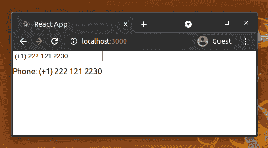
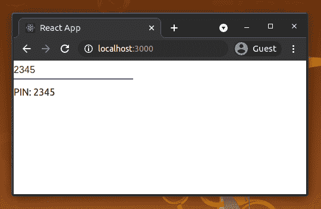

# 为 web 应用程序实现反应输入屏蔽

> 原文：<https://blog.logrocket.com/implementing-react-input-mask-web-apps/>

现代 web 应用程序接受各种用户输入:鼠标点击、屏幕点击和键盘事件、手势、音频和文件。

几乎所有的 web 应用程序都使用键盘事件来捕获详细的用户输入数据。换句话说，用户可以使用设备的键盘向典型的 web 应用程序输入所需的数据。例如，用户可以在特定 web 应用程序的注册过程中输入姓名、电话号码、邮政编码和电子邮件地址，然后这些信息被传送到后端。

每个用户都不一样。当涉及到表单填写时，他们可能有独特的做法，并且他们经常尝试在输入字段中使用各种格式。例如，如果一个特定的 web 应用程序显示一个原始文本输入字段来获取一个电话号码，用户可能会面临几个可用性问题，比如当他们键入时不能预测输入字段的可接受格式。

为了避免这类问题，可以使用输入掩码为特定的用户输入字段提供用户友好的约束。在本文中，我将解释如何在 React 应用程序中使用输入屏蔽[。](https://blog.logrocket.com/tag/react/)

## 什么是输入屏蔽？

在用户体验(UX)设计中，输入掩码是指基于特定输入格式创建的字符串模板，用于防止[转录错误](https://en.wikipedia.org/wiki/Transcription_error)。如果用户试图输入无效字符，被屏蔽的输入元素会阻止无效的击键。例如，用户将无法在屏蔽的电话号码字段中输入英文字母。

前端开发人员可以使用输入掩码来帮助确保干净有效的用户输入被发送到他们的 web 应用程序后端。同时，输入掩码激励用户输入干净、正确的输入。

## React 应用中的输入屏蔽

我们可以使用几个库在 React 中创建输入掩码。 [`react-input-mask`库](https://www.npmjs.com/package/react-input-mask)是最受欢迎的一个，它为开发者提供了非常灵活的 API。另外，它的行为遵循了 UX 友好的设计模式。

您可以在新的 React 项目中测试本教程的代码片段，也可以在现有项目中使用它们。如果您要从一个新项目开始，请使用以下命令创建一个新项目:

```
npx create-react-app input-masking
```

接下来，安装`react-input-mask` npm 包，在 React 应用程序中创建输入掩码。

```
npm install react-input-mask --save

```

现在，让我们试着为一个电话号码创建一个简单的屏蔽输入框来检查这个库是否工作。将以下代码添加到您的`App.js`文件或组件中。

```
import { useState } from 'react';
import InputMask from 'react-input-mask';
function PhoneInput(props) {
  return (
    <InputMask 
      mask='(+1) 999 999 9999' 
      value={props.value} 
      onChange={props.onChange}>
    </InputMask>
  );
}
function App() {
  const [phone, setPhone] = useState('');
  const handleInput = ({ target: { value } }) => setPhone(value);
  return (
    <div>
      <PhoneInput 
        value={phone} 
        onChange={handleInput}>
      </PhoneInput>
      <div style={{paddingTop: '12px'}}>Phone: {phone}</div>
    </div>
  );
}
export default App;

```

如果使用`npm start`或`yarn start`启动 React development server，您将看到一个屏蔽输入，用于输入一个标准的美国电话号码(以+1 拨号代码开头)，如下所示:



A simple example for masked input in React.

我们实现了一个可重用的组件，用库的`InputMask`组件接受电话号码。该库的通用遮罩组件响应以下 React 道具:

*   `mask`:用户输入的模板，带有预定义的特殊字符——`9`匹配数字，`a`匹配字母，`*`匹配数字或字母
*   `maskChar`:该字符可以用来填充输入字符串中缺少的部分；默认值是`_`(下划线)
*   `formatChars`:您可以通过更改该属性来更改用于屏蔽的默认字符和正则表达式(在`mask`属性中)
*   `alwaysShowMask`:当用户聚焦屏蔽输入时，库通常显示屏蔽；如果您总是想要显示遮罩，请将此属性设置为`true`

像任何其他典型的输入元素一样，我们可以使用`onChange`事件根据用户输入改变组件状态。

## 基本`react-input-mask`示例

输入屏蔽概念可以用在许多不同的场景中，以增强 web 应用程序的用户友好性。查看以下基本掩蔽示例。

### 4 位数 PIN

```
function PINInput(props) {
  return (
    <InputMask 
      mask='9999' 
      value={props.value} 
      onChange={props.onChange}
      placeholder='Enter PIN'>
    </InputMask>
  );
}

```

### 谷歌风格的 OTP

```
function GoogleOTP(props) {
  return (
    <InputMask 
      mask='G-999999' 
      maskChar={null}
      value={props.value} 
      onChange={props.onChange}>
    </InputMask>
  );
}

```

### 标准信用卡

```
function CreditCardInput(props) {
  return (
    <InputMask 
      mask='9999 9999 9999 9999' 
      value={props.value} 
      onChange={props.onChange}>
    </InputMask>
  );
}

```

### 简单的日期输入

格式:日-月-年

```
function DateInput(props) {
  return (
    <InputMask
      mask='99-99-9999'
      placeholder='DD-MM-YYYY'
      value={props.value}
      onChange={props.onChange}>
    </InputMask>
  );
}

```

格式:年-月-日

```
function DateInput(props) {
  return (
    <InputMask
      mask='9999-99-99'
      placeholder='YYYY-MM-DD'
      value={props.value}
      onChange={props.onChange}>
    </InputMask>
  );
}

```

上面屏蔽的输入提供了一个简单的日期输入，具有最小的约束。它只接受年、月和日的数字，但它接受无效的用户输入，如 2020–50–50。由于后端验证和用户对标准日历的了解，大多数屏蔽日期输入都是这样实现的。

但是，我将在接下来的高级屏蔽示例部分解释如何从日期输入屏蔽中屏蔽无效日期。

## 高级`react-input-mask`示例

上述示例使用内置正则表达式进行屏蔽。例如，四位 PIN 的掩码使用`9`来匹配数字。

然而，我们不能用这些预定义的正则表达式实现每个屏蔽规则。换句话说，我们需要用不同的正则表达式定义自定义屏蔽字符。在某些场景中，我们还需要动态掩码，用户的输入将指导他们在字段中输入的后续字符的约束。

下面，我们将看看一些使用自定义掩码字符和条件掩码的高级示例。

### 定制产品代码

假设您需要实现一个掩码来捕获用 React 编写的杂货店管理应用程序中的有效产品代码。让我们这样定义有效产品代码的规则:

*   每个产品代码都以`P`(单个产品)或`K`(套件)开头
*   产品代码的其余部分由四个偶数组成

我们需要定义自定义屏蔽字符来实现上述规则。检查以下代码。

```
const MaskedInput = (props) => {
  // Defining custom masking characters
  // P will match P or K
  // 0 (zero) will match even digits
  const formatChars = {
    'P': '[PK]',
    '0': '[02468]'
  };
  return (<InputMask 
    mask='P0000' 
    value={props.value} 
    onChange={props.onChange}
    formatChars={formatChars}
    placeholder='Eg: P2266'>
  </InputMask>)
};

```

### 时间输入

假设您需要要求用户使用`hh:mm`格式输入时间。时间输入掩码的简单实现可以使用`99:99`掩码，但是用户仍然可以输入一些无效的时间条目，例如`59:10`、`08:65`等。

输入掩码通常是指具有特定格式的字符串输入，与严格验证无关。但是，我们可以基于用户输入应用条件屏蔽来改进这些场景。

例如，我们只能接受第一个掩码字符位置的数字`0`、`1`和`2`。之后，我们可以根据用户输入的第一个数字更改第二个掩码字符的逻辑。

看看下面使用条件屏蔽的代码。

```
function TimeInput(props) {
  let mask = '12:34';
  let formatChars = {
    '1': '[0-2]',
    '2': '[0-9]',
    '3': '[0-5]',
    '4': '[0-9]'
  };

  let beforeMaskedValueChange = (newState, oldState, userInput) => {
    let { value } = newState;

    // Conditional mask for the 2nd digit base on the first digit
    if(value.startsWith('2'))
      formatChars['2'] = '[0-3]'; // To block 24, 25, etc.
    else
      formatChars['2'] = '[0-9]'; // To allow 05, 12, etc.
    return {value, selection: newState.selection};
  }
return (
    <InputMask 
      mask={mask}
      value={props.value} 
      onChange={props.onChange}
      formatChars={formatChars}
      beforeMaskedValueChange={beforeMaskedValueChange}>
    </InputMask>
  );
}

```

在用最近的用户输入更新屏蔽的输入字段之前，将触发`beforeMaskedValueChange`事件。这意味着我们可以用它来动态地改变遮罩。

* * *

### 更多来自 LogRocket 的精彩文章:

* * *

### 改进的数据输入

在前面的简单日期输入示例中，我们使用默认格式字符`9`作为掩码。这些实现为用户输入日期提供了正确的输入掩码，但是它们不提供严格的验证。因此，我们可以像前面的时间输入一样实现日期掩码的验证。

#### 格式 YYYY-MM-DD 输入

我们将通过添加以下验证规则来改进日期输入掩码:

*   月份部分只接受第一位数字的`0`和`1`。如果用户输入 0，第二位数字允许在`1`和`9`之间的任意数字。如果用户输入了`1`，用户只能输入`0`和`2`之间的数字作为第二个数字的位置
*   日期部分接受基于用户输入的月份的最后一天的数字。例如，如果用户输入`2022-02`，屏蔽输入只接受从`01`到`28`的整数作为日期部分，因为 2022 年 2 月的最后一天是`28`

我们可以用 react-input-mask 库 API 实现上面的验证规则，如下所示。

```
import { useState } from 'react';
import InputMask from 'react-input-mask';

function TimeInput(props) {
  let mask = 'YYYY-mM-dD';
  let formatChars = {
    'Y': '[0-9]',
    'm': '[0-1]',
    'M': '[0-9]',
    'd': '[0-3]',
    'D': '[1-9]'
  };

  let beforeMaskedValueChange = (newState, oldState, userInput) => {
    let { value } = newState;

    let dateParts = value.split('-');
    let yearPart = dateParts[0];
    let monthPart = dateParts[1];
    let dayPart = dateParts[2]

    // Conditional mask for the 2nd digit of month based on the first digit
    if(monthPart.startsWith('1'))
      formatChars['M'] = '[0-2]'; // To block 13, 15, etc.
    else
      formatChars['M'] = '[1-9]'; // To allow 05, 08, etc - but blocking 00.

    // Conditional mask for day
    if(!yearPart.includes('_') && !monthPart.includes('_')) {

      // Find last day of the month
      let endOfMonth = new Date(`${yearPart}-01-01`);
      endOfMonth.setMonth(parseInt(monthPart));
      endOfMonth.setDate(0);
      let lastDayOfMonth = endOfMonth.getDate().toString();

      // Set [0-x] dynamically for the first digit based of last day
      formatChars['d'] = `[0-${lastDayOfMonth[0]}]`;

      if(dayPart.startsWith(lastDayOfMonth[0]))
        formatChars['D'] = `[0-${lastDayOfMonth[1]}]`; // Limit month's last digit based on last day
      else if(dayPart.startsWith('0'))
        formatChars['D'] = '[1-9]'; // To block 00.
      else
        formatChars['D'] = '[0-9]'; // To allow days to start with 1 Eg: 10, 12, 15, etc.
    }

    return {value, selection: newState.selection};
  }
  return (
    <InputMask
      mask={mask}
      value={props.value}
      onChange={props.onChange}
      formatChars={formatChars}
      beforeMaskedValueChange={beforeMaskedValueChange}>
    </InputMask>
  );
}

function App() {
  const [date, setDate] = useState('');
  const handleInput = ({ target: { value } }) => setDate(value);
  return (
    <div>
      <TimeInput
        value={date}
        onChange={handleInput}>
      </TimeInput>
      <div style={{paddingTop: '12px'}}>Date: {date}</div>
    </div>
  );
}
export default App;
```

#### 格式 DD-MM-YYYY 输入

对于 DD-MM-YYYY 日期格式，我们必须输入月份之前的日期。因此，我们无法实现日期数字的正确验证。

作为一个解决方案，我们可以简化验证逻辑，允许日期部分有一个不超过`31`的整数值，而不考虑月份——假设用户知道特定月份的结束日期。看下面的`DD-MM-YYYY`格式的日期掩码验证。

```
import { useState } from 'react';
import InputMask from 'react-input-mask';

function TimeInput(props) {
  let mask = 'dD-mM-YYYY';
  let formatChars = {
    'Y': '[0-9]',
    'd': '[0-3]',
    'D': '[0-9]',
    'm': '[0-1]',
    'M': '[1-9]'
  };

  let beforeMaskedValueChange = (newState, oldState, userInput) => {
    let { value } = newState;

    let dateParts = value.split('-');
    let dayPart = dateParts[0];
    let monthPart = dateParts[1];

    // Conditional mask for the 2nd digit of day based on the first digit
    if(dayPart.startsWith('3'))
      formatChars['D'] = '[0-1]'; // To block 39, 32, etc.
    else if(dayPart.startsWith('0'))
      formatChars['D'] = '[1-9]'; // To block 00.
    else
      formatChars['D'] = '[0-9]'; // To allow 05, 15, 25  etc.

    // Conditional mask for the 2nd digit of month based on the first digit
    if(monthPart.startsWith('1'))
      formatChars['M'] = '[0-2]'; // To block 15, 16, etc.
    else
      formatChars['M'] = '[1-9]'; // To allow 05, 06  etc - but blocking 00.

    return {value, selection: newState.selection};
  }
  return (
   <InputMask
      mask={mask}
      value={props.value}
      onChange={props.onChange}
      formatChars={formatChars}
      beforeMaskedValueChange={beforeMaskedValueChange}>
    </InputMask>
  );
}

function App() {
  const [date, setDate] = useState('');
  const handleInput = ({ target: { value } }) => setDate(value);
  return (
    <div>
      <TimeInput
        value={date}
        onChange={handleInput}>
      </TimeInput>
      <div style={{paddingTop: '12px'}}>Date: {date}</div>
    </div>
  );
}
export default App;
```

## 如何设置输入掩码的样式

`react-input-mask`库使用典型的 HTML 输入呈现屏蔽的输入框。因此，您可以根据需要通过添加 CSS 类来更改样式。如果你想使用另一个组件代替 HTML 输入，比如[材料](https://material.io/components)，实现你的组件如下。

```
import InputMask from 'react-input-mask';
import Input from '@material-ui/core/Input';

const MaskedInput = (props) => (
  <InputMask 
    mask='9999' 
    maskChar={null} 
    value={props.value} 
    onChange={props.onChange}
    placeholder='Enter your PIN'>
    {(inputProps) => <Input {...inputProps} />}
  </InputMask>
);

```

上面的代码片段将 Material input 元素而不是本机 HTML input 元素呈现为屏蔽的 PIN 输入字段。



## 反应-输入-屏蔽备选方案

react-input-mask 库是一个灵活的库，用于创建任何屏蔽的输入。不幸的是，[不再主动维护](https://github.com/sanniassin/react-input-mask/issues/268)，所以使用这个库的开发人员开始寻找替代品。结果，现在有了一个[主动叉](https://github.com/comigotech/react-input-mask)，而且保养得很好。

此外，有几个可供选择的库可以用来代替 react-input-mask。如果您只为数字实现掩码，比如信用卡号、日期、货币值， [react-number-format](https://github.com/s-yadav/react-number-format) 库是一个不错的选择。例如，您可以使用下面的代码片段实现 4 位 PIN 的输入掩码。

```
import NumberFormat from 'react-number-format';

<NumberFormat format="####" mask="_" placeholder="Enter PIN"/>
```

react-maskedinput 库提供了 react-input-mask 拥有的大部分特性，比如动态屏蔽、复制粘贴支持、预定义格式字符等。此外，它还提供了转换用户输入的功能。例如，您可以实现一个只接受大写字母和数字的简单车牌号码掩码，如下所示。

```
import MaskedInput from 'react-maskedinput';

<MaskedInput mask="AAA 1111" placeholder="ABC 1234"/> // A: Auto uppercase letter
```

然而，与 react-maskedinput 相比，react-input-mask 库提供了一种更舒适的方式来处理带有自定义验证的复杂掩码。因此，react-input-mask 适用于复杂和动态的输入掩码。

## 结论

输入屏蔽概念适用于捕获具有特定标准格式的用户输入，例如 IP 地址、信用卡号码、产品代码和 ID 卡号码等。

`react-input-mask`库的维护者[计划发布一个新的稳定版本(3.0 版)](https://github.com/sanniassin/react-input-mask)，并且已经有一个对 API 进行了一些增强和修改的[3.0 alpha 版本](https://www.npmjs.com/package/react-input-mask/v/3.0.0-alpha.2)。下一个稳定版本可能包含他们当前开发分支的实现。我们在本教程中使用了[当前稳定版本(v2.0.4)](https://github.com/sanniassin/react-input-mask/tree/v2) ，因为不推荐任何生产系统使用 alpha 版本依赖。

## [LogRocket](https://lp.logrocket.com/blg/react-signup-general) :全面了解您的生产 React 应用

调试 React 应用程序可能很困难，尤其是当用户遇到难以重现的问题时。如果您对监视和跟踪 Redux 状态、自动显示 JavaScript 错误以及跟踪缓慢的网络请求和组件加载时间感兴趣，

[try LogRocket](https://lp.logrocket.com/blg/react-signup-general)

.

[ ](https://lp.logrocket.com/blg/react-signup-general) [](https://lp.logrocket.com/blg/react-signup-general) 

LogRocket 结合了会话回放、产品分析和错误跟踪，使软件团队能够创建理想的 web 和移动产品体验。这对你来说意味着什么？

LogRocket 不是猜测错误发生的原因，也不是要求用户提供截图和日志转储，而是让您回放问题，就像它们发生在您自己的浏览器中一样，以快速了解哪里出错了。

不再有嘈杂的警报。智能错误跟踪允许您对问题进行分类，然后从中学习。获得有影响的用户问题的通知，而不是误报。警报越少，有用的信号越多。

LogRocket Redux 中间件包为您的用户会话增加了一层额外的可见性。LogRocket 记录 Redux 存储中的所有操作和状态。

现代化您调试 React 应用的方式— [开始免费监控](https://lp.logrocket.com/blg/react-signup-general)。