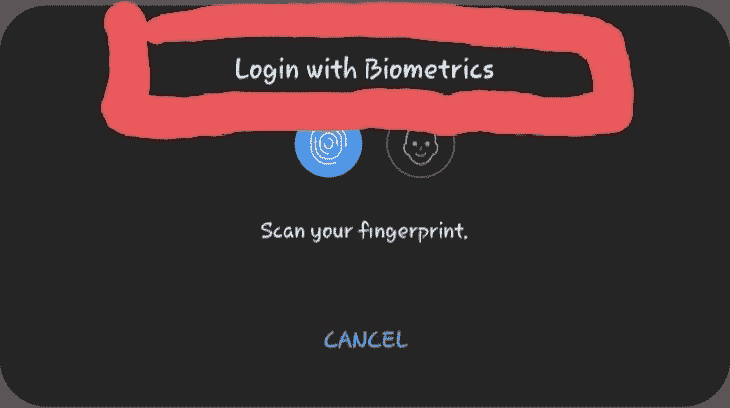
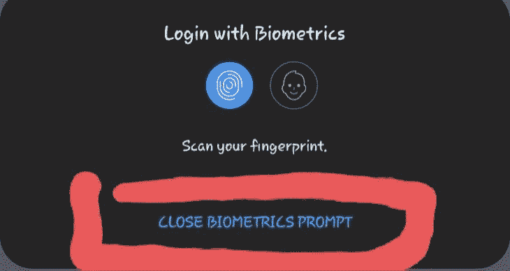
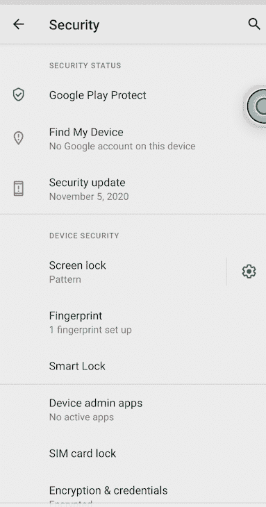
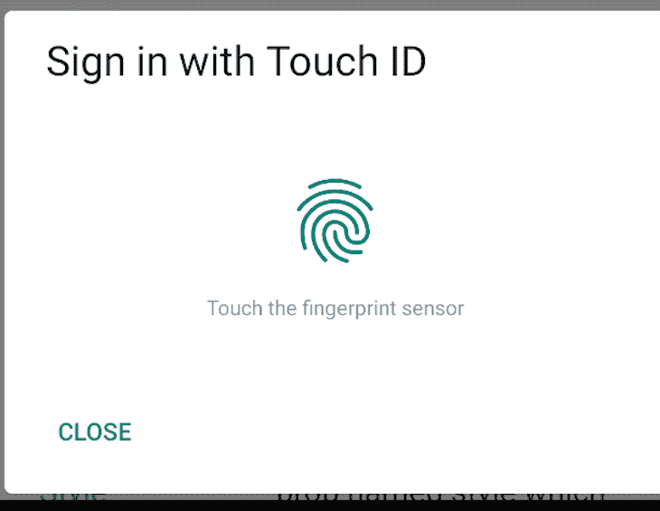

# 用 Expo 实现 React 原生生物认证

> 原文：<https://blog.logrocket.com/implementing-react-native-biometric-authentication-expo/>

***编者的*** ***注*** : *本 React 原生生物识别认证教程最后更新于 2022 年 2 月 11 日；更新了所有过时信息，并添加了使用`react-native-biometrics` 的* *[新章节。](#Using-react-native-biometrics)*

在这个生物认证教程中，我们将向您展示如何在一个基本的 React Native 和 Expo 应用程序中使用 face ID 和 touch ID 来认证用户。

我们将使用 Expo SDK，`expo-local-authentication`，在我们的应用中实现生物认证。这使用平台 API 来访问设备硬件，因此没有机会从设备泄漏任何私人信息。

有了这个 SDK，我们将在 React 本地应用中实现面部识别和指纹扫描的本地身份验证。

在本教程的整个过程中，我们将涵盖:

我们开始吧！

## 什么是生物认证？

生物认证是一种多因素认证(MFA ),它利用从设备用户的生物特征(如面部特征、声音识别和指纹)中获得的数据来保护个人信息和敏感资产。

所有类型的移动应用程序都使用本地生物认证。生物认证最大的优点是它完全在用户的设备中执行，因此没有将敏感数据泄露给第三方 API 的风险。

除了验证用户身份，生物识别还可以作为传统登录方法(如电子邮件/密码)的附加安全层。

## 在 Expo 应用程序中实现生物认证

为了开始我们的教程，让我们回顾一下在世博会应用中安装、导入和设置生物认证[的步骤。我们从一个`expo-local-authentication`例子开始。](https://blog.logrocket.com/?post_type=post&s=expo&orderby=relevance&order=DESC&post_type=post)

### 安装`expo-local-authentication`

首先，运行下面的命令来安装`[expo-local-authentication](https://docs.expo.io/versions/v40.0.0/sdk/local-authentication/)` [库](https://docs.expo.io/versions/v40.0.0/sdk/local-authentication/):

```
// with yarn
yarn add expo-local-authentication

// with npm
npm install expo-local-authentication

```

接下来，通过将下面一行添加到要实现生物特征身份验证的 JavaScript 或 TypeScript 文件来导入包:

```
import * as LocalAuthentication from 'expo-local-authentication'

```

### 检查设备兼容性

首先要检查设备硬件是否支持生物识别。我们将在页面挂载时使用我们刚刚导入的 Expo `LocalAuthentication`包提供的`hasHardwareAsync`方法:

```
// wherever the useState is located 
const [isBiometricSupported, setIsBiometricSupported] = React.useState(false);

// Check if hardware supports biometrics
  useEffect(() => {
    (async () => {
      const compatible = await LocalAuthentication.hasHardwareAsync();
      setIsBiometricSupported(compatible);
    })();
  });

// In our JSX we conditionally render a text to see inform users if their device supports
 <Text> {isBiometricSupported ? 'Your device is compatible with Biometrics' 
    : 'Face or Fingerprint scanner is available on this device'}
        </Text>

```

`hasHardwareAsync`方法返回一个解析为布尔值`hasHardwareAsync(): Promise<boolean>`的承诺，表示用户的设备是否支持生物识别。

对于用户设备上没有生物识别支持的情况，您应该考虑启用替代方法(如密码)来鉴定用户。

### 检查生物特征记录

为了检查生物特征是否保存在用户的设备上，我们将使用`isEnrolledAsync`方法。该方法返回一个解析为布尔值的承诺，`isEnrolledAsync(): Promise<boolean>`:

```
const handleBiometricAuth = async () => {
    const savedBiometrics = await LocalAuthentication.isEnrolledAsync();
      if (!savedBiometrics)
      return Alert.alert(
        'Biometric record not found',
        'Please verify your identity with your password',
        'OK',
        () => fallBackToDefaultAuth()
      );
}

```

请注意，当用户设备上没有面部识别或指纹功能的记录时，我们如何将应用程序设置为备用身份验证方法。

## 生物认证的工作原理

为了通过指纹扫描或 touch ID/face ID 实际验证用户，我们将使用`LocalAuthentication.authenticateAsync`方法。这将返回一个解析为包含`success`的对象的承诺，该对象可以是`true`或`false`。

下面是一个当`success`为`false`时返回的有效载荷的例子:

```
Object {
    "error": "lockout",
    "message": "Too many attempts. Try again later.",
    "success": false,
  },

```

`authenticateAsync`接受类型为`LocalAuthenticationOptions`的选项作为参数。以下是这些选项接受的内容:

```
LocalAuthenticationOptions = {
    promptMessage?: string; 
    cancelLabel?: string;
    disableDeviceFallback?: boolean;
    fallbackLabel?: string;
  }

```

### `promptMessage`

`promptMessage`是一条显示在 touch ID 或 face ID 提示旁边的消息:



### `cancelLabel`

`cancelLabel`允许您自定义关闭生物识别提示的默认`Cancel`标签。注意默认的`Cancel`是如何变成`Close biometrics prompt`的。

为了在一些 Android 设备上工作，您可能需要将`disableDeviceFallback`设置为`true`。



### `disableDeviceFallback`

`disableDeviceFallback`让您能够决定在多次尝试面部识别或指纹识别后，应用程序是否应该使用设备密码来验证用户。该选项默认设置为`false`。

您可能需要将`disableDeviceFallback`选项设置为`true`，以便您的用户能够访问面部识别生物识别 API。

### `fallbackLabel`

`fallbackLabel`允许您自定义默认密码标签。只有当`disableDeviceFallback`是`false`时才需要这个选项。

这里有一个如何使用`authenticateAsync`方法的例子:

```
const handleBiometricAuth = async () => {  
  const biometricAuth = await LocalAuthentication.authenticateAsync({
        promptMessage: 'Login with Biometrics',
        disableDeviceFallback: true,
      });
}

```

### 许可

在 Android 设备上，权限是自动添加的。在 iOS 上，你需要将`infoPlist.NSFaceIDUsageDescription`添加到 Expo 应用程序的`app.json`文件中。

您必须将`NSFaceIDUsageDescription`放在 app.json 文件中的`ios.infoPlist.NSFaceIDUsageDescription`下。该值可能如下所示:

```
APP_NAME needs to use Face ID / Touch ID to authenticate you

```

`NSFaceIDUsageDescription`是一条消息，告诉用户为什么应用程序要求使用 face ID 进行身份验证。

* * *

### 更多来自 LogRocket 的精彩文章:

* * *

## 如何在 React Native 中实现生物认证？

要在一个基本的 React 本地应用程序中使用这个包，安装`[react-native-unimodules](https://docs.expo.io/bare/installing-unimodules/)`，它使您能够在 React 本地应用程序中使用 Expo 模块。

一旦您成功地安装了 React Native unimodule，您就可以像我们在 Expo 中那样实现本地认证了。

### React Native 中的权限

对于 iOS，您需要将`NSFaceIDUsageDescription`添加到您的`info.plist`文件中:

```
// info.plist
<key>NSFaceIDUsageDescription</key>
<string>$(PRODUCT_NAME) Authentication with TouchId or FaceID</string>

```

如果您的应用程序使用访问 face ID 的 API，则需要此项。

对于 Android，您需要将以下代码行添加到您的`AndroidManifest.xml`文件中:

```
<uses-permission android:name="android.permission.USE_BIOMETRIC" />
<uses-permission android:name="android.permission.USE_FINGERPRINT" />

```

## 使用`react-native-biometrics`

[`react-native-biometrics`](https://www.npmjs.com/package/react-native-biometrics) 是一种更安全的生物认证处理方式，因为它同时使用了基于事件和基于结果的生物认证方法。

这意味着它不仅仅依靠从用户设备返回的一个`boolean`来完成像`react-native-touch-id`和`expo-local-authentication`这样的认证流程。

成功后，生物测定 API 检索密钥并将其返回给 React 本机应用程序；我们的应用程序现在可以将密钥发送到服务器进行身份验证，并在成功验证密钥后，授予用户对应用程序受保护部分的权限。

要将这个库集成到我们的 React 原生 app 中，创建一个裸露的 React 原生 app；如果您已有 React 本地应用，您可以跳过这一步:

```
npx react-native init NameOfYourApp

```

然后，在应用程序的根目录下运行以下命令来启动服务器:

```
npx react-native start

```

接下来，运行以下命令在 Android emulator 上启动应用程序:

```
npx react-native run-android

```

你应该让应用程序运行，如下图所示。如果你遇到错误，React Native 团队有一个关于如何设置开发环境的[指南](https://reactnative.dev/docs/environment-setup)。


让我们将这个包集成到我们的应用程序中。首先，在应用程序的根级别运行以下命令来安装它:

```
yarn add react-native-biometrics
#or
npm install react-native-biometrics

```

现在我们已经安装了它，让我们来看几个可用的方法。

### `isSensorAvailable()`

`isSensorAvailable()`方法检测用户设备中的生物识别支持是否可用。它返回一个解析为以下对象的`Promise`:

```
interface IsSensorAvailableResult {
    available: boolean;
    biometryType?: 'TouchID' | 'FaceID' | 'Biometrics';
    error?: string;
}

```

让我们检查一下 Android 设备是否支持生物识别:

```
import ReactNativeBiometrics from 'react-native-biometrics';
<
```

这里，我们检查设备是否有生物特征记录，然后通过调用`ReactNativeBiometrics.Biometrics`方法检查可用的生物特征支持的类型:

```
 const isBiometricSupport = async () => {
    let {available, biometryType} =
      await ReactNativeBiometrics.isSensorAvailable();
    if (available && biometryType === ReactNativeBiometrics.Biometrics) {
      console.log('Biometrics is supported', biometryType);
    }
  };
  useEffect(() => {
    isBiometricSupport();
  }, []);

```

如果设备上有任何生物识别方法记录，如 face ID 或 touch ID，此方法将返回 true。

如果您想具体了解用户设备中可用的生物特征记录，请使用以下代码片段:

```
  const isBiometricSupport = async () => {
    let {available, biometryType} =
      await ReactNativeBiometrics.isSensorAvailable();
    if (available && biometryType === ReactNativeBiometrics.TouchID) {
      console.log('TouchID is supported', biometryType);
    } else if (available && biometryType === ReactNativeBiometrics.FaceID) {
      console.log('FaceID is supported', biometryType);
    } else if (available && biometryType === ReactNativeBiometrics.Biometrics) {
      console.log('Biometrics is supported', biometryType);
    } else {
      console.log('Biometrics not supported', biometryType);
    }
  };
  useEffect(() => {
    isBiometricSupport();
  }, []);

```

这将检查设备是否分别具有`TouchID`和`FaceID`。

请注意，`ReactNativeBiometrics.TouchID`和`ReactNativeBiometrics.FaceID`只在 iOS 上有效。对于安卓设备，使用`ReactNativeBiometrics.Biometrics`。

要对此进行测试，请检查控制台，看看有哪些日志记录。如果您在 Android 模拟器上运行，您需要在设备上注册生物识别。

为此，请转到**设置** > **安全** > **指纹**，然后添加图案或 pin，并在您的终端上运行以下命令来注册指纹。




进入指纹屏幕后，多次运行以下命令来注册指纹:

```
adb -e emu finger touch <finger_id>
Example: adb -e emu finger touch 5355aw3455

```

### `simplePrompt()`

`simplePrompt()`方法接受一个`promptMessage`和`cancelButtonText`参数，这些参数显示提示消息并取消您想要显示给用户的文本。它返回一个解析成功的`Promise`，一个布尔值和一个选项错误，如果出现错误，则返回一个字符串:

```
  const isBiometricSupport = async () => {
    let {success, error} = await ReactNativeBiometrics.simplePrompt({
      promptMessage: 'Sign in with Touch ID',
      cancelButtonText: 'Close',
    });
    console.log({success, error});
  };

```

前面的代码将产生以下结果:



## 结论

本地认证有许多用例，我希望本教程能让您在 Expo 和 React 原生应用中更容易地实现指纹(touch ID)和面部识别(face ID)生物认证。

本教程中使用的完整代码可以在 GitHub [这里](https://github.com/ejirocodes/React-Native-Local-Authentication-using-Biometrics)和[这里](https://github.com/ejirocodes/React_Native_Biometrics)获得

请随意发表评论，让我知道你对这篇文章的看法。你也可以在 [Twitter](https://twitter.com/ejirocodes) 和 [GitHub](https://github.com/ejirocodes) 找到我。感谢您的阅读！

## [LogRocket](https://lp.logrocket.com/blg/react-native-signup) :即时重现 React 原生应用中的问题。

[](https://lp.logrocket.com/blg/react-native-signup)

[LogRocket](https://lp.logrocket.com/blg/react-native-signup) 是一款 React 原生监控解决方案，可帮助您即时重现问题、确定 bug 的优先级并了解 React 原生应用的性能。

LogRocket 还可以向你展示用户是如何与你的应用程序互动的，从而帮助你提高转化率和产品使用率。LogRocket 的产品分析功能揭示了用户不完成特定流程或不采用新功能的原因。

开始主动监控您的 React 原生应用— [免费试用 LogRocket】。](https://lp.logrocket.com/blg/react-native-signup)