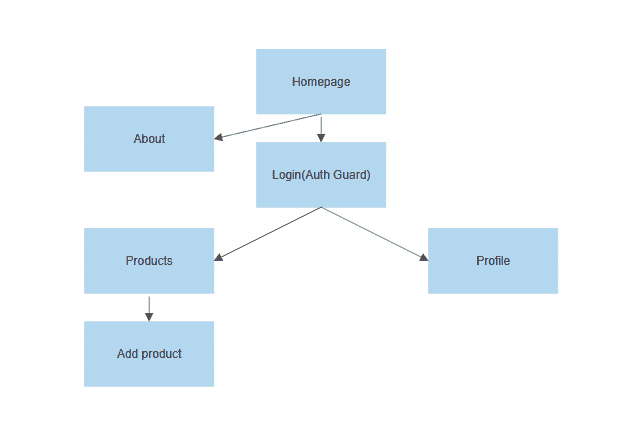
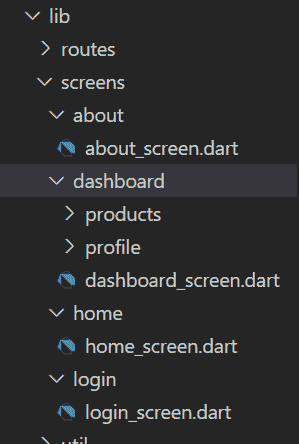
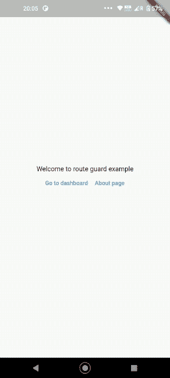

# 在 Flutter web 应用程序中实现路由保护

> 原文：<https://blog.logrocket.com/implementing-route-guards-flutter-web-apps/>

## 介绍

Flutter 一直以多平台框架的形式呈现，但它并不是一夜之间变成多平台的。Flutter for mobile 大约在 2018 年底退出测试，而 web 和桌面则在 2021 年退出测试。由于这种领先优势，我们看到的大多数 Flutter 内容都更侧重于移动开发。

虽然这并不影响 Flutter 的大多数用例，但它可能会严重破坏身份验证。在本文中，我们将通过一个简单仪表板的例子来了解为什么在 Flutter 中身份验证流在移动和 web 平台上不能以同样的方式处理。

每个仪表板都有几个可公开访问的屏幕，有些屏幕只有用户登录后才能访问。考虑这个例子，让我们看看移动和 web 上的认证流。

## 使用 Flutter mobile 进行身份验证

一旦用户打开应用程序，我们可以在`main()`中决定用户是否登录。然后，他们被带到仪表板的主屏幕，否则他们被要求登录。

开发人员可以放心，未经身份验证的用户无法访问仪表板屏幕，因此他们不必处理在经过身份验证的访问页面上没有身份验证的边缘情况。

用户注销后，我们在导航器上执行`pushAndRemoveUntil`操作，将用户带到登录屏幕。

如果用户按下返回按钮，应用程序将退出，它不会带他们回到仪表板。这是手机用户应该期待体验的。

## 使用 Flutter web 进行身份验证

我们还可以在`main()`中决定用户是否登录，并据此对用户进行处理。一切都很好，直到用户的行为像他们在移动应用程序中一样。

当用户试图使用浏览器中的后退和前进按钮进行导航时，事情会发生变化；开发人员不能假设用户未经身份验证就无法访问仪表板。这是因为用户可以直接输入仪表板 url。

如果用户在登录后输入了某个页面的 url，则用户会被带到该页面或该仪表板的特定选项卡。这叫做[深度链接](https://blog.logrocket.com/understanding-deep-linking-in-react-native/)。

如果用户注销，虽然我们可以在这里执行`pushAndRemoveUntil`,但是浏览器会存储导航历史，用户仍然可以按 back 按钮返回到仪表板。

开发人员在开发移动应用程序时不能再假设很多事情。因此，我们可以使用路由保护来更好地解决这个问题，而不是在每个需要身份验证的屏幕上设置条件。

## 示例项目设置

在本指南中，我们将制作一个简单的仪表板，其中混合了未经身份验证和经过身份验证的屏幕。

对于路由，我们将使用 [auto_route](https://pub.dev/packages/auto_route) ，因为路由生成可以完全自动化，并且它支持开箱即用的深度链接。

### 添加依赖关系

让我们从创建一个新的颤振项目开始。这个例子的项目名称是`route_guard_example`。

接下来，在`dependencies`下添加`auto_route: ^3.0.4`用于处理路由。

在`dev_dependencies`下，添加`build_runner: ^2.1.4`(用于 Flutter 中与代码生成相关的一切的包)和`auto_route_generator: ^3.0.4`(用于生成路线的`auto_route`的助手包)。

最后运行`flutter pub get`。

### 基本项目结构

该示例仪表板将包含以下屏幕:



所有的屏幕都将被添加到一个`screens`文件夹下以获得更好的结构，就像这样:



如你所见，在`products`文件夹下，有一个`products_screen.dart`和一个子文件夹`add_products`以及相应的文件。这是因为我们还将使用嵌套路由，只是为了让这个例子与生产级应用程序相提并论。

此时，所有的`**screen_name**_screen.dart`文件只有样板代码:

```
import 'package:flutter/material.dart';
class HomeScreen extends StatelessWidget {
  const HomeScreen({Key? key}) : super(key: key);
  @override
  Widget build(BuildContext context) {
    return Scaffold(
      body: Text('Home'),
    );
  }
}

```

## 设置路由

在`lib`文件夹下直接创建一个`routes`文件夹。然后，在`routes`中，创建一个`router.dart`文件。

按照以下方式将路线添加到该文件中:

```
@MaterialAutoRouter(
  routes: <AutoRoute>[
    AutoRoute(
      page: HomeScreen,
      name: 'HomeRoute',
      path: '/',
    ),
    AutoRoute(
      page: DashboardScreen,
      name: 'DashboardRoute',
      path: '/dashboard',
      children: <AutoRoute>[
        AutoRoute<EmptyRouterPage>(
          name: 'ProductsRoute',
          path: 'products',
          page: EmptyRouterPage,
          children: [
            AutoRoute(
              page: ProductsScreen,
              path: '',
            ),
            AutoRoute(
                page: AddProductsScreen,
                name: 'AddProductsRoute',
                path: 'add_products'),
          ],
        ),
        AutoRoute(page: ProfileScreen, name: 'ProfileRoute', path: 'profile')
      ],
    ),
    AutoRoute(page: AboutScreen, name: 'AboutRouter', path: '/about')
  ],
)
class $AppRouter {}

```

让我们暂时忽略`$AppRouter`类。这种声明路线的方式更简洁，因为我们是在构建导航时声明路线的。

* * *

### 更多来自 LogRocket 的精彩文章:

* * *

仪表板和主屏幕是独立的，因此完全不同的路线。

产品和个人资料页面将是`Dashboardscreen`内的选项卡，因此它们嵌套在其中。

对于产品页面中的嵌套导航，我们需要一个暂存区，在那里我们可以堆叠所有的屏幕。为此，我们使用 auto route 提供的`EmptyProductPage`。这条路线将被命名为“产品”,我们小时候将经过`ProductScreen`和`AddProductsScreen`。

将路径作为`ProductsScreen`的`''`传递意味着这是我们点击这条路径时想要显示的默认屏幕。

以这种方式构造使得我们的路由保护问题非常简单；任何进入仪表板屏幕的路线都需要被保护，不管用户如何到达该路线。很简单吧！

现在在您的终端中运行以下命令来生成路由:

```
flutter packages pub run build_runner build --delete-conflicting-outputs

```

你会发现一个`router.gr.dart`文件。这是包含所有路线的生成文件。现在删除`main.dart`中的所有内容，替换为:

```
void main() {
  runApp(MyApp());
}
class MyApp extends StatelessWidget {
  MyApp({Key? key}) : super(key: key);
  final _appRouter = AppRouter();
  @override
  Widget build(BuildContext context) {
    return MaterialApp.router(
        routeInformationParser: _appRouter.defaultRouteParser(),
        routerDelegate: _appRouter.delegate());
  }
}

```

注意，在生成的文件中，类是`AppRouter`。这来自于我们在`router.dart`文件中声明的`$AppRouter`，只是去掉了`$`。

现在只需在终端中执行`flutter run`就可以在 web 浏览器中运行项目。你现在应该看到一个写着“家”的页面！

## 设置路线警卫

我们的路由防护应该执行以下操作，以使其正常工作:

它应该保护仪表板，不管用户如何尝试访问它(例如，通过输入 url 或从浏览器历史向前/向后导航)。

route guard 应该有一个单一的真实来源，用于检查用户在任何时间点是否经过身份验证。

最后，如果用户中途退出，那么他们之前访问的所有页面也将变得不可访问。

为了使认证数据从一个真实的来源可用，我们将实现一个基本的`AuthService`。

在`lib`下创建一个文件夹`util`，并创建一个文件`auth_service.dart`。在该文件中添加以下代码:

```
class AuthService extends ChangeNotifier {
  bool _authenticated = false;
  bool get authenticated => _authenticated;
  set authenticated(bool value) {
    _authenticated = value;
    notifyListeners();
  }
}

```

现在我们在`routes`文件夹下创建一个`route_guard.dart`文件。在该文件中，我们添加了以下内容:

```
class RouteGuard extends AutoRedirectGuard {
  final AuthService authService;
  RouteGuard(this.authService) {
    authService.addListener(() {
      if (!authService.authenticated) {
        reevaluate();
      }
    });
  }
  @override
  void onNavigation(NavigationResolver resolver, StackRouter router) {

    if (authService.authenticated) return resolver.next();
    // TODO: Navigate to login screen
  }
}

```

在这里，我们看到在构造函数本身中，我们为`AuthService`附加了一个监听器。每当身份验证状态发生变化时，都会触发此操作。开发人员不必在任何地方明确检查身份验证。

任何时候导航发生时都会调用`onNavigation()`。例如，在未经验证的用户输入“添加产品”屏幕的 url 的情况下，会发生以下情况:首先，他们被带到登录屏幕。一旦登录，`onNavigation()`就被触发。`resolver`对象有关于用户想导航到哪里的数据(在这个例子中是“添加产品”)，并把用户带到那里。

在`onNavigation()`中，如果用户没有登录，我们需要先把他们带到一个登录屏幕。让我们实现一个单按钮登录屏幕。

在`screens`下新建一个文件夹`login`，并将下面的代码添加到`login_screen.dart`文件中:

```
class LoginScreen extends StatelessWidget {
  const LoginScreen({Key? key}) : super(key: key);
  @override
  Widget build(BuildContext context) {
    return Scaffold(
      body: Center(
        child: TextButton(
            onPressed: () {
              // Change value of auth in authservice

            },
            child:const Text('Tap to login')),
      ),
    );
  }
}

```

我们将需要一个可以在这里使用的`AuthService`实例。为此，我们需要对我们的`main.dart`进行以下更改:

```
void main() {
  runApp(MyApp());
}
class MyApp extends StatefulWidget {
  MyApp({Key? key}) : super(key: key);
  static MyAppState of(BuildContext context) =>
      context.findAncestorStateOfType<MyAppState>()!;
  @override
  State<MyApp> createState() => MyAppState();
}
class MyAppState extends State<MyApp> {
  final authService = AuthService();
  final _appRouter = AppRouter();
  @override
  Widget build(BuildContext context) {
    return MaterialApp.router(
        routeInformationParser: _appRouter.defaultRouteParser(),
        routerDelegate: _appRouter.delegate());
  }
}

```

你可能想知道`findAncestorStateOfType`是做什么的。Flutter 将小部件存储为一棵树，状态与小部件一起存储。如果我们想访问这棵树上一个状态的任何成员，我们可以使用这个函数首先在这个上下文中找到`MyAppState`，然后访问`authService`成员变量。

现在，当用户点击登录按钮时，在`onTap`方法中，我们可以通过`MyApp.of(context).authService.authenticated = true`改变认证状态。

在上面提到的`route_guard.dart`的代码中，有一个注释告诉我们在哪里推送到`LoginScreen`。一旦用户成功登录，我们将需要来自`LoginScreen`的回调，它将把值发送到`RouteGuard`。

我们像这样添加回调:

```
class LoginScreen extends StatelessWidget {
  const LoginScreen({Key? key, required this.onLoginCallback})
      : super(key: key);
  final Function(bool loggedIn) onLoginCallback;
  ...
  ...

```

而里面的`onPressed`:

```
onPressed: () {
  MyApp.of(context).authService.authenticated = true;
  onLoginCallback.call(true);
            },

```

现在我们可以从`RouteGuard`内部导航到`LoginScreen`。将其添加到顶级路线，与`DashboardRoute`处于同一级别，并再次运行`build_runner`命令。

现在，我们终于可以在 route guard 的登录屏幕中添加导航功能了:

```
...
...
  @override
  void onNavigation(NavigationResolver resolver, StackRouter router) {
    if (authService.authenticated) return resolver.next();
    router.push(
      LoginRoute(
        onLoginCallback: (_) {
          resolver.next();
          router.removeLast();
        },
      ),
    );
  }

```

我们已经知道了`resolver.next()`是做什么的。现在我们需要`router.remoteLast()`从我们的导航堆栈中删除这个登录屏幕，这样当用户按下 back 按钮时，他们就不会再次被带到登录屏幕。

现在我们想保护所有在`DashboardRoute`下的屏幕。为此，我们可以将我们的路由保护传递给`AutoRoute`对象，像这样声明我们的`DashboardScreen`路由为一个属性:

```
...
...
    AutoRoute(
      page: DashboardScreen,
      name: 'DashboardRoute',
      path: 'dashboard',
      guards: [RouteGuard],
...
...

```

因为我们已经调整了`router.dart`文件，所以我们再次运行命令来生成路线。在这次生成文件时，您会在`main.dart`中发现一个错误。那里的`AppRouter`实例正在请求一个路线守卫。

将该行更改为:
`late final _appRouter = AppRouter(routeGuard: RouteGuard(authService));`

出于演示目的，让我们在主页上添加一个浮动操作按钮，该按钮将导航到我们的控制面板:

```
class HomeScreen extends StatelessWidget {
  const HomeScreen({Key? key}) : super(key: key);
  @override
  Widget build(BuildContext context) {
    return Scaffold(
      body: Text('Home'),
      floatingActionButton: FloatingActionButton(onPressed: () {
        AutoRouter.of(context).push(DashboardRoute());
      }),
    );
  }
}

```

现在尝试运行项目，并单击浮动操作按钮。即使您试图直接导航到仪表板，也会被我们的 route guard 拦截，并显示登录屏幕。

一旦你点击**点击登录**，你就可以通过了！现在关闭浏览器，再次运行项目，输入“[http://localhost:/#/dashboard&# 8221](http://localhost:/#/dashboard&#8221)；直接。您将再次被拦截，并显示登录屏幕！

现在，我们将向仪表板添加一些 UI，以便更容易理解。此时的代码将与本例的 [github repo 中的最终提交相同。](https://github.com/Chinmay-KB/route_guard_example)

在仪表板屏幕中，我们使用自动路由包本身提供的一个名为`AutoTabsScaffold`的小部件。它处理了许多嵌套路由所需的样板文件。现在您可以尝试运行项目，通过登录和退出来导航不同的屏幕，并直接输入 URL(深度链接)。

现在，我们再也不用考虑处理这类案件了。我们需要做的就是相应地添加路线，生成路线，然后忘记它！

## Flutter mobile 上的路由和路由保护

这种路由策略甚至可以在手机上无缝运行。您可以尝试在移动设备上运行这段代码，尝试所有的东西！



## 结论

从这篇文章中，我们可以得出结论，虽然确保身份验证的移动专用方法只适用于移动设备，但 Flutter web 的路由保护适用于移动设备和 web。这是让 Flutter 真正实现多平台的又一步！

## 使用 [LogRocket](https://lp.logrocket.com/blg/signup) 消除传统错误报告的干扰

[](https://lp.logrocket.com/blg/signup)

[LogRocket](https://lp.logrocket.com/blg/signup) 是一个数字体验分析解决方案，它可以保护您免受数百个假阳性错误警报的影响，只针对几个真正重要的项目。LogRocket 会告诉您应用程序中实际影响用户的最具影响力的 bug 和 UX 问题。

然后，使用具有深层技术遥测的会话重放来确切地查看用户看到了什么以及是什么导致了问题，就像你在他们身后看一样。

LogRocket 自动聚合客户端错误、JS 异常、前端性能指标和用户交互。然后 LogRocket 使用机器学习来告诉你哪些问题正在影响大多数用户，并提供你需要修复它的上下文。

关注重要的 bug—[今天就试试 LogRocket】。](https://lp.logrocket.com/blg/signup-issue-free)