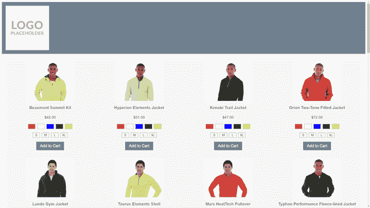
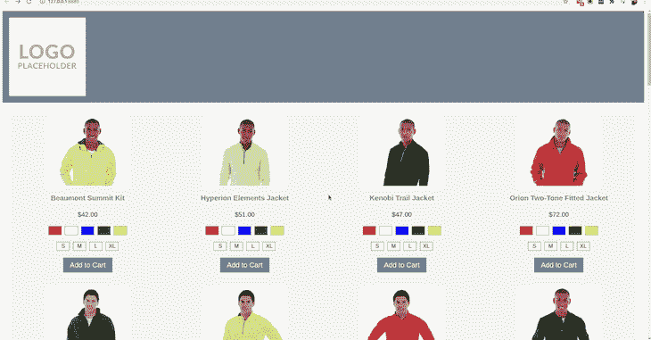

# 在电子商务 React 应用程序中实现滚动恢复

> 原文：<https://blog.logrocket.com/implementing-scroll-restoration-in-ecommerce-react-apps/>

卷轴恢复是一个我们认为理所当然的功能。对于传统的基于 HTML 的页面和导航(即服务器呈现的网站)，浏览器总是为我们处理这种交互。

随着从服务器端呈现向浏览器的转变，在客户端呈现的应用程序，甚至 JS 增强的 HTML 页面都失去了这一非常有用的用户体验特性。电子商务网站上的产品列表页面(PLP)是让滚动恢复正常工作的最重要的地方之一。在这篇文章中，我们将探索一种技术来手动恢复浏览器的滚动位置，以便我们的电子商务用户获得一致和高性能的体验。

## 设置场景

让我们想象一下，我们有一个 PLP 的电子商务网站，每行显示 4 个产品，每页显示 32 个产品。每张产品卡大约 500 像素高(包含产品图片、产品名称、颜色/尺寸信息、价格和一个“添加到购物车”按钮)。

现在让我们假设一个浏览网站的用户的浏览器分辨率为 1920 x 1080px。这意味着他们可以一次看到两排产品。对于该 PLP，总共有多达四个滚动“视窗”可供用户使用:每页 32 个产品，每行四个产品，总共八行，每个视窗两行。



现在让我们假设一个用户向下滚动 PLP 并点击了第 15 个产品，因此浏览器将他们导航到该产品的产品描述页面(PDP)。这意味着他们在第四行选择了一个产品。

现在，用户希望返回到列表页面，继续浏览其余的产品，所以他们按了 back 按钮。浏览器向后导航，当列表页面完成加载时，可见的产品出现在第一行和第二行。

然后，用户必须手动向下滚动，搜索他们刚刚查看过的产品，以便继续查看其余的产品。这是电子商务用户感到沮丧的一个非常常见的原因，也是导致他们对网站和潜在品牌失去信任的一个原因。

用户不知道为什么会这样，但是作为开发人员，我们知道。我们的 PLP 完全在浏览器中呈现和填充，所以当浏览器第一次绘制 HTML(可能只包括页眉和页脚)时，呈现产品的部分只是一个空的 div。

当浏览器试图在导航到 PDP 之前使用滚动条所在的 Y 坐标本地恢复滚动位置时，页面将不够长。浏览器无法准确地恢复滚动位置，因为它不知道我们的应用程序何时完成渲染，因此也不知道何时应该恢复。

在这些情况下，我们需要自己处理恢复滚动位置。

## 在开始之前

为了真正理解什么是滚动恢复，让我们看一下需要手动控制滚动恢复的一些情况:服务器呈现的带有 JS 呈现内容的 web 页面(混合页面)，以及完全在客户端呈现的应用程序(例如，React 应用程序)。

首先，一个基线。这里我们有一个服务器渲染的网站，一旦开始渲染，浏览器就可以使用所有的 HTML:



正如我们所看到的，从 PDP 导航回 PLP 可以完美地将滚动恢复到我们在导航到 PDP 之前最初点击的产品。

接下来，我们有一个混合页面。在这个页面中，浏览器在第一次画图时就可以看到大部分 HTML 内容，但有些内容——在本例中是产品列表——稍后由 JavaScript 填充。

我们可以看到，页眉和页脚的显示与产品的加载和呈现之间存在延迟:


正如我们在本例中看到的，当导航回 PLP 时，浏览器停留在视窗的顶部，并且无法恢复滚动到我们在导航到 PDP 之前最初单击的产品位置。

最后，这里我们有一个完全用 React 构建的客户端应用程序:


在最后一个例子中，我们看到了与混合方法相似的行为；也就是说，浏览器无法滚动还原到最初点击的产品。

## 实现滚动恢复

对于混合页面和完全客户端应用来说，实现滚动恢复是非常相似的，因为我们将利用 JavaScript 来找到我们要将滚动位置恢复到的产品。出于本文的目的，我们将介绍在 React 应用程序中实现滚动恢复的[。](https://blog.logrocket.com/advanced-react-router-concepts-code-splitting-animated-transitions-scroll-restoration-recursive-17096c0cf9db/#:~:text=of%20the%20app.-,Scroll%20restoration,-Scroll%20restoration%20can)

如果您想了解混合应用程序的滚动恢复实现，请查看本文的 [GitHub 资源库。我们有时会引用存储库中的代码，但重要的代码将出现在本文中。](https://github.com/denno020/scroll-restoration)

### 示例应用程序结构

我们将从一个非常基本的应用程序开始，它有两个页面:第一个页面包含 32 个产品，其源代码在一个名为`PLP.jsx`的组件中，第二个页面只是一个空白页面，将作为我们的占位符 PDP，源代码在一个名为`PDP.jsx`的组件中。

我们还有一个`ProductCard.jsx`组件，用于呈现 32 种产品中的每一种。

### 步骤 1:存储所选产品的参考

首先，我们需要存储用户选择的产品的引用。我们将使用`sessionStorage`和产品 ID 来完成这项工作。

为什么是`sessionStorage`？这正是为本次演示选择的格式。我们可以很容易地[使用一个全局状态管理器](https://blog.logrocket.com/how-to-choose-the-right-react-state-management-solution/)来存储要恢复的产品的 ID，或者其他一些在内存中保存值的方法。此外，我们不需要这些数据保留很长时间(就像使用`localStorage`一样)。如果用户关闭标签，那么数据可以安全地被遗忘。

实现这一点所需的代码是一个简单的函数，当`ProductCard`组件中的一个链接被激活时，就会调用这个函数。为此，我们在我们的`PLP`组件中定义函数，并将其传递给`ProductCard`组件，在单击链接时调用它:

`PLP.jsx`

```
const PLP = () => {
  const persistScrollPosition = (id) => {
    sessionStorage.setItem("scroll-position-product-id-marker", id);
  };

  return (
    <ProductCard
      product={product}
      onSelect={persistScrollPosition}
    />
  );
}

```

`ProductCard.jsx`

```
const ProductCard = (props) => {
  const { product, onSelect } = props;
  const { id } = product;

  return (
    <div>
      {/* ... */}
      <Link to="/pdp" onClick={() => onSelect(id)} />
      {/* ... */}
    </div>
  );
}

```

### 步骤 2:手动将滚动恢复到先前选择的产品

现在我们已经存储了被点击的产品，我们需要在 PLP 再次呈现时将浏览器滚动到该产品。

为此，我们将利用`setState`中的回调函数来呈现应用程序的其余部分，然后将一个`restorationRef`传递给需要滚动到视图中的`ProductCard`:

`PLP.jsx`

```
const PLP = () => {
  // ...

  const [productMarkerId] = React.useState(() => {
    // Lazy initialise the productMarkerId
    const persistedId = sessionStorage.getItem(
      "scroll-position-product-id-marker"
    );

    sessionStorage.removeItem("scroll-position-product-id-marker");

    return persistedId ? persistedId : null;
  });

  // ...

  return (
    <ProductCard
      product={product}
      onSelect={persistScrollPosition}
      restorationRef={Number(productMarkerId) === product.id ? restorationRef : null}
    />
  );
}

```

`ProductCard.jsx`

```
const ProductCard = () => {
  const { restorationRef } = props;

  React.useEffect(() => {
    // restorationRef is only provided to the ProductCard that needs to be scrolled to
    if (!restorationRef) {
      return;
    }

    // Restoring scroll here ensures the previously selected product will always be restored, no matter how long the API request to get products takes
    restorationRef.current.scrollIntoView({ behavior: 'auto', block: 'center' });
  })

  // ...
};

```

神奇的事情发生在上面的`ProductCard.jsx`组件的第 11 行。已经选择了`behavior`的值`auto`，因为浏览器滚动恢复通常不使用动画，但是如果想要一个效果，我们可以很容易地使用`smooth`。

至于`block`，已经选择了`center`的值，因为它确保没有粘性元素会碍事。例如，如果我们使用值`start`，并且我们有一个粘性标题(这在电子商务中很常见)，那么产品行的顶部将被该标题覆盖。尽管这在技术上是正确的，但它不会给出准确的卷轴恢复体验。

就是这样！这就是我们手动实现滚动恢复所需的全部内容。🎉

然而，如果我们真的想追求高质量的用户体验，那么我们应该更进一步。

### 步骤 3:有条件地恢复滚动到以前选择的产品

想象一下这个场景:一个客户在 PLP 上选择了一个产品，并查看了该产品的描述页面。然后，他们使用菜单导航到另一个 PLP，并单击不同产品的描述页面，然后再次使用菜单返回到原始 PLP。用户一直在向前导航。你知道会发生什么吗？

那么，滚动将恢复到几个导航之前选择的产品，即使用户正向前移动到列表页面。这远远不是理想的行为，并且可能会给用户带来困惑。

为了解决这个问题，我们可以在惰性状态初始化函数中添加一个检查，以确定用户是实际返回到列表页面，还是只是从站点上的另一个页面再次导航到该页面。

在 React 中，我们可以使用 React 路由器和`useHistory`钩子，如下所示:

```
import { useHistory } from 'react-router-dom';

const PLP = () => {
  const history = useHistory();
  // ...
  const [productMarkerId] = React.useState(() => {
    // History action will be POP when a user is "moving back" to a page. Alternative will be "PUSH"
    if (history.action !== 'POP') {
      return null;
    }

    // ...
  });
};

```

下一个问题是，如果列表页面使用非常常见的[无限加载模式](https://blog.logrocket.com/4-ways-to-render-large-lists-in-react/#:~:text=added%20to%20it.-,2.%20Infinite%20scroll,-Another%20way%20to)在用户向下滚动页面时提供无限的产品列表，会发生什么？当用户点击一个产品，然后点击返回按钮，应用程序如何知道加载什么，以便正确的产品可以滚动恢复？接下来让我们来看看。

### 步骤 4:无限加载列表页面的滚动恢复

对于无限加载列表页面，我们需要确保的第一件事是跟踪正在加载的页面。我们可以在状态值中很容易地做到这一点，但是这对用户来说不是很有用，特别是对于想要共享产品页面的用户。

我们应该考虑跟踪 URL 中最新加载的产品页面。这为用户提供了很好的反馈，可以看到他们已经加载了多少页面的产品(而不必在应用程序的用户界面中搜索试图找到这些信息)，这也让我们有机会使用 URL 栏中的页码进行滚动恢复！

在我们进入技术层面之前，让我们更新一下我们的示例场景:

想象一下，我们的电子商务网站只有一个列表页面。我们有 32 种产品，但我们不想一次展示所有产品，并呈现一个又大又长的页面。相反，我们希望只加载和呈现前 12 个，然后是后 12 个，最后 8 个。我们要用无限载荷来做这件事。

当用户接近最后一行产品时，他们会看到一个“Load Next”按钮，该按钮将加载下一页产品，并将它们添加到当前列表的末尾。当页面被加载时，URL 中的查询字符串会在最终页面被加载时将`?page=2`更新为`?page=3`。

然后，用户选择其中一个产品，并导航到该产品的描述页面。当用户查看完描述页面并触发后退按钮时，浏览器将加载哪个页面？

当我们返回时，浏览器将恢复导航事件之前我们所在的最近的 URL，这将是`?page=3`。假设用户最初选择的产品在第三页，我们的滚动恢复将没有问题。

但是，如果用户向下滚动以加载所有三个页面的产品，然后向上滚动并单击第二页数据集中的产品，会怎么样呢？当他们从描述页面触发后退动作时会发生什么？

结果的第三页仍然会被加载，用户选择的产品不会被找到，所以不会发生滚动恢复。用户将被留在视口的顶部，查看第三页的第一行产品。这不是用户所期望的，我们可以让这种体验变得更好。

回想一下我们添加到`PLP`组件中的`persistScrollPosition`函数。我们还可以添加一个步骤，在导航事件发生之前更新 URL 中的查询字符串。记住，`ProductCard`的`onSelect`道具被添加到`ProductCard`内`Link`组件的`onClick`道具中。

还要注意在`Link`组件中，`onClick`功能将在导航到`to`中的路径之前执行。

利用这些知识，我们可以在触发导航事件之前快速更改 URL 中的查询字符串。这意味着当用户点击描述页面上的后退按钮时，浏览器将加载包含用户最初选择的产品的产品页面！让我们看看代码:

```
const PLP = () => {
  // ...

  const persistScrollPosition = (id, pageNo) => {
    // Set the page value in the query string to match the page that the selected product is on
    history.replace(`?page=${pageNo}`);
    // ...
  };

  // ...
}

```

> 为了让这篇文章专注于滚动恢复技术，我不打算发布实现无限加载所需的所有更改。如果需要引用，可以在之前链接的 GitHub 存储库中找到实现的模式。

正如我们在上面的代码中所看到的，我们简单地用所选产品被加载的页码来调用`history.replace`。这将需要对添加到`products`数组中的产品数据进行轻微的更新，以便它能够记住该产品实际属于哪个页面。

通过这个非常简单的更新，我们可以依靠浏览器用用户选择的产品的正确页码来恢复 URL，而不管有多少页面被无限加载，我们的滚动恢复机制将会启动并按预期工作。

## 更进一步

还有很多可以实现的滚动恢复来创造一个伟大的用户体验。为了不使这篇文章太长，这里有一个非常简单的概述，这些额外的功能可以使一个电子商务网站的用户体验高于其他水平。

### 骨架装载机

不要显示一个基本的加载信息，用“占位符”产品预先填充页面，当被替换时，不会导致滚动抖动。当浏览器尝试滚动还原，但由于产品尚未呈现，仅滚动到(非常短的)页面底部时，会发生 Scroll jank。

### 利用`scrollRestoration`属性

告诉浏览器，我们将通过将历史 API 中的`scrollRestoration`属性设置为`manual`来处理滚动恢复。这也有助于避免滚动抖动。

### 易接近

考虑卷轴恢复的可访问性。当用户向后导航时，哪个元素将获得焦点？应该关注哪一个元素？用户选择的产品将被恢复到视窗中，但是如果用户点击 tab 键会发生什么呢？

在上面的例子中，我们只跟踪单个产品进行滚动恢复，假设一个简单的 PLP → PDP → (back) PLP 模式。但是，如果用户通过多个不同的 PLP 和 PDP(使用菜单)向前移动，然后决定多次点击后退按钮，该怎么办呢？本文中的示例代码不会处理这个问题，但是为这个功能更新它是相当简单的。

## 最后的想法

如前所述，滚动恢复是一个我们以前完全依赖浏览器来处理的功能，所以我们从来没有考虑过它。然而，随着越来越多的客户端和渐进式网络应用程序的建立，这一简单的功能正在消失，这对电子商务应用程序的用户体验产生了负面影响。

在这篇文章中，我们讨论了一些简单的步骤，可以确保我们建立的电子商务网站易于导航，用户可以信任。

## 使用 LogRocket 消除传统反应错误报告的噪音

[LogRocket](https://lp.logrocket.com/blg/react-signup-issue-free)

是一款 React analytics 解决方案，可保护您免受数百个误报错误警报的影响，只针对少数真正重要的项目。LogRocket 告诉您 React 应用程序中实际影响用户的最具影响力的 bug 和 UX 问题。

[ ](https://lp.logrocket.com/blg/react-signup-general) [  ](https://lp.logrocket.com/blg/react-signup-general) [LogRocket](https://lp.logrocket.com/blg/react-signup-issue-free)

自动聚合客户端错误、反应错误边界、还原状态、缓慢的组件加载时间、JS 异常、前端性能指标和用户交互。然后，LogRocket 使用机器学习来通知您影响大多数用户的最具影响力的问题，并提供您修复它所需的上下文。

关注重要的 React bug—[今天就试试 LogRocket】。](https://lp.logrocket.com/blg/react-signup-issue-free)