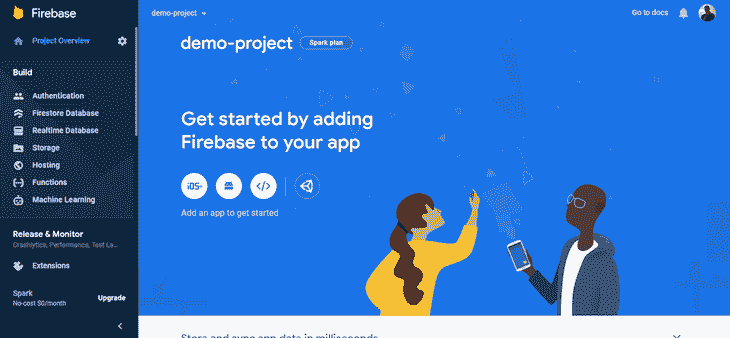
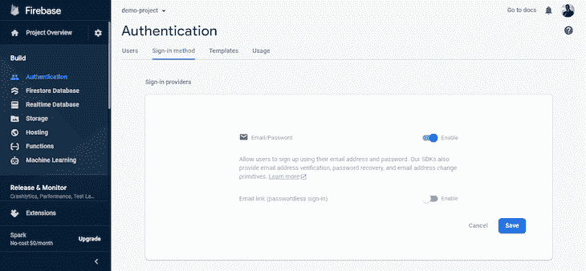
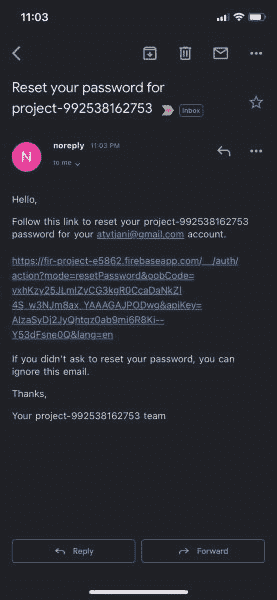
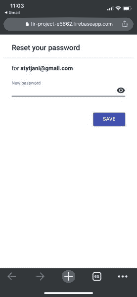
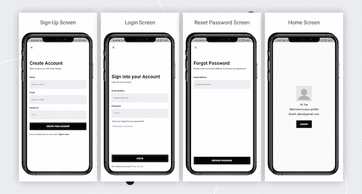
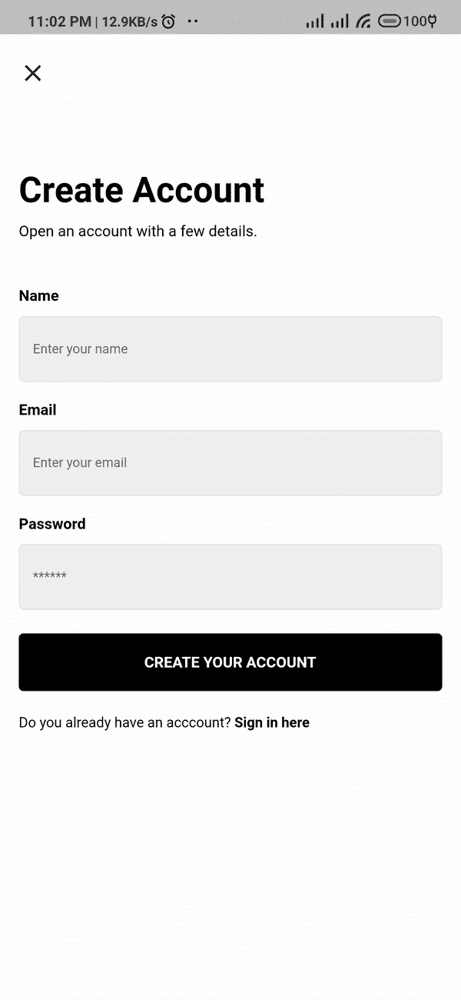

# 用 Flutter 和 Firebase 实现安全的密码重置功能

> 原文：<https://blog.logrocket.com/implementing-secure-password-reset-flutter-firebase/>

Firebase 提供各种托管后端服务，如身份验证、实时数据库、云存储和机器学习。然而，我们关注的是 Firebase 身份认证。

Firebase Authentication 包括大量的方法和实用程序，用于将安全身份验证集成到您的 Flutter 应用程序中。

在本文中，我们将演示如何使用 Firebase 来实现一个简单的身份验证过程，其中包括用户注册、登录和密码重置功能。

在本教程中，我们将经历以下步骤:

## 项目设置

### 创建新的颤振项目

为了开始我们的教程，首先，我们将创建一个新的 Flutter 项目。首先，在您的终端中运行以下命令:

```
$ flutter create firebase_demo

```

然后，使用您喜欢的 IDE 打开项目。在您的终端中运行以下代码，用 VS 代码打开它:

```
$ code firebase_demo

```

### 添加依赖关系

接下来，我们需要向我们的项目添加依赖项。该项目所需的插件有:

*   `firebase_core`:用于初始化 Firebase 服务。在 Flutter 应用程序中使用任何 Firebase 服务都需要这个插件
*   `firebase_auth`:访问 Firebase 认证服务

在终端中运行以下命令，在项目中获取并安装插件:

```
$ flutter pub add firebase_core
$ flutter pub add firebase_auth
$ flutter pub get

```

现在我们已经安装了所需的依赖项，让我们继续创建和设置 Firebase 控制台。

## 设置 Firebase 项目

在我们的 Flutter 应用程序中使用 Firebase 之前，我们必须首先创建一个新的 Firebase 项目。

为此，请前往 [Firebase 控制台](https://console.firebase.google.com)并遵循创建 Firebase 项目的步骤。流程完成后，您将被引导至 Firebase 项目仪表板。



现在我们已经创建了一个 Firebase 项目，我们需要为每个平台(Android、iOS 和 web)设置 Firebase。请参见下面每个平台的完整配置指南:

最后，要使用 Firebase 身份验证服务的**电子邮件/密码**登录功能，我们必须从 Firebase 仪表板的左侧菜单导航到**身份验证**选项卡，并选择**电子邮件/密码**选项。

这里，通过拨动**启用**开关并点击**保存**按钮，启用**电子邮件/密码**选项。



既然我们已经成功地设置和配置了 Firebase 项目，让我们开始构建 Firebase 身份验证并将其集成到我们的 Flutter 应用程序中。

## 初始化 Firebase 应用程序

在我们的应用程序中使用任何 Firebase 服务之前，我们需要首先初始化 Firebase 应用程序。我们通过在`main.dart`文件中的`main`函数中调用 Firebase 的`initializeApp`方法来实现。

```
import 'package:firebase_core/firebase_core.dart';
import 'package:firebase_demo/routes.dart';
import 'package:firebase_demo/screens/login.dart';
import 'package:flutter/material.dart';

void main() async {
  WidgetsFlutterBinding.ensureInitialized();
  await Firebase.initializeApp();  //here we initialize our Firebase App
  runApp(const MyApp());
}
//...

```

初始化 Firebase 应用程序后，让我们继续设置我们的身份验证服务类。

## 设置认证服务

在 Flutter 中，最好的做法是将逻辑从 UI 中分离出来。为此，我们将创建一个名为`authentication_service.dart`的新 dart 文件。在其中，我们将定义一个名为`AuthenticationService`的类，并初始化`FirebaseAuth`插件。

该类将处理所有与身份验证相关的功能，并公开用户登录、注册、重置密码和注销的方法。

```
class AuthenticationService {
  final _auth = FirebaseAuth.instance;
//...
}

```

接下来，我们将开始在其中定义我们的方法，从新用户的注册开始。

### 用户注册

为了注册一个新用户，我们将定义一个名为`createAccount()`的方法，这个方法将把用户`email`、`password`和`username`作为参数，如下面的代码片段所示。

```
Future<AuthStatus> createAccount({
    required String email,
    required String password,
    required String name,
  }) async {
    try {
      UserCredential newUser = await _auth.createUserWithEmailAndPassword(
        email: email,
        password: password,
      );
      _auth.currentUser!.updateDisplayName(name);
      _status = AuthStatus.successful;
    } on FirebaseAuthException catch (e) {
      _status = AuthExceptionHandler.handleAuthException(e);
    }
    return _status;
  }

```

这里，我们从`FirebaseAuth`插件向`createUserWithEmailandPassword()`方法传递用户`email`和`password`，并用`username`更新用户的显示名称。

注意我们是如何在这个方法的`catch`块中处理错误的；我们将`FirebaseAuthException`错误对象传递给了来自`AuthExceptionHandler`类的一个名为`handleAuthException()`的方法。该方法返回`AuthStatus`，并根据从`FirebaseAuthException`对象读取的错误代码生成错误消息。

下面的代码片段显示了`AuthExceptionHandler`类:

```
import 'package:firebase_auth/firebase_auth.dart';

enum AuthStatus {
  successful,
  wrongPassword,
  emailAlreadyExists,
  invalidEmail,
  weakPassword,
  unknown,
}

class AuthExceptionHandler {
  static handleAuthException(FirebaseAuthException e) {
    AuthStatus status;
    switch (e.code) {
      case "invalid-email":
        status = AuthStatus.invalidEmail;
        break;
      case "wrong-password":
        status = AuthStatus.wrongPassword;
        break;
      case "weak-password":
        status = AuthStatus.weakPassword;
        break;
      case "email-already-in-use":
        status = AuthStatus.emailAlreadyExists;
        break;
      default:
        status = AuthStatus.unknown;
    }
    return status;
  }
  static String generateErrorMessage(error) {
    String errorMessage;
    switch (error) {
      case AuthStatus.invalidEmail:
        errorMessage = "Your email address appears to be malformed.";
        break;
      case AuthStatus.weakPassword:
        errorMessage = "Your password should be at least 6 characters.";
        break;
      case AuthStatus.wrongPassword:
        errorMessage = "Your email or password is wrong.";
        break;
      case AuthStatus.emailAlreadyExists:
        errorMessage =
            "The email address is already in use by another account.";
        break;
      default:
        errorMessage = "An error occured. Please try again later.";
    }
    return errorMessage;
  }
}

```

### 用户登录

要在应用程序上登录一个现有用户，在`AuthenticationService`类中定义一个名为`login()`的方法，该方法将接受用户的`email`和`password`作为参数，如下面的代码示例所示:

```
  Future<AuthStatus> login({
    required String email,
    required String password,
  }) async {
    try {
      await _auth.signInWithEmailAndPassword(email: email, password: password);
      _status = AuthStatus.successful;
    } on  FirebaseAuthException catch (e) {
      _status = AuthExceptionHandler.handleAuthException(e);
    }
    return _status;
  }

```

这个方法和`createAccount()`方法一样，不管成功与否，都返回用户的`AuthStatus`。

### 重置用户密码

为了重置用户密码，我们将调用`FirebaseAuth`对象上的`sendPasswordResetMail()`方法；这个方法接受一个作为用户`email`的`String`参数。Firebase 通过向用户电子邮件发送重置密码链接来处理密码重置。

```
  Future<AuthStatus> resetPassword({required String email}) async {
    await _auth
        .sendPasswordResetEmail(email: email)
        .then((value) => _status = AuthStatus.successful)
        .catchError((e) => _status = AuthExceptionHandler.handleAuthException(e));
    return _status;
  }

```

以下是密码重置电子邮件的一个示例:





### 用户注销

最后，为了让用户退出我们的应用程序，我们定义了一个名为`logout()`的方法。这个方法包含一行代码，它需要在`FirebaseAuth`对象上调用`signOut()`方法，如下面的代码片段所示。

```
  Future<void> logout() async {
    await _auth.signOut();
  }

```

这就结束了`AuthenticationService`类。接下来是构建 UI 并利用我们在`AuthenticationService`类中创建的方法。

## 构建用户界面

我们的应用程序将由四个屏幕组成:

*   注册屏幕
*   登录屏幕
*   重置密码屏幕
*   主屏幕



让我们从构建注册屏幕开始。

### 注册屏幕

`RegistrationScreen`有三个`TextFormField`小部件作为我们的`email`、`password`和`username`字段，以及一个处理事件提交的按钮，如下面来自`sign_up.dart`文件的代码片段所示。

```
//...
class _SignUpScreenState extends State<SignUpScreen> {
  final _key = GlobalKey<FormState>();
  final _emailController = TextEditingController();
  final _passwordController = TextEditingController();
  final _nameController = TextEditingController();
  final _authService = AuthenticationService();
  //disposing all text controllers
  @override
  void dispose() {
    _emailController.dispose();
    _passwordController.dispose();
    _nameController.dispose();
    super.dispose();
  }

  @override
  Widget build(BuildContext context) {
    var size = MediaQuery.of(context).size;
    return Scaffold(
      body: Container(
        width: size.width,
        height: size.height,
        color: Colors.white,
        child: SingleChildScrollView(
          child: Padding(
            padding: const EdgeInsets.only(
                left: 16.0, right: 16.0, top: 50.0, bottom: 25.0),
            child: Form(
              key: _key,
              child: Column(
                crossAxisAlignment: CrossAxisAlignment.start,
                mainAxisSize: MainAxisSize.min,
                children: [
                  GestureDetector(
                    onTap: () => Navigator.pop(context),
                    child: const Icon(Icons.close),
                  ),
                  const SizedBox(height: 70),
                  const Text(
                    'Create Account',
                    style: TextStyle(
                      fontSize: 35,
                      fontWeight: FontWeight.bold,
                      color: Colors.black,
                    ),
                  ),
                  const SizedBox(height: 10),
                  const Text(
                    'Open an account with a few details.',
                    style: TextStyle(
                      fontSize: 15,
                      color: Colors.black,
                    ),
                  ),
                  const SizedBox(height: 40),
                  const Text(
                    'Name',
                    style: TextStyle(
                      fontSize: 15,
                      color: Colors.black,
                      fontWeight: FontWeight.bold,
                    ),
                  ),
                  const SizedBox(height: 10),
                  CustomTextField(
                    hintText: 'Enter your name',
                    keyboardType: TextInputType.name,
                    textCapitalization: TextCapitalization.sentences,
                    validator: (value) =>
                        Validator.fullNameValidate(value ?? ""),
                    controller: _nameController,
                  ),
                  const SizedBox(height: 16),
                  const Text(
                    'Email',
                    style: TextStyle(
                      fontSize: 15,
                      color: Colors.black,
                      fontWeight: FontWeight.bold,
                    ),
                  ),
                  const SizedBox(height: 10),
                  CustomTextField(
                    hintText: 'Enter your email',
                    keyboardType: TextInputType.emailAddress,
                    textCapitalization: TextCapitalization.none,
                    validator: (value) => Validator.validateEmail(value ?? ""),
                    controller: _emailController,
                  ),
                  const SizedBox(height: 16),
                  const Text(
                    'Password',
                    style: TextStyle(
                      fontSize: 15,
                      color: Colors.black,
                      fontWeight: FontWeight.bold,
                    ),
                  ),
                  const SizedBox(height: 10),
                  CustomTextField(
                    hintText: '******',
                    obscureText: true,
                    maxLength: 6,
                    keyboardType: TextInputType.number,
                    textCapitalization: TextCapitalization.none,
                    controller: _passwordController,
                    validator: (value) =>
                        Validator.validatePassword(value ?? ""),
                  ),
                  const SizedBox(height: 20),
                  CustomButton(
                    label: 'CREATE YOUR ACCOUNT',
                    color: Colors.black,
                    onPressed: () async {
                      if (_key.currentState!.validate()) {
                        LoaderX.show(context);
                        final _status = await _authService.createAccount(
                          email: _emailController.text.trim(),
                          password: _passwordController.text,
                          name: _nameController.text,
                        );
                        if (_status == AuthStatus.successful) {
                          LoaderX.hide();
                          Navigator.pushNamed(context, LoginScreen.id);
                        } else {
                          LoaderX.hide();
                          final error =
                              AuthExceptionHandler.generateErrorMessage(
                                  _status);
                          CustomSnackBar.showErrorSnackBar(
                            context,
                            message: error,
                          );
                        }
                      }
                    },
                    size: size,
                    textColor: Colors.white,
                    borderSide: BorderSide.none,
                  ),
                  const SizedBox(height: 20),
                  GestureDetector(
                    onTap: () {
                      Navigator.pushNamed(context, LoginScreen.id);
                    },
                    child: RichText(
                      textScaleFactor: 0.8,
                      text: const TextSpan(
                        text: "Do you already have an acccount? ",
                        style: TextStyle(
                          color: Colors.black,
                          fontSize: 15,
                        ),
                        children: [
                          TextSpan(
                            text: 'Sign in here',
                            style: TextStyle(
                              color: Colors.black,
                              fontSize: 15,
                              fontWeight: FontWeight.bold,
                            ),
                          ),
                        ],
                      ),
                    ),
                  ),
                ],
              ),
            ),
          ),
        ),
      ),
    );
  }
}

```

因此，如果我们检查我们的`CustomButton`小部件的`onPressed`属性:

```
onPressed: () async {
  if (_key.currentState!.validate()) {
    LoaderX.show(context);
    final _status = await _authService.createAccount(
      email: _emailController.text.trim(),
      password: _passwordController.text,
      name: _nameController.text,
    );
    if (_status == AuthStatus.successful) {
      LoaderX.hide();
      Navigator.pushNamed(context, LoginScreen.id);
    } else {
      LoaderX.hide();
      final error = AuthExceptionHandler.generateErrorMessage(_status);
      CustomSnackBar.showErrorSnackBar(
        context,
        message: error,
      );
    }
  }
},    

```

上面的代码片段在将`email`、`password`和`username`值从`AuthenticationService`类传递给`createAccount()`方法进行处理之前验证输入。

如果`AuthStatus`成功，我们将用户导向`LoginScreen`。否则，我们将显示一个 snackbar，并显示所发生的错误消息。

### 登录屏幕

`LoginScreen`的 UI 代码与`RegistrationScreen`非常相似，只是它有两个`TextFormField`小部件作为我们的电子邮件和密码字段，以及一个处理事件提交的按钮。因此，为了简洁起见，我将省略掉`LoginScreen` UI 代码，而将重点放在将被写入`loginscreen.dart`文件中的`CustomButton` onPressed 回调中的代码上。

```
//...
CustomButton(
  label: 'LOG IN',
  color: Colors.black,
  onPressed: () async {
    if (_key.currentState!.validate()) {
      LoaderX.show(context);
      final _status = await _authService.login(
        email: _emailController.text.trim(),
        password: _passwordController.text,
      );
      if (_status == AuthStatus.successful) {
        LoaderX.hide();
        Navigator.pushNamed(context, HomeScreen.id);
      } else {
        LoaderX.hide();
        final error = AuthExceptionHandler.generateErrorMessage(_status);
        CustomSnackBar.showErrorSnackBar(
          context,
          message: error,
        );
      }
    }
  },
//...

```

代码片段解释为验证输入，然后将`email`和`password`值从`AuthenticationService`类传递给`login()`方法进行委托。

如果`AuthStatus`成功，我们将用户导向`HomeScreen`。否则，我们会显示一个 snackbar，其中包含发生的错误消息。

### 重置密码

`ResetPassword`屏幕有一个代表`email`字段的`TextFormField`小部件和一个处理事件提交的按钮。

让我们看看来自`CustomButton`小部件的`onPressed`属性:

```
CustomButton(
  label: 'RECOVER PASSWORD',
  color: Colors.black,
  onPressed: () async {
    if (_key.currentState!.validate()) {
      LoaderX.show(context);
      final _status = await _authService.resetPassword(
          email: _emailController.text.trim());
      if (_status == AuthStatus.successful) {
        LoaderX.hide();
        Navigator.pushNamed(context, LoginScreen.id);
      } else {
        LoaderX.hide();
        final error = AuthExceptionHandler.generateErrorMessage(_status);
        CustomSnackBar.showErrorSnackBar(context, message: error);
      }
    }
  },
  size: size,
  textColor: Colors.white,
  borderSide: BorderSide.none,
),

```

这里——就像我们之前处理的方法一样——我们首先处理输入的验证，然后我们将用户`email`从`AuthenticationService`类传递给`resetPassword()`方法。如果状态为成功，我们将用户导向`LoginScreen`；否则，我们会显示一个 snackbar，指出已经发生的错误。

接下来，我们需要提供一个屏幕，当用户成功登录时，显示用户的个人资料数据。

### 主屏幕

`HomeScreen`将简单地显示用户的电子邮件和显示名称，以及一个处理用户注销的按钮。

在`CustomButton` onPressed 回调中，我们简单地调用了`FirebaseAuth`插件上的`signOut()`方法，如果成功，我们将用户导航回`LoginScreen`。

```
//...
class HomeScreen extends StatelessWidget {
  const HomeScreen({Key? key}) : super(key: key);
  static const String id = 'home_screen';
  @override
  Widget build(BuildContext context) {
    var size = MediaQuery.of(context).size;
    return Scaffold(
      body: SafeArea(
        child: SizedBox(
          height: size.height,
          width: size.width,
          child: Column(
            mainAxisAlignment: MainAxisAlignment.center,
            children: [
              Container(
                width: 100,
                height: 100,
                decoration: const BoxDecoration(
                  image: DecorationImage(
                    image: AssetImage('assets/blank-dp.png'),
                  ),
                ),
              ),
              const SizedBox(height: 10),
              Text(
                'Hi ${AuthenticationService.auth.currentUser!.displayName}',
                style: const TextStyle(
                  fontSize: 20,
                  fontWeight: FontWeight.bold,
                ),
              ),
              const SizedBox(height: 10),
              const Text(
                'Welcome to your profile',
                style: TextStyle(
                  fontSize: 20,
                  fontWeight: FontWeight.bold,
                ),
              ),
              const SizedBox(height: 10),
              Text(
                'Email: ${AuthenticationService.auth.currentUser!.email}',
                style: const TextStyle(
                  fontSize: 20,
                  fontWeight: FontWeight.bold,
                ),
              ),
              const SizedBox(height: 30),
              SizedBox(
                width: 100,
                child: CustomButton(
                  label: 'LOGOUT',
                  color: Colors.black,
                  onPressed: () async {
                    LoaderX.show(context);
                    await AuthenticationService.auth.signOut().then((value) {
                      LoaderX.hide();
                      Navigator.pushNamedAndRemoveUntil(
                          context, LoginScreen.id, (route) => false);
                    });
                  },
                  size: size,
                  textColor: Colors.white,
                  borderSide: BorderSide.none,
                ),
              )
            ],
          ),
        ),
      ),
    );
  }
}

```



## 结论

总结一下，我们已经了解了什么是 Firebase，如何设置 Firebase 应用程序，以及如何通过运行用户注册、登录、密码重置和用户注销等示例将 Firebase 身份验证集成到我们的 Flutter 应用程序中。

这个项目的完整源代码可以在 [GitHub](https://github.com/iloveteajay/fuzzy-eureka) 上找到。感谢你花时间阅读这篇文章，我希望这篇文章对你有用！

## 使用 [LogRocket](https://lp.logrocket.com/blg/signup) 消除传统错误报告的干扰

[](https://lp.logrocket.com/blg/signup)

[LogRocket](https://lp.logrocket.com/blg/signup) 是一个数字体验分析解决方案，它可以保护您免受数百个假阳性错误警报的影响，只针对几个真正重要的项目。LogRocket 会告诉您应用程序中实际影响用户的最具影响力的 bug 和 UX 问题。

然后，使用具有深层技术遥测的会话重放来确切地查看用户看到了什么以及是什么导致了问题，就像你在他们身后看一样。

LogRocket 自动聚合客户端错误、JS 异常、前端性能指标和用户交互。然后 LogRocket 使用机器学习来告诉你哪些问题正在影响大多数用户，并提供你需要修复它的上下文。

关注重要的 bug—[今天就试试 LogRocket】。](https://lp.logrocket.com/blg/signup-issue-free)