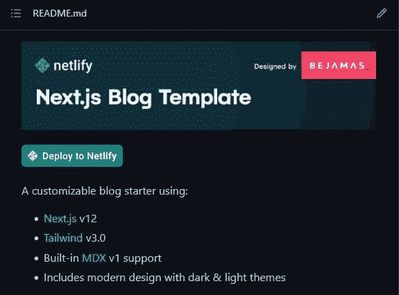
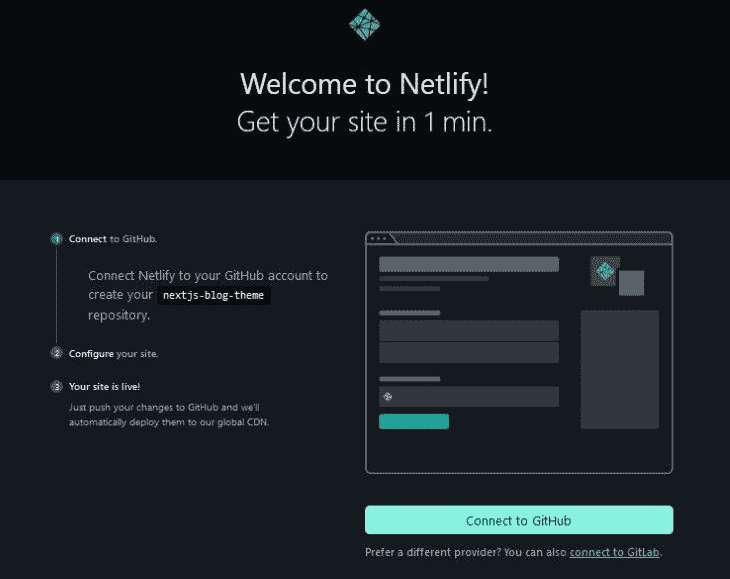
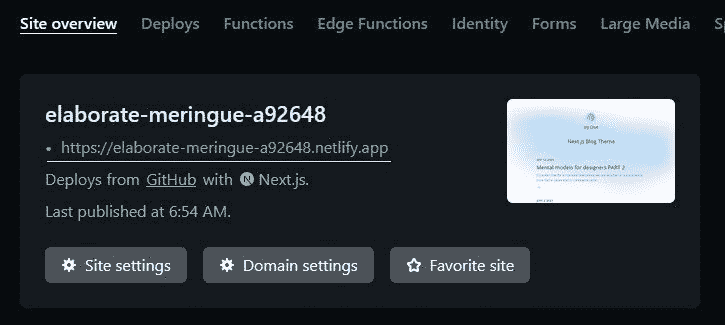
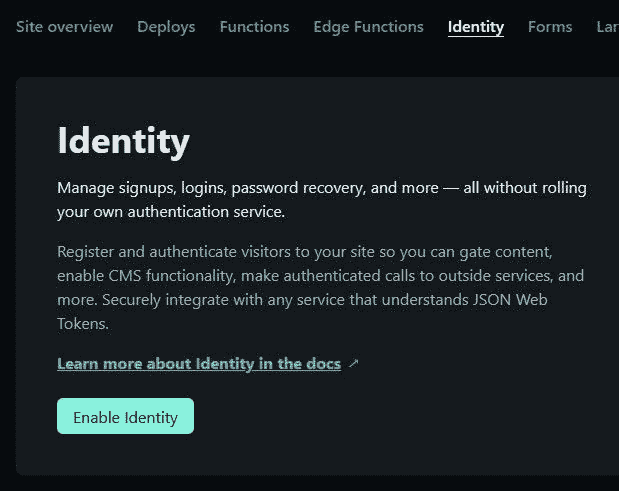
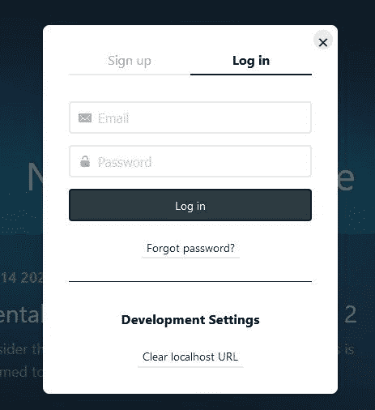

# 用网络身份实现无服务器认证

> 原文：<https://blog.logrocket.com/implementing-serverless-authentication-netlify-identity/>

[无服务器计算](https://en.wikipedia.org/wiki/Serverless_computing)继续证明对开发者来说是高效的，允许我们编写包含服务器端功能的应用程序，而没有管理物理服务器的麻烦。这种架构将服务器任务(如身份验证、数据库管理等)转移给供应商，从而加快开发速度并降低成本。这也是 Jamstack 社区采用的一种做法。

先驱 Jamstack 平台 Netlify 创建了一个名为 Netlify Identity 的服务，您可以使用它在 web 应用程序中快速实现身份验证。 [Netlify Identity](https://docs.netlify.com/visitor-access/identity/) 是由 [Netlify GoTrue API](https://github.com/netlify/gotrue) 支持的即插即用微服务。该服务附带了一整套身份验证功能(登录、密码恢复、OAuth 提供者)，从而避免了部署您的身份验证系统的需要。

在本文中，您将了解如何使用 Netlify Identity 在 Next.js 应用程序中实现身份验证。

## 先决条件

要跟进，您需要:

## 将 Next.js 项目部署到 Netlify

对于本教程，我们将尝试在 Netlify 的模板[库](https://github.com/netlify-templates/nextjs-blog-theme)中预先存在的 [Jamstack 博客](https://bejamas-nextjs-blog.netlify.app/)中设置身份。可以查看[成品项目](https://netlify-identity-auth.netlify.app/)和[源代码](https://github.com/Chinwike1/netlify-identity-blog)。



点击项目的`README.md`文件中的 **Deploy to Netlify** 按钮，将你的站点部署到 Netlify。这将带你到 Netlify 的网站，提示你连接 Netlify 到你的 GitHub 账户。



链接您的帐户并遵循屏幕上的步骤后，将在您的 GitHub 个人资料下创建一个存储库，过一会儿，您的网站将在 Netlify 上上线。



请注意上面带下划线的站点的活动 URL。保存此 URL 以备后用，因为 Identity 将需要它来定位您的应用程序。

在 Identity 可以在您的项目中工作之前，Netlify 要求您在项目设置中启用 Identity 功能。从您的仪表板中，导航到**身份**选项卡，然后单击**启用身份**按钮:



现在，您的应用程序设置为开始验证用户！接下来，我们将在这个项目中安装一个用于 Netlify 身份的 JavaScript 小部件。

[Netlify 身份小部件](https://github.com/netlify/netlify-identity-widget)是围绕 GoTrue.js 构建的组件，GoTrue . js 是 GoTrue API 的 JavaScript 客户端库。js 公开了[几个方法](https://gotruejs-playground.netlify.app/)，这些方法可以作为构建注册、登录流和注销流的 UI 的构件。您还可以使用该库来构建您的自定义身份验证 UI。

在 GitHub 概要文件下找到模板的存储库，并使用以下命令在本地克隆它:

```
git clone https://github.com/{your-github-username}/nextjs-blog-theme.git

```

接下来，安装 Netlify 身份小部件:

```
npm install netlify-identity-widget 
or
yarn install netlify-identity-widget

```

现在我们可以开始使用`React.createContext()`来设置认证上下文。

## 创建身份验证上下文

React 上下文 API 是一种跨 React 应用程序全局创建和共享数据的机制，无需通过组件树的许多层传递属性。

使用`React.createContext`创建一个包含两个重要 React 组件的上下文对象:`Provider`和`Consumer`。包装在`Provider`组件中的子元素可以使用`React.useContext`访问和订阅状态变化。

我们可以实现这个 API 来跟踪用户的身份验证状态。在项目的根目录下创建一个名为`context`的文件夹，并添加一个`AuthContext.js`文件:

```
// context/AuthContext.js
import { useState, createContext } from 'react';

export const AuthContext = createContext();

export const AuthContextProvider = ({ children }) => {
  const [user, setUser] = useState(null);

  const contextValues = { user };
  return (
    <AuthContext.Provider value={contextValues}>
      {children}
    </AuthContext.Provider>
  );
};

```

这里我们创建并导出了一个用`createContext`创建的`AuthContext`对象。然后我们用`useState`钩子初始化了一个`user`状态。

`AuthContext`的`Provider`组件有一个`value`属性，接受全局状态的对象。我已经将上下文值总结成一个`contextValues`对象，并将它们分配给`value`。

`AuthContext.Provider`可用于包装整个应用程序，允许任何子组件访问其全局状态:

```
// _app.js
import '../styles/globals.css';
import 'prismjs/themes/prism-tomorrow.css';
import { AuthContextProvider } from '../context/authContext';

function MyApp({ Component, pageProps }) {
  return (
    <>
      <span className="theme-bejamas" />
      <AuthContextProvider>
        <Component {...pageProps} />
      </AuthContextProvider>
    </>
  );
}
export default MyApp;

```

## 初始化网络身份

要在您的项目中使用 Netlify Identity 小部件，您必须首先使用`init()`方法初始化它——在这里查看[小部件的完整 API](https://github.com/netlify/netlify-identity-widget#module-api)。我们可以在一个`useEffect`钩子中这样做:

```
// context/AuthContext.js
import { useState, useEffect, createContext } from 'react';
import netlifyIdentity from 'netlify-identity-widget';

export const AuthContext = createContext();

export const AuthContextProvider = ({ children }) => {
  const [user, setUser] = useState(null);

  useEffect(() => {
    // initialize netlify identity
    netlifyIdentity.init();
  }, []);

  const contextValues = { user };
  return (
    <AuthContext.Provider value={contextValues}>
      {children}
    </AuthContext.Provider>
  );
};

```

当小部件在浏览器中初始化时，用户的身份验证状态是可用的。通过监听一个`init`事件并相应地更新状态，您可以将这个值与`user`上下文同步。Netlifiy 身份库提供了一个用于绑定到身份验证事件的`on()`处理程序。它还返回一个回调函数，该函数包含当前通过身份验证的用户的数据。

```
netlifyIdentity.on("init" | "login" | "logout", (user) => {
  console.log(user.email) // [email protected]
})

```

这样，您可以监听一个`init`事件并更新`AuthContext`的`user`状态，如下所示:

```
// context/AuthContext.js
import { useState, useEffect, createContext } from 'react';
import netlifyIdentity from 'netlify-identity-widget';

export const AuthContext = createContext();

export const AuthContextProvider = ({ children }) => {
  const [user, setUser] = useState(null);

  useEffect(() => {
    // initialize netlify identity
    netlifyIdentity.init();
  }, []);

  useEffect(() => {
    // update user state on init event
    netlifyIdentity.on('init', (user) => {
      setUser(user);
    });
  }, []);

  const contextValues = { user };
  return (
    <AuthContext.Provider value={contextValues}>
      {children}
    </AuthContext.Provider>
  );
};

```

为了更好的可读性，我在一个单独的`useEffect`钩子中编写了这个事件处理程序。接下来，您将看到如何注册和登录用户。

## 身份注册和登录

Netlify 身份小部件 API 提供了一个`open()`方法来打开下面的注册/登录模式:



默认情况下，模式打开到**登录**选项卡，但是您可以指定想要打开哪个选项卡:

```
netlifyIdentity.open("login" | "signup")

```

在`AuthContext.js`中创建一个`login`函数，并调用`netlifyIdentity.open()`:

```
// context/AuthContext.js
import { useState, useEffect, createContext } from 'react';
import netlifyIdentity from 'netlify-identity-widget';

export const AuthContext = createContext();

export const AuthContextProvider = ({ children }) => {
  const [user, setUser] = useState(null);

  useEffect(() => {
    // initialize netlify identity
    netlifyIdentity.init();
  }, []);

  useEffect(() => {
    // update user state on 'init event
    netlifyIdentity.on('init', (user) => {
      setUser(user);
    });
  }, []);

  const login = () => {
    netlifyIdentity.open('login');
  };

  const contextValues = { user, login };
  return (
    <AuthContext.Provider value={contextValues}>
      {children}
    </AuthContext.Provider>
  );
};

```

记得在`contextValues`对象中包含这个函数，这样它在整个应用程序中都可用。接下来，我们将使用`netlifyIdentity.on()`方法监听一个`login`事件。当小部件检测到这个事件时，我们将更新上下文的`user`状态，如下所示:

```
// context/AuthContext.js
import { useState, useEffect, createContext } from 'react';
import netlifyIdentity from 'netlify-identity-widget';

export const AuthContext = createContext();

export const AuthContextProvider = ({ children }) => {
  const [user, setUser] = useState(null);

  useEffect(() => {
    // initialize netlify identity
    netlifyIdentity.init();
  }, []);

  useEffect(() => {
    // update user state on 'init event
    netlifyIdentity.on('init', (user) => {
      setUser(user);
    });
     // update user state after login
    netlifyIdentity.on('login', (user) => {
      setUser(user);
      // close the modal
      netlifyIdentity.close();
    });
  }, []);

  const login = () => {
    netlifyIdentity.open('login');
  };

  const contextValues = { user, login };
  return (
    <AuthContext.Provider value={contextValues}>
      {children}
    </AuthContext.Provider>
  );
};

```

请注意，Netlify Identity 允许免费层上的每个站点最多有 1000 个注册用户。

## 使用`useContext`访问上下文值

子组件可以使用`React.useContext`钩子从传递给它的`Context`对象中读取和订阅状态变化:

```
const { user } = React.useContext(AuthContext)
conosle.log(user.email) // [email protected]  

```

在`components`文件夹中创建一个`AuthButton.js`文件，并添加下面的代码块:

```
// components/AuthButton.js
import { useContext } from 'react';
import { AuthContext } from '../context/authContext';

const AuthButton = () => {
  const { user, login } = useContext(AuthContext);
  return (
    <div className="absolute top-5 right-5">
      {!user ? (
        <button
          onClick={login}
          className="py-2 px-4 mr-2 bg-sky-500 hover:bg-sky-600 font-semibold rounded-md"
        >
          Login
        </button>
      ) : (
        <button
          className="py-2 px-4 mr-2 bg-sky-500 hover:bg-sky-600 font-semibold rounded-md"
        >
          Logout
        </button>
      )}
    </div>
  );
};
export default AuthButton;

```

我们首先调用`useContext`并传入`AuthContext`对象。这样做，您可以析构当前在`AuthContext` — `user`和`login`中的两个值。接下来，我们使用`user`状态根据用户的身份验证状态有条件地呈现登录或注销按钮。`login`然后被附加到登录按钮的`onClick`处理程序。

现在，让我们在主屏幕上呈现这个按钮组件:

```
// pages/index.js
import { useContext } from 'react';
import { getPosts } from '../utils/mdx-utils';
import Header from '../components/Header';
import Layout, { GradientBackground } from '../components/Layout';
import { getGlobalData } from '../utils/global-data';
import SEO from '../components/SEO';
import { AuthContext } from '../context/authContext';
import AuthButton from '../components/AuthButton';

export default function Index({ posts, globalData }) {
  const { user } = useContext(AuthContext);

  return (
    <Layout>
      <SEO title={globalData.name} description={globalData.blogTitle} />
      <Header name={user?.email} />
      <AuthButton />
      <main className="w-full">
        {/* markup for main element */}
      </main>
}

export function getStaticProps() {
  const posts = getPosts();
  const globalData = getGlobalData();
  return { props: { posts, globalData } };
}

```

注意上面已经使用了`useContext`来读取和显示`Header`组件中用户的电子邮件。

现在，您可以单击登录/注册按钮开始身份验证过程。


第一次打开身份验证模式时，小部件会提示您设置以前的 Netlify 实时站点 URL。之后，您的应用程序可以开始收集用户信息。请注意，Netlify Identity 允许免费层上的每个站点最多有一千个用户。

接下来，让我们看看如何注销用户。

## 身份注销

我们将从向上下文添加一个`logout`函数开始，该函数将调用`netlifyIdentity.logout`:

```
// context/AuthContext.js
import { useState, useEffect, createContext } from 'react';
import netlifyIdentity from 'netlify-identity-widget';

export const AuthContext = createContext();

export const AuthContextProvider = ({ children }) => {
  const [user, setUser] = useState(null);

  useEffect(() => {
    // initialize netlify identity
    netlifyIdentity.init();
  }, []);

  useEffect(() => {
    // update user state after login
    netlifyIdentity.on('login', (user) => {
      setUser(user);
      netlifyIdentity.close();
    });
    netlifyIdentity.on('logout', () => {
      setUser(null);
    });
    netlifyIdentity.on('init', (user) => {
      setUser(user);
    });
  }, []);

  const login = () => {
    netlifyIdentity.open('login');
  };

  const logout = () => {
    netlifyIdentity.logout();
  };

  const contextValues = { user, login, logout };

  return (
    <AuthContext.Provider value={contextValues}>
      {children}
    </AuthContext.Provider>
  );
};
\
```

我们还使用了`netlifyIdentity.on`方法来监听注销事件，并随后清除`user`状态。

现在我们可以从`AuthButton`调用这个`logout`函数，如下所示:

```
// components/AuthButton.js
import { useContext } from 'react';
import { AuthContext } from '../context/authContext';

const AuthButton = () => {
  const { user, login, logout } = useContext(AuthContext);
  return (
    <div className="absolute top-5 right-5">
      {!user ? (
        <button
          onClick={login}
          className="py-2 px-4 mr-2 bg-sky-500 hover:bg-sky-600 font-semibold rounded-md"
        >
          Login
        </button>
      ) : (
        <button
          onClick={logout}
          className="py-2 px-4 mr-2 bg-sky-500 hover:bg-sky-600 font-semibold rounded-md"
        >
          Logout
        </button>
      )}
    </div>
  );
};
export default AuthButton;

```

`AuthButton`可以进一步简化为下面的代码块:

```
// components/AuthButton.js
import { useContext } from 'react';
import { AuthContext } from '../context/authContext';

const AuthButton = () => {
  const { user, login, logout } = useContext(AuthContext);

  return (
    <div className="absolute top-5 right-5">
      <button
        onClick={!user ? login : logout}
        className="py-2 px-4 mr-2 bg-sky-500 hover:bg-sky-600 font-semibold rounded-md"
      >
        {!user ? 'Login / Signup' : 'Logout'}
      </button>
    </div>
  );
};
export default AuthButton;

```

## 结论

在任何主要的 web 应用程序中，身份验证都是一个重要而敏感的部分，让一个像 Netlify Identity 这样的外部服务来为您管理这个特性确实令人耳目一新。这些外部身份验证库不仅减轻了大部分负担，而且与您的专用身份验证实现相比，它们更安全，更不容易受到网络安全攻击。

在本文中，您了解了如何使用 Netlify Identity 实现基本的身份验证功能，但是该服务的特性超出了本文的范围。您可以探索其他身份特性，如 OAuth 身份验证、使用提供的 JWT 创建[门控内容](https://www.netlify.com/blog/2018/01/23/getting-started-with-jwt-and-identity/)等等。

## 使用 [LogRocket](https://lp.logrocket.com/blg/signup) 消除传统错误报告的干扰

[](https://lp.logrocket.com/blg/signup)

[LogRocket](https://lp.logrocket.com/blg/signup) 是一个数字体验分析解决方案，它可以保护您免受数百个假阳性错误警报的影响，只针对几个真正重要的项目。LogRocket 会告诉您应用程序中实际影响用户的最具影响力的 bug 和 UX 问题。

然后，使用具有深层技术遥测的会话重放来确切地查看用户看到了什么以及是什么导致了问题，就像你在他们身后看一样。

LogRocket 自动聚合客户端错误、JS 异常、前端性能指标和用户交互。然后 LogRocket 使用机器学习来告诉你哪些问题正在影响大多数用户，并提供你需要修复它的上下文。

关注重要的 bug—[今天就试试 LogRocket】。](https://lp.logrocket.com/blg/signup-issue-free)