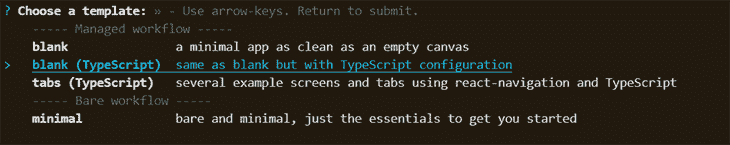
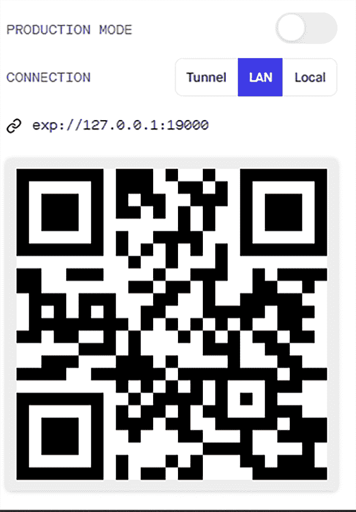
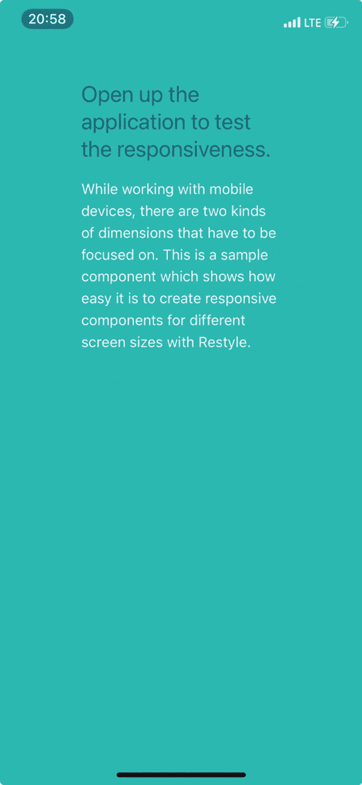

# 在 React Native 中实现拆分视图和响应式布局

> 原文：<https://blog.logrocket.com/implementing-split-view-responsive-layout-react-native/>

在本文中，我们将了解如何在 React Native 中构建响应式布局，并在此基础上构建一个拆分视图邮件应用程序，同时依赖 Shopify 的 Restyle 库。

## 入门指南

要跟随本教程，您需要:

*   反应原生≥ v0.63.0
*   Expo ≥ v41
*   TypeScript 版本 4.1.0 以上
*   Node.js ≥ v16.13.1

要开始构建我们的 React 本地应用程序，请全局安装 Expo CLI。

```
yarn global add expo-cli
```

运行下面的命令来创建一个新的 React 本地项目，我们称之为`ResponsiveProject`。

```
expo init ResponsiveProject
```

在初始化项目之后，我们在这里有几个关键的选择。我们将在这个项目中使用的 Restyle 库提供了一个类型强制系统，用于在[React Native with TypeScript](https://blog.logrocket.com/using-typescript-with-react-native/)中构建 UI 组件。因此，我倾向于在这个项目中使用 TypeScript，因为当我们构建项目的主题时，它会加强整体的类型安全。

对于不熟悉 TypeScript 但熟悉 JavaScript 的读者，我鼓励您继续阅读，因为在这个项目中我们不会太深入地研究 TypeScript。



Choose the TypeScript React Native template

```
cd ResponsiveProject
yarn start
```

### 运行 React 本机应用程序

在你的 iOS 或 Android 手机上安装 [Expo 客户端应用](https://expo.io/)，并确保你的手机和电脑连接到同一个无线网络。

在 Android 上，使用 Expo 应用程序从终端扫描二维码，在 iOS 上，使用相机应用程序中内置的二维码扫描仪。


## 什么是再造型？

[重新样式库](https://github.com/Shopify/restyle)通过提供主题化(比如明暗模式)借鉴了[样式系统](https://styled-system.com/)，并去除了 [React Native 的默认样式](https://reactnative.dev/docs/stylesheet)。

使用 Restyle，我们可以在 React Native 中创建 UI 库。我们创建的主题通过它们的道具连接到一个组件的样式，允许 UI 库的消费者使用这些“实用样式道具”轻松地改变它们组件的样式。道具很容易根据主题中设置的断点做出反应。

## 使用重新样式

设置重新设计非常简单。首先，将这个库安装到我们的项目中，`ResponsiveProject`。

```
yarn add @shopify/restyle
```

复制并运行下面的命令，在我们的`root` 目录中创建一个`src` 文件夹。在`src` 文件夹中，创建一个`components`文件夹来保存`components`目录中的`index.ts` 和`Theme.ts` 文件。

```
mkdir src
mkdir src/components
touch src/components/index.ts
touch src/components/Theme.ts
```

打开我们的`components`文件夹中的`Theme.ts` 文件，在这里，创建我们的自定义主题。重新造型库带有预定义的函数来创建`Box` 和`Text` 组件。

```
code src/components/Theme.ts
```

在`Theme.ts`中，我们将定义我们的全局主题对象。它指定间距、颜色和断点的设置值。

TypeScript 强制`marginTop`属性只接受主题中定义的边距。当使用我们的 Restyle 组件时，我们可以编写`marginTop="xl"`来使用主题中指定的命名间距。如果我们想要定制我们的间距，我们可以按照我在下面的代码块中描述的那样来做。

```
import {
  BaseTheme,
  createBox,
  createText,
  createTheme,
  useTheme as useReTheme,
} from "@shopify/restyle";

export const theme: BaseTheme = createTheme({
  colors: {
    secondary: "#2CB9B0",
    text: "rgba(12,12,52,0.5)",
    white: "#F0F2F3",
  },
  spacing: {
    s: 8,
    m: 16,
    l: 24,
    xl: 75,
  },
  borderRadii: {
    s: 4,
    m: 10,
    l: 25,
    xl: 75,
  },
 breakpoints: {
    phone: 0,
    tablet: 768
   },
 textVariants: {
    hero: {
      fontSize: 80,
      lineHeight: 80,
      color: "white",
      textAlign: "center",
    },
     title1: {
      fontSize: 24,
      lineHeight: 30,
      color: "text",
    },
    body: {
      fontSize: 16,
      lineHeight: 24,
      color: "text",
    },
  },
});

export type Theme = typeof theme;
export const Text = createText<Theme>();
export const Box = createBox<Theme>();
export const useTheme = () => useReTheme<Theme>();

```

打开我们的`components`文件夹中的`index.ts`文件，导出我们的主题。

```
export { Text, Box, useTheme} from "./Theme";

```

如果您决定不使用 TypeScript，您可以删除`export`类型，主题应该在普通的 JavaScript 中工作。但是正如我们前面提到的，强烈建议将 TypeScript 与 Restyle 库一起使用。

安装以下软件包:

```
yarn add @react-navigation/native @react-navigation/stack @react-navigation/drawer react-native-screens react-native-safe-area-context react-native-reanimated
```

在我们的`App.tsx`文件中，我们将应用程序包装在`ThemeProvider`组件中。我们创建的主题将被传递给 React 树顶部的一个`ThemeProvide` r:

```
import * as React from "react";
import { ThemeProvider } from "@shopify/restyle";
import { SafeAreaProvider } from "react-native-safe-area-context";
import { createStackNavigator } from "@react-navigation/stack";
import { NavigationContainer } from "@react-navigation/native";
import {
  HomeNavigator,
} from "./src/Home";
import { theme } from "./src/components/Theme";
const AppStack = createStackNavigator();

export default function App() {
  return (
      <ThemeProvider theme={theme}>
            <SafeAreaProvider>
              <NavigationContainer>
                    <AppStack.Navigator
                screenOptions={{
                    headerMode: "screen",
                    headerShown: false,
                 }}
                    >
                <AppStack.Screen name="Home" component={HomeNavigator} />
                    </AppStack.Navigator>
            </NavigationContainer>
          </SafeAreaProvider>
 </ThemeProvider>
  );
}

```

## 定义断点以构建响应组件

在这一节中，我们将依靠断点来构建我们的响应组件。[React Native 和 Restyle](https://github.com/Shopify/restyle#responsive-values) 中的断点是我们希望应用不同样式的不同目标屏幕尺寸的最小宽度。

使用断点，我们可以为不同的屏幕尺寸指定不同的样式。为了演示这一点，我们将创建一个在宽屏设备和移动屏幕上都保持样式的示例卡。

在`src` 目录中，创建一个名为`Home`的文件夹。

```
mkdir src/Home
```

在`Home` 文件夹中，创建一个`index.tsx`文件，输入下面的代码块。

```
touch src/Home/index.tsx
code src/Home/index.tsx
```

```
import * as React from "react";
import { createDrawerNavigator } from "@react-navigation/drawer";
import HomeScreen from "./HomeScreen";

const Drawer = createDrawerNavigator();
export const HomeNavigator = () => (
  <Drawer.Navigator
    screenOptions={{
      headerShown: true,
    }}
    initialRouteName="Home"
  >
    <Drawer.Screen name="Home" component={HomeScreen} />
  </Drawer.Navigator>
);

```

在我们的`Home`文件夹中，我们将创建以下内容:

*   名为`HomeScreen`的子文件夹
*   一个文件
*   一个`HomeScreen.tsx`文件

```
mkdir src/Home/HomeScreen
touch src/Home/HomeScreen/index.ts
touch src/Home/HomeScreen/HomeScreen.tsx
```

在我们的子文件夹`HomeScreen`中打开`index.ts`文件并导出`HomeScreen`组件。

```
code src/Home/HomeScreen/index.ts
```

```
export { default } from "./HomeScreen";

```

现在，打开`HomeScreen.tsx`文件。

* * *

### 更多来自 LogRocket 的精彩文章:

* * *

```
code src/Home/HomeScreen/HomeScreen.tsx
```

在`HomeScreen.tsx**,**` 中，我们创建了一个适用于宽屏设备和移动设备的卡示例。

我们将依靠定义的断点来确定检测到的屏幕是手机还是平板电脑大小。如果是电话，我们使用`justifyContent`属性使盒子居中。如果检测到的屏幕是平板电脑，我们选择`space-around`属性。

```
import React from "react";
import { Box, Header, Text } from "../../components";

const HomeScreen = () => {
  return (
 <Box
    flex={1}
    backgroundColor="secondary"
    justifyContent={{ phone: "center", tablet: "space-around" }}
    padding="xl"
    elevation={4}
    flexDirection={{ phone: "column", tablet: "row" }}
    borderRadius="s"
 >
       <Box flex={1} alignItems="flex-start" flexWrap="wrap" margin="s">
         <Text variant="title1">
           Open up the application to test the responsiveness. 
         </Text>
        <Text variant="body">While working with mobile devices, there are two kinds of dimensions that have to be focused on. This is a sample component which shows how easy it is to create responsive components for different screen sizes with Restyle. 
        </Text>
      </Box>
   </Box>
)
}
export default HomeScreen;

```

### 测试纵向和横向模式下的响应能力

为了测试横向和纵向模式下的响应能力，我们必须进入我们的`app.json`文件并做一些修改。

```
code app.json
```

我们向`app.json`中的`orientation`属性添加一个变更。

```
    "orientation": "portrait || landscape",

```



## 改进我们应用的响应布局

在下一节中，我们将探索 [React Native](https://blog.logrocket.com/tag/react-native) 的一些其他属性，这些属性使我们能够提高应用程序的响应能力。

React Native 提供了`[useWindowDimensions Hook](https://reactnative.dev/docs/usewindowdimensions#example)`，当屏幕尺寸改变时，它会自动更新组件的宽度和高度。我们还可以检测应用程序在哪个平台上启动。

为了实现这一点，我们将使用`Platform`模块。

```
import React from "react";
import { useWindowDimensions, Platform } from "react-native";
import Constants from "expo-constants";
import { Text } from "../../components";

const { width, height: wHeight } = useWindowDimensions();

const Container = ({children}) => {
      return (
     <Box
        height={
          wheight + (Platform.OS === "android" ? Constants.statusBarHeight : 0)
        }
        backgroundColor="primary"
      >
        <Box
            borderRadius="xl"
            borderTopLeftRadius={0}
            backgroundColor="white"
            flex={1}
            justifyContent="center"
            padding="l"
          >
            {children}
          </Box>
     </Box>
   ):
};
export default Container;

```

## 在应用程序中实现拆分视图

根据[苹果的人机界面指南](https://developer.apple.com/design/human-interface-guidelines/ios/views/split-views/)，一个分裂的观点:

> 管理应用程序顶层分层内容的表示。拆分视图可以由两列或三列界面组成，显示主列和内容的辅助窗格。主列中的更改会驱动内容的辅助窗格中的更改。

我们来实现一个。首先，在我们的`src`文件夹中创建一个名为`navigation`的文件夹，并创建以下三个文件:

*   一个文件
*   一个`sideNav.ts`文件
*   一个`Navigator.ts`文件

```
mkdir.exe src/navigation
touch src/navigation/index.ts
touch src/navigation/sideNav.ts
touch src/navigation/Navigator.ts
code src/navigation/Navigator.ts
```

在`Navigator.ts`文件中，我们从[@ react-navigation/native library](https://blog.logrocket.com/navigating-react-native-apps-using-react-navigation/)中导入`CommonActions`和`StackOptions`对象。

我们使用`StackOptions`和`CommonActions`来生成特定于基于堆栈的导航器的动作；`StackOptions`扩展了[中可用的动作，通用动作引用](https://reactnavigation.org/docs/navigation-actions)并创建了一个`Navigator`类。

```
import { StackActions, CommonActions } from "@react-navigation/native";

class Navigator {
  navigator = null;
  setNavigator = (navigatorInstance: any) => {
    this.navigator = navigatorInstance;
  };
  isMounted = () => Boolean(this.navigator);
  dispatch = (action: any) => {
    this.navigator.dispatch(action);
  };
  navigate = (screenName: string, params: object) =>
    this.dispatch(CommonActions.navigate({ name: screenName, params }));
  push = (screenName: string, params: object) =>
    this.dispatch(StackActions.push(screenName, params));
}
export default Navigator;

```

打开`sideNav.ts`文件，初始化`Navigator`类中的函数。

```
import Navigator from "./Navigator";

export const {
  isMounted: isSideNavigatorMounted,
  push: sidePush,
  navigate: sideNavigate,
  setNavigator: setSideNavigator,
} = new Navigator();

```

为了完成我们的`Navigator`组件，我们导出组件。

```
code src/navigation/index.ts
```

```
import Navigator from "./Navigator";

export const { push, setNavigator: setIndexNavigator } = new Navigator();

```

在我们的`app.tsx`文件中，我们将我们的`indexNavigator`作为来自 React 本地导航库的`NavigationContainer`的引用。

```
import { setIndexNavigator } from "./src/navigation";
const AppStack = createStackNavigator();

export default function App() {
  return (
    <ThemeProvider theme={theme}>
      <SafeAreaProvider>
        <NavigationContainer ref={setIndexNavigator}>
          <AppStack.Navigator
            screenOptions={{
              headerMode: "screen",
              headerShown: false,
            }}
          >
            <AppStack.Screen name="Home"  component={HomeNavigator} />
          </AppStack.Navigator>
        </NavigationContainer>
      </SafeAreaProvider>
    </ThemeProvider>
  );
}

```

现在，我们将继续在我们的`component`文件夹中创建我们的`Split.tsx`组件。

我们将在`src`目录中这样做，该目录应该包含一个主组件和一个副组件。

```
touch src/components/Split.tsx
code src/components/Split.tsx
```

```
import * as React, {ReactNode} from "react";
import { Box } from "./Theme";

interface SplitProps {
  main: ReactNode;
  side: ReactNode;
}

const Split = ({ main, side }: SplitProps) => {
  return (
    <Box style={{ flex: 1, flexDirection: "row" }}>
      <Box
        style={{
          flex: 1,
          maxWidth: 400,
          borderWidth: 1,
          borderColor: "secondary",
        }}
      >
        {main}
      </Box>
      <Box
        style={{
          flex: 1,
          overflow: "hidden",
          borderWidth: 1,
          borderColor: "text",
        }}
      >
        {side}
      </Box>
    </Box>
  );
};

export default Split;

```

从组件文件夹的索引文件中导出`Split.tsx`组件。

```
code src/components/index.ts
```

```
export { Text, Box, useTheme } from "./Theme";
export { default as Split } from "./Split";

```

### 添加模拟数据以供显示

下一步是创建我们的邮件屏幕并添加一些模拟数据。为了生成模拟数据，我们将使用 [Faker 库](https://www.npmjs.com/package/faker)和 [Lorem Ipsum 生成器](https://loremipsum.io/generator/)。

安装 Faker 库及其类型声明，以便在我们的 TypeScript 应用程序中启用它。

```
yarn add faker
yarn add --dev @types/faker
```

创建包含我们的`Mail`组件和模拟数据文件的文件夹。

```
mkdir src/Mail
mkdir src/Mail/Screens
touch src/Mail/Screens/Mails.tsx
touch src/Mail/Screens/Mail.tsx
touch src/Mail/data.ts
code src/Mail/data.ts
```

从我创建的这个 [GitHub Gist](https://gist.github.com/dueka/27a43121c210cedade0465638e6b179d) 中复制模拟数据，并粘贴到`data.ts`文件中。

我们将创建一个枚举来强类型化我们在不同列屏幕之间的导航。

```
touch src/Mail/enums.ts
code src/Mail/enums.ts
```

像这样定义我们的邮件屏幕:

```
export enum MailStatus {
  MAILS_SCREEN = "MAILS",
  MAIL_SCREEN = "MAIL",
}

```

在我们的`Mail`文件夹中，创建一个`navigation.ts`文件，并创建`pushMailScreen`函数来控制主栏界面上所选屏幕的安装。

```
touch src/Mail/mailNavigation.ts
code src/Mail/mailNavigation.ts
```

```
import { isSideNavigatorMounted, sideNavigate } from "../navigation/detailsNav";
import { push } from "../navigation";
import { MailStatus } from "./enums";
interface MailNavigationProps {
  userId: string;
}
export const pushMailScreen = ({ userId }: MailNavigationProps) => {
  const args = [MailStatus.MAIL_SCREEN, { userId }];
  if (isSideNavigatorMounted()) {
    return sideNavigate(...args);
  }
  return push(...args);
};

```

## 创建第一个列屏幕组件

接下来，我们继续为第一列创建屏幕组件，它将保存电子邮件发件人的姓名。

```
code src/Mail/Screens/Mails.tsx
```

```
import * as React from "react";
import { FlatList, Image } from "react-native";
import { TouchableOpacity } from "react-native-gesture-handler";
import { pushMailScren } from "../mailNavigation";
import { usersById, userIds } from "../data";
import { Box, Text } from "../../components";

interface MailsProps {
  userId: string;
  item: any;
}

const renderItem = ({ item: userId }: MailsProps) => {
  const { name } = usersById[userId];
  const onPress = () => pushMailScreen({ userId });

  return (
    <TouchableOpacity onPress={onPress}>
      <Box
        style={{
          flexDirection: "row",
          alignItems: "center",
          borderTopWidth: 1,
          marginBottom: 10,
          paddingTop: 10,
        }}
      >
        <Text style={{ marginLeft: 10, fontSize: 20 }}>{name}</Text>
      </Box>
    </TouchableOpacity>
  );
};
const keyExtractor = (id: string) => id;
const Mails = () => (
  <FlatList
    data={userIds}
    keyExtractor={keyExtractor}
    renderItem={renderItem}
  />
);

export default Mails;

```

下一步是创建侧栏，我们称之为`Mail.tsx`。

```
import * as React from "react";
import { FlatList, Image } from "react-native";
import { Box, Text } from "../../components";
import { usersById } from "../data";

interface MailProps {
  body: string;
  item: any;
  id: string;
  route: any;
}

const renderItem = ({ item: { body } }: MailProps) => (
  <Text
    style={{
      borderBottomWidth: 1,
      padding: 10,
    }}
  >
    {body}
  </Text>
);

const keyExtractor = ({ id }: MailProps) => id;

const Mail = ({ route }: MailProps) => {
   const userId = route.params === undefined ? 1 : route?.params?.userId;
  const { messages = [], name, email } = usersById[userId | 1];

  const ListHeaderComponent = () => (
    <>
      <Box
        style={{
          alignItems: "center",
          borderBottomWidth: 1,
          marginBottom: 20,
          paddingTop: 20,
        }}
      >
        <Text style={{ fontSize: 20, marginBottom: 10 }}>{name}</Text>
        <Text style={{ fontSize: 16 }}>E-mail: {email}</Text>
      </Box>
      <Text style={{ fontSize: 20, paddingLeft: 10 }}>Messages: </Text>
    </>
  );
  return (
    <FlatList
      keyExtractor={keyExtractor}
      data={messages}
      renderItem={renderItem}
      ListHeaderComponent={ListHeaderComponent}
    />
  );
};

export default Mail;

```

### 使用`createStackNavigation`功能

下一步是创建两个堆栈导航器——一个主堆栈和一个副堆栈。

```
mkdir src/Mail
mkdir src/Mail/stack
touch src/Mail/stack/MainStack.tsx
touch src/Mail/stack/SideStack.tsx
code src/Mail/stack/MainStack.tsx
```

我们将使用`@react-navigation/stack`使我们能够在屏幕之间转换。

```
import * as React from "react";
import { createStackNavigator } from "@react-navigation/stack";
import { MailStatus } from "../enums";
import Mail from "../Screens/Mail";
import Mails from "../Screens/Mails";

const MainStack = createStackNavigator();

const screens = [
  {
    name: MailStatus.MAILS_SCREEN,
    component: Mails,
  },
  {
    name: MailStatus.MAIL_SCREEN,
    component: Mail,
  },
];

const MainMailStack = () => (
  <MainStack.Navigator initialRouteName={MailStatus.MAIL_SCREEN}>
    {screens.map((props) => (
      <MainStack.Screen key={props.name} {...props} />
    ))}
  </MainStack.Navigator>
);
export default MainMailStack;

```

为了完成侧栏接口，我们创建了一个`SideStack.tsx`文件。

```
code src/Mail/stack/SideStack.tsx
```

```
import * as React from "react";
import { createStackNavigator } from "@react-navigation/stack";
import { NavigationContainer } from "@react-navigation/native";

import { setSideNavigator } from "../../navigation/sideNav";

import Mail from "../Screens/Mail";
import { MailStatus } from "../enums";

const SideStack = createStackNavigator();

const screenProps = [
  {
    name: MailStatus.MAIL_SCREEN,
    component: Mail,
  },
];

const SideMailStack = () => (
  <NavigationContainer independent ref={setSideNavigator}>
    <SideStack.Navigator initialRouteName={MailStatus.MAIL_SCREEN}>
      {screenProps.map((props) => (
        <SideStack.Screen key={props.name} {...props} />
      ))}
    </SideStack.Navigator>
  </NavigationContainer>
);

export default SideMailStack;

```

拼图的最后一块是`MailScreen`。让我们在我们的`Mail`文件夹中创建一个`index.tsx`文件。

```
code src/Mail/index.tsx
```

```
import * as React from "react";
import { Split } from "../components";
import MainMailStack from "./stack/MainStack";
import SideMailStack from "./stack/SideStack";
const MailScreen = () => {
  return <Split main={<MainMailStack />} side={<SideMailStack />} />;
};
export default MailScreen;

```

为了完成我们的分割视图电子邮件屏幕，打开我们的`Home`文件夹的根文件，导入`MailScreen`，并将其添加到我们的`Drawer`导航器中。

```
code src/Home/index.tsx
```

```
import * as React from "react";
import { createDrawerNavigator } from "@react-navigation/drawer";
import HomeScreen from "./HomeScreen";
import MailScreen from "../Mail";

const Drawer = createDrawerNavigator();
export const HomeNavigator = () => (
  <Drawer.Navigator
    screenOptions={{
      headerShown: true,
    }}
    initialRouteName="HomeScreen"
  >
    <Drawer.Screen name="Home" component={HomeScreen} />
    <Drawer.Screen name="Mail" component={MailScreen} />
  </Drawer.Navigator>
);

Here is the final gif of our split view mail screen. 

```

结论

## 在本教程中，我们实现了一个简单的组件，使其内容适应任何屏幕尺寸，展示了使用`useWindowsDimensions`挂钩调整屏幕宽度和高度的技术，并创建了一个简单的拆分视图应用程序。

[LogRocket](https://lp.logrocket.com/blg/react-native-signup) :即时重现 React 原生应用中的问题。

## [LogRocket](https://lp.logrocket.com/blg/react-native-signup) 是一款 React 原生监控解决方案，可帮助您即时重现问题、确定 bug 的优先级并了解 React 原生应用的性能。

[](https://lp.logrocket.com/blg/react-native-signup)

LogRocket 还可以向你展示用户是如何与你的应用程序互动的，从而帮助你提高转化率和产品使用率。LogRocket 的产品分析功能揭示了用户不完成特定流程或不采用新功能的原因。

开始主动监控您的 React 原生应用— [免费试用 LogRocket】。](https://lp.logrocket.com/blg/react-native-signup)

Start proactively monitoring your React Native apps — [try LogRocket for free](https://lp.logrocket.com/blg/react-native-signup).