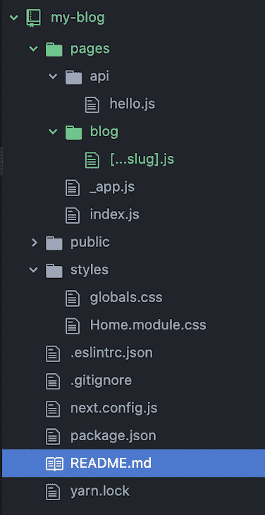
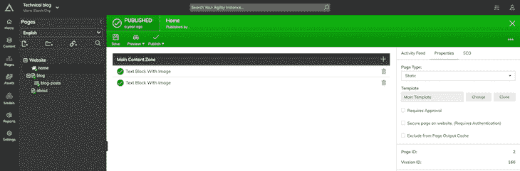
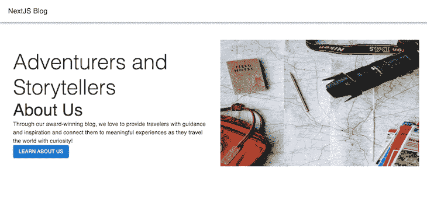
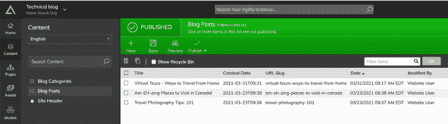
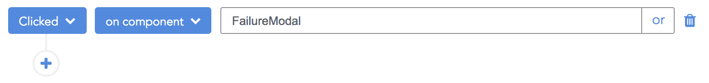

# 在 Next.js 中实现 SSR:动态路由和预取- LogRocket 博客

> 原文：<https://blog.logrocket.com/implementing-ssr-next-js-dynamic-routing-prefetching/>

***编者按:*** *本帖于 2022 年 6 月 16 日更新，以确保所有信息都是最新的，并添加了涵盖[多个段](#next-js-dynamic-routing-multiple-segments)和[命令式动态路由](#imperative-dynamic-routing-next-js)的章节，并带有 Next.js.*

服务器端渲染(SSR)已经成为一种广泛采用的技术，用于增强 web 应用程序的性能和 SEO。虽然静态站点生成(SSG)被认为更简单、更快，但在某些情况下，服务器端呈现是您唯一的选择。

然而，在特定页面上实现服务器端呈现可能是一项具有挑战性的任务。Next.js 试图通过允许您为应用程序的每个页面选择 SSG 或 SSR 来解决这个问题。

这篇文章将通过用 Agility CMS 构建一个博客来探索这些和其他使 Next.js 成为一个强大的 React 框架的概念，这是一个为速度而构建的 CMS。

这篇文章的目标是确保您理解 Next.js 提供的两种预加载技术，能够有效地利用 Next.js 提供的许多内置功能，并且能够创建和设置一个 Agility CMS 实例。

我们将涵盖的内容:

## Next.js:内置 SSR 的 React 框架

Next.js 是一个 React 框架，解决了开发人员在构建 web 应用程序时面临的常见问题。从确保使用 webpack 这样的捆绑器捆绑并最小化所有代码，到实现代码分割这样的优化以提高页面性能，Next.js 拥有您需要的所有工具。

如果你是一个 TypeScript 用户，你会很高兴听到你所需要做的就是创建一个`tsconfig.json`文件来开始！

开发体验很棒，因为你可以选择用什么来构建你的应用程序。例如，Next.js 允许您使用 CSS-in-JS 库，但是它也提供了对 Sass 和 CSS 模块的支持。

但是让 Next.js 真正伟大的是它默认预渲染页面的事实。这意味着每个页面将默认使用静态站点生成，这是构成 Next.js 混合架构的两个呈现选项之一。

然而，SSG 并不总是理想的选择，因为标记是在构建时生成的。如果您的页面包含从外部来源获取的内容并经常更改，则这些更改将不会反映在您的页面上，直到您再次构建该页面。这就是 SSR 的用武之地！

js 允许您获取动态内容，然后在每次请求时适当地生成标记。Next.js 通过为您提供在页面类型组件中声明两个异步函数之一的选项来做到这一点，这两个异步函数称为`getServerSideProps()`或`getStaticProps()`。

## 设置 Agility CMS

[Agility CMS](https://agilitycms.com/) 是一个内容管理系统，专为提高速度而打造，具有与大多数云架构相同的可扩展性。设置 Agility CMS 非常容易，因为它们有大多数流行的 React 框架的起点——包括 Next.js。

您的第一步是[创建一个 Agility CMS 帐户](https://account.agilitycms.com/sign-up?product=agility-free&source=getstarted)。完成后，您需要配置一些项目设置。

首先创建一个项目。选择“用 Next.js 写博客”选项。输入您的项目名称后，您将被带到您的仪表板。

至此，您应该有一个内容准备就绪的 CMS。您可以浏览 content 和 pages 部分，根据您的喜好编辑内容，但是您真正应该注意的是 API 键。

要获取 API 密钥，请单击左侧导航栏中的设置，然后选择 API 密钥。在下图中，您可以看到该选项以黄色突出显示:


在这个页面上，您会发现两个重要的值:项目的全局唯一标识符(GUID)和您的`defaultlive` API 密钥。把这些留着以后用——你会需要它们的！

## 为 Next.js 项目设置开发环境

首先，您需要构建一个 Next.js 应用程序。如果你曾经创建过 React 应用程序，那么[你一定知道 Create React App](https://blog.logrocket.com/next-js-vs-create-react-app/) 。Next.js 有自己的模拟名为`create-next-app`。

通过终端运行以下命令:

```
npx create-next-app my-blog

```

一旦完成所有依赖项的安装，通过运行`cd my-blog`进入`my-blog`目录。

为了让你专注于这篇文章的主题，你将使用一个叫做 [MUI(以前叫做 Material-UI)](https://mui.com/material-ui/getting-started/usage/) 的组件框架。然而，如果你喜欢写自己的风格，记住你可以利用 [Next 的内置 CSS 模块](https://nextjs.org/docs/basic-features/built-in-css-support#adding-component-level-css)和 [Sass 支持](https://nextjs.org/docs/basic-features/built-in-css-support#sass-support)。

此外，您必须安装 Agility CMS SDK，以便从其 API 获取内容。运行以下命令安装 SDK 和 Material-UI:

```
npm install @mui/material @emotion/react @emotion/styled @agility/content-fetch

```

完成后，在项目的根目录下创建一个`.env.local`文件，并添加以下环境变量，这将显示连接到 Agility CMS API 所需的凭证:

```
AGILITY_CMS_GUID=xxx
AGILITY_CMS_API_FETCH_KEY=xxx

```

用之前找到的 GUID 和`defaultlive` API 键的值替换`xxx`占位符。请记住，当您单击 API Keys 按钮时，您应该能够在 Getting Started 下找到它们。

这样，我们就可以开始写代码了！

## 创建您的 Next.js 路线

在您尝试创建您的第一个 Next.js 页面之前，您必须了解 Next.js 有一个基于文件系统的 router，这样，名为`pages`的目录下的任何文件都将成为您的应用程序的一个路由。

要开始，那么，你应该创建你所有的路线。在`pages`目录下，你会发现一个`index.js`文件。该文件将包含将在`/`提供的页面组件，或者您的应用程序的默认/主路径。

此外，您需要一个路由来为您的所有博客页面提供服务。因此，创建一个名为`blog`的目录和一个名为`[...slug].js`的文件。您将在下一个主题中回到这个概念。您的项目结构应该如下所示:



接下来，您应该初始化 Agility CMS 客户端。为了鼓励可重用性，您将在名为`lib`的项目根目录下创建一个名为`agility.js`的单独文件。

```
// lib/agility.js
import agility from "@agility/content-fetch";

const api = agility.getApi({
  guid: process.env.AGILITY_CMS_GUID,
  apiKey: process.env.AGILITY_CMS_API_FETCH_KEY
});

export default api;

```

确保您已经在`.env.local`文件中输入了 Agility CMS 项目的凭证。

## 创建您的第一个 Next.js 页面

现在让我们转到应用程序的`home/index`页面，使用`getServerSideProps()`调用 Agility CMS API 来获取主页内容:

```
// pages/index.js
import api from "../lib/agility";

/* 
* IndexPage content collapsed for readability
*/

export async function getServerSideProps() {
  const page = await api.getPage({
    pageID: 2,
    languageCode: "en-us"
  });

  return {
    props: {
      meta: { title: page.title, desc: page.seo.metaDescription },
      data: page.zones.MainContentZone.reduce((acc, curr) => {
        acc[curr.module] = curr.item;
        return acc;
      }, {})
    }
  };
}

```

`getPage()`是 Agility CMS SDK 提供的一种异步方法，只要您提供一个 pageID，就可以一次性获取整个页面。如果您的内容在多个地区，那么您还必须传入正确的`languageCode`。

可以在特定页面的设置下找到`pageID`属性的值。例如，要找到名为 home 的页面的`pageID`,您可以导航到 Agility CMS 仪表板中的页面，然后选择主页，然后在最右边的面板中单击 Properties。



一旦收到来自`getPage()`的响应，数据就可以以一种您的组件可以方便地使用的方式进行转换。例如，在代码块中，data 属性将总是包含来自`MainContentZone`数组的所有值。

`MainContentZone`是一个名为模块的对象数组，模块有名字。通过这些模块名访问内容比使用它们各自的索引(即数组中的位置)更方便。

有了现在拥有的数据，您可以用适合您的设计的方式构建您的页面，如下所示:

```
import Head from "next/head";
import { useRouter } from "next/router";

import AppBar from '@mui/material/AppBar';
import Button from '@mui/material/Button';
import Container from '@mui/material/Container';
import Grid from '@mui/material/Grid';
import Toolbar from '@mui/material/Toolbar';
import Typography from '@mui/material/Typography';

import api from "../lib/agility";

const HomePage = ({ meta, data }) => {
  const router = useRouter();
  const pageContent = data?.TextBlockWithImage?.fields;

  return (
    <>
      <Head>
        <title>{meta.title}</title>
        <meta name="viewport" content="initial-scale=1.0, width=device-width" />
        <meta name="description" content={meta.desc} />
      </Head>
      {
        pageContent && <Container maxWidth="lg" style={{ marginTop: "30px" }}>
          <Grid container spacing={3} alignItems="center">
            <Grid item xs={6}>
              <Typography variant="h2">
                {pageContent.title}
              </Typography>
              <Typography variant="h3">
                {pageContent.tagline}
              </Typography>
              <Typography variant="body1">{pageContent.content}</Typography>
              <Button
                variant="contained"
                color="primary"
                onClick={() => router.push(pageContent.primaryButton.href)}
                role="link"
              >
                {pageContent.primaryButton.text}
              </Button>
            </Grid>
            <Grid item xs={6}>
              
            </Grid>
          </Grid>
        </Container>
      }
    </>
  );
};

// getServerSideProps() has been collapsed for readability.

```

在上面的代码中，您将收到的数据分成两个属性:`meta`和`data`。`meta`属性包含页面所有与 SEO 相关的数据，您可以在 Agility CMS 的页面 SEO 类别中设置这些数据。

如果你已经在你的应用中添加了 meta 标签，那么[你可能对 React 头盔](https://blog.logrocket.com/search-optimized-spas-react-helmet/)比较熟悉。Next.js 有自己的库，用于定制`<head>`标签:`[next/head](https://nextjs.org/docs/api-reference/next/head)`。页面的所有元标签都可以放在`next/head`提供的`Head`组件中。

## 向 Next.js `App`组件添加全局导航栏

当使用 plain React 时，您会非常熟悉`app.js`文件，它充当整个组件层次结构的入口点。Next.js 项目也自带这样一个文件:`_app.js`。这个文件是为您预先生成的。

如果您想将整个应用程序包装在一个组件中，执行一些初始化操作，或者包含一些全局样式，那么`_app.js`文件就是完成这些工作的地方。这将是应用程序的[定制](https://nextjs.org/docs/advanced-features/custom-app) `[App](https://nextjs.org/docs/advanced-features/custom-app)` [组件。](https://nextjs.org/docs/advanced-features/custom-app)

让我们在您的`App`组件中添加一个导航栏:

```
import '../styles/globals.css'

import AppBar from '@mui/material/AppBar';
import Toolbar from '@mui/material/Toolbar';
import Typography from '@mui/material/Typography';

function MyApp({ Component, pageProps }) {
  return (
    <>
      <AppBar
        style={{ marginBottom: "50px" }}
        color="transparent"
        position="static"
      >
        <Toolbar>
          <Typography variant="h6">NextJS Blog</Typography>
        </Toolbar>
      </AppBar>
      <Component {...pageProps} />
    </>
  )
}

export default MyApp

```

`<Component />`是页面组件，不可避免地会作为子组件加载到`App`组件中。理想情况下，`App`组件是您为应用程序添加一个`ThemeProvider`或一个 Redux `<Provider>`的地方。

页面重新加载后，您应该会看到以下内容:



## 了解 Next.js 中的动态路由

Next.js 有一个非常强大的路由器，它是在考虑到各种用例的情况下精心构建的。如果您还记得，您创建了一个名为`[...slug].js`的文件。该文件利用了 Next.js 的[动态路由特性，解决了多个用例:](https://nextjs.org/docs/routing/introduction)

```
/page/[page-id].js will match with routes like /page/1 or /page/2, but not /page/1/2
/page/[...slug].js will match with routes like /page/1/2, but not /page/
/page/[[...slug]].js will match with routes like /page/1/2and /page/

```

需要记住的是，与特定路由参数同名的查询参数将被路由参数覆盖。例如，如果您有一条路由`/page/[id]`，那么在`/page/123?id=456`的情况下，ID 将是 123，而不是 456。

现在您已经了解了 Next.js 动态路由，让我们来研究一下博客路由:

```
import ErrorPage from "next/error";

import Container from '@mui/material/Container';
import Typography from '@mui/material/Typography';

import api from "../../lib/agility";

const BlogPostPage = ({ page }) => {

  if (!page) {
    return <ErrorPage statusCode={404} />;
  }
  return (
    <Container maxWidth="lg">
      <Typography variant="h2">{page.fields.title}</Typography>
      <Typography variant="subtitle1">
        Written by: {page.fields.authorName} on{" "}
        {new Date(page.fields.date).toUTCString()}
      </Typography>
      
      <div dangerouslySetInnerHTML={{ __html: page.fields.content }} />
    </Container>
  );
};

export async function getServerSideProps(ctx) {
  const posts = await api.getContentList({
    referenceName: "posts",
    languageCode: "en-us"
  });

  const page = posts.items.find((post) => {
    return post.fields.slug === ctx.params.slug.join("/");
  });

  return {
    props: {
      page: page || null
    }
  };
}

export default BlogPostPage;

```

`BlogPostPage`遵循与`HomePage`相同的概念和原则，除了这里使用了上下文对象(缩写为`ctx`)。

`ctx`包含一些您可以利用的属性，包括`params`属性。`params`包含所有的路线参数及其值。

此外，您正在使用 Agility CMS SDK 中一个名为`[getContentList()](https://agilitydocs.netlify.app/agility-content-fetch-js-sdk/0.8.2/agilityfetch.client.content#.getContentList)`的新方法。此方法允许您通过引用名称获取数据列表。

如果您导航到 Agility CMS 仪表板中的内容，然后选择博客文章，您将看到已经创建的文章列表，如下所示:



使用您接收到的数据，您可以使用数组高阶方法来查找一个 post，该 post 具有与您声明为`slug`的路由器参数相等的 slug。如果找到了，页面细节通过；否则，`null`作为道具传递。

Next.js 不允许你把`undefined`当道具传。如果`page`道具是 falsy，那么`BlogPostPage`会转而渲染内置的`ErrorPage`！

## 处理 Next.js 中动态路由的常见用例

很多时候，您希望在根本没有定义 route 参数的情况下显示一个特色帖子列表或某种内容—例如，`/blog/`。

您可以使用可选的动态路由的无所不包语法(`[[...slug]].js`)。但是，您必须检查废料路线参数是否未定义，并有条件地进行渲染。

更好的方法是在该 route 下声明一个`index.js`文件，这样当 route 参数没有定义时，它将指向这个文件。这是因为命名路由(即静态路由)的优先级高于动态路由。

例如，如果您已经声明了一个像`/blog/[id].js`这样的动态路由，但也声明了一个像`/blog/featured`这样的静态路由，那么 Next.js 将优先选择处理静态路由的文件，而不是处理动态路由的文件。

在`blog`目录下创建一个名为`index.js`的文件:

```
import Link from "next/link";

import Card from '@mui/material/Card';
import CardActionArea from '@mui/material/CardActionArea';
import CardActions from '@mui/material/CardActions';
import CardContent from '@mui/material/CardContent';
import CardMedia from '@mui/material/CardMedia';

import Container from '@mui/material/Container';
import Typography from '@mui/material/Typography';
import Button from '@mui/material/Button';
import Grid from '@mui/material/Grid';

import api from "../../lib/agility";

const BlogPage = ({ posts }) => {
  console.log(posts)

  return (
    <Container maxWidth="lg">
      <Typography variant="h2" gutterBottom>
        Featured Blog Posts
      </Typography>
      <Grid container spacing={2}>
        {posts && posts.map((post) => (
          <Grid item xs={4}key={post.slug}>
            <Card>
              <CardActionArea>
                <CardMedia
                  style={{ height: "240px" }}
                  image={post.image.url}
                  title={post.image.label}
                />
                <CardContent>
                  <Typography gutterBottom variant="h5" component="h2">
                    {post.title}
                  </Typography>
                  <Typography
                    variant="body2"
                    color="textSecondary"
                    component="p"
                  >
                    Written on{" "}
                    {new Date(post.date).toUTCString()}
                  </Typography>
                </CardContent>
              </CardActionArea>
              <CardActions>
                <Link href="/blog/[...slug]" as={`/blog/${post.slug}`} prefetch>
                  <Button role="link" size="small" color="primary">
                    Read
                  </Button>
                </Link>
              </CardActions>
            </Card>
          </Grid>
        ))}
      </Grid>
    </Container>
  );
};

export default BlogPage;

export async function getServerSideProps() {
  const posts = await api.getContentList({
    referenceName: "posts",
    languageCode: "en-us",
    take: 3
  });

  return {
    props: {
      posts: posts.items.map((post) => {
        const { title, slug, image, date } = post.fields;
        return { title, slug, image, date };
      })
    }
  };
}

```

就工作中的概念而言，这个页面或多或少与`BlogPostPage`相同，但是在这样的设置中，预取页面可能是有益的。如果您知道用户将访问这些页面，那么 Next.js 允许您提前获取这些页面。

为此，您应该使用通过`next/link`提供给您的`<Link>`组件。因为您正在使用动态路由，所以您应该使用包含路由参数值的`as`属性。

## 使用 Next.js 的强制性动态路由

对于 Next.js 路由，`<Link/>`组件非常方便。然而，需要注意的是 Next.js 提供了一个`useRouter`钩子来导航你的应用。除了`<Link/>`组件，您还可以执行以下操作:

```
import { useRouter } from 'next/router'

const BlogPage = ({ posts }) => {
  const router = useRouter()

  return (
   {...}
    <Button role="link" size="small" color="primary" onClick={() => router.push(`/blog/${post.slug}`)}>
                  Read
    </Button>
  {...}
  )
}

```

您还可以通过[接入 Next.js 路由器](https://nextjs.org/docs/api-reference/next/router)并使用预取方法，以编程方式预取 Next.js 中的页面:

```
import { useRouter} from "next/router";
import { useEffect } from "react";
// If you want to prefetch the contact page 
// while in the home page, you can do so like this

const HomePage = () => {
 const router = useRouter();
 useEffect(() => {
  router.prefetch('/contact');
 }, []);
 // ...
}

```

## Next.js 动态路由:多个段

到目前为止，您已经在 Next.js 中发现了带有一个像`[…slug]`这样的段的动态路由。然而，这回避了一个问题:使用 Next.js 动态路由可以有多个段吗？谢天谢地，答案是肯定的！

您在 Agility CMS 中的博客文章目前链接到您博客的特定类别。你可以在内容>博客类别中看到这些类别。

假设你想在你的 URL 中同时包含一个类别和一个 slug。使用下面的示例，并遵循以下步骤:

```
blog/travel-guide/virtual-tours-ways-to-travel-from-home
```

首先，在你的博客文件夹中，创建一个`[category]`文件夹。像你的`[…slug].js`一样，这将允许你为你的所有类别拥有多条路线。

接下来，创建一个`[…slug].js`文件。在这个文件中，您可以从 Next.js `ctx`对象中获取您的类别和 slug 参数:

```
export async function getServerSideProps(ctx) {
  const { params } = ctx
  const { slug, category } = params

  //Grab your page

  return {
    props: {
      page: page || null
    }
  };
}

```

对于 URL `/blog/travel-guide/virtual-tours-ways-to-travel-from-home`，您的参数应该是:

```
params: {
  category: 'travel-guide',
  slug: [ 'virtual-tours-ways-to-travel-from-home' ]
}

```

## SSR vs. SSG 在 Next.js:做出最好的选择

虽然当页面内容频繁变化时，Next.js 中的 SSR 是最佳选择，但如果内容是静态的，Next.js 中的 SSG 将是更好的选择。

也就是说，如果页面的大部分内容是静态的，您不必一下子就跳到服务器端呈现。更好的方法是通过使用 Next.js 为数据获取定制的钩子，像 `[useSWR](https://blog.logrocket.com/caching-clash-useswr-vs-react-query/)` [这样的](https://blog.logrocket.com/caching-clash-useswr-vs-react-query/)[，或者像 React Query](https://blog.logrocket.com/caching-clash-useswr-vs-react-query/) 这样的库，来使用客户端数据获取。

## 结论

虽然您构建的应用程序还远未准备好投入生产，但您现在应该对 Next.js 的工作方式以及 Agility CMS 如何帮助您满足内容管理需求有了相当深入的了解。

如果你想更深入地研究 Next.js，一定要查看 Next.js 的[分步教程。如果你想看看一个更适合生产的敏捷 CMS 和 Next.js 组合会是什么样子，看看这个](https://nextjs.org/learn/basics/create-nextjs-app)[范例库](https://github.com/vercel/next.js/tree/canary/examples/cms-agilitycms)。

## [LogRocket](https://lp.logrocket.com/blg/nextjs-signup) :全面了解生产 Next.js 应用

调试下一个应用程序可能会很困难，尤其是当用户遇到难以重现的问题时。如果您对监视和跟踪状态、自动显示 JavaScript 错误、跟踪缓慢的网络请求和组件加载时间感兴趣，

[try LogRocket](https://lp.logrocket.com/blg/nextjs-signup)

.

[](https://lp.logrocket.com/blg/nextjs-signup)[](https://lp.logrocket.com/blg/nextjs-signup)

LogRocket 就像是网络和移动应用的 DVR，记录下你的 Next.js 应用上发生的一切。您可以汇总并报告问题发生时应用程序的状态，而不是猜测问题发生的原因。LogRocket 还可以监控应用程序的性能，报告客户端 CPU 负载、客户端内存使用等指标。

LogRocket Redux 中间件包为您的用户会话增加了一层额外的可见性。LogRocket 记录 Redux 存储中的所有操作和状态。

让您调试 Next.js 应用的方式现代化— [开始免费监控](https://lp.logrocket.com/blg/nextjs-signup)。