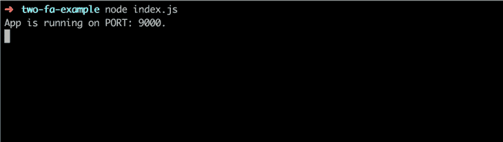
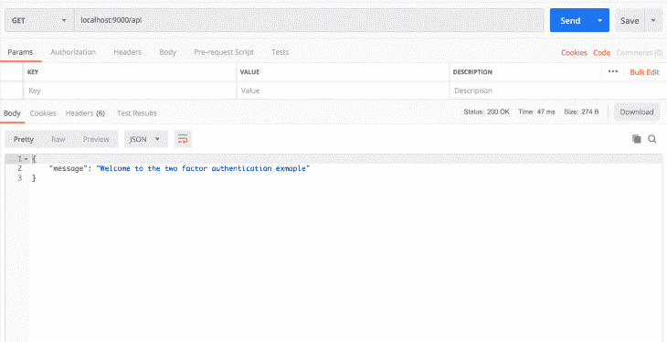
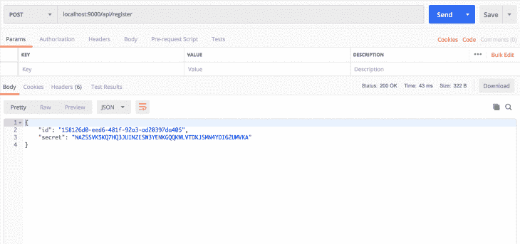
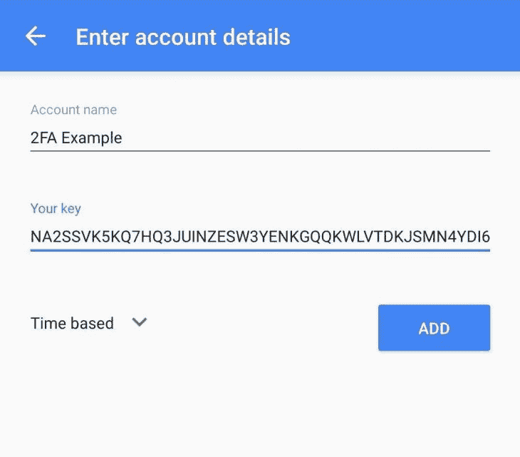
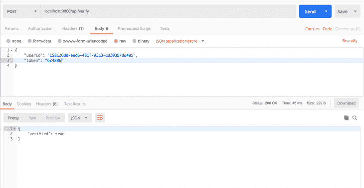
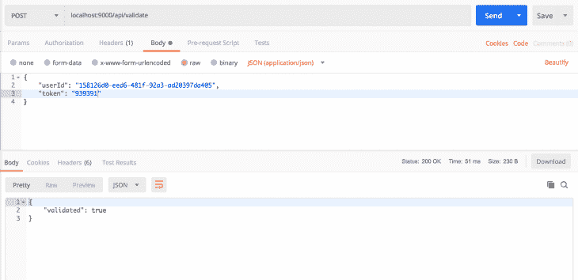

# 使用 Speakeasy - LogRocket 博客实现双因素认证

> 原文：<https://blog.logrocket.com/implementing-two-factor-authentication-using-speakeasy/>

## 介绍

今天，人们使用互联网与朋友和家人联系，管理他们的财务，投资，上课，等等。其核心是传统上需要标准授权方法(主要是用户名和密码)的服务。

随着技术变得越来越先进和复杂，保护您个人信息的传统方法不再被接受。这导致了替代方案的开发，以帮助确保您的数据的安全性。其中一项发展是双因素身份认证，也称为 2FA。双因素身份认证在标准身份认证流程的基础上提供了额外的安全层。双因素身份验证层要求您输入更多数据来访问您的帐户。这些数据可能来自不同的来源:

*   物理财产，如智能手机或门禁卡
*   生物属性，如指纹或视网膜等生物特征

最常见的双因素身份验证形式包括输入发送到手机的代码或输入从身份验证应用程序检索的代码。

### 双因素身份认证的优势:

*   它为您的帐户提供了更强的攻击防护和额外的安全层
*   在大多数情况下，它不会增加用户的额外费用
*   对于大多数服务来说，设置 2FA 相对容易。对于大多数实施来说，用户所要做的就是启用双因素认证，并扫描二维码或输入他们的手机号码，以便他们可以分别查看或接收认证码

### 双因素身份认证的缺点:

*   双因素身份认证并非万无一失，仍然容易受到恶意软件、[中间人](https://en.wikipedia.org/wiki/Man-in-the-middle_attack)或网络钓鱼攻击的攻击，这些攻击可以使攻击者避开该过程或拦截代码
*   它包括与服务提供商共享额外的数据，如您的电话号码
*   它在身份验证过程中增加了一个额外的步骤，有些用户可能认为这不方便

这些是一般的优点和缺点，每种类型的双因素身份认证都有其独特的优点和缺点。

在本文中，我们将关注使用 [Speakeasy](https://github.com/speakeasyjs/speakeasy) 库实现基于时间的一次性密码(TOTP)。本文的范围将涵盖双因素身份验证的后端实现，因此我们不会为它构建用户界面。

## 先决条件

我们将主要关注双因素身份验证的后端实现。为了演示实现，我们将构建一个简单的 [Node.js](https://nodejs.org/en/) 服务器。熟悉 Node.js 和 Express 是有益的，但不是必需的。在我们开始构建服务器之前，确保您的机器上已经安装了[节点](https://nodejs.org/en/)、[纱线](https://yarnpkg.com/)或 [npm](https://npmjs.com/) 。我已经为它们中的每一个链接了站点，如果你还没有的话，你可以在那里找到安装它们的说明。

## 设置

我们要做的第一件事是创建一个包含我们项目的文件夹:

```
$ mkdir two-fa-example
$ cd two-fa-example
```

创建项目文件夹后，我们将使用 npm init 来初始化我们的项目:

```
$ npm init -y
```

这将生成一个 package.json 文件，其内容如下:

```
{
  "name": "two-fa-example",
  "version": "1.0.0",
  "description": "",
  "main": "app.js",
  "scripts": {
    "test": "echo \"Error: no test specified\" && exit 1"
  },
  "keywords": [],
  "author": "",
  "license": "ISC"
}
```

### 安装依赖项

现在我们已经完成了初始设置，我们将安装我们需要的所有依赖项。

运行以下命令安装必要的依赖项:

```
$ yarn add express body-parser node-json-db uuid speakeasy
```

[Express](https://expressjs.com/) 是一个简单的 Node.js web 应用服务器框架，我们将使用它来创建我们的服务器。另一方面，body-parser 包是一个中间件，它解析传入的 HTTP POST 请求的 JSON、buffer、string 和 URL 编码的数据，并在它们到达您的处理程序之前将它们作为`req.body`公开。我想保持这篇文章的简单性，重点放在双因素认证的概念上。出于这个原因，我将避免建立一个拥有数据库、模型和控制器的成熟服务器。因为出于演示目的，我们仍然需要存储一些数据，所以我们将使用 [node-json-db](https://www.npmjs.com/package/node-json-db) 进行存储。它使用 JSON 文件进行存储。

我们现在拥有了创建服务器所需的所有部件。在我们的项目文件夹中，创建一个`index.js`文件，并向其中添加以下代码:

```
const express = require("express");
const bodyParser = require('body-parser');
const JsonDB = require('node-json-db').JsonDB;
const Config = require('node-json-db/dist/lib/JsonDBConfig').Config;
const uuid = require("uuid");
const speakeasy = require("speakeasy");

const app = express();

/**
 * Creates a node-json-db database config
 * @param {string} name - name of the JSON storage file
 * @param {boolean} Tells the to save on each push otherwise the save() mthod has to be called.
 * @param {boolean} Instructs JsonDB to save the database in human readable format
 * @param {string} separator - the separator to use when accessing database values
 */
const dbConfig = new Config("myDataBase", true, false, '/')

/**
 * Creates a Node-json-db JSON storage file
 * @param {instance} dbConfig - Node-json-db configuration
 */
const db = new JsonDB(dbConfig);

app.use(bodyParser.json());
app.use(bodyParser.urlencoded({ extended: true }));
app.get("/api", (req,res) => {
  res.json({ message: "Welcome to the two factor authentication exmaple" })
});

const port = 9000;
app.listen(port, () => {
  console.log(`App is running on PORT: ${port}.`);
});
```

在项目根目录下的终端中，运行应用程序以确保一切正常:

```
$ node index.js
```





## 生成密钥

启用双因素身份验证的第一步是创建一个密钥来链接服务器和将生成双因素身份验证代码的应用程序。我们需要添加一个路由来创建一个用户，并发送回用户 ID 以及一个密钥来设置双因素身份验证。为此，我们将使用 Speakeasy 的`generateSecret`功能。这将返回一个具有`[ascii](https://en.wikipedia.org/wiki/ASCII)`、[、`hex`、](https://en.wikipedia.org/wiki/Hexadecimal)、`[base32](https://en.wikipedia.org/wiki/Base32)`和`otpauth_url`格式的秘密的对象。`Otpauth_url`是一个二维码，其中包含编码为 URL 的秘密，格式为`otpauth://TYPE/LABEL?PARAMETERS`。`otpauth_url`可用于创建一个`QR code`,用户可以通过扫描来设置 2FA。由于我们不会构建一个前端应用程序，我们将只使用 base32 字符串来设置 2FA。完成初始工作的路线如下所示:

```
app.post("/api/register", (req, res) => {
  const id = uuid.v4();
  try {
    const path = `/user/${id}`;
    // Create temporary secret until it it verified
    const temp_secret = speakeasy.generateSecret();
    // Create user in the database
    db.push(path, { id, temp_secret });
    // Send user id and base32 key to user
    res.json({ id, secret: temp_secret.base32 })
  } catch(e) {
    console.log(e);
    res.status(500).json({ message: 'Error generating secret key'})
  }
})
```

添加此代码后，我们可以从 Postman 向此端点发出请求来生成一个秘密。我们应该得到这样的回应:



打开你的谷歌认证器应用程序(这可以安装在你的手机从谷歌 Play 商店为 Android 和应用商店为 iOS)并输入你刚刚收到的密钥。



## 验证双因素身份验证机密

在我们在 authenticator 应用程序中输入密钥后，我们需要验证它，以便我们可以使用它来生成代码。你会注意到我们把这个秘密作为临时秘密保存。确认后，我们可以继续下去，并永久存储它。为了执行验证，我们需要创建一个端点，从 authenticator 应用程序接收用户 ID 和代码。然后，端点根据存储的临时秘密对它们进行验证，如果一切都通过验证，我们将永久存储该秘密:

```
app.post("/api/verify", (req,res) => {
  const { userId, token } = req.body;
  try {
    // Retrieve user from database
    const path = `/user/${userId}`;
    const user = db.getData(path);
    console.log({ user })
    const { base32: secret } = user.temp_secret;
    const verified = speakeasy.totp.verify({
      secret,
      encoding: 'base32',
      token
    });
    if (verified) {
      // Update user data
      db.push(path, { id: userId, secret: user.temp_secret });
      res.json({ verified: true })
    } else {
      res.json({ verified: false})
    }
  } catch(error) {
    console.error(error);
    res.status(500).json({ message: 'Error retrieving user'})
  };
})
```

转到您的双因素身份认证应用程序并检索代码，以便我们可以使用邮递员请求来验证密码。


验证后，密钥被永久保存，并用于验证未来的代码。

## 验证用户令牌

双因素身份验证的最后一步是验证用户从其身份验证器应用程序输入的代码。我们需要添加另一个路由来确认用户输入的令牌是有效的。该端点将接收用户 ID 和令牌，然后它将对照永久存储的秘密来验证令牌。验证由 Speakeasy `totp(Time Based One Time Password)`验证功能处理。

这将接收一个对象，该对象包含机密、用于验证令牌的编码、令牌和窗口选项。窗口是指令牌有效的时间段。这通常是 30 秒，但是可以根据双因素过程的开发者所选择的时间而变化。在验证过程中，窗口选项指定要交叉检查令牌之前和之后的当前窗口的数量。如果用户输入令牌晚了几秒钟，增加窗口数量仍能使用户得到验证。你要小心不要给太大的窗口余量，因为这意味着验证过程变得不安全。让我们添加验证令牌的端点:

```
app.post("/api/validate", (req,res) => {
  const { userId, token } = req.body;
  try {
    // Retrieve user from database
    const path = `/user/${userId}`;
    const user = db.getData(path);
    console.log({ user })
    const { base32: secret } = user.secret;
    // Returns true if the token matches
    const tokenValidates = speakeasy.totp.verify({
      secret,
      encoding: 'base32',
      token,
      window: 1
    });
    if (tokenValidates) {
      res.json({ validated: true })
    } else {
      res.json({ validated: false})
    }
  } catch(error) {
    console.error(error);
    res.status(500).json({ message: 'Error retrieving user'})
  };
})
```

让我们从 authenticator 应用程序获得另一个代码，我们可以用 Postman 验证它。



就是这样！我们已经成功创建了双因素身份认证。在本文中，我们看到了如何创建一个在您的服务器和 authenticator 应用程序之间共享的秘密，验证该秘密并使用它来验证令牌。完整的`index.js`文件应该如下所示:

```
const express = require("express");
const bodyParser = require('body-parser');
const JsonDB = require('node-json-db').JsonDB;
const Config = require('node-json-db/dist/lib/JsonDBConfig').Config;
const uuid = require("uuid");
const speakeasy = require("speakeasy");

const app = express();

/**
 * Creates a node-json-db database config
 * @param {string} name - name of the JSON storage file
 * @param {boolean} Tells the to save on each push otherwise the save() mthod has to be called.
 * @param {boolean} Instructs JsonDB to save the database in human readable format
 * @param {string} separator - the separator to use when accessing database values
 */
const dbConfig = new Config("myDataBase", true, false, '/')

/**
 * Creates a Node-json-db JSON storage file
 * @param {instance} dbConfig - Node-json-db configuration
 */
const db = new JsonDB(dbConfig);

app.use(bodyParser.json());
app.use(bodyParser.urlencoded({ extended: true }));

app.get("/api", (req,res) => {
  res.json({ message: "Welcome to the two factor authentication exmaple" })
});

app.post("/api/register", (req, res) => {
  const id = uuid.v4();
  try {
    const path = `/user/${id}`;
    // Create temporary secret until it it verified
    const temp_secret = speakeasy.generateSecret();
    // Create user in the database
    db.push(path, { id, temp_secret });
    // Send user id and base32 key to user
    res.json({ id, secret: temp_secret.base32 })
  } catch(e) {
    console.log(e);
    res.status(500).json({ message: 'Error generating secret key'})
  }
})

app.post("/api/verify", (req,res) => {
  const { userId, token } = req.body;
  try {
    // Retrieve user from database
    const path = `/user/${userId}`;
    const user = db.getData(path);
    console.log({ user })
    const { base32: secret } = user.temp_secret;
    const verified = speakeasy.totp.verify({
      secret,
      encoding: 'base32',
      token
    });
    if (verified) {
      // Update user data
      db.push(path, { id: userId, secret: user.temp_secret });
      res.json({ verified: true })
    } else {
      res.json({ verified: false})
    }
  } catch(error) {
    console.error(error);
    res.status(500).json({ message: 'Error retrieving user'})
  };
})

app.post("/api/validate", (req,res) => {
  const { userId, token } = req.body;
  try {
    // Retrieve user from database
    const path = `/user/${userId}`;
    const user = db.getData(path);
    console.log({ user })
    const { base32: secret } = user.secret;
    // Returns true if the token matches
    const tokenValidates = speakeasy.totp.verify({
      secret,
      encoding: 'base32',
      token,
      window: 1
    });
    if (tokenValidates) {
      res.json({ validated: true })
    } else {
      res.json({ validated: false})
    }
  } catch(error) {
    console.error(error);
    res.status(500).json({ message: 'Error retrieving user'})
  };
})

const port = 9000;

app.listen(port, () => {
  console.log(`App is running on PORT: ${port}.`);
});
```

## 后续步骤

本文的重点是实现双因素身份验证功能，主要是在后端。然而，整个过程比这更复杂。在普通应用程序中，用户将注册并选择是否启用双因素身份验证。下次他们登录时，我们会将他们的主要登录标识符(如用户名)发送到服务器，以检查他们是否启用了双因素身份验证。如果他们没有启用，我们会提交用户名和密码并登录。

如果他们启用了双因素身份验证，我们会向他们显示一个输入，让他们输入一个代码，我们会将该代码连同他们的登录凭据一起发送到服务器进行验证。虽然我们使用 authenticator 应用程序进行了双因素身份验证，但您也可以使用 Speakeasy 生成代码，并通过短信发送给用户进行验证。Speakeasy 使向应用程序添加双因素身份验证变得非常容易。您可以通过构建一个用户界面来挑战自己，该用户界面允许用户使用用户名和密码进行注册，并允许用户选择启用双因素身份验证并扫描二维码以将其连接到双因素身份验证应用程序。这篇文章的代码可以在 [GitHub](https://github.com/jkithome/2fa-speakeasy-example) 上找到。让我知道你对这篇文章的看法以及评论中的任何建议。

## 使用 [LogRocket](https://lp.logrocket.com/blg/signup) 消除传统错误报告的干扰

[](https://lp.logrocket.com/blg/signup)

[LogRocket](https://lp.logrocket.com/blg/signup) 是一个数字体验分析解决方案，它可以保护您免受数百个假阳性错误警报的影响，只针对几个真正重要的项目。LogRocket 会告诉您应用程序中实际影响用户的最具影响力的 bug 和 UX 问题。

然后，使用具有深层技术遥测的会话重放来确切地查看用户看到了什么以及是什么导致了问题，就像你在他们身后看一样。

LogRocket 自动聚合客户端错误、JS 异常、前端性能指标和用户交互。然后 LogRocket 使用机器学习来告诉你哪些问题正在影响大多数用户，并提供你需要修复它的上下文。

关注重要的 bug—[今天就试试 LogRocket】。](https://lp.logrocket.com/blg/signup-issue-free)