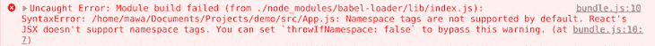
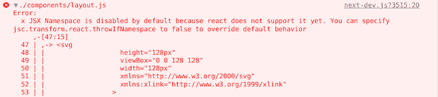

# 如何将 SVG 导入到 Next.js 应用程序中

> 原文：<https://blog.logrocket.com/import-svgs-to-next-js-project/>

将 SVG 导入 Next.js 应用程序是我们当今项目的一个常见需求。随着 SVG 格式现在得到大量库的支持，以及它在可伸缩性、性能和灵活性方面的许多好处，知道如何使用它们变得越来越重要。

虽然我们主要关注的是 SVG，但是我们在这篇文章中强调的大多数包也适用于其他图像格式。我们还将检查一些常见错误以及如何纠正它们，以便您在将 SVG 导入到 Next.js 项目中时能够有信心。

本文将探索在 Next.js 应用程序中导入和使用 SVG 的不同方法。让我们开始吧。

## Next.js 等框架中的 SVG

可缩放矢量图形，更好地被称为 SVGs，是最流行的图像格式之一，因为它们是轻量级的，可缩放的，能够[动画化](https://blog.logrocket.com/how-to-animate-svg-css-tutorial-examples/)，并且[灵活](https://blog.logrocket.com/svg-vs-canvas/)；允许您缩放和调整它们的大小而不损失图像质量。

尽管 SVG 图像很受欢迎，但是它们的使用并不像您想象的那样简单，特别是对于前端框架，比如使用打包器的 [React](https://blog.logrocket.com/how-to-use-svgs-react/) 和 Next.js。

因此，当试图在 Next.js 或 React 应用程序中简单地导入或使用 SVG 图像时，经常会遇到不同的错误，这可能会令人沮丧！

毫无疑问，SVG 的好处意味着开发人员不会很快停止使用它们，所以了解如何方便地将它们添加到我们的项目中是很重要的。

## 如何在 Next.js 中导入 SVG

Next.js 有内置的`next/image`组件，用于导入和渲染图像。

但是，您也可以将 SVG 图像内联呈现为 JSX 元素，或者使用第三方包导入并呈现它。

在接下来的小节中，我们将探讨如何在 Next.js 应用程序中导入 SVG。

### 在 React 组件中使用 JSX 语法嵌入 SVG

在 React 组件中使用 SVG 最简单的方法之一是内嵌它。但是，这需要您将 SVG 元素转换成 JSX 语法。有几个在线工具可以将 SVG 图像标记转换成 JSX 语法——一个这样的工具是 [SVGR](https://react-svgr.com/playground/) 。

SVGR 将 SVG 转换为 JSX 语法，并将其封装在 React 功能组件中，如下所示:

```
const TwitterIcon = ({ props }) => (
  <svg  width={48} height={48} {...props}>
    <linearGradient
      id="a"
      x1={10.341}
      x2={40.798}
      y1={8.312}
      y2={38.769}
      gradientUnits="userSpaceOnUse"
    >
      <stop offset={0} stopColor="#2aa4f4" />
      <stop offset={1} stopColor="#007ad9" />
    </linearGradient>
    <path
      fill="url(#a)"
      d="M46.105 ..."
    />
  </svg>
)

```

如果在嵌入 React 组件之前没有将 SVG 转换成 JSX 语法，您可能会遇到下面的错误，所以一定要使用像 SVGR 这样的工具。



> **注意，**如你所见，默认情况下不支持名称空间标签——你可以设置`throwIfNamespace: false`来绕过这个警告。

您也可能在 Next.js 中得到下面的错误，而不是上面的错误。



> **注意，**同样，您会看到 JSX 名称空间在默认情况下是禁用的，因为 React 还不支持它。如上所述，您可以指定`jsc.transform.react.throwIfNamespace`到`false`来覆盖默认行为。

### 如何使用`next/image`组件在 Next.js 中加载 SVG

在 Next.js 中，`next/image`组件是加载和呈现图像(包括 SVG)的实际组件。

该组件可以有效地加载和呈现图像，还可以优化您的图像，以提高页面加载速度、性能和视觉稳定性。

如果您已经使用`create-next-app`命令行工具设置了 Next.js 应用程序，那么`next/image`组件应该对您的应用程序可用。

您可以像这样导入和使用它(参见下面显示的图标):

```
import Image from 'next/image';
const App = () => (
  <div>
    <Image
      priority
      src="/images/twitter-icon.svg"
      height={32}
      width={32}
      alt="Follow us on Twitter"
    />
  </div>
);

```


当您使用`next/image`组件时，请注意 Next.js 服务于静态资产，比如来自项目根目录中公共目录的图像。因此，在上面的例子中，Twitter 图标 SVG 必须在您的`public`目录中的`images`目录中。

### 使用 next-images 包导入 Next.js 中的 SVG

[next-images](https://www.npmjs.com/package/next-images) 包是用于在 next 中导入图像的第三方包。

可以用它代替上面介绍的内置`next/image`组件。使用 next-images，您可以从本地机器或 CDN 加载图像。

此外，您还可以使用它在 Base64 编码中嵌入小束大小的图像，并通过向图像名称添加内容哈希来缓存图像。

像任何其他 npm 软件包一样，使用以下命令从 npm 软件包注册表安装下一个映像:

```
# NPM
npm install next-images

# Yarn
yarn add next-images

```

安装后，在项目目录的根目录下创建一个`next.config.js`文件，并添加以下基本配置:

```
const withImages = require('next-images');
module.exports = withImages(); 

```

在将必要的配置添加到`next.config.js`文件之后，如上所述，您可以将 SVG 导入到您的组件中并呈现它，如下所示:

```
import twitterIcon from "./twitter-icon.svg";

const App = () => ;

```

使用 next-images 包时，可以从项目目录或 CDN 中的文件加载图像。

* * *

### 更多来自 LogRocket 的精彩文章:

* * *

与内置的`next/images`组件和其他第三方包不同，next-images 包不支持图像优化技术，如压缩和调整大小。

### 使用 SVGR 导入 Next.js 中的 SVG

正如我们之前提到的， [SVGR](https://github.com/gregberge/svgr) 是一个第三方包，用于将 SVG 图像转换为 React 组件——一些流行的 React 项目模板创建者，如 create-react-app，实际上在幕后使用 SVGR。

将其作为开发依赖项进行安装，以便在 Next.js 应用程序中开始导入 SVG 作为 React 组件:

```
# NPM
npm install --save-dev @svgr/webpack

# Yarn 
yarn add --dev @svgr/webpack

```

安装后，在项目目录的根目录下创建一个`next.config.js`文件，并添加以下基本 webpack 配置。

```
module.exports = {
  webpack(config) {
    config.module.rules.push({
      test: /\.svg$/i,
      issuer: /\.[jt]sx?$/,
      use: ['@svgr/webpack'],
    })

    return config
  },
}

```

现在可以将 SVG 作为 React 组件导入，并在 Next.js 应用程序中呈现它。

```
import TwitterIcon from "./twitter-icon.svg";
const Example = () => <TwitterIcon />; 

```

### 使用 babel-plugin-inline-react-svg 在 Next.js 中加载 svg

不像前一小节那样使用 SVGR 包导入 SVG 图像，也可以使用一个 Babel 插件来达到同样的效果。

要开始使用[babel-plugin-inline-react-SVG](https://www.npmjs.com/package/babel-plugin-inline-react-svg)，使用以下命令从 npm 包注册表将其作为开发依赖项安装:

```
npm i -D babel-plugin-inline-react-svg

```

安装后，在项目目录的根目录下创建一个`.babelrc`或`babel.config.json`配置文件。您可以将下面代码块中的代码复制并粘贴到其中——如果您有一个 Babel 配置文件，Next.js 会将它视为真理的最终来源。

使用 create-next-app 的普通 Next.js 项目设置将包括开箱即用的`next/babel`预设。

由于 Next.js 会将项目目录根目录下的`.babelrc`或`babel.config.json`文件视为主要信息来源，因此它必须包含您需要的所有内容——包括 Next.js 需要的内容。

```
{
  "presets": ["next/babel"],
  "plugins": ["inline-react-svg"]
}

```

完成这些之后，您可以将 SVG 图像作为 React 组件导入，并在您的 Next.js 应用程序中呈现它们。

```
import TwitterIcon from "./twitter-icon.svg";
const Example = () => <TwitterIcon />; 

```

## 比较 Next.js 中导入 SVG 的选项

Next.js 具有优秀的内置功能，可以加载和呈现多种图像格式，包括 SVG。`next/image`组件是 HTML 图像元素的扩展，可以有效地加载图像，同时还提供开箱即用的性能优化。根据我的经验，使用`next-image`可以加快页面加载速度，提高性能。

因此，在我看来，内置的`next/image`组件拥有在 Next.js 应用程序中高效加载和呈现 SVG 图像所需的所有特性。它是使用 create-next-app 命令行工具创建的任何 Next 应用程序的一部分。

然而，您也可以探索我在本文中强调的第三方选项，但是您应该意识到在您的应用程序中使用这样的包的缺点。

这些缺点主要是它们给应用程序增加了一个额外的包，这可以通过使用`next/image`来避免。您还需要考虑应用程序中第三方包的长期维护，以及依赖长期维护是否可行。

## 结论

我希望本文已经向您展示了在 Next.js 应用程序中导入和使用 SVG 和图像的各种方法。如果我错过了什么或者关于你自己导入 SVG 的经历，请在下面的评论区留下评论！

## [LogRocket](https://lp.logrocket.com/blg/nextjs-signup) :全面了解生产 Next.js 应用

调试下一个应用程序可能会很困难，尤其是当用户遇到难以重现的问题时。如果您对监视和跟踪状态、自动显示 JavaScript 错误、跟踪缓慢的网络请求和组件加载时间感兴趣，

[try LogRocket](https://lp.logrocket.com/blg/nextjs-signup)

.

[](https://lp.logrocket.com/blg/nextjs-signup)[](https://lp.logrocket.com/blg/nextjs-signup)

LogRocket 就像是网络和移动应用的 DVR，记录下你的 Next.js 应用上发生的一切。您可以汇总并报告问题发生时应用程序的状态，而不是猜测问题发生的原因。LogRocket 还可以监控应用程序的性能，报告客户端 CPU 负载、客户端内存使用等指标。

LogRocket Redux 中间件包为您的用户会话增加了一层额外的可见性。LogRocket 记录 Redux 存储中的所有操作和状态。

让您调试 Next.js 应用的方式现代化— [开始免费监控](https://lp.logrocket.com/blg/nextjs-signup)。