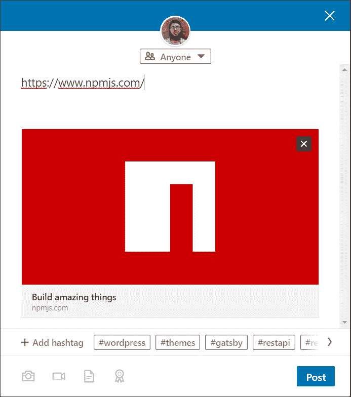

# React 服务器端渲染的 Amp 性能

> 原文：<https://blog.logrocket.com/improve-app-performance-react-server-side-rendering/>

***编者按:*** *本文于 2022 年 5 月 4 日更新，包括 Create React App 的更新信息，以及关于其他 SSR 框架的细节。*

在本文中，我们将研究 web 应用程序的不同类型的呈现。我们将仔细研究 React 中的服务器端渲染，并检查服务器端渲染相对于传统客户端渲染的优势。

*向前跳转:*

## 使用 Create React 应用程序渲染

你们中的许多人可能会使用 React CLI，更好的名称是 [Create React App (CRA)](https://create-react-app.dev) ，来启动和运行应用程序。这种方法有许多优点；然而，用 CRA 建造也有一些缺点。

例如，当你从一个用 CRA 初始化的网络应用程序中`view source`浏览一个网页时，你会注意到它几乎是一个空页面，只有`<head>`部分，而在`<body>`中几乎没有任何内容。

这里有一个例子:

React app initialized using Create React App.

这是因为 CRA 在客户端渲染你的应用程序，这意味着构建。js 文件首先被下载到用户的浏览器，然后页面的其余部分开始加载。这增加了初始加载时间，并且一些 web 爬网程序无法对网站进行索引。

有没有更好的方法来渲染你的 app？是啊！

这就是 React 的服务器端渲染的用武之地。

在本文中，我想向您介绍使用 React 的服务器端呈现(SSR)、使用它的原因以及一些在服务器端呈现 React 的流行框架。我还想谈谈 SSR React 什么时候没有意义。本文面向已经在客户端使用 React 的开发人员。

在深入研究 React 的服务器端呈现之前，让我们回顾一些不同类型的 web 应用程序，以便更好地理解 SSR 应用程序的好处。

## 什么是服务器端渲染？

服务器端渲染是指网页上的内容使用 JavaScript 在服务器上渲染，而不是在浏览器上渲染。例如，对于一个典型的 PHP 或 WordPress 站点，页面是从通过 HTTP 传输的内容中加载的，这些内容是在服务器上呈现的，并且是完全呈现的 HTML。

这与用 CRA 构建的 React 应用程序形成对比，React 应用程序只向客户端发送一个. js 文件，客户端的浏览器 JavaScript 引擎在。js 文件已加载。传统 SSR 语言/框架的例子有 PHP、Java、ASP.NET 和 Node.js

在客户端库涌入之前，传统的 SSR 应用程序在早期网络中占主导地位。现在，服务器端渲染的 React 应用程序为服务器使用 Node，这是与传统服务器渲染应用程序的一个关键区别(我们将在本文后面看到如何实现)。

与客户端渲染的应用程序相比，SSR 应用程序提供了更快的初始加载时间和更好的 SEO 性能，但也有一些缺点。首先，每个请求都会导致一个新页面从服务器重新呈现到浏览器。这意味着每次向服务器发送请求时，所有的脚本、样式和模板都要在浏览器上重新加载，导致用户体验不佳。

## 什么是单页应用程序？

单页应用程序(spa)或客户端呈现(CSR)应用程序使用 JavaScript 在浏览器中呈现内容，而不是在每次向服务器发送请求时都刷新页面。服务器发送原始 HTML 文档，同时内容通过浏览器的 JavaScript 呈现到 HTML 文档中。

## 什么是静态生成的应用程序？

静态生成的应用程序是使用静态站点生成器(如 Gatsby)预先生成的，并作为静态 HTML 页面存储在托管服务器上。将这些静态文件部署到静态托管服务器不需要节点或其他服务器端支持。因此，当应用程序第一次在浏览器中加载时，您总是可以立即获得全部内容，然后应用程序将像常规 SPA 一样运行。

静态生成的应用程序不支持实时渲染。因此，在构建实时 web 应用程序(如论坛或聊天应用程序)时，这种类型的呈现并不是一个好的选择。

## 为什么要转向 React 服务器端渲染？

正如我之前所说，服务器端呈现最初意味着从服务器呈现和加载每个页面。然而，随着服务器端(通用)React 的引入，情况略有不同。

初始页面从服务器呈现，这意味着后续页面直接从客户端加载。因此，您拥有了两个世界的优势——初始服务器端内容的强大功能加上快速的后续加载，后者只请求未来请求所需的内容。

除了上述好处之外，当您迁移到 SSR 时，您还可以获得其他一些好处:

### 提高性能

[Arunoda Susiripala](https://twitter.com/arunoda) ，以前是来自[Vercel 的工程师，谈到性能](https://youtu.be/ms2aOV06_qk)是转向服务器端渲染的主要原因。SSR 意味着初始加载不需要加载器或旋转器。这意味着，一般来说， [SSR 会跑赢南车](https://blog.logrocket.com/next-js-vs-create-react-app/)。

SSR 应用程序将 JavaScript 和 CSS 分成块，优化资源，并在服务器上呈现页面，然后提供给客户端浏览器，从而加快初始加载时间。

更快的加载速度为最终用户带来了更好的体验。这是许多大公司在他们的网站上采用 SSR 方法的原因之一。

### 增强的搜索引擎优化

到目前为止，您可能已经听说 Google now 抓取用 JavaScript 构建的 web 应用程序，所以您最好准备好服务器端呈现的内容，以便 Google 和其他搜索引擎抓取您的站点。[每 10up](https://10up.github.io/Engineering-Best-Practices/react/) :

> 注意，到目前为止，Google 和 Bing 可以索引同步 JavaScript 应用程序——同步是关键词。如果您的应用程序以加载微调器开始，然后通过 Ajax 获取内容，爬虫将只等待几秒钟加载完成。这意味着如果在 SEO 很重要的页面上异步获取内容，SSR 可能是必要的。

借助 SSR 搜索引擎，爬虫可以探索页面，以提高应用程序的 SEO 性能。这是因为在提供给客户端之前，所有页面都在服务器上呈现了相关的元数据、段落和标题，使您能够获得传统网站 SEO 的好处。

### 改善用户体验

初始加载后，通用 SSR 应用程序的行为就像典型的 spa 一样，页面和路由之间的转换是无缝的。只有数据被来回发送，HTML 内容容器不被重新呈现。

### 增强社交分享

SSR 的另一个优势是，当你通过社交媒体分享网页内容时，你会得到一个精心制作的片段和特色图片。当你只有客户端渲染的应用时，这是不可能的。

例如，当在 LinkedIn 上共享时，服务器端呈现的 React 应用程序看起来是这样的:

Sharing a server-rendered app on social media.

## React 中的服务器端渲染入门

在没有框架的情况下开始是可能的，但我不推荐这种方法，因为 React SSR 应用程序中有许多考虑因素和移动部分。例如，您必须自己处理捆绑、缩小和热重新加载(以及更多)。

然而，如果你想走这条路，我推荐你阅读罗杰·金的教程。

### React SSR 框架

如果你想在服务器端渲染 React，我建议选择一个框架。以下是一些可以考虑的框架:

### Next.js

Next.js 是一个拥有强大社区的伟大框架。Next.js 提供了很多内置特性，你不必担心捆绑、缩小或热重装。您可以将页面创建为文件中的 React 组件。

如果您使用过 PHP，您可能会习惯于此。除了社区和支持，还有许多大公司在生产中使用 Next.js，包括 [npm、网飞和 Auth0](https://hyperion.alpha.spectrum.chat/next-js/general/companies-sites-using-next-js~e425a8b6-c9cb-4cd1-90bb-740fb3bd7541) 。

### 狂欢

贾里德·帕尔默的项目 Razzle 最近获得了很多关注。来自[其 GitHub 页面](https://github.com/jaredpalmer/razzle):

> “Razzle 是一个工具，它将 SSR 所需的所有复杂配置抽象为一个单一的依赖项，为您提供令人惊叹的开发人员体验 [create-react-app](https://github.com/facebookincubator/create-react-app) ，但将应用程序的其余架构决策(关于框架、路由和数据获取)留给您自己。”

Razzle 很容易上手，默认使用 React Router 4(不像 Next.js 没有内置路由器)。

### 再搅拌

Remix 是一个 React 框架，具有服务器端渲染、简单的数据获取和变化以及灵活的开发者体验，这使得构建具有良好用户体验的 web 应用变得容易。

Remix 通过利用分布式系统和原生浏览器功能，而不是笨拙的静态构建，提供了快速的页面加载和流畅的过渡。因为它使用 Web Fetch API 而不是 Node，所以它可以在任何地方运行。

### 其他备选方案

React 不是银弹。也许你的团队更熟悉 Vue 或另一个 JavaScript 框架。也许静态站点最适合你的用例。如果您不想使用 React，或者您想使用静态站点生成器，有几个备选方案。

#### Nuxt.js

[Nuxt.js](https://nuxtjs.org/) 是 Vue.js 的服务器端渲染框架，在 Vue.js 社区很受欢迎。如果你正在 Vue.js 世界中寻找 Next.js 或 Razzle 的替代品，请尝试一下。

#### 角度通用

[Angular](https://angular.io/) 还通过 [Angular Universal](https://angular.io/guide/universal) 为服务器端渲染和预渲染解决方案提供支持。如果你正在角度世界中寻找 Next.js、remix 或 Razzle 的替代品，请尝试一下。

#### 苗条套装

SvelteKit 是一个基于 T2 的开源框架，用于快速开发高性能的网络应用。它还包括服务器端渲染，可以按应用程序或页面进行配置，允许您在不需要时关闭 SSR。

#### 盖茨比（姓）

你会看到几乎所有流行的 JavaScript 开发人员都在谈论 [Gatsby](https://gatsbyjs.org/) 。基于 React 的静态站点生成器[凭借其出色的 UX(用户体验)和 DX(开发者体验)赢得了许多](https://blog.logrocket.com/is-gatsby-really-that-great-e7b19c4c1c05/)的芳心。

准确的说，它在运行时不做 SSR。相反，Gatsby 在构建时使用 Node.js 进行服务器端呈现，在部署站点时创建静态 HTML、CSS 和 js。

这导致极快的加载时间，并有进一步的优化，如基于路由的代码分割和预取。

## 示例:React 中的服务器端渲染

几个月前，我探索了 SSR React 应用程序，并用 Next.js 创建了一个应用程序，并将其托管在 Now 上——一个无服务器平台。注意，Next 和 Now 都来自一家名为 [Vercel](https://vercel.com/) 的公司，该公司在教育开发人员关于 React 和无服务器技术方面做得非常好，同时还提供其他出色的产品。

我的应用程序从 WooCommerce(一个 WordPress 电子商务插件)REST API 端点获取数据，并将其显示在 Next.js 应用程序中。你可以在 [GitHub](https://github.com/m-muhsin/woocommerce-next) 上查看我的应用，在这里看一下[的演示。](https://woocommerce-next.now.sh/)

## 你总是需要 SSR 吗？

简单来说，答案是否定的。并非所有的应用都需要服务器端渲染，尤其是带有仪表盘和认证的应用，它们不需要 SEO 或通过社交媒体分享。此外，构建服务器渲染的 React 应用程序的专业知识高于使用 create-react-app 初始化的应用程序。

最重要的是，SSR React 应用程序在资源方面花费更多，因为您需要保持节点服务器正常运行。当您希望为 React 应用程序选择服务器端呈现时，有时您可能更适合采用无服务器方式。

## 结论

客户端渲染的 React 应用程序很棒，但在服务器上渲染应用程序有明显的好处。

正如我们在本帖中提到的，好处包括:

1.  表演
2.  搜索引擎可见性
3.  用户体验
4.  社交分享

我强烈建议您探索 React 应用程序的服务器端渲染，并在您的下一个产品中使用它来查看这些好处。

## 使用 LogRocket 消除传统反应错误报告的噪音

[LogRocket](https://lp.logrocket.com/blg/react-signup-issue-free)

是一款 React analytics 解决方案，可保护您免受数百个误报错误警报的影响，只针对少数真正重要的项目。LogRocket 告诉您 React 应用程序中实际影响用户的最具影响力的 bug 和 UX 问题。

  [LogRocket](https://lp.logrocket.com/blg/react-signup-issue-free)

自动聚合客户端错误、反应错误边界、还原状态、缓慢的组件加载时间、JS 异常、前端性能指标和用户交互。然后，LogRocket 使用机器学习来通知您影响大多数用户的最具影响力的问题，并提供您修复它所需的上下文。

关注重要的 React bug—[今天就试试 LogRocket】。](https://lp.logrocket.com/blg/react-signup-issue-free)