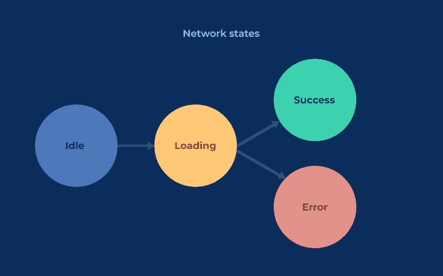
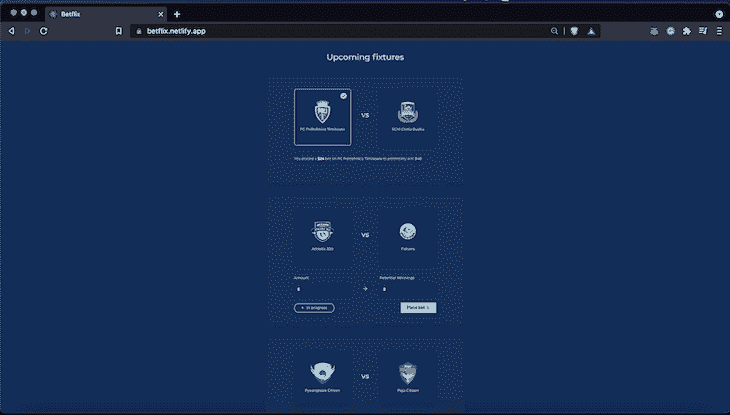
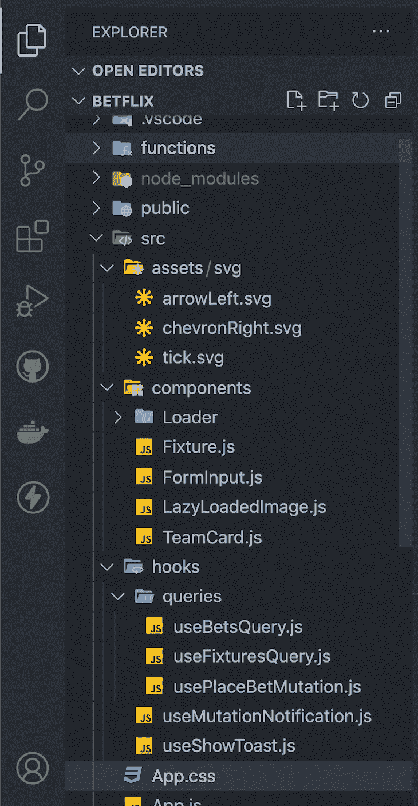
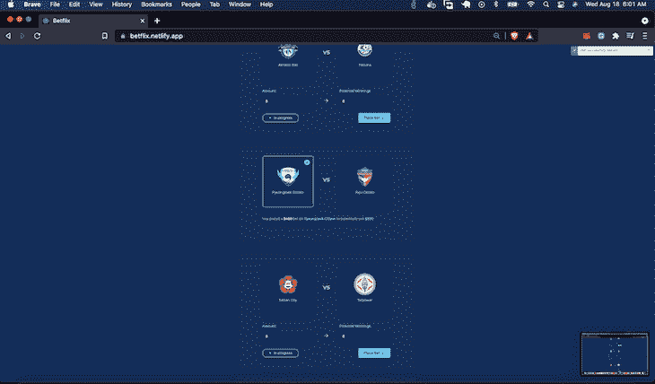

# 使用自定义 React 钩子改进异步网络状态处理

> 原文：<https://blog.logrocket.com/improve-async-network-state-handling-custom-react-hooks/>

React 让我们可以灵活选择如何解决应用程序中的问题(如状态、网络和样式管理)。一个好的代码库有识别的问题点，并用一个可重复的标准和一致的模式来解决。

此外，作为前端工程师，向用户正确传达网络状态变化的信息至关重要，因为我们构建的大多数应用程序都需要与一个或多个服务器进行交互。我们可以通过使用定制的 [React 钩子](https://reactjs.org/docs/hooks-intro.html)来实现这些目标。

在本文中，我将介绍网络请求存在的各种状态，并向您展示如何在自定义钩子中保持请求管理。我还将带您构建一个使用这些钩子的小应用程序。

## 什么是网络请求？

网络请求通常处于以下状态:

*   `idle`
*   `loading/processing/in-flight`
*   `success`
*   `error`

`idle`网络请求状态是网络请求的默认(和结束)阶段。在`loading`阶段，客户端[等待来自服务器](https://docs.oracle.com/cd/E19683-01/806-4075/ipov-100/index.html)的确认和数据包，然后转换到`success`或`error`状态。



Network state transitions.

## 使用自定义 React 挂钩本地化网络请求

为了保持网络请求的可测试性和与业务逻辑的解耦性，最好使用定制钩子来管理请求。这使您的代码保持精简，并使在网络响应上执行特殊的一次性操作(如数据转换)变得容易。

例如，获取博客文章列表的请求可以保存在一个`usePostsQuery`自定义钩子中，如下所示:

```
import { useState, useEffect } from 'react'

const api = {
  GET: async (url) => {
    const response = await fetch(url);
    const data = await response.json();
    return data;
  }
} 

export default function usePostsQuery() {
  const [error, setError] = useState()
  const [status, setStatus] = useState('idle')
  const [data, setData] =useState()

  const startFetch = async () => {
    try {
      let data = await api.GET('/posts')

      setError()
      setStatus('success')
      setData(data)
    } catch (error) {
      setError(error)
      setStatus('error')
    }
  }

  useEffect(() => {
    startFetch()
  }, []);  

  return {
    data,
    error,
    isSuccess: status === 'success',
    isError: status === 'error'
    refetch: startFetch
  }
}

```

通过利用 React Query (我的首选工具)，这个钩子可以变得更加简洁[:](https://blog.logrocket.com/building-multi-step-wizards-with-formik-and-react-query/)

```
import { useQuery } from "react-query";

export default function usePostsQuery() {
  return useQuery("posts", () =>
    api.GET("/posts")
  );
}

```

## 创建项目

让我们建立一个名为`Betflix`、[的小应用程序，你既可以访问](https://betflix.netlify.app)，又可以用[克隆](https://github.com/creatrixity/betflix)。这个应用程序将允许朋友们从一组赛程中选择运动队，并做出预测。

> **注意**:为了简洁起见，我将跳过解释这个概念验证中使用的更普通的组件。欢迎你来探索这个的[全部代码。](https://github.com/creatrixity/betflix/)



首先，我们将创建一个新的 React 项目并启动开发服务器:

```
npx create-react-app betflix
cd betflix
npm start

```

我们需要为 HTTP 请求安装依赖项、一个无服务器的函数代理和一个托管数据库(以保存设备和其他记录)。

```
npm install react-query react-toast-notifications http-proxy-middleware @supabase/supabase-js --save

```

我还将把 Netlify Lambda 和 CLI 作为开发依赖项。

```
npm install netlify-lambda netlify -D

```

当我们完成的时候，你应该有一个类似下面的目录结构。



## 显示带有自定义 React 挂钩的装置列表

我们将更新`<App />`组件来显示从无服务器后端获取的设备列表。我们将按顺序创建和处理对赌注列表和赛程列表的请求。

```
import "./App.css";

import Fixture from "./components/Fixture";
import Loader from "./components/Loader";

import useBetsQuery from "./hooks/queries/useBetsQuery";
import useFixturesQuery from "./hooks/queries/useFixturesQuery";

function App() {
  const { data, isLoading, isError } = useFixturesQuery();
  const {
    data: bets,
    isLoading: betsLoading,
    isError: betsErrored,
  } = useBetsQuery();

  if (isLoading || betsLoading) return <Loader />;
  if (isError || betsErrored)
    return <p>We encountered an error fetching data</p>;

  const sortFixtures = (fixtureA, fixtureB) => {
    return (
      bets.hasOwnProperty(fixtureB.fixture.id) -
        bets.hasOwnProperty(fixtureA.fixture.id) ||
      fixtureB.fixture.status.elapsed - fixtureA.fixture.status.elapsed
    );
  };

  return (
    <div className="App">
      <header className="App-header">
        <h1 className="App-header__title">Upcoming fixtures</h1>
      </header>
      <section className="Fixtures">
        {data.results.response.length ? (
          <>
            {data.results.response
              .sort(sortFixtures)
              .map(({ fixture, teams: { away, home } }) => (
                <Fixture
                  key={fixture.id}
                  fixture={fixture}
                  away={away}
                  home={home}
                  isBetPlaced={bets.hasOwnProperty(fixture.id)}
                  defaultSelectedTeam={bets[fixture.id].choice}
                  defaultAmount={bets[fixture.id].amount}
                />
              ))}
          </>
        ) : (
          <div>No fixtures at the moment</div>
        )}
      </section>
    </div>
  );
}

export default App;

```

从上面的代码中，我们已经声明了对`useBetsQuery`和`useFixturesQuery`的依赖，所以我们现在将定义它们。

`useBetsQuery`是一个自定义挂钩，用于获取一个下注列表并将其转换为一个键控对象的映射，我们可以用它来跟踪一个夹具的下注状态。

让我们在`/src/hooks/queries`中创建`useBetsQuery.js`并更新它:

```
import { useQuery } from "react-query";

const ENDPOINT = "/.netlify/functions/fetchBets";

// Normalize the bets payload into a keyed map with `fixture_id` as the key
function normalizeBets(betsList) {
  return betsList.reduce(
    (acc, curr) => ({
      ...acc,
      [curr.fixture_id]: curr,
    }),
    {}
  );
}

// Because we'll use the fetch API (instead of Axios), we need to explicitly return a 
// Promise when an error occurs so React Query can change the status.
const getBets = async (url) => {
  const response = await fetch(url);
  const data = await response.json();
  if (response.ok) {
    return normalizeBets(data.results);
  }
  return Promise.reject(new Error(data.message));
};

export default function useBetsQuery() {
  return useQuery("bets", () => getBets(ENDPOINT));
}

```

完成后，我们还需要创建一个自定义钩子来获取数据。在`src/hooks/queries`中创建`useFixturesQuery.js`挂钩，并添加以下代码:

```
import { useQuery } from "react-query";

const getFixtures = async (url) => {
  const response = await fetch(url);
  const data = await response.json();
  return data;
};

export default function useFixturesQuery() {
  return useQuery("fixtures", () =>
    getFixtures("/.netlify/functions/fetchFixtures")
  );
}

```

我们现在准备定义显示单个设备信息的组件。

## 创建`<Fixture />`组件

我们将在`src/components/Fixture.js`中创建`<Fixture/>`组件，并显示主队和客场队的信息。我们还引入了两个新的 React 钩子，`useMutationNotification`和`usePlaceBetMutation`钩子。

`useMutationNotification`是一个有趣的自定义挂钩，它允许我们以可预测的符合人体工程学的方式处理网络状态的变化，因此我们可以立即对用户发起的操作提供反馈。

```
import { useEffect, useState } from "react";
import { useToasts } from "react-toast-notifications";
import { ReactComponent as ArrowLeft } from "../assets/svg/arrowLeft.svg";
import { ReactComponent as ChevronRight } from "../assets/svg/chevronRight.svg";
import TeamCard from "./TeamCard";
import FormInput from "./FormInput";
import useMutationNotification from "../hooks/useMutationNotification";
import usePlaceBetMutation from "../hooks/queries/usePlaceBetMutation";
import Loader from "./Loader";

function Fixture({
  fixture,
  away,
  home,
  isBetPlaced,
  defaultAmount,
  defaultSelectedTeam,
}) {
  const [amount, setAmount] = useState(defaultAmount || 0);
  const [selectedTeam, setSelectedTeam] = useState(defaultSelectedTeam);
  const [betPlaced, setBetPlaced] = useState(isBetPlaced);
  const { addToast } = useToasts();
  const [doPlaceBetRequest, placeBetState] = usePlaceBetMutation();

  useMutationNotification({
    ...placeBetState,
    useServerMessage: false,
    entity: "bet",
    actionType: "place",
  });
  useEffect(() => {
    if (placeBetState.isSuccess) setBetPlaced(true);
  }, [placeBetState.isSuccess]);
  const teams = {
    away,
    home,
  };

  const status = !fixture.status.elapsed ? "Up next" : "In progress";

  const doAmountUpdate = (e) => setAmount(e.target.value);
  const doTeamUpdate = (team) => {
    if (betPlaced) return;
    setSelectedTeam(team);
  };
  const doPlaceBet = () => {
    if (!selectedTeam || amount <= 0) {
      addToast("Please select a team and add an amount", {
        appearance: "info",
        autoDismiss: true,
      });
      return;
    }
    doPlaceBetRequest({
      amount,
      choice: selectedTeam,
      fixture_id: fixture.id,
    });
  };

  return (
    <div className="Fixture">
      <section className="Fixture__teams">
        <TeamCard
          name={home.name}
          logo={home.logo}
          id={home.id}
          type={"home"}
          selected={selectedTeam === "home"}
          onTeamChange={doTeamUpdate}
        />
        <div className="Fixture__separator">vs</div>
        <TeamCard
          name={away.name}
          logo={away.logo}
          id={away.id}
          type={"away"}
          selected={selectedTeam === "away"}
          onTeamChange={doTeamUpdate}
        />
      </section>

      {!betPlaced ? (
        <>
          <section className="Fixture__controls">
            <div className="Fixture__control">
              <FormInput
                label={"Amount"}
                name={`amount-${fixture.id}`}
                type="number"
                value={amount}
                onChange={doAmountUpdate}
              />
            </div>
            <div className="Fixture__controls__separator">
              <ArrowLeft />
            </div>
            <div className="Fixture__control">
              <FormInput
                label={"Potential Winnings"}
                name={`potential-winnings-${fixture.id}`}
                value={amount * 2 || 0}
                disabled
              />
            </div>
          </section>
          <section className="Fixture__footer">
            <div className="Fixture__status">
              <span className="Fixture__status__dot"></span>
              {status}
            </div>
            {!placeBetState.isLoading ? (
              <button className="Button" onClick={doPlaceBet}>
                Place bet <ChevronRight />
              </button>
            ) : (
              <Loader />
            )}
          </section>
        </>
      ) : (
        <section className="Fixture__controls">
          <p>
            You placed a <b>${amount}</b> bet on{" "}
            <b className="u-text-primary">{teams[selectedTeam]?.name}</b> to
            potentially win <b className="u-text-primary">${amount * 2}</b>
          </p>
        </section>
      )}
    </div>
  );
}

Fixture.defaultProps = {
  isBetPlaced: false,
};

export default Fixture;

```

在上面的代码中，我们声明了对几个钩子的依赖。

`useMutationNotification`将接受网络请求状态选项(`isError`和`isSuccess`)，并允许我们显示来自服务器的错误消息(如果我们将`useServerMessage`设置为`true`)或传递`entity`和`actionType`字符串给用户提供一个通用消息。

让我们在`src/hooks`中创建`useMutationNotification.js`，并用下面的代码更新它:

```
import { useEffect, useState } from "react";
import useShowToast from "./useShowToast";

function capFirst(string) {
  return string.charAt(0).toUpperCase() + string.slice(1);
}

function useMutationNotification({
  isError,
  isSuccess,
  actionType = "create",
  entity,
  data,
  error,
  useServerMessage = true,
}) {
  const [notificationConfig, setNotificationConfig] = useState(null);
  const showToast = useShowToast();

  useEffect(() => {
    if (isError) {
      setNotificationConfig({
        type: "error",
        message: useServerMessage
          ? error.message
          : `${entity} could not be ${actionType}d`,
      });
    }
  }, [
    useServerMessage,
    isError,
    setNotificationConfig,
    entity,
    actionType,
    error,
  ]);

  useEffect(() => {
    if (isSuccess) {
      setNotificationConfig({
        type: "success",
        message: useServerMessage
          ? data.message
          : `${entity} successfully ${actionType}d`,
      });
    }
  }, [
    useServerMessage,
    isSuccess,
    setNotificationConfig,
    entity,
    actionType,
    data,
  ]);

  useEffect(() => {
    if (notificationConfig) {
      const { type, message } = notificationConfig;
      showToast({ type, message: capFirst(message) });
    }
  }, [notificationConfig, showToast]);
}

export default useMutationNotification;

```

然后我们将定义我们打算用来下注的`usePlaceBet`突变。我们将返回突变动作及其状态。在`src/hooks/queries`中创建`usePlaceBetMutation`，并将其更新为以下代码:

```
import { useMutation } from "react-query";

const ENDPOINT = "/.netlify/functions/placeBet";

export default function usePlaceBetMutation() {
  const request = async (payload) => {
    const res = await fetch(ENDPOINT, {
      method: "POST",
      body: JSON.stringify(payload),
    });
    const data = await res.json();
    if (!res.ok) return Promise.reject(new Error(data.message));
    return data;
  };
  const { mutate, ...mutationState } = useMutation(request);
  return [mutate, mutationState];
}

```

有了这些更新，我们现在可以以简单、易读的方式处理网络状态的变化。



## 结论

对网络状态变化做出反应可能具有挑战性，但这也是为用户提供更有意义的体验的巨大机会。

您可以查看 [React Query](https://react-query.tanstack.com/quick-start) 文档，了解更多关于在构建 React 应用程序时增强用户网络状态体验的信息。你可以在 [GitHub](https://github.com/creatrixity/betflix) 上找到这个演示概念验证的完整源代码。

## 使用 LogRocket 消除传统反应错误报告的噪音

[LogRocket](https://lp.logrocket.com/blg/react-signup-issue-free)

是一款 React analytics 解决方案，可保护您免受数百个误报错误警报的影响，只针对少数真正重要的项目。LogRocket 告诉您 React 应用程序中实际影响用户的最具影响力的 bug 和 UX 问题。

[ ](https://lp.logrocket.com/blg/react-signup-general) [  ](https://lp.logrocket.com/blg/react-signup-general) [LogRocket](https://lp.logrocket.com/blg/react-signup-issue-free)

自动聚合客户端错误、反应错误边界、还原状态、缓慢的组件加载时间、JS 异常、前端性能指标和用户交互。然后，LogRocket 使用机器学习来通知您影响大多数用户的最具影响力的问题，并提供您修复它所需的上下文。

关注重要的 React bug—[今天就试试 LogRocket】。](https://lp.logrocket.com/blg/react-signup-issue-free)