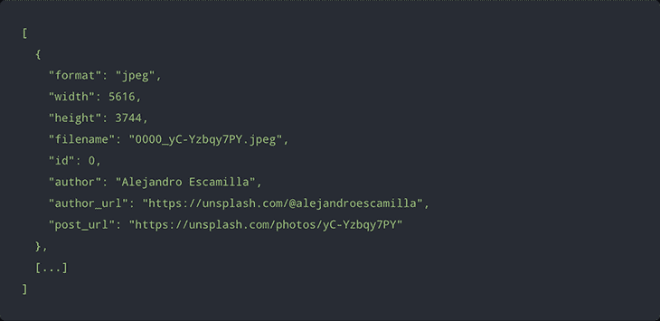
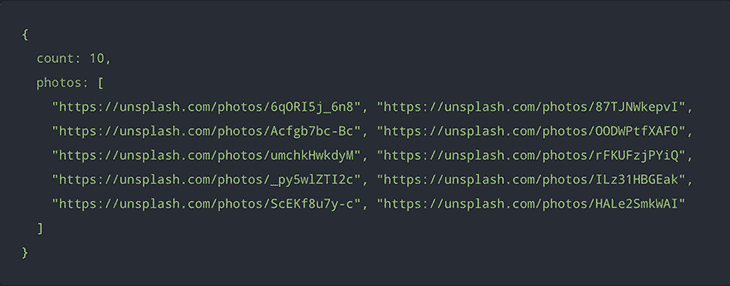
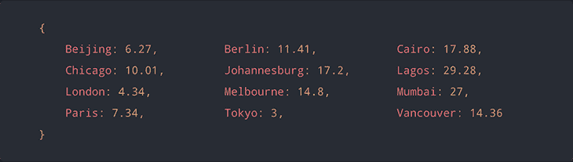
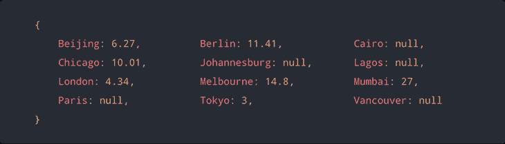

# 用 JavaScript promises 改进异步编程

> 原文：<https://blog.logrocket.com/improve-async-programming-with-javascript-promises/>

***编者按**:本帖于 2021 年 8 月编辑更新，包含新信息。*

如果您以前编写过异步 JavaScript 代码，那么您就已经知道如何使用回调以及回调带来的问题。使用回调的一个主要问题是可能会遇到回调地狱。

在 ES2015 中，JavaScript 承诺被添加到语言规范中，为异步代码的编写方式带来了全新的转变，也缓解了陷入回调地狱的问题。如果您在代码中使用 ES2015 语法，您可能已经熟悉了承诺。

在本指南中，您将学习一些使用 promises 改进 JavaScript 异步编程的实用方法，包括:

注意:本指南绝不是 JavaScript promises 的介绍。阅读本指南需要对承诺有所了解。

## 创造承诺

JavaScript promise 可以使用`Promise`构造函数创建。构造函数将一个`executor`函数作为它的参数，这个函数被立即执行以创建承诺。

反过来，`executor`可以将两个回调函数作为它的参数，可以在 executor 函数中调用这两个函数来完成承诺，即:

*   `resolve`为实现有价值的承诺
*   有理由(通常是错误)拒绝承诺

这是一个非常简单的 JavaScript 承诺:

```
const isLessThan10 = (num) => {
  new Promise((resolve, reject) => {
    if (num < 10) {
      resolve("Correct");
    } else {
      reject("Wrong!!");
    }
  })
    .then((res) => console.log(res))
    .catch((err) => console.log(err));
};

isLessThan10(14); 

```

如果你运行上面的代码，你会看到“错！!"在你的控制台里，意味着承诺得到了`rejected`。那是因为`14`明明不小于`10`，但是当你过了一个小于`10`的数，承诺的就会是`fulfilled`。

### 承诺状态

在上一节中，你一定注意到我们使用了两个词:`rejected`和`fulfilled` *。*这是 JavaScript 承诺的三种状态中的两种。我们来谈谈一个承诺的三种可能状态。

*   `rejected`–当操作失败时，承诺被拒绝，例如，在上面的`isLessThan10`函数中，当我们通过 14 时，承诺被拒绝
*   `fulfilled`–当操作起作用或正确时，履行承诺，例如，在上面的函数中，传递一个小于 10 的数字履行承诺
*   当一个承诺等待解决或拒绝时，它就是待定的。只有当操作异步时，承诺才会达到这种状态

只有在使用 promise resolve 参数解决承诺时，该承诺才会实现。用一个值实现一个承诺，而用 promise reject 参数拒绝一个承诺。这两种状态表明承诺已解决，不再待定。

### 约定的承诺

很多时候，你只是想创造一个已经确定的承诺——要么有价值地履行，要么有理由地拒绝。对于这种情况，`Promise.resolve()`和`Promise.reject()`方法派上了用场。这里有一个简单的例子:

```
// This promise is already fulfilled with a number (100)
const fulfilledPromise = Promise.resolve(100);

// This promise is already rejected with an error
const rejectedPromise = Promise.reject(new Error('Operation failed.'));

// Getting the rsolved value of the promise
fulfilledPromise.then(res => console.log(res));

// Getting catching to see the error of the promise
rejectedPromise.then(res => console.log(res)).catch(err => console.log(err.message));

```

有时你也不确定一个价值是否是一个承诺。在这种情况下，您可以使用`Promise.resolve()`创建一个带有值的已履行承诺，然后处理返回的承诺。这里有一个例子:

```
// User object
const USER = {
  name: 'Glad Chinda',
  country: 'Nigeria',
  job: 'Fullstack Engineer'
};

// Create a fulfilled promise using Promise.resolve()
Promise.resolve(USER)
  .then(user => console.log(user.name));

```

## 处理承诺

可以通过向承诺的`then()`、`catch()`或`finally()`方法传递回调来处理一个已解决的承诺，如前面的一些代码片段所示。这里，我们将重构`isLessThan10`函数，看看如何处理被拒绝和履行的承诺。

```
const isLessThan10 = (num) => {
  return new Promise((resolve, reject) => {
    if (num < 10) {
      resolve("Correct");
    } else {
      reject("Wrong!!!");
    }
  })
};

// Case1
isLessThan10(1)
  .then(console.log)
  .catch(console.error);

// Case2
// Alternatively, the rejection can be handled in the same .then() call
// By passing the rejection handler as second argument to .then()
isLessThan10(12).then(console.log, console.error);

```

除了使用`.catch()`处理被拒绝的承诺，如上所述，我们还可以向`.then()`传递两个回调。如果承诺实现了，第一个将处理它，而如果拒绝了，另一个将处理它。我们还可以操纵`then()`块中承诺的解析值。

一旦承诺完成，无论是履行还是拒绝，都会执行。这是执行清除操作的好地方，比如重置变量或清除状态。

```
const isLessThan10 = (num) => {
  return new Promise((resolve, reject) => {
    if (num < 10) {
      resolve("Correct");
    } else {
      reject("Wrong!!!");
    }
  })
    .then(111)
    .catch(222);
};

isLessThan10(11)
  .then((res) => console.log(res))
  .catch((err) => console.error(err))
  .finally(() => console.log("This promise is finally settled!"));

```

## 哑`then`处理程序

`.then()`方法最多可以接受两个处理函数作为它的参数:实现处理函数和拒绝处理函数。

然而，如果这两个参数中的任何一个不是函数，`.then()`就用一个函数替换那个参数，并继续正常的执行流程。知道参数被什么样的函数替代变得很重要。事情是这样的:

*   如果实现处理程序参数不是一个函数，它将被一个标识函数替换。恒等函数是一个简单地返回它接收到的参数的函数
*   如果拒绝处理程序参数不是一个函数，它将被替换为 Thrower 函数。抛出函数是一个简单地抛出它接收的错误或值作为其参数的函数

这里有一个简单的例子:

```
const isLessThan10 = (num) => {
  return new Promise((resolve, reject) => {
    if (num < 10) {
      resolve("Correct");
    } else {
      reject("Wrong!!!");
    }
  })
    .then(111) // Just a random number 
    .catch(222); // Just a random number
};

//This will log 'Correct' to the console
isLessThan10(3).then(res => console.log(res)).catch(err => console.error(err));

// This will log 'Wrong' to the console
isLessThan10(13).then(res => console.log(res)).catch(err => console.error(err));

```

如果仔细观察，您会注意到`identity`函数和`thrower`函数都没有改变承诺序列的正常执行流程。它们的效果就像在承诺链中省略了那个特定的`.then()`电话一样。出于这个原因，我通常将这些处理程序参数称为“哑处理程序”。

## 经理人总是会兑现承诺

关于`.then()` promise 方法需要理解的一件重要事情是，它总是返回一个承诺。

下面是`.then()`如何根据传递给它的处理函数返回的内容返回一个承诺的分解:

承诺的时机

## 延迟执行

### 承诺对于计时应用非常有用。像 PHP 这样的一些编程语言有一个`sleep()`函数，可以用来延迟操作的执行，直到睡眠时间结束。

虽然`sleep()`函数不是 JavaScript 规范的一部分，但全局`setTimeout()`和`setInterval()`函数通常用于执行基于时间的操作。

[`setInterval()`方法](https://developer.mozilla.org/en-US/docs/Web/API/setInterval)是一个 JavaScript 函数，用于在指定时间执行代码块，每次调用之间有延迟，而 [`setTimeout()`方法](https://developer.mozilla.org/en-US/docs/Web/API/setInterval)用于给 JavaScript 代码块添加定时器。

下面是如何使用 JavaScript 中的承诺来模拟`sleep()`函数。然而，在这个版本的`sleep()`功能中，停止时间将以毫秒为单位，而不是以秒为单位 *:*

下面是对`sleep(ms)`函数的略微扩展和注释版本:

```
const sleep = ms => new Promise(resolve => setTimeout(resolve, ms));

```

甚至可以进一步改进`sleep(ms)`功能，使其成为一个独立的`delay`功能，在指定的睡眠时间后执行`callback`功能。

```
const sleep = ms => {
  // Return a new promise
  // No need defining the executor function with a `reject` callback
  return new Promise(resolve => {
    // Pass resolve as the callback to setTimeout
    // This will execute `resolve()` after `ms` milliseconds
    setTimeout(resolve, ms);
  });
}

```

下面是使用`sleep()`函数的情况:

测量执行时间

```
// Sleep for 5 seconds
// Then execute the operation
sleep(5000).then(executeOperation);

// Delay function
// Using async/await with sleep()
const delay = async (callback, seconds = 1) => {
  // Sleep for the specified seconds
  // Then execute the operation
  await sleep(seconds * 1000);
  callback();
}

// Using the `delay()` function
// Execution delayed by 5 seconds
delay(executeOperation, 5);

```

### 如果您想知道完成一个异步操作需要多长时间，该怎么办？在对某种形式的实现或功能的性能进行基准测试时，通常就是这种情况。

下面是一个简单的实现，它利用 JavaScript promise 来计算异步操作的执行时间。

在该实现中，使用`performance.now()`而不是`Date.now()`来获得具有更高分辨率的时间戳。对于不存在`performance`对象的非浏览器环境，您可以使用`Date.now()`或其他主机实现。

```
const timing = callback => {
  // Get the start time using performance.now()
  const start = performance.now();

  // Perform the asynchronous operation
  // Finally, log the time difference
  return Promise.resolve(callback())
    .finally(() => console.log(`Timing: ${performance.now() - start}`));
}

```

在下面的代码块中，`timing()`函数可用于记录控制台上异步操作的执行时间:

承诺顺序执行

```
// Async operation that takes between 1 - 5 seconds
const asyncOperation = () => new Promise(resolve => {
  setTimeout(() => resolve('DONE'), Math.ceil(Math.random() * 5) * 1000);
});

// Compute execution time in ms
// And log it to the console
timing(asyncOperation); // Timing: 4003.4000000014203

```

### 有了 JavaScript 的承诺，你可以[按顺序](https://blog.logrocket.com/understanding-asynchronous-javascript/)执行异步操作。当后面的异步操作依赖于前面异步操作的执行时，或者当后面的操作需要前面异步操作的结果时，通常会出现这种情况。

按顺序执行异步操作通常涉及将一个或多个`.``then()`和`.catch()`处理程序链接到一个承诺。当一个承诺在链中被拒绝时，它由链中下一个`.then()`处理程序中定义的拒绝处理程序来处理，然后继续执行。

然而，如果在链中的下一个`.then()`处理程序中没有定义拒绝处理程序，则承诺拒绝会沿着链向下级联，直到它到达第一个`.catch()`处理程序。

案例研究:照片库应用程序

### 假设您正在构建一个照片库应用程序，您希望能够从在线照片库中获取照片，然后按照格式、纵横比、尺寸范围等对它们进行过滤。

下面是您的应用程序中可能有的一些函数:

在上面的代码块中，`fetchPhotos()`函数使用 Fetch API 提供的全局`fetch()`函数从 [Picsum Photos API](https://picsum.photos/) 中获取一组照片，并返回一个由一组照片实现的承诺。

```
/**
 * Fetches photos from the Picsum API
 * @returns {Promise} A promise that is fulfilled with an array of photos from the Picsum repository
 */

const fetchPhotos = () =>
  fetch('https://picsum.photos/list')
    .then(response => response.json());

/**
 * Filters photos and returns only JPEG photos 
 * @param {Array} photos
 * @returns {Array} An array of JPEG photos
 */
const jpegOnly = photos =>
  photos.filter(({ format }) => format.toLowerCase() === 'jpeg')

/**
 * Filters photos and returns only square photos
 * @param {Array} photos
 * @returns {Array} An array of square photos
 */

const squareOnly = photos =>
  photos.filter(({ width, height }) => height && Number.isFinite(height) && (width / height) === 1)

/**
 * Returns a function for filtering photos by size based on `px`
 * @param {number} px The maximum allowed photo dimension in pixels
 * @returns {Function} Function that filters photos and returns an array of photos smaller than `px`
 */

const smallerThan = px => photos =>
  photos.filter(({ width, height }) => Math.max(width, height) < px)

/**
 * Return an object containing the photos count and URLs.
 * @param {Array} photos
 * @returns {Object} An object containing the photos count and URLs
 */

const listPhotos = photos => ({
  count: photos.length,
  photos: photos.map(({ post_url }) => post_url)
})

```

下面是从 [Picsum Photos API](https://picsum.photos/) 返回的集合的样子:



filter 函数接受照片集合作为参数，并通过以下方式对集合进行过滤:

`jpegOnly()` —过滤照片集合并返回仅包含 JPEG 图像的子集合

*   `squareOnly()` —过滤照片集合，仅返回具有方形长宽比的照片的子集合
*   `smallerThan()` —这是一个高阶函数，它获取一个维度并返回一个照片过滤函数，该函数返回最大维度小于指定维度阈值的照片子集合
*   假设我们想要执行以下操作序列:

获取照片收藏

1.  过滤收藏，只留下 JPEG 照片
2.  过滤收藏，仅留下具有方形纵横比的照片
3.  过滤收藏，只留下小于 2500 像素的照片
4.  从集合中提取照片计数和 URL
5.  在控制台上记录最终输出
6.  如果序列中的任何一点发生错误，将错误记录到控制台
7.  下面的代码片段显示了我们如何在 promise 序列中链接这些操作的执行:

上述代码将输出类似下图的结果:

```
// Execute asynchronous operations in sequence
fetchPhotos()
  .then(jpegOnly)
  .then(squareOnly)
  .then(smallerThan(2500))
  .then(listPhotos)
  .then(console.log)
  .catch(console.error);

```



并行运行和执行 JavaScript 承诺

## 有了 JavaScript 的承诺，您可以批量执行多个独立的异步操作，或者使用`Promise.all()`方法并行执行。

接受一个可重复的承诺作为其参数，并返回一个承诺，当可重复的承诺中的所有承诺都被满足时，该承诺被满足，或者当可重复的承诺中的一个承诺被拒绝时，该承诺被拒绝。

如果返回的承诺实现了，那么它将通过 iterable 中已实现承诺的所有值的数组来实现(以相同的顺序)。但是，如果它拒绝，它会因为 iterable 中拒绝的第一个承诺而被拒绝。

案例研究:当前温度

### 假设您正在构建一个天气应用程序，它允许用户查看他们选择的一系列城市的当前温度。

使用`Promise.all()`，你可以向天气 API 发出一个`GET`请求，一次性获取所有选定城市的温度，这样你的用户就不会在你的应用上看到一个接一个的数据渲染。

下面的代码片段演示了如何使用`Promise.all()`并行获取所选城市的当前温度。

OpenWeatherMap API 服务将被用来获取天气数据，所以如果你想跟随，请点击链接进入他们的网站并注册获取 API 密钥。

在上面的代码块中，我们创建了下面的函数:

```
// Use your OpenWeatherMap API KEY
// Set the current weather data API URL
const API_KEY = 'YOUR_API_KEY_HERE';
const API_URL = `https://api.openweathermap.org/data/2.5/weather?appid=${API_KEY}&units=metric`;

// Set the list of cities
const CITIES = [
  'London', 'Tokyo', 'Melbourne', 'Vancouver',
  'Lagos', 'Berlin', 'Paris', 'Johannesburg',
  'Chicago', 'Mumbai', 'Cairo', 'Beijing'
];

const fetchTempForCity = city => {
  return fetch(`${API_URL}&q=${encodeURIComponent(city)}`)
    .then(response => response.json())
    .then(data => [ city, data.main.temp || null ]);
}

const fetchTempForCities = cities => {
  return Promise.all(cities.map(fetchTempForCity))
    .then(temps => {
      return temps.reduce((data, [ city, temp ]) => {
        return { ...data, [city]: Number.isFinite(temp) ? temp.toFixed(2) * 1 : null };
      }, {});
    });
}

fetchTempForCities(CITIES)
  .then(console.log, console.error);

```

`fetchTempForCity()` —接受单个城市作为其参数，并通过调用 OpenWeatherMap API 服务返回一个承诺，该承诺以给定城市的当前温度(°C)来实现。返回的承诺用一个格式为:`[city, temperature]`的数组来实现

*   `fetchTempForCities()` —接受一个城市数组，并通过利用 [`Array.prototype.map()`](https://developer.mozilla.org/en-US/docs/Web/JavaScript/Reference/Global_Objects/Array/map) 调用每个城市的`fetchTempForCity()`函数来获取每个城市的当前温度。
*   `Promise.all()`方法用于并行运行请求，并将它们的数据累积到一个数组中，然后使用 [`Array.prototype.reduce()`函数](https://developer.mozilla.org/en-US/docs/Web/JavaScript/Reference/Global_Objects/Array/reduce)将其还原为一个对象。

上面的代码片段将返回一个类似于下面结果的对象:



拒绝处理

## 值得注意的是，如果传递到`Promise.all()`中的任何获取温度承诺被拒绝，整个承诺批次将立即因相同原因被拒绝。

也就是说，如果十二个获取温度承诺中的至少一个由于某种原因被拒绝，则整个承诺批次将被拒绝，因此，没有温度将从承诺返回。

在大多数情况下，上述场景通常不是理想的行为——失败的温度获取不应导致批中成功获取的结果被丢弃。我们可以通过使用另一个 promise 方法`promise.allSettled()`很容易地解决这个问题，这将在下面讨论，但是还有另一个简单的解决方法。

解决这个问题的简单方法是在`fetchTempForCity`承诺上附加一个`.catch()`处理程序，使其在拒绝的情况下用一个空温度值来履行承诺。

这将是它的样子:

通过对`fetchTempForCity()`函数的小改动，现在有了一个非常高的保证，即在请求失败或出错的情况下，返回的承诺永远不会被拒绝。相反，它将由一个格式为:`[city, null]`的数组来完成，如下所示:

```
const fetchTempForCity = city => {
  return fetch(`${API_URL}&q=${encodeURIComponent(city)}`)
    .then(response => response.json())
    .then(data => [ city, data.main.temp || null ])

    // Attach a `.catch()` handler for graceful rejection handling
    .catch(() => [ city, null ]);
}

```



下面的代码片段包括一些可以添加到前面代码中的内容，以使这成为可能。

With this change, it becomes possible to further improve the code to be able to schedule retries for failed temperature fetches.

在这段代码中，`TEMPS`对象用于保存所列城市的更新温度。`MAX_TEMP_FETCH_RETRIES`常量是一个整数，它限制了对失败的获取可以进行的重试次数，在本例中是 5 次。

```
// An object that will contain the current temperatures of the cities

// The keys are the city names, while the values are their current temperatures (in °C)

let TEMPS = null;

// The maximum number of retries for failed temperature fetches

const MAX_TEMP_FETCH_RETRIES = 5;

// Fetches the current temperatures of multiple cities (in °C) and update the `TEMPS` object.

const fetchTemperatures = (cities, retries = 0) => {
  return fetchTempForCities(cities)
    .then(temps => {

      // Update the `TEMPS` object with updated city temperatures from `temps`
      TEMPS = (TEMPS === null) ? temps : { ...TEMPS, ...temps };

      // Filter the keys (cities) of the `TEMPS` object to get a list of the cities
      // with `null` temperature values.

      const RETRY_CITIES = Object.keys(TEMPS)
        .filter(city => TEMPS[city] == null);

      // If there are 1 or more cities in the `RETRY_CITIES` list
      // and the maximum retries has not been exceeded,
      // attempt to fetch their temperatures again after waiting for 5 seconds.
      // Also increment `retries` by 1.

      if (RETRY_CITIES.length > 0 && retries < MAX_TEMP_FETCH_RETRIES) {
        setTimeout(() => fetchTemperatures(RETRY_CITIES, ++retries), 5 * 1000);
      }

      // Return the updated `TEMPS` object
      return TEMPS;

    })
    .then(console.log, console.error);
}
// Fetch the current temperatures of the cities in the `CITIES` list
// and update the `TEMPS` object

fetchTemperatures(CITIES);

```

`fetchTemperatures()`函数接收一个城市名数组和到目前为止的重试次数作为它的参数。它调用`fetchTempForCities()`获取传递给它的城市的当前温度，并且用温度更新`TEMPS`对象。

对于失败的获取，该函数在等待五秒钟后为自己安排另一个调用，并将重试次数增加`1`。如果没有超过设置的最大值，重试次数会尽可能多—在我们的例子中是 5 次。

等待一切尘埃落定

## 正如`promise.all()`和`promise.race()`处理多个承诺一样，还有另一个非常有用的承诺`promise.allSettled()`，它被添加到 ES2020 的 JavaScript 规范中。

它与`promise.all()`非常相似，但与它不同的是，当传递给它的 iterable 中的任何承诺被拒绝时，`promise.allSettled()`不会被拒绝。相反，它会等待所有承诺都得到解决(履行或拒绝)，然后返回一个包含每个承诺结果的数组。下面我们来看一个例子。

上述代码将返回如下所示的结果:

```
const promise1 = Promise.resolve("I got fulfilled!");
const promise2 = Promise.reject("I was rejected!");
Promise.allSettled([promise1, promise2]).then((results) =>
  console.log(results)
);

```

现在，让我们重构我们在上面讨论`promise.all()`时编写的 OpenWeatherAPI 代码片段，我们实现了一个可能的解决方案，用于通过捕捉错误来拒绝一个承诺的情况。

```
[
  { status: 'fulfilled', value: 'I got fulfilled!' },
  { status: 'rejected', reason: 'I was rejected!' }
]

```

有了`promise.allSettled()`，我们不需要那种变通办法。它会工作得很好，我们还会看到被拒绝的承诺及其原因。让我们重构下面的代码:

结果应该是这样的:

```
// Use your OpenWeatherMap API KEY
// Set the current weather data API URL

const API_KEY = "YOUR_API_KEY_HERE";
const API_URL = `https://api.openweathermap.org/data/2.5/weather?appid=${API_KEY}&units=metric`;

// Set the list of cities

const CITIES = [
  "Lagos",
  "Berlin",
  "Parwis",  // Tweaked this to cause an error
];

const fetchTempForCity = (city) => {
  return fetch(`${API_URL}&q=${encodeURIComponent(city)}`)
    .then((response) => response.json())
    .then((data) => [city, data.main.temp]);
};

const fetchTempForCities = (cities) => {
  return Promise.allSettled(cities.map(fetchTempForCity)).then((temps) => temps);
};

fetchTempForCities(CITIES).then(console.log, console.error);

```

注意:如果一个空数组被传递给`promise.settled()`，它将返回一个解析的承诺，以一个空数组作为值。

```
[
  { status: "fulfilled", value: ["Lagos", "24.18"]},
  { status: "fulfilled", value: ["Berlin", "13.83"]},
  { status: "rejected", 
    reason: TypeError: Cannot read properties of undefined(reading 'temp')
  },
]

```

用承诺来竞争异步操作

## 有了 JavaScript 的承诺，您可以使用`Promise.race()`方法来竞争多个独立的异步操作。`Promise.race()`接受 iterable of promises 作为其参数，并返回一个承诺，该承诺以 iterable 中第一个确定的承诺相同的方式被履行或拒绝。

如果 iterable 中的第一个已解决的承诺用一个值来实现，那么 race 承诺用相同的值来实现。但是，如果被拒绝，种族承诺也会以同样的理由被拒绝。如果同时履行或拒绝了多个承诺，那么将根据 iterable 中承诺的顺序使用第一个承诺。

如果传递给`Promise.race()`的 iterable 为空，那么 race promise 将永远处于待定状态，并且永远不会解决。

案例研究:超时响应

### 假设您正在构建一个执行一些异步操作的 API 端点，比如读取文件或查询数据库，并且您希望保证在 5 秒内得到响应，否则请求将失败，并显示 HTTP 状态代码`504`(网关超时响应)。

下面的代码片段演示了如何使用`Promise.race()`来实现这一点，假设我们正在使用 Node.js 的 [Express.js](https://expressjs.com/) 框架来构建 API

在这个代码片段中，建立了一个非常简单的 Express 应用程序，它只有一个路径— `GET/random`用于返回一个在 0–100(包括 0 和 100)范围内随机生成的整数，同时还返回执行时间。

```
// Create a new Express app and set the port
const app = require('express')();
const PORT = process.env.PORT || 5000;

// The timeout in seconds for API responses
const TIMEOUT_SECONDS = 5;

// Define a new route on the Express app: GET /random
app.get('/random', (req, res) => {

  /**
   * `execute` is a promise that simulates a time-consuming asynchronous operation
   * which may take anywhere between 1s - 10s to complete its execution.
   * On completion, it is fulfilled with an object that looks like this:
   * {
   *   statusCode: 200,
   *   random: (A random integer in the range of 0 - 100, both inclusive)
   *   duration: (The duration of the execution in seconds, expressed as {duration}s)
   * }
   */

  const execute = new Promise(resolve => {
    // Random execution time in milliseconds
    const timeInMs = Math.floor((Math.random() * 10) * 1000);

    // Simulate execution delay using setTimeout and fulfill the promise
    // with the response object
    setTimeout(() => {
      resolve({
        statusCode: 200,
        random: Math.floor(Math.random() * 101),
        duration: `${timeInMs / 1000}s`
      })
    }, timeInMs);
  });

  /**
   * `requestTimer` is a promise that is settled after `TIMEOUT_SECONDS` seconds
   * On completion, it is fulfilled with an object that looks like this:
   * { statusCode: 504 }
   * which represents a Gateway Timeout on the server.
   */

  const requestTimer = new Promise(resolve => {
    // Simulate execution delay using setTimeout and fulfill the promise
    // with the response object
    const timeoutInMs = TIMEOUT_SECONDS * 1000;
    setTimeout(() => resolve({ statusCode: 504 }), timeoutInMs);
  });

  /**
   * `Promise.race()` is used to run both the `execute` and the `requestTimer` promises.
   * The first of the two promises that gets settled will be used to settle the race promise.
   * The fulfilled response object is then used to form and send the HTTP response.
   * If an error occurs, a HTTP 500 error response is sent.
   */
  return Promise.race([ execute, requestTimer ])
    .then(({ statusCode = 200, ...data }) => {
      const response = res.status(statusCode);

      return (statusCode == 200)
        ? response.json(data)
        : response.end();
    })
    .catch(() => res.status(500).end());

});

// Start the app on the set port

app.listen(PORT, () => console.log(`App is running on port ${PORT}.`));

```

`Promise.race()`用来等待两个承诺中的第一个:

一个`execute`承诺，执行一些看似耗时的异步操作，并在 1s-10s 后得到解决

*   一个`requestTimer`承诺，在设定的`TIMEOUT_SECONDS`秒后，即本例中的`5`秒后，不做任何事情并得到解决
*   所以，事情是这样的:这两个承诺中哪个先得到满足将决定来自端点的最终响应— `Promise.race()`将确保这一点。

当在服务工作者中处理`fetch`事件时，也可以使用类似的技术来检测慢速网络。

等待第一个兑现的承诺

## 在我们想要归还第一个兑现的承诺的情况下，`promise.any()`就派上了用场。与返回第一个履行或拒绝的承诺的`promise.race()`不同，`promise.any()`返回第一个履行的承诺。如果没有履行承诺，它将返回一个被拒绝的承诺，带有一个 [`AggregateError`对象](https://developer.mozilla.org/en-US/docs/Web/JavaScript/Reference/Global_Objects/AggregateError)。

在四个承诺方法`(any(), race(), allSettled()`和`all()`中，只有`promise.allSettled()`执行传递给它的所有承诺，因为它等待所有承诺被解析。其他的没有，所以他们被称为短路*。*

下面是一个来自[的表格，一个由金成](https://github.com/dance2die)创建的 GitHub gist，显示了`promise.all()`、`promise.allSettled()`、`promise.race()`和`promise.any()`之间的区别。

Below is a table from [a GitHub gist created by Sung M. Kim](https://github.com/dance2die) showing the differences between `promise.all()`, `promise.allSettled()`, `promise.race()`, and `promise.any()`.

使用带有承诺的 async/await

## `Async`和`await`是可以让写承诺更干净的关键词。在一个函数前面加上关键字`async`将使该函数返回一个承诺，然后允许它里面有一个`await`关键字。有了`await`，我们可以等待承诺被解决。有了`async`和`await`，我们就不需要用`.then()`了。让我们再一次使用 OpenWeather API 来看下面的例子:

我们可以用`try…catch`方法处理可能的错误。如果承诺被拒绝，我们将在`catch`块中得到错误。

```
// Set the current weather data API URL
const API_KEY = "YOUR_API_KEY";
const API_URL = `https://api.openweathermap.org/data/2.5/weather?appid=${API_KEY}&units=metric`;

const fetchTempForCity = async (city) => {
  let response = await fetch(`${API_URL}&q=${encodeURIComponent(city)}`);
  response = await response.json();
  console.log(response)
};

fetchTempForCity('Port harcourt');

```

结论

```
const fetchTempForCity = async (city) => {
  try {
    let response = await fetch(`${API_URL}&q=${encodeURIComponent(city)}`);
    response = await response.json();
    console.log(response);
  } catch (error) {
    console.error(error.message)
  }
};

fetchTempForCity('Port harcourt');

```

## JavaScript 承诺可以彻底改变你编写[异步程序](https://blog.logrocket.com/evolution-async-programming-javascript/)的方式，使你的代码在预期目的方面更加简洁和清晰。

在本指南中，我们研究了在异步程序中使用承诺的几种方式，比如:

依次并行执行操作，甚至进行比赛

*   如何履行多项承诺，并等待所有问题得到解决
*   如何执行一兑现就终止的承诺
*   我们还看到了如何使用 async/await 函数和`await`关键字处理承诺。你可以从 [MDN 的 JavaScript promise docs](https://developer.mozilla.org/en-US/docs/Web/JavaScript/Reference/Global_Objects/Promise) 中了解更多关于承诺的信息。

通过理解上下文，更容易地调试 JavaScript 错误

## 调试代码总是一项单调乏味的任务。但是你越了解自己的错误，就越容易改正。

LogRocket 让你以新的独特的方式理解这些错误。我们的前端监控解决方案跟踪用户与您的 JavaScript 前端的互动，让您能够准确找出导致错误的用户行为。

LogRocket 记录控制台日志、页面加载时间、堆栈跟踪、慢速网络请求/响应(带有标题+正文)、浏览器元数据和自定义日志。理解您的 JavaScript 代码的影响从来没有这么简单过！

[](https://lp.logrocket.com/blg/javascript-signup)

.

[Try it for free](https://lp.logrocket.com/blg/javascript-signup)

.