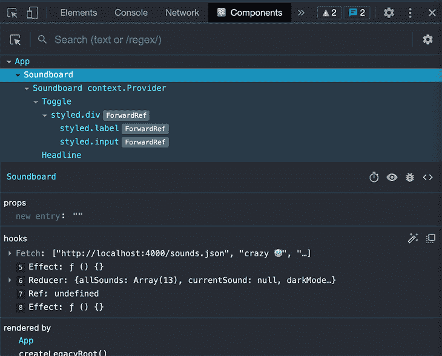
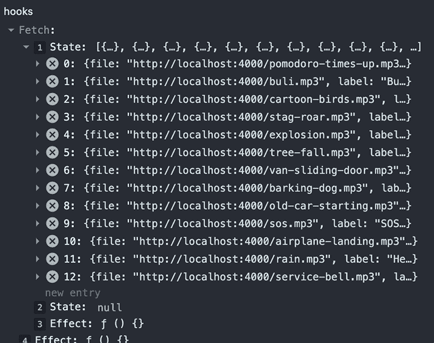
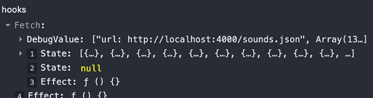
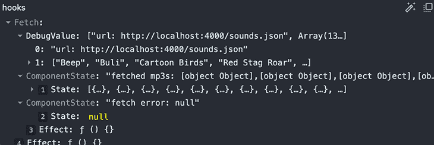

# 使用 useDebugValue - LogRocket 博客改进定制钩子调试

> 原文：<https://blog.logrocket.com/improve-custom-hook-debugging-with-usedebugvalue/>

没有太多开发人员知道 [`useDebugValue`钩子](https://reactjs.org/docs/hooks-reference.html#usedebugvalue)，尽管它在调试定制钩子时提供了更好的调试体验。

`useDebugValue`是一个简单的内置钩子，它提供了关于 [React DevTools](https://blog.logrocket.com/debug-react-applications-with-the-new-react-devtools/) 中定制钩子内部逻辑的更多信息。它允许您在自定义挂钩旁边显示附加的、有用的信息，并带有可选的格式。

## `useDebugValue`和 React DevTools

`useDebugValue`在 React DevTools 的[组件检查器](https://github.com/facebook/react/tree/main/packages/react-devtools#inspecting-component-instances)中扩展了定制钩子数据的可视化。你可以将`React DevTools`安装为[独立应用](https://www.npmjs.com/package/react-devtools)或[浏览器扩展](https://chrome.google.com/webstore/detail/react-developer-tools/fmkadmapgofadopljbjfkapdkoienihi)。

下一个截图显示了 React DevTools Chrome 扩展的**组件**选项卡。



让我们看看如何利用`useDebugValue`钩子。考虑这个相当简单的定制取钩子。

```
import { useEffect, useState } from "react";

export const useFetch = (url) => {
  const [response, setResponse] = useState([]);
  const [error, setError] = useState(null);
  useEffect(() => {
    async function fetchFiles() {
      try {
        const response = await fetch(url);
        const json = await response.json();
        setResponse(json);
      } catch (error) {
        setError(error);
      }
    }
    fetchFiles();
  }, [setError, setResponse, url]);
  return [response, error];
};

```

这就是钩子数据的显示方式。



调试信息仅限于显示我们的钩子内部使用的其他内置 React 钩子的信息(在本例中是`useState`和`useEffect`)。此外，这些信息很难阅读，因为没有描述性的标签——您必须计算输出中的每一行，以便知道哪些条目映射对应于代码库内部调用的钩子。

在内置的`useDebugValue`钩子的帮助下，我们可以通过为自定义钩子向 React DevTools 输出添加额外的条目来改善这种情况。

```
import { useEffect, useDebugValue, useState } from "react";

export const useFetch = (url) => {
  useDebugValue(url);
  const [response, setResponse] = useState([]);
  const clown = "🤡";
  useDebugValue(`crazy ${clown}`);
  const [error, setError] = useState(null);
  const [httpResponse, setHttpResponse] = useState();
  useDebugValue(
    httpResponse ? "status code " + httpResponse.status : "no response"
  );
  useDebugValue(error, (e) =>
    e ? `fetch failed due to ${e.message}` : "fetch successful"
  );
  useEffect(() => {
    async function fetchFiles() {
      try {
        const response = await fetch(url);
        setHttpResponse(response);
        const json = await response.json();
        setResponse(json);
      } catch (error) {
        setError(error);
      }
    }
    fetchFiles();
  }, [setError, setResponse, url]);
  useDebugValue(response, (mp3s) =>
    mp3s.length > 0 ? mp3s.map((mp3) => mp3.label) : "no mp3s loaded"
  );
  return [response, error];
}

```

下一个屏幕截图显示了出现网络错误时的输出。


展开的`DebugValue`条目按照源代码中出现的顺序列出了`useDebugValue`调用的输出。不同的条目显示了如何利用这个钩子。小丑条目并没有那么严肃，但是它表明您可以注销任何您想要的东西——数字、字符串和对象，而不仅仅是自定义钩子的函数参数或状态变量。

第三到第五项演示了[可选的第二个参数](https://reactjs.org/docs/hooks-reference.html#defer-formatting-debug-values)对`useDebugValue`钩子的使用。第二个参数是一个回调函数，它接收第一个参数中指定的数据，并返回一个格式化的显示值。

这是为了在计算要显示的值的开销很大的情况下推迟格式化。如果您使用第二个参数，当您在 React DevTools 中检查自定义钩子时，这个函数首先被执行。

## `useDebugValue`的局限性

当然，由于钩子的[规则，您不能使用`useDebugValue`注销条件和嵌套数据。](https://reactjs.org/docs/hooks-rules.html)

这就是为什么我在上面的例子中使用了一个额外的状态变量`httpResponse`，来访问响应的状态代码。提醒一下，这是由于钩子的规则，它只允许钩子用在功能性 React 组件或定制钩子的顶层。

根据[官方文档](https://reactjs.org/docs/hooks-reference.html#defer-formatting-debug-values)，`useDebugValue`只能在自定义挂钩的情况下使用。如果您在 React 功能组件的顶层放置一个钩子调用，React DevTools 中将不会出现日志输出。

```
const AwesomeComponent = () => {
  useDebugValue("hey there"); // this does not work
  return <div>what's up?</div>;
};

```

## 为`useState`调试改进 React DevTools 输出

本节演示了如何使用`useDebugValue`钩子来改进关于`useState`钩子的调试信息。

当您在一个组件或定制钩子中使用几个`useState`钩子时，您可能熟悉 React DevTools 的可跟踪性问题:React DevTools 不显示状态条目的描述性标签。

下面是使用`useFetch`钩子的输出。



React DevTools does not show a descriptive label for state entries

假设您选择了一个具有多个布尔状态变量的组件。从长远来看，总是需要注意它们的顺序，以便将状态条目与源代码中相应的`useState`调用相关联，这将是令人疲惫的。

这里值得注意的是，使用多个“原子”状态变量是更好的方法，而不是用单个对象收集每个状态“工件”。由于`useState`钩子不提供类似于 [setState](https://reactjs.org/docs/react-component.html#setstate) 方法的东西，所以使用“基于类的单一状态对象模式”不是一个好主意，因为你必须小心地完全克隆复杂的状态对象，并且只更新相关的部分。

让我们看看如何利用`useDebugState`来解决这个问题。首先，我们需要创建另一个自定义挂钩。

```
// useComponentState.js
import { useState, useDebugValue } from "react";

export function useComponentState(initialValue, name) {
  const [value, setValue] = useState(initialValue);
  useDebugValue(`${name}: ${value}`);
  return [value, setValue];
}

```

让我们替换我们的`useFetch`钩子中的`useState`调用。

```
import { useEffect, useDebugValue } from "react";

import { useComponentState } from "./useComponentState";
const useFetch = (url) => {
  useDebugValue(url, (url) => `url: ${url}`);
  const [response, setResponse] = useComponentState([], "fetched mp3s");
  const [error, setError] = useComponentState(null, "fetch error");
  useEffect(() => {
    async function fetchFiles() {
      try {
        const response = await fetch(url);
        const json = await response.json();
        setResponse(json);
      } catch (error) {
        setError(error);
      }
    }
    fetchFiles();
  }, [setError, setResponse, url]);
  useDebugValue(response, (mp3s) => mp3s.map((mp3) => mp3.label));
  return [response, error];
};

```

现在看起来是这样的。更容易找出你的状态变量显示在哪里。



## 凡事都有代价

在产品代码中大量使用`useDebugValue`可能会对应用程序的性能产生负面影响。我不认为把它留在您的产品代码中是一个好主意，但是正如官方文档所说，把它留在共享库中的定制钩子的代码中可能是好的。

不幸的是，在本文发表时，还没有办法基于环境变量有条件地呈现`useDebugValue`,因为钩子的规则阻止了条件代码中的钩子调用。

对我来说，`useDebugValue`是我工具箱中的另一个工具，我只在开发定制钩子时使用，并在将钩子推到 Git 库之前删除。它当然构成了对旧的`console.log`调用和调试断点的替代。

## 使用 LogRocket 消除传统反应错误报告的噪音

[LogRocket](https://lp.logrocket.com/blg/react-signup-issue-free)

是一款 React analytics 解决方案，可保护您免受数百个误报错误警报的影响，只针对少数真正重要的项目。LogRocket 告诉您 React 应用程序中实际影响用户的最具影响力的 bug 和 UX 问题。

[ ](https://lp.logrocket.com/blg/react-signup-general) [  ](https://lp.logrocket.com/blg/react-signup-general) [LogRocket](https://lp.logrocket.com/blg/react-signup-issue-free)

自动聚合客户端错误、反应错误边界、还原状态、缓慢的组件加载时间、JS 异常、前端性能指标和用户交互。然后，LogRocket 使用机器学习来通知您影响大多数用户的最具影响力的问题，并提供您修复它所需的上下文。

关注重要的 React bug—[今天就试试 LogRocket】。](https://lp.logrocket.com/blg/react-signup-issue-free)