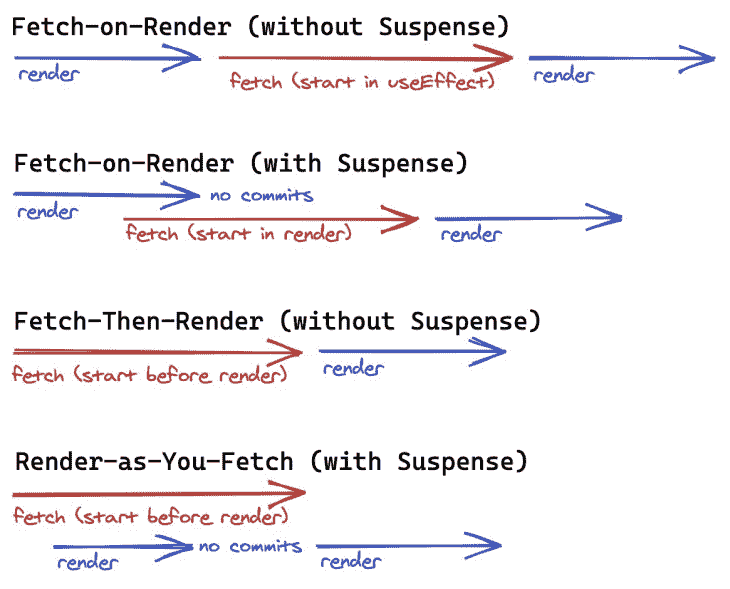

# 如何在并发模式下用 React 悬念改善开发者体验

> 原文：<https://blog.logrocket.com/improve-developer-experience-with-react-suspense-in-concurrent-mode/>

## 介绍

[React 暂停数据获取](https://reactjs.org/docs/concurrent-mode-suspense.html)是即将到来的 React 版本中的一个预期新功能。尽管在当前版本的 React 中可以使用数据获取的技术悬念，但新的[并发模式](https://reactjs.org/docs/concurrent-mode-intro.html)启用了一种新的数据获取模式，称为[即取即渲染](https://reactjs.org/docs/concurrent-mode-suspense.html#approach-3-render-as-you-fetch-using-suspense)。并发模式下的新钩子 [useTransition、](https://reactjs.org/docs/concurrent-mode-reference.html#usetransition)简化了挂起状态的显示。

本文从开发人员体验的角度描述了并发模式下的 React suspension 意味着什么。我们将看到传统模式下的传统数据获取如何在并发模式下完成。我们将在具体案例中展示伪代码，以比较传统模式和新模式之间的差异。我们还将引入支持新模式的库。

## 案例 1:有许多负载指示器

一个最典型的数据获取挂钩可以这样实现:

```
const useFetch = (url) => {
  const [loading, setLoading] = useState(false);
  const [result, setResult] = useState();
  useEffect(() => {
    const fetchData = async () => {
      setLoading(true);
      const response = await fetch(url);
      const result = await response.json();
      setResult(result);
      setLoading(false);
    };
    fetchData();
  }, [url]);
  return { loading, result };
};

```

这种基于`useEffect`的`useFetch`非常方便，直到今天还经常被使用。它在组件中是这样使用的:

```
const Component = ({ url }) => {
  const { loading, result } = useFetch(url);
  if (loading) return <Loading />;
  return <Result result={result} />
};

```

然而，一个典型的问题是加载标志。因为这个加载标志和钩子共存，这往往会导致 UI 中出现很多加载指示器。我们可以从技术上创建一个统一的加载组件，并提升父组件中的加载状态。如果你能控制所有的异步钩子，这将是可能的。但是，如果您使用的库不支持您的统一模式，那么您就不走运了。我们需要一个整个社区都能接受的官方模式。

React 悬念会解决这个问题。暂挂处理统一的装载状态，而不是每个钩子处理装载状态。带着悬念，代码将如下所示:

```
const Component = () => {
  const { result } = useFetchWithSuspense(somethingPrepared);
  return <Result result={result} />
};

const App = () => (
  <Suspense fallback={<Loading />}>
    <Component />
  </Suspense>
);

```

有了这个模式，我们不再需要考虑每个组件的加载状态。如果我们有一个好的`useFetchWithSuspense`钩子，那么用更少的代码就可以得到一个统一的加载指示器。

## 案例 useEffect 回调函数运行太晚

作为基于`useEffect`的`useFetch`(如前一节所示)，它在`useEffect`中调用一个 fetch 函数。`useEffect`仅在完成所有组件渲染后运行该功能。如果一个应用足够小，这可能不是一个 UI 问题。

假设我们有一个“下一步”按钮来触发获取新数据:

```
const Component = ({ url, initialIndex }) => {
  const [index, setIndex] = useState(initialIndex);
  const { loading, result } = useFetch(`${url}?index=${index}`);
  const onClick = () => {
    setIndex(index + 1);
  };
  if (loading) return <Loading />;
  return (
    <div>
      <button onClick={onClick}>Next</button>
      <Result result={result} />
      <VeryHugeComponent />
    </div>
  );
};

```

现在，问题是`VeryHugeComponent`是否需要时间来渲染。它只会在完成所有渲染后开始获取更多数据。为了克服这个问题，我们可以采用[提取然后渲染](https://reactjs.org/docs/concurrent-mode-suspense.html#approach-2-fetch-then-render-not-using-suspense)的方法:

```
const fetchData = async () => {
  const response = await fetch(url);
  const result = await response.json();
  return result;
};

const initialResult = await fetchData(...); // top-level await is not ideal

const Component = ({ url, initialIndex, initialResult }) => {
  const [index, setIndex] = useState(initialIndex);
  const [loading, setLoading] = useState(false);
  const [result, setResult] = useState(initialResult);
  const onClick = async () => {
    setLoading(true);
    setResult(await fetchData(`${url}?index=${index}`));    
    setIndex(index + 1);
    setLoading(false);
  };
  if (loading) return <Loading />;
  return (
    <div>
      <button onClick={onClick}>Next</button>
      <Result result={result} />
      <VeryHugeComponent />
    </div>
  );
};

```

在上面的例子中，数据提取在渲染之前在回调中开始。它不会等待`VeryHugeComponent`渲染。

注意`initialResult`是如何创建的，这可能不是一个好模式，因为它在顶层运行异步初始化。为了一致性，在渲染之前准备好`initialResult`可能更好，或者我们可以使用渲染时提取模式进行初始渲染:

使用 React 悬念，上面显示的代码将变成如下所示:

```
const Component = ({ url, initialIndex, initialResult }) => {
  const [index, setIndex] = useState(initialIndex);
  const [result, setResult] = useState(initialResult);
  const onClick = async () => {
    setResult(fetchDataWithSuspense(`${url}?index=${index}`));    
    setIndex(index + 1);
  };
  return (
    <div>
      <button onClick={onClick}>Next</button>
      <Result result={result} />
      <VeryHugeComponent index={index} />
    </div>
  );
};

```

除了我们不再关心加载状态之外，这在并发模式下还有一个好处。假设`VeryHugeComponent`有一个`index`道具，它可以在获取数据的过程中进行渲染。

下图显示了四种不同的数据获取模式。提取时渲染模式在渲染之前开始数据提取，同时允许 React 尽可能多地渲染，直到数据提取完成。



## 案例 3:数据获取瀑布

通常在传统的 Web API 中，您需要多次获取数据才能显示一个页面。例如，让我们考虑一个显示博客帖子和帖子的“赞数”的应用程序。使用基于`useEffect`的`useFetch`，呈现时提取模式的代码将如下所示:

```
const BlogPosts = () => {
  const { loading, result } = useFetch(...);
  if (loading) return <Loading />;
  return (
    <ul>
      {result.map(postId => (
        <BlogPost key={postId} id={id} />
      ))}
    </ul>
  );
};

const BlogPost = ({ postId }) => {
  const { loading, result } = useFetch(`...${postId}`);
  if (loading) return <Loading />;
  return (
    <li>
      <h1>{result.title}</h1>
      <p>{result.content}</p>
      <BlogLikeCount postId={postId} />
    </li>
  );
};

const BlogLikeCount = ({ postId }) => {
  const { loading, result } = useFetch(`...${postId}`);
  if (loading) return <Loading />;
  return <span>{result.count}</span>;
};

```

这在某种程度上是一个假设的例子，但关键是将可视化组件和数据获取联系起来会导致瀑布。在这种情况下，我们可以更早地获取“like count”。我们实际上可以这样做——在`BlogPost`中提取“like count ”,这是提取然后渲染的模式。

使用“随取随渲染”模式，您需要更改心智模式。组件只关心渲染，不关心数据获取。有了这个心智模型，同样的例子看起来会是这样的:

```
const BlogPosts = ({ posts }) => {
  return (
    <ul>
      {posts.map(post => (
        <BlogPost key={post.id} post={post} />
      ))}
    </ul>
  );
};

const BlogPost = ({ post }) => {
  return (
    <li>
      <h1>{post.title}</h1>
      <p>{post.content}</p>
      <BlogLikeCount like={post.like} />
    </li>
  );
};

const BlogLikeCount = ({ like }) => {
  return <span>{like.count}</span>;
};

```

这段代码没有什么令人惊讶的地方。它只是像处理同步数据一样处理异步数据。然而，这在普通的 JavaScript 中通常是不可能的。这是可能的反应悬念。实现一个允许这种模式的库并不简单。您希望控制并行和顺序加载模式。尤其是，允许增量加载会变得有点棘手。(感兴趣的可以看看 react-suspension-fetch 是怎么解决的。)

## 案例 4:烦人的 useEffect/useCallback deps 数组

可以说`useEffect`被过度用于数据抓取。函数通常是可组合的，有一个大的`useEffect`回调是没有意义的。如果你试图分割成更小的函数，你需要用`useCallback`包装一个函数。代码将如下所示:

```
const Component = ({ id1, id2 }) => {
  const [loading, setLoading] = useState(false);
  const [result, setResult] = useState(initialResult);
  const fetchItem1 = useCallback(async () => {
    const item1 = await fetchItem(id1);
    return item1;
  }, [id1]);
  const fetchItem2 = useCallback(async () => {
    const item2 = await fetchItem(id2);
    return item2;
  }, [id2]);
  const fetchContent = useCallback(async () => {
    const [item1, item2] = await Promise.all([fetchItem1(), fetchItem2()]);
    return { item1, item2 };
  }, [fetchItem1, fetchItem2]);
  useEffect(() => {
    const fetchData = async () => {
      setLoading(true);
      setResult(await fetchContent());
      setLoading(false);
    };
    fetchData();
  }, [fetchContent]);
  if (loading) return <Loading />;
  return <Result result={result} />
};

```

这也是一个假设的例子。没有 eslint-plugin-react-hooks 包中的 exhaustive-deps 规则，我们无法安全地编写这种代码，因为开发人员经常会犯错误。一般来说，不太适合数据获取或异步功能。即取即渲染模式允许在没有 useEffect 的情况下进行数据提取，这从我们这里释放了这个烦人的 deps 问题。结果就像这样简单。

```
const Component = ({ item1, item2 }) => {
  return <Result result={{ item1, item2 }} />
};

```

## 用于数据提取的暂记库

我已经开发了几个用于数据获取的 React 库。最值得注意的是，这些库尽可能地鼓励“取即渲染”模式。有了这些库，我们在前面章节中的讨论实际上是可行的。

这是一个非常原始的库，可以从一个异步函数中创建一个支持悬念的数据。在 React 中，数据几乎可以被视为同步数据。它是用代理实现的。由于缓存在对象本身中，如果不再被引用，可以安全地对其进行垃圾收集。前面几节中的示例代码就是基于这一点而创建的。

因为 react-suspension-fetch 太原始，我们需要一个更加面向用例的库。这是一个结合了反应暂停提取和反应路由器的库。它允许我们根据路线变化获取数据。

这是另一个原始图书馆。与 react-suspension-fetch 不同，它提供了 Hooks API。它不依赖于隐式缓存，而是使用显式存储。

上面这些库被设计成不依赖全局缓存。以下是具有全局缓存的各种库:

## 结论

我们仍处于新时代的开端。并发模式尚未发布，库也远未成熟。现在还不确定 React 中数据获取的最佳实践是什么。然而，这项新技术似乎很有前途。React 悬念数据获取通常是为了更好的用户体验，但本文更多地从开发人员体验的角度进行解释。从技术上来说，相同的用户体验可以用当前的技术来完成，而没有任何悬念。总体来说，可以说创造更好的用户体验需要更好的开发者体验。

## 使用 LogRocket 消除传统反应错误报告的噪音

[LogRocket](https://lp.logrocket.com/blg/react-signup-issue-free)

是一款 React analytics 解决方案，可保护您免受数百个误报错误警报的影响，只针对少数真正重要的项目。LogRocket 告诉您 React 应用程序中实际影响用户的最具影响力的 bug 和 UX 问题。

[ ](https://lp.logrocket.com/blg/react-signup-general) [  ](https://lp.logrocket.com/blg/react-signup-general) [LogRocket](https://lp.logrocket.com/blg/react-signup-issue-free)

自动聚合客户端错误、反应错误边界、还原状态、缓慢的组件加载时间、JS 异常、前端性能指标和用户交互。然后，LogRocket 使用机器学习来通知您影响大多数用户的最具影响力的问题，并提供您修复它所需的上下文。

关注重要的 React bug—[今天就试试 LogRocket】。](https://lp.logrocket.com/blg/react-signup-issue-free)