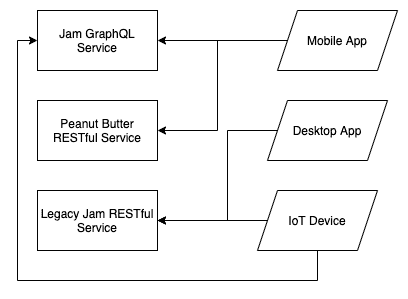
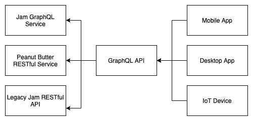
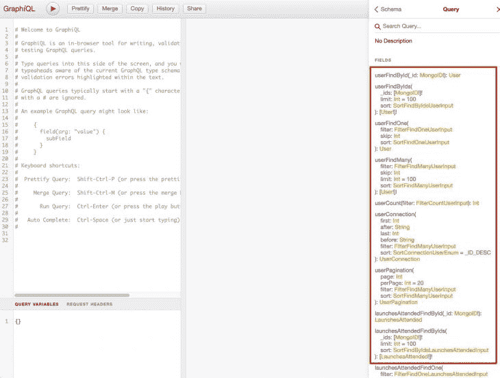

# 使用 GraphQL API 网关改进微服务架构

> 原文：<https://blog.logrocket.com/improve-microservice-architecture-graphql-api-gateways/>

随着组织的发展，创建多个 API 服务是很常见的，每个 API 服务都提供自己的特性集。除了这些服务，你还需要为你的用户提供不同的客户端应用来使用你的产品。最终，您的架构可能看起来像这样:



Every client app has different needs.

出现这种情况的原因有很多。随着时间的推移，团队结构可能会指导服务的创建，而在当时，让一个团队拥有一个代码库要比让一个团队网络拥有服务所有权更容易。

另一个原因可能是您产品中的不同特性有不同的伸缩性问题。例如，您的分析堆栈可能与您的用户登录堆栈有着截然不同的需求，将两者结合起来是没有意义的。

无论原因是什么，这种类型的架构都会减缓后端服务团队和前端客户团队的未来开发。客户端应用程序将需要与多种协议接口，使用不同的身份验证策略，担心哪个 API 为它们提供什么类型的数据，并可能进行多个 API 调用来检索单个页面的数据。

在这种情况下， [API 网关](https://docs.microsoft.com/en-us/dotnet/architecture/microservices/architect-microservice-container-applications/direct-client-to-microservice-communication-versus-the-api-gateway-pattern)可以提供帮助，而不是重构每个 API 服务或重建整个架构——这既昂贵又有风险。

## 什么是 GraphQL API 网关？

API 网关对于微服务来说并不新鲜。我见过许多开发人员使用它们为客户端应用程序提供单一接口(和协议)来从多个来源获取数据。

他们可以通过提供单个 API 协议、单个授权机制，并确保客户在开发新功能时只需要与一个团队沟通，来解决前面描述的问题。

另一方面，使用 GraphQL API 网关是一个相对较新的概念，最近开始流行起来。这是因为 GraphQL 有一些非常适合 API 网关的属性。

GraphQL API 网关可以有一个单一定义的模式和来自许多不同微服务的源数据，因此客户端可以查询一组字段，而无需知道数据来自哪里。

有了这个特性，发现如何检索数据不再是与谁交谈的问题，而是它在 [GraphQL 模式](https://principledgraphql.com/integrity#1-one-graph)中的位置问题。



有许多 JavaScript 包可以帮助开发。有些为实现 GraphQL API 网关提供了一个抽象层，而有些则可以为您做更多的事情。

## 使用 GraphQL 网关进行模式拼接

我们现在需要一个 API 网关服务，它将负责从新的和遗留的服务接收操作并返回数据。我们可以用两种不同的方式做到这一点:[模式拼接](https://www.graphql-tools.com/docs/schema-stitching/)或[联盟](https://principledgraphql.com/integrity#2-federated-implementation)。

出于时间考虑，我们将更仔细地研究模式拼接，但是您可以在本文中了解更多关于 [GraphQL 联邦的内容。](https://blog.logrocket.com/the-what-when-why-and-how-of-federated-graphql/)

就使用哪个 JavaScript 包而言，我们可以使用类似[阿波罗服务器](https://github.com/apollographql/apollo-server)或[墨丘利](https://github.com/mercurius-js/mercurius)编写自己的定制 Node.js GraphQL 服务器，在这里我们编写代码来解释来自客户端的 GraphQL 操作，将其发送给下游 API，并返回映射到客户端期望的数据。

这种方法很费时，但根据您的情况可能有意义。优势在于它可以根据您的组织和最佳实践进行专门调整。

## 使用 GraphQL Mesh 作为 GraphQL API 网关

另一方面，像 [GraphQL Mesh](http://www.graphql-mesh.com/) 这样的库会自动将多个数据源缝合到一个 GraphQL API 中。这可以节省开发时间，但是，就像为您做了大量工作的库一样，您可能需要提供自定义覆盖。

GraphQL Mesh 不仅将充当我们的 GraphQL API 网关，还将充当我们的数据映射器。它支持不同的数据源，比如 open API/Swagger REST API、gRPC APIs、数据库、GraphQL(显然)等等。它将获取这些数据源，将它们转换成 GraphQL APIs，然后将它们缝合在一起。

为了展示这样一个库的威力，我们将创建一个简单的 SpaceX 飞行日志 API。我们的应用程序将记录我们多年来参加的所有 SpaceX 发射。这是这个项目的 GitHub repo。

我们的应用程序将使用两个数据源:一个告诉我们 SpaceX 发射情况的公共 GraphQL API 和一个本地 MongoDB 数据库。

GraphQL SpaceX API 将通过代理提供给我们(所有操作名称都是相同的)，但是 GraphQL Mesh 将为我们的 MongoDB 数据库连接提供新的操作。它将让我们创建用户并标记我们参加的发布。

首先，安装库:

```
npm install @graphql-mesh/cli @graphql-mesh/graphql @graphql-mesh/mongoose graphql mongoose

```

现在，创建描述我们的 MongoDB 模式的基本 Mongoose 模型:

```
// ./src/models.js
const { model, Schema } = require("mongoose");
const UserSchema = new Schema(
  {
    name: {
      type: String,
    },
  },
  {
    collection: "users",
  }
);
const User = model("User", UserSchema);
const LaunchesAttendedSchema = new Schema(
  {
    spacexLaunchID: {
      type: String,
    },
    userId: { type: "ObjectId", ref: "User" },
  },
  {
    collection: "launches_attended",
  }
);
const LaunchesAttended = model("LaunchesAttended", LaunchesAttendedSchema);
module.exports = {
  User,
  LaunchesAttended,
};

```

接下来，创建一个 GraphQL 网格配置文件，`.meshrc.yaml`:

```
// .meshrc.yml
sources:
  - name: SpaceX
    handler:
      graphql:
        endpoint: https://api.spacex.land/graphql/
        method: POST
  - name: Mongoose
    handler:
      mongoose:
        connectionString: mongodb://admin:[email protected]:27017/test?authSource=admin&readPreference=primary&appname=MongoDB%20Compass&directConnection=true&ssl=false
        models:
          - name: User
            path: ./src/models.js#User
          - name: LaunchesAttended
            path: ./src/models.js#LaunchesAttended

```

使用 Docker Compose 创建 MongoDB 数据库([示例 docker-compose.yml 此处为](https://github.com/aleccool213/graphql-mesh-example/blob/82deb3a32a94a3cd349541e463e25f2fd84d654f/docker-compose.yml#L4))):

```
docker-compose up mongo
```

就是这样！为我们的新 GraphQL 服务器提供:

```
./node_modules/.bin/graphql-mesh serve
```

这将把您带到一个 GraphQL 实例，这是一个查询 graph QL 服务器的好界面。点击文档的**侧边栏**，探索我们有哪些可用的选项。你会注意到我们有办法看到过去的发射。



为了测试我们的新功能，我们可以查询过去的发射，从列表中选择一个`id`，并在 MongoDB 数据库中为用户创建一行 SpaceX 发射参考。

首先，创建一个用户:

```
mutation CreateUser($input: CreateOneUserInput!) {
  userCreateOne(record: $input) {
    recordId
  }
}

```

现在，了解过去的发布:

```
query PastLaunches {
  launchesPast(limit: 10) {
    mission_name
    id
    launch_date_local
  }
}

```

将发布标记为已参加:

```
mutation LaunchesAttendedCreateOne($input: CreateOneLaunchesAttendedInput!) {
  launchesAttendedCreateOne(record: $input) {
    recordId
  }
}

```

最后，查看您之前参加的所有发布活动:

```
query LaunchesAttended {
  launchesAttendedFindMany {
    spacexLaunchID
    userId
  }
}

```

## 结论

在很短的时间内(在几个配置文件之后)，我们能够构建我们自己的 GraphQL API 网关，它将 SpaceX GraphQL API 和从本地 MongoDB 数据库生成的 GraphQL API 缝合在一起，允许我们创建一个记录我们参加的启动的应用程序。这个用例展示了 GraphQL 网关对于客户的开发人员体验是多么强大。

如果没有这个网关，客户机将需要分别查询两个 API。相反，GraphQL Mesh 帮助我们快速生成可以在 Mongo 数据库上执行的基本 CRUD 操作，使我们的应用程序具有特定于用户的功能。

* * *

### 更多来自 LogRocket 的精彩文章:

* * *

总的来说，有许多方法可以使用 API 网关和大量可供选择的库来帮助您构建一个分布式系统，该系统可以针对性能、安全性和多团队组织进行微调。

## 监控生产中失败和缓慢的 GraphQL 请求

虽然 GraphQL 有一些调试请求和响应的特性，但确保 GraphQL 可靠地为您的生产应用程序提供资源是一件比较困难的事情。如果您对确保对后端或第三方服务的网络请求成功感兴趣，

[try LogRocket](https://lp.logrocket.com/blg/graphql-signup)

.

[](https://lp.logrocket.com/blg/graphql-signup)[https://logrocket.com/signup/](https://lp.logrocket.com/blg/graphql-signup)

LogRocket 就像是网络和移动应用的 DVR，记录下你网站上发生的每一件事。您可以汇总并报告有问题的 GraphQL 请求，以快速了解根本原因，而不是猜测问题发生的原因。此外，您可以跟踪 Apollo 客户机状态并检查 GraphQL 查询的键值对。

LogRocket 检测您的应用程序以记录基线性能计时，如页面加载时间、到达第一个字节的时间、慢速网络请求，还记录 Redux、NgRx 和 Vuex 操作/状态。

[Start monitoring for free](https://lp.logrocket.com/blg/graphql-signup)

.