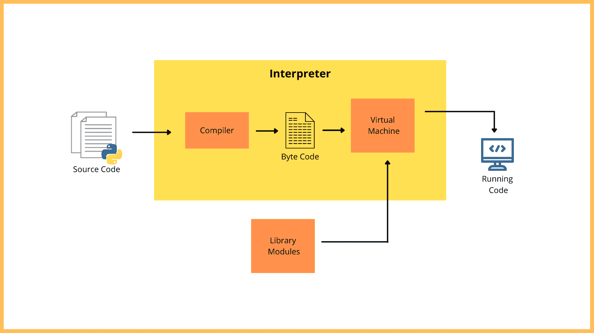
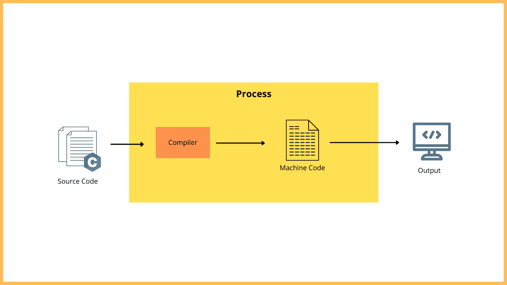
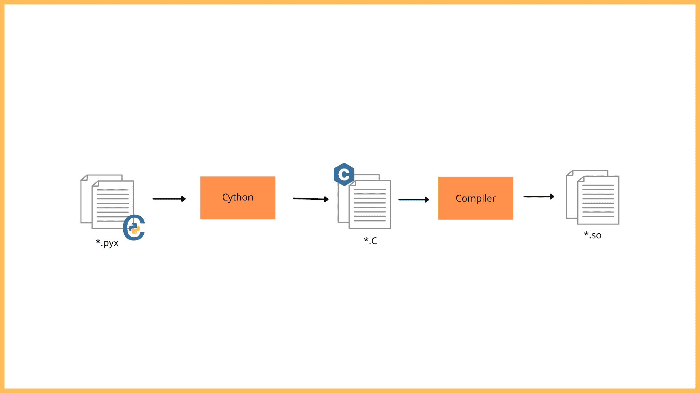

# 使用 Cython 提高 Python 性能

> 原文：<https://blog.logrocket.com/improve-python-performance-using-cython/>

Cython 既是一个模块，也是 Cython 开发者用来加速代码的一种语言。

Cython 是如何工作的？这是什么？你应该用 Cython 写你所有的 Python 代码吗？它能让你的代码多快？它总是有效吗？

在本教程中，我们将向您介绍 Cython，并解释为什么在编写 Python 代码时应该使用它。我们还将回顾 Cylon 的编译管道和常见的使用场景，并引导您完成安装和设置。

我们将通过实际例子介绍以下内容:

本指南的目的是帮助您更好地理解 Cython，以及它如何使用一个简单的素数查找程序来加速 Python。

## Cython 是什么？

Cython 可以被认为是一个模块和一种编程语言，它通过启用从 C/C++借用的静态类型来扩展 Python。基本上，所有 Python 代码都是有效的 Cython，而不是相反。

请记住，您可以将 Python 转换为 Cython，反之亦然。如果这个不容易把握，那就想想 C 和 C++或者 JavaScript 和 TypeScript 的关系。您可以直接将现有的 Python 代码复制到 Cython 文件中，然后编译它以提高性能。

## Cython 带来了什么？

众所周知，Python 比 C 更高效，因为它是一种高级语言。虽然这是事实，但与 C/C++相比，使用 Python 有一个缺点。

Python 效率高但速度慢。另一方面，c 语言效率较低，但比 Python 快。因此，Cython 的目标是将 C 语言的所有优势引入 Python，同时保持 Python 开发者所期望的效率。

要进一步理解这一点，首先需要理解 Python 代码是如何执行的。在执行过程中(即，在解释器中)，Python 源代码经过编译器，编译器充当翻译器，将源代码转换成中间平台独立的字节码。

之后，python 虚拟机逐行执行字节码。因为这是在运行时动态发生的，所以与编译语言相比，逐行执行会使过程变慢。



如果把这个 a 比作编译语言的框图，那么源代码就转化成了可以直接在架构上运行的机器码。与翻译的过程相比，这是非常快的。

这种方法的缺点是机器代码依赖于平台，这意味着您不能在不同的平台上运行相同的代码。

现在你可以看到这两个概念带来了什么。c 给 Python 带来了静态类型，Python 给 c 带来了效率。



## Cython 的编译管道

Cython 管道是什么样子的？Cython 中的编译分为两步。

第一步，您的 Cython 代码被转换成等价的优化的和平台无关的 C 或 C++代码。从那里，C 或 C++源代码通过 C 或 C++编译器被转换成一个共享的目标文件。然而，这个共享对象文件是依赖于平台的。它有一个*。所以 Linux 或 Mac OS 上的扩展和一个*。Windows 上的 pyd 扩展。



## 何时使用 Cython

在哪些情况下，您可能需要使用 Cython？每次在哪里都管用吗？

嗯，是也不是。在任何地方使用 Cython 并不总是能保证提高速度。但是，您可以在涉及大量数学运算和循环迭代的函数中使用它。这是因为在运行操作之前定义类型使得执行起来更容易，尤其是在多次分析和迭代变量的循环中。

另一个很好的用例是当你已经有一个需要 Python 接口的 C 或 C++库时。在这种情况下，您可以使用 Cython 为库创建一个包装器。

* * *

### 更多来自 LogRocket 的精彩文章:

* * *

## Python 与 Cython:性能比较

现在，让我们创建一个示例项目来看看 Cython 的运行情况。

第一步是打开终端，设置一个安全的工作环境(可选)，并安装带有其他所需依赖项的 Cython。

```
$ sudo apt install build-essential
```

这将使`gcc`编译器可用，以防你的计算机没有它。

```
$ sudo apt install python3-venv
```

这为你安全工作提供了一个安全的环境。这一步不是必需的，但是在单独的虚拟环境中创建项目总是好的，这样依赖关系就不会冲突。

```
$ sudo pip3 install cython
```

这会将 Cython 安装到您的机器上。

现在安装已经完成，我们可以开始了。

在这个演示中，我们将在同一个文件中编写两个简单的函数，名为`main.pyx`，来寻找某个质数。我们将用基本 Python 编写一个，用 Cython 编写另一个。从这里开始，我们将执行两者，并测量执行时间的差异。

请注意，本演示的所有文件都将位于一个目录中。此外，您将使用`.pyx`,而不是将`.py`扩展名放在这个文件中，因为您已经在您的机器或环境中安装了 Cython。

```
# 1\. The basic Python function

"""
In this function, you are going to expect as a return value is a list of the first couple of number depending on what you feed it as an input parameter. the list of the prime numbers found is going to be empty in the beginning
"""
def prime_finder_py ( amount ):
  primes = []
  found = 0
  number = 2

  while found < amount:
  for x in primes:
    if number % x == 0:
      break
    else:
      primes.append ( number )

  found += 1
  number += 1

  return primes

"""
the only thing you are checking for in line 12 is if the new number you are currently checking is divisible by the prime a number appended in this array will only be there if and only if the has not been a single number below it that is able to divide it. 

line 19 ensures that the loop runs from one number to the next progressively regardless of whether or not it was added to the primes array
"""
```

```
# 2\. The Cython Function

"""
first of all,you should define these variables because you don’t want to be defining them on the fly since we are trying to optimize python using the C syntax.

Also, in C programming, you always have to define your arrays with a fixed size just like I have done in line 10

Line 13 is a fail safe just incase you choose a number that is beyond this limit ( which you can change by the way )
"""

def prime_finder_cy ( int amount ):
  cdef int number, x, found
  cdef prime[50000]
  amount = min ( amount, 50000 )

  found = 0
  number = 2
  while found < amount:
    for x in primes[ :found]:
      if number % x == 0:
        break
      else:
        primes[found] = number
        found += 1

      number += 1

  return_list = [p for p in primes[ :found]]
  return return_list

'''
for the for loop on line 19, you need to tweak it a little bit because you don't really want to go through the whole value of your fixed array even when you don't have that much numbers in the array. Therefore, the loop need only go upto the index of 'found'. That way, the loop will only run upto the last index of found

line 28 makes sure that you only have the elements you need and not the entire length of the array.
'''
```

如你所见，我们寻找质数的逻辑是完全一样的。你什么也改变不了。实际上在 Cython 语法中有更多的代码。

如果查看 Cython 实现，您会注意到有一个固定大小的数组，其中有多余的空闲槽。你有类型定义和一些额外的代码。你可能会认为这会降低性能，原因很简单，因为有更多的代码。不过，您会看到 Cython 代码比 Python 代码快得多。

在同一个目录下创建另一个文件，并以扩展名`.py`命名。对于这个例子，我将我的命名为`setup.py`。

在`setup.py`文件中，从`Cython.Build`导入`from setuptools`和`cythonize`，像这样:

```
from setuptools import setup
from Cython.Build import cythonize
```

在该文件中，您只需添加以下代码片段:

```
from setuptools import setup
from Cython.Build import cythonize
```

setup(
ext _ modules = cytonize(' main . pyx ')
)

之后，你不只是在你的 IDE 中运行这个；你必须从终端运行它。在终端中打开目录，并执行以下命令:

```
$ python setup.py build_ext --inplace
```

这个命令将生成一个`main.c`文件和一个`.so`文件，如果你使用的是 Linux，或者一个`.pyd`，如果你使用的是 Windows。

从这里开始，您不再需要`main.pyx`文件。您只需要`*.so`文件和另一个新文件来测试功能。

你可以给新的`.py`文件起任何名字；出于这个例子的目的，我们将其命名为`test.py`

在`test.py`文件中，您需要导入二进制文件`main`和用于比较执行时间的`time`。

别担心，你就快到了。

导入`main`和`time`之后，您可以通过查看主导入开始调用您的函数，就像这样:

```
import main
import time

# example call
print( main.prime_finder_py(x) )
print( main.prime_finder_cy(x) )

'''
the Xs in the parameter bracket it the number of prime numbers
the program is supposed to display for you.
'''
```

现在是有趣的部分。

要确定函数运行的时间，您需要添加一个`time`变量并使用您导入的`time`模块。

```
import main
import time

start_py = time.time() '''records time before function runs'''
print( main.prime_finder_py(x) )
end_py = time.time() '''records time after function has run'''

time_py = end_py – start_py

start_cy = time.time() '''records time before function runs'''
print( main.prime_finder_cy(x) )
end_cy = time.time() '''records time after function has run'''

time_cy = end_cy – start_cy

if time_cy < time_py:
print ( ‘ The Cython implementation is faster ’)
else:
print ( ‘The Python implementation is faster ’ )
```

在很大程度上，这段代码非常简单。基本上，如果您在 IDE 中运行这个`test.py`文件，第一部分记录 Python 函数运行所花费的时间。第二部分对 Cython 函数做了同样的工作。`if`语句比较两个计算的执行时间值，并评估哪个函数比另一个快。

请记住，您必须在参数中使用大数字，否则您将不会注意到差异。试试 20，000 作为你的参数，看看会发生什么。您甚至可以尝试添加打印语句来查看每个函数的时间变量的确切值。好好享受吧。

反正这只是因为 Cython 加入了静态类型。你没有改变任何算法复杂性的东西，也没有错误地缓存一些东西。基本上，您牺牲了一些 Python 的灵活性来获得执行时间的巨大改善。

## 结论

现在我们已经完成了这个练习，向您的 Python 代码介绍 Cython 有帮助吗？是的，但不总是。

当操作受 CPU 限制时，这意味着所有的运行时间都花在处理 CPU 寄存器中的一些值上，几乎不需要移动数据，Cython 很可能会通过引入静态类型变量和共享对象库来提高性能。但是，当 IO 绑定(例如，从磁盘读取大文件)或网络绑定(例如，从 FTP 服务器下载文件)操作成为瓶颈时，它就无能为力了。

因此，在向您的 Python 代码介绍 Cython 时，您首先需要分析您的代码，并确定您有哪种瓶颈。

## 使用 [LogRocket](https://lp.logrocket.com/blg/signup) 消除传统错误报告的干扰

[](https://lp.logrocket.com/blg/signup)

[LogRocket](https://lp.logrocket.com/blg/signup) 是一个数字体验分析解决方案，它可以保护您免受数百个假阳性错误警报的影响，只针对几个真正重要的项目。LogRocket 会告诉您应用程序中实际影响用户的最具影响力的 bug 和 UX 问题。

然后，使用具有深层技术遥测的会话重放来确切地查看用户看到了什么以及是什么导致了问题，就像你在他们身后看一样。

LogRocket 自动聚合客户端错误、JS 异常、前端性能指标和用户交互。然后 LogRocket 使用机器学习来告诉你哪些问题正在影响大多数用户，并提供你需要修复它的上下文。

关注重要的 bug—[今天就试试 LogRocket】。](https://lp.logrocket.com/blg/signup-issue-free)