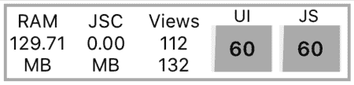

# 用不变性提高 React 本机性能

> 原文：<https://blog.logrocket.com/improve-react-native-performance-with-immutability/>

### 如何在 React Native 中衡量性能

[React Native SlowLog](https://github.com/jondot/react-native-slowlog) 是一款适用于 React Native 中较大性能问题的工具。

它应该优先于许多其他 React 本机性能工具，因为如果您的应用程序中的一些操作很慢，它可以通知您。

测量 React 本机应用程序性能的最常见方法是使用内置的性能监视器。

您可以通过单击性能监视器从模拟器的调试菜单中打开它。它将显示在您的应用程序中当前打开的屏幕上。

The RAM column shows memory usage for the current process, while the second column displays JavaScript thread memory usage.

“视图”列有两个数字:第一个数字显示当前可见视图的数量，第二个数字显示创建并保存在内存中的视图数量。

最后两列的目的是显示用户界面的当前帧速率和 JavaScript 线程的每秒帧数。

在生产模式下检查您的性能很重要。确保检查应用程序日志中的以下内容:

```
__DEV__ === false, development-level warning are OFF, performance optimizations are ON
```

当谈到 Android 性能测量时，React 原生文档建议使用 [systrace](https://facebook.github.io/react-native/docs/performance#profiling-android-ui-performance-with-systrace) 来代替。

另一个你可以使用的工具，也是 React 本地兼容的，是[Why-do-you-render](https://github.com/welldone-software/why-did-you-render)。如果有可避免的重新渲染，它会通知您。它还能够跟踪 React 挂钩问题。

### 避免突变并追踪它们

我们应该避免改变不可变的数据，例如冗余状态。它允许我们避免不必要的重新渲染，并支持高级记忆。

你可以在这篇伟大的博客文章中找到不可变代码[的伟大配方。](https://daveceddia.com/react-redux-immutability-guide/#how-to-update-state-in-redux)

很容易犯一个简单的错误，尤其是因为 JavaScript 不是一种完全函数式的编程语言，它不支持[不变性](https://en.wikipedia.org/wiki/Immutable_object#JavaScript)。

在瞄准不可变代码时，有许多 JavaScript 方法应该避免。查看这个[列表中的 mutator 方法。](https://developer.mozilla.org/en-US/docs/Web/JavaScript/Reference/Global_Objects/Array?source=post_page---------------------------#Mutator_methods)

在 Mozilla 文档中，您可以找到可以安全使用的 JavaScript [方法。](https://developer.mozilla.org/en-US/docs/Web/JavaScript/Reference/Global_Objects/Array?source=post_page---------------------------#Accessor_methods)

但是如何检查代码中错误变异的 Redux store 呢？我们可以使用一个名为[redux-immutable-state-invariant](https://github.com/leoasis/redux-immutable-state-invariant)的中间件，它是专门为此目的而设计的。

这个库不应该在生产中使用，因为它会降低应用程序的性能，但它是跟踪可能问题的一个很好的工具。

该库非常容易使用，因为设置是一个简单的步骤。

它是如何工作的？如果你在你的应用程序中，一些数据在调度或调度之间发生了变化，你会收到一条错误信息。

### 使用纯组件

如果您需要对不可变的结构(比如状态)进行小的更新，那么使用纯组件是一个不错的选择。

纯组件是在 [React 16.6](https://reactjs.org/docs/react-api.html#reactpurecomponent) 中添加的，它们通过避免不必要的重新渲染来提高性能。

它开箱即用，与 React 组件没有区别。唯一的变化是它有一个肤浅的属性和状态比较。

请记住，如果您需要使用深度比较来更新结构，重新渲染整个组件可能会更快。重要的是不要过度使用纯组件。

请记住，pure component 浅层相等检查并不便宜，我们应该始终测量性能差异，而不是将它们放在任何地方。

关于 React 中纯组件的更深入的解释，可以看看这篇博文:[纯功能组件](https://logrocket.com/blog/pure-functional-components/)。

### 使用备忘录

```
const memoizedValue = useMemo(() => computeExpensiveValue(a, b), [a, b]);
```

另一种通过避免重新渲染来提高性能的方法是使用 [useMemo](https://reactjs.org/docs/hooks-reference.html#usememo) 钩子，它返回一个记忆值。

传递给`useMemo`的函数只有在数组改变时传递的参数才会运行。

在提高性能的同时，我们应该始终避免早期优化。

当使用`useMemo`时，我们很容易落入陷阱。对于不使用它的组件来说，这是一种提高性能的好方法，但是我们应该知道 React 可以决定在重新渲染时重新计算值——例如，在释放内存时。

### 如何使用深度嵌套的结构

当处理深层结构时，最好使用更强大的东西，如 [Moize](https://github.com/planttheidea/moize) 库。

为了使用法更加愉快和类似于`useMemo`，我们可以按照文档准备一个`useMoize`钩子，如下所示:【https://github.com/planttheidea/moize#usemoize-hook】T2

```
const deepSum = useMoize(obj => obj.a + obj.b, [object], {
  isDeepEqual: true,
});
```

我们应该避免深度比较，但是在某些情况下，我们可以使用选项`isDeepEqual`来记忆我们的结构。

为了提高性能，我们需要确保避免突变。

当改变深度嵌套的结构时尤其困难。在这种情况下，你最好的选择之一就是使用 [Immer](https://github.com/immerjs/immer) 库，它非常容易掌握:

```
import produce from "immer"

const baseState = [
  {
    todo: "Measure performance",
    done: true
  },
  {
    todo: "Improve code",
    done: false
  }
]

const nextState = produce(baseState, draftState => {
  draftState.push({todo: "Use Immer"})
  draftState[1].done = true
})
```

### 结论

以不可变的方式编写代码可以省去很多麻烦，因此有必要了解哪些 JavaScript 方法被认为是不安全的。

如果您发现您的应用程序运行不佳，您可以从各种工具中进行选择。不过，你应该先检查一下 [React Native SlowLog](https://github.com/jondot/react-native-slowlog) 。

像性能监视器这样的内置工具也非常有用。

慢速组件可以通过使用新的 React 特性(如纯组件)来改进，但正如本文所述，应该小心使用。

还记得软件开发人员中的一句名言吗:“过早优化是万恶之源”。

对于深度嵌套结构的性能问题，你应该致力于用外部库实现不变性，比如 [Moize](https://github.com/planttheidea/moize) 或 [Immer](https://github.com/immerjs/immer) 。

## [LogRocket](https://lp.logrocket.com/blg/react-native-signup) :即时重现 React 原生应用中的问题。

[](https://lp.logrocket.com/blg/react-native-signup)

[LogRocket](https://lp.logrocket.com/blg/react-native-signup) 是一款 React 原生监控解决方案，可帮助您即时重现问题、确定 bug 的优先级并了解 React 原生应用的性能。

LogRocket 还可以向你展示用户是如何与你的应用程序互动的，从而帮助你提高转化率和产品使用率。LogRocket 的产品分析功能揭示了用户不完成特定流程或不采用新功能的原因。

开始主动监控您的 React 原生应用— [免费试用 LogRocket】。](https://lp.logrocket.com/blg/react-native-signup)