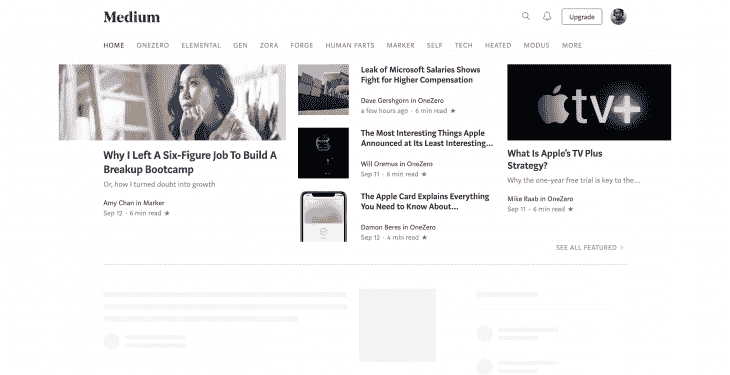
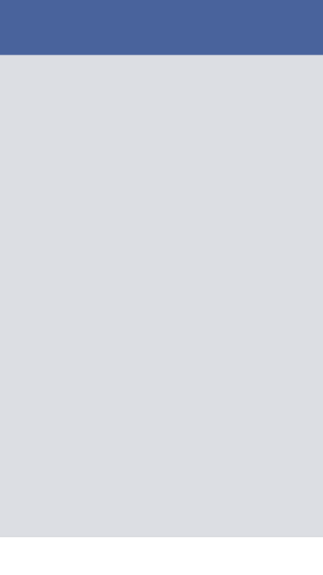
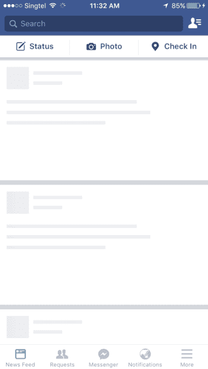
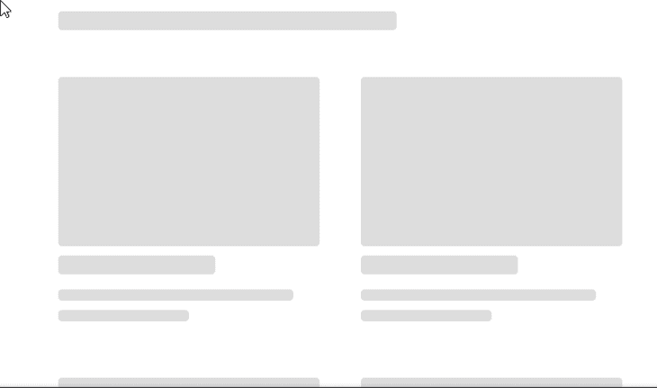

# 用骨架改进 React UX

> 原文：<https://blog.logrocket.com/improve-react-ux-skeleton-ui/>

***编者按:*** *这篇文章于 2022 年 2 月 28 日更新，删除并更正了任何过时的信息，并添加了* *在 React* *与 F* *ramer 运动部分构建骨架 UI。*

骨架屏幕是一个不包含实际内容的 UI，但在内容完全加载之前提供了一个低保真度的页面线框。这样，当内容最终加载时，用户就知道如何在页面中导航。

前端开发人员出于各种原因使用骨架 UI，其中最主要的原因是 UI 在视觉上简化用户体验、模拟内容加载速度以及逐步加载内容而不需要一次获取页面上的所有内容的能力。

Slack、Youtube、脸书、Pinterest 和其他大型科技公司在加载内容以提升 UX 时显示骨架屏幕。



除了框架屏幕之外，这些用户界面通常被称为内容占位符、内容加载器和 ghost 元素。

在本文中，我们将回顾:

## 骨架屏幕如何改善 UX

框架屏幕是一个用户界面，当所有内容加载时，它模仿页面的布局/结构。它通常有一个灰色或灰白色的背景，代表页面上特定类型的元素。

利用动画的框架屏幕——比如微光或脉动效果——往往会使页面的加载速度看起来持续时间更短。

这种方法比在用户等待时向他们显示空白屏幕更有益。让我们来对比一下这两个屏幕:





这两个屏幕都没有加载实际内容，但是用户感觉空白页面较慢，而框架屏幕看起来更丰富、更快，并给用户一种内容外观的感觉，鼓励他们继续等待。

尽管两个屏幕的实际内容加载速度相同，但骨架屏幕提供了更好的 UX。

## 不同类型的骨架用户界面

有几种不同种类的骨架 ui。主要的是内容占位符和图像(或颜色)占位符。像 Medium、Slack 和 YouTube 这样的公司在其主页的框架用户界面中使用内容占位符。

骨架 UI 也很容易构建，因为它们不需要关于实际内容数据的任何细节，只是模仿 UI。

与此同时，Pinterest 和 Unsplash 这两个以图片为主的网站使用了颜色占位符。颜色占位符更难构建，因为它们需要关于实际内容数据的细节。

### 怎么做一个骨架 UI？

首先，加载一个骨架而不是图像(通常带有灰色或灰白色背景)。获取数据后，从图像元数据中加载图像的实际颜色。

这些元数据是从图像中获取的，同时通过后端算法上传，并在图像上进行处理。

最后，延迟加载图像，允许用户使用[交叉点观察器 API](https://blog.logrocket.com/lazy-loading-using-the-intersection-observer-api/) 实际查看内容。

在本教程中，我们将在用 Framer-Motion(React 的一个动画库)创建我们自己的 UI 之前，探索用于创建骨架 UI 的三个不同的包。

这些是 React 中可用于框架 UI 开发的流行包:

这些软件包维护得相当好，但也有缺陷。在决定在我们的应用程序中使用哪一个之前，我们将看看每一个的优缺点。

### `react-content-loader`

#### 赞成者

是一个基于 SVG 的 API，你可以使用任何 SVG 形状来创建骨架元素。它还允许用户轻松创建动画占位符，使用脉冲动画从左到右发光。

这个包有一些预样式化的内容加载器，比如脸书或 Instagram 的加载器，并且可以用于任何复杂的框架 UI，因为 SVG 支持许多形状。

#### `react-content-loader`缺点

当使用`react-content-loader`时，您必须为您的所有组件分别创建定制的骨架组件，这可能很耗时。

另外， [SVG 与 CSS 元素](https://blog.logrocket.com/animating-svg-with-css-83e8e27d739c/)不同，因此创建带有自定义对齐的自定义元素需要一个陡峭的学习曲线。

最后，由于 SVG 的依赖性，浏览器支持可能会不一致，所以不同浏览器上的框架看起来和感觉上可能不同。

#### 使用`react-content-loader`骨架组件

下面是一个使用`react-content-loader`的框架组件的例子:

```
import ContentLoader from "react-content-loader";

// API support all SVG shapes - rect is a SVG shape for rectangle
const SkeletonComponent = () => (
  <ContentLoader>
    <rect x="0" y="0" rx="5" ry="5" width="70" height="70" />
    <rect x="80" y="17" rx="4" ry="4" width="300" height="13" />
    <rect x="80" y="40" rx="3" ry="3" width="250" height="10" />
  </ContentLoader>
)

```

`react-content-loader`提供了一个包装 SVG 元素的`ContentLoader`组件。这个组件还有不同的道具来调整骨骼元素上动画效果的`width`、`height`、`backgroundColor`，甚至`speed`。

你可以在这里 [v](https://github.com/danilowoz/react-content-loader#options) [查看可用道具列表](https://github.com/danilowoz/react-content-loader#options) [。](https://github.com/danilowoz/react-content-loader#options)

### `react-placeholder`

#### 赞成者

这个基于组件的 API 使得使用占位符组件创建定制的框架 ui 变得容易。还支持脉冲动画，可以通过道具控制。

#### `react-placeholder`缺点

与`react-content-loader`类似，我们需要单独维护一个框架组件，因此更新组件的样式也需要更新框架组件。

同样，学习曲线也不是很线性，因为不同的需求有多个组成部分。

#### 使用`react-placeholder`骨架组件

下面是一个使用`react-placeholder`的骨架组件的例子:

```
import ReactPlaceholder from "react-placeholder";

export default function Skeleton() {
  return (
    <div>
      <ReactPlaceholder
        showLoadingAnimation={true}
        type="media"
        ready={false}
        rows={4}
      >
        Hello I am the inner content
      </ReactPlaceholder>
    </div>
  );
}

```

通过使用提供给我们的`ReactPlaceholder`组件，我们可以访问`type`属性，该属性根据其值显示内置的框架布局。其他`type`选项包括`rect`、`text`、`round`等。

注意，`ready`属性接受一个布尔值。当设置为`false`时，假定内容尚未加载。因此，将显示骨架屏幕。相反，当组件的值为`true`时，组件的内容就会呈现。

`react-placeholder`还为您提供了使用`customPlaceholder`属性显示自定义占位符组件的选项，该属性接受 JSX 元素:

```
import { TextBlock, RectShape } from "react-placeholder/lib/placeholders";
import ReactPlaceholder from "react-placeholder";

const customPlaceholder = (
  <div>
    <RectShape color="blue" style={{ width: 30, height: 30 }} />
    <TextBlock rows={7} color="yellow" />
  </div>
);

export default function Skeleton() {
  return (
    <div>
      <ReactPlaceholder
        showLoadingAnimation={true}
        type="media"
        ready={false}
        customPlaceholder={customPlaceholder}
        rows={4}
      >
        Hello I am the inner content
      </ReactPlaceholder>
    </div>
  );
}

```

注意内置的组件，`TextBlock`和`RectShape`，这有助于我们快速创建框架布局。

### `react-loading-skeleton`

#### 赞成者

是一个非常简单的 API，它只有一个组件，带有额外定制的道具。不像前两个，很好学。

`react-loading-skeleton`可以作为一个单独的骨架组件使用，也可以直接放在任何组件里面，所以使用起来很灵活。它还支持动画和主题化。

#### `react-loading-skeleton`缺点

虽然`react-loading-skeleton`对于简单的骨架 UI 来说很棒，但是对于复杂的骨架界面来说很难。

#### 使用`react-loading-skeleton`

下面是一个`react-loading-skeleton`的例子:

```
import Skeleton, { SkeletonTheme } from "react-loading-skeleton";

const SkeletonCompoent = () => (
  <SkeletonTheme color="#202020" highlightColor="#444">
    <section>
      <Skeleton count={3} />
      <Skeleton width={100} />
      <Skeleton circle={true} height={50} width={50} />
    </section>
  </SkeletonTheme>
);

```

对于本文中的完整教程，我们将使用`react-loading-skeleton`。

也就是说，所有三个库都足以满足简单的用例。请随意浏览文档，选择您觉得在应用程序中使用最舒服的一个。

## 在“与帧运动反应”中构建骨架用户界面

了解了骨架 UI 的工作原理后，我们现在可以用 React 和带有微光动画效果的帧运动来创建我们自己的骨架 UI。[该项目的代码库可在 CodeSandbox](https://codesandbox.io/s/skeletonui-w-framer-i7jwxs?file=/src/App.js) 上获得。

### 设计骨架布局

在构建框架 UI 之前，让我们首先考虑内容是如何在页面的满载版本上构建的。在这种情况下，我们将复制 YouTube 用户界面，并为其创建框架用户界面:

```
import React from "react";

import CardList from "./components/CardList";

// Youtube fake data
import youtubeData from "./data";

// Styles for the layout
import "./App.css";

// App component - each section have multiple videos
 return (
    <div className="App">            
      {youtubeData.map((list, index) => (
        <section key={index}>
          <h2 className="section-title">{list.section}</h2>
          <CardList list={list} />
          <hr />
        </section>
      ))}
    </div>
  );
}

export default App;

```

这里，我们导入一个`data.js`文件，它是一组模拟的 YouTube 数据:

```
// data.js
const youtubeData = [
  {
    section: "JavaScript Tutorials by freeCodeCamp",
    channel: "freeCodeCamp.org",
    items: [
      {
        id: "PkZNo7MFNFg",
        image: "https://img.youtube.com/vi/PkZNo7MFNFg/maxresdefault.jpg",
        title: "Learn JavaScript - Full Course for Beginners",
        views: "1.9M views",
        published: "9 months ago"
      },
      {
        id: "jaVNP3nIAv0",
        image: "https://img.youtube.com/vi/jaVNP3nIAv0/maxresdefault.jpg",
        title: "JavaScript, HTML, CSS - Rock Paper Scissors Game",
        views: "216K views",
        published: "1 year ago"
      }
    ]
  },
  {
    section: "Small steps on React",
    channel: "Learn with Param",
    items: [
      {
        id: "ylbVzIBhDIM",
        image: "https://img.youtube.com/vi/ylbVzIBhDIM/maxresdefault.jpg",
        title: "useState example by building a text-size changer",
        views: "148 views",
        published: "3 days ago"
      }
    ]
  }
];
export default youtubeData;

```

然后，我们可以映射这些数据，并为显示标题和`CardList`组件的 section 元素呈现 JSX。

考虑到我们的数据是在本地获取的，我们必须使用`setTimeout`模拟对后端的请求:

```
// App.js
import React, { useState, useEffect } from "react";
import CardList from "./components/CardList";
import youtubeData from "./data";
import "./App.css";

const App = () => {
  const [videos, setVideos] = useState([]);

  // Load this effect on mount
  useEffect(() => {
    const timer = setTimeout(() => {
      setVideos(youtubeData);
    }, 5000);
    // Cancel the timer while unmounting
    return () => clearTimeout(timer);
  }, []);

  return (
    <div className="App">
      {videos.map((list, index) => {
        ...
      })}
    </div>
  );
};

```

通过使用 state 和`useEffect`钩子，我们可以在一个 5 秒钟的模拟后端请求之后呈现`CardList`。

现在让我们看看`CardList`是如何直观地表示 YouTube 数据的

### 使用`CardList`组件

`CardList`是一个`ul`元素，它将 YouTube 数据作为`list`道具的值，并映射到视频列表上，以生成后续的`Card`组件:

```
// CardList.js
import Card from "./Card";

const CardList = ({ list }) => {
  return (
    <ul className="list">
      {list.items.map((item, index) => {
        return <Card key={index} item={item} channel={list.channel} />;
      })}
    </ul>
  );
};

export default CardList;

```

`Card`是一个`li`元素，显示每个 YouTube 视频的细节:

```
// Card.js
const Card = ({ item, channel }) => {
  return (
    <li className="card">
      <a
        href={`https://www.youtube.com/watch?v=${item.id}`}
        target="_blank"
        rel="noopener noreferrer"
        className="card-link"
      >
        
        <h4 className="card-title">{item.title}</h4>
        <p className="card-channel">
          <i>{channel}</i>
        </p>
        <div className="card-metrics">
          {item.views} &bull; {item.published}
        </div>
      </a>
    </li>
  );
};

export default Card;

```

此时，我们的应用程序在呈现`CardList`之前显示一个白屏。让我们创建自己的框架 UI 来替换空白屏幕。

### 创建`Skeleton`组件

要开始创建我们的`Skeleton`组件，让我们在`components`文件夹中创建一个`Skeleton.js`文件，并在项目的根目录中创建一个`skeleton.css`样式表:

```
// Skeleton.js
import "../skeleton.css";
const Skeleton = ({ type }) => {
  const classes = `skeleton ${type}`;
  return <div className={classes}></div>;
};

export default Skeleton;

```

`Skeleton.js`是接受`type`道具的基础`Skeleton`组件，我们在道具中指定所需的骨架元素的类型。道具的值随后被追加到类别列表中:

```
// skeleton.css
.skeleton {
  --skeleton-title-height: 20px;
  --skeleton-title-width: 60%;
  --skeleton-text-height: 12px;
  --skeleton-text-width: 90%;
  --skelton-text-half: 50%;
  --skeleton-avatar-height: 70px;
  --skeleton-avatar-width: 70px;
  --skeleton-thumbnail-height: 180px;
  --skeleton-thumbnail-width: 100%;

  background: #ddd;
  overflow: hidden;
  margin: 10px 0;
  border-radius: 4px;
}
.skeleton-wrapper {
  position: relative;
  overflow: hidden;
}
.skeleton.title {
  height: var(--skeleton-title-height);
  width: var(--skeleton-title-width);
  margin-bottom: 1rem;
}
.skeleton.text {
  height: var(--skeleton-text-height);
  width: var(--skeleton-text-width);
}
.skeleton.avatar {
  height: var(--skeleton-avatar-height);
  width: var(--skeleton-avatar-width);
  border-radius: 50%;
}
.skeleton.thumbnail {
  height: var(--skeleton-thumbnail-height);
  width: var(--skeleton-thumbnail-width);
}
.skeleton.half-text {
  height: var(--skeleton-text-height);
  width: var(--skelton-text-half);
}
.shimmer {
  position: absolute;
  background: rgba(255, 255, 255, 0.3);
  top: 0;
  left: 0;
  width: 30%;
  height: 100%;
}

```

有了这个设置，您现在可以通过将这些微型组件拼接在一起来创建完整的骨架 ui。我创建了一个`skeleton-screens`文件夹来存储 YouTube 页面框架 UI 的`YouTube.js`文件。

当创建这个页面时，我们将使用帧运动来制作骨架 UI 的微光效果的动画。如果你[不熟悉 to Framer Motion，你可以阅读这篇文章](https://blog.logrocket.com/framer-motion-tutorial/)作为初学者介绍。

### 使用帧运动创建微光动画

通过使用来自`framer-motion`的`motion`函数，我们能够制作`Skeleton`组件的动画。

在帧运动中，`initial`属性指定动画的起点，而`animate`属性决定动画的最终状态。通过改变`opacity`，我们可以在骨架 UI 上创建一个淡入效果:

```
// youtube.js
import { motion } from "framer-motion";
import Skeleton from "../components/Skeleton";
import Shimmer from "../components/Shimmer";

const Youtube = () => {
  return (
    <motion.section
      initial={{ opacity: 0 }}
      animate={{ opacity: 1 }}
      className="skeleton-wrapper"
    >
      <h2 className="section-title">
        <Skeleton type="title" />
      </h2>
      <ul className="list">
        {Array(9)
          .fill()
          .map((item, index) => (
            <li className="card" key={index}>
              <Skeleton type="thumbnail" />
              <h4 className="card-title">
                <Skeleton type="title" />
              </h4>
              <p className="card-channel">
                <Skeleton type="text" />
              </p>
              <div className="card-metrics">
                <Skeleton type="half-text" />
              </div>
            </li>
          ))}
      </ul>
      <Shimmer />
    </motion.section>
  );
};

export default Youtube;

```

注意其中的`Shimmer`组件。我们还可以使用帧运动来制作该组件的动画，以创建所需的加载效果:

```
// Shimmer.js
import { motion } from "framer-motion";

const Shimmer = () => {
  return (
    <motion.div
      initial={{ x: -600 }}
      animate={{ x: 1000 }}
      transition={{
        duration: 1.5,
        repeat: Infinity,
        repeatDelay: 1
      }}
      className="shimmer"
    ></motion.div>
  );
};

export default Shimmer;

```

从我们的`skeleton.css`样式表中，我们可以看到应用于`.shimmer`的规则创建了一个位于`skeleton-wrapper`左侧的透明元素。

然后我们使用`initial`来设置屏幕微光元素的初始位置，并将`animate` 1000px 设置到右边。然后`transition`道具提供额外的选项来修改动画的重复和持续时间。

至此，骨架界面完成。现在，让我们看看在加载实际数据之前如何使用`Youtube`框架。

### 使用`Youtube`骨架

接下来，让我们创建一个`isLoading`状态来有条件地呈现`Youtube`骨架:

```
// App.js
import { useEffect, useState } from "react";
import { AnimatePresence, motion } from "framer-motion";
import CardList from "./components/CardList";
import YoutubeSkeleton from "./skeleton-screens/Youtube";
import youtubeData from "./data";

export default function App() {
  const [videos, setVideos] = useState([]);
  const [isLoading, setIsLoading] = useState(true);

  useEffect(() => {
    // activate loading state when component mounts
    setIsLoading(true);
    const timer = setTimeout(() => {
      setVideos(youtubeData);
      // disable loading after 5 seconds
      setIsLoading(false);
    }, 5000);
      // Cancel the timer while unmounting
    return () => clearTimeout(timer);
  }, []);

  return (
    <div className="App">
        {isLoading && <YoutubeSkeleton />}
        {!isLoading && (
          {videos.map((list, index) => (
            <section key={index}>
              <h2 className="section-title">{list.section}</h2>
              <CardList list={list} />
              <hr />
            </section>
          ))}
        )}
    </div>
  );
}

```

我们现在有了一个功能齐全的框架 UI 的例子。但是，当框架 UI 卸载应用程序时，您会注意到一个突然的闪烁。我们可以使用`framer-motion`中的`AnimatePresence`组件来为骨架 UI 创建一个退出动画。

### 用`AnimatePresence`创建退出动画

将`AnimatePresence`包装在一个`motion`组件上使我们能够使用一个`exit`道具，我们可以指定我们想要如何激活组件——就像在`initial`和`animate`中一样。

在我们的例子中，我们希望通过将它的`opacity`设置为 0 来淡出 YouTube 骨架:

```
// App.js
import { useEffect, useState } from "react";
import { AnimatePresence, motion } from "framer-motion";
import CardList from "./components/CardList";
import YoutubeSkeleton from "./skeleton-screens/Youtube";
import youtubeData from "./data";

export default function App() {
  const [videos, setVideos] = useState([]);
  const [isLoading, setIsLoading] = useState(true);

  useEffect(() => {
    setIsLoading(true);
    const timer = setTimeout(() => {
      setVideos(youtubeData);
      setIsLoading(false);
    }, 5000);
    // Cancel the timer while unmounting
    return () => clearTimeout(timer);
  }, []);

  return (
    <div className="App">
      <AnimatePresence>
        {isLoading && <YoutubeSkeleton exit={{ opacity: 0 }} />}
        {!isLoading && (
          <motion.div initial={{ opacity: 0 }} animate={{ opacity: 1 }}>
            {videos.map((list, index) => (
              <section key={index}>
                <h2 className="section-title">{list.section}</h2>
                <CardList list={list} />
                <hr />
              </section>
            ))}
          </motion.div>
        )}
      </AnimatePresence>
    </div>
  );
}

```

因为我们不能将`motion`直接追加到`YoutubeSkeleton`上，所以它的道具会在`YouTube.js`中析构，并扩散到父`section`元素中，也就是一个`motion`元素:

```
// youtube.js
import { motion } from "framer-motion";
import Skeleton from "../components/Skeleton";
import Shimmer from "../components/Shimmer";

const Youtube = ({ ...props }) => {
  return (
    <motion.section
      initial={{ opacity: 0 }}
      animate={{ opacity: 1 }}
      className="skeleton-wrapper"
      {...props}
    >
      {/* code... */}
    </motion.section>
  );
};

export default Youtube;

```

这样，当骨架屏幕退出`CardList`组件的屏幕时，我们可以看到一个平滑的淡出动画。

这是最终的带有微光动画的骨骼界面:



## 结论

骨架屏幕大大提高了 UX，因为它减轻了用户对完全空白屏幕的挫折感，并让用户在加载内容之前就知道内容是什么样子的。

而且，在 React 应用程序中使用 skeleton UI 很容易。

如果您不想使用现有的包，也可以通过创建 div 元素来创建自己的框架 UI，div 元素通过创建矩形和圆形元素来模仿框架。

在评论区分享你使用 skeleton UI 的经验。

## [LogRocket](https://lp.logrocket.com/blg/react-signup-general) :全面了解您的生产 React 应用

调试 React 应用程序可能很困难，尤其是当用户遇到难以重现的问题时。如果您对监视和跟踪 Redux 状态、自动显示 JavaScript 错误以及跟踪缓慢的网络请求和组件加载时间感兴趣，

[try LogRocket](https://lp.logrocket.com/blg/react-signup-general)

.

[ ](https://lp.logrocket.com/blg/react-signup-general) [](https://lp.logrocket.com/blg/react-signup-general) 

LogRocket 结合了会话回放、产品分析和错误跟踪，使软件团队能够创建理想的 web 和移动产品体验。这对你来说意味着什么？

LogRocket 不是猜测错误发生的原因，也不是要求用户提供截图和日志转储，而是让您回放问题，就像它们发生在您自己的浏览器中一样，以快速了解哪里出错了。

不再有嘈杂的警报。智能错误跟踪允许您对问题进行分类，然后从中学习。获得有影响的用户问题的通知，而不是误报。警报越少，有用的信号越多。

LogRocket Redux 中间件包为您的用户会话增加了一层额外的可见性。LogRocket 记录 Redux 存储中的所有操作和状态。

现代化您调试 React 应用的方式— [开始免费监控](https://lp.logrocket.com/blg/react-signup-general)。