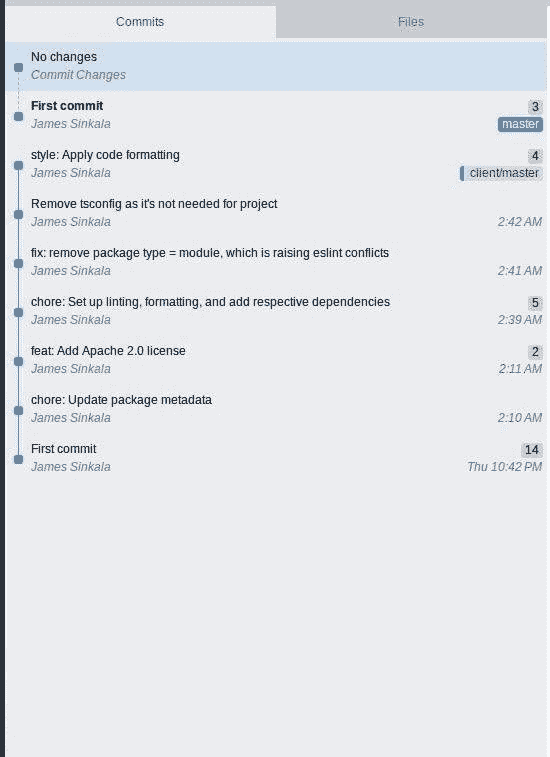
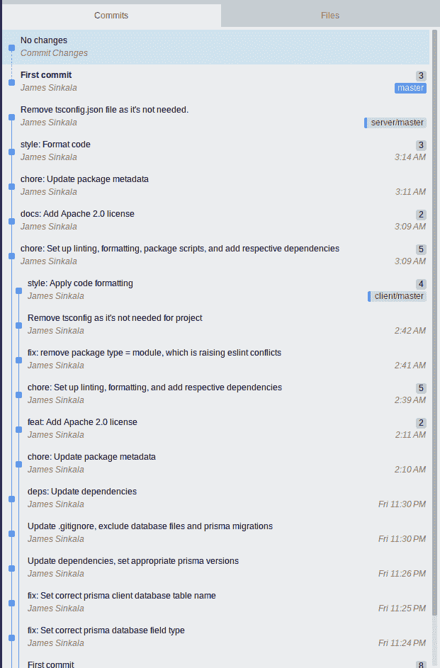

# 利用 moon 改进回购管理

> 原文：<https://blog.logrocket.com/improve-repo-management-moon/>

> Node.js 和 Git 是本教程的先决条件。

软件开发不仅包括编写源代码，还包括确保我们正在开发的源代码能够得到有效的管理和版本控制。

通过适当的版本控制，我们可以绘制源代码的历史；轻松地来回指出导致某些问题出现的变化；修复它们；与他人合作；拓展业务，追求一个项目可以走的另一个平行方向；诸如此类。

随着版本控制系统出现的所有这些可能性，有效地管理存储库变得非常重要，因为当管理不当时，解决方案很容易产生新的问题，特别是当项目扩大时。

想象一个简单的 JavaScript 项目，它随着更多特性的加入而增长。它的依赖性随着时间的推移而增加。同样，它的脚本的数量随着它们的独立依赖性一起增加，开发、预览、测试、格式化、林挺、构建和可能的持续集成被合并。

一个人可以管理大量的这种多重回购，这很容易变得难以管理，因此你可能会决定走单一回购路线。如果你不能正确管理这样的回购，这可能不是最好的解决方案。

所有这些挑战引发了对工具的需求，这些工具可以帮助我们适当地管理常规包管理器所不能提供的源代码库。

moon 就是这样一个工具，它有助于充分自动化地有效管理源代码库。让我们进一步了解一下:

## 月亮是什么？

moon 是基于 JavaScript 的项目的存储库管理、组织、编排和通知工具——或者更简单地说，是用 Rust 编写的 JavaScript 生态系统的构建系统。

moon 中的许多概念在很大程度上受到 Bazel 和其他流行构建系统的启发，但却是为 JavaScript 生态系统量身定制的。

由于是用 Rust 编写的，moon 只支持显式编译的目标，目前是:

*   Linux 64 位 GNU(x86 _ 64-未知-linux-gnu)
*   Linux 64 位 musl (x86_64-unknown-linux-musl)
*   macOS 64 位英特尔(x86_64-apple-darwin)
*   macOS 64 位芯片(aarch64-apple-darwin)
*   Windows 64 位(x86_64-pc-windows-msvc)

## 月亮的基本特征

像其他构建系统一样，moon 提供了许多特性，使得它在处理存储库时比常规的包管理器更有效。以下是这些功能的要点:

## 管理与 moon 的回购

我们需要看到 moon 的工作——即管理一个存储库——以充分理解上面讨论的特性。我将通过管理包含前端客户端和后端服务器的 monorepo 存储库来演示这些特性。我选择单一回购，因为通过它，我们可以利用 moon 的最大潜力，覆盖比多重回购更多的功能。

### 为存储库管理设置 moon

我们可以设置 moon 来管理一个新项目，或者将现有的回购迁移到 monorepo 设置中。因为前者很容易设置，所以我们将关注后者。

以下说明将向我们展示如何迁移目前在以下多回购设置中管理的电子商务商店:

如您所见，这两个存储库都不是最终项目。客户端是一个裸露的 Vue 3 脚手架，服务器是一个 express-prisma REST API 示例。我故意这样做，以便我们可以看到如何将我们的项目迁移到 monorepo 设置，同时保持我们的 Git 历史完整。之后，我们将看看如何继续在 monorepo 中的两个项目上工作。

要使用 moon 来管理我们的 monorepo，我们需要首先建立一个新的 monorepo 存储库。

```
git init estore && cd estore

```

在我们的 repo 目录中，通过运行以下脚本添加一个`package.json`文件。

```
# npm
npm init

#pnpm
pnpm init

```

然后，添加一个. gitignore 文件，存放现有文件，并进行第一次提交。

```
git commit -m "First commit"

```

### 迁移现有存储库及其历史记录

在我们的回购协议中，我们将把我们的两个项目，即 [estore-client](https://github.com/xinnks/estore-client) 和 [estore-server](https://github.com/xinnks/estore-server) ，放在一个`apps/`目录下。

因此，我们最初将使用`mkdir apps`在 monorepo 中创建该文件夹。而且，由于我们已经将我们的 monorepo 目录命名为`estore`，我们将从我们的项目中删除`estore`前缀，保留`client`和`server`。

为了维护当前两个项目(服务器和客户机)的历史，我们将对它们的存储库执行以下操作，同时将它们添加到我们的`estore` repo 中。

从客户端开始，首先，在我们要迁移的应用程序的 repo 中设置一个`git remote`。

```
git remote add client [email protected]:xinnks/estore-client

```

*注意，在继续之前，为了避免任何问题，请确保合并这些远程存储库中任何打开的 PRs。*

然后，我们将从远程获取代码，而无需检出分支。

```
git fetch client

```

之后，我们将运行下面的脚本，在`--prefix`标志的帮助下，将远程的主分支 Git 历史复制到`apps/client`目录。

```
git read-tree --prefix=apps/client -u client/master

```

预览我们与`git status`的`estore`回购的状态，我们得到下面的日志。

```
On branch master
Changes to be committed:
  (use "git restore --staged <file>..." to unstage)
        new file:   apps/client/.eslintrc.js
        new file:   apps/client/.gitignore
        new file:   apps/client/.prettierignore
        new file:   apps/client/.prettietrc.json
        new file:   apps/client/.vscode/extensions.json
        new file:   apps/client/LICENSE
        new file:   apps/client/README.md
        new file:   apps/client/index.html
        new file:   apps/client/package.json
        new file:   apps/client/pnpm-lock.yaml
        new file:   apps/client/project.yml
        new file:   apps/client/public/vite.svg
        new file:   apps/client/src/App.vue
        new file:   apps/client/src/assets/vue.svg
        new file:   apps/client/src/components/HelloWorld.vue
        new file:   apps/client/src/main.js
        new file:   apps/client/src/style.css
        new file:   apps/client/vite.config.js

```

我们将通过实施变更来完成这一步。

```
# Stage changes
git commit -m "feat: Add client app" apps/client

```

预览我们的回购历史，我们会看到之前对`client`的所有提交都是`estore`历史的一部分。



在这个具体的例子中，我们可以看到 [estore-client 的](https://github.com/xinnks/estore-client)历史先于 monorepo 的**首次提交**，因为后者是在前者之后创建和提交的。

对[restore-server](https://github.com/xinnks/estore-server)存储库重复这些步骤，将其远程**服务器命名为**。

完成后，我们会得到这样的结果。



现在，我们准备在`estore`内初始化月球。

### 安装 moon CLI

moon 的 CLI 在`@moonrepo/cli` npm 包中的单个二进制文件中提供。建议全局安装 CLI，以简化从任何目录运行其命令，而不是仅依赖于`package.json`脚本。

无论您使用什么样的软件包管理器，都应该使用 npm 来完成全局安装。

```
npm install -g @moonrepo/cli

```

接下来，在您的 repo 上添加 CLI，如下所示。

```
# yarn
yarn add --dev @moonrepo/cli

# npm
npm install --save-dev @moonrepo/cli

# pnpm
pnpm add -D @moonrepo/cli -w

```

当使用全局二进制时，moon 确保使用与在`package.json`中的回购的`dependencies`部分中定义的版本相同的版本。

对于 CI(持续集成)这样的场景，可以通过下面的`package.json`脚本运行 moon。

```
{
  "scripts": {
    // ...
    "moon": "moon",
    // Yarn 2+
    "moon": "$(yarn bin moon)"
  }
}

```

但是这样的设置需要启动 Node.js 和包管理器来执行 Rust 二进制文件。在这种情况下，建议使用全局二进制设置。

此外，这种设置不适用于包工作区，除非脚本从存储库根目录运行。

安装了 moon CLI 后，我们现在可以用这个脚本在 repo 中初始化 moon。

```
moon init

```

会出现一个提示，询问我们正在初始化 moon 的目录以及我们正在使用的
包管理器。

### 工作区

工作区是一个目录，它包含项目、管理工具链、运行任务，并与 VCS 存储库相耦合。moon 对工作区有一流的支持。虽然不是必需的，但是设置它们符合 moon 的理念。

工作空间的根由一个`.moon`目录和一个`package.json`文件表示。

为了在我们的项目中利用工作区，我们需要根据我们所使用的包管理器的配置来启用它们。下面是各种配置。

对于纱线/npm (package.json)

```
{
  "workspaces": ["apps/"]
}

```

对于 pnpm (pnpm-workspace.yaml)

```
packages:
  - 'apps/'

```

### 在 moon 中配置工作空间

我们可以通过编辑包含在新创建的`.moon`目录中的`workspaces.yml`文件来配置我们的工作空间，该目录是在我们运行`moon init`命令之后创建的。

以下是我们可以在该文件中设置的设置列表。

我们将根据我们项目的布局来配置它。

#### 节点. js

在`.moon/workspace.yml`文件的`node`部分，我们可以定义运行 moon 命令时使用的 Node.js 版本。这是非常重要的，因为它在可能的不同开发团队之间加强了一致性，这些团队在同一个工作区存储库中从事不同的项目。

```
node:
  version: '16.16.0'

```

*注意，* `node.version` *设置需要明确的语义版本。它不支持版本范围。moon 还建议使用一个* [*主动 LTS*](https://nodejs.org/en/about/releases/) *Node.js 版本。*

#### 包管理器

moon 使用 npm 作为默认的包管理器。要改变这一点并将包管理器设置为我们选择的一个，我们需要更新`workspace.yml`中的`node.packageManager`。我们可以将这个值设置为`npm`、`yarn`或`pnpm`。

```
node:
  version: '16.16.0'
  packageManager: 'pnpm'

```

通常情况下，moon 会安装最新版本的软件包管理器，但它从来没有持续更新过。这就是为什么建议为它定义一个显式的语义版本，就像我们对 Node.js 版本所做的那样。

这确保了我们工具链的一致性。即使你选择了`npm`作为你的包管理器，也应该这样做。

```
  node:
    version: '16.16.0'
    packageManager: 'pnpm'
    pnpm:
      version: '7.8.0'

```

在设置了节点和程序包管理器版本之后，运行以下脚本来验证是否安装了这两个版本。

```
  moon --log debug setup

```

该命令将根据配置下载并安装工具链所需的工具。

#### 版本控制系统

moon 需要一个版本控制系统来进行区分、散列和版本比较。默认情况下，使用 Git，因此可以跳过这个设置。

但是为了一致性，也设置这个。我们可以通过`vcs`设置来做到这一点。

```
  vcs:
    manager: 'git'
    defaultBranch: 'master'

```

*注意，* *SVN 目前是实验性的，因此可能无法正常工作。*

### 月球项目

项目可以是来自应用程序、库或工具的任何东西。每个都有自己的构建层、单独的任务和自定义配置。

配置好我们的工作空间后，我们可以在它下面存放尽可能多的项目。

此时，我们在`apps`目录中有了`client`和`server`项目，但是在我们将它们映射到`workspaces`文件中的`projects`设置之前，它们无法从 moon 访问。

`projects`设置是在我们的工作空间中找到的所有项目(或文件系统 globs)的映射。我们以`key: value`格式列出我们的项目，其中键是项目的惟一 ID，值是项目相对于工作区根目录的文件路径。

目前，在`workspaces.yml`中，您会发现一个示例项目`example: 'apps/example`。删除这个并添加`client`和`server`项目以及它们各自的文件路径来反映我们的两个项目，如下所示。

```
  projects:
    server: 'apps/server'
    client: 'apps/client'

```

运行`moon project <project-key>`记录在公共和本地月球配置中设置的项目配置。如果我们得到一个错误，这意味着我们没有正确地映射我们的项目。

这是我们在回购上运行`moon project client`时的预期输出。

```
  CLIENT 

ID: client
Source: apps/client
Root: ~/Projects/estore/apps/client
Language: JavaScript
Type: Application
Name: client
Description: Estore front-end client application
Owner: @estore/client
Maintainers:
 - <client.project.maintainer>
Channel: #moon

 TASKS 

build: vite build
dev: vite --port 3000
format: prettier --write .
install: pnpm install
lint: eslint --ext .js,.vue --ignore-path .gitignore --fix src

 FILE GROUPS 

assets:
 - src/assets/*
 - **/*.{scss,css}
 - **/*.mdx
configs:
 - *.{js,json}
sources:
 - src/**/*
 - types/**/*
tests:
 - tests/**/*.test.*
 - **/__tests__/**/*

```

### 在 moon 中配置项目

moon 中的项目可以通过每个项目目录下的`.moon/project.yml`或`moon.yml`配置文件进行配置。

`.moon/project.yml`文件在配置工作区内所有项目继承的组和任务时非常有用。这是我们可以放置诸如林挺、类型检查和格式化等常见任务的地方。

项目特定的`moon.yml`文件在定义和配置项目特有的文件组、任务和依赖关系时非常有用。

这两个配置文件是可选的，既可以单独使用，也可以一起使用。在我们的例子中，我们将同时使用它们。

从`.moon`中的全局配置文件开始，添加我们的两个项目，给它们的 id 分别为`client`和`server`。

```
projects:
  client: 'apps/client'
  server: 'apps/server'

```

更新 Node.js、包管理器和 VCS 设置。

```
node:
  version: '16.16.0'
  # Any of "npm" (default), "pnpm", or "yarn".
  packageManager: 'pnpm'
  # The version of the package manager (above) to use.
  pnpm:
    version: '7.8.0'
vcs:
  # The manager/binary to use when managing the repository.
  # Accepts "git", or "svn". Defaults to "git".
  manager: 'git'

```

### 配置任务

与上面解释的两个配置文件一样，我们可以将全局任务放在`.moon/workspace.yml`中。在我们的项目中，就像在许多其他项目中一样，可以作为任务放在这里的脚本是诸如林挺和格式化之类的脚本，因为这些可能是大多数项目的同义词。

因此，我们将通过添加这些任务来更新该文件。

```
tasks:
  # Name of the task.
  format:
    # The name of the binary/command on your system.
    command: 'prettier'
    # List of arguments to pass on the command line when executing the task.
    args: '--write .'
    # The type of command to run, and where to locate it.
    # Accepts "node" (default) or "system".
    type: 'node'
  lint:
    command: 'eslint'
    args:
      - --ignore-path
      - .gitignore
      - --fix
      - src
    type: 'node'

```

从上面的配置中，我们可以看到任务有一个名称、参数(`args`)和一个类型。稍后我们会看到更多的选项，关于任务选项的完整列表，你可以在 moon 的[文档](https://moonrepo.dev/docs/create-task)中看到。

正如在 moon 的特性中提到的，在这里，我们将介绍任务的粒度配置。

我们也将把单个项目脚本转换成月球任务。

从`server`项目开始。

```
# apps/server/moon.yml

---
type: "application"
language: javascript
project:
  name: "server"
  description: "Estore's back-end server application"
  channel: "#moon"
  owner: "@estore/server"
  maintainers: ["server.project.leader"]
tasks:
  lint:
    command: "eslint"
    args:
      - --ext
      - .js
    type: "node"
    options:
      mergeArgs: "prepend"
  seed:
    command: node
    args:
      - prisma/seed
    deps:
      - "~:init"
    type: node
  init:
    command: pnpm
    args:
      - dlx
      - prisma
      - migrate
      - dev
      - "--name"
      - init
    type: node
  dev:
    command: nodemon
    deps:
      - "~:seed"
      - "~:lint"
      - "~:format"
    options:
      outputStyle: "stream"
    type: node
  serve:
    command: node
    args:
      - "src/index.js"
      - "NODE_ENV=production"
    deps:
      - "~:init"
    type: node

```

在这个配置文件中，我们可以看到更多的任务选项。

这里，设置为`"stream"`的`options.outputStyle`允许在任务运行时，将输出日志从正在运行的任务直接传输到控制台。

`deps`设置允许我们使用一个或多个任务作为另一个任务的依赖项。

设置为`"prepend"`的`options.mergeArgs`，将这个任务中的参数作为前缀添加到全局项目配置`.moon/project.yml`中的对应项。因此，在这个特定项目上运行时，`"lint"`任务的完整脚本如下。

```
lint:
    # The name of the binary/command on your system.
    command: 'prettier'
    # List of arguments to pass on the command line when executing the task.
    args:
      - --ext
      - .js
      - --ignore-path
      - .gitignore
      - --fix
      - src
    # The type of command to run, and where to locate it.
    # Accepts "node" (default) or "system".
    type: 'node'

```

这对于一个相同的任务，在这里是`"lint"`，可能需要应用于不同的文件类型，这取决于它运行的项目。

这个配置文件还为我们提供了一个通过`project`设置来设置项目元数据的层，如下例所示。

使用以下设置完成`client`项目配置。

```
type: "application"
project:
  name: "client"
  description: "Estore's front-end client application"
  channel: "#moon"
  owner: "@estore/client"
  maintainers: ["client.project.lead"]
language: javascript
tasks:
  lint:
    command: 'eslint'
    args:
      - --ext
      - .js,.vue
    type: 'node'
    options:
      mergeArgs: 'prepend'
  dev:
    command: vite
    args: "--port 3000"
    deps:
      - "~:lint"
      - "~:format"
    options:
      runInCI: false
      outputStyle: "stream"
    type: node
  build:
    command: vite
    args:
      - build
    deps:
      - "~:lint"
      - "~:format"
    type: node
  preview:
    command: vite
    args:
      - preview
    type: node

```

观察上面的配置，我们可以看到应用于客户端项目的`"lint"`任务的变更。

正如我们在`estore`中看到的，两个项目中都存在依赖关系，有些依赖关系是一个项目独有的。我们可以更新`package.json`文件，将全局依赖项添加到工作空间根的`package.json`中，并将它们从项目特定的`package.json`文件中移除。

我们现在可以运行`npm install`来安装依赖项。而且，如果我们已经正确地配置了我们的工作空间，依赖项将被安装在它们适当的位置:工作空间根上的全局依赖项，以及各个项目根内的项目特定的依赖项。

然后，我们可以继续修改我们的项目，以达到可行的消费水平。完整的源代码可以在 [estore 的 GitHub 库](https://github.com/xinnks/estore)中找到。

之后，准备并提交变更。选择一种提交提交的方式，这种方式简化了对独立项目的 Git 历史的识别，但同时显示了作为一个整体的存储库中连贯的流程。(或者，您可以只使用来自`estore`存储库的代码)

当一切都设置好后，我们可以用`moon run`命令执行配置的任务。

任务可以通过两种方式执行:

a.项目范围内有`moon run <project-id>:<task-name>`

从我们的存储库中，我们可以使用这种格式的命令在`apps/client`中运行`build`任务，如下所示。

```
moon run client:build
```

b.我们还可以使用这个 moon 命令:`moon run :<task-name>`在 monorepo 中全局运行要在所有项目中执行的任务。在我们的例子中，我们可以以这种方式运行 lint 和 format 任务，这样两个项目都被格式化和 lint

```
moon run :format 

```

要查看依赖任务的运行情况，请尝试在我们的工作区上运行`moon run client:dev`。由于这个命令依赖于 lint 和 format 命令，您将看到这两个任务也与 dev 任务一起运行。

尽管 moon 相对较新，但它在管理回购方面做得很好。正如我们在上面的例子中看到的，moon 有一个平滑的学习曲线。观察它的发展，从它活跃的开发团队中看到它的特性，它展示了前进的希望。

请务必访问 moon 的[变更日志](https://github.com/moonrepo/moon/releases)来查看项目中加入的新功能。目前，新功能每两周添加一次。

## 摘要

在这篇全面介绍 moon 特性和概念的文章中，我们使用了一个真实的例子(在这种情况下，是一个电子商务 web 应用程序的开发)，涵盖了以下内容:

*   什么是月亮及其基本特征
*   如何从多回购协议设置中设置单回购协议，并使用 moon 对其进行管理
*   如何在 moon 中配置工作空间并在 monorepo 设置中管理多个项目
*   如何创建月球任务，并与他们的各种选择，以实现高效的结果

像许多其他构建系统一样，moon 具有诸如任务缓存和只在受影响的代码上运行的特性，可以被认为对所有类型的项目(多回购和单回购)都有用，因为这些特性提供了包管理器等常规工具所没有的效率。

我们承认 monorepo 设置引入了对组织和我们如何看待代码的改变，因为它不仅仅是代码和工具。反过来，我们获得了一些优势，如增加一致性、减少创建新项目的开销、执行大规模重构、促进代码共享和协作等。总的来说，它们促进了复杂项目中的高效工作。

在这一点上，尽管相对来说还处于起步阶段，但 moon 提供了其他构建系统目前没有提供的以下工具:

*   一个集成的[工具链](https://moonrepo.dev/docs/concepts/toolchain),确保在所有机器上使用相同版本的 Node.js、包管理器(npm、yarn、pnpm)和其他工具，确保一致和可复制的构建
*   跨工作空间的简单任务声明和继承。全局任务可以定义为在一个工作区内的所有项目上运行，并且可以根据单个项目的需要进一步修改。我们已经在 estore 示例中看到了这方面的演示
*   常见 JavaScript 问题的自动化，例如`package.json`依赖项和`tsconfig.json`项目引用
*   [持续集成(CI)的一流支持](https://moonrepo.dev/docs/guides/ci)

月球和其他主流建筑系统的比较可以在这里找到。

要深入了解和研究更多关于月球、它的概念、它所提供的东西和更多的例子，你可以访问[月球的官方文件](https://moonrepo.dev/)。

## 通过理解上下文，更容易地调试 JavaScript 错误

调试代码总是一项单调乏味的任务。但是你越了解自己的错误，就越容易改正。

LogRocket 让你以新的独特的方式理解这些错误。我们的前端监控解决方案跟踪用户与您的 JavaScript 前端的互动，让您能够准确找出导致错误的用户行为。

[](https://lp.logrocket.com/blg/javascript-signup)

LogRocket 记录控制台日志、页面加载时间、堆栈跟踪、慢速网络请求/响应(带有标题+正文)、浏览器元数据和自定义日志。理解您的 JavaScript 代码的影响从来没有这么简单过！

## [log rocket](https://lp.logrocket.com/blg/rust-signup):Rust 应用的 web 前端的全面可见性

调试 Rust 应用程序可能很困难，尤其是当用户遇到难以重现的问题时。如果您对监控和跟踪 Rust 应用程序的性能、自动显示错误、跟踪缓慢的网络请求和加载时间感兴趣，

[try LogRocket](https://lp.logrocket.com/blg/rust-signup)

.

[](https://lp.logrocket.com/blg/rust-signup)

LogRocket 就像是网络和移动应用程序的 DVR，记录你的 Rust 应用程序上发生的一切。您可以汇总并报告问题发生时应用程序的状态，而不是猜测问题发生的原因。LogRocket 还可以监控应用的性能，报告客户端 CPU 负载、客户端内存使用等指标。

现代化调试 Rust 应用的方式— [开始免费监控](https://lp.logrocket.com/blg/rust-signup)。

[Try it for free](https://lp.logrocket.com/blg/javascript-signup)

.