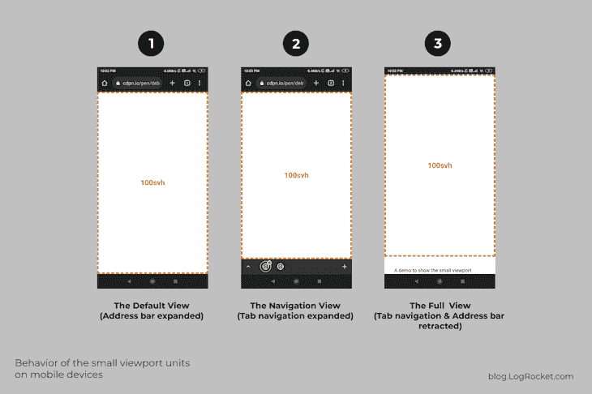
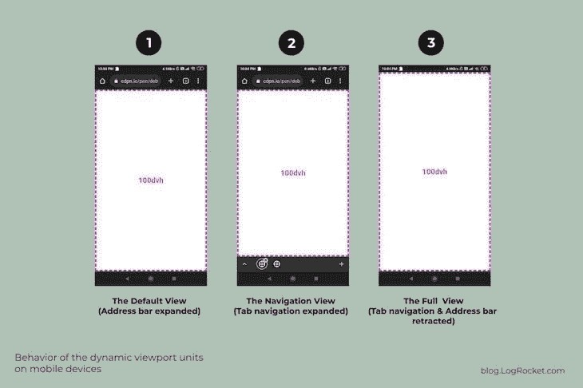

# 使用最新的 CSS 视口单元改进移动设计

> 原文：<https://blog.logrocket.com/improving-mobile-design-latest-css-viewport-units/>

尽管 CSS 视口相关单元已经存在了一段时间，但由于其复杂性，以及如果没有正确实现可能导致的设计不一致，它并没有像其他 CSS 单元那样被广泛使用。

当浏览器的工具栏(如地址栏、选项卡导航等)扩展或收缩时，CSS 视口单元的初始设置所导致的问题在移动设备上更加明显。为了解决这些问题，CSS 工作组最近为小、大和动态视口单元引入了全局浏览器支持。

本文研究了与利用 CSS 视口相关单元相关的困难，并说明了这些单元的最新进展是如何克服这些挑战的。我们将涵盖:

## 查看 CSS 视口基础

在深入探讨视口单位这个主题之前，有必要了解一下视口。视口指的是用于显示网页内容的屏幕部分。

更简单地说，视口可以被认为是用户浏览和导航网站的“窗口”。当使用移动响应布局时，相同的视口区域使用视口元标签来调整大小。

以下是典型的视区元标记模板，用于指示视区利用设备或浏览器中可用的全宽度:

```
<meta name="viewport" content="width=device-width, initial-scale=1">

```

以下示例使用 viewport meta 标记实现和 CSS 来突出显示视区区域:

参见 [CodePen](https://codepen.io) 上 Rahul Chhodde([@ _ Rahul](https://codepen.io/_rahul))
的 Pen [CSS Viewport 元标签实现演示](https://codepen.io/_rahul/pen/eYjEPdo)。

viewport meta 标记还包括一个针对`height`属性的`device-height`设置，用于垂直调整 viewport 的大小。然而，由于浏览网站通常需要垂直滚动，`device-height`设置并不常用。

视窗是显示所有 HTML 元素的区域。为了与视口成比例地调整这些元素的大小，我们使用视口单位，这将在下一节中更详细地讨论。

## 了解最广泛使用的 CSS 视口单元

有各种各样的单位——百分比、`[em](https://blog.logrocket.com/using-em-vs-rem-css/)` [和](https://blog.logrocket.com/using-em-vs-rem-css/) `[rem](https://blog.logrocket.com/using-em-vs-rem-css/)`、px、相对于视口的单位等等——可以用来确定 HTML 元素的大小。为了使元素大小相对于视口，我们使用 CSS 视口或视口相对单位。

与百分比单位不同，百分比单位的大小取决于其父项的大小，CSS 视口单位的大小取决于视口的大小。由于它们的功能完全依赖于视口大小，因此也称为视口相对单位。

让我们探索每个最广泛使用的 CSS 视口单元的具体用例。这种理解将作为新视窗单元的基础。

### 视口宽度单位

视口宽度单位，或`1vw`，代表视口宽度的百分之一。如前所述，它相对于视口宽度，而不是父对象的宽度。

例如，如果您希望图像扩展到其父容器之外，而不使用 CSS 网格调整，那么用百分比单位调整图像的宽度可能会很不方便。相比之下，使用视口宽度单位更简单:

```
.bleed-out {
  width: 75vw;
  position: relative;
  left: 50%;
  transform: translateX(-50%);
}

```

上面的代码将 75%的可用视窗宽度分配给了`.bleed-out`元素。其余的 CSS 调整用于水平居中元素。下面提供了一个工作示例:

参见 [CodePen](https://codepen.io) 上 Rahul Chhodde([@ _ Rahul](https://codepen.io/_rahul))
的笔 [CSS 视口宽度单位演示](https://codepen.io/_rahul/pen/ZEjJmYG)。

需要注意的是，当处理内容超过视窗高度(相当于`100vh`)的文档时，使用`100vw`调整元素大小可能会导致水平滚动问题。这是因为`100vw`考虑了总宽度，包括滚动条的宽度，作为视窗的总宽度。

这是水平视口单元的常见问题。要亲自了解这个问题，请尝试在上面提供的 CodePen 上将`.bleed-out`元素的宽度设置为`100vw`。

### 视口高度单位

视口高度单位，或`1vh`，相当于视口高度的百分之一。视区高度单位最实际的用途之一是创建一个占据整个页面高度的元素。

例如，您可以使用视口高度单位创建一个旨在水平和垂直填充整个屏幕的英雄区域:

```
.hero-area {
  height: 100vh;
  display: flex;
  align-items: center;
  justify-content: center;
  padding: 2em;
}

```

为了确保可访问性，如果 hero 区域内的内容超过了可用的 viewport 高度，建议对元素使用`min-height`而不是显式声明其高度。下面是这方面的一个实际例子:

参见 [CodePen](https://codepen.io) 上 Rahul Chhodde([@ _ Rahul](https://codepen.io/_rahul))
的笔 [CSS 视口高度单位演示](https://codepen.io/_rahul/pen/oNMeVeE)。

### `vmin`和`vmax`单元

这两个单位分别表示视窗宽度和高度的最小值和最大值。视口较小尺寸的 1%将是`1vmin`，而视口较大尺寸的 1%将是`1vmax`。

使用`vmin`和`vmax`单元的最有效方法之一是[创建响应性排版](https://blog.logrocket.com/the-elements-of-responsive-typography/)，它自动适应不同的屏幕尺寸，而不需要多个媒体查询断点:

```
body { font-size: 3vmax }
h1   { font-size: 9vmax }
h2   { font-size: 7vmax }
h3   { font-size: 5vmax }

h1, h2, h3 {
  margin: 1em 0 1.5rem;
}

```

这不仅节省了时间，而且更容易在不同的设备上保持一致的字体大小。看看下面的演示，看看视窗大小的排版效果:

参见 [CodePen](https://codepen.io) 上 Rahul Chhodde([@ _ Rahul](https://codepen.io/_rahul))
的笔 [CSS 视窗大小的排版演示](https://codepen.io/_rahul/pen/VwBzRNV)。

### `vb`和`vi`单元

当网页或元素的书写模式变为垂直时，块方向的角色将被颠倒。这意味着不同 CSS 属性的顶部和底部值将像 left 和 right 一样工作，反之亦然。

这会导致整体布局显得杂乱无章。为了缓解这个问题，可以使用诸如`vb`和`vi`的视口单元来调整元素的大小。

视口块单位`1vb`，代表视口块或垂直轴的百分之一。视口内联单位`1vi`代表内联轴或水平轴的百分之一。

通过利用这些单元，当书写模式从水平切换到垂直时，元素将保持其一致的外观，因为分配给它们的属性基于`vb`和`vi`单元:

参见 [CodePen](https://codepen.io) 上 Rahul Chhodde([@ _ Rahul](https://codepen.io/_rahul))
的笔 [CSS 视口‘VB’和‘VI’单元演示](https://codepen.io/_rahul/pen/eYjEaYb)。

## 初始视口单位集的问题

顶级视口单元虽然在桌面设备上起作用，但在移动设备上可能不提供相同级别的功能。

如前所述，当移动浏览器的动态 UI 元素(也称为用户代理的用户界面(UA UI)元素)扩展或收缩时，这些单元可能会导致不一致。

例如，考虑 Android 上 Chrome 浏览器对于使用`vh`单位调整大小的元素的三种不同状态:


在第一个状态或默认视图中，在`100vh`处调整大小的元素比可用视口高，因为地址栏(用户界面元素)是活动的和扩展的。

在第二种状态下，当地址栏和选项卡导航都是活动的并且展开时，`100vh`元素看起来比可用的视窗高。

第三个状态显示，当两个用户界面元素在向下滚动文档一点后都被收回时，`100vh`元素完全适合整个视窗区域。

通过观察上面提到的三种状态，可以清楚地看到，我们前面讨论的顶级视口单元没有考虑到 UA UI 中的变化，如果您的应用程序严重依赖于这些单元，并且主要由移动用户访问，那么这可能会导致问题。

你可以使用[这个 CodePen 演示](https://codepen.io/_rahul/pen/xxJYErd?editors=1100)来亲眼看看用`vh`单元调整大小的 HTML 元素在 UA UI 元素扩展或收缩时并没有调整。

不同的网络浏览器和移动设备有不同的用户界面特性和元素。例如，Firefox for Android 有一个将地址栏移到底部的功能，而 Chrome 和 Opera 在底部有一个标签导航。

随着正在进行的实验和对 UA UI 的新添加，拥有能够适应这些变化的更通用的视口单元变得越来越重要。

## 需要新的 CSS 视口单元

最新的一组 CSS 视口单元包含了由最初引入的单元引起的移动设备布局不一致的解决方案。旧的单位仍然可以在全球范围内使用；然而，新的单位主要是提供三种不同行为的修改器。

这些单元比顶级单元更智能，因为它们对 UA UI 的变化更直观。这些单元分为三类——小型、大型和动态。在本节中，我们将讨论这些类别，并举例说明它们的用法。

我将使用垂直单位的变体— `svh`、`lvh`和`dvh` —来说明这些变化。考虑到自上而下的布局流程，这种方法将使每个视口修改器单元之间的区别更加明显和易于理解。

其他单元的功能与它们的顶级对应单元[非常相似，我们在上面讨论过](#understanding-most-widely-used-css-viewport-units)。

重要的是要记住，这三个单元的不同行为只能在移动设备上看到。观看演示的最有效方法是使用相应的笔，并切换到“调试”模式。

### 小视窗单元

小视口单元`sv-`，在排除活动 UA UI 元素的大小后，基于视口大小的百分之一确定其大小。例如，设置为`100svh`的 HTML div 的高度等于可用视口高度减去任何活动和展开的 UA UI 元素的高度:



上图中的第三个状态说明了在确定给定 HTML 元素的大小时，`sv-`单位集考虑了活动的 UI 元素。

但是，当 UA UI 元素展开或收缩时，它不会自动调整。此外，正如预期的那样，`100svh`元素在第一和第二状态下完全适合视口。

所有带有前缀“sv”的单元——`svw`、`svh`、`svi`、`svb`、`svmin`和`svmax`——利用相同的方法来确定相对于视口的尺寸。

这些单位非常适合于在考虑活动 UA UI 元素的同时保持相对于视口的大小的情况。

### 大视窗单元

一个大的视口大小单元`lv-`，计算百分之一的视口大小，而不考虑 UA UI 元素的状态和大小，这基本上是顶级视口单元所做的。请看下面这个单元的动作:


所有带有前缀“lv”的单元——`lvw`、`lvh`、`lvi`、`lvb`、`lvmin`和`lvmax`——都被认为是大视口单元。它们的功能类似于前面讨论的顶层单元[—`vw`、`vh`、`vi`、`vb`、`vmin`和`vmax`——因为在确定尺寸时，它们都不考虑浏览器 UI。](#understanding-most-widely-used-css-viewport-units)

目前，这些单元有用的情况有限，而且不确定未来的更新是否会给它们带来额外的功能。

### 动态视口单位

动态视口大小单位是大视口单位和小视口单位的组合。当 UA UI 元素扩展或收缩时，使用这些单位调整大小的元素会自动调整，如下所示:



从上图可以清楚地看出，动态的视口单位集在相对于视口调整 HTML 元素的大小方面非常有效。在这三种状态中的每一种状态下，`100dvh`元素在视口中完全可见，并且如预期的那样完美地适合边缘。

当您希望元素根据扩展或收缩的用户界面元素自动调整和适应时，这组单位最有用。简单地说，你可以很容易地用这个特殊的单元创建那些灵活的和真正全屏的英雄部分。

下面是一个涵盖相同功能的示例:

```
.hero-area {
  min-height: 100dvh;
  padding: 2em;
  ...
}

```

在下面的代码栏中查看结果:

参见 [CodePen](https://codepen.io) 上 Rahul Chhodde([@ _ Rahul](https://codepen.io/_rahul))
的笔 [CSS 动态视口单位演示](https://codepen.io/_rahul/pen/vYadKam)。

将英雄区域模式与其 [svh](https://codepen.io/_rahul/pen/bGjLevM) 和 [lvh](https://codepen.io/_rahul/pen/NWByrBB) 变化进行比较，观察差异。记得使用移动设备来查看前面提到的区别。

## 支持最新的 CSS 视口单元

截至本出版物发布时，这些最近引入的 CSS 视口单元已经获得了 85%或更多的全球浏览器支持。这表明它们得到了广泛的支持，并且可以通过返回到旧浏览器的原始单元集的选项来实现。

## 关于最新 CSS 视口单位的警告

与最初的 CSS 视口单元集相似，新的单元也不考虑滚动条作为 UA UI 元素。

这意味着，如果您的页面需要垂直滚动，滚动条将被视为一个视窗元素，而不是浏览器的用户界面元素。这将导致水平视口单位扩展，宽度为`100vw`的分割将导致水平滚动条！

屏幕上的虚拟键盘也是如此；它仍不被视为用户界面元素，并且不会以任何方式影响视口。这对于长表单的可访问性是有益的，但是对于短表单，这可能会造成混乱，因为输入元素是隐藏的，而不是移动到可用的视口。

此外，动态视口值以较慢的速率更新，并且在 60fps 及以上的较高帧速率下不起作用。一些浏览器还根据使用的手势来延迟更新，例如，慢速滚动、平移或滑动。

## 结论

我们讨论了视口及其视口单元的概念，以及它们的一些实际应用。我们还研究了这些单元在移动设备上带来的挑战，并介绍了解决这些问题的最新进展，包括三个新的视口修改器单元。

此外，我们强调了这些新单元的一些限制，并讨论了尚未解决的问题，例如将滚动条作为视区而不是用户界面的一部分。

有了这些信息，您现在应该对在项目中使用哪些视口单位有了更好的了解。如果您有任何进一步的问题或想分享您的想法，请随时联系我们。

## 你的前端是否占用了用户的 CPU？

随着 web 前端变得越来越复杂，资源贪婪的特性对浏览器的要求越来越高。如果您对监控和跟踪生产环境中所有用户的客户端 CPU 使用情况、内存使用情况等感兴趣，

[try LogRocket](https://lp.logrocket.com/blg/css-signup)

.

[](https://lp.logrocket.com/blg/css-signup)[https://logrocket.com/signup/](https://lp.logrocket.com/blg/css-signup)

LogRocket 就像是网络和移动应用的 DVR，记录你的网络应用或网站上发生的一切。您可以汇总和报告关键的前端性能指标，重放用户会话和应用程序状态，记录网络请求，并自动显示所有错误，而不是猜测问题发生的原因。

现代化您调试 web 和移动应用的方式— [开始免费监控](https://lp.logrocket.com/blg/css-signup)。