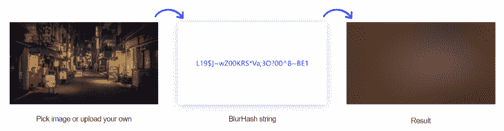
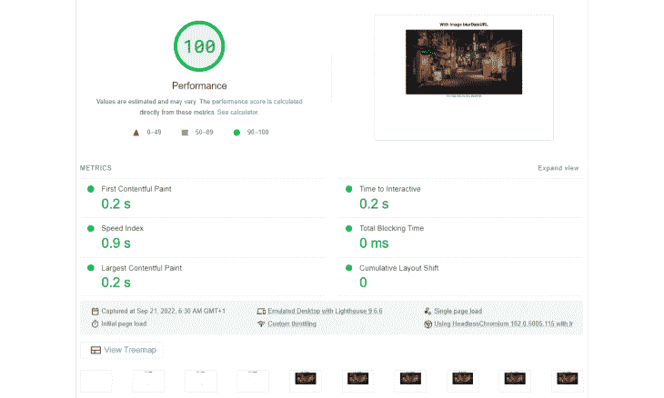
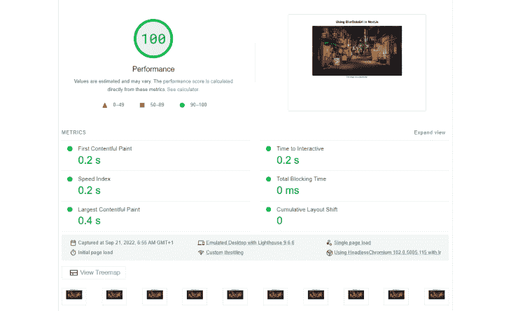
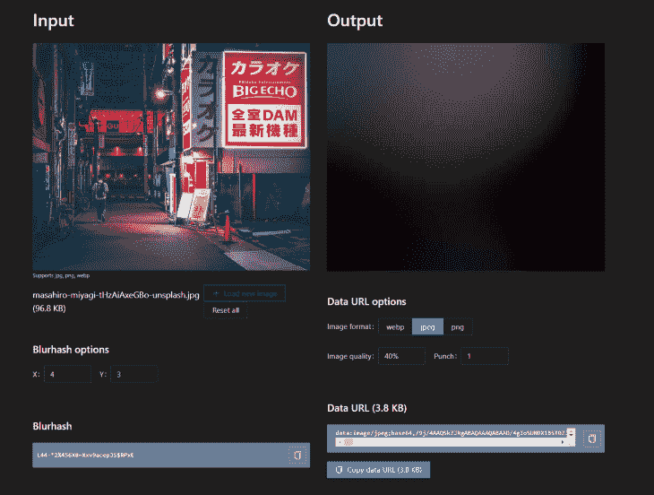

# 使用 BlurHash 提高 Next.js 应用程序性能

> 原文：<https://blog.logrocket.com/improving-nextjs-app-performance-blurhash/>

Next.js 是一个灵活的 React 框架，可以用来构建快速的 web 应用程序。我们可以使用 Next.js 配置快速创建、开发和发布产品，而无需花费数天时间构建应用程序。我们还可以[使用 Next.js 构建服务器端渲染](https://blog.logrocket.com/implementing-ssr-next-js-dynamic-routing-prefetching/)和使用 React 的静态 web 应用程序。

但是，快速构建 web 应用程序和创建快速加载的 web 应用程序是两码事。

web 应用程序加载到客户端所需的时间取决于在第一次初始加载时向客户端提供应用程序代码、样式和数据所需的时间。例如，如果服务器需要在第一次初始加载期间发送额外的资产，如图像，应用程序的性能就会下降。

多项研究表明，网站页面加载速度与用户体验和转化率之间存在正相关关系。有许多方法可以优化或提高 Next.js 应用程序的性能，以实现更快的加载时间。

例如，您可以使用服务器端呈现在服务器端呈现 web 页面的初始 HTML，然后再将其提交给浏览器，使用 Next.js 内置的缓存功能来缓存经常使用的内容，删除未使用的依赖项(这会增加最终应用程序包的大小和加载时间)，或者使用延迟加载或占位符图像来优化图像。

在本文中，我们将关注这些优化策略之一:使用图像占位符进行图像优化。具体来说，我们将演示如何使用 [BlurHash](https://github.com/woltapp/blurhash/blob/master/Algorithm.md) 算法创建图像占位符。

*向前跳转:*

## 什么是图像占位符？

应用程序中有太多图像或者图像非常大且加载缓慢会对页面速度和用户体验产生负面影响。事实上，图像可能是影响应用速度的最重要因素之一。

我们可以使用占位符来代替减少应用程序中图像的数量，从而减少初始加载时图像文件的数量。

图像占位符是一个虚拟图像，浏览器最初可以加载它来表示实际的图像，直到下载了真正的图像。占位符可以提高页面速度，因为与它们所代表的实际图像相比，它们的文件非常小。图像占位符也可以防止网页布局发生变化。

占位符可以是图像的缩略图、一个空的灰色框、一个带有边框或背景色的`img`元素，甚至是图像的尺寸(如果固定的话)或图像的 alt 文本。然而，这些选项中没有一个是漂亮的，它们都会让你的网页看起来很无聊。

现在，让我们考虑占位符的另一个选项。

## 什么是 BlurHash？

为了使图像占位符在视觉上更吸引人，我们可以使用 [BlurHash](https://blurha.sh/) 方法来创建图像的模糊版本，从而产生视觉上更吸引人的设计。

这个过程包括产生一串编码图像失真版本的字符；创建的字符数量取决于图像的质量。



BlurHash 字符串足够小，您不需要检索和下载图像文件；相反，你可以把它直接放到你网站的 HTML 中，然后解码成模糊的图片。

使用此 BlurHash 字符串作为图像占位符会使您的网页在视觉上更具吸引力，还会降低页面速度或网页的初始负载。

## BlurHash 是如何工作的？

[BlurHash 算法](https://github.com/woltapp/blurhash/blob/master/Algorithm.md)分析图像并生成一个字符串作为图像的占位符。这个过程通常在服务的后端完成，图像 URL 存储在这里，所以您可以将 BlurHash 字符串与图像 URL 放在一起。BlurHash 字符串和图像 URL 一起发送给客户端。

BlurHash 字符串足够短，可以快速适应您喜欢的任何数据类型。例如，很容易将其作为一个字段包含在 JSON 对象中。

要在通过网络加载实际图片时显示 BlurHash 占位符图像，您的客户端首先获取 BlurHash 字符串并将其解码为图像，同时在后台加载其全尺寸版本。

```
{
    src: "https://i.ibb.co/5MMtXQQ/masahiro-miyagi-t-Hz-Ai-Axe-GBo-unsplash.jpg",
    blurhash: “L44-*2%456X8~Xxv9aoepJS$RPxE”
}
```

## BlurHash 对页面速度的影响有多大？

BlurHash 对页面速度的影响程度因多种因素而异。但是这里有一个例子说明了 BlurHash 如何积极地影响页面的初始加载。

我用 [Google PageSpeed Insights](https://pagespeed.web.dev/) 测试了一个网页的两个版本的页面速度。第一个版本有一个没有占位符的图像。第二个版本有相同的图像，带有一个 BlurHash 占位符。



页面的第一个版本有一个没有占位符的图像，速度指数为 0.9 秒



该页面的第二个版本有一个带有 BlurHash 占位符的图像，速度指数为 0.2 秒。

## 如何在下一个？JS app？

默认情况下，Next.js 自动为任何静态图像生成 BlurHash 字符串(即从`../some/src/`导入横幅)，对其进行解码，并将其用作图像占位符。但是，如果您的图像是动态的(例如，存储在您的数据库、后端或云中)，您必须提供数据 URL 作为图像的占位符。

### 为静态图像生成 BlurHash 占位符

对于 Next.js 应用程序中的静态图像，您可以使用`Image` 组件上的`placeholder`属性并给它一个`blur`值来生成 BlurHash 占位符，如下所示:

```
import Image from "next/image";
import image from "../public/masahiro-miyagi-xk0YHAn3dzk-unsplash.jpg";

…

<Image
   src={image}
   alt="masahiro-miyagi-xk0-YHAn3dzk-unsplash"
   placeholder="blur"
   layout="fill"
/>
```

### 为动态图像生成 BlurHash 占位符

对于 Next.js 应用程序中的动态图像，除了`placeholder`属性，还必须使用`blurDataUrl` 属性。该属性接受图像的数据 URL。

```
import Image from "next/image";

…

const images = [
  {
    src: "https://i.ibb.co/5MMtXQQ/masahiro-miyagi-t-Hz-Ai-Axe-GBo-unsplash.jpg",
    blurUrl: "mokjmin2kl/9j/4AAQSk…"
  }
]

<Image
    src={images[0].src}
    alt={images[0].src}
    placeholder="blur"
    blurDataURL={images[0].blurUrl}
    layout="fill"
/>
```

### 将 Base83 数据 URL 转换为 Base64 数据 URL

需要注意的是，如果直接在 Next.js 中使用 BlurHash 网站上生成的数据 URL 用于动态图片，是不行的。这是因为 Next.js 只接受 Base64 编码的图像作为数据 URL，而 BlurHash 将图像编码为 Base83。还没有为 Next.js 创建 BlurHash 实现(在这里查看 BlurHash 实现的[列表](https://github.com/woltapp/blurhash#implementations))。

根据我的研究，我找不到任何 Next.js 包可以帮助我从 BlurHash 的 Base83 数据 URL 转换到 Base64 数据 URL，或者任何适用于动态图像的 Next.js 实现。我发现的几个包，比如最近发布的 [use-next-blurhash](https://www.npmjs.com/package/use-next-blurhash) 和[plaiceholder.co](https://plaiceholder.co/)，都不能与 Next.js 一起用于动态存储的图像。

然而，有一个由 Jimmy Chion 创建的 [Next.js Image blurDataURL 生成器](https://blurred.dev/)，它生成图像的 BlurHash 和 Base64 数据 URL。你可以[在 GitHub](https://github.com/cjimmy/blurhash-js) 上派生回购，并将其实现到你的项目中。

我将使用本文中的网站版本来生成数据 URLs 流程是这样的:

1.  访问[furted . dev](https://blurred.dev/)
2.  上传图像
3.  操作 BlurHash 算法的设置和数据 URL 格式，以获取这两个 URL

您还会注意到，与图像的大小相比，数据 URL 的大小有多小。

使用一个小版本的图片来生成 URL，因为图片的细节在 BluHash 生成时会丢失。图像的缩略图是理想的选择。



### 将 BlurHash URL 添加到 Next.js 应用程序

现在，让我们使用 Next.js 应用程序中的 URL。

我们将使用以下命令创建 Next.js 应用程序:

```
yarn create next-app blurdataurl-in-nextjs

```

接下来，我们将对 **`index.js`** 文件进行更改，并在`styles`文件夹中创建一个 **`Home.module.css`** 文件。

```
//index.js
import Image from "next/image";
import styles from "../styles/Home.module.css";
import image from "../public/masahiro-miyagi-xk0YHAn3dzk-unsplash.jpg";
import images from "../public/images";

export default function Home() {
  return (
    <div className={styles.container}>
      <main className={styles.body}>
        <h1>Using BlurDataUrl in Next.js</h1>
        <section className={styles.section}>
          <figure>
            <div className={styles.imageWrapper}>
              <Image
                src={image}
                alt="masahiro-miyagi-xk0-YHAn3dzk-unsplash"
                layout="fill"
              />
            </div>
            <figcaption className={styles.imageCaption}>
              Image 1 is stored locally and does not use a placeholder.
            </figcaption>
          </figure>

          <figure>
            <div className={styles.imageWrapper}>
              <Image
                src={image}
                alt="masahiro-miyagi-xk0-YHAn3dzk-unsplash"
                placeholder="blur"
                layout="fill"
              />
            </div>
            <figcaption className={styles.imageCaption}>
              Image 2 is stored locally and uses a placeholder.
            </figcaption>
          </figure>

          <figure>
            <div className={styles.imageWrapper}>
              <Image src={images[0].src} alt={image.scr} layout="fill" />
            </div>
            <figcaption className={styles.imageCaption}>
              Image 3 is stored remotely but does not use a placeholder.
            </figcaption>
          </figure>

          {images.map((image, index) => (
            <figure key={index}>
              <div className={styles.imageWrapper}>
                <Image
                  className={styles.image}
                  src={image.src}
                  alt={image.src}
                  placeholder="blur"
                  blurDataURL={image.blurUrl}
                  layout="fill"
                />
              </div>
              <figcaption className={styles.imageCaption}>
                Image {index + 4} is stored remotely and uses a placeholder.
              </figcaption>
            </figure>
          ))}
        </section>
      </main>
    </div>
  );
}
```

```
//Home.module.css
.body {
  padding: 20px;
  text-align: center;
}
.section {
  display: flex;
  flex-wrap: wrap;
  align-items: flex-start;
  justify-content: center;
  gap: 10px;
}
.imageWrapper {
  position: relative;
  width: 200px;
  height: 150px;
}
.imageCaption {
  margin-top: 5px;
  width: 200px;
}

@media screen and (max-width: 500px) {
  .imageWrapper {
    position: relative;
    width: 300px;
    height: 225px;
  }
  .imageCaption {
    width: 300px;
  }
}
```

第一个和第三个`figure`元素包含本地和远程存储的图像，但没有占位符。

第二个`figure` 元素有一个本地存储的图像和一个占位符。

相比之下，第四个`figure`元素映射通过一个 image 对象数据数组，该数组模拟我们将从后端获得的数据。我们将把模拟数据存储在`images.js`文件内的`public`文件夹中。你可以[访问 GitHub](https://github.com/Timonwa/Using-blurDataUrl-in-NextJs) 上的模拟数据。

```
//images.js
const images = [
  {
    src: "https://i.ibb.co/5MMtXQQ/masahiro-miyagi-t-Hz-Ai-Axe-GBo-unsplash.jpg",
    blurUrl:
      "data:image/jpeg;base64,/9j/4AAQSkZJRg….",
  },
  {
    src: "https://i.ibb.co/2kWYRTr/masahiro-miyagi-Lfoh1h1azok-unsplash.jpg",
    blurUrl:
      "data:image/jpeg;base64,/9j/4AAQSkZJRgAB…",
  },
];
export default images;
```

现在，在您的终端中运行`yarn dev`，这样您就可以在浏览器中查看应用程序。

如您所见，在浏览器下载和加载实际图像之前，本地和远程图像的占位符几乎会立即加载。

## 结论

在本文中，我们演示了如何使用 BlurHash 为 Next.js 应用程序生成占位符图像。这种策略可以产生视觉上令人愉悦的网页，通过确保页面内容保持其位置来防止布局变化，并提高应用程序的页面加载速度。反过来，这提高了我们的 Next.js 应用程序的性能。

## [LogRocket](https://lp.logrocket.com/blg/nextjs-signup) :全面了解生产 Next.js 应用

调试下一个应用程序可能会很困难，尤其是当用户遇到难以重现的问题时。如果您对监视和跟踪状态、自动显示 JavaScript 错误、跟踪缓慢的网络请求和组件加载时间感兴趣，

[try LogRocket](https://lp.logrocket.com/blg/nextjs-signup)

.

[](https://lp.logrocket.com/blg/nextjs-signup)[](https://lp.logrocket.com/blg/nextjs-signup)

LogRocket 就像是网络和移动应用的 DVR，记录下你的 Next.js 应用上发生的一切。您可以汇总并报告问题发生时应用程序的状态，而不是猜测问题发生的原因。LogRocket 还可以监控应用程序的性能，报告客户端 CPU 负载、客户端内存使用等指标。

LogRocket Redux 中间件包为您的用户会话增加了一层额外的可见性。LogRocket 记录 Redux 存储中的所有操作和状态。

让您调试 Next.js 应用的方式现代化— [开始免费监控](https://lp.logrocket.com/blg/nextjs-signup)。