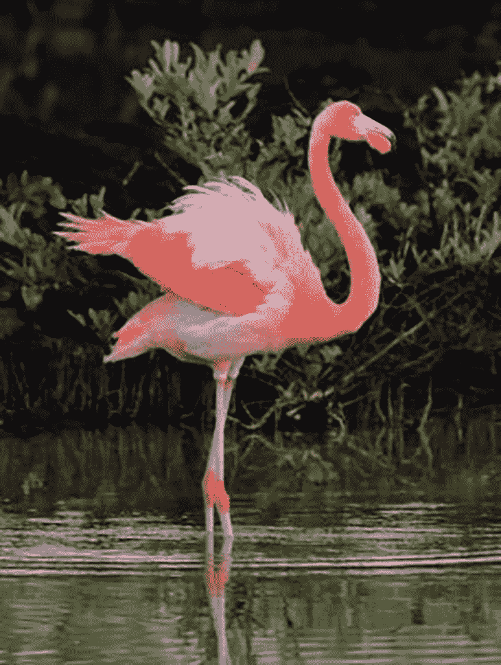

# 使用 HTML 响应图像提高性能

> 原文：<https://blog.logrocket.com/improving-performance-html-responsive-images/>

当谈到响应图像时，我们通常关注使图像适应不同视窗大小的 CSS 技术，例如将`max-width`属性设置为 100%。然而，仅仅使用 CSS 来使图像具有响应性并不会提高性能和页面加载时间，因为您仍然为所有设备提供相同大小的图像。例如，在移动设备上加载 2000 像素的图像会带来巨大的(不必要的)开销。

幸运的是，HTML 对于响应图像也有自己的语法、元素和属性，允许您为不同的视窗大小、分辨率和其他条件提供不同的图像。在本指南中，我们将研究如何在 HTML 中添加响应图像，并讨论以下特性:

*   ``元素
*   `srcset`和`sizes`属性
*   `x`和`w`描述符
*   `<picture>`和`<source>`元素
*   `media`和`type`属性

## 标准图像语法

要在 HTML 中添加响应图像，起点总是标准的图像语法，由`[](https://developer.mozilla.org/en-US/docs/Web/HTML/Element/img)`元素和`src`和`alt`属性组成:

```


```

对于`src`属性，可以使用绝对路径(以`http://`或`https://`协议开始)或相对路径——我在上面已经使用了后者。

你总是需要在这个标准``定义之上“构建”响应图像语法；这也确保了向后兼容性。

## `srcset`属性

`[srcset](https://developer.mozilla.org/en-US/docs/Web/HTML/Element/img#attr-srcset)`属性是与图像相关的 HTML 元素的可选属性，包括``标签。您可以使用它将不同的图像源分配给用户设备的某些功能，如视窗大小或[像素密度](https://www.definitions.net/definition/pixel+density)。用户的浏览器将只加载最适合用户设备的图像，这意味着显著的性能提升。

当使用`srcset`属性时，你应该添加不同尺寸的相同图像。这是因为该属性仅向用户的浏览器给出提示，即它仍然可以加载不同的图像，因为它还考虑了其他因素，例如网络带宽。如果您使用`srcset`，浏览器将假定所有图像源在视觉上是相同的。如果你想提供不同外观的图像，你需要使用`<picture>`和`<source>`元素——我们稍后会研究它们。

使用`srcset`属性提供不同尺寸的图像有两种方式:

*   使用`x`描述符:
    *   您可以根据用户设备的像素密度指定不同的图像源
    *   您可以为低分辨率和高分辨率设备提供不同的图像
*   使用`w`描述符和`sizes`属性:
    *   术语“`w`描述符”代表“宽度描述符”
    *   您可以根据图像的宽度指定不同的图像源
    *   浏览器会考虑像素密度和布局尺寸(它需要为图像分配的空间)

现在，让我们来看看各自的语法。

### 带有`x`描述符的`srcset`属性

使用以下 HTML，您可以为低分辨率和高分辨率显示器提供图像:

```


```

第二个图像`myimage-2x.jpg`是默认图像的两倍大(例如，1280x960px 比 640x480px)，但它只能在高分辨率屏幕上加载。将由用户的浏览器来决定提供哪个图像，主要基于显示器的像素密度。

请注意，您应该将较小的图像添加到`src`属性中，因为这将是默认设置。对于`srcset`属性，您还需要使用`2x`描述符，以便浏览器知道这是用于高分辨率屏幕的图像。

您也可以向`srcset`属性添加多个值。例如，使用下面的代码，您可以为 4K 监视器提供图像:

```


```

要将多个图像源添加到`srcset`，您需要使用各自的`x`描述符(`2x`、`3x`、`4x`等)。)并用逗号分隔值对。

### 具有`w`描述符的`srcset`属性和`sizes`属性

如果你想同时考虑用户设备的像素密度和布局尺寸，你需要使用`srcset`属性和一个或多个`width`描述符以及 [`sizes`属性](https://developer.mozilla.org/en-US/docs/Web/HTML/Element/img#attr-sizes)。

`w`描述符定义了源图像的宽度。例如，`600w`表示图像宽度为 600 像素。只要用逗号分隔它们，就可以向`srcset`属性添加任意数量的图像源，如下所示:

```


```

如果你使用`width`描述符，你也需要使用`sizes`属性——否则，浏览器将无法找到选择哪个图像源。`sizes`属性经常被误解，因为人们倾向于假设`sizes`属性的媒体条件中使用的宽度值与`w`值(`300w`、`600w`等)相关。)在`srcset`属性中使用——然而，它们是相互独立的。

`sizes`属性有两个用途:

1.  根据布局，通知浏览器它需要为图像分配的空间
2.  允许浏览器使用可用图像的宽度(由`w`描述符定义)和屏幕的像素密度选择最合适的图像:
    1.  例如:对于更小的全高清屏幕——比如 13.3 英寸”——浏览器可以选择相同的图像，比如`1200w`图像，就像它对更大的低分辨率屏幕——比如 17.3 英寸——所做的那样。浏览器的选择还取决于可用图像的大小分布和其他条件，因为正如我上面提到的，`srcset`和`sizes`属性对于浏览器来说是可选的，而不是必须的(与`<picture>`和`<sources>`元素相反)

在上面的代码示例中，我在`sizes`属性中定义了三种布局。在小于 500 像素的视窗上，图像将跨越视窗宽度的 100%(`100vw`)。在小于 1000 像素的中等视窗中，图像需要视窗宽度的 90%(`90vw`)。并且，在大于 1000px 的视口中，浏览器需要分配 60%的视口宽度，减去 20px 的左右边距(`calc(60vw - 20px)`)。后者也是默认值，所以我在这里没有使用任何[媒体条件](https://developer.mozilla.org/en-US/docs/Web/CSS/Media_Queries/Using_media_queries#media_features)。

### 使用媒体条件

您可以使用任意数量的媒体条件来定义不同的布局以及图像在每个布局中需要的空间，但是需要注意的是，向`sizes`属性添加媒体条件是可选的。它只需要包含一个默认值，如果您的布局在所有视口大小下看起来都一样，则不需要使用任何媒体条件。例如，上述示例也可以是这样的:

```


```

当心:你会发现一些教程说你可以一起使用`x`和`w`描述符，但是[根据文档](https://developer.mozilla.org/en-US/docs/Web/HTML/Element/img#attr-srcset)，这两个不应该一起使用。仔细想想，这确实很有意义，因为当你使用`w`描述符时，浏览器也会考虑像素密度。

所以，如果你只是想要目标像素密度，使用`x`描述符。如果你想同时针对像素密度和布局，使用`w`描述符。

## `<picture>`和`<source>`元素

如果您希望以不同的大小提供相同的图像，那么与`srcset`属性和`x`或`w`描述符一起使用的``元素是一个很好的解决方案，但是有时您会希望为不同的用户代理加载视觉上不同的图像。

有两个主要的用例解释了您为什么要这样做:

*   针对不同的媒体条件使用不同的艺术指导，例如，同一图像的放大和缩小版本
*   使用不同的图像格式，以便为现代浏览器提供下一代图像

对于这些情况，HTML 有两个元素:`[<picture>](https://developer.mozilla.org/en-US/docs/Web/HTML/Element/picture)`和`[<source>](https://developer.mozilla.org/en-US/docs/Web/HTML/Element/source)`。后者可用于为`<picture>`、`<audio>`和`<video>`元素指定不同的媒体资源。

现在，让我们看看语法是什么样子的。

### 不同艺术方向的图像源

假设您有以下图像:


Photo by [Summer Li](https://www.pexels.com/@summer-li-183179?utm_content=attributionCopyText&utm_medium=referral&utm_source=pexels) from Pexels

对于大屏幕来说，这是一个完美的图像，但是对于中等大小的屏幕，您可能希望提供一个尺寸较小的近景:


在小屏幕上，你只想以更小的图像显示其中一只火烈鸟:



您可以使用以下 HTML 代码定义这三个图像源:

```
<picture>
  <source srcset="images/flamingos-closer.jpg" media="(min-width: 768px) and (max-width: 1199px)">
  <source srcset="images/flamingos-far.jpg" media="(min-width: 1200px)">
  
</picture>

```

正如您在上面看到的，我们添加了最小的、最接近的图像作为默认图像，并为每个图像源定义了相关的媒体条件。

如果您愿意，您还可以使用前面提到的`x`或`w`描述符在每个`srcset`属性中指定多个图像，例如:

```
<picture>
    <source srcset="images/flamingos-closer.jpg, images/flamingos-closer-2x.jpg 2x" media="(min-width: 768px) and (max-width: 1199px)">
  <source srcset="images/flamingos-far.jpg, images/flamingos-far-2x.jpg 2x" media="(min-width: 1200px)">
  
</picture>

```

请注意，[使用`media`属性](https://developer.mozilla.org/en-US/docs/Web/CSS/Media_Queries/Using_media_queries#media_features)，您可以针对宽度和任何其他媒体特性，如方向、纵横比等。

如果使用带有`<source>`标签的`<picture>`元素，用户的浏览器仍将只加载一个图像——最合适的一个——但现在，媒体条件不再像以前那样是一个提示或选项。相反，这是浏览器在任何情况下都必须遵循的规则。换句话说，浏览器将假定图像源在视觉上彼此不同，并相应地对待它们。

### 不同格式的图像源

除了媒体条件，您还可以提供不同格式的图像。如果你想使用[下一代图像格式](https://blog.logrocket.com/how-to-format-quality-images-using-avif-squoosh-and-go-avif/)，比如 AVIF 或 WebP，这可能会特别有用，它们的尺寸更小(可以自行提高性能)，但不被旧浏览器支持。

这里，您需要使用 [`type`属性](https://developer.mozilla.org/en-US/docs/Web/HTML/Element/source#attr-type)定义每个图像源的 [MIME 类型](https://developer.mozilla.org/en-US/docs/Web/Media/Formats/Image_types):

```
<picture>
  <source srcset="images/myimage.avif" type="image/avif">
  <source srcset="images/myimage.webp" type="image/webp">
  
</picture>

```

如果您使用上面的代码，用户的浏览器将一个接一个地检查连续的 MIME 类型——因此，添加您想要首先检查的类型(在上面的例子中我使用了 AVIF)。

从技术上讲，您也可以在每个`<source>`元素中一起使用`type`和`media`属性——但是，请注意这会增加很多额外的复杂性:

```
<picture>
  <source srcset="images/flamingos-closer.webp" media="(min-width: 768px) and (max-width: 1199px)" type="image/webp">
  <source srcset="images/flamingos-closer.jpg" media="(min-width: 768px) and (max-width: 1199px)" type="image/jpeg">
  <source srcset="images/flamingos-far.webp" media="(min-width: 1200px)" type="image/webp">
  <source srcset="images/flamingos-far.jpg" media="(min-width: 1200px)" type="image/jpeg">
  <source srcset="images/flamingo-profile-small.webp" type="image/webp">
  
</picture>

```

## 浏览器支持

浏览器对与响应图像相关的 HTML 语法的支持相对较好:

*   Edge 16+、Firefox 38+、Chrome 38+和 Safari 9+支持[属性`srcset`和`sizes`，但任何版本的 Internet Explorer 都不支持它们](https://caniuse.com/srcset)
*   Edge 13+、Firefox 38+、Chrome 38+和 Safari 9.1+支持[元素，但任何版本的 Internet Explorer 都不支持该元素](https://caniuse.com/picture)
*   Internet Explorer 9+、Edge 12+、Firefox 15+、Chrome 90+和 Safari 14.1+支持[元素](https://caniuse.com/mdn-html_elements_source)

由于 Chrome 和 Safari 相对较晚才开始支持`<source>`元素，所以在这四个与响应图像相关的 HTML 特性中，它是浏览器支持水平最低的。

另外，响应图像语法[优雅地退化](https://developer.mozilla.org/en-US/docs/Glossary/Graceful_degradation)。如果浏览器不支持一个或多个元素或属性，它将简单地使用添加到非常受支持的``元素中的默认图像。

## 包扎

在 HTML 中添加不同的图像源，为每个用户代理提供性能最佳的图像，可以极大地提高性能，尤其是在移动设备上。然而，复杂的语法会使您的编码工作流过于复杂，并且您的代码更难阅读。

本质上，权衡是在复杂性和性能之间，所以你需要决定是否值得为你争论。很明显，图像性能在大量使用图像的网站上更重要，如果在任何给定时间屏幕上只有一两个图像，图像性能可能就不那么重要了。

您也可以自动完成这一过程。像 [Netlify](https://docs.netlify.com/large-media/overview/) 和 [Cloudflare](https://developers.cloudflare.com/images/) 这样的 cdn 和 WordPress 这样的 CMS 已经自带了内置的图像优化功能——它们可以生成同一个图像的多个版本，添加`<picture>`元素，应用媒体条件等等。还有一些开源解决方案可以帮助你实现自动化，比如[图像响应器](https://github.com/nhoizey/images-responsiver)或[获取尺寸](https://github.com/renditions/get-sizes)工具。

最后，不要忘记本指南只讨论了如何在 HTML 中提供响应图像。你仍然需要[使用 CSS 来调整 HTML 添加到设计中的图像](https://blog.logrocket.com/how-to-use-css-grid-to-build-a-responsive-web-layout/)，比如调整`width`和`max-width`属性或者使用响应图像网格。

## 使用 [LogRocket](https://lp.logrocket.com/blg/signup) 消除传统错误报告的干扰

[](https://lp.logrocket.com/blg/signup)

[LogRocket](https://lp.logrocket.com/blg/signup) 是一个数字体验分析解决方案，它可以保护您免受数百个假阳性错误警报的影响，只针对几个真正重要的项目。LogRocket 会告诉您应用程序中实际影响用户的最具影响力的 bug 和 UX 问题。

然后，使用具有深层技术遥测的会话重放来确切地查看用户看到了什么以及是什么导致了问题，就像你在他们身后看一样。

LogRocket 自动聚合客户端错误、JS 异常、前端性能指标和用户交互。然后 LogRocket 使用机器学习来告诉你哪些问题正在影响大多数用户，并提供你需要修复它的上下文。

关注重要的 bug—[今天就试试 LogRocket】。](https://lp.logrocket.com/blg/signup-issue-free)