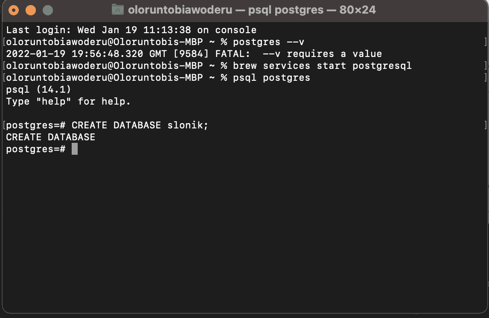
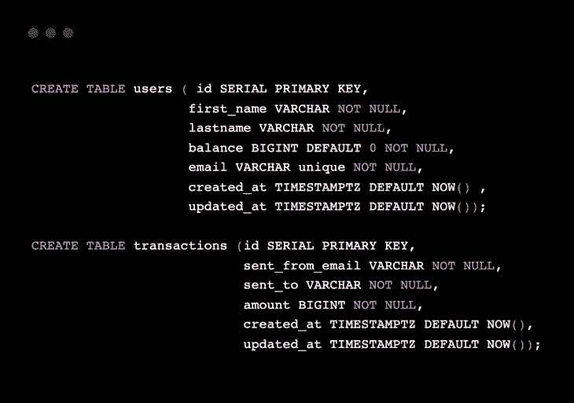
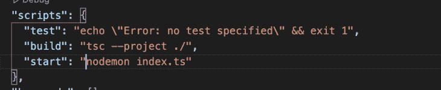
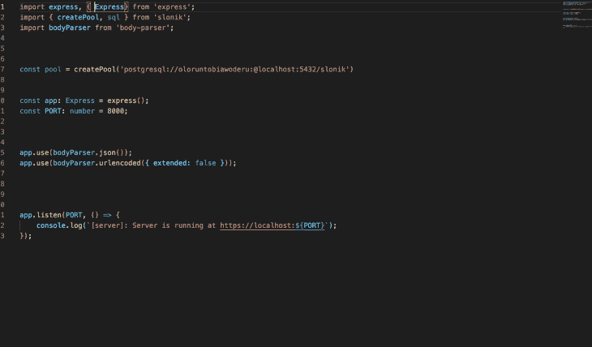
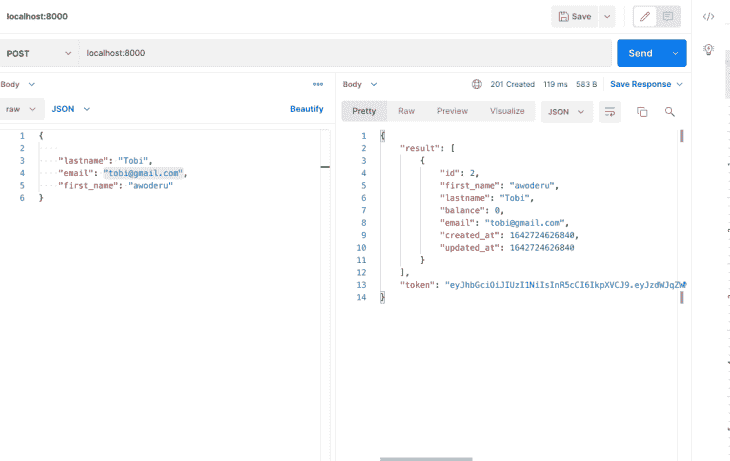
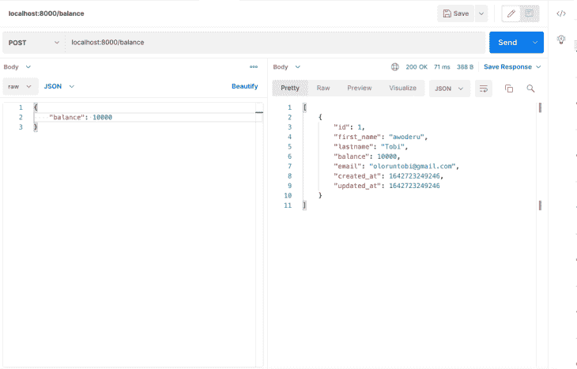
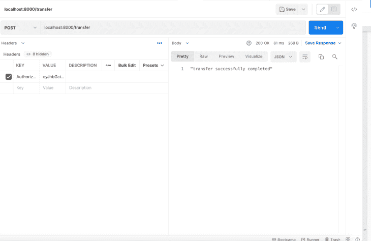

# 用 Slonik 提高 PostgreSQL 的类型安全性

> 原文：<https://blog.logrocket.com/improving-type-safety-postgresql-slonik/>

## 为什么类型安全很重要？

类型安全在编程中很重要，因为它确保类型错误在编译期间被编译器捕获，而不是在运行时捕获。JavaScript 是最流行的编程语言之一，也是 web 语言，因为它快速、轻量，但它也不是强类型语言，这意味着在开发过程中不会发现一些类型错误。这可能会在我们的应用程序中导致意想不到的后果。

人们一直在努力创造确保类型安全的 JavaScript 风格，比如已经被 JavaScript 社区广泛接受的 [TypeScript](https://blog.logrocket.com/pattern-matching-and-type-safety-in-typescript-1da1231a2e34/) 。虽然这对于一般的编程来说已经足够好了，但是在编写查询和与数据库交互时，我们仍然需要某种类型的安全检查。这就是[斯洛尼克](https://github.com/gajus/slonik)的用武之地。

## 什么是斯洛尼克？

在本教程中，我将教你如何使用 Slonik 来确保类型安全。Slonik 是一个 Node.js PostgreSQL 驱动程序，具有严格的类型、详细的日志记录和断言。你可能想知道为什么我们不使用支持 [TypeScript](https://blog.logrocket.com/using-sequelize-with-typescript/) 的 ORM 或查询构建器，虽然这是真的，但我相信编写原始查询仍然是最好的方法。

尽管使用 ORM 可能会使您快速入门，并帮助保护您免受 SQL 注入病毒的侵害，但是它们的查询可能是低效的，并且您仍然需要为复杂的操作编写一些复杂的查询。它们还会妨碍您学习如何正确编写 SQL 查询，而这是后端工程师必须具备的一项重要技能。

谢天谢地，斯洛尼克给了我们两个世界最好的东西；我们获得了类型安全、断言、日志记录和针对 SQL 注入的保护，同时仍然可以完全控制我们的查询。在本教程中，我将带您了解如何构建一个后端应用程序，它使用 PostgreSQL 作为数据库，使用 Slonik 作为数据库驱动程序。我将建立一个简单的钱包 API，允许注册用户使用他们的用户名互相汇款

## 先决条件

*   Node.js ( ≥v14.0)
*   快递. js
*   一种数据库系统
*   斯洛尼克
*   Node.js、TypeScript 和 Express 的工作知识

## 创建数据库

首先，我们需要在本地机器上安装 Postgres。你可以通过这个[链接](https://www.postgresql.org/download/)并遵循适用于你的操作系统的说明来做到这一点。

安装 Postgres 后，我们将创建一个数据库，如下所示:



我们还将运行一些查询来创建我们的数据库表和属性:



您可以在您的终端上运行这个查询，或者使用类似于 [Postico](https://eggerapps.at/postico/) 的应用程序。

## 创建目录和安装依赖项

您可以从创建一个新目录来存放服务器开始。在该目录中，我们将使用 npm 初始化服务器，如下所示:

```
mkdir server
cd server/
npm init --yes

```

`–yes`标志使用默认设置初始化服务器。运行这个命令应该会创建一个类似于这里的`package.json`文件:

```
{
  "name": "slonik-example",
  "version": "1.0.0",
  "description": "",
  "main": "index.js",
  "scripts": {
    "test": "echo \"Error: no test specified\" && exit 1"
  },
  "keywords": [],
  "author": "Oloruntobi Awoderu",
  "license": "ISC"
}

```

现在，我们将为这个项目安装所需的依赖项，并在项目的根目录下创建一个`index.ts`文件。通过运行以下命令安装依赖项:

```
npm i body-parser dotenv express jsonwebtoken slonik ts-node typescript –save-dev @types/body-parser @types/express @types/jsonwebtoken @types/node nodemon @types/pg

```

安装完这些依赖项后，我们需要在根文件夹中创建一个`tsconfig.json`文件，以便在将我们的 TypeScript 编译成 JavaScript 时指定编译器选项。

使用以下配置:

```
{
    "compilerOptions": {
      "target": "es6",
      "module": "commonjs",
      "rootDir": "./",
      "outDir": "./build",
      "esModuleInterop": true,
      "strict": true
    }
  }

```

必须指定`compilerOptions`字段。上面配置中使用的选项有:

*   `Target`，编译后输出的 JavaScript 版本
*   `Module`，支持我们代码中常见的 js 等模块管理器
*   `rootDir`，指定我们的 typescript 项目所在的位置
*   `outDir`，指定编译后的代码所在的目录
*   `esModuleInterop`，将 ES6 模块编译成 CommonJS 模块
*   `Strict`，支持严格的类型检查

我们还需要将`start`和`build`脚本添加到我们的`package.json`文件中:



## 创建服务器

接下来，我们可以在文件夹的根目录下创建一个`index.ts`文件。我们将在这个文件中编写我们所有的代码；这在生产环境中并不理想，但是对于本教程来说，这是可行的。

首先，我们将导入所需的依赖项并启动我们的服务器。将下面的代码粘贴到您的`index.ts`文件中，然后运行命令`npm run start:`

```
import express, { Request, Response, Express} from 'express';
import bodyParser from 'body-parser';

const app: Express = express();
const PORT: number = 8000;

app.use(bodyParser.json());
app.use(bodyParser.urlencoded({ extended: false }));

app.listen(PORT, () => {
    console.log(`[server]: Server is running at https://localhost:${PORT}`);
});

```

## 使用 Slonik 连接到您的数据库

我们现在将使用 Slonik 的`createPool`方法将服务器连接到数据库:

```
import { createPool } from 'slonik';

```

Slonik 允许我们使用连接 URI 连接到我们的数据库，我们提供的配置如下:

```
postgresql://[user[:password]@][host[:port]][/database name][?name=value[&...]]

```

我使用以下 URI 连接到我的数据库:

```
const pool = createPool('postgresql://oloruntobiawoderu:@localhost:5432/slonik')
user = oloruntobiawoderu
password = empty ( I didn't set a password for this user on my local machine. If you have a password for yours, use it)
host: localhost
port =5432 (default port Postgres runs on local)
database name = slonik (It can be any name, as long as you already created the database)

```

现在，我们的`index.ts`文件应该是这样的:



## 创建端点

现在，我们将创建第一个端点来创建用户。为此，我们需要导入 JSON web token (JWT)和`dotenv`包，因为我们需要在创建后为用户创建一个 JWT。我们还需要在项目的根目录下创建一个`.env`文件来存储我们的 JWT 秘密。

首先，我们将创建一个助手函数来帮助我们生成 JWT:

```
async function generateToken(user: any) {
    const payload = {
        subject: user.id,
        email: user.email
    };

    const options = {
        expiresIn: '2d'
    };
    try {
        const token = jwt.sign(payload, String(env.JWTSecret), options);
        return token;
    } catch (error: any) {
        return error.message;
    }
}

```

该函数接收一个用户对象，并生成一个包含用户 ID 和用户电子邮件的令牌。

然后，我们将使用下面的代码创建我们的第一个端点:

```
app.post('/', (req: Request, res: Response) => {
    try {

        const { first_name, lastname, email }: { first_name: string, lastname: string, email: string } = req.body

        pool.connect(async (connection) => {
            const result = await connection.many(sql`INSERT INTO users (first_name, lastname, email) VALUES (${first_name}, ${lastname}, ${email}) RETURNING *`)
            const token = await generateToken(result[0])
            return res.status(201).json({ result, token })
        })
    } catch (error) {
        if (!(error instanceof NotFoundError)) {
            return res.status(400).json('User was not created')
        }

    }

})

```

我们将从请求体接收并析构用户数据，然后使用我们的`createPool`变量建立连接，并使用`many`查询方法运行我们的`Insert`查询。我们在这里使用了`many`查询方法，因为当没有行返回时，它会返回一个`NotFoundError`，我们可以在`catch`块中捕捉到它并返回一个响应。

我们的查询结果被传递到我们的`generateToken`函数中，为用户生成一个 JWT。然后返回用户数据和 JWT。

我们可以去 Postman 那里测试这个端点:



我将使用相同的原则添加几个端点，除了首先解码我们的令牌，以便我们可以确定哪个用户正在发出请求:

```
app.post('/balance', (req: Request, res: Response) => {
    try {
        const { authorization } = req.headers;
        const decoded: any = jwt.verify(String(authorization), String(env.JWTSecret));

        const { balance }: { balance: number } = req.body

        pool.connect(async (connection) => {
            const result = await connection.many(sql`UPDATE users SET balance = ${balance} WHERE users.id = ${decoded.subject} RETURNING *`)
            return res.status(200).json(result)
        })
    } catch (error) {
        if (!(error instanceof NotFoundError)) {
            return res.status(400).json('User was not found')
        }

    }
}) 

app.get('/user', (req: Request, res: Response) => {
    try {
        const { authorization } = req.headers;
        const decoded: any = jwt.verify(String(authorization), String(env.JWTSecret));
        pool.connect(async (connection) => {
            const result = await connection.many(sql`SELECT * FROM Users WHERE users.id = ${decoded.subject}`)
            return res.status(200).json(result)
        })
    } catch (error) {
        if (!(error instanceof NotFoundError)) {
            return res.status(400).json('User was not found')
        }

    }

})

```

`balance`端点用于向用户的余额添加一个金额，而`user`端点获取每个用户的详细信息。这个 API 调用的结果如下:



接下来，我们将构建一个`transfer`端点，它将允许用户相互转账。这还将展示如何通过 Slonik 使用事务:

```
app.post('/transfer', (req: Request, res: Response) => {
    const { amount, destinationEmail }: { amount: number, destinationEmail: string } = req.body
    const { authorization } = req.headers;
    const decoded: any = jwt.verify(String(authorization), String(env.JWTSecret));
    pool.transaction(async (connection) => {
        await connection.query(sql`UPDATE users SET balance = balance + ${amount} WHERE users.email = ${destinationEmail}`);
        await connection.query(sql`UPDATE users SET balance = balance - ${amount} WHERE users.id = ${decoded.subject}`);
        await connection.query(sql`INSERT INTO transactions (sent_from_email, sent_to, amount) VALUES (${decoded.email}, ${destinationEmail}, ${amount})`)
        return res.status(200).json("transfer successfully completed")
    })

})

```

对于`transfers`端点，我们使用`pool.transaction`而不是`pool.connect`来连接和运行我们的查询。这将自动运行我们的所有查询，并在成功运行时提交结果，或者在有错误时回滚。

如果返回的错误是回滚事务错误，Slonik 还会自动重试事务查询。您可以使用`transactionRetryLimit`配置来确定事务重试的次数。`transactionRetryLimit`的默认配置是五个。

下面是 transfers API 调用的结果:



## 结论

Slonik 是一个很好的 Postgres 客户。它使用自己的查询方法提供了良好的类型检查，同时还能让您完全控制查询。虽然它不如其他 Node Postgres 客户端如 [pg](https://node-postgres.com/) 和 [pg-promise](https://www.npmjs.com/package/pg-promise) 成熟，但它是一个可靠的替代方案。你可以在这里找到完整的文档[，在这里](https://github.com/gajus/slonik)找到本教程的完整代码[。](https://github.com/OloruntobiAwoderu/slonik-example/tree/master)

## 使用 [LogRocket](https://lp.logrocket.com/blg/signup) 消除传统错误报告的干扰

[](https://lp.logrocket.com/blg/signup)

[LogRocket](https://lp.logrocket.com/blg/signup) 是一个数字体验分析解决方案，它可以保护您免受数百个假阳性错误警报的影响，只针对几个真正重要的项目。LogRocket 会告诉您应用程序中实际影响用户的最具影响力的 bug 和 UX 问题。

然后，使用具有深层技术遥测的会话重放来确切地查看用户看到了什么以及是什么导致了问题，就像你在他们身后看一样。

LogRocket 自动聚合客户端错误、JS 异常、前端性能指标和用户交互。然后 LogRocket 使用机器学习来告诉你哪些问题正在影响大多数用户，并提供你需要修复它的上下文。

关注重要的 bug—[今天就试试 LogRocket】。](https://lp.logrocket.com/blg/signup-issue-free)