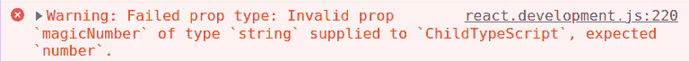
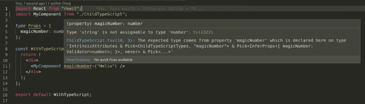
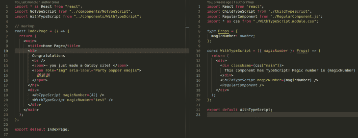

# 如何将 Gatsby 应用程序增量迁移到 TypeScript 

> 原文：<https://blog.logrocket.com/incrementally-migrate-gatsby-app-typescript/>

TypeScript 日益受到开发人员的青睐，这并不奇怪。对它的支持以及采用这种技术的社区和项目数量都有了很大的增长。

不过，事情并不总是这样。Web 开发人员以前曾被消失的热门技术烧伤过，社区中的一些人对大的变化持更加怀疑的态度也是公平的。事实上,[林迪效应](https://en.wikipedia.org/wiki/Lindy_effect)认为，一项技术持续存在的时间越长，它存在的时间就越长。

本文的目标不是说服您迁移到 TypeScript 我假设如果你在这里，你已经被像 JavaScript 这样的动态语言中的静态类型的好处说服了。然而，如果您像我一样，您可能一直在推迟迁移，害怕启动迁移所需的工作量。

好了，不用再害怕了！我已经为你做了繁重的工作。在本文中，您将学习如何增量地采用 TypeScript，这样您就可以平稳地过渡，并在工作后睡个好觉。

### 内容

## 为什么要增量？

为什么我们在这篇文章的标题中有“递增地”？那不就是拖延必然吗？为什么不立即执行完全迁移？

这些都是有效的观点，在某些情况下，它们甚至是最可取的。然而，我假设您有一个有点大的项目，大到使用 codemod 无法工作(或者需要太多的变通方法)。

或者，你可能在一个更大的团队中从事某个应用程序的某个特定部分的工作，并希望在进行大的改变之前进行试点。

在所有情况下，都有一些合理的情景，人们会首先采取谨慎的态度。即使你会发现一堆声称无缝的 codemods 或迁移方法，现实是如果你的项目有一些复杂性，它可能不像他们鼓吹的那么简单。

然而，作为对比，Stripe 的人似乎不同意我的观点。他们最近刚刚发表了一篇文章，声称已经将数百万行代码迁移到 TypeScript。如果你喜欢冒险，值得一试！

## 如何在现有的 Gatsby 应用程序中设置 TypeScript

好的，在今天的实验中，我们假设你已经有了一个 Gatsby 应用程序，并且想要执行一个渐进的迁移。

请记住，如果您今天正在创建一个新项目，Gatsby 从一开始就已经支持将 TypeScript 作为主要语言。不幸的是，对于在旧版本的 Gatsby 中引导的大多数项目来说，情况并非如此，所以我们将走一条不同的路线。

Gatsby 文档已经为如何迁移 T1 提供了很好的指导。但是，为了让它顺利运行，我们需要做一些调整。

### 改变你的。js 文件到。tsx

更容易的部分是更改您想要迁移到的所有组件。tsx，或者以这种格式创建新的。盖茨比方面不需要做任何工作就能做到这一点！这是非常整洁的。

### 安装依赖项

但是，需要安装一些库。确保将它们添加到您的`devDependencies`:

```
$ npm i –save-dev @types/node @types/react @types/react-dom typescript 

```

### 生成`.tsconfig`

TypeScript 有一个名为`.tsconfig`的配置文件，它是非常可定制的，并且会因项目而异。然而，为了让 TypeScript 和 JavaScript 和谐共存，我们需要做一些特定的更改，因为这是每个人逐渐采用 TS 的要求。

`.tsconfig`工作示例如下。请确保将其添加到项目的根文件夹中:

```
{
  "compilerOptions": {
    "target": "es2016",
    "jsx": "react",
    "module": "commonjs",
    "allowJs": true,
    "outDir": "./dist",
    "esModuleInterop": true,
    "forceConsistentCasingInFileNames": true,
    "strict": true,
    "skipLibCheck": true
  },
  "exclude": ["node_modules", "public", ".cache"]
}

```

你也可以在 GitHub 中查看这个公开回购的例子[。](https://github.com/rafaelquintanilha/gatsby-ts-vanilla-extract/blob/master/tsconfig.json)

一些需要的配置如下:

*   添加`"jsx": "react"` 以确保编译器知道我们在 React 项目中
*   设置`allowJs: true`；一旦 JavaScript 和 TypeScript 需要共存，就应该打开这个标志
*   添加`outDir: "./dist"`，让 VS 代码开心，防止不必要的错误

### 声明全局变量

如果您已经做到了这一步，那么您已经完成了大部分设置工作。但是，还是有些毛边。

最明显的是关于 CSS 模块；Gatsby 默认使用 CSS 模块，我们需要让 TypeScript 对此感到满意。如果您使用[SVG 作为组件，如这里描述的](https://blog.logrocket.com/how-to-use-svgs-in-react/)，这也将是有用的。

在项目的`src`文件夹中，创建一个名为`globals.d.ts`的文件，并添加以下内容:

```
declare module "*.module.css";
declare module "*.module.scss";
declare module "*.svg" {
  const content: string;
  export default content;
}

```

这将确保 CSS 和 SVG 都被当作模块来对待和处理。

同样，你可以在 GitHub 中查看[一个工作示例。](https://github.com/rafaelquintanilha/gatsby-ts-vanilla-extract/blob/master/src/globals.d.ts)

> 如果你用的是 ESLint，它可能会抱怨. d.ts 文件。在这种情况下，您可以[在这样的扩展](https://stackoverflow.com/questions/63238879/eslint-only-declares-and-type-imports-are-allowed-inside-declare-module/63239805#63239805)中禁用 linter。

## 使用属性类型键入

TypeScript 的主要优点之一是允许 JavaScript 中的静态类型。当用 React 开发时，这很受欢迎，因为它使我们更难添加不存在的道具，甚至传递错误的变量。

在 TypeScript 出现之前，React 团队用 prop 类型推广了[类型检查。](https://reactjs.org/docs/typechecking-with-proptypes.html)

正确类型是无验证和严格类型之间的中间步骤。使用 prop 类型，开发人员可以列出给定组件中的所有 prop、它们对应的类型，以及它们是可选的还是强制的。

例如，假设我们有一个组件接收一个名为`magicNumber`的道具，它的类型号应该是:

```
import PropTypes from 'prop-types'

const MyComponent = ({ magicNumber }) => { … } 

MyComponent.propTypes = {
  magicNumber: PropTypes.number.isRequired
} 

```

假设我们渲染了`MyComponent`,但是忘记将`magicNumber`作为属性传递，或者传递一个字符串。在开发模式下，我们会在控制台中看到这样的警告:



然而，没有静态验证，在较大的组件或较大的项目中很容易忽略这种错误。此外，我们可以添加一个道具，但是忘记设置它的类型(有一些 linters 可以帮助你)。

使用静态类型，您可以弃用 prop 类型而使用常规类型脚本类型:

```
type Props = {
  magicNumber: number
}

const MyComponent = ({ magicNumber }: Props) => { … } 

```

现在，如果您有一个呈现`MyComponent`的. tsx 组件，传递一个错误类型的道具将在构建时引发一个错误:



就是这样！更安全，但不那么冗长，并且具有所有打字的优点。总而言之，prop 类型可以工作，但是不如 TypeScript 这样健壮的类型策略强大。如果你想更深入地了解这个主题，我建议你阅读我们关于这个主题的预览文章:[比较 React 应用程序中的 TypeScript 和 PropTypes](https://blog.logrocket.com/comparing-typescript-and-proptypes-in-react-applications/)。

如果您确信静态类型优于 prop 类型，那么您也应该知道在一个混合了 TypeScript 和 JavaScript 的项目中抛弃 prop 类型时有一个警告。

假设我们有一个`WithTypeScript.tsx`组件来呈现`MyComponent`的 TypeScript 版本。如果我们试图传递`magicNumber="Hello World"`，一旦出现类型不匹配，就会引发错误，如上所示。

然而，如果`WithTypeScript.tsx`从纯 JavaScript 编写的父组件接收`magicNumber`并将其传递给`MyComponent.tsx`，则没有办法验证变量是否确实是一个数字。一旦父组件没有类型，就不会引发静态错误。因为`MyComponent.tsx`中没有合适类型，所以不会出现运行时错误。因此，这种类型不匹配不会在任何地方出现。



请注意`IndexPage.js`如何使用错误的属性类型调用 TypeScript 组件`WithTypeScript.tsx`。在编辑器或浏览器控制台中看不到警告。

请记住，这只会发生在。js 和。tsx 组件正在通信，如果您正在逐渐采用 TypeScript，这是不可避免的。幸运的是，有一个解决方案:通过从 TypeScript 组件中的 prop 类型推断类型，我们可以两全其美。这样，我们保留了道具类型，但是使用来自[道具类型](https://www.npmjs.com/package/prop-types)库的函数`InferProps`自动将它们转换成类型。

这将是`MyComponent.tsx`组合类型和道具类型:

```
import React from "react";
import PropTypes, { InferProps } from "prop-types";

const Props = {
  magicNumber: PropTypes.number.isRequired,
};

type MyComponentTypes = InferProps<typeof Props>;

const MyComponent = ({ magicNumber }: MyComponentTypes) => { … };

MyComponent.propTypes = Props;

export default MyComponent;

```

[这里可以看到完整的例子](https://github.com/rafaelquintanilha/gatsby-ts-vanilla-extract/blob/master/src/components/ChildTypeScript.tsx)。

如果存在类型不匹配，上述解决方案将在构建时引发静态错误，但是如果错误的类型从. js 传递到. ts 组件，也会在浏览器控制台中引发运行时错误。缺点是您的代码变得更加冗长。

但是，如果较新的组件只与其他组件通信。ts 文件，那么丢弃 prop 类型应该是安全的。最终，当迁移完成时，您可以完全删除它们。

## 结论

TypeScript 是一种特殊的工具，但是一些开发人员避免在现有的代码库中采用它。本文旨在阐明如何在项目中安全地做到这一点，而不需要大的改动。

而盖茨比尤其支持。tsx 文件，考虑到 Gatsby 代码库中存在的典型方法，您需要一些变通方法来使您的编译器满意。为 CSS 模块和 SVG 声明全局变量是常见的棘手问题。

最后，通过让 JavaScript 与 TypeScript 通信，我们不能保证某些键入错误不会变得不透明。因此，我们可以利用 prop-types 库并推断类型，从而两全其美，直到我们可以安全地弃用。

本文中的所有代码和示例都可以在 GitHub 的【repo 中找到。试试看！

## [LogRocket](https://lp.logrocket.com/blg/typescript-signup) :全面了解您的网络和移动应用

[](https://lp.logrocket.com/blg/typescript-signup)

LogRocket 是一个前端应用程序监控解决方案，可以让您回放问题，就像问题发生在您自己的浏览器中一样。LogRocket 不需要猜测错误发生的原因，也不需要向用户询问截图和日志转储，而是让您重放会话以快速了解哪里出错了。它可以与任何应用程序完美配合，不管是什么框架，并且有插件可以记录来自 Redux、Vuex 和@ngrx/store 的额外上下文。

除了记录 Redux 操作和状态，LogRocket 还记录控制台日志、JavaScript 错误、堆栈跟踪、带有头+正文的网络请求/响应、浏览器元数据和自定义日志。它还使用 DOM 来记录页面上的 HTML 和 CSS，甚至为最复杂的单页面和移动应用程序重新创建像素级完美视频。

[Try it for free](https://lp.logrocket.com/blg/typescript-signup)

.