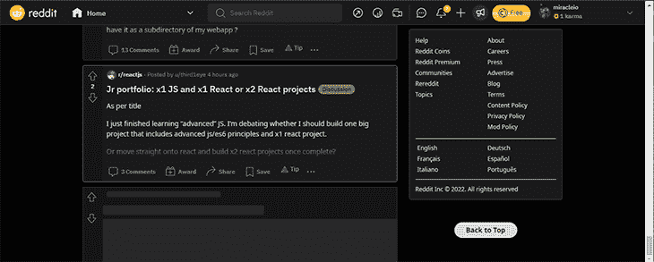
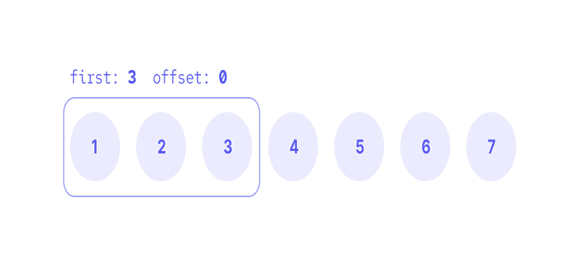
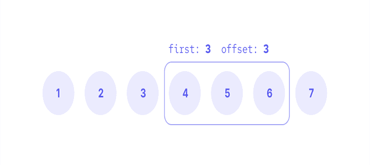
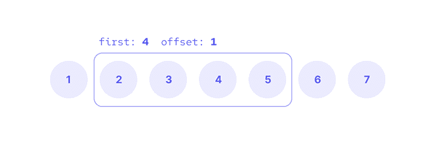
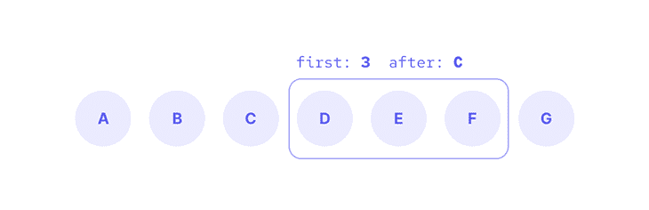
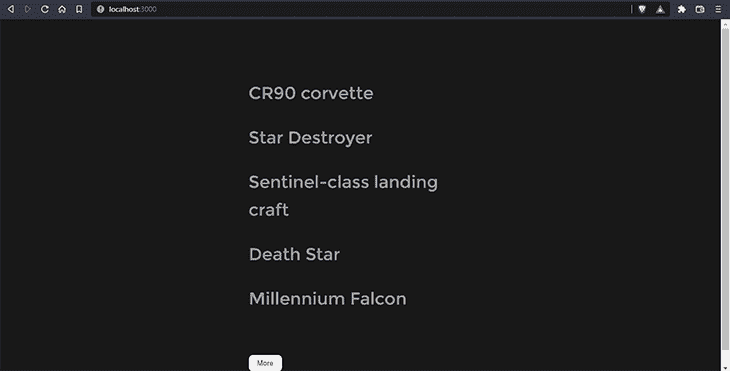
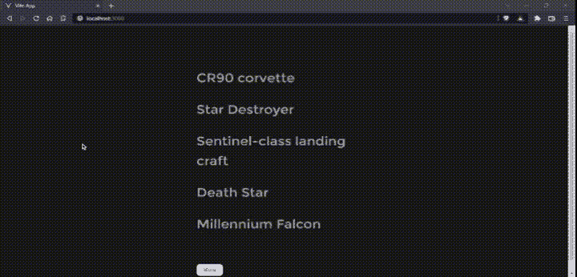
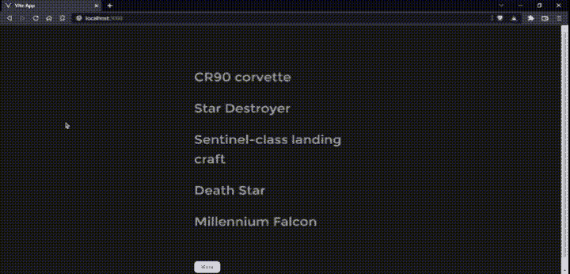

# 无限滚动 GraphQL 

> 原文：<https://blog.logrocket.com/infinite-scrolling-graphql/>

当构建为用户提供长信息列表的应用程序时，比如新闻提要、论坛中的帖子或聊天应用程序中的消息，我们的目标是向用户显示合理数量的信息。

在用户开始滚动初始列表后，web 客户端应该立即加载更多的内容，以不断向用户提供这些信息。这个过程被称为无限滚动。

想象你正在浏览地球上每个人的名单。尽管这个列表并不是无限的，但感觉确实是这样的。您的浏览器可能很难处理来自 GraphQL 服务器的超过 80 亿个条目的列表。

这就产生了分页的需要。GraphQL API 中的分页允许客户端或我们的前端从 API 中查询部分项目列表。在我们的前端，我们现在可以构建无限的滚动功能。

本文将讨论 GraphQL 中分页的概念及其工作原理。我们将深入探讨无限滚动的概念及其应用、优点和缺点。我们还将看到如何将我们的 Vue 前端连接到一个提供数据列表的演示 GraphQL API。至此，我们将演示如何在前端实现无限滚动来获取数据。

分页是将内容分离或划分为称为页面的离散部分的过程。

虽然我们在本文中试图完成的并不涉及创建页面来显示内容，但它仍然依赖于将内容分成几部分的概念，以便在用户滚动时加载内容。

[无限滚动是我们今天在应用中看到的三种主要分页形式之一](https://blog.logrocket.com/guide-pagination-load-more-buttons-infinite-scroll/)。让我们快速看一下所有三种常见的分页形式:编号、加载更多和无限滚动。

当我们谈论分页时，编号分页通常就是我们所指的。在这种形式中，内容被分割并显示在不同的页面上。

这种分页形式的一个很好的例子是 Google 搜索结果。


load more 方法是另一种常见的分页形式。这是“加载更多”按钮位于列表末尾的位置，单击它会加载更多的项目。它也可以以“下一步”按钮的形式出现，可以加载更多的项目，但不一定在同一页面上。

博客就是一个很好的例子。通常在列表的底部有一个按钮，当它被点击时会加载更多的博客文章。这种方法非常适合希望用户在页面末尾看到页脚的网站。


对于未编号的页面，还有另一种形式的 load more 分页方法。例如，您可以使用这些按钮在旧版本的 Reddit 中加载更多内容。


无限滚动在提要中尤其常见，在提要中，用户可以继续滚动一长串项目。在这种方法中没有页面的概念，但是用户滚动的列表是一些较短列表的组合。当用户滚动时，获取并添加主列表的这些子集。

新版 Reddit 和大多数社交媒体平台都使用无限滚动。



我们已经看到了在应用程序中实现分页的常用方法，现在让我们看看它在 GraphQL 中是如何工作的。虽然没有一种特定的方法来实现分页，但是 GraphQL 官方网站给了我们三种主要的方法:

*   基于偏移量的分页
*   基于光标的分页
*   基于 ID 的分页

这种方法通常被认为是 GraphQL 中最简单的分页形式。对于基于偏移量的分页，查询通常包括两个参数:`first`(或`limit`)和`offset`(或`skip`)。`first`参数定义了列表返回多少项，而`offset`参数定义了我们应该在列表中跳过多少项。

使用这种分页设置，您的查询可能如下所示:

```
query {
  people(first: 3, offset: 0) {
    name
  }
}

```

该查询将从第一个人 0 开始获取列表中的三个人。我们会得到名单上的前三个人。



你也可以决定不从名单上的第一个人开始。也许您希望第二页从列表中的第四个人开始有另外三个人。没问题！您的查询参数只需稍作修改:

```
query {
  people(first: 3, offset: 3) {
    name
  }
}

```

现在，结果将偏移三个项目，并从第四个项目而不是第一个项目开始。



我们也可以自由地改变`first`和`offset`值来满足我们的需要。下面的查询从列表中获得四个项目，其`offset`为`1`:

```
query {
  people(first: 4, offset: 1) {
    name
  }
}

```

这意味着列表将从第二个项目开始包含四个项目。



这是基于偏移量的分页的基础。虽然它很简单，但也有它的缺点——即它容易重复或遗漏数据。当在分页过程中向列表中添加新项目时，通常会出现此问题。

当添加新的项目时，项目在数组中的位置可能会改变。由于`offset`依赖于项目位置，如果一个项目被添加到列表的顶部，前一页的最后一个列表项目可能会成为下一页的第一个项目，因为它的位置现在更低了。

基于光标的分页是 GraphQL 中最广泛接受的分页标准。它对分页时列表中发生的变化具有弹性，因为它不依赖于项目的位置，而是依赖于一个`cursor`。

基于光标的分页可以通过几种方式实现。最常见且被广泛接受的一种遵循[继电器图 QL 连接规范](https://relay.dev/graphql/connections.htm)。

为基于光标的分页实现中继连接规范可能很复杂，但它给了我们更多的灵活性和信息。

这个规范给了我们一些可以用来分页的参数。包括向前分页的`first`和`after`(或`afterCursor`),向后分页的`last`和`before`。
我们还可以访问多个领域。

让我们评估一下这个查询:

```
query ($first: Int, $after: String) {
  allPeople(first: $first, after: $after){
    pageInfo {
      hasNextPage
      endCursor
    }
    edges {
      cursor
      node {
        id
        name
      }
    }
  }
}

```

您会注意到，对于字段的参数`first`和`after`，我们有:

*   `pageInfo`:包含页面上的信息，包括:
    *   `hasNextPage`:当前页面(或部分、子集)之后是否还有其他项目
    *   `endCursor`:当前页面最后一个列表项的光标
*   `edges`:包含列表中每个项目的以下数据:
    *   `cursor`:通常是一个[不透明值](https://relay.dev/graphql/connections.htm#sec-Cursor)，可以从项目数据中生成
    *   `node`:实际项目数据

现在，回头看看上面包含以下变量的查询:

```
{
  "first": 2,
  "after": "YXJyYXljb25uZWN0aW9uOjI="
}

```

这是我们得到的回应:

```
{
  "allPeople": {
    "pageInfo": {
      "hasNextPage": true,
      "endCursor": "YXJyYXljb25uZWN0aW9uOjQ="
    },
    "edges": [
      {
        "cursor": "YXJyYXljb25uZWN0aW9uOjM=",
        "node": {
          "id": "cGVvcGxlOjQ=",
          "name": "Darth Vader"
        }
      },
      {
        "cursor": "YXJyYXljb25uZWN0aW9uOjQ=",
        "node": {
          "id": "cGVvcGxlOjU=",
          "name": "Leia Organa"
        }
      }
    ]
  }
}

```

> 您可以在 SWAPI GraphiQL playground 上亲自尝试这个查询。

尽管基于 ID 的分页不像其他两种方法那样常用，但仍然值得讨论。

这种方法非常类似于基于偏移量的分页。不同之处在于，它没有使用`offset`来确定返回的列表应该从哪里开始，而是使用了接受列表中某项的`id`的`afterID`(或者简单地称为`after`)。

看一下这个查询:

```
query {
  people(first: 3, after: "C") {
    name
  }
}

```

这将从列表中获取带有`C`的`id`的项目之后的前三个项目。

这有助于解决基于偏移量的分页问题，因为返回的项不再依赖于项的位置。现在，他们依赖于使用`id`作为唯一标识符的商品本身。

好了，现在我们已经熟悉了 GraphQL 中分页的工作方式，让我们深入了解无限滚动吧！

我想假设我们之前都至少使用过一次社交媒体或新闻订阅应用。因此，我们应该熟悉无限卷轴是怎么一回事。在您到达页面底部之前或同时，新内容会添加到提要中。

对于 JavaScript 应用程序，我们可以通过两种主要方式实现无限滚动:要么使用滚动事件处理程序，要么使用[交叉点观察器 API](https://developer.mozilla.org/en-US/docs/Web/API/Intersection_Observer_API) 。

对于滚动事件处理程序，我们运行一个函数，该函数将在两种情况下获取以下页面:

*   滚动位置在页面的底部
*   有下一页要提取

该方法的通用 JavaScript 代码如下所示:

```
 window.addEventListener('scroll', () => {
    let {
        scrollTop,
        scrollHeight,
        clientHeight
    } = document.documentElement;

    if (scrollTop + clientHeight >= scrollHeight && hasNextPage) {
      fetchMore()
    }
});

```

在这里，我们正在收听`window`中的`scroll`事件。在回调函数中，我们得到文档的`scrollTop`、`scrollHeight`和`clientHeight`。

然后，我们有一个`if`语句来检查添加到视窗高度(`clientHeight`)的滚动量(`scrollTop`)是否大于或等于页面高度(`scrollHeight`)，以及`hasNextPage`是否为真。

如果该语句为真，它将运行函数`fetchMore()`来获取更多的条目并将它们添加到列表中。

### 交叉点观察器 API

与 scroll 事件处理程序方法不同，此方法不依赖于 scroll 事件。相反，它会观察元素何时在视口中可见，并触发一个事件。

这里有一个基本的例子:

```
const options = {
  root: document.querySelector("#list"),
  threshold: 0.1,
};

let observer = new IntersectionObserver((entries) => {
  const entry = entries[0];
  if (entry.isIntersecting) {
    fetchMore()
  }
}, options);

observer.observe(document.querySelector("#target"));

```

我们用观察者的设置来定义选项。有了它，我们可以观察根元素中`target`元素的可见性的变化。这里的`root`是一个带有`list`的`id`的元素。
我们还有一个`threshold`，它决定了`target`元素与根元素相交的程度。

我们将`IntersectionObserver`功能分配给`observer.value`。然后我们传递一个回调函数和定义好的`options`。

回调接受参数`entries`，这是回调接收到的条目列表，对于每个报告其交集状态发生变化的目标，都有一个`entry`。每个条目包含几个属性，比如`isIntersecting`，它告诉我们目标元素现在是否与根元素相交，并且在大多数情况下是可见的。

一旦`entry.isIntersecting`为真，就会触发`fetchMore()`函数，向列表中添加更多的条目。

## 构建我们的应用程序

我们将使用 Apollo Client 构建一个简单的 Vue 应用程序，与演示 GraphQL API 进行交互。你可以在 Netlify 上找到我们将要构建的[最终项目。](https://vue-graphql-infinite-scroll.netlify.app/)

要开始，您需要:

*   文本编辑器—例如 VSCode
*   [Vue](https://vuejs.org/) 的基础知识
*   [GraphQL](https://graphql.org/) 的基础知识
*   最近安装的 [Node.js](https://nodejs.org/en/) 版本

### 设置我们的演示 API

对于本教程，我们将使用 SWAPI GraphQL 包装器，一个使用 GraphQL 构建的围绕 [SWAPI](https://swapi.dev/) 的包装器。

首先，从 GitHub 中锥形化[存储库](https://github.com/graphql/swapi-graphql):

```
git clone https://github.com/graphql/swapi-graphql.git

```

然后安装以下依赖项:

```
npm install

```

使用以下命令启动服务器:

这将在随机的本地主机端口启动 GraphQL API 服务器。

> 🚨如果你在 Windows 上安装时遇到了类似于本期中提到的 [的问题，你可以按照说明来解决。在
> `package.json`中，还可以编辑第 40 行(`build:lambda`)在`NODE_ENV`—`SET NODE_ENV`前添加`SET`。然后再次运行`npm install`。](https://github.com/graphql/swapi-graphql/issues/192)

或者，您可以简单地使用[这个部署版本](https://swapi-gql.netlify.app/.netlify/functions/index)进行查询。

### 创建我们的 Vue 应用

要创建新的应用程序，请导航到您选择的目录并运行:

```
npm init [email protected]

```

现在，按照提示配置您的安装:

```
√ Project name: ... vue-infinite-scroll
√ Add TypeScript? ... No / Yes
√ Add JSX Support? ... No / Yes
√ Add Vue Router for Single Page Application development? ... No / Yes
√ Add Pinia for state management? ... No / Yes
√ Add Vitest for Unit Testing? ... No / Yes
√ Add Cypress for both Unit and End-to-End testing? ... No / Yes
√ Add ESLint for code quality? ... No / Yes

Scaffolding project in C:\Users\user\Documents\otherprojs\writing\logrocket\vue-infinite-scroll...

Done. Now run:
  cd vue-infinite-scroll
  npm install
  npm run dev

```

导航到您新创建的`vue-infinite-scroll`目录，安装上面输出中列出的包并启动应用程序:

```
cd vue-infinite-scroll
npm install
npm run dev

```

接下来，我们将安装以下软件包:

```
npm install --save graphql graphql-tag @apollo/client @vue/apollo-composable

```

我们正在为 Apollo 安装额外的`@vue/apollo-composable`包，支持 Vue 组合 API。

接下来，我们来做一些配置。

在`./src/main.js`文件中，添加以下内容以创建一个`ApolloClient`实例:

```
// ./src/main.js

import { createApp, provide, h } from 'vue'
import { createPinia } from 'pinia'

import { ApolloClient, InMemoryCache } from '@apollo/client/core'
import { DefaultApolloClient } from '@vue/apollo-composable'

import App from './App.vue'
import './assets/base.css'

// Cache implementation
const cache = new InMemoryCache()

// Create the apollo client
const apolloClient = new ApolloClient({
  cache,
  uri: 'http://localhost:64432'
  // or
  // uri: 'https://swapi-gql.netlify.app/.netlify/functions/index`
})

const app = createApp({
  setup() {
    provide(DefaultApolloClient, apolloClient)
  },
  render: () => h(App)
})

app.use(createPinia())
app.mount('#app')

```

这里，我们用`InMemoryCache`和`uri`创建了一个`apolloClient`实例，这是我们之前设置的 SWAPI GraphQL 服务器。

现在，我们将从 GraphQL 获取数据。在`./src/App.vue`文件中，让我们建立我们的列表:

```
<!-- ./src/App.vue -->
<script setup>
import { computed, onMounted, ref } from "vue";

import gql from "graphql-tag";
import { useQuery } from "@vue/apollo-composable";

// GraphQL query
const ALLSTARSHIPS_QUERY = gql`
  query AllStarships($first: Int, $after: String) {
    allStarships(first: $first, after: $after) {
      pageInfo {
        hasNextPage
        endCursor
      }
      edges {
        cursor
        node {
          id
          name
          starshipClass
        }
      }
    }
  }
`;

// destructure
const {
  // result of the query
  result,
  // loading state of the query
  loading,
  // query errors, if any
  error,
  // method to fetch more
  fetchMore,
  // access to query variables
  variables
} = useQuery(ALLSTARSHIPS_QUERY, { first: 5 });

// computed value to know if there are more pages after the last result
const hasNextPage = computed(() => result.value.allStarships.pageInfo.hasNextPage);

</script>
<template>
  <main>
    <ul class="starship-list">
      <p v-if="error">oops</p>
      <!-- "infinite" list -->
      <li v-else v-for="starship in result?.allStarships.edges" :key="starship.node.id" class="starship-item">
        <p>{{ starship.node.name }}</p>
      </li>
    </ul>
    <!-- target button, load more manually when clicked -->
    <button ref="target" @click="loadMore" class="cta">
      <span v-if="loading">Loading...</span>
      <span v-else-if="!hasNextPage">That's a wrap!</span>
      <span v-else>More</span>
    </button>
  </main>
</template>
<style scoped>
button {
  cursor: pointer;
}
main {
  width: 100%;
  max-width: 30rem;
  margin: auto;
  padding: 2rem;
}
.starship-list {
  list-style: none;
  padding: 4rem 0 4rem 0;
}
.starship-item {
  font-size: xx-large;
  padding: 1rem 0;
}
.cta {
  padding: 0.5rem 1rem;
  background: var(--vt-c-white-soft);
  color: var(--color-background-soft);
  border: none;
  border-radius: 0.5rem;
}
</style>

```

我们首先从`graphql-tag`包中导入`gql`，从`@vue/apollo-composable`中导入`useQuery`。`useQuery`允许我们进行 GraphQL 查询。

接下来，我们用我们将在查询时定义的`first`和`after`变量来设置我们的查询`ALLSTARSHIPS_QUERY`。

为了进行查询，我们使用`useQuery()`。`useQuery()`提供了`result`、`loading`、`error`、`fetchMore`、`variables`等几种属性。

当调用`useQuery()`时，我们传入实际的查询`ALLSTARSHIPS_QUERY`和一个包含变量`{ first: 5 }`的对象来获取前五项。

同样，在我们的`<template>`中有一个带`ref="target"`的`<button>`。这是我们的“加载更多”按钮。

随着我们的进展，我们将只使用它来观察何时到达列表的末尾，并使用交叉点观察器 API 自动加载更多的内容。

这是我们现在应该有的:



让我们一步一步来看看如何使用目标按钮在点击时加载更多的项目。这对于阿波罗来说非常简单。Apollo 提供了`fetchMore()`方法，顾名思义，我们可以用它来获取更多的内容并将其与原始结果合并。

为此，我们将把`fetchMore()`包装在`./src/App.vue`中的`loadMore()`函数中:

```
<!-- ./src/App.vue -->
<script setup>
// ...

// function to load more content and update query result
const loadMore = () => {
  // fetchMore function from `useQuery` to fetch more content with `updateQuery`
  fetchMore({

    // update `after` variable with `endCursor` from previous result
    variables: {
      after: result.value?.allStarships.pageInfo.endCursor,
    },

    // pass previous query result and the new results to `updateQuery`
    updateQuery: (previousQueryResult, { fetchMoreResult }) => {
      // define edges and pageInfo from new results
      const newEdges = fetchMoreResult.allStarships.edges;
      const pageInfo = fetchMoreResult.allStarships.pageInfo;

      // if newEdges actually have items,
      return newEdges.length
        ? // return a reconstruction of the query result with updated values
          {
            // spread the value of the previous result
            ...previousQueryResult,

            allStarships: {
              // spread the value of the previous `allStarhips` data into this object
              ...previousQueryResult.allStarships,

              // concatenate edges
              edges: [...previousQueryResult.allStarships.edges, ...newEdges],

              // override with new pageInfo
              pageInfo,
            },
          }
        : // else, return the previous result
          previousQueryResult;
    },
  });
};

```

这里，我们有调用`fetchMore()`方法的`loadMore()`函数。`fetchMore()`接受一个`variables`和`updateQuery()`的对象。

我们将在`variables`属性中定义更新的变量。这里，我们更新`after`变量，使其与第一个(或前一个)结果中的最后一个光标相对应。

然而，在`updateQuery()`中，我们从新的查询结果中获取并定义`edges`和`pageInfo`，并重构查询结果(如果有的话)。我们通过使用`spread`语法来连接对象属性，或者用新的属性完全替换它们，从而保留了以前的`result`对象的值(例如，用`pageInfo`)。

至于边缘，我们将新的结果添加到`edges`数组中先前的结果中。
还记得“目标”按钮吗？我们有一个调用`loadMore()`函数的`@click`处理程序:

```
<button ref="target" @click="loadMore" class="cta">

```

现在，我们应该让我们的应用程序加载更多的星舰，只需按一下按钮:



厉害！让我们把推进器开大一点，看看我们如何才能摆脱手工操作，获得真正的无限滚动感。首先，我们将看看如何用滚动事件处理程序做到这一点。

这将与我们之前解释的类似。在`./src/App.vue`中，我们有一个`onMounted()`钩子，一旦应用安装，我们就开始监听滚动事件:

```
<!-- ./src/App.vue -->
<script setup>
// ...

onMounted(() => {
  // listen to the scroll event in the window object (the page)
  window.addEventListener(
    "scroll",
    () => {
      // define
      let {
        // the amount useer has scrolled
        scrollTop,
        // the height of the page
        scrollHeight,
        // the height of viewport
        clientHeight
      } = document.documentElement;
      // if user has scrolled to the bottom of the page
      if (scrollTop + clientHeight >= scrollHeight && hasNextPage.value) {
        // exccute the loadMore function to fetch more items
        loadMore();
      }
    },
    {
      // indicate that the listener will not cancel the scroll
      passive: true,
    }
  );
});
</script>

```

你可以看到，在滚动事件监听器回调中，当用户滚动到页面底部时，我们执行了`loadMore()`函数。

> 🚩scroll 事件处理程序方法的一个缺点是用户必须滚动才能工作。确保页面上的内容不会太小，用户无法滚动浏览。

让我们来看看它的实际应用:



太棒了。接下来，让我们看看如何用交叉点观察器 API 实现同样的事情。

对于这个方法，我们需要观察一个元素，它会告诉我们什么时候到达了列表的末尾。没有比我们的按钮更好的元素了！

为了定位我们的`<script>`中的按钮，我们将创建一个`target`(与`<template>`中按钮的`ref`属性中使用的名称相同)变量，并将其赋给一个`ref(null)`。

我们还将为`observer`创建一个`ref`，它将是我们在`onMounted()`钩子中的`IntersectionObserver()`:

```
<!-- ./src/App.vue -->
<script setup>
// ...

// create ref for observer
const observer = ref(null);

// create ref for target element for observer to observe
const target = ref(null);

onMounted(() => {
  // ...

  // options for observer
  const options = {
    threshold: 1.0,
  };

  // define observer
  observer.value = new IntersectionObserver(([entry]) => {
    // if the target is visible
    if (entry && entry.isIntersecting) {
      // load more content
      loadMore();
    }
  }, options);

  // define the target to observe
  observer.value.observe(target.value);
});
</script>

```

在这里，在我们的`onMounted()`钩子中，我们首先定义将传递给我们的`observer`的选项。

我们通过初始化一个新的`IntersectionObserver()`并传递一个回调函数和我们的`options`来定义观察者。

该函数接受一个析构的`[entry]`作为参数。然后，`if`语句确定该条目是否与根相交。这个交集意味着目标在视口中可见，并执行`loadMore()`功能。

`entry`由我们传递给`observer.observe()`的参数决定。

这样，我们就有了一个非常整洁的无限滚动列表！


## 结论

我们做到了！我们创建了一个简单的 Vue 应用程序，它从具有无限滚动功能的 GraphQL API 中获取数据。

我们讨论了分页的基础知识、它的不同形式以及分页在 GraphQL 中的工作方式。我们讨论了无限滚动以及如何在 JavaScript 中实现这种效果。我们还深入研究了实现它的两种主要方法:滚动事件处理程序和交叉点观察器 API。

我们用 Vue 和 Apollo Client 构建了我们的应用程序，将它连接到 GraphQL API，并使用 scroll 事件处理程序和 Intersection Observer API 构建了无限滚动功能，从中获得了很多乐趣。

无限滚动是我们可以组织大量信息显示给用户的众多方式之一。它有它的优点和缺点，但是有了我们在这里讨论的一切，我确信你将能够找出它是否是你下一个大项目的最佳方法！

## 进一步的阅读和资源

如果您试图理解 GraphQL 的分页和无限滚动，有大量的资源可供阅读:

您可以获得演示 API 和前端项目的存储库

## 监控生产中失败和缓慢的 GraphQL 请求

虽然 GraphQL 有一些调试请求和响应的特性，但确保 GraphQL 可靠地为您的生产应用程序提供资源是一件比较困难的事情。如果您对确保对后端或第三方服务的网络请求成功感兴趣，

[try LogRocket](https://lp.logrocket.com/blg/graphql-signup)

.

[](https://lp.logrocket.com/blg/graphql-signup)[https://logrocket.com/signup/](https://lp.logrocket.com/blg/graphql-signup)

LogRocket 就像是网络和移动应用的 DVR，记录下你网站上发生的每一件事。您可以汇总并报告有问题的 GraphQL 请求，以快速了解根本原因，而不是猜测问题发生的原因。此外，您可以跟踪 Apollo 客户机状态并检查 GraphQL 查询的键值对。

LogRocket 检测您的应用程序以记录基线性能计时，如页面加载时间、到达第一个字节的时间、慢速网络请求，还记录 Redux、NgRx 和 Vuex 操作/状态。

[Start monitoring for free](https://lp.logrocket.com/blg/graphql-signup)

.