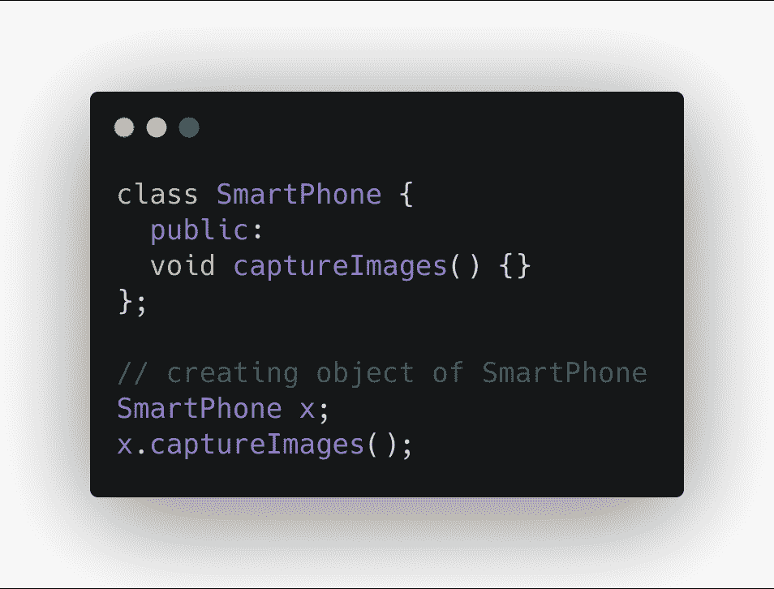
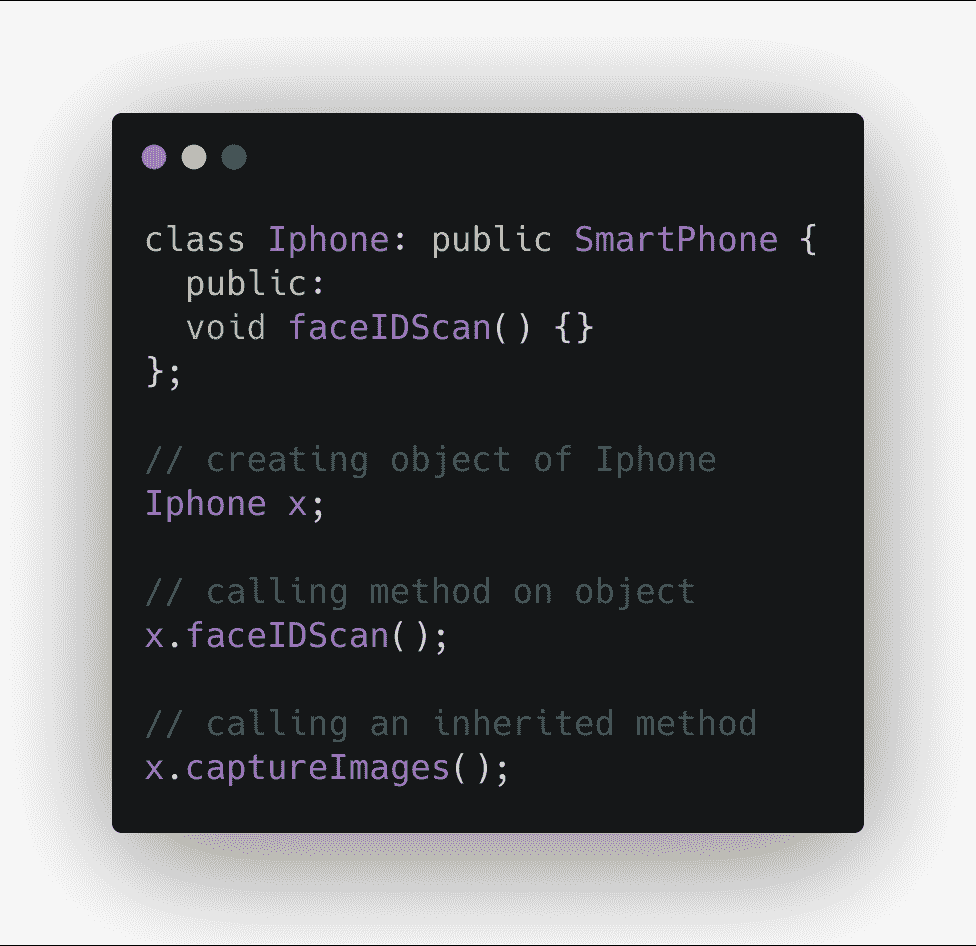
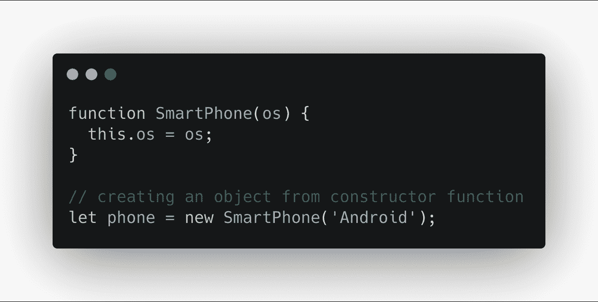
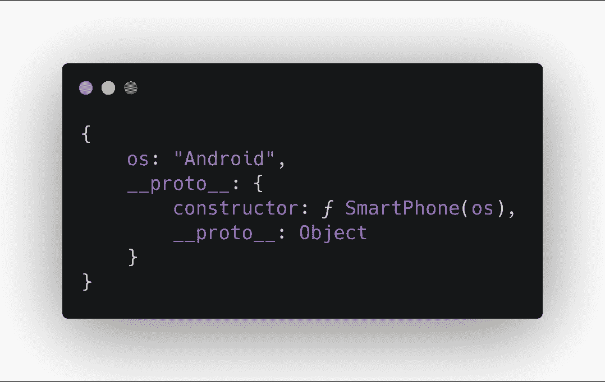
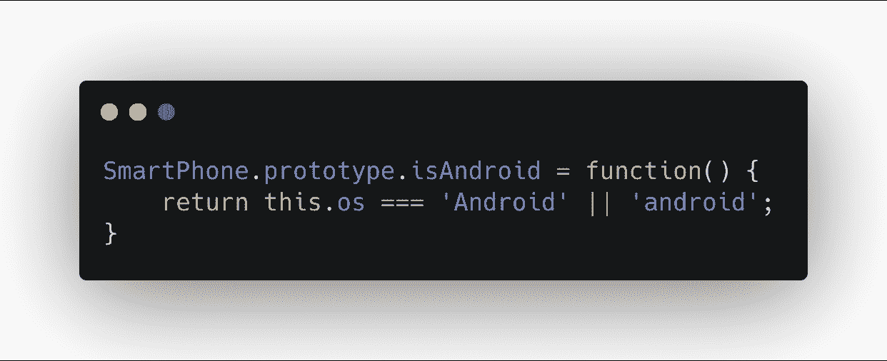
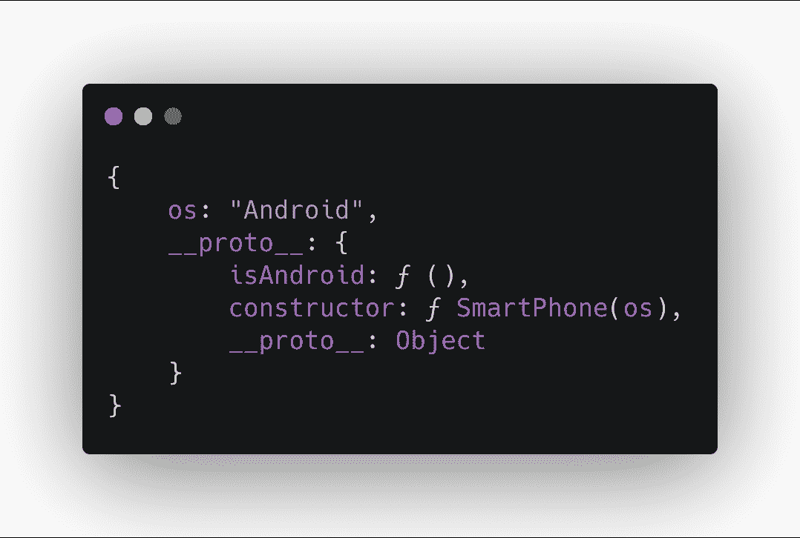
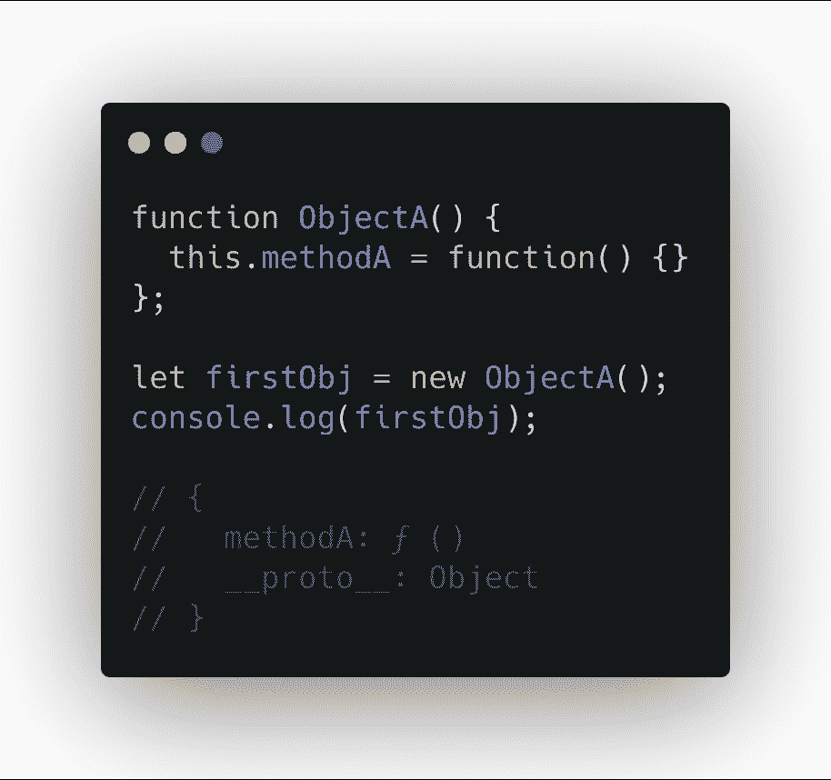
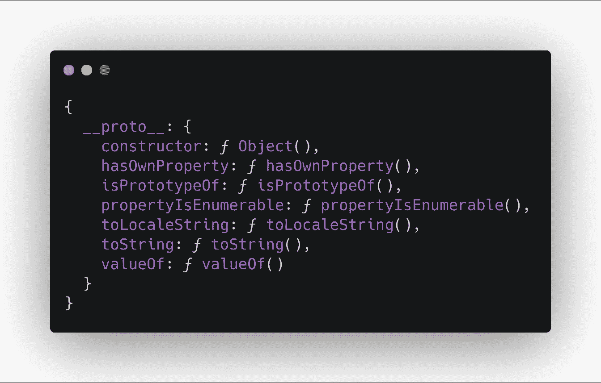
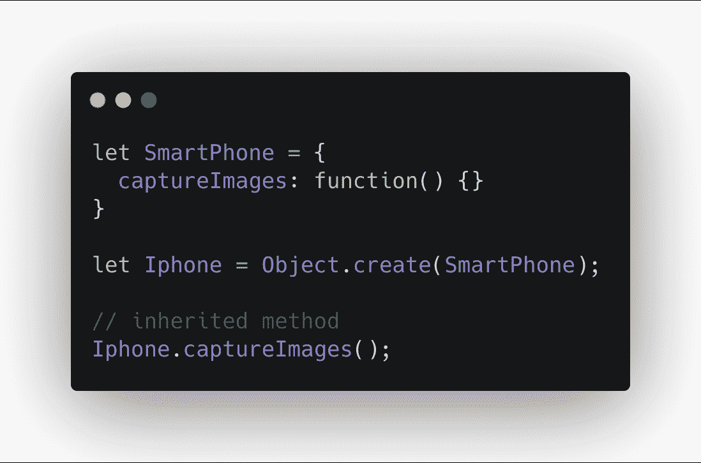

# JavaScript 原型的继承

> 原文：<https://blog.logrocket.com/inheritance-with-javascript-prototypes/>

**TL；在这篇文章中，我们将看看原型以及如何在 JavaScript 中使用它们进行继承。我们还将看到原型方法与基于类的继承有何不同。**

## 遗产

继承，编程语言的一个显著特征，随着面向对象编程语言的引入而出现。这些语言中的大多数是基于类的语言。在这里，类就像一个计划或蓝图，对象是它的表现形式。也就是说，为了创建一个对象，首先我们必须创建一个类。然后我们可以从一个类中创建任意数量的对象。

想象一下，我们有一个代表智能手机的类。像任何其他智能手机一样，这个类具有捕捉图像、GPS 等功能。下面是一个如何在 C++中创建这样一个类和对象的例子:


我们创建了一个名为`SmartPhone`的类，它有一个名为`capturePictures`的方法来捕捉图像。

让我们想象一下，我们需要一个 iPhone 类，它将捕捉图像以及一些特殊功能，如面部 ID 扫描。这里有两种可能的解决方案:

1.  将`captureImages`功能和其他常见的智能手机功能以及 iPhone 特有的功能重新编写成一个新的类。但是这种方法需要更多的时间和精力，并且会引入更多的错误。
2.  重用来自`SmartPhone`类的特征。这就是继承发挥作用的地方。这是重用其他类/对象的特性的一种方式。

下面是我们如何从 C++中的新的`Iphone`类中的`SmartPhone`类继承`capturePictures`方法:



以上是一个微不足道的继承例子。然而，它表明继承允许我们以一种结果程序不容易出错且开发时间更少的方式重用代码。

以下是一些关于类的重要知识:

1.  继承该特性的类称为子类
2.  从其继承特征的类被称为父类
3.  一个类可以同时继承多个类。例如，C 类继承自 A 类和 B 类
4.  我们可以有多层次的继承。例如，类 C 继承自类 B，而类 B 继承自类 A

*值得注意的是，阶级本身并不做任何事情。在你从一个类中创建一个对象之前，实际上没有做任何工作。我们将会看到为什么它不同于 JavaScript。*

## 什么是原型？

在 JavaScript 中，所有对象都有一个特殊的内部属性，基本上是对另一个对象的引用。该引用取决于对象的创建方式。在 [ECMAScript/JavaScript 规范](https://www.ecma-international.org/ecma-262/)中，表示为`[[Prototype]]`。

由于`[[Prototype]]`链接到一个对象，该对象有自己的`[[Prototype]]`引用。这就是链是如何建立的(它被称为[原型链](https://dev.to/codesmith_staff/explain-javascripts-prototype-chain-like-im-five-51p#:~:targetText=For%20those%20familiar%20(or%20not,chain%20is%20a%20linked%20list.&targetText=Each%20object%20has%20a%20private,with%20null%20as%20its%20prototype.))。

> 这个`[[Prototype]]`链是 JavaScript 中继承的构造块。

### `__proto__`对象

为了访问对象的`[[Prototype]]`，大多数浏览器都提供了一个`__proto__`属性。

我们可以这样访问它:

```
// obj is an actual object
obj.__proto__
```

值得注意的是，该属性不是 ECMAScript 标准的一部分。这是浏览器的实际实现。

### 获取和设置原型方法

除了`__proto__`属性之外，还有一种访问`[[Prototype]]`的标准方法。

下面是我们如何访问一个对象的`[[Prototype]]`:

```
Object.getPrototypeOf(obj);
```

设置对象的`[[Prototype]]`也有类似的方法。我们是这样做的:

```
Object.setPrototypeOf(obj, prototype);
```

### `[[Prototype]]`和`.prototype`属性

我们现在已经讨论了`[[Prototype]]`。它只不过是一个标准的符号，用来指定一个对象的原型。许多开发人员将其与[混淆。原型](https://javascript.info/function-prototype)属性，这是完全不同的东西。

让我们探索一下`.prototype`属性。

在 JavaScript 中，有很多种创建对象的方法。一种方法是使用构造函数，通过使用关键字`new`调用它，如下所示:



当您 console . log`phone`对象时，您将看到一个具有`__proto__`属性的对象，如下所示:



现在，如果我们想在 phone 对象上有一些方法，我们可以在函数上使用`.prototype`属性，如下所示:



当我们再次创建电话对象时，我们会在`console.log`中看到以下内容:



我们可以在对象的`[[Prototype]]`中看到`isAndroid()`方法。

简而言之，`.prototype`属性基本上类似于由给定的构造函数创建的`[[Prototype]]`对象的蓝图。你在`.prototype`属性/对象中声明的任何东西都会在对象的`[[Prototype]]`中弹出。

事实上，如果你比较一下手机的`SmartPhone.prototype`和`[[Prototype]]`，你会发现它们是一样的:

```
console.log(Object.getPrototypeOf(phone) === SmartPhone.prototype);
// true
```

值得注意的是，我们也可以在构造函数内部创建方法。相反，我们使用了函数的原型。这样做有一个很好的理由。

让我们看看下面的例子:



这种方法的问题是当我们启动一个新对象时。所有实例都有自己的`methodA`副本。相反，当我们在函数的原型上创建它时，对象的所有实例只共享方法的一个副本。哪个效率更高。

## 当我们访问一个属性时会发生什么？

当我们访问一个属性以获取它时，会发生以下情况:

1.  JavaScript 引擎查找对象的属性
    1.  如果找到了属性，就返回它
2.  否则，JavaScript 引擎通过查看`[[Prototype]]`来检查对象的继承属性
    1.  如果找到该属性，则返回它
    2.  否则，它会查看`[[Prototype]]`的`[[Prototype]]`。当财产被找到或者没有剩下`[[Prototype]]`时，这个链就结束了，这意味着我们已经到达了原型链的末端

当我们设置/创建一个属性时，JavaScript 总是在对象本身上设置它。即使相同的属性存在于`[[Prototype]]`链上。这里有一个例子:

```
function MyObject() {}
MyObject.prototype.propA = 10; // creating a property on the prototype

let myObject = new MyObject();
console.log(myObject.propA); // property on the [[Prototype]]
// 10

myObject.propA = 20; // property on the object
console.log(myObject.propA);
// 20
```

在上面的例子中，我们创建了一个构造函数，它的`[[Prototype]]`上有一个属性`propA`。当我们尝试访问它进行读取操作时，我们会在控制台中看到该值。但是当我们试图在对象本身上设置相同的属性时；JavaScript 用给定值在对象上创建一个新属性。现在，如果我们想直接访问`[[Prototype]]`上的属性，我们不能。这被称为财产的*遮蔽*。

同样值得注意的是，普通对象的`[[Prototype]]`链的末端是内置的`Object.prototype`。这就是为什么大多数对象像`toString()`一样共享许多方法的原因。因为它们实际上是在`Object.prototype`上定义的。

## **各种方式利用** 原型继承

在 JavaScript 中，只有原型继承。无论我们如何创建一个对象？但是，还是有细微的差别，我们应该看看。

### 对象文字

在 JavaScript 中创建对象最简单的方法是使用对象文字。我们是这样做的:

```
let obj = {};
```

如果我们在浏览器的控制台中记录 obj，我们将看到以下内容:



所以基本上，所有用文字符号创建的对象都从`Object.prototype`继承属性。

同样值得注意的是，`__proto__`对象引用了构造函数，它就是从这个函数创建的。在这种情况下，`constructor`属性指向`Object`构造函数。

### 使用对象构造函数

另一种不太常见的创建对象的方法是使用`Object`构造函数。JavaScript 提供了一个名为`Object`的内置构造函数方法来创建对象。

我们是这样使用它的:

```
let obj = new Object();
```

这种方法产生了与对象文字符号相同的对象。它从`Object.prototype`继承属性。因为我们使用`Object`作为构造函数。

### 对象.创建方法

使用这个助手方法，我们可以用另一个对象创建一个对象，因为它是这样的:



这是在 JavaScript 中使用继承的最简单的方法之一。

猜猜我们如何在没有任何`[[Prototype]]`引用的情况下创建一个`object`？

### 构造函数方法

类似于 JavaScript 运行时提供的对象构造函数。我们还可以创建自己的构造函数，以创建符合我们需求的对象，如下所示:

```
function SmartPhone(os) {
  this.os = os;
}

SmartPhone.prototype.isAndroid = function() {
  return this.os === 'Android';
};

SmartPhone.prototype.isIOS = function() {
  return this.os === 'iOS';
};
```

现在，我们想要创建一个 iPhone 类，它应该有`'iOS'`作为它的操作系统。它还应该有`faceIDScan`方法。

首先，我们必须创建一个`Iphone`构造函数，并在其中调用`SmartPhone`构造函数，就像这样:

```
function Iphone() {
   SmartPhone.call(this, 'iOS');
}
```

这将在`Iphone`构造函数中将`this.os`属性设置为`'iOS'`。

我们之所以调用`SmartPhone.call`方法是因为我们需要改变`this`的值来引用`Iphone`。这类似于在面向对象的世界中调用父类的构造函数。

接下来的事情是，我们必须从`SmartPhone`构造函数继承方法。我们可以在这里使用我们的`Object.create`朋友，如下所示:

```
Iphone.prototype = Object.create(SmartPhone.prototype);
```

现在我们可以使用`.prototype`为`Iphone`添加方法，如下所示:

```
Iphone.prototype.faceIDScan = function() {};
```

最后，我们可以如下使用`Iphone`创建一个对象:

```
let x = new Iphone();

// calling inherited method
console.log(x.isIOS()):
// true
```

## ES6 级

对于 ES6，这整个考验非常简单。我们可以创建类(它们不同于 C++或其他任何基于类的语言中的类，只是原型继承之上的语法糖)并从其他类派生新的类。

下面是我们如何在 ES6 中创建一个类:

```
class SmartPhone {
  constructor(os) {
    this.os = os;
  }
  isAndroid() {
    return this.os === 'Android';
  }
  isIos() {
    return this.os === 'iOS';
  }
};
```

现在我们可以创建一个从`SmartPhone`派生的新类，就像这样:

```
class Iphone extends SmartPhone {
   constructor() {
     super.call('iOS');
   }
   faceIDScan() {}
}
```

我们不叫`SmartPhone.call`，而是叫`super.call`。但是在内部，JavaScript 引擎会自动为我们完成这项工作。

最后，我们可以如下使用`Iphone`创建一个对象:

```
let x = new Iphone();

x.faceIDScan();

// calling inherited method
console.log(x.isIos()):
// true
```

这个 ES6 示例与前面的构造函数方法示例相同。但是看懂了就干净多了。

## 结论

让我们总结一下到目前为止我们学到的东西:

*   在基于类的语言中，我们不能运行类。为了完成任何事情，我们必须从它们中创建对象
*   JavaScript 中的继承不同于基于类的语言。因为没有真正的阶级概念。对象通过称为原型的引用继承
*   仅仅是指一个物体原型的一种奇特的方式。它们都是一样的东西
*   我们可以使用`__proto__`属性或`Object.getPrototypeOf`方法来访问对象的原型
*   我们发现函数的 prototype 属性充当了使用关键字`new`创建的对象的`[[Prototype]]`的蓝图
*   我们学习了当我们访问一个对象的属性时会发生什么，以及原型链在其中扮演什么角色
*   最后，我们还学习了用 JavaScript 创建对象的多种方法

我希望这篇博文有用。要了解更多关于 JavaScript 继承的知识，请看一下关于 [MDN](https://developer.mozilla.org/en/docs/Web/JavaScript/Inheritance_and_the_prototype_chain) 的文章。

## 通过理解上下文，更容易地调试 JavaScript 错误

调试代码总是一项单调乏味的任务。但是你越了解自己的错误，就越容易改正。

LogRocket 让你以新的独特的方式理解这些错误。我们的前端监控解决方案跟踪用户与您的 JavaScript 前端的互动，让您能够准确找出导致错误的用户行为。

[](https://lp.logrocket.com/blg/javascript-signup)

LogRocket 记录控制台日志、页面加载时间、堆栈跟踪、慢速网络请求/响应(带有标题+正文)、浏览器元数据和自定义日志。理解您的 JavaScript 代码的影响从来没有这么简单过！

[Try it for free](https://lp.logrocket.com/blg/javascript-signup)

.