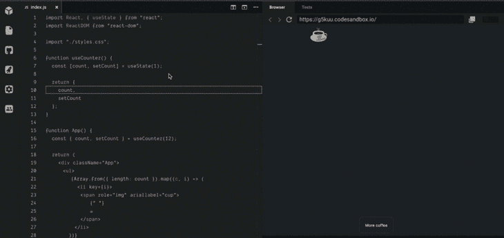
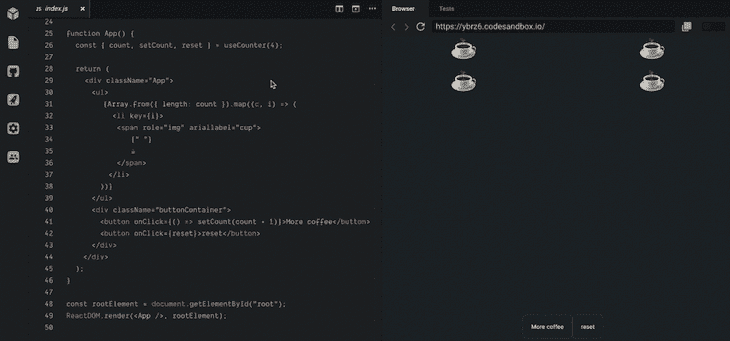

# 如何使用 React Hooks 初始化状态

> 原文：<https://blog.logrocket.com/initialize-state-react-hooks/>

***编者按**:本文最后一次更新是在 2023 年 2 月 13 日，以确保内容是最新的，并包括一个关于使用 React `key`属性重置状态的部分。更多关于 React 钩子的文章，请查看这个[备忘单](https://blog.logrocket.com/react-hooks-cheat-sheet-unlock-solutions-to-common-problems-af4caf699e70/)。*

随着钩子的出现，在组件之间共享逻辑的首选方式是通过可重用的定制钩子。要创建真正可重用的定制挂钩，您应该采用久经考验的高级 React 组件模式。其中一种模式叫做状态初始化模式。

在本文中，我们将回答什么是状态初始化器模式以及它是如何工作的问题。我们还将探索为什么它很重要，更重要的是，这个模式是如何用钩子实现的。

如果你对用钩子实现每一个高级的 React 模式感兴趣，你应该去看看我的书，“重新引入 React”我仔细而详细地讨论了这个问题。

请注意，文章的以下部分假设[在钩子](https://medium.com/free-code-camp/learn-the-basics-of-react-hooks-in-10-minutes-b2898287fe5d)上基本流畅。

*向前跳跃*:

## 初始化状态是什么意思？

一般来说，“初始化”的意思是设置某物的值。根据这个定义，在 React 应用程序的上下文中初始化状态意味着设置应用程序的初始状态。

## 理解状态初始化模式

状态初始化模式是一种 React 模式，它允许设置自定义钩子的初始状态，也允许将其重置为初始状态。

这种模式很重要，因为它使得定制钩子的消费者可以决定钩子的初始状态，并在他们需要的时候将状态重置为初始状态。此外，状态初始化器模式允许消费者在重置状态后执行任何副作用。

要用钩子实现状态初始化器模式，您需要满足三个要求:

*   第一个要求是允许可配置的初始状态。您可以通过将名为`initialState`的参数传递给自定义钩子中的`useState`钩子来实现这一点
*   第二个需求是向消费者公开一个重置函数处理程序。您可以通过从自定义钩子返回一个将状态重置为初始状态的`reset`函数来实现这一点
*   第三个要求是允许在复位后立即执行任何副作用。您可以通过将一个名为`onReset`的函数作为参数传递给自定义钩子来实现这一点。在状态被重置为初始状态后，将调用`onReset`函数

下面是一个带有钩子的状态初始化模式的示例实现:

```
function useCounter(initialCount = 0, onReset) {
  const [count, setCount] = useState(initialCount);

  const reset = useCallback(() => {
    setCount(initialCount);
    onReset && onReset();
  }, [initialCount, onReset]);

  return { count, setCount, reset };
}

```

在上面的例子中，`useCounter`钩子接受一个可选的`initialCount`参数，如果没有提供，默认为 0。它还采用了一个可选的`onReset`函数，该函数将在状态被重置后被调用。

`useCallback`钩子用于记忆`reset`函数，以防止不必要的重新渲染。`reset`函数将计数设置为`initialCount`，如果存在则调用`onReset`函数。

有了这个实现，`useCounter`钩子的消费者现在可以配置初始状态，重置状态，并在重置状态后执行任何副作用。

## 构建我们的演示应用

我将务实地讨论这个主题，所以这是我们将使用的[演示应用程序](https://codesandbox.io/s/stateinitializer-g5kuu)。

这有点做作，但是我保证这不会影响对带钩子的状态初始化模式的理解:


我们这里有一个美化了的计数器应用程序。你点击**更多咖啡**按钮，咖啡杯的数量增加。

主要的`App`组件利用一个定制的钩子来管理咖啡杯的数量。定制钩子`useCounter`的实现如下所示:

```
// the App uses this custom hook to track the count of coffee cups 

const useCounter = () => {
  const [count, setCount] = useState(1);

  return {
    count,
    setCount
  };
}

```

上面自定义钩子的一个更谨慎的实现是记忆自定义钩子返回的对象值:

```
// good 
return {
   count,
   setCount
};

// better 
return useCallback(() => {
  count, 
  setCount 
})

```

我们继续吧。

## 状态初始化模式的需求

为了确保您仍然在正确的轨道上，下面是状态初始化器模式满足的需求:

1.  允许可配置的初始状态
2.  向使用者公开重置函数处理程序
3.  允许在重置后立即执行任何副作用

### 1.可配置初始状态

模式的第一个需求恰好是最容易解决的。考虑定制挂钩的初始实现:

```
function useCounter () {
  const [count, setCount] = useState(1);

  return {
    count,
    setCount
  };
}

```

在第 2 行，钩子内的初始状态被设置为:

```
const [count, setCount] = useState(1)

```

不是硬编码初始状态，而是编辑钩子以期待一个名为`initialCount`的参数，并将该值传递给`useState`调用:

```
function useCounter (initialCount) {
  const [count, setCount] = useState(initialCount);

  return {
    count,
    setCount
  };
}

```

为了更具防御性，可以通过默认的参数语法设置一个回退。这将迎合那些没有通过这个`initialCount`论证的用户:

```
function useCounter (initialCount = 1) {
  const [count, setCount] = useState(initialCount);

  return {
    count,
    setCount
  };
}

```

现在自定义钩子应该像以前一样工作，但是在初始化状态时更加灵活。我将把初始咖啡杯数初始化为 10，如下所示:



这正是消费者使用实现的功能初始化状态的方式。让我们继续满足其他要求。

### 2.处理复位

为了处理重置，我们需要公开一个回调，消费者可以在任何时间点调用它。以下是方法。首先，创建一个在自定义挂钩中执行实际重置的函数:

```
function useCounter (initialCount = 1) {
  const [count, setCount] = useState(initialCount);
  // look here 👇
  const reset = useCallback(() => {
        setCount(initialCount)
  }, [initialCount])

  return {
    count,
    setCount
  };
}

```

我们通过利用`useCallback`钩子来优化复位回调。注意，在 reset 回调中有一个简单的状态更新器调用，`setCount`:

```
setCount(initialCount)

```

它负责将状态设置为用户传入的初始值，或者您通过默认参数语法提供的默认值。现在，在返回的对象值中公开这个重置回调，如下所示:

```
... 
return {
  count, 
  setCount, 
  reset 
}

```

现在，这个定制钩子的任何消费者都可以检索重置回调，并在他们想要的任何时候执行重置。下面是一个例子:



### 第 2 条(b)款。使用 React `key`属性重置状态

稍微偏离一下我们的演示应用程序，在 React 中重置状态的另一种方法是使用`key`属性。通过改变一个组件的`key`属性的值，React 将把它当作一个新的组件，并卸载旧的组件，有效地重置它的状态。

当您想要重置组件的状态而不实际更改其父组件的状态时，或者当您想要完全移除组件并将其重新添加到 DOM 中时，这种技术会很有用。

要使用这种技术，只需向想要重置的组件的`key`属性传递一个新值。例如:

```
function MyComponent() {
  const [count, setCount] = useState(0);

  function reset() {
    setCount(0);
  }

  return (
    <div>
      <p>Count: {count}</p>
      <button onClick={() => setCount(count + 1)}>Increment</button>
      <button onClick={reset}>Reset</button>
    </div>
  );
}

function App() {
  const [resetKey, setResetKey] = useState(0);

  function handleReset() {
    setResetKey(resetKey + 1);
  }

  return (
    <div>
      <MyComponent key={resetKey} />
      <button onClick={handleReset}>Reset MyComponent</button>
    </div>
  );
}

```

在这个例子中，我们通过递增`resetKey`状态变量，在每次想要重置`MyComponent`的`key`属性时传递一个新值。这导致 React 卸载旧的`MyComponent`实例，并创建一个具有新状态的新实例。

请注意，这种技术应该谨慎使用，因为如果使用不当，它可能会导致不必要的重新渲染和性能问题。通常建议使用状态初始化模式或 Redux 等其他技术来管理 React 应用程序中的复杂状态。

### 3.重置后触发副作用

最后，我们讨论状态初始化模式的最后一个需求。你知道如何做到这一点吗(例如，引发副作用)？这有点棘手，但很容易处理。

首先，考虑如何在典型的功能组件中触发副作用:

```
useEffect(() => {
 // perform side effect here
}, [dependency])

```

我们可以有把握地假设这个组件的消费者会做类似的事情。为了实现这一点，需要从定制钩子中公开什么呢？

好吧，看看传递给`useEffect`数组依赖项的值。您需要公开一个依赖项——一个只有在内部触发重置时才会改变的依赖项，例如，在使用者调用重置回调后。

* * *

### 更多来自 LogRocket 的精彩文章:

* * *

有两种不同的方法来解决这个问题。我冒昧地在“[重新引入 React](https://leanpub.com/reintroducing-react) ”中解释了这两者。

以下是我认为的首选解决方案:

```
function useCounter(initialCount = 1) {
  const [count, setCount] = useState(initialCount);
  // 1\. look here 👇
  const resetRef = useRef(0);

  const reset = useCallback(() => {
    setCount(initialCount);
    // 2\. 👇 update reset count
    ++resetRef.current;
  }, [initialCount]);

  return {
    count,
    setCount,
    reset,
    resetDep: resetRef.current // 3\. 👈 expose this dependency
  };
}

```

如果您查看上面的代码，您会发现三行注释。

首先，创建一个`ref`来保存已经触发的复位次数。这是通过`useRef`挂钩完成的:

```
...
// 1\. look here 👇
const resetRef = useRef(0);
...

```

每当用户调用复位回调时，都需要更新复位参考计数:

```
...
const reset = useCallback(() => {
    setCount(initialCount);

    // 2\. 👇 update reset count
    ++resetRef.current;

  }, [initialCount]);
...

```

最后，将这个重置计数公开为`resetDep`，重置依赖关系:

```
...
return {
    count,
    setCount,
    reset,
    resetDep: resetRef.current // 3\. 👈 expose this dependency
  };
...

```

然后，用户可以检索该重置相关性`resetDep`，并且仅在该值改变时执行副作用。

这就引出了一个问题，消费者将如何使用这个暴露的`resetDep`？我将进一步解释定制钩子的消费者如何使用这种重置依赖。

快速问答:你认为下面的解决方案可行吗？

```
// consumer's app 
const { resetDep } = useCounter() 

useEffect(() => {
  // side effect after reset
}, [resetDep])

```

不幸的是，这不会像预期的那样起作用。那么，上面的解决方案有什么问题呢？

这里的问题是`useEffect`总是在组件第一次挂载的时候被第一个触发！因此，复位副作用将在挂载时触发，随后，每当`resetDep`改变时触发。

这不是我们寻求的行为；我们不希望在挂载时触发重置副作用。为了解决这个问题，用户可以检查组件何时安装，然后才触发效果函数。

这里有一个解决方案:

```
// consumer's app 
const {resetDep} = useCounter() 

// boolean ref. default to true
const componentJustMounted = useRef(true) 

useEffect(() => {
    if(!componentJustMounted) {
       // perform side effect 
       //only when the component isn't just mounted 
     }
  // if not set boolean ref to false. 
  componentJustMounted.current = false; 
}, [resetDep])

```

然而，如果您已经创建了一个流行的可重用钩子，或者只是想为钩子的消费者公开一个更简单的 API，那么您可以将上面的所有功能包装并公开在另一个定制钩子中，供消费者使用——类似于`useEffectAfterMount`。

无论如何，重置依赖项的实现仍然有效。不需要在内部进行任何更改。

## 奖励:`useState`懒惰初始化

惰性初始化是一种可以用来提高应用程序性能的技术。它包括延迟一个值的初始化，直到真正需要它的时候。

在 React 和`useState`钩子的上下文中，惰性初始化可以与状态初始化器模式一起使用，以优化组件的呈现。

状态初始化模式包括将一个函数作为初始状态值传递给`useState`钩子。这个函数在组件挂载的时候只会被调用一次，它的返回值将作为初始状态。通过使用函数，可以动态计算初始状态值，这在某些情况下很有用。

使用惰性初始化，您可以延迟这个函数的执行，直到真正需要它的时候。例如，如果只有在一些用户交互之后才需要初始状态值，您可以延迟计算，直到交互发生。这可以减少组件初始呈现期间需要完成的工作量，从而提高应用程序的感知性能。

下面是一个使用状态初始化模式的延迟初始化的例子:

```
function MyComponent() {
  const [count, setCount] = useState(() => {
    // This function will be called only once, when the component is mounted
    // The expensive computation is delayed until it is actually needed
    return computeInitialCount();
  });

  function handleClick() {
    setCount(count + 1);
  }

  return (
    <div>
      <p>Count: {count}</p>
      <button onClick={handleClick}>Increment</button>
    </div>
  );
}

```

在这个例子中，计算初始计数值的昂贵计算被延迟，直到实际需要它。这可以提高组件的感知性能，尤其是在计算复杂或涉及从外部数据源获取数据的情况下。

然而，明智地使用惰性初始化很重要，因为如果使用不当，它也会导致意外的行为。一定要考虑惰性初始化和急切初始化之间的权衡，并选择最适合您的特定用例的方法。

## 结论

设计模式的存在是为了给常见问题提供一致的解决方案。高级的 React 设计模式也可以为构建真正可重用的组件提供一致的解决方案。

想了解更多关于构建真正可重用钩子的知识吗？看看我的书，《重新引入反应》

回头见！

## [LogRocket](https://lp.logrocket.com/blg/react-signup-general) :全面了解您的生产 React 应用

调试 React 应用程序可能很困难，尤其是当用户遇到难以重现的问题时。如果您对监视和跟踪 Redux 状态、自动显示 JavaScript 错误以及跟踪缓慢的网络请求和组件加载时间感兴趣，

[try LogRocket](https://lp.logrocket.com/blg/react-signup-general)

.

[ ](https://lp.logrocket.com/blg/react-signup-general) [](https://lp.logrocket.com/blg/react-signup-general) 

LogRocket 结合了会话回放、产品分析和错误跟踪，使软件团队能够创建理想的 web 和移动产品体验。这对你来说意味着什么？

LogRocket 不是猜测错误发生的原因，也不是要求用户提供截图和日志转储，而是让您回放问题，就像它们发生在您自己的浏览器中一样，以快速了解哪里出错了。

不再有嘈杂的警报。智能错误跟踪允许您对问题进行分类，然后从中学习。获得有影响的用户问题的通知，而不是误报。警报越少，有用的信号越多。

LogRocket Redux 中间件包为您的用户会话增加了一层额外的可见性。LogRocket 记录 Redux 存储中的所有操作和状态。

现代化您调试 React 应用的方式— [开始免费监控](https://lp.logrocket.com/blg/react-signup-general)。