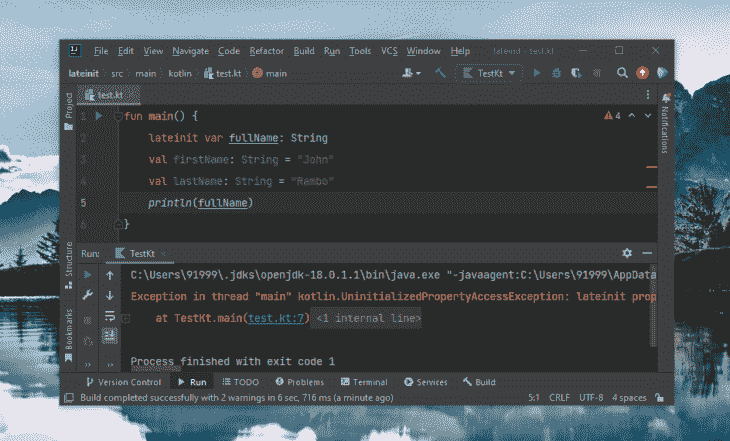

# 在 Kotlin 中初始化 lazy 和 lateinit 变量

> 原文：<https://blog.logrocket.com/initializing-lazy-lateinit-variables-kotlin/>

Kotlin 通常要求我们一定义属性就初始化它们。当我们不知道理想的初始值时，这样做似乎很奇怪，尤其是在生命周期驱动的 Android 属性的情况下。

幸运的是，有一种方法可以解决这个问题。IntelliJ IDEA 编辑器将警告您，如果您声明了一个类属性而没有初始化它，并建议添加一个`lateinit`关键字。

如果一个初始化的属性或对象在程序中实际上没有被使用呢？这些未使用的初始化将成为程序的负担，因为对象创建是一个繁重的过程。这是`lateinit`可以帮助我们的另一个例子。

本文将解释`lateinit`修饰符和惰性委托如何处理未使用或不必要的早期初始化。这将使你的 Kotlin 开发工作流程更加高效。

## `lateinit`在科特林

`lateinit`关键字代表“后期初始化”当与类属性一起使用时，`lateinit`修饰符阻止属性在它的类对象构造时被初始化。

只有当变量在程序中被初始化时，内存才会被分配给`lateinit`变量，而不是当它们被声明时。这在初始化的灵活性方面非常方便。

让我们看看`lateinit`必须提供的一些重要特性！

### 关键特征

首先，在声明时，内存没有分配给一个`lateinit`属性。当你觉得合适的时候，初始化就会发生。

一个`lateinit`属性可能在整个程序中改变不止一次，并且应该是可变的。这就是为什么你应该总是将它声明为`var`，而不是`val`或`const`。

在将属性初始化为可空类型时，`lateinit`初始化可以避免重复的空检查。属性的这个特性不支持可空类型。

扩展我的最后一点，`lateinit`可以很好地用于非原始数据类型。它不适用于像`long`或`int`这样的原始类型。这是因为无论何时访问一个`lateinit`属性，Kotlin 都会在幕后向它提供一个空值，表示该属性尚未初始化。

基元类型不能是`null`，所以没有办法指示未初始化的属性。因此，当与关键字`lateinit`一起使用时，基本类型会抛出异常。

最后，`lateinit`属性必须在被访问之前的某个时候初始化，否则它将抛出一个`UninitializedPropertyAccessException`错误，如下所示:



初始化前访问的一个`lateinit`属性导致了这个异常。

Kotlin 允许你检查一个`lateinit`属性是否被初始化。这对于处理我们刚刚讨论的取消初始化异常非常方便。

```
lateinit var myLateInitVar: String
...

if(::myLateInitVar.isInitialized) {
  // Do something
}

```

### 正在使用的`lateinit`修饰符的例子

让我们通过一个简单的例子来看看`lateinit`修饰符的作用。下面的代码定义了一个类，并用伪值和空值初始化它的一些属性。

```
class TwoRandomFruits {
  var fruit1: String = "tomato" 
  var fruit2: String? = null

  fun randomizeMyFruits() {
      fruit1 = randomFruits()
      fruit2 = possiblyNullRandomFruits()
  }

  fun randomFruits(): String { ... }
  fun possiblyNullRandomFruits(): String? { ... }
}

fun main() {
    val rf= RandomFruits()
    rf.randomizeMyFruits()

    println(rf.fruit1.capitalize())
    println(rf.fruit2?.capitalize()) // Null-check
}

```

这不是初始化变量的最佳方式，但是在这种情况下，它仍然可以完成工作。

正如您在上面看到的，如果您选择使属性为 null，那么无论何时修改或使用它，您都必须对它进行 null 检查。这可能相当乏味和烦人。

让我们用`lateinit`修饰符来解决这个问题:

```
class TwoRandomFruits {
  lateinit var fruit1: String // No initial dummy value needed
  lateinit var fruit2: String // Nullable type isn't supported here

  fun randomizeMyFruits() {
      fruit1 = randomFruits()
      fruit2 = when {
          possiblyNullRandomFruits() == null -> "Tomato" // Handling null values
          else -> possiblyNullRandomFruits()!!
      }
  }

  fun randomFruits(): String { ... }
  fun possiblyNullRandomFruits(): String? { ... }
}

fun main() {
    val rf= RandomFruits()
    rf.randomizeMyFruits()

    println(rf.fruit1.capitalize())
    println(rf.fruit2.capitalize())
}

```

[你可以在这里看到这段代码的运行](https://pl.kotl.in/XIGEulpEt)。

`lateinit`实现本身就说明了问题，并展示了一种处理变量的简洁方法！除了`lateinit`的默认行为之外，这里主要的要点是我们可以多么容易地避免使用可空类型。

### 生命周期驱动的属性和`lateinit`

[数据绑定是稍后使用`lateinit`](https://blog.logrocket.com/data-binding-android-tutorial-with-examples/) 初始化活动的另一个例子。开发人员通常希望更早地初始化绑定变量，以便在访问不同视图的其他方法中将其用作参考。

在下面的`MainActivity`类中，我们用`lateinit`修饰符声明绑定来实现同样的事情。

```
package com.test.lateinit

import androidx.appcompat.app.AppCompatActivity
import ...

class MainActivity : AppCompatActivity() {
  lateinit var binding: ActivityMainBinding

  override fun onCreate(savedInstanceState: Bundle?) {
    super.onCreate(savedInstanceState)
    binding = DataBindingUtil.setContentView(this, R.layout.activity_main)

    ...
  }
  ...
}

```

只有当活动生命周期函数`onCreate()`被触发时，`MainActivity`的绑定才能被初始化。因此，在这里用`lateinit`修饰符声明绑定是完全有意义的。

### 何时使用`lateinit`

对于常规变量初始化，您必须添加一个伪值，很可能是一个空值。这将增加大量的空检查，每当他们被访问。

```
// Traditional initialization
var name: String? = null
...    
name = getDataFromSomeAPI()
...
// A null-check will be required whenever `name` is accessed.
name?.let { it-> 
  println(it.uppercase())
}

// Lateinit initialization
lateinit var name: String
...
name = getDatafromSomeAPI()
...
println(name.uppercase())

```

我们可以使用`lateinit`修饰符来避免这些重复的空检查，特别是当一个属性可能会频繁波动时。

### 使用`lateinit`时需要记住的事项

最好记住在访问一个`lateinit`属性之前总是要初始化它，否则，你会在编译时看到一个巨大的异常抛出。

确保通过使用`var`声明来保持属性的可变性。使用`val`和`const`没有任何意义，因为它们表示不可变的属性，使用这些属性`lateinit`将不起作用。

最后，当给定属性的数据类型是原始的或者空值的可能性很高时，避免使用`lateinit`。它不适合这些情况，并且不支持原始类型或可空类型。

## 科特林的懒惰代表团

顾名思义，Kotlin 中的`lazy`以一种懒惰的方式初始化一个属性。本质上，它创建一个引用，但只在第一次使用或调用该属性时进行初始化。

现在，你可能会问这和常规初始化有什么不同。嗯，在构造一个类对象的时候，它所有的公共和私有属性都在它的构造函数中初始化。初始化类中的变量会带来一些开销；变量越多，开销就越大。

我们用一个例子来理解一下:

```
class X {
  fun doThis() {}
}

class Y {
  val shouldIdoThis: Boolean = SomeAPI.guide()
  val x = X()

  if(shouldIdoThis) {
    x.doThis()
  }
  ...
}

```

尽管没有使用它，上面代码中的类`Y`仍然有一个由类`X`创建的对象。如果是一个重造的职业，`X`也会减慢`Y`的速度。

不必要的对象创建是低效的，并且可能降低当前类的速度。根据程序流程，在某些情况下可能不需要某些属性或对象。

也可能是属性或对象依赖于其他属性或对象来创建。惰性委托有效地处理了这两种可能性。

### 关键特征

具有惰性初始化的变量在被调用或使用之前不会被初始化。这样，变量只被初始化一次，然后它的值被缓存以供程序中进一步使用。

因为用惰性委托初始化的属性应该始终使用相同的值，所以它本质上是不可变的，通常用于只读属性。你必须用`val`声明来标记它。

它是线程安全的，即只计算一次，默认情况下由所有线程共享。一旦初始化，它会在整个程序中记住或缓存初始化的值。

与`lateinit`相反，惰性委托支持一个[自定义设置器和获取器](https://kotlinlang.org/api/latest/jvm/stdlib/kotlin/lazy.html)，允许它在读写值的同时执行中间操作。

### 正在使用的惰性委托示例

下面的代码实现了简单的数学运算来计算某些形状的面积。在圆形的情况下，计算需要一个常量值用于`pi`。

```
class Area {
  val pi: Float = 3.14f

  fun circle(radius: Int): Float = pi * radius * radius
  fun rectangle(length: Int, breadth: Int = length): Int = length * breadth
  fun triangle(base: Int, height: Int): Float = base * height * .5f
}

fun main() {
  val area = Area()
  val squareSideLength = 51

  println("Area of our rectangle is ${area.rectangle(squareSideLength)}")
}

```

正如你在上面看到的，没有完成任何圆的面积的计算，使得我们对`pi`的定义没有用。属性`pi`仍然被初始化和分配内存。

让我们用懒惰的代表团来纠正这个问题:

```
class Area {
  val pi: Float by lazy {
    3.14f
  } 

  fun circle(...) = ...
  fun rectangle(...) = ...
  fun triangle(...) = ...
}

fun main() {
  val area = Area()
  val squareSideLength = 51
  val circleRadius = 37

  println("Area of our rectangle is ${area.rectangle(squareSideLength)}")
  println("Area of our circle is ${area.circle(circleRadius)}")
}

```

[你可以在这里看到上面例子的演示](https://pl.kotl.in/ykzZ25Tdz)。

上面的惰性委托实现只在访问`pi`时才使用它。一旦被访问，它的值将被缓存并保留以供整个程序使用。在接下来的例子中，我们将看到它在对象中的实际应用。

下面是如何在通过惰性委托写值时添加一些中间动作。下面的代码`lazy`初始化 Android 活动中的一个`TextView`。

每当这个`TextView`在`MainActivity`中第一次被调用时，就会记录一个带有`LazyInit`标签的调试消息，如下面的委托的 lambda 函数所示:

```
...
class MainActivity : AppCompatActivity() {
  override fun onCreate(...) {
    ...  
    val sampleTextView: TextView by lazy {
      Log.d("LazyInit", "sampleTextView")
      findViewById(R.id.sampleTextView)
    }
  }
  ...
}

```

### Android 应用中的懒惰授权

现在让我们继续讨论 Android 应用程序中懒惰委托的应用。最简单的用例可以是我们之前有条件地使用和操作视图的 Android 活动的例子。

```
package com.test.lazy

import androidx.appcompat.app.AppCompatActivity
import ...

class MainActivity : AppCompatActivity() {
  lateinit var binding: ActivityMainBinding

  override fun onCreate(savedInstanceState: Bundle?) {
    super.onCreate(savedInstanceState)
    binding = DataBindingUtil.setContentView(this, R.layout.activity_main)

    val sharedPrefs by lazy {
      activity?
        .getPreferences(Context.MODE_PRIVATE)
    } 

    val startButton by lazy {
      binding.startButton
    }

    if(sharedPrefs.getBoolean("firstUse", true)) {
      startButton.isVisible = true
      startButton.setOnClickListener {
        // Finish onboarding, move to main screen; something like that
        sharedPrefs.setBoolean("firstUse", false)
      }
    }

  }
}

```

上面，我们用惰性委托初始化了`SharedPreferences`和一个`Button`。该逻辑需要根据从共享首选项中获取的布尔值实现一个 onboarding 屏幕。

### `by lazy`和`= lazy`的区别

`by lazy`语句将惰性委托的增强功能直接添加到给定的属性中。它的初始化只在第一次访问时发生一次。

```
val prop by lazy {
  ...
}

```

另一方面，`= lazy`语句保存了一个对委托对象的引用，通过它你可以使用`isInitialized()`委托方法或者用`value`属性访问它。

```
val prop = lazy {
  ...
}
...

if(prop.isInitialized()) {
  println(prop.value)
}

```

你可以在这里看到上面代码的快速演示。

### 何时使用`lazy`

考虑使用惰性委托来减轻涉及其他类对象的多重和/或条件创建的类的负担。如果对象的创建依赖于类的一个内部属性，那么惰性委托是一个不错的选择。

```
class Employee {
    ...
    fun showDetails(id: Int): List<Any> {
        val employeeRecords by lazy {
            EmployeeRecords(id) // Object's dependency on an internal property
        }
    }
    ...
}

```

### 使用`lazy`时需要记住的事项

惰性初始化是一种委托，它只初始化一次，并且只在被调用时初始化。这意味着避免不必要的对象创建。

委托对象缓存第一次访问时返回的值。当需要时，这个缓存的值将在程序中进一步使用。

在读取和写入值时，您可以利用它的自定义 getter 和 setter 进行中间操作。我也更喜欢将它用于不可变类型，因为我觉得它最适合在整个程序中保持不变的值。

## 结论

在本文中，我们讨论了 Kotlin 的`lateinit`修饰符和惰性委托。我们展示了一些演示其用途的基本示例，还讨论了 Android 开发中的一些实际用例。

感谢您花时间从头到尾阅读这篇文章！我希望你能够在你的应用开发之旅中使用这个指南来实现这两个特性。

## LogRocket :即时重现你的安卓应用中的问题。

[](https://lp.logrocket.com/blg/kotlin-signup)

[LogRocket](https://lp.logrocket.com/blg/kotlin-signup) 是一款 Android 监控解决方案，可以帮助您即时重现问题，确定 bug 的优先级，并了解您的 Android 应用程序的性能。

LogRocket 还可以向你展示用户是如何与你的应用程序互动的，从而帮助你提高转化率和产品使用率。LogRocket 的产品分析功能揭示了用户不完成特定流程或不采用新功能的原因。

开始主动监控您的 Android 应用程序— [免费试用 LogRocket】。](hhttps://lp.logrocket.com/blg/kotlin-signup)