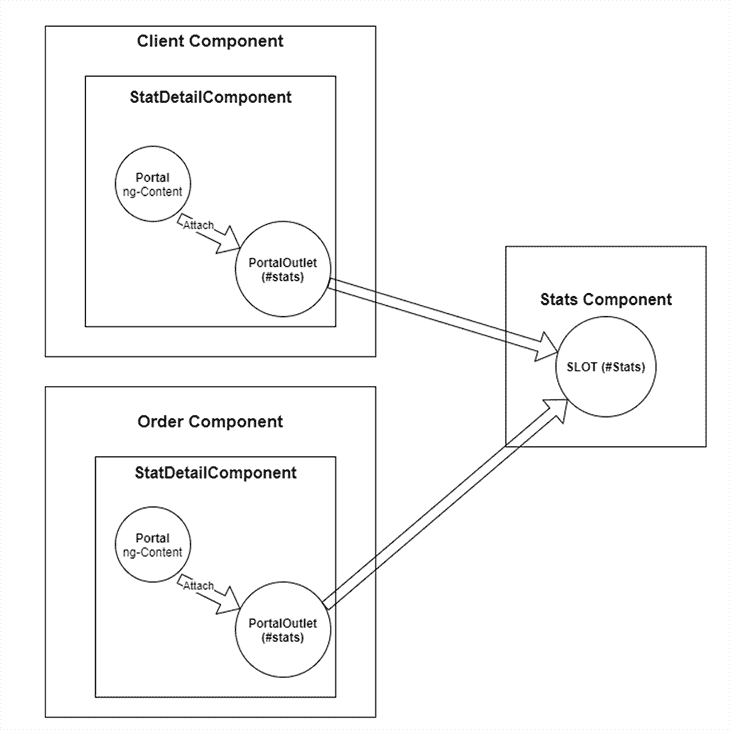

# 用门户在 Angular 组件中注入动态内容

> 原文：<https://blog.logrocket.com/inject-dynamic-content-angular-components-with-portals/>

作为一名 Angular 开发人员，我们日常工作的很大一部分是将组件放在一起构建我们的应用程序。有时，我们需要将一个组件或 UI 模板动态地注入到另一个组件中。

在 Angular 中，有几种方法可以在 CDK 门户发布之前将动态组件呈现到主机组件中。这些是:

这两种方法都有一个缺点:宿主组件需要直接引用注入的组件。主机和注入组件之间的耦合使得测试和维护变得困难。

Portal 提供了一种灵活、简洁的替代方法来将内容注入到角度组件中。

让我们一步一步地看一个使用门户的例子。

## 定义问题

假设我们正在增强一个角度应用程序中的仪表板屏幕。该屏幕包含

*   父组件(`dashboard`):这是仪表板屏幕的容器
*   下拉选择器:选择的改变将改变仪表板的上下文
*   路由器出口:用于从子路由器装载组件
*   两个子组件(`stats`和`action`组件):显示与仪表板当前上下文相关的信息

当用户从选择器中选择一个选项时，应用程序将导航到不同的子路由。因此，相应的组件将被加载到路由器出口。然后，这两个子组件将用不同的内容进行更新。

在选择改变时，所选择的服务类型数据被推送到`DashboardService`中可观察的`serviceType$`中。在`action`分量中，我们订阅了`serviceType$`可观测值。

```
// TypeScript
// dashboard.component.ts
// when user change a selection, new serviceType are broadcasted
this.service.searchType$.next(serviceType);

// dashboard.service.ts
export class DashboardService {
  searchType$ = new BehaviorSubject('');
  constructor() { }
}
// action.component.ts
export class ActionComponent {
  serviceType$ = this.service.searchType$;
  constructor(private service: DashboardService) {}
}

```

我们用`ngSwitch`对可观察到的`serviceType$`做出反应。在下面的例子中，当可观察值改变时，`action`组件内容被更新。

```
 // actions.Component
          <div class="panel-body" *ngIf="serviceType$ | async as serviceType">
          <div [ngSwitch]="serviceType">
            <div *ngSwitchCase="'client'">
              <button (click)="registerNewClient()" class="btn btn-primary">
                Register New Client
              </button>
            </div>
            <div *ngSwitchCase="'order'">
              <button (click)="registerNewOrder()" class="btn btn-danger">
                Search order
              </button>
            </div>
            <div *ngSwitchDefault>default action</div>
          </div>
        </div>

```

仪表板可以工作，但是代码有几个问题:

### 这两个子组件是智能组件

这些子组件被设计用来呈现数据，所以它们应该是哑的，或者是表示性的组件。相反，当前的设计让他们知道外部数据实体

### 子组件也包含副作用

这意味着它们注册事件处理，这使得它们很难被重用。要添加一个新的服务类型，我们需要将`ngSwitchCase`添加到我们所有的子组件中，随着更多服务类型或子组件的添加，仪表板将变得更加复杂和难以维护。我们想要的是将 UI 内容注入到子组件中，而子组件不知道这些内容来自哪里。

## 门户如何提供帮助？

门户作为 [Angular Material CDK](https://material.angular.io/cdk/categories) 的一部分，由 Angular Material 团队内部开发。它的名字最近被缩短为[角 CDK](https://github.com/angular/components/tree/master/src/cdk) 。[官方文档](https://github.com/angular/components/blob/master/src/cdk/portal/portal.md)中对门户的定义是:门户是一个 UI，可以动态呈现到页面上的一个空位上。有两个关键部分:

*   `Portal`:要渲染的 UI 元素(组件或模板)。它可以是一个组件，一个`templateRef`或者一个 DOM 元素。
*   `PortalOutlet`:内容将被呈现的槽。在之前的版本中，它被称为`PortalHost`。

让我们利用门户来解决上述问题。

## 安装

要开始使用 Angular CDK 门户，需要安装以下软件包。

```
npm install @angular/cdk

```

然后在`app.module.ts`文件中，我们需要导入 CDK 模块。

```
// TypeScript
import {PortalModule} from '@angular/cdk/portal';

```

## 门户的类型

我们有几个选择来创建门户。

*   `ComponentPortal`:从组件类型创建门户。

    ```
    // TypeScript this.portal = new ComponentPortal(StatsComponent);
    ```

*   `TemplatePortal`:从`&lt;ng-template>`

    ```
    // Html <ng-template #templatePortal>   <ng-content></ng-content> </ng-template> 
    ```

    创建门户
*   `DomPortal`:从本地 DOM 元素创建门户。这允许我们获取任何 DOM 元素并将其注入主机

    ```
    // Html <div #domPortal>Total clients</div>
    ```

使用`DomPortal`，内容中的角度绑定将无效，因为它被视为原生 DOM 元素。

棱角分明的 CDK 还提供了一个 [`cdkPortal directive`](https://material.angular.io/cdk/portal/api#CdkPortal) ，是`TemplatePortal`的一个版本。与`TemplatePortal`相比，`cdkPortal`指令节省了一些样板代码，因为我们不需要手动实例化门户。

## 创建门户

在这个例子中，我们使用了`cdkPortal`指令，因为它更简单，更具声明性。

如下面的代码所示，我们将`ng-content`包装在`ActionButtonComponent`模板的`ng-template`中。然后，我们将`portal`指令添加到`ng-template`中。

对于`cdkPortal`指令，有两个等价的选择器:`portal`或`cdk-portal`。使用`ng-content`以便我们可以从其他组件中投射内容。

```
// Html   
// ActionButtonComponent
 <ng-template cdk-portal>
    <ng-content></ng-content>
 </ng-template>

```

请注意，带有`cdkPortal`指令的元素在附加到`CdkPortalOutlet`之前不会显示。这适用于所有元素，包括`div`。

在`ActionButtonComponent`类中，我们可以使用`@ViewChild`和`CdkPortal`指令来引用模板。

* * *

### 更多来自 LogRocket 的精彩文章:

* * *

```
// TypeScript
// ActionButtonComponent
  @ViewChild(CdkPortal)
  private portal: CdkPortal;
```

## 创建`PortalOutlet`

在`ActionComponent`中，我们创建了一个 ID 设置为`action`的占位符。

```
// Html
// ActionComponent
 <div id="action"></div>
```

现在我们可以创建`DomPortalOutlet`。我们使用`document.querySelector`来获取上面定义的 DOM 元素占位符。其余的参数通过组件构造函数注入。

请注意，`DomPortalOutlet`以前叫做`DomPortalHost`。从 Angular 9 开始，它被重新命名为`DomPortalOutlet`。

```
// Html
// ActionButtonComponent

  private host: DomPortalOutlet;

  constructor(
    private cfr: ComponentFactoryResolver,
    private appRef: ApplicationRef,
    private injector: Injector
  ) {}

  ngAfterViewInit(): void {
    this.host = new DomPortalOutlet(
      document.querySelector('#action),
      this.cfr,
      this.appRef,
      this.injector
    );
```

`DomPortalOutlet`的创建发生在`ngAfterViewInit` [生命周期事件](https://blog.logrocket.com/angular-lifecycle-hooks/)内。这是必要的，因为`ngAfterViewInit`发生在视图渲染之后。

## 把它们放在一起

在定义了`portal`和`DomPortalOutlet`之后，我们可以将门户附加到`portalOutlet`上。这将把门户注入到由`portalOutlet`引用的占位符中。

```
// TypeScript
// ActionButtonComponent
export class ActionButtonComponent implements AfterViewInit, OnDestroy{

  @ViewChild(CdkPortal)
  private portal: CdkPortal;
  private host: DomPortalOutlet;

  constructor(
    private cfr: ComponentFactoryResolver,
    private appRef: ApplicationRef,
    private injector: Injector
  ) {}

  ngAfterViewInit(): void {
    this.host = new DomPortalOutlet(
      document.querySelector('#action),
      this.cfr,
      this.appRef,
      this.injector
    );
    this.host.attach(this.portal);
  }
}
```

在这种情况下，客户端和订单组件都可以将内容投射到`ActionButtonComponent`中。这些内容显示在`ActionComponent`的`portalOutlet`中。

```
// Html
// client.component.html
<app-action-button>
  <button (click)="registerClient()" class="btn btn-primary">Register New Client</button>
</app-action-button>
```

下面是门户和`portalOutlet`如何协同工作的概述。



## `detach`方法与`dispose`方法

我们使用`detach`方法从`portalOutlet`中移除先前附加的门户。这是为了在移除父组件时进行清理。

另一种方法是使用`dispose`方法。当调用 dispose 时，我们从 DOM 中永久删除了`portalOutlet`。

```
// TypeScript
// ActionButtonComponent
ngOnDestroy(): void {
this.host.detach();
}

```

在我们的例子中，我们使用了`detach`方法，因为我们的目的是分离门户，而不是从 DOM 中移除`portalOutlet`。

## 传递上下文而不是内容

在前面的例子中，我们不需要传递数据，因为`ng-content`用于投影内容。但是对于其他用例，您可能需要将上下文数据传递到门户中。

为了在`templatePortal`中传递上下文数据，我们可以使用`context`属性。

```
// TypeScript
this.portal.context = {}; // Your context data
```

对于`ComponentPortal`，我们可以使用下面代码所示的令牌注入。

```
// TypeScript
// create a custom token
export const CONTEXT_TOKEN = new InjectionToken({...});

// when creating the componentPortal, provide the token injector
const injector = Injector.create({
providers: [{ provide: CONTEXT_TOKEN, useValue: {...}, // context data variable
});
const portal = new ComponentPortal(ComponentClass, null, injector);

//Inject the token into the constructor of the component, so it can be accessed
constructor(@Inject(CONTEXT_TOKEN) private data: T)

```

## 决赛成绩

下面是最终结果的样子。当下拉选择器改变时，我们的仪表板显示动态内容。最好的是，子组件(`stats`和`action`组件)是松散耦合的。它们不包含关于客户或订单的逻辑；相反，他们只需要专注于正确地呈现内容。


## 摘要

在本文中，我们讨论了如何使用有角度的 CDK 门户向仪表板中的一些组件注入动态内容。你可以在我的 GitHub 上找到完整的示例代码。

CDK 门户是一个强大的功能。它的主要优点包括灵活性和干净的分离。它让我们能够将内容“传送”到屏幕中的任何组件，即使它在当前组件树之外。

我希望这篇文章能帮助你在自己的应用程序中应用这种技术！

## 像用户一样体验 Angular 应用程序

调试 Angular 应用程序可能很困难，尤其是当用户遇到难以重现的问题时。如果您对监视和跟踪生产中所有用户的角度状态和动作感兴趣，

[try LogRocket](https://lp.logrocket.com/blg/angular-signup)

.

[](https://lp.logrocket.com/blg/angular-signup)[https://logrocket.com/signup/](https://lp.logrocket.com/blg/angular-signup)

LogRocket 就像是网络和移动应用程序的 DVR，记录你网站上发生的一切，包括网络请求、JavaScript 错误等等。您可以汇总并报告问题发生时应用程序的状态，而不是猜测问题发生的原因。

LogRocket NgRx 插件将角度状态和动作记录到 LogRocket 控制台，为您提供导致错误的环境，以及出现问题时应用程序的状态。

现代化调试 Angular 应用的方式- [开始免费监控](https://lp.logrocket.com/blg/angular-signup)。