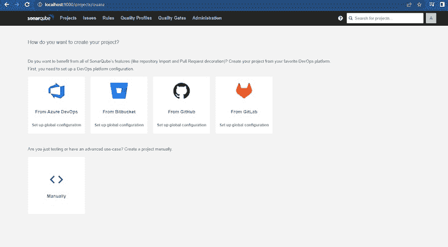
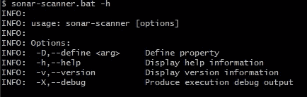
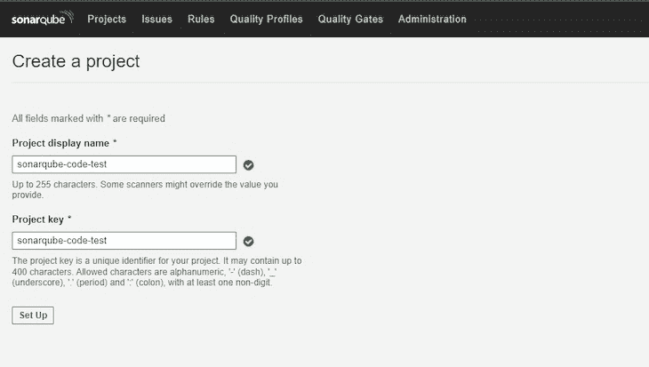
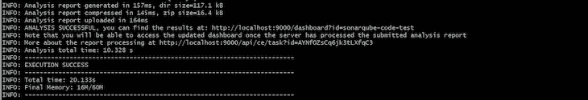
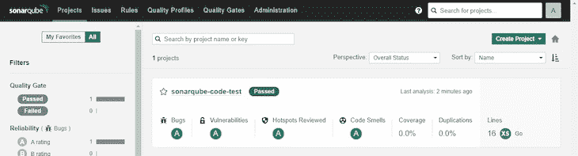

# 用 Docker 和 SonarQube 检查你的代码

> 原文：<https://blog.logrocket.com/inspect-code-docker-sonarqube/>

静态代码检查，或静态源代码分析，正如人们亲切地称呼的那样，是在代码评审期间采用的一种调试技术，其中被调试的程序不被执行。

软件工程师可以使用几种代码分析工具，如 [SonarQube](https://www.sonarqube.org) 、 [Coverity](https://scan.coverity.com) 和 [Codacy](https://www.codacy.com) 。

在本文中，我们将讨论如何在 Docker 中设置 SonarQube，展示如何为您选择的语言配置它，并生成代码质量报告。我们还将介绍整个 sonar cube 工具链，并演示如何在 Docker 上使用 sonar cube 来构建和测试 Go 应用程序。

## 内容

## 先决条件

要阅读本文的教程部分，您需要以下内容:

*   编程语言的工作知识(在本文中我们将使用 Go)
*   您偏好的编程语言的开发环境
*   安装在您机器上的 Docker
*   充足的磁盘空间用于安装 SonarQube。

## SonarQube 是什么？

SonarQube 是一个流行的代码质量和代码安全性连续检查工具，旨在帮助开发团队发布更好的软件。它作为一个自动代码审查工具，支持 30 多种编程语言。

SonarQube 可以轻松地与 CI 管道和 DevOps 构建接口，使工程师能够快速高效地检查代码。它也是自我管理的，满足了开发人员快速交付高质量和可维护代码的需求。

### 了解声纳生态系统

SonarQube 是[声纳](https://sonarsource.com)生态系统的核心元素，包括[声纳云](https://www.sonarlint.org)和[声纳云](https://docs.sonarcloud.io)。整个 Sonar 生态系统专注于帮助开发人员编写干净的、高度可维护的代码。

生态系统由面向个人开发者、团队和企业的解决方案组成。还有一个活跃的[社区](https://community.sonarsource.com/)，开源贡献者可以在其中为改进工具做出贡献。

可以安装 SonarLint 解决方案来实时分析代码，并随时获得实时反馈。SonarCloud 使开发人员能够审查和报告版本控制软件上的代码更改，以及评估生产代码。我们已经看到，SonarQube 与 SonarCloud 具有相同的功能，不同之处在于企业功能与自我管理功能。

### 了解 SonarQube 的工作原理

SonarQube 提供了静态代码分析工具，用于检测 bug、消除安全漏洞、自动化代码审查和代码质量保证。SonarQube 依靠一个名为 SonarScanner 的终端及其 CLI 工具来运行和报告测试结果。

从技术上讲，您首先从 Docker Hub 下载 SonarQube 映像。之后，您必须为您的操作系统安装 SonarScanner CLI。

在 SonarQube 仪表板上创建和测试项目。要访问仪表板，必须释放一个端口作为服务器，并将 SonarQube docker 容器指向该端口，通过 localhost IP 地址可以访问该端口。

SonarQube 只有在被添加到项目的测试文件夹中时，才有权测试项目。向 SonarQube 报告的 SonarScanner 工具必须有相应的端口号。

## 使用 SonarQube 进行代码分析

现在我们对 sonar cube 是什么以及它是如何工作的有了更好的理解，让我们看看如何在 Docker 上使用 sonar cube 进行代码覆盖、扫描漏洞和代码分析。

### 在 Docker 上安装 SonarQube

在 Docker 上获取 SonarQube 只需从 [Docker Hub](https://hub.docker.com/_/sonarqube) 获取图像。如果你使用 Linux 机器，你需要使用 Docker 在[“Docker 主机需求”](https://hub.docker.com/_/sonarqube)下提供的命令来设置推荐的基本配置。

接下来，在一个单独的终端中启动 Docker 守护进程。在终端上，运行以下命令启动服务器:

```
docker run -d --name sonarqube -p 8000:8000 sonarqube

```

您可以使用主机 IP 地址和指定的端口(在我们的示例中为`localhost:8000`)来访问 SonarQube 实例。

当 SonarQube 门户主页出现时，继续登录；使用默认用户名和密码(“admin”)。接下来，会要求您更新密码:



维奥拉。您已经准备好开始在 Docker 上使用 SonarQube 了。

### 安装声纳扫描仪

SonarScanner 是一个 CLI 工具，用于运行 SonarQube 测试。为了查看测试结果，SonarScanner 将测试的反馈发送到 SonarQube 服务器供您查看。你可以[在这里](https://docs.sonarqube.org/latest/analysis/scan/sonarscanner/)下载 SonarScanner。

选择您的操作系统并下载文件。

提取 zip 文件的内容后，导航到`conf/sonar-scanner.properties`并确保默认服务器端口与您的 SonarQube 端口相同。这将允许 SonarScanner 向 SonarQube 发送分析结果。

现在，将 SonarScanner 的 bin 文件夹添加到您机器的环境中`$PATH`。在 Windows 上，该过程包括以下步骤:

1.  下载 Windows zip 文件
2.  重命名文件`sonar-scanner`
3.  将文件移动到您的首选目录
4.  将该目录作为新的环境变量添加到 PATH 中
5.  使用新终端验证您的安装，并执行以下命令:



如果您需要关于 SonarScanner CLI 中调试的更多信息，请在您的命令中使用这些标志之一:`-X`、`--verbose`或`-Dsonar.verbose=true`。

或者，您可以使用以下命令从 Docker 映像运行 SonarScanner:

```
docker run \\
    --rm \\
    -e SONAR_HOST_URL="<http://$>{SONARQUBE_URL}" \\
    -e SONAR_LOGIN="myAuthenticationToken" \\
    -v "${YOUR_REPO}:/usr/src" \\
    sonarsource/sonar-scanner-cli

```

## 用 SonarQube 构建和测试程序

到目前为止，我们已经在 Docker 上安装了两个声纳服务。现在，让我们看看如何在实际场景中使用它们。

### 创建新的 SonarQube 项目

要创建新的 sonar cube 项目，请在 Docker 上运行 sonar cube 容器，并通过 localhost 导航到主页。

接下来，点击主页上的**项目**栏，决定如何创建一个新项目。为演示添加项目键和显示名称。

对于本演示，我们将使用手动模式。点击**手动**后，您会看到**项目显示名称**和**项目关键字**显示的字段:



填写完这些字段后，点击**设置**。在下一个窗口中，本地选择**。在之后的窗口中，点击**生成**，为你的项目生成一个令牌。然后，点击**继续**完成标记化。**

 **接下来，选择您的首选语言。对于这个项目，我们将使用 Go，因此我们将选择 **Other** 选项。

现在，选择您的操作系统，并遵循规定的指示。

### 生成 SonarQube 令牌

每个项目中都使用令牌。要生成令牌，请单击搜索栏右侧的**用户**图标。然后，点击**安全**标签，生成新的令牌。

我们的项目所需的令牌已经在项目页面中的 **Run analysis on your project** 下可用。

### 测试示例应用程序

如上所述，我们将使用一个用 Go 构建的示例程序来演示使用 SonarQube 进行静态代码分析。在现有的项目用例中，您只需要导航到代码库中的 test 文件夹，就可以使用 SonarScanner。

创建一个程序源文件，并编写您希望检查的程序，以及该程序的测试文件。

我们的加法程序简单如下:

```
package adder

func AddNumbers(x, y int) int {
    return x + y
}

```

我们将在程序中使用以下测试:

```
package adder_test

import (
    "testing"

    "github.com/username/sonarqube-code-test/adder"
)
func TestAddNumbers(t *testing.T) {
    solution := adder.AddNumbers(6, 5)
    expected := 11
    if solution != expected {
        t.Error("result is incorrect: expected 5, got", solution)
    }
}

```

### 分析代码

现在，我们将使用我们下载的 SonarScanner 来分析代码。首先，使用管理员帐户的访问令牌配置 SonarScanner CLI 工具:

```
sonar-scanner -Dsonar.login=myAuthenticationToken

```

从终端中，导航到保存代码测试文件的文件夹，并运行为项目提供的命令:


如果您自己为特定项目生成了令牌，只需编辑并使用以下代码:

```
sonar-scanner -D sonar.host.url=http://localhost:9000 -D sonar.projectKey=<Your-Project-Key> -D sonar.projectName="Your Project Name" -D sonar.projectVersion=<SemVer> -D sonar.login=<Your-Token-Here> -D sonar.test.exclusions=tests/**/*.cs

```

运行上述命令后，测试结果将显示在终端的屏幕上，并带有一条`EXECUTION SUCCESS`消息，如下所示:



现在，访问 SonarQube 仪表板并导航到**项目**。你可以在那里找到测试结果:



恭喜您，您已经成功地在 Docker 上运行了 SonarQube 测试！

## 结论

在本文中，我们概述了 Sonar 生态系统以及 SonarQube 的功能。我们还演示了如何在 Docker 上安装 SonarQube，然后使用它来构建和测试 Go 应用程序。

虽然本文在本地使用了 SonarQube，但是它最好可以在部署到任意数量环境的 Kubernetes 集群上运行。SonarQube 将作为开发环境中开发人员的安全平台。它还可以在生产环境中用于确认干净的代码。开发者和 QA 可能会发现 SonarQube 的 [SonarLint](https://www.sonarqube.org/sonarlint/?referrer=sonarqube-welcome) 对于调试代码很有用。

## 使用 [LogRocket](https://lp.logrocket.com/blg/signup) 消除传统错误报告的干扰

[](https://lp.logrocket.com/blg/signup)

[LogRocket](https://lp.logrocket.com/blg/signup) 是一个数字体验分析解决方案，它可以保护您免受数百个假阳性错误警报的影响，只针对几个真正重要的项目。LogRocket 会告诉您应用程序中实际影响用户的最具影响力的 bug 和 UX 问题。

然后，使用具有深层技术遥测的会话重放来确切地查看用户看到了什么以及是什么导致了问题，就像你在他们身后看一样。

LogRocket 自动聚合客户端错误、JS 异常、前端性能指标和用户交互。然后 LogRocket 使用机器学习来告诉你哪些问题正在影响大多数用户，并提供你需要修复它的上下文。

关注重要的 bug—[今天就试试 LogRocket】。](https://lp.logrocket.com/blg/signup-issue-free)**