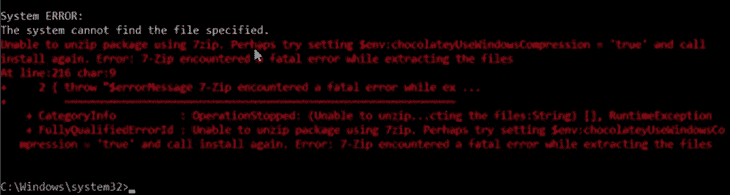
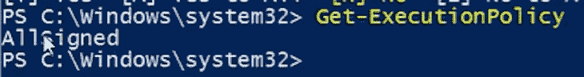
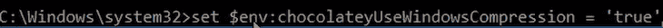
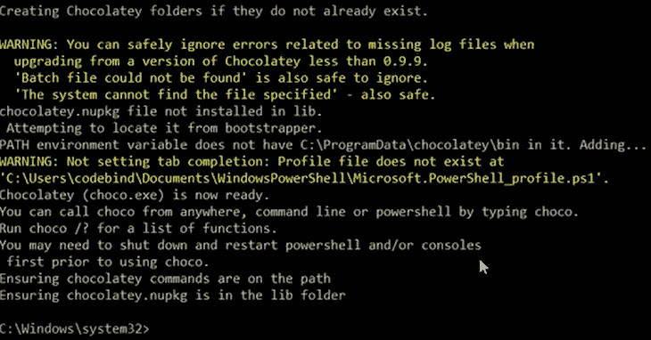
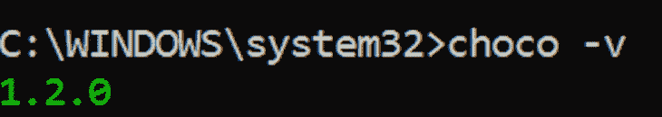
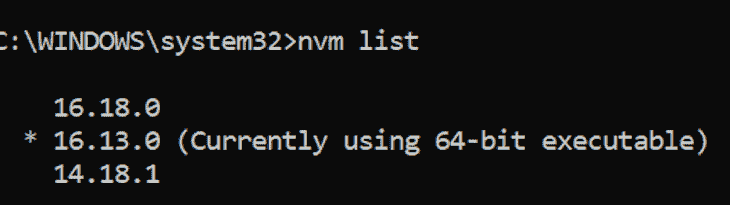
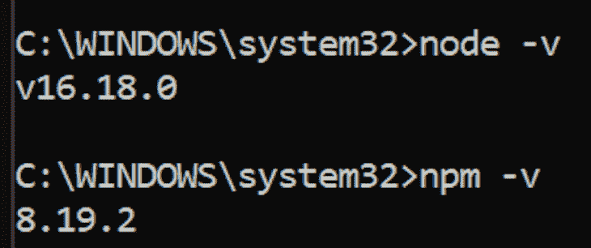
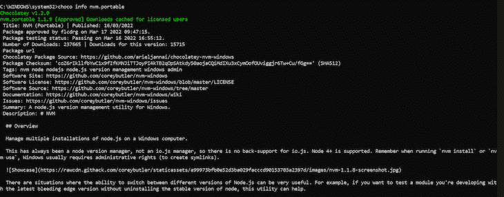

# 在 Windows 上使用 Node with Chocolatey 的指南

> 原文：<https://blog.logrocket.com/install-node-windows-chocolatey/>

如果你作为开发人员使用过 Linux 或 Mac 系统，你可能会同意我的观点，他们管理包的灵活和安全选项是首屈一指的。

像 apt-get for Linux 和 Homebrew for Mac 这样的包管理器极大地提高了我们项目的安装速度、配置和包的安全性。

好吧，如果你是 Windows 用户，那么不要害怕！你猜怎么着？有了 Chocolatey，您可以直接从 Windows 终端自动安装软件包和软件以及部署软件包——所有这些都无需手动完成安装和设置。

## 我们将在这本巧克力指南中介绍什么

在本文中，我将指导您如何设置 Chocolatey，以便在您的 Windows 系统上完成以下任务。

## 巧克力简介

Chocolatey 是一个 Windows 软件包管理器，可以帮助安装、升级和卸载软件包，等等。

你可以把它想成类似于前面提到的 APT 或者家酿。它能够扫描已安装的软件包进行病毒检测，这意味着您可以确信软件包是安全的。

## 要求

*   Windows 操作系统
*   PowerShell
*   JavaScript 的工作知识

## Windows 包管理器

与 Winget、RuckZuck 和 Yarn 等其他包管理器不同，Chocolatey 带来了一些好处，例如:

*   大量应用程序/实用程序可用
*   安装时不使用膨胀软件
*   您可以将`Chocolatey`安装命令放入 PowerShell 脚本中
*   使用方便
*   下载的文件通过校验和进行验证
*   免费和开源
*   基于开发人员已经熟悉的技术
*   分散包源

## 装置

让我们导航到命令行(CMD)。以管理员身份打开它，并运行以下 PowerShell 脚本:

```
@"%SystemRoot%\System32\WindowsPowerShell\v1.0\powershell.exe" -NoProfile -InputFormat None -ExecutionPolicy Bypass -Command "[System.Net.ServicePointManager]::SecurityProtocol = 3072; iex ((New-Object System.Net.WebClient).DownloadString('https://community.chocolatey.org/install.ps1'))" && SET "PATH=%PATH%;%ALLUSERSPROFILE%\chocolatey\bin"

```

## 解决安装问题

安装 Chocolatey 时，您可能会遇到以下错误，如下图所示:



以管理员身份打开 PowerShell 并设置所需的权限，如下所示:

```
 Get-ExecutionPolicy

```

如果此响应返回:

```
Restricted

```

然后运行以下代码片段:

```
 Get-ExecutionPolicy AllSigned

```

运行上面的代码片段后，系统会提示您回答“是”，以保护您的系统免受您不信任的脚本的攻击。完成后，重新运行代码片段，您应该会看到以下内容:



目前，已经为脚本设置了附加的安全检查。让我们回到命令行界面，从我们停止的地方继续。

如果仔细查看前面遇到的错误消息，会发现建议为 Chocolatey 设置环境变量。因此，让我们设置环境变量，如下所示:



现在我们已经用上面的代码片段设置了变量，让我们再次尝试安装 Chocolatey，如下所示:

```
@"%SystemRoot%\System32\WindowsPowerShell\v1.0\powershell.exe" -NoProfile -InputFormat None -ExecutionPolicy Bypass -Command "[System.Net.ServicePointManager]::SecurityProtocol = 3072; iex ((New-Object System.Net.WebClient).DownloadString('https://community.chocolatey.org/install.ps1'))" && SET "PATH=%PATH%;%ALLUSERSPROFILE%\chocolatey\bin"

```

如果上面的代码片段成功，命令行界面应该如下所示:



要查看已安装的 Chocolatey 版本，您可以运行以下代码片段:



要执行 Chocolatey，您只需打开命令行并运行:

```
choco

```

## 安装软件包

要开始安装软件包，请关闭 CMD 并再次以管理员身份重新打开它。

现在，让我们看看如何使用 Chocolatey 来安装 NVM(节点版本管理器)，如下所示:

```
choco install nvm.portable

```

让我们进一步解释一下:要安装一个包，使用关键字`choco`，然后是`install`，然后是包本身的名称。

NVM(节点版本管理器)是一个用来管理不同版本的 [Node.js](https://blog.logrocket.com/tag/node/) 和 npm 的安装的包。还有[更多的软件包](https://community.chocolatey.org/packages)可供安装。

每个已安装的软件包都保存在一个位置，可以在以下路径中找到:

```
 'C:\ProgramData\chocolatey\lib'

```

要定位单个包，您必须将包名添加到`lib`路径，如下所示:

```
'C:\ProgramData\chocolatey\lib\yourPackageName'

```

## 使用 NVM 安装 Node.js 和 npm

让我们进入终端，运行下面的代码片段:

```
nvm install lts

```

上面的代码片段将安装 Node.js 和 npm 的最新稳定版本。也可以通过运行以下命令来安装特定版本的 Node:

```
nvm install 16.18.0

```

要查看可以选择的节点版本列表，请运行以下命令:



这是已经安装的节点版本列表，包括我目前在 Windows 机器上使用的版本。现在，让我们看看如何选择特定的节点版本—请看这里:

```
nvm use 16.18.0

```

运行代码片段以检查我们当前使用的节点和 npm 的版本:



## 在节点环境中运行 REPL


在上面的代码片段中，我能够直接从节点环境中编写普通的 JavaScript 代码，这意味着我可以计算数字、创建循环和函数，并直接从终端读取变量。

> **注意，**所有需要做的就是在终端上写`node`并按回车键启动节点环境

## 卸载 Node.js

要卸载节点，只需指定要卸载的节点版本，如下图所示:

```
nvm uninstall node 16.18.0

```

## 升级包

要升级使用 Chocolatey 安装的软件包，让我们运行以下代码片段:

```
choco upgrade nvm.portable

```

上面的代码片段将在`lib`位置中搜索 NVM 包。一旦找到它，它将寻找一个可能的稳定版本，并升级到相关版本。

## 检索关于特定包的信息

要获得关于包的所有可用信息，我们可以运行以下代码片段:

```
choco info nvm.portable

```

在下面显示的响应中，您将找到关于您查询的包的相关信息。



## 安装多个软件包

要安装多个软件包，只需运行以下代码片段:

```
choco install nvm.portable firefox

```

在上面的代码片段中，您可以看到，与 npm 处理多个文件的方式相同，Chocolatey 也是如此——我们只是将每个包一个接一个地堆叠起来。

## 卸载软件包

要卸载使用`choco`安装的软件包，请运行以下代码片段:

```
choco uninstall nvm.portable

```

## 结论

Chocolatey 是一个伟大的选择作为您的软件包管理器为您的 Windows 软件包。在你的项目中使用包的灵活性意味着开发者不需要学习任何新的东西，因此进入的门槛很低，这很好！

## 200 只显示器出现故障，生产中网络请求缓慢

部署基于节点的 web 应用程序或网站是容易的部分。确保您的节点实例继续为您的应用程序提供资源是事情变得更加困难的地方。如果您对确保对后端或第三方服务的请求成功感兴趣，

[try LogRocket](https://lp.logrocket.com/blg/node-signup)

.

[](https://lp.logrocket.com/blg/node-signup)[https://logrocket.com/signup/](https://lp.logrocket.com/blg/node-signup)

LogRocket 就像是网络和移动应用程序的 DVR，记录下用户与你的应用程序交互时发生的一切。您可以汇总并报告有问题的网络请求，以快速了解根本原因，而不是猜测问题发生的原因。

LogRocket 检测您的应用程序以记录基线性能计时，如页面加载时间、到达第一个字节的时间、慢速网络请求，还记录 Redux、NgRx 和 Vuex 操作/状态。

[Start monitoring for free](https://lp.logrocket.com/blg/node-signup)

.