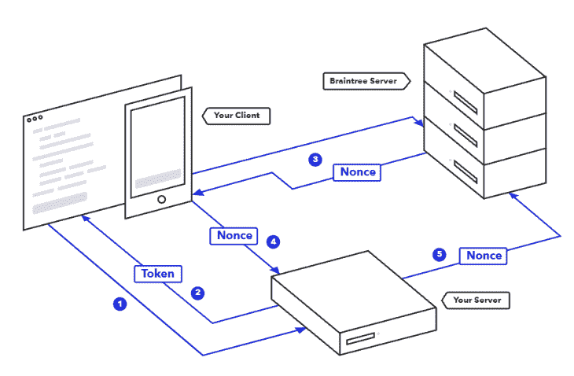
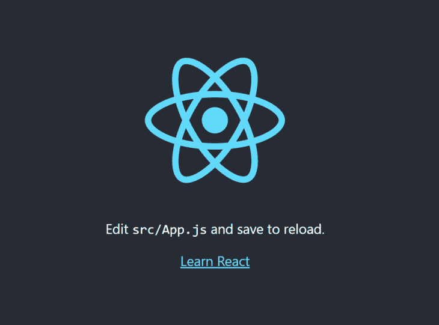
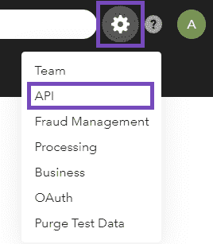
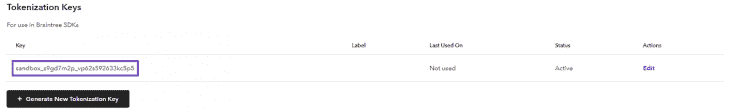

# 如何在 React - LogRocket 博客中集成 Braintree 支付系统

> 原文：<https://blog.logrocket.com/integrate-braintree-payment-system-react/>

通过网站支付购买服务或产品已经变得越来越普遍。因此，能够实现这一特性比以往任何时候都更加重要。令人欣慰的是，已经发布了几个支付平台来帮助开发者，所以你可以避免与支付相关的最常见问题的斗争。

Braintree 就是这样一个平台，它承诺让任何应用或网站都可以轻松接受支付。特别是，他们的 API、库和工具可以用来毫不费力地实现支付系统。

在本文中，您将了解如何通过使用官方的 Braintree JavaScript 客户端 SDK 将 Braintree 集成到 React 应用程序中。按照本教程学习如何实现以下结果:

> 没有描述

## 先决条件

这是您将要构建的演示应用程序的所有先决条件的列表:

## 布伦特里 JavaScript SDK

[如官方文档](https://developer.paypal.com/braintree/docs/guides/client-sdk/setup/javascript/v3)所述，Braintree JavaScript SDK 允许您轻松接受支付，同时保持 PCI(支付卡行业)合规性。换句话说，他们的 SDK 可以让您实现一个完整的支付系统，同时按照信用卡公司的要求自动确保信用卡交易和数据的安全性。

Braintree JavaScript client SDK 支持信用卡、PayPal、数字钱包和其他几种支付方式。您可以[在此](https://www.braintreepayments.com/it/features/payment-methods)找到支持的付款方式的完整列表。每种支付方式都可以轻松配置和集成。

要安装 Braintree JavaScript SDK，请启动以下 npm 命令:

```
npm install --save braintree-web

```

这样，`[braintree-web](https://www.npmjs.com/package/braintree-web)` npm 库将被添加到项目的依赖项中。如果你不是 npm 用户，你可以[在这里](https://www.npmjs.com/package/braintree-web)找到所有其他支持的安装 SDK 的方法。

安装好之后，你得学会如何使用它。具体来说，你需要知道的是，Braintree 有两种不同的集成:托管字段和插件。第一个提供了实现定制 UI 所需的所有工具，而第二个提供了一个带有优雅 UI 的现成的、预格式化的支付表单，它代表了推荐的方法。

在这两种情况下，您都需要从 Braintree 检索授权令牌。如何实现这一点将在本教程的后面讨论。Braintree 需要这些信息来授权您的前端应用程序。

然后，在完成输入支付所需数据的程序后，[将生成一个布伦特里支付方法随机数](https://developer.paypal.com/braintree/docs/guides/payment-method-nonces)。这表示引用支付信息的安全且一次性使用的随机数。这样的随机数应该被发送到您的服务器，并通过利用 [Braintree 服务器 SDK](https://developer.paypal.com/braintree/docs/start/hello-server/node) 来执行实际支付。

换句话说，由 Braintree 前端 UI 生成的支付方式 nonce 允许您的服务器将敏感支付信息传递给 Braintree 服务器，并在不暴露敏感数据的情况下执行操作。

您可以在下面看到 Braintree 付款流程的简化图。另外，你可以从官方文档中阅读[这篇文章，了解更多关于 Braintree 如何工作的信息](https://developer.paypal.com/braintree/docs/start/overview#how-it-works)。



[The Braintree payment flow](https://developer.paypal.com/braintree/docs/start/overview#how-it-works)

现在，让我们深入研究 Braintree 提供的两种前端方法。

## 托管字段

布伦特里托管字段方法允许商户处理 SAQ A(自我评估问卷 A)资格，同时控制其支付表单的样式和布局。

具体来说，托管字段解决方案自动呈现包含以下支付字段的 iframe:卡号、CVV、截止日期和邮政编码。这是因为为了满足 PCI 遵从的基本级别，您必须在外部支付网关的域上托管信息，并在 iframe 或重定向中向您的用户呈现这五个字段。

因此，这种方法允许您完全定制您的支付形式，同时确保您符合 PCI 要求。同时，托管字段涉及自定义逻辑。如果你想实现其他支付方式，比如 PayPal，这一点尤其正确。这就是为什么这种解决方案不是最广泛使用的，只有在需要完全控制逻辑和风格时才应该考虑。

您可以[在这里](https://developer.paypal.com/braintree/docs/guides/hosted-fields/examples/javascript/v3)找到一些自定义托管字段集成的例子。

## 顺便拜访

Braintree Drop-in UI 是一个完整的、现成的支付 UI，提供了一种安全接受支付的简单方法。默认情况下，该界面包括一个卡输入表单，要求输入信用卡号、持卡人姓名、到期日期、邮政编码和 CVV。

另外，您可以通过特殊配置启用 PayPal、Apple Pay、Google Pay 和 Venmo 按钮。点击[这个链接，看看默认的 Braintree 插件 UI 是什么样子的](https://developer.paypal.com/braintree/docs/guides/drop-in/overview#demo)。

要使用它，您需要启动以下 npm 命令，将所需的依赖项添加到您的项目中:

```
npm install --save braintree-web-drop-in

```

这样，`braintree-web-drop-in`将被安装。这个预制的支付 UI 是使用前面提到的 Braintree JS 客户端 SDK 构建的。因此，`braintree-web-drop-in`依赖于`braintree-web`。因此，通过将`braintree-web-drop-in`添加到您的依赖项中，将会自动安装`braintree-web`库。因此，当使用`braintree-web-drop-in`库时，您可以在项目的依赖项中省略`braintree-web`。

正如官方文档中所述，在使用 Braintree 时，Braintree Drop-in 是开始接受付款的最快和推荐的方法。这是因为默认插件 UI 使您符合 SAQ PCI 标准，本机支持 23 种语言(并允许您集成自己的语言)，支持 [3D Secure 2 验证](https://developer.paypal.com/braintree/docs/guides/3d-secure/overview)，并允许用户删除已保存的支付方式。所有这些都在一个现成的解决方案中，只需要实现一堆代码。

## 托管字段与插件

在这里，您可以看到上面介绍的两种方法之间的主要区别的概述。

### 托管字段

*   它符合 SAQ 的 PCI 标准
*   它允许您创建一个自定义样式和布局的付款表单
*   它允许您完全自定义您的结帐行为
*   它需要您手动集成 [PayPal 结帐组件](https://developer.paypal.com/braintree/docs/guides/paypal/checkout-with-paypal/javascript/v3)来接受 PayPal

### 顺便拜访

*   它符合 SAQ 的 PCI 标准
*   它允许您快速轻松地集成 Braintree
*   它支持 23 种语言
*   它原生支持 PayPal、Apple Pay、Google Pay 和 Venmo 按钮
*   您可以通过覆盖它的 CSS 规则来自定义它，但是不能完全控制它

## 在 React 中使用 braintree 插件

您可以克隆支持本文的 [GitHub 存储库，并通过启动以下命令来尝试演示应用程序:](https://github.com/Tonel/react-braintree-drop-in-demo)

```
git clone https://github.com/Tonel/react-braintree-drop-in-demo.git
cd react-braintree-drop-in-demo
npm i
npm start

```

否则，您可以继续遵循这个循序渐进的教程。

### 初始化 React 项目

你可以通过使用 [Create React App](https://blog.logrocket.com/getting-started-with-create-react-app-d93147444a27/) 轻松初始化一个 React 项目。这是官方支持的创建单页面 React 应用程序的方法。特别是，您可以使用以下命令创建一个名为`react-braintree-drop-in-demo`的新项目:

```
npx create-react-app react-braintree-drop-in-demo
```

现在，您将能够探索位于具有以下文件结构的`react-brantree-drop-in-demo`文件夹中的演示项目:

```
react-braintree-drop-in-demo
├── README.md
├── node_modules
├── package.json
├── .gitignore
├── public
│   ├── favicon.ico
│   ├── index.html
│   ├── logo192.png
│   ├── logo512.png
│   ├── manifest.json
│   └── robots.txt
└── src
    ├── App.css
    ├── App.js
    ├── App.test.js
    ├── index.css
    ├── index.js
    ├── logo.svg
    ├── reportWebVitals.js
    └── setupTests.js

```

然后，进入`react-brantree-drop-in-demo`文件夹并启动本地服务器，通过运行以下命令检查一切是否正常:

```
cd react-braintree-drop-in-demo
npm start

```

在浏览器中打开 [http://localhost:3000/](http://localhost:3000/) 页面，您现在应该会看到默认的 Create React App 屏幕，如下所示:



### 设置布伦特里

正如官方文档中所解释的，有两种不同的方法让 Braintree 授权你的前端应用程序。

第一个涉及到一个[客户端令牌](https://developer.paypal.com/braintree/docs/guides/authorization/client-token)，它必须由您的服务器使用 Braintree server SDK 生成。这使您可以访问所有的 Braintree 客户端 API 功能。

第二个是[令牌化密钥](https://developer.paypal.com/braintree/docs/guides/authorization/tokenization-key/javascript/v3)，这是一个静态密钥，只授权有限的 Braintree 客户端 API 特性子集。为了简单起见，将使用一个令牌化密钥来授权 Braintree 插件。

您可以按照以下步骤在 Braintree 控制面板中检索有效的令牌化密钥:

1.  如果您已经订阅，请登录 [Braintree 沙盒控制面板](https://sandbox.braintreegateway.com/login)。否则，注册然后登录
2.  点击右上角的齿轮图标

3.  从下拉菜单中选择 API 选项



1.  向下滚动到“令牌化密钥”部分，并检索您的密钥。如果看不到任何密钥，请单击“生成新的令牌化密钥”按钮来生成新的密钥
    
2.  将您的 Braintree 令牌化密钥存储在安全的地方

您现在可以开始使用`braintree-drop-in`。让我们看看怎么做。

## 布伦特里-投入行动

首先，启动以下命令来安装`braintree-web-drop-in`库:

```
npm install --save braintree-web-drop-in
```

然后，您可以通过如下方式实现一个`BraintreeDropIn`组件来开始使用它:

```
import React, {useEffect, useState} from 'react'
import './index.css';
import dropin from "braintree-web-drop-in"
import {Button} from "reactstrap";

export default function BraintreeDropIn(props) {
    const { show, onPaymentCompleted } = props;

    const [braintreeInstance, setBraintreeInstance] = useState(undefined)

    useEffect(() => {
        if (show) {
            const initializeBraintree = () => dropin.create({
                // insert your tokenization key or client token here
                authorization: "sandbox_s9gd7m2p_vp62s592633kc5p5", 
                container: '#braintree-drop-in-div',
            }, function (error, instance) {
                if (error)
                    console.error(error)
                else
                    setBraintreeInstance(instance);
            });

            if (braintreeInstance) {
                braintreeInstance
                    .teardown()
                    .then(() => {
                        initializeBraintree();
                    });
            } else {
                initializeBraintree();
            }
        }
    }, [show])

    return (
        <div
            style={{display: `${show ? "block" : "none"}`}}
        >
            <div
                id={"braintree-drop-in-div"}
            />

            <Button
                className={"braintreePayButton"}
                type="primary"
                disabled={!braintreeInstance}
                onClick={() => {
                    if (braintreeInstance) {
                        braintreeInstance.requestPaymentMethod(
                            (error, payload) => {
                                if (error) {
                                    console.error(error);
                                } else {
                                    const paymentMethodNonce = payload.nonce;
                                    console.log("payment method nonce", payload.nonce);

                                    // TODO: use the paymentMethodNonce to
                                    //  call you server and complete the payment here

                                    // ...

                                    alert(`Payment completed with nonce=${paymentMethodNonce}`);

                                    onPaymentCompleted();
                                }
                            });
                    }
                }}
            >
                {
                    "Pay"
                }
            </Button>
        </div>
    )
}

```

如您所见，通过使用来自从`braintree-web-drop-in`导入的`dropin`变量的`create()`函数，创建了布伦特里插件。该函数需要一个包含您的令牌化密钥或有效客户端令牌的`authorization`字段，以及一个指向安装 Braintree UI 的`<div>`的 HTML 标识符的`container`。类似地，它接受许多其他可用于启用 3D 安全模块、PayPal 和其他选项和支付方法的字段。在这里你可以[找到`create()`函数支持的所有参数。](https://braintree.github.io/braintree-web-drop-in/docs/current/module-braintree-web-drop-in.html#.create)

`create`函数立即返回一个承诺，随后返回一个错误消息或一个有效的 Braintree 插件实例。这可用于检索 Braintree 完成支付服务器端所需的支付`nonce`。具体来说，它是通过点击“支付”按钮并调用`requestPaymentMethod()`函数生成的。

同样，`requestPaymentMethod()`函数会立即返回一个承诺，稍后会返回一个错误消息或一个包含所需支付方式`nonce`的`payload`对象。如前所述，这是 Braintree server SDK 在不暴露任何个人数据的情况下执行支付服务器端所期望和要求的。

然后，您需要调用您的定制 API，利用 Braintree server SDK 和 payment nonce 方法来执行支付。由于这是一个只有前端教程，这一部分被省略。

成功完成支付后，`show`道具会被`onPaymentCompleted()`功能设置为`false`，`BraintreeDropIn`组件消失。另外，下一次显示`BraintreeDropIn`组件时，将再次执行上述的布伦特里插件实例初始化过程。但是在这种情况下，已经有一个有效的`braintreeInstance`包含前一个用户输入的数据。因此，`create()`函数将返回相同的`braintreeInstance`。

* * *

### 更多来自 LogRocket 的精彩文章:

* * *

这是一个问题，因为 Braintree 可能会再次产生与之前相同的付款`nonce`。因此，这将导致 Braintree 服务器响应 409 冲突“网关被拒绝”错误。为了避免这种情况，您必须首先销毁`braintreeInstance`，然后再次初始化它。

这就是为什么当`braintreeInstance`不是`undefined`时，在调用`create()`函数之前先调用`teardown()`函数。可以想象，这样的问题只发生在单页应用程序中，在这种应用程序中，当更改页面时，资源不会被隐式破坏。

瞧啊！现在，您已经具备了开始使用 Braintree 插件 UI 所需的一切。

### 把所有的放在一起

让我们通过在 React 中模拟一个结帐页面来看看`BraintreeDropIn`组件的运行情况:

```
import './App.css';
import 'bootstrap/dist/css/bootstrap.min.css';
import BraintreeDropIn from "./components/BraintreeDropIn";
import {Col, Container, Input, Row, Button} from "reactstrap";
import {useState} from "react";

export default function App() {
const [showBraintreeDropIn, setShowBraintreeDropIn] = useState(false);
const [numberOfProducts, setNumberOfProducts] = useState(1);
const PRICE = 50;

return (
    <Container>
        <Col>
            <Row
                className={"productHeaderRow"}
            >
                <Col
                    xs={4}
                >
                    {
                        "Product"
                    }
                </Col>
                <Col
                    xs={2}
                    className={"text-center"}
                >
                    {
                        "Price"
                    }
                </Col>
                <Col
                    xs={2}
                    className={"text-center"}
                >
                    {
                        "Quantity"
                    }
                </Col>
                <Col
                    xs={2}
                    className={"text-center"}
                >
                    {
                        "Total"
                    }
                </Col>
                <Col
                    xs={2}
                />
            </Row>
            <Row
                className={"productInfoRow"}
            >
                <Col
                    xs={4}
                    className={"productInfoColumn"}
                >
                    {
                        "Foo product"
                    }
                </Col>
                <Col
                    xs={2}
                    className={"productInfoColumnCenter"}
                >
                    {
                        `$ ${PRICE}`
                    }
                </Col>
                <Col
                    xs={2}
                    className={"productInfoColumnCenter"}
                >
                    <Input
                        placeholder="0"
                        min={1}
                        max={100}
                        type="number"
                        step="1"
                        value={numberOfProducts}
                        onChange={((e) => {
                            setNumberOfProducts(e.target.value)
                        })}
                    />
                </Col>
                <Col
                    xs={2}
                    className={"productInfoColumnCenter"}
                >
                    {
                        `$ ${numberOfProducts * PRICE}`
                    }
                </Col>
                <Col
                    xs={2}
                    className={"productInfoColumnCenter"}
                >
                    <Button
                        onClick={() => {setShowBraintreeDropIn(true)}}
                        disabled={showBraintreeDropIn}
                    >
                        {
                            "Go to Checkout"
                        }
                    </Button>
                </Col>
            </Row>
        </Col>
        <BraintreeDropIn
            show={showBraintreeDropIn}
            onPaymentCompleted={() => {
                setShowBraintreeDropIn(false);
                setNumberOfProducts(1);
            }}
        />
    </Container>
);
}

```

这里实现的应用程序与您在本文开头看到的应用程序相同。点击“去结账”并按照说明使用[一个由布伦特里](https://developer.paypal.com/braintree/docs/guides/credit-cards/testing-go-live/php)接受的测试信用卡号码来测试布伦特里直接付款方式，例如:

*   55555555554444(万事达卡)
*   41111111111111111(签证)
*   6304000000000000(大师)

今天之后到 2030 年之前的任何有效截止日期都可以。

现在，您只需要学习如何让您的应用程序接受真实的支付。您唯一需要做的就是替换您在 Braintree 插件初始化期间放入`authorization`字段的令牌化密钥或客户端令牌。

不要使用来自沙盒平台的数据，而是通过在 Braintree 生产平台中检索有效数据来替换它。你现在可以收到真钱了。

## 结论

在本文中，我们了解了什么是 Braintree，以及如何使用它来接受支付前端。如图所示，Braintree 附带了一个 JavaScript 客户端 SDK，它提供了许多工具和特性来使这变得简单快捷。特别是，它提供了两种不同的可能集成:托管字段和插件。

第一个涉及自定义逻辑，应该只在特殊情况下使用。另一方面，第二个是一个现成的解决方案，允许您在几行代码中使用 Braintree 开始接受支付。

由于采用了后一种方法，实现这种日益增长的需求并不复杂。

感谢阅读！我希望这篇文章对你有所帮助。如果有任何问题、意见或建议，请随时联系我。

## 使用 LogRocket 消除传统反应错误报告的噪音

[LogRocket](https://lp.logrocket.com/blg/react-signup-issue-free)

是一款 React analytics 解决方案，可保护您免受数百个误报错误警报的影响，只针对少数真正重要的项目。LogRocket 告诉您 React 应用程序中实际影响用户的最具影响力的 bug 和 UX 问题。

[ ](https://lp.logrocket.com/blg/react-signup-general) [  ](https://lp.logrocket.com/blg/react-signup-general) [LogRocket](https://lp.logrocket.com/blg/react-signup-issue-free)

自动聚合客户端错误、反应错误边界、还原状态、缓慢的组件加载时间、JS 异常、前端性能指标和用户交互。然后，LogRocket 使用机器学习来通知您影响大多数用户的最具影响力的问题，并提供您修复它所需的上下文。

关注重要的 React bug—[今天就试试 LogRocket】。](https://lp.logrocket.com/blg/react-signup-issue-free)