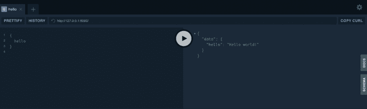

# 使用 Ariadne - LogRocket 博客将 GraphQL 集成到 Python 中

> 原文：<https://blog.logrocket.com/integrate-graphql-python-using-ariadne/>

作为一名前端开发人员和长期的 Jamstacker，我有足够多的时间对我们如何使用 API 感到沮丧。REST 协议看起来是朝着正确方向迈出的一步(确实如此)，但是尽管有所改进，我仍然不怀好意地抱怨它的局限性。

所以当我听说 GraphQL 的时候，我很震惊。

这个想法很简单:API 本身定义了它可以理解的数据类型，并向用户公开了一个端点。然后，用户向该端点提供一个类似于 JSON 的查询，没有所有讨厌的值、引号和逗号。

API 返回该查询的 JSON 版本，其中的值填充了您所要求的所有数据。这是一个非常简单的想法，但是它几乎解决了我遇到的所有 API 问题。

## 什么是阿里阿德涅？

通常情况下，GraphQL APIs 是用 JavaScript 创建的，但我的初恋是 Python，这也是我看 Ariadne 的原因。Ariadne 是一个 Python 库，它可以帮助你创建一个 GraphQL API，而不会增加额外的负担。

在本文中，我将记录用 Python 3.8 制作 Ariadne GraphQL API 的过程，这将使用户能够访问单个简单的数组/字典结构。

## Ariadne 入门

我将假设[你已经在你的电脑](https://www.python.org/downloads/)上安装了 Python，并且你已经安装了 Ariadne 和`pip3 install ariadne`。

不过，我想在这里给你一点提示:坚持使用单一数据源(比如一个数据库、一层业务逻辑或一个 Python 字典)。当我第一次听说 GraphQL 时，我的第一个想法是，我可以使用它将我正在使用的所有其他 API 组合到一个端点中——我可以摆脱 REST 和 SOAP APIs 的所有不一致，并毫无困难地获得我需要的所有数据和功能。

这是可能的，但是这比你自己动手要麻烦得多。这个概念被称为 API 网格，它是由 [TakeShape.io](http://takeshape.io) 的人们首创的。如果您有兴趣了解更多关于 TakeShape 的信息，请随意查看他们的[新文档页面](https://app.takeshape.io/docs/)，但是为了简单起见，我将坚持在这里展示一个数据源。

## 阿里阿德涅如何工作

既然样板文件已经出来了，让我们看看 Ariadne 是如何工作的。你可以[跟随他们的快速入门指南](https://ariadnegraphql.org/docs/intro)，但是我会简化它。事情是这样的:

首先，使用 GraphQL 的特殊模式定义语言来定义类型。它类似于 TypeScript 接口，在这里您定义对象的键以及每个键的值的类型。

Ariadne 中的每个应用程序都需要一个名为`Query`的类型，因为它将与程序的输入进行比较，所以让我们现在就开始吧。它看起来会像这样:

```
type Query {
      hello: String!
}
```

这是一个非常基本的定义。简单来说，我们定义一个叫做`Query`的类型。它有一个名为`hello`的键，永远是一个字符串。这里有一个额外的好处:那一行末尾的`!`意味着如果对象符合这种类型，那么`hello`将总是在对象中。如果你省略了感叹号，那么`hello`将是可选的。

现在，在我们的 Python 文件中(我将把它命名为`endpoint.py`)，我们将把那个类型定义粘贴到一个字符串中，并把它传递给 Ariadne 的`gql`函数。到目前为止，我们的文件如下所示:

```
from ariadne import gql

typedefs = """
     type Query {
           hello: String!
     }
"""
typedefs = gql(type_defs)
```

这将验证我们的类型定义，如果我们写得不正确，就会抛出一个错误。

接下来，Ariadne 希望我们创建一个`ObjectType`类的实例，并传入我们类型的名称。简而言之，这将是我们正在制作的类型的 Python 表示。

我们还将在最后添加一些样板文件，并将我们的类型定义放在那里。现在`endpoint.py`看起来是这样的:

```
from ariadne import ObjectType, gql, make_executable_schema
from ariadne.asgi import GraphQL

basetype = ObjectType("Query") # there is a shortcut for this, but explicit is better than implicit
type_defs = """
     type Query {
           hello: String!
     }
"""

app = GraphQL(
      make_executable_schema(
            gql(type_defs),
            basetype
      ),
     debug=True
)
```

Ariadne 的主要目的是扫描输入查询，并为每个键运行一个解析器函数来获取该键的值。它使用 decorators 来实现这一点，这是一种很酷的 Pythonic 方式，可以将您的函数交给 Ariadne，而无需更多的样板文件。这是我们的`endpoint.py`，它为我们的`hello`键提供了解析功能:

```
from ariadne import ObjectType, gql, make*executable*schema
from ariadne.asgi import GraphQL

basetype = ObjectType("Query")
type_defs = """
      type Query {
            hello: String!
      }
"""

@basetype.field("hello")
def resolve_hello(obj, info):
      return "Hello world!"

app = GraphQL(
      makeexecutableschema(
           gql(type_defs),
           basetype
      ),
      debug=True
)
```

差不多就是这样。Ariadne 有许多迷人而有用的特性(说真的，[翻阅他们的文档](https://ariadnegraphql.org/docs/intro))，但这是你开始使用和理解它如何工作所需要的全部。如果你有兴趣测试这个，它需要在服务器上运行。

你可以使用[uvicon](https://www.uvicorn.org)暂时将你的本地机器变成一台。简而言之，你需要将`pip install uvicorn`、`cd`安装到你的`endpoint.py is`所在的文件夹，然后运行`uvicorn endpoint:app.`，访问`127.0.0.1:8000`，在那里你会看到 Ariadne 的 GraphQL 界面。看起来很酷:



只有一个警告:我在这里粗略浏览的介绍文档页面在中途提出了一个很好的观点。现实世界中的解析器很少这么简单:它们通常从某个源读取数据，如数据库、流程输入或父对象上下文中的解析值(sic)

翻译成简单的英语？“我们的 API 没有任何用处。你给它一个查询，它告诉你，`Hello world!`，这既不好笑也没什么帮助。我们创建的解析器函数需要接受输入，从某个地方获取数据，然后返回一个有价值的结果。”

好了，现在我们已经有了样板文件，让我们通过访问一个由 Python 数组和字典组成的基本数据库来尝试让这个 API 物有所值。

## 构建一个示例 GraphQL API

嗯……我们要建什么？我是这么想的:

*   输入查询应该将我最喜欢的情景喜剧之一的重名作为参数
*   查询将返回一个`Sitcom`类型，该类型应该有名称字段(可以是字符串)、`number_of_seasons` (Int)和字符字段(字符数组)
*   字符类型将有`first_name`、`last_name`和`actor_name`字段，它们都是字符串

这听起来可行！我们只有两种类型(`sitcom`和`character`)，我们公开的数据可以很容易地存储在 Python 字典结构中。以下是我将使用的格言:

```
characters = {
    "jeff-winger": {
        "first_name": "Jeffrey",
        "last_name": "Winger",
        "actor_name": "Joel McHale"
    },
    "michael-scott": {
        "first_name": "Michael",
        "last_name": "Scott",
        "actor_name": "Steve Carell"
    },
    ...
}

sitcoms = {
    "office": {
        "name": "The Office (US)",
        "number_of_seasons": 9, # but let's be real, 7
        "characters": [
            "michael-scott",
            "jim-halpert",
            "pam-beesly",
            "dwight-schrute",
            ...
        ]
    },
    "community": {
        "name": "Community",
        "number_of_seasons": 6, #sixseasonsandamovie
        "characters": [
            "jeff-winger",
            "britta-perry",
            "abed-nadir",
            "ben-chang",
            ...
        ]
    },
    ...
}
```

我们想要定义我们的类型，就像我们之前定义我们的`query`类型一样。让我们试试这个:

```
query = ObjectType("Query")
sitcom = ObjectType("Sitcom")
character = ObjectType("Character")
type_defs = """
    type Query {
        result(name: String!): Sitcom
    }

    type Sitcom {
        name: String!
        number_of_seasons: Int!
        characters: [Character!]!
    }

    type Character {
        first_name: String!
        last_name: String!
        actor_name: String!
    }
"""

app = GraphQL(
    make_executable_schema(
        gql(type_defs),
        query,
        sitcom,
        character
    ), 
    debug=True
)
```

括号中是`query`类型，它是一个参数。我们向`query`类型的`result`键传入一个名称(总是一个字符串)，这个名称将被发送到我们的解析器。我一会儿会更深入地讨论这个问题。

如果您对那个`[Character!]!`位感到疑惑，那只是意味着数组以及其中的字符是必需的。实际上，该数组必须存在，并且必须包含字符。

此外，在最后的样板文件中，我们将所有三种类型都传递给了`make_executable_schema`函数。这告诉 Ariadne，它可以开始使用这两个。事实上，我们可以在那里添加任意多的类型。

所以，这是如何工作的。客户端将发送一个类似如下的请求:

```
<code>{
      result(name:"community")
}</code>
```

服务器将接受它，将结果字段的`"community"`发送给解析器，并返回正确的情景喜剧，而不仅仅是任何情景喜剧。现在让我们构建这些解析器。

以下是我们的完整报道:

```
from ariadne import ObjectType, gql, make_executable_schema
from ariadne.asgi import GraphQL
import json

with open('sitcoms.json') as sitcom_file:
    sitcom_list = json.loads(sitcom_file.read())

with open('characters.json') as character_file:
    character_list = json.loads(character_file.read())

query = ObjectType("Query")
sitcom = ObjectType("Sitcom")
character = ObjectType("Character")
type_defs = """
    type Query {
        result(name: String!): Sitcom
    }

    type Sitcom {
        name: String!
        number_of_seasons: Int!
        characters: [Character!]!
    }

    type Character {
        first_name: String!
        last_name: String!
        actor_name: String!
    }
"""

@query.field("result")
def getSitcom(*_, name):
    return sitcom_list[name] if name in sitcom_list else None

@sitcom.field("characters")
def getCharacters(sitcom, _):
    characters = []
    for name in sitcom["characters"]:
        characters.append(character_list[name] if name in character_list else None)
    return characters

app = GraphQL(
    make_executable_schema(
        gql(type_defs),
        query,
        sitcom,
        character
    ), 
    debug=True
)

```

整个节目就是这样！我们使用 JSON 文件中的数据来填写对输入 GraphQL 查询的响应。

## 使用 Ariadne 的其他好处

但是我们不一定要结束！下面是我对下一步该做什么的一些想法。

我们只是使用了一个基本的 JSON 数据存储结构，这是一个糟糕的做法，但对于像这样的示例应用程序来说是合理的。对于比这个玩具应用更大的东西，我们希望使用更坚固的数据源，比如合适的数据库。

我们可以有一个 MySQL 数据库，其中包含情景喜剧和角色的表，并在解析器函数中获取这些数据。此外，查询本身只是我们使用 GraphQL 和 Ariadne 所能做的一半。突变是另一半。它们允许您更新现有记录、添加新记录或可能删除行。这些在 Ariadne 中很容易设置。

当然，创建一个 API 来跟踪情景喜剧和角色有点无意义，但这是一个有趣的实验。如果我们围绕更有用的数据构建一个像这样的 GraphQL 服务，这些都可以得到更有效的利用。假设您正在运行一个现有的 REST API——为什么不用 GraphQL 来提供这些数据呢？

* * *

### 更多来自 LogRocket 的精彩文章:

* * *

最后，当我们创建一个 GraphQL API 时，通常会尝试从我们自己的数据库中获取数据，并合并来自外部来源的数据，比如一些第三方 API。您可以通过在解析器中通过 HTTP 向这些外部 API 发出请求来做到这一点，但这将大大减少您的程序，并让您自己担心边缘情况和错误处理。

相信我，这是多此一举。然而，为了进一步推进这个项目，您可以让您的 Ariadne 应用程序从您的内部数据库中获取数据，将您刚刚创建的 API 插入到 API 网格中(如 TakeShape)，然后将其与其他一些第三方服务相结合。

这样，所有困难的合并都是网格的问题，而不是你的问题。我已经这样做了几次，很高兴看到这一切走到了一起。

## 结论

这没什么大不了。我试图解释尽可能多的细节，以防万一你想分支和探索任何这些点，但技术是相当简单的。

你可以建造任何你能想到的东西。你可能会遇到一些障碍，但是 [Ariadne 在 GitHub 上有一个很棒的社区，随时准备帮助](https://github.com/mirumee/ariadne/discussions/)。我祝你在阿里阿德涅的冒险中一切顺利！

## 监控生产中失败和缓慢的 GraphQL 请求

虽然 GraphQL 有一些调试请求和响应的特性，但确保 GraphQL 可靠地为您的生产应用程序提供资源是一件比较困难的事情。如果您对确保对后端或第三方服务的网络请求成功感兴趣，

[try LogRocket](https://lp.logrocket.com/blg/graphql-signup)

.

[](https://lp.logrocket.com/blg/graphql-signup)[https://logrocket.com/signup/](https://lp.logrocket.com/blg/graphql-signup)

LogRocket 就像是网络和移动应用的 DVR，记录下你网站上发生的每一件事。您可以汇总并报告有问题的 GraphQL 请求，以快速了解根本原因，而不是猜测问题发生的原因。此外，您可以跟踪 Apollo 客户机状态并检查 GraphQL 查询的键值对。

LogRocket 检测您的应用程序以记录基线性能计时，如页面加载时间、到达第一个字节的时间、慢速网络请求，还记录 Redux、NgRx 和 Vuex 操作/状态。

[Start monitoring for free](https://lp.logrocket.com/blg/graphql-signup)

.