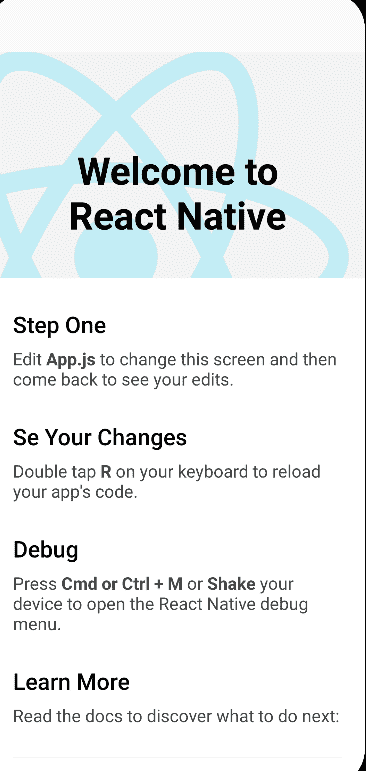
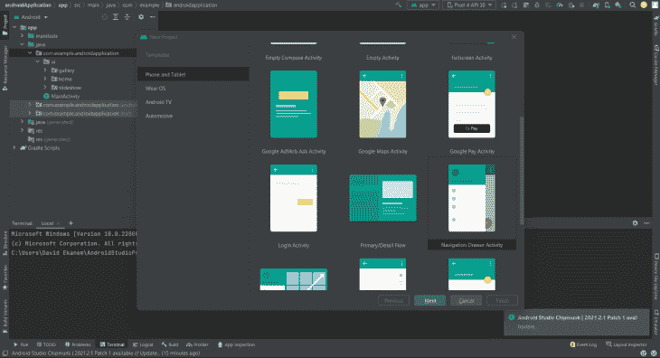
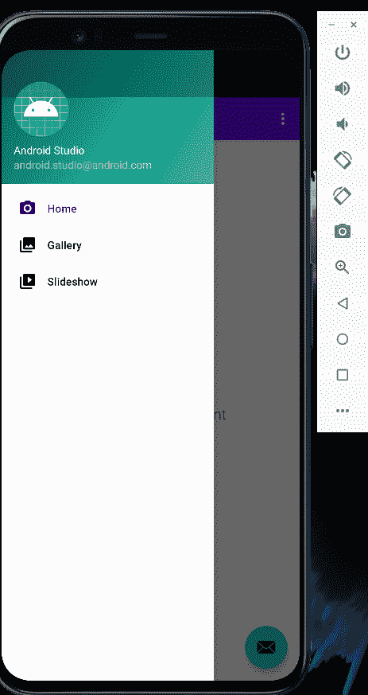
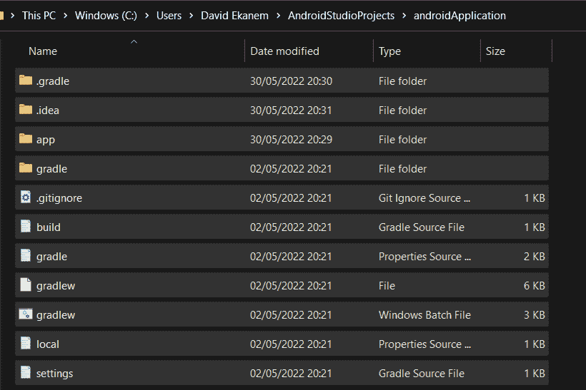
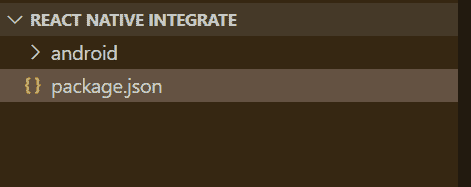
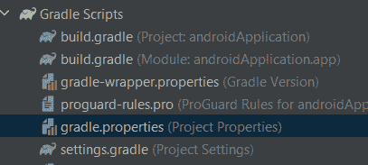
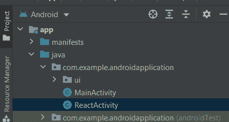

# 如何将 React 本机组件集成到本机应用程序中

> 原文：<https://blog.logrocket.com/integrate-react-native-components-native-apps/>

## 介绍

如果没有正确完成，将 React Native 集成到原生应用程序(无论是 Android 还是 iOS)中会非常复杂。在本文中，我们的目标是将 React 本地组件集成到一个本地 Android 应用程序中。

在创建移动应用程序时集成 React Native 的最大好处之一是能够跨 iOS 和 Android 应用程序重用代码。在将 React Native 集成到现有应用程序中之后，这提供了几乎完全的代码可重用性，从而大大减少了开发时间和开发成本。

我们将讨论以下内容:

### 先决条件

*   React Native 开发环境(React Native CLI)；点击[此链接](https://reactnative.dev/docs/environment-setup)了解如何启动和运行 React 本机 CLI 的说明
*   Android 开发环境(Android Studio)

## 开始使用我们的 React Native 项目

首先，让我们初始化 React 本地项目。

```
npx react-native init nativeandroid
cd nativeandroid
```

启动 [Metro Bundler](https://stackoverflow.com/questions/51116811/what-is-metro-bundler-in-react-native) 并在 React 本地项目文件夹中运行以下命令:

```
npx react-native start
```

现在，启动应用程序。

```
npx react-native run-android
```

如果设置已经正确完成，Android 应用程序应该在 Android Studio 模拟器上启动。



### 设置项目目录

如果没有使用 Android Studio 创建本地 Android 应用程序，可以创建一个新的应用程序。



使用 Android Studio，已经创建了一个基本的片段 Android 移动应用程序。



### 设置文件集成目录

这个目录将保存我们的 React 本地应用程序和本地 Android 应用程序。创建一个 Android 文件夹:

```
mkdir ReactNativeIntegration
cd ReactNativeIntegration
mkdir android
```

导航到使用 Android Studio 创建的 Android 应用程序的根文件夹，将 Android 应用程序中的所有文件复制到`AndroidStudioProjects`文件中，并粘贴到我们刚刚创建的 Android 文件夹中。



在`ReactNativeIntegration`文件夹中创建一个`package.json`。

```
cd ..
touch package.json
code package.json
```

将下面的代码块添加到空的`package.json`文件中。

```
{
  "name": "nativeandroid",
  "version": "0.0.1",
  "private": true,
  "scripts": {
    "start": "npx react-native start",
    "android": "npx react-native run-android"
  }
}

```

最后，文件目录应该如下所示:



### 安装依赖项

在这里，我们安装:

*   `[[email protected]](/cdn-cgi/l/email-protection)`
*   react–用于构建用户界面的 JavaScript 库
*   `[hermesvsm](https://www.npmjs.com/package/hermesvm)`–运行 React 本地应用的 JavaScript
*   可维护的构建脚本，允许 React Native 将 JSC 的最新版本整合到框架中

纱加[【邮件保护】](/cdn-cgi/l/email-protection)react Hermes VM JSC-Android @ react-native-community/cl[【邮件保护】](/cdn-cgi/l/email-protection)

## 配置 Maven

Maven 是管理和构建我们项目的首选工具。它很方便，因为它会根据项目的需要自动获取依赖项，并处理可传递的依赖项。

首先，在原生应用程序的`build.gradle`文件中打开 Android Studio。


将这几行代码添加到依赖项部分:

```
dependencies {
   //noinspection GradleCompatible
   implementation "com.android.support:appcompat-v7:27.1.1"
   implementation "com.facebook.react:react-native:+" // From node_modules
   implementation "org.webkit:android-jsc:+"
}

```

我们将利用[自动链接](https://github.com/react-native-community/cli/blob/master/docs/autolinking.md)的能力，使我们的应用程序能够访问本地模块，并使用 React 本地库提供的本地模块。将该行代码添加到`build.gradle`文件的底部，dependencies 部分的下面。

```
apply from: file("../../node_modules/@react-native-community/cli-platform-android/native_modules.gradle"); applyNativeModulesAppBuildGradle(project)
```

导航到我们的`androidApplication`文件中的`build.gradle`文件。



将下面的代码添加到`build.gradle`文件的顶层:

```
allprojects {
   repositories {
       maven {
           // All of React Native (JS, Android binaries) is installed from npm
           url ("$rootDir/../node_modules/react-native/android")
       }
       maven {
           // Android JSC is installed from npm
           url("$rootDir/../node_modules/jsc-android/dist")
       }
       google()
       jcenter()

   }
}

task clean(type: Delete) {
   delete rootProject.buildDir
}
```

在`settings.gradle`中，在底部添加代码行以启用自动链接。

```
apply from: file("../node_modules/@react-native-community/cli-platform-android/native_modules.gradle"); applyNativeModulesSettingsGradle(settings)
```

注释掉`dependencyResolutionManagement`代码块。

```
pluginManagement {
   repositories {
       gradlePluginPortal()
       google()
       mavenCentral()
   }
}

//dependencyResolutionManagement {
//    repositorMode.set(RepositoriesMode.FAIL_ON_PROJECT_REPOS)
//    repositories {
//        google()
//        mavenCentral()
//    }
//}
```

同步梯度变化。不应该有错误。

## 允许访问互联网

通过向`AndroidManifest.xml`文件添加以下代码，可以在`AndroidManifest.xml`文件中启用互联网权限。

```
<uses-permission android:name="android.permission.INTERNET" />
```

```
<?xml version="1.0" encoding="utf-8"?>
<manifest xmlns:android="http://schemas.android.com/apk/res/android"
   package="com.example.androidapplication">

   <uses-permission android:name="android.permission.INTERNET" />
```

还应该启用 DevSettings 访问权限。

然后，将以下代码添加到`AndroidManifest.xml`文件中:

```
<activity android:name="com.facebook.react.devsupport.DevSettingsActivity" />
```

```
       </intent-filter>
   </activity>
   <activity android:name="com.facebook.react.devsupport.DevSettingsActivity" />
</application>
```

当创建生产发布版本时，建议去掉 dev settings 权限，因为只有在从开发服务器重新加载 JavaScript 时才需要它。

### 在调试版本中启用明文

由于 Android 9 (API 级别 28) 中引入的一些[变化，明文流量默认禁用。因此，我们的应用程序无法连接到 Metro Bundler。](https://stackoverflow.com/questions/42064283/could-not-connect-to-react-native-development-server-on-android)

在`AndroidManifest.xml`文件中，将`useCleartextTraffic`选项添加到调试中。

```
<application
   android:usesCleartextTraffic="true">
</application>
```

创建发布版本时，这不是强制性的。

为了总结集成过程，原生 Android 应用程序代码将被修改以集成 React Native。

## 将 React 原生代码集成到原生 Android 应用中

在 React Native `Integrate`文件夹的根目录下，创建一个`index.js`文件。

```
touch index.js
```

将以下代码块输入到`index.js`文件中:

```
import React from "react";
import { AppRegistry, StyleSheet, Text, View } from "react-native";

const Integration = () => {
  return (
    <View style={styles.container}>
      <Text style={styles.hello}>Hello, World</Text>
    </View>
  );
};
var styles = StyleSheet.create({
  container: {
    flex: 1,
    justifyContent: "center",
  },
  hello: {
    fontSize: 20,
    textAlign: "center",
    margin: 10,
  },
});

AppRegistry.registerComponent("IntegratedApp", () => Integration);

```

### 编写本机代码

为了启动 React Native 运行时并告诉它渲染我们的 JS 组件，我们必须在 Android Studio 中创建一个名为`ReactActivity`的文件。

在 Android Studio 中打开 Android 项目，创建一个名为`ReactActivity`的类，该类扩展 Activity 并创建一个`ReactRootView`，它启动一个 React 应用程序并将其设置为

将下面的代码块添加到`ReactActivity.java`文件。

```
package com.example.androidapplication;

import android.app.Activity;
import android.os.Bundle;

import com.facebook.react.PackageList;
import com.facebook.react.ReactInstanceManager;
import com.facebook.react.ReactPackage;
import com.facebook.react.ReactRootView;
import com.facebook.react.common.LifecycleState;
import com.facebook.react.modules.core.DefaultHardwareBackBtnHandler;
import com.facebook.soloader.SoLoader;

import java.util.List;

public class MyReactActivity extends Activity implements DefaultHardwareBackBtnHandler {
    private ReactRootView mReactRootView;
    private ReactInstanceManager mReactInstanceManager;

    @Override
    protected void onCreate(Bundle savedInstanceState) {
        super.onCreate(savedInstanceState);
        SoLoader.init(this, false);

        mReactRootView = new ReactRootView(this);
        List<ReactPackage> packages = new PackageList(getApplication()).getPackages();
        // Packages that cannot be autolinked yet can be added manually here, for example:
        // packages.add(new MyReactNativePackage());
        // Remember to include them in `settings.gradle` and `app/build.gradle` too.

        mReactInstanceManager = ReactInstanceManager.builder()
                .setApplication(getApplication())
                .setCurrentActivity(this)
                .setBundleAssetName("index.android.bundle")
                .setJSMainModulePath("index")
                .addPackages(packages)
                .setUseDeveloperSupport(BuildConfig.DEBUG)
                .setInitialLifecycleState(LifecycleState.RESUMED)
                .build();
        // The string here (e.g. "IntegratedApp") has to match
        // the string in AppRegistry.registerComponent() in index.js
        mReactRootView.startReactApplication(mReactInstanceManager, "IntegratedApp", null);

        setContentView(mReactRootView);
    }
    @Override
    public void invokeDefaultOnBackPressed() {
        super.onBackPressed();
    }
}

```

现在，启动应用程序。

```
npm run start
```


## 结论

集成 React 本地组件可能是一项艰巨的任务，但是开发的好处超过了挑战。由于 React Native 是一个开源框架，开发人员在将他们的应用程序与 React Native 集成后，可以访问大量的共享代码库，这改善了开发人员的体验，有助于更快地开发应用程序。

我希望这篇文章已经为您提供了足够的指导。

## [LogRocket](https://lp.logrocket.com/blg/react-native-signup) :即时重现 React 原生应用中的问题。

[](https://lp.logrocket.com/blg/react-native-signup)

[LogRocket](https://lp.logrocket.com/blg/react-native-signup) 是一款 React 原生监控解决方案，可帮助您即时重现问题、确定 bug 的优先级并了解 React 原生应用的性能。

LogRocket 还可以向你展示用户是如何与你的应用程序互动的，从而帮助你提高转化率和产品使用率。LogRocket 的产品分析功能揭示了用户不完成特定流程或不采用新功能的原因。

开始主动监控您的 React 原生应用— [免费试用 LogRocket】。](https://lp.logrocket.com/blg/react-native-signup)