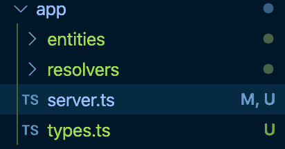
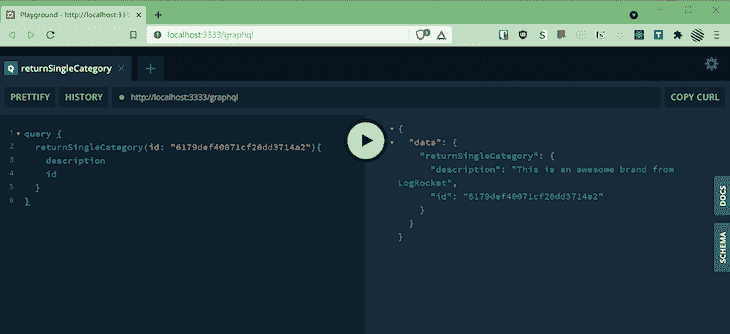

# 使用 TypeGraphQL - LogRocket 博客将 TypeScript 与 GraphQL 集成

> 原文：<https://blog.logrocket.com/integrate-typescript-graphql-typegraphql/>

***编者按**:这篇文章最后一次更新是在 2022 年 11 月 18 日，回答了关于在 GraphQL 中使用 TypeScript 的流行问题，并提供了更多 GraphQL 特性的信息，如别名和日期标量。更多使用 GraphQL 和 TypeScript 的例子，请查看这些教程:[用 TypeScript 构建 graph QL+React app](https://blog.logrocket.com/build-graphql-react-app-typescript/)和[用 TypeGraphQL 和 TypeORM 构建 GraphQL APIs】。](https://blog.logrocket.com/build-graphql-typegraphql-typeorm/)*

TypeScript 是 JavaScript 的一个类型化超集，旨在解决用 JavaScript 编写应用程序的许多棘手问题。

GraphQL 是一种用于 API 的查询语言，它使用其类型系统来描述数据字段，防止过度提取和不足提取。此外，GraphQL 在 [API 版本控制](https://blog.logrocket.com/versioning-fields-graphql/)方面也有很大帮助。

在本教程中，我们将使用 [TypeGraphQL](https://typegraphql.com/) 库构建一个 API 来集成 TypeScript 和 GraphQL，这简化了在 Node.js 中创建 GraphQL APIs。

我们将涵盖:

## 为什么要在 GraphQL 中使用 TypeScript？

GraphQL 通过两个核心组件运行:

*   模式对象形式的类型定义
*   解析器，是填充为模式返回的数据的 JavaScript 函数

模式对象定义了 API 中可以查询的属性，但是解析器不理解模式类型。这就是 TypeScript 的用武之地！通过使用编译成 JavaScript 的 TypeScript，我们可以为我们的解析器定义匹配我们的模式的类型，防止不匹配。

## 使用 TypeGraphQL 将 TypeScript 与 GraphQL 一起使用

前面，我们讨论了 TypeScript 如何以一种模式定义的方式解决让解析器知道的问题。嗯， [TypeGraphQl 库](https://typegraphql.com/)让这变得更加容易！

TypeGraphQL 使用 decoratorss 从 TypeScript 类自动创建 GraphQL 模式定义，decorator 是与反射一起引入的，以避免对模式定义文件的需要。这样，我们只需要定义解析器类型，我们的 GraphQL 模式就会生成。

尽管我们可以根据项目的需求编写定制的装饰器来满足我们的特定需求，但是对于本教程来说，为 TypeGraphQL 提供的装饰器就足够了。

## 先决条件

要跟随本教程，您需要:

*   熟悉 TypeScript 和 GraphQL
*   安装在计算机上的 Node.js
*   在您的计算机上全局安装的 TypeScript

要安装 TypeScript，可以在终端或命令提示符下使用 npm 或 Yarn 运行以下命令:

```
npm install -g typescript

```

上面的命令在我们的系统路径上安装了最新的 TypeScript 编译器`tsc`，这在我们编译和运行代码时会很有用。`tsc`获取一个以`.ts`扩展名结尾的类型脚本文件，并返回一个扩展名为`.js`的等价 JavaScript 文件。稍后我们将了解关于这个命令的更多信息。

你可以在 [GitHub repo](https://github.com/finallyayo/typescript-graphql) 上获得本教程的完整代码。

我们开始吧！

## 引导我们的 TypeScript GraphQL 应用程序

首先，让我们创建一个新目录，并将其命名为。然后我们可以用`npm init`命令初始化一个新的`package.json`文件。接下来，我们将安装我们的项目依赖项。

## 安装依赖项

现在，让我们安装项目所需的依赖项。在终端中运行以下命令:

```
npm install type-graphql reflect-metadata graphql express class-validator apollo-server-express apollo-server-core mongoose @typegoose/typegoose --save

```

让我们解释一下这些必需的依赖项以及我们为什么需要它们。

如前所述，我们将使用`type-graphql`框架用 TypeScript 和 GraphQL 构建我们的 API:

> 💡TypeGraphQL 包括自动验证、依赖注入、授权和继承等高级特性，它允许我们使用 TypeScript 类和 decorators 定义我们的 GraphQL 模式类型和接口。

`reflect-metadata`包为支持类型脚本的[实验元数据 API](https://github.com/rbuckton/ReflectDecorators) 添加了一个 polyfill。目前，TypeScript 包括[实验支持](https://www.typescriptlang.org/tsconfig#emitDecoratorMetadata)，用于为具有装饰器的声明发出某些类型的元数据，这意味着我们需要在我们的`tsconfig.json`文件中启用对这个库的支持。

[`apollo-server-express`](https://www.npmjs.com/package/apollo-server-express) 是 GraphQL 服务器的`express`和`connect`集成，我们将用它来引导一个简单的 GraphQL 服务器。

`[class-validator](https://typegraphql.com/docs/validation.html)`库允许在 TypeGraphQL 中使用 decorator 和非基于 decorator 的验证来验证我们的模式字段。

[`mongoose`](https://www.npmjs.com/package/mongoose) 包是 MongoDB 对象数据映射器(ODM)，而`[@typegoose/typegoose](https://github.com/typegoose/typegoose)`允许我们使用类型脚本类定义 Mongoose 模型。

现在，让我们安装以下类型脚本类型作为开发依赖: [`types/express`](https://www.npmjs.com/package/@types/express) 和`[@types/node](https://www.npmjs.com/package/@types/node)`。此外，我们应该添加`typescript`、`nodemon`和`ts-node`，这是 Node.js 的一个类型脚本执行环境

运行以下命令:

```
npm install types/express @types/node typescript ts-node nodemon --save-dev

```

当我们安装完项目的依赖项后，我们的`package.json`文件将看起来像下面的代码块:

```
{
  "name": "typscript-graphql-logrocket-tutorial",
  "version": "1.0.0",
  "description": "A typscript and graphql Tutorial",
  "main": "server.js",
  "scripts": {
    "start": "npm run serve",
    "serve": "node dist/server.js",
    "watch-node": "nodemon dist/server.js",
    "build-ts": "tsc",
    "watch-ts": "tsc -w",
    "test": "echo \"Error: no test specified\" && exit 1"
  },
  "keywords": [
    "TypeScript",
    "GraphQL",
    "NodeJS",
    "JavaScript"
  ],
  "author": "Alexander Nnakwue",
  "license": "MIT",
  "devDependencies": {
    "@types/express": "^4.17.3",
    "@types/graphql": "^14.5.0",
    "@types/node": "^13.9.0",
    "nodemon": "^2.0.2",
    "ts-node": "^8.6.2",
    "typescript": "^3.8.3"
  },
  "dependencies": {
    "@typegoose/typegoose": "^6.4.0",
    "apollo-server-express": "^2.11.0",
    "class-validator": "^0.11.0",
    "express": "^4.17.1",
    "graphql": "^14.6.0",
    "reflect-metadata": "^0.1.13",
    "type-graphql": "^0.17.6"
  }
}
```

接下来，我们需要设置我们的`tsconfig.json`文件，该文件提供了应该如何配置我们的 TypeScript 项目的指令。您可以访问 TypeGraphQL 所需的[类型脚本配置。](https://typegraphql.com/docs/installation.html#typescript-configuration)

在`tsconfig.json`中，我们可以指定选项来编译我们的`.ts`文件以及我们项目的根文件。每当我们运行`tsc`命令时，在我们的例子中是`npm run build`运行它，编译器将首先检查这个文件中的特殊指令，然后继续编译。

要创建我们的`tsconfig.json`文件，我们可以运行`tsc --init`命令，这将创建一个新的配置文件，其中包含许多默认值和注释，为了简洁起见，我们已经省略了这些内容。现在，我们的`tsconfig`文件看起来像下面的代码块:

```
  {
    "compilerOptions": {
        "module": "commonjs",
        "esModuleInterop": true,
        "allowSyntheticDefaultImports": true,
        "target": "es2016",  // or newer if your node.js version supports this
        "strictNullChecks": true,
        "strictFunctionTypes": true,
        "noImplicitThis": true,
        "noUnusedLocals": true,
        "noUnusedParameters": true,
        "noImplicitReturns": true,
        "skipLibCheck": true,
        "declaration": false,
        "noFallthroughCasesInSwitch": true,
        "composite": false,
        "noImplicitAny": true,
        "moduleResolution": "node",
        "lib": ["dom", "es2016", "esnext.asynciterable"],
        "sourceMap": true,
        "emitDecoratorMetadata": true,
        "strict": false,
        "experimentalDecorators": true,
        "outDir": "dist",
        "rootDir": "app",
        "baseUrl": ".",
        "paths": {
            "*": [
                "node_modules/*",
                "app/types/*"
            ]
        }
    },
    "include": [
        "app/**/*", "./app/**/*.ts", "./app/**/*.tsx"
    ]
}

```

> 注意:这些配置选项的详细解释和含义可以在文档中找到。

## 设置我们的阿波罗服务器

现在我们已经安装了我们的依赖项，我们将使用之前安装的`apollo-server-express`包来设置我们的 Apollo 服务器。在此之前，我们将在项目目录中创建新的应用程序目录。目录的内容应该如下图所示:



在我们的`server.ts`文件中，我们将使用 Express 设置我们的 Apollo 服务器。包含所有导入的文件内容应该如下所示:

```
// server.ts

import { ApolloServer } from 'apollo-server-express';
import { ApolloServerPluginLandingPageGraphQLPlayground } from 'apollo-server-core';
import Express from 'express';
import 'reflect-metadata';
import { buildSchema } from 'type-graphql';
import { connect } from 'mongoose';

import { UserResolver } from './resolvers/User';
import { ProductResolver } from './resolvers/Product';
import { CategoriesResolver } from './resolvers/Categories';
import { CartResolver } from './resolvers/Cart';
import { OrderResolver } from './resolvers/Order';

const main = async () => {
  const schema = await buildSchema({
    resolvers: [
      CategoriesResolver,
      ProductResolver,
      UserResolver,
      CartResolver,
      OrderResolver,
    ],
    emitSchemaFile: true,
    validate: false,
  });

  // create mongoose connection
  const mongoose = await connect('mongodb://localhost:27017/test');
  await mongoose.connection;

  const server = new ApolloServer({
    schema,
    plugins: [ ApolloServerPluginLandingPageGraphQLPlayground ],
  });

  const app = Express();

  await server.start();

  server.applyMiddleware({ app });

  app.listen({ port: 3333 }, () =>
    console.log(
      `🚀 Server ready and listening at ==> http://localhost:3333${server.graphqlPath}`
    )
  );
};

main().catch((error) => {
  console.log(error, 'error');
});

```

> 💡在导入`type-graphql`之前导入`reflect-metadata`是很重要的。

TypeGraphQL 的`[buildSchema](https://graphql.org/graphql-js/utilities/)`包允许我们从 TypeGraphQL 的定义中构建我们的模式。`buildSchema`方法的通常签名如下:

```
const schema = await buildSchema({
  resolvers: [Resolver],
});

```

在上面的代码中，我们从`app/resolver`文件夹中导入解析器，并将它们传递到函数定义中的`resolvers`字段的数组中。

当我们运行`npm run build-tsc`命令时，`emitSchemaFile`字段允许我们将 GraphQL 模式放到一个`schema.gql`文件中。

`schema.gql`生成后，看起来会像:

```
# -----------------------------------------------
# !!! THIS FILE WAS GENERATED BY TYPE-GRAPHQL !!!
# !!!   DO NOT MODIFY THIS FILE BY YOURSELF   !!!
# -----------------------------------------------

"""The  Cart model"""
type Cart {
  id: ID!
  products: String!
  product: Product!
}

input CartInput {
  products: ID!
}

"""The Categories model"""
type Categories {
  id: ID!
  name: String!
  description: String!
}

input CategoriesInput {
  name: String!
  description: String!
}

"""
The javascript `Date` as string. Type represents date and time as the ISO Date string.
"""
scalar DateTime

type Mutation {
  createUser(data: UserInput!): User!
  deleteUser(id: String!): Boolean!
  createProduct(data: ProductInput!): Product!
  deleteProduct(id: String!): Boolean!
  createCategory(data: CategoriesInput!): Categories!
  deleteCategory(id: String!): Boolean!
  createCart(data: CartInput!): Cart!
  deleteCart(id: String!): Boolean!
  createOrder(data: OrderInput!): Order!
  deleteOrder(id: String!): Boolean!
}

"""The Order model"""
type Order {
  id: ID!
  user_id: String!
  payde: Boolean!
  date: DateTime!
  products: Product!
}

input OrderInput {
  user_id: String!
  payde: Boolean!
  date: DateTime!
}

"""The Product model"""
type Product {
  id: ID!
  name: String!
  description: String!
  color: String!
  stock: Int!
  price: Int!
  category_id: String!
  category: Categories!
}

input ProductInput {
  name: String!
  description: String!
  color: String!
  stock: Float!
  price: Float!
  category_id: String!
}

type Query {
  returnSingleUser(id: String!): User!
  returnAllUsers: [User!]!
  returnSingleProduct(id: String!): Order!
  returnAllProduct: [Product!]!
  returnSingleCategory(id: String!): Categories!
  returnAllCategories: [Categories!]!
  returnSingleCart(id: String!): Cart!
  returnAllCart: [Cart!]!
  returnAllOrder: [Order!]!
}

"""The User model"""
type User {
  id: ID!
  username: String!
  email: String!
  cart_id: String!
  cart: Cart!
}

input UserInput {
  username: String!
  email: String!
  cart_id: ID!
}

```

## TypeGraphQL 数据库模式字段

我们的`schema.gql`文件中的内容基于我们不同数据库实体的模式字段，存储在`entities`文件夹中。

让我们看看这些文件的内容:

```
// app/entities/Categories.ts
import { ObjectType, Field, ID } from 'type-graphql';
import { prop as Property, getModelForClass } from '@typegoose/typegoose';

@ObjectType({ description: 'The Categories model' })
export class Categories {
  @Field(() => ID)
  id: string;

  @Field()
  @Property()
  name: String;

  @Field()
  @Property()
  description: String;
}

export const CategoriesModel = getModelForClass(Categories);

// app/entities/Product.ts
import { ObjectType, Field, ID, Int } from 'type-graphql';
import { prop as Property, getModelForClass } from '@typegoose/typegoose';
import { Ref } from '../types';
import { Categories } from './Categories';
import { __Type } from 'graphql';

@ObjectType({ description: 'The Product model' })
export class Product {
  @Field(() => ID)
  id: String;

  @Field()
  @Property()
  name: String;

  @Field()
  @Property()
  description: String;

  @Field()
  @Property()
  color: String;

  @Field((_type) => Int)
  @Property()
  stock: number;

  @Field((_type) => Int)
  @Property()
  price: number;

  @Field((_type) => String)
  @Property({ ref: Categories })
  category_id: Ref<Categories>;
  _doc: any;
}

export const ProductModel = getModelForClass(Product);

// app/entities/Cart.ts
import { ObjectType, Field, ID } from 'type-graphql';
import { prop as Property, getModelForClass } from '@typegoose/typegoose';

import { Ref } from '../types';

import { Product } from './Product';

@ObjectType({ description: 'The  Cart model' })
export class Cart {
  @Field(() => ID)
  id: string;

  @Field((_type) => String)
  @Property({ ref: Product, required: true })
  products: Ref<Product>;
  _doc: any;
}

export const CartModel = getModelForClass(Cart);

// app/entities/User.ts
import { ObjectType, Field, ID } from 'type-graphql';
import { prop as Property, getModelForClass } from '@typegoose/typegoose';

import { Ref } from '../types';

import { Cart } from './Cart';

@ObjectType({ description: 'The User model' })
export class User {
  [x: string]: any;
  @Field(() => ID)
  id: number;

  @Field()
  @Property({ required: true })
  username: String;

  @Field()
  @Property({ required: true })
  email: String;

  @Field((_type) => String)
  @Property({ ref: Cart, required: true })
  cart_id: Ref<Cart>;
}

export const UserModel = getModelForClass(User);

// app/entities/Order.ts
import { ObjectType, Field, ID } from 'type-graphql';
import { prop as Property, getModelForClass } from '@typegoose/typegoose';

import { Ref } from '../types';

import { Product } from './Product';

@ObjectType({ description: 'The Order model' })
export class Order {
  @Field(() => ID)
  id: String;

  @Field()
  @Property({ nullable: true })
  user_id: String;

  @Field()
  @Property({ required: true })
  payde: Boolean;

  @Field()
  @Property({ default: new Date(), required: true, nullable: true })
  date: Date;

  // @Field(_type => Product)
  @Property({ ref: Product, required: true })
  products: Ref<Product>;
  _doc: any;
}

export const OrderModel = getModelForClass(Order);

```

在上面的文件中，我们从`type-graphql`导入了`ObjectType`、`Field`、`ID`和`Int`。

`Field` decorator 用于声明应该映射到 GraphQL 字段的类属性。它还用于从 TypeScript 反射系统收集元数据。

`ObjectType`装饰器将该类标记为来自`graphql-js`的`[GraphQLObjectType](https://graphql.org/graphql-js/type/#graphqlobjecttype)`。

此外，我们从`@typegoose/typegoose`包中导入了`Property`装饰器和`getModelForClass`方法。

[`PropertyDecorator`](https://typegoose.github.io/typegoose/docs/api/decorators/prop/) 用于设置类中的属性，没有它只是一个类型，不会出现在最终的模型中。

`Int`和`ID`是三个基本 GraphQL 标量的别名，`getModelForClass`方法用于获取给定类的模型。

最后，我们从 app 文件夹的`types.ts`文件中导入`Refs`，从 MongoDB 中导入 [`ObjectId`](https://docs.mongodb.com/manual/reference/method/ObjectId/) :

```
// app/types.ts
import { ObjectId } from 'mongodb';

export type Ref<T> = T | ObjectId;

```

类型`Ref<T>`是用于引用的类型。它还附带了用于验证这些引用的 typeguards。

## TypeGraphQL 解析器和输入类型

创建一个名为`resolver`的新文件夹，它将包含另一个名为`types`的文件夹。在`types`中，我们将添加不同旋变器输入的类型。

* * *

### 更多来自 LogRocket 的精彩文章:

* * *

> 输入类型定义了为 GraphQL 突变创建条目所需的数据。

输入文件如下所示:

```
// app/resolvers/types/category-input.ts
import { InputType, Field } from 'type-graphql';
import { Length } from 'class-validator';
import { Categories } from '../../entities/Categories';

@InputType()
export class CategoriesInput implements Partial<Categories> {
  @Field()
  name: string;

  @Field()
  @Length(1, 255)
  description: String;
}

// app/resolvers/types/product-input.ts
import { InputType, Field } from 'type-graphql';
import { Length } from 'class-validator';
import { Product } from '../../entities/Product';
import { ObjectId } from 'mongodb';

@InputType()
export class ProductInput implements Partial<Product> {
  @Field()
  name: String;

  @Field()
  @Length(1, 255)
  description: String;

  @Field()
  color: String;

  @Field()
  stock: number;

  @Field()
  price: number;

  @Field(() => String)
  category_id: ObjectId;
}

// app/resolvers/types/cart-input.ts
import { InputType, Field, ID } from 'type-graphql';
import { Cart } from '../../entities/Cart';

import { ObjectId } from 'mongodb';

@InputType()
export class CartInput implements Partial<Cart> {
  @Field(() => ID)
  products: ObjectId;
}

// app/resolvers/types/user-input.ts
import { InputType, Field, ID } from 'type-graphql';
import { Length, IsEmail } from 'class-validator';
import { User } from '../../entities/User';
import { ObjectId } from 'mongodb';

@InputType()
export class UserInput implements Partial<User> {
  @Field()
  @Length(1, 255)
  username: String;

  @Field()
  @IsEmail()
  email: String;

  @Field(() => ID)
  cart_id: ObjectId;
}

// app/resolvers/types/order-input.ts
import { InputType, Field } from 'type-graphql';
import { Order } from '../../entities/Order';

@InputType()
export class OrderInput implements Partial<Order> {
  @Field()
  user_id: String;

  @Field()
  payde: Boolean;

  @Field()
  date: Date;
}

```

在上面的文件中，我们从`type-graphql`导入了`InputType`和`Field`装饰器。

TypeGraphQL 使用`inputType`装饰器根据输入和参数的定义自动验证它们。

我们使用`class-validator`库进行字段级验证。请注意，TypeGraphQL 内置了对基于该库的参数和输入验证的支持。

接下来，让我们检查这些输入和实体的解析器。`categories.ts`文件中类别解析器的内容如下所示:

```
// app/resolvers/Categories.ts
import { Resolver, Mutation, Arg, Query } from 'type-graphql';
import { Categories, CategoriesModel } from '../entities/Categories';
import { CategoriesInput } from './types/category-input';

@Resolver()
export class CategoriesResolver {
  @Query((_returns) => Categories, { nullable: false })
  async returnSingleCategory(@Arg('id') id: string) {
    return await CategoriesModel.findById({ _id: id });
  }

  @Query(() => [Categories])
  async returnAllCategories() {
    return await CategoriesModel.find();
  }

  @Mutation(() => Categories)
  async createCategory(
    @Arg('data') { name, description }: CategoriesInput
  ): Promise<Categories> {
    const category = (
      await CategoriesModel.create({
        name,
        description,
      })
    ).save();
    return category;
  }

  @Mutation(() => Boolean)
  async deleteCategory(@Arg('id') id: string) {
    await CategoriesModel.deleteOne({ id });
    return true;
  }
}

```

这个解析器使用来自`type-graphql`的`Resolver`、`Mutation`、`Arg`和`Query`装饰器执行基本的 CRUD 操作。我们还导入了用于突变字段的输入类型。

对于`ProductResolver`文件，我们有以下内容:

```
// app/resolvers/Product.ts
import {
  Resolver,
  Mutation,
  Arg,
  Query,
  FieldResolver,
  Root,
} from 'type-graphql';
import { Product, ProductModel } from '../entities/Product';
import { ProductInput } from './types/product-input';

import { Categories, CategoriesModel } from '../entities/Categories';

@Resolver((_of) => Product)
export class ProductResolver {
  @Query((_returns) => Product, { nullable: false })
  async returnSingleProduct(@Arg('id') id: string) {
    return await ProductModel.findById({ _id: id });
  }

  @Query(() => [Product])
  async returnAllProduct() {
    return await ProductModel.find();
  }

  @Mutation(() => Product)
  async createProduct(
    @Arg('data')
    { name, description, color, stock, price, category_id }: ProductInput
  ): Promise<Product> {
    const product = (
      await ProductModel.create({
        name,
        description,
        color,
        stock,
        price,
        category_id,
      })
    ).save();
    return product;
  }

  @Mutation(() => Boolean)
  async deleteProduct(@Arg('id') id: string) {
    await ProductModel.deleteOne({ id });
    return true;
  }

  @FieldResolver((_type) => Categories)
  async category(@Root() product: Product): Promise<Categories> {
    console.log(product, 'product!');
    return (await CategoriesModel.findById(product._doc.category_id))!;
  }
}

```

上面的`ProductResolver`包含关系实体数据的字段解析器装饰器。在我们的例子中，产品模式有一个`category-id`字段，用于获取特定类别的详细信息，我们必须通过从数据图中的另一个节点获取数据来解决这个问题。

## 运行我们的阿波罗应用程序

为了启动我们的应用程序，我们将运行`npm run build-ts`，它编译我们的代码，然后运行`npm start`，它启动我们的服务器。

> 注意:当我们用`tsc`编译器构建代码时，TypeScript 会捕捉任何编译时错误:


现在，我们可以在`[http://localhost:3333/graphql](http://localhost:3333/graphql)`导航到 GraphQL 操场来测试我们的 API。

接下来，让我们通过运行以下变异来创建一个新类别:

```
mutation {
  createCategory(data: {
    name: "T-Shirts",
    description: "This is an awesome brand from LogRocket"
  }){
    name
    description
    id
  }
}

```


若要按 ID 获取类别，请运行以下查询:



当您点击操场中的 **Schema** 选项卡时，您将看到关于 API 功能的更多细节:

```
type Cart {
  id: ID!
  products: String!
  product: Product!
}

input CartInput {
  products: ID!
}

type Categories {
  id: ID!
  name: String!
  description: String!
}

input CategoriesInput {
  name: String!
  description: String!
}

scalar DateTime

type Mutation {
  createUser(data: UserInput!): User!
  deleteUser(id: String!): Boolean!
  createProduct(data: ProductInput!): Product!
  deleteProduct(id: String!): Boolean!
  createCategory(data: CategoriesInput!): Categories!
  deleteCategory(id: String!): Boolean!
  createCart(data: CartInput!): Cart!
  deleteCart(id: String!): Boolean!
  createOrder(data: OrderInput!): Order!
  deleteOrder(id: String!): Boolean!
}

type Order {
  id: ID!
  user_id: String!
  payde: Boolean!
  date: DateTime!
  products: Product!
}

input OrderInput {
  user_id: String!
  payde: Boolean!
  date: DateTime!
}

type Product {
  id: ID!
  name: String!
  description: String!
  color: String!
  stock: Int!
  price: Int!
  category_id: String!
  category: Categories!
}

input ProductInput {
  name: String!
  description: String!
  color: String!
  stock: Float!
  price: Float!
  category_id: String!
}

type Query {
  returnSingleUser(id: String!): User!
  returnAllUsers: [User!]!
  returnSingleProduct(id: String!): Order!
  returnAllProduct: [Product!]!
  returnSingleCategory(id: String!): Categories!
  returnAllCategories: [Categories!]!
  returnSingleCart(id: String!): Cart!
  returnAllCart: [Cart!]!
  returnAllOrder: [Order!]!
}

type User {
  id: ID!
  username: String!
  email: String!
  cart_id: String!
  cart: Cart!
}

input UserInput {
  username: String!
  email: String!
  cart_id: ID!
}

```

要了解更多信息，我们可以测试上面显示的 **Schema** 选项卡中的查询和变化。

## 使用 GraphQL 做更多事情

在本文中，我们已经使用 TypeScript 创建了一个简单的 GraphQL API，但是 GraphQL 还可以提供更多的功能。让我们来看看。

### GraphQL 别名

[graph QL](https://blog.logrocket.com/using-aliases-graphql/)[a](https://blog.logrocket.com/using-aliases-graphql/)[lias](https://blog.logrocket.com/using-aliases-graphql/)使我们能够重命名 API 查询结果中返回的数据的键。

例如，当我们希望通过不同于其定义的解析器的名称来引用我们的数据结果时，别名就很有用。

在我们的`ProductResolver`类`app/resolvers/Product.ts`中，我们定义了一个解析器`returnAllProduct`，当被查询时，它返回`{` `"data": {` `"returnAllProduct": […] } }`:

```
// query
query {
  returnAllProduct {
    id
    name
    color
  }
}

// result
{
    "data": {
        "returnAllProduct": [
            {
                "id": "6375596bf51e426c86f1c3fa",
                "name": "Gucci Shoes",
                "color": "red"
            }
        ]
    }
}

```

要将我们的结果键从`returnAllProduct`重命名为`products`，我们只需使用以下内容作为我们查询的别名:

```
// query
query {
  products: returnAllProduct {
    id
    name
    color
  }
}

// result
{
    "data": {
        "products": [
            {
                "id": "6375596bf51e426c86f1c3fa",
                "name": "Gucci Shoes",
                "color": "red"
            }
        ]
    }
}

```

### GraphQL 日期标量

默认情况下，GraphQL 只有少数标量类型用于定义模式中的属性。这些是`ID`、`Int`、`Float`、`String`和`Boolean`。

TypeGraphQL 自动将相应的 JavaScript 类型映射到这些标量。例如，类型`boolean`默认为标量`Boolean`，类型`number`默认为标量`Float`。

> 💡JavaScript 类型`number`可以通过使用`@Field(type => Int)`装饰器映射到标量 Int。

然而，TypeGraphQL 为 date 提供了两个内置标量:`"timestamp"`或`"isoDate"`。默认情况下，它使用`"isoDate"`，但可以在`buildSchema`选项中使用`"dateScalarMode"`选项进行更改。

```
const schema = await buildSchema({
  resolvers: [//Resolvers],
  dateScalarMode: "timestamp",
});

```

## 结论

TypeGraphQL 的主要用途是基于 TypeScript 类创建 GraphQL 类型。TypeScript 使得编写基于类的 OOP 代码变得直观。它为我们提供了现成的类、接口和更多的东西，这让我们有机会以一种可重用的方式适当地构建我们的代码，使其易于维护和扩展。

TypeGraphQL 导致了工具和库的产生，使得编写满足这些期望的应用程序更加容易和快速。TypeScript 极大地提高了我们作为工程师的生产力和体验。

通过将 TypeScript 功能和 GraphQL 的优点与 TypeGraphQL 库结合起来，我们可以构建弹性的强类型 API，满足我们在维护、技术债务等方面的需求。

最后一点，探索文档中的其他[高级指南](https://typegraphql.com/docs/scalars.html)和[特性](https://typegraphql.com/docs/dependency-injection.html)，以了解本教程中未涉及的其他方面，这将是非常好的。感谢阅读，别忘了在 [GitHub](https://github.com/finallyayo/typescript-graphql) 上获取本教程中使用的全部源代码。

## [LogRocket](https://lp.logrocket.com/blg/typescript-signup) :全面了解您的网络和移动应用

[](https://lp.logrocket.com/blg/typescript-signup)

LogRocket 是一个前端应用程序监控解决方案，可以让您回放问题，就像问题发生在您自己的浏览器中一样。LogRocket 不需要猜测错误发生的原因，也不需要向用户询问截图和日志转储，而是让您重放会话以快速了解哪里出错了。它可以与任何应用程序完美配合，不管是什么框架，并且有插件可以记录来自 Redux、Vuex 和@ngrx/store 的额外上下文。

除了记录 Redux 操作和状态，LogRocket 还记录控制台日志、JavaScript 错误、堆栈跟踪、带有头+正文的网络请求/响应、浏览器元数据和自定义日志。它还使用 DOM 来记录页面上的 HTML 和 CSS，甚至为最复杂的单页面和移动应用程序重新创建像素级完美视频。

## 监控生产中失败和缓慢的 GraphQL 请求

虽然 GraphQL 有一些调试请求和响应的特性，但确保 GraphQL 可靠地为您的生产应用程序提供资源是一件比较困难的事情。如果您对确保对后端或第三方服务的网络请求成功感兴趣，

[try LogRocket](https://lp.logrocket.com/blg/graphql-signup)

.

[](https://lp.logrocket.com/blg/graphql-signup)[https://logrocket.com/signup/](https://lp.logrocket.com/blg/graphql-signup)

LogRocket 就像是网络和移动应用的 DVR，记录下你网站上发生的每一件事。您可以汇总并报告有问题的 GraphQL 请求，以快速了解根本原因，而不是猜测问题发生的原因。此外，您可以跟踪 Apollo 客户机状态并检查 GraphQL 查询的键值对。

LogRocket 检测您的应用程序以记录基线性能计时，如页面加载时间、到达第一个字节的时间、慢速网络请求，还记录 Redux、NgRx 和 Vuex 操作/状态。

[Start monitoring for free](https://lp.logrocket.com/blg/graphql-signup)

.

[Try it for free](https://lp.logrocket.com/blg/typescript-signup)

.