# 整合 Flask 和 Flutter 应用程序

> 原文：<https://blog.logrocket.com/integrating-flask-flutter-apps/>

在构建全栈应用时，通常会将前端和后端分开。在大多数情况下，这些实现中的每一个都是使用不同的前端和后端服务框架编写的，并且托管在单独的远程服务器上。

为了让这些服务执行整体业务功能，它们之间必须有一些通信，比如以 REST、SOAP、GraphQL 等常用机制的形式。

Flutter 是 Google 创建的一个开源的跨平台工具。它用于开发交互式、反应式和自适应的前端应用程序(桌面、web 和移动)，这些应用程序可以使用一个代码库在多个操作系统上运行。Flask 是一个开源的、初学者友好的 Python 框架，适合用轻量级代码库构建整体的微服务后端应用程序。

使用一个基本的待办事项应用程序，本教程将演示如何将你的前端 Flutter 应用程序与 Flask 后端服务集成。应用程序将从前端向 RESTful 后端发送 HTTP 请求，以在本地或远程服务器上执行定制操作。

*向前跳转:*

## 先决条件

*   [Python](https://www.python.org/downloads/)≥3 版安装在你的机器上
*   [烧瓶](https://flask.palletsprojects.com/en/2.2.x/)和 Python 的工作知识
*   CLIs 的中级知识
*   安装在您机器上的[颤振](https://docs.flutter.dev/)和[颤振 SDK](https://docs.flutter.dev/get-started/install) 的基础知识
*   构建和使用 REST APIs 的工作知识
*   任何合适的 IDE 或文本编辑器。我将使用 [VS 代码](https://code.visualstudio.com/)来构建 Flask 服务，并为 Flutter 应用程序使用 [Android Studio](https://developer.android.com/studio)
*   用于测试烧瓶 API 的 Postman API 平台

## 项目概述

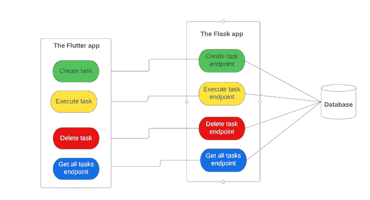

Flutter 应用程序将作为前端组件，用户将与它交互以创建、执行和删除待办任务。在应用程序启动时，Flutter 应用程序将自动向 Flask 服务器发送 HTTP `GET`请求，以获取存储在数据库中的所有创建的任务。对于创建、执行和删除操作，用户将通过单击相应的按钮显式触发对 Flask 服务器的请求。

虽然这些功能可以只使用 Flutter 应用程序而不需要后端服务来实现，但这里的目的是使用 Flutter 和 Flask 作为案例研究来演示您通常如何执行前端-后端集成。

Flask 应用程序执行的操作将与待办任务所在的数据库进行交互。Flask-SQLAlchemy ，一个用于将 [SQLAlchemy](https://www.sqlalchemy.org/) 与 Flask 轻松集成的库，将管理数据库操作。 [Flask-Marshmallow](https://flask-marshmallow.readthedocs.io/en/latest/) 和 [Marshmallow-SQLAlchemy](https://marshmallow-sqlalchemy.readthedocs.io/en/latest/index.html) 包将负责序列化和反序列化 Python 对象。

该应用程序中涉及的流程可以应用于任何其他全栈集成，只要它遵守构建和使用 API 的 REST 架构。也就是说，您可以使用任何其他 web 框架构建您的后端服务，并向 Flutter 应用程序公开端点，反之亦然。

## 构建 Flask 后端服务

让我们从构建后端服务开始。在您的终端中运行以下命令来设置 Flask 应用程序:

```
mkdir flask_todo
cd flask_todo
```

第一步是使用以下命令为应用程序创建并激活虚拟环境:

```
pip install pipenv
pipenv shell
```

上面的命令通过创建一个`Pipfile`来激活您的虚拟环境，该文件包含您将在应用程序中安装的所有包和依赖项。

接下来，安装 Flask 框架以及构建和运行应用程序所必需的依赖项。

```
pipenv install flask flask-sqlalchemy flask-marshmallow marshmallow-sqlalchemy
```

成功安装框架和依赖项后，您的`Pipfile`应该类似于下图:

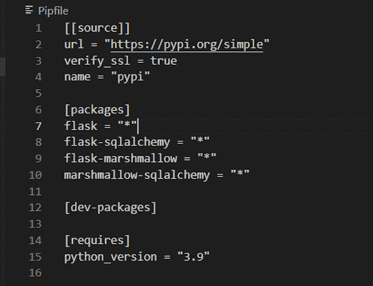

### 初始化 Flask 应用程序并配置数据库

创建一个名为`main.py`的 Python 文件，并按如下顺序将以下代码添加到代码中:

```
from flask import Flask, request, jsonify
from flask_sqlalchemy import SQLAlchemy
from flask_marshmallow import Marshmallow
import os

app = Flask(__name__)
basedir = os.path.abspath(os.path.dirname(__file__))

app.config['SQLALCHEMY_DATABASE_URI'] = 'sqlite:///' + os.path.join(basedir, 'db.sqlite')

# suppress SQLALCHEMY_TRACK_MODIFICATIONS warning
app.config['SQLALCHEMY_TRACK_MODIFICATIONS'] = False

db = SQLAlchemy(app)
ma = Marshmallow(app)
```

上面的代码片段设置并初始化 Flask 应用程序及其数据库配置。`basedir`变量代表根目录，您将在其中创建一个名为`db.sqlite`的文件。`db`和`ma`变量分别代表被初始化的`SQLAlchemy`和`Marshmallow`对象。

### `Todo`模型和模式

下面是`Todo`模型、模式创建和初始化的代码片段:

```
class TodoItem(db.Model):
    id = db.Column(db.Integer, primary_key=True)
    name = db.Column(db.String(100))
    is_executed = db.Column(db.Boolean)

    def __init__(self, name, is_executed):
        self.name = name
        self.is_executed = is_executed

# Todo schema
class TodoSchema(ma.Schema):
    class Meta:
        fields = ('id', 'name', 'is_executed')

# Initialize schema
todo_schema = TodoSchema()
todos_schema = TodoSchema(many=True)
```

每个`TodoItem`实体都有一个 ID、一个名称和一个由`is_executed`属性表示的执行状态。已经执行或完成的任务或待办事项的`is_executed`值为`True`，否则为`False`。

在任何时间点，您要么在单个`TodoItem`实体上执行操作，要么在多个实体上执行操作。`todo_schema`处理单个实体，而`todos_schema`处理使用`many=True`参数声明的多个实体。

### 数据库创建

通过在终端中运行`python`命令打开 Python shell。这将把 CLI 切换到 Python shell，在这里您将编写下面的 Python 脚本来创建数据库，如下所示:

```
from main import db
db.create_all()
exit()
```

*   `from main import db`:导入用`main.py`文件中的`db`变量初始化的 SQLAlchemy 对象
*   `db.create_all()`:创建 SQLite 数据库。运行此方法后，您会注意到在项目根文件夹中自动创建了一个包含编码内容的`db.sqlite`文件
*   `exit()`:退出 Python 外壳

以下是上述过程的直观表示:

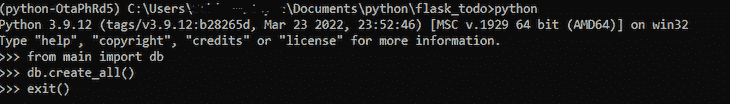

### 添加待办事项 API

为 Flutter 应用程序创建一个端点，以触发向数据库添加新的待办任务。

```
@app.route('/todo', methods=['POST'])
def add_todo():
    name = request.json['name']
    is_executed = request.json['is_executed']

    new_todo_item = TodoItem(name, is_executed)
    db.session.add(new_todo_item)
    db.session.commit()

    return todo_schema.jsonify(new_todo_item)
```

上述端点接收到一个`POST`请求，并期待一个带有`name`和`is_executed`键以及它们各自的值的 JSON 有效负载。使用从位于`main.py`文件顶部的 Flask 导入的`request`包，将`name`和`is_executed`键的值分别提取到`name`和`is_executed`变量中。然后创建一个新的`TodoItem`对象并保存到数据库。端点返回新创建的实体的 JSON 对象。

要验证端点是否按预期工作，请将以下内容添加到文件末尾:

```
if __name__ == '__main__':
    app.run(debug=True)
```

然后使用以下命令从您的终端运行该应用程序:

```
python main.py
```

默认情况下，应用程序将在端口 5000 上运行，如下所示:

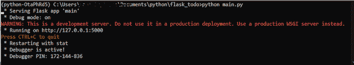

通过向`localhost:5000/todo`发送 POST 请求，继续从 Postman 测试端点。

### 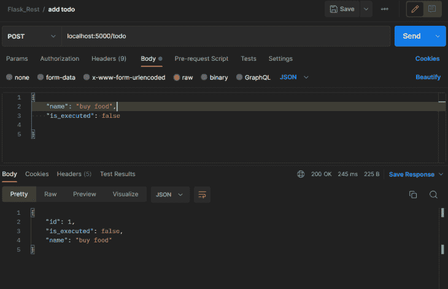

### 获取所有待办事项 API

下面的端点通过`/todo`路径接收一个`GET`请求，并负责获取所有已经在数据库中创建的`TodoItem`实体。

```
@app.route('/todo', methods=['GET'])
def get_todos():
    all_todos = TodoItem.query.all()
    result = todos_schema.dump(all_todos)

    return jsonify(result)
```

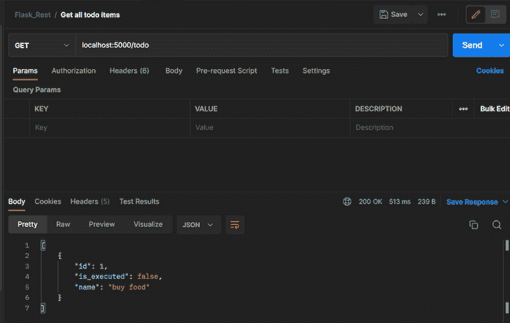

### 执行待办事项 API

```
@app.route('/todo/<id>', methods=['PUT', 'PATCH'])
def execute_todo(id):
    todo = TodoItem.query.get(id)

    todo.is_executed = not todo.is_executed
    db.session.commit()

    return todo_schema.jsonify(todo)
```

端点通过一个从数据库获取实体的`PUT`或`PATCH`请求接收`TodoItem`的 ID。然后，端点将`is_executed`属性的当前值转换为其相反的值，然后再将其保存到数据库中——也就是说，如果其当前值为`True`，则将其转换为`False`，反之亦然。

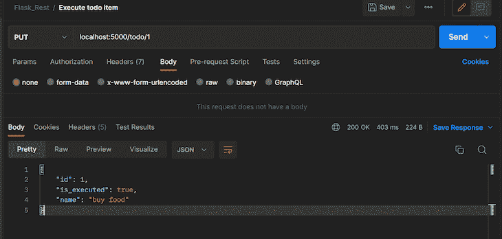

### 删除待办事项 API

下面是从数据库中删除一个`TodoItem`的端点:

```
@app.route('/todo/<id>', methods=['DELETE'])
def delete_todo(id):
    todo_to_delete = TodoItem.query.get(id)
    db.session.delete(todo_to_delete)
    db.session.commit()

    return todo_schema.jsonify(todo_to_delete)
```

端点通过一个从数据库获取实体的`DELETE`请求来接收`TodoItem`的 ID，并从数据库中删除项目。

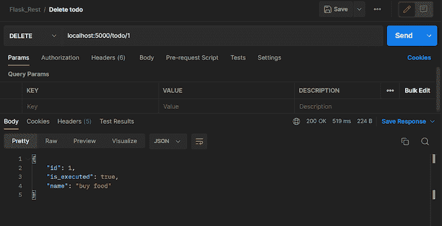

## 集成 Flutter 应用程序和 Flask 后端服务

通过在终端中运行以下命令，继续创建 Flutter 应用程序:

```
flutter create flutter_todo
```

安装以下依赖项:

*   [HTTP](https://pub.dev/packages/http) :这个包实现了 Flutter app 和 Flask 服务之间的网络通信
*   [提供者](https://pub.dev/packages/provider):这个包管理应用程序的状态。除了[的文档](https://pub.dev/packages/provider)，你还可以在这里了解提供商状态管理包

```
flutter pub add http

flutter pub add provider
```

### 构建模型

创建一个名为`todo_item`的 Dart 文件，并将下面的代码片段添加到该文件中:

```
class TodoItem{
  dynamic id;
  String itemName;
  bool isExecuted;

  TodoItem({this.id, required this.itemName, required this.isExecuted});
}
```

上面声明的类的属性类似于我们之前在 Flask 应用程序中创建的`TodoItem`的属性。每个颤动`TodoItem`对象的属性值将显示在屏幕上。

### 状态管理和与 Flask 应用程序通信

创建另一个名为`todo_provider`的 Dart 文件，并向其中添加以下代码:

```
import 'dart:convert';

import 'package:flutter/material.dart';
import 'package:todo/models/todo_item.dart';
import 'package:http/http.dart' as http;

class TodoProvider with ChangeNotifier{
  List<TodoItem> _items = [];
  final url = 'http://localhost:5000/todo';

  List<TodoItem> get items {
    return [..._items];
  }

  Future<void> addTodo(String task) async {
      if(task.isEmpty){
      return;
    }

    Map<String, dynamic> request = {"name": task, "is_executed": false};
    final headers = {'Content-Type': 'application/json'};
    final response = await http.post(Uri.parse(url), headers: headers, body: json.encode(request));
    Map<String, dynamic> responsePayload = json.decode(response.body);
    final todo = TodoItem(
        id: responsePayload["id"],
        itemName: responsePayload["name"],
```

[异步`addTodo`方法](https://dart.dev/codelabs/async-await)接收要创建的任务的名称，并使用该值构建请求有效负载，用于向 Flask 服务添加新的`TodoItem`。回想一下，创建新待办事项的 Flask 端点需要一个`POST`请求和一个带有键`name`和`is_executed`的请求体。请求中的`is_executed`键的值被设置为`false`，因为默认情况下，新创建的待办事项不应被执行，除非用户通过执行端点明确触发。`json.encode`操作将`request`映射格式化为一个 JSON 主体，以便它与 Flask 服务器期望的格式和结构兼容。

**注意**:如果你从模拟器运行应用程序，将基本 URL 从`localhost`替换为`10.0.2.2`。也就是说，`url`变量的值应该是`[http://10.0.2.2:5000/todo](http://10.0.2.2:5000/todo)`。这是因为模拟器上的`localhost`没有指向`127.0.0.1`；这可能会导致您的应用程序在从模拟器向本地服务器发送 HTTP 请求时失败。来自 Flask 服务器的响应正文包含以下格式的 JSON 正文:

```
{
    "id": 1,
    "is_executed": false,
    "name": "buy food"
}
```

服务器自动为新创建的`TodoItem`创建一个 ID，并将其作为响应主体的一部分返回。JSON 主体的值被解组到 Flutter `TodoItem`对象中，并添加到`_items`列表中。来自 [`ChangeNotifier`类](https://api.flutter.dev/flutter/foundation/ChangeNotifier-class.html)的`notifyListeners()`方法通知所有监听器关于新`TodoItem`添加的应用程序状态。

下面是从后端获取所有`TodoItem`实体的实现:

```
 Future<void> get getTodos async {
    var response;
    try{
      response = await http.get(Uri.parse(url));
      List<dynamic> body = json.decode(response.body);
      _items = body.map((e) => TodoItem(
          id: e['id'],
          itemName: e['name'],
          isExecuted: e['is_executed']
      )
      ).toList();
    }catch(e){
      print(e);
    }

    notifyListeners();
  }
```

上面的`getTodos`方法异步地向后端服务器发送一个`GET`请求，以获取所有创建的`TodoItem`实体作为一个 JSON 列表。然后，它遍历响应体，将值解组到`TodoItem`对象中。

```
Future<void> deleteTodo(int todoId) async {
    var response;
    try{
      response = await http.delete(Uri.parse("$url/$todoId"));
      final body = json.decode(response.body);
      _items.removeWhere((element) => element.id == body["id"]);
    }catch(e){
      print(e);
    }
    notifyListeners();
  }
```

`deleteTodo`方法负责删除数据库和 Flutter app 中的`TodoItem`实体。它通过以预期的格式向后端 API 发出 HTTP `DELETE`请求来执行这个操作。响应正文包含已删除项目的 JSON 有效负载。使用该项目的 ID，该对象也在`_items`列表中被识别并移除。

最后，下面的`executeTask`方法期待`TodoItem`的 ID，并向期待此请求的 Flask 端点发送一个`PATCH`请求。服务器执行该任务，如本教程的 Flask API 部分所述，然后它返回一个响应体，该响应体包含已执行的`TodoItem`，其`is_executed`属性的值被翻转。也就是说，如果`TodoItem`在向服务器发送请求之前有一个`false`的`is_executed`值，它将返回一个`true`值，反之亦然。

```
 Future<void> executeTask(int todoId) async {
    try{
        final response = await http.patch(Uri.parse("$url/$todoId"));
        Map<String, dynamic> responsePayload = json.decode(response.body);
        _items.forEach((element) => {
        if(element.id == responsePayload["id"]){
            element.isExecuted = responsePayload["is_executed"]
        }
        });
    }catch(e){
      print(e);
    }
    notifyListeners();
  }
```

创建一个`tasks.dart`文件，并在该文件中添加以下代码:

```
import 'package:flutter/material.dart';
import 'package:provider/provider.dart';

import '../providers/todo_provider.dart';

class TasksWidget extends StatefulWidget {
  const TasksWidget({Key? key}) : super(key: key);

  @override
  State<TasksWidget> createState() => _TasksWidgetState();
}

class _TasksWidgetState extends State<TasksWidget> {
  TextEditingController newTaskController = TextEditingController();

  @override
  Widget build(BuildContext context) {
    return Padding(
      padding: const EdgeInsets.all(20.0),
      child: Column(
        children: [
          Row(
            children: [
              Expanded(
                child: TextFormField(
                  controller: newTaskController,
                  decoration: InputDecoration(
                    labelText: 'New Task',
                    border: OutlineInputBorder(),
                  ),
                ),
              ),
              SizedBox(width: 10,),
              ElevatedButton(
                  style: ButtonStyle(
                      backgroundColor: MaterialStateProperty.all(Colors.amberAccent),
                      foregroundColor: MaterialStateProperty.all(Colors.purple)
                  ),
                  child: Text("Add"),
                  onPressed: () {
                    Provider.of<TodoProvider>(context, listen: false).addTodo(newTaskController.text);
newTaskController.clear();
                  }
              )
            ],
          ),
          FutureBuilder(
            future: Provider.of<TodoProvider>(context, listen: false).getTodos,
            builder: (ctx, snapshot) =>
            snapshot.connection state == ConnectionState.waiting
                ? Center(child: CircularProgressIndicator())
                :
            Consumer<TodoProvider>(
              child: Center(
                heightFactor: MediaQuery.of(context).size.height * 0.03,
                child: const Text('You have no tasks.', style: TextStyle(fontSize: 18),),
              ),
              builder: (ctx, todoProvider, child) => todoProvider.items.isEmpty
                  ?  child as Widget
                  : Padding(
                padding: const EdgeInsets.only(top: 20),
                child: Container(
                  height: MediaQuery.of(context).size.height * 0.6,
                  child: ListView.builder(
                      itemCount: todoProvider.items.length,
                      itemBuilder: (ctx, i) => Padding(
                        padding: const EdgeInsets.only(bottom: 10.0),
                        child: ListTile(
                          tileColor: Colors.black12,
                          leading: Checkbox(
                              value: todoProvider.items[i].isExecuted,
                              activeColor: Colors.purple,
                              onChanged:(newValue) {
                                Provider.of<TodoProvider>(context, listen: false).executeTask(todoProvider.items[i].id);
                              }
                          ),
                          title: Text(todoProvider.items[i].itemName),
                          trailing: IconButton(
                              icon: Icon(Icons.delete, color: Colors.red),
                              onPressed: ()  {
                                Provider.of<TodoProvider>(context, listen: false).deleteTodo(todoProvider.items[i].id);
                              }
                          ) ,
                          onTap: () {},
                        ),
                      )
                  ),
                ),
              ),
            ),
          )
        ],
      ),
    );
  }
}
```

`TaskWidget`类是一个有状态的小部件，负责构建用户将与之交互的应用程序的界面和小部件。小部件通过调用`TodoProvider`类的`addTodo`方法和已创建任务的`ListView`,使`TextInputField`接收新任务的值，`ElevatedButton`提交输入值。

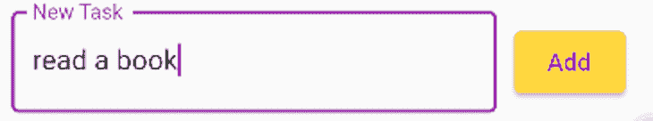

当小部件构建时，它通过调用`TodoProvider`类中的`getTodos`方法获取数据库中所有创建的项目。屏幕上的每个任务都是一个`ListTile`，其中包含一个复选框、任务名称和一个删除图标。每次点击复选框都会调用`TodoProvider`执行方法来改变后端服务器和 Flutter 应用程序中的`TodoItem`对象的`isExecuted`值。点击删除图标调用`deleteTodo`方法来删除选中的任务。


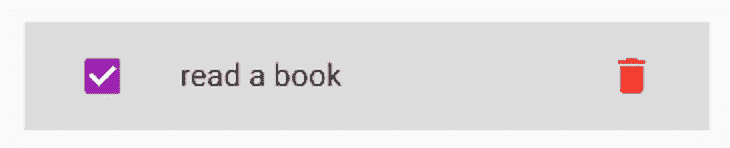

下面是作为应用程序入口点的`main.dart`文件的内容:

```
import 'package:flutter/material.dart';
import 'package:provider/provider.dart';
import 'package:todo/providers/todo_provider.dart';
import 'package:todo/widgets/tasks.dart';

void main() {
  runApp(const MyApp());
}

class MyApp extends StatelessWidget {
  const MyApp({super.key});

  @override
  Widget build(BuildContext context) {
    return ChangeNotifierProvider.value(
        value: TodoProvider(),
      child: MaterialApp(
      debugShowCheckedModeBanner: false,
      title: 'Flutter Demo',
      theme: ThemeData(
        primarySwatch: Colors.purple,
      ),
      home: const MyHomePage(title: 'Todo app'),
    )
    );
  }
}

class MyHomePage extends StatefulWidget {
  const MyHomePage({super.key, required this.title});
  final String title;

  @override
  State<MyHomePage> createState() => _MyHomePageState();
}

class _MyHomePageState extends State<MyHomePage> {

  @override
  Widget build(BuildContext context) {
    return Scaffold(
      resizeToAvoidBottomInset: false,
      appBar: AppBar(
        title: Text(widget.title),
        centerTitle: true,
      ),
      body: TasksWidget(),
    );
  }
}
```

## 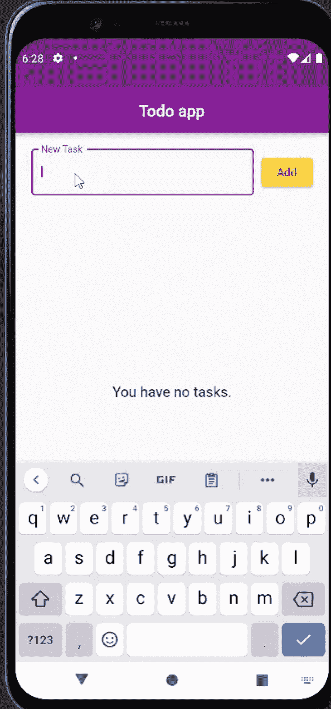

## 结论

根据所选择的网络通信机制，在不同的前端和后端框架中，集成前端应用程序和后端服务的过程非常相似。本教程演示了如何通过 Restful API 架构将前端的 Flutter 应用程序与后端的 Flask 服务集成在一起。这里采用的 HTTP 通信概念可以应用于您可能选择的其他前端和后端框架。

你可以在[这个报告](https://github.com/olu-damilare/flutter-todo)中查看 Flutter 应用的代码库，这里是 Flask 服务的[代码。](https://github.com/olu-damilare/flask-todo)