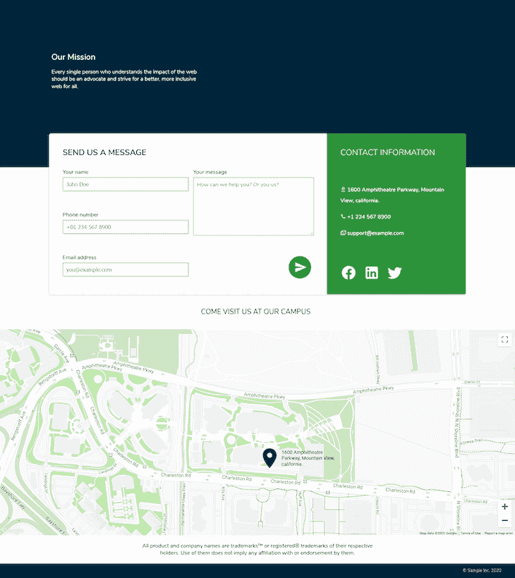
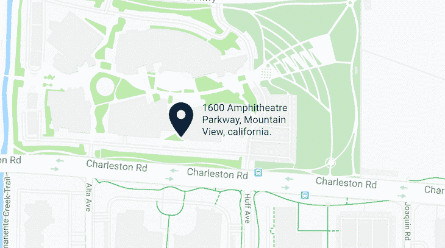

# 整合谷歌地图和 React - LogRocket 博客

> 原文：<https://blog.logrocket.com/integrating-google-maps-react/>

***编者按**:本帖于 2021 年 11 月 5 日审核更新。*

引用英国科幻作家亚瑟·查理斯·克拉克的一句话，“任何足够先进的技术都和魔法没什么区别。”

我们可能认为这是理所当然的，但谷歌地图在许多方面都是一个现代奇迹。它允许的可能性是无限的，可以为您的企业和用户提供真正的价值。从显示你的办公室位置到显示包裹递送的路线，[谷歌地图足够灵活和强大，可以处理各种各样的用例](https://blog.logrocket.com/react-native-maps-introduction/)。

## 在 React 中使用谷歌地图

事实上，有很多原因可以让你选择将谷歌地图集成到 React 应用中，我们来看看其中最受欢迎的一个:显示你的公司地址。如果您愿意，您可以将此作为其他更复杂案例的基础。

因为谷歌地图是如此的强大和复杂，我们需要一个名副其实的 [google-map-react](https://www.npmjs.com/package/google-map-react) 包来帮助我们将其集成到 react 应用中。这个包是一个在 Google Maps API 上编写的组件，它允许你在 Google Map 上呈现任何 React 组件。它得到了积极的维护，使用起来非常简单，是我在 React 项目中集成谷歌地图的默认选择。

然而，在我们开始构建之前，这里有一些你可能想把谷歌地图放在你的网站(或网络应用)上的原因:

*   提供到您公司地址的方向
*   显示活动路线(如音乐会或会议)
*   提供运输物品位置的实时更新
*   展示世界各地有趣的地方

这只是 Google Maps API 提供的一小部分功能，您可能还有其他业务需求。对于本指南，我们将构建一个包含显示企业地址的地图的联系页面，因为这是我遇到的最常见的用例。google-map-react 团队提供了一份[示例清单](https://github.com/google-map-react/google-map-react#examples)，如果你需要更高级的东西，你可以浏览一下。

## 将谷歌地图添加到 React 应用程序的要求

如果你想和我一起编码，你需要以下:

1.  React 应用程序设置
2.  谷歌地图 API 密钥(免费)
3.  十分钟的时间

我已经建立了一个示例存储库，您可以按照它进行克隆。运行以下命令将存储库克隆到您的本地计算机:

```
git clone https://github.com/ovieokeh/contact-page-with-google-maps.git
```

克隆完成后，运行`npm install`安装所有的项目依赖项，然后运行`npm run start`在新的选项卡中打开项目。您应该会看到一个没有集成谷歌地图的样本联系页面。在本教程的其余部分，我们将创建一个 React 组件来保存 Google 地图并将其嵌入到联系人页面中。

至于谷歌地图 API 密匙，你可以按照谷歌地图文档上的说明免费获得一个。请注意，您将需要设置一个计费帐户，以摆脱随之而来的限制和水印。

一旦你把这些都准备好，我们就可以开始建造了。我们将构建的最终版本如下所示:



## 将谷歌地图集成到 React 中

再次重申，我不会查看联系人页面的所有代码，因为本文主要关注的是将 Google Map 集成到 React 项目中。以下是我们将要遵循的步骤:

1.  创建一个 React 组件来保存地图(`Map.jsx`)
2.  创建另一个 React 组件来标记地图上的地址(`LocationPin.jsx`)
3.  将地图组件嵌入联系人页面

### `Map.jsx`

```
mkdir src/components/map && touch src/components/Map.jsx
```

运行上面的命令，在`/components`文件夹中创建一个新文件。在这个文件中，我们将编写地图组件和地址 pin 的代码。但是，在我们开始编写任何代码之前，我们必须通过运行以下命令来安装 google-map-react 包:

```
yarn add google-map-react
```

安装完软件包后，我们还需要其他东西:我们公司地址的坐标。这意味着可以在谷歌上快速搜索你公司地址的经度和纬度值。我使用的是谷歌的圆形剧场地址，所以我做了一个快速搜索，得到了以下值:

```
const location = {
  address: '1600 Amphitheatre Parkway, Mountain View, california.',
  lat: 37.42216,
  lng: -122.08427,
}
```

当然，您的地址的值会有所不同。如上所示将值存储在对象中，我们将这些值传递给`Map`组件，这样我们就可以在地图上呈现一个大头针。因此，概括一下，您需要以下数据:

1.  谷歌地图 API 密钥
2.  `google-map-react`已安装
3.  您公司地址的经度和纬度值

因为我们有了所有这些数据，所以我们可以开始构建`Map`组件。如果您想看到最终的代码，可以查看您之前克隆的 repo 上的`add-map`分支，否则，继续学习教程，学习如何自己构建它。

还在`src/components/map/Map.jsx`里面，导入 React，`google-map-package`，以及相应的 CSS，像这样:

```
import React from 'react'
import GoogleMapReact from 'google-map-react'
import './map.css'
```

你可以从这里的回购中获取`map.css` [的内容。](https://github.com/ovieokeh/contact-page-with-google-maps/blob/add-map/src/components/map/map.css)

创建一个新的`Map`组件，它接受两个道具:

```
const Map = ({ location, zoomLevel }) => (
  <div className="map">
    <h2 className="map-h2">Come Visit Us At Our Campus</h2>

    <div className="google-map">
      <GoogleMapReact
        bootstrapURLKeys={{ key: '' }}
        defaultCenter={location}
        defaultZoom={zoomLevel}
      >
        <LocationPin
          lat={location.lat}
          lng={location.lng}
          text={location.address}
        />
      </GoogleMapReact>
    </div>
  </div>
)
```

你能猜出`location`道具是什么吗？它是我们之前创建的保存位置的地址、纬度和经度值的对象。`zoomLevel`是一个从 0 到 20 的整数，它决定了[地图在屏幕上渲染时的比例](https://developers.google.com/maps/documentation/javascript/interaction#zoom)。

您会注意到`GoogleMapReact`组件接受一个子组件`LocationPin`，但是请注意它可以接受任意数量的子组件。`LocationPin`会在我们用`lat`和`lng`道具指定的位置将`text`道具渲染到地图上方。我们将在下一节创建这个组件。

现在让我们检查一下传递给`GoogleMapReact`组件的道具，以了解每个道具的作用:

1.  `bootstrapURLKeys`是一个对象，保存着您从 Google 控制台复制的 API 密钥。现在，您可以在这里硬编码密钥，但是对于提交给 GitHub 或者可以公开访问的代码，不建议这样做。你可以查看[这篇关于如何在客户端保护你的 API 密匙的讨论](https://www.freecodecamp.org/forum/t/keeping-api-key-hidden-using-react/272539)
2.  第一次加载时，`defaultCenter`只是地图的中心
3.  `defaultZoom`定义地图的初始比例

仅这一点就足以在屏幕上呈现一个基本的地图，但是在我们可以呈现这个组件之前，我们需要做一些其他的事情。我们需要为`LocationPin`写代码。

### `LocationPin`



LocationPin can mark wherever we want on the map.

我们想要一种方法来将用户的注意力吸引到地图上的特定位置。因为 google-map-react 允许我们在地图上呈现任何 react 组件，所以我们可以创建一个显示大头针图标和文本的简单组件。

对于图标，我将使用 Iconify 库，这是一个免费 SVG 图标的集合。仍然在我们一直在工作的同一个文件中，像这样导入下面的包:

```
import { Icon } from '@iconify/react'
import locationIcon from '@iconify/icons-mdi/map-marker'
```

然后继续定义`LocationPin`组件，如下所示:

```
const LocationPin = ({ text }) => (
  <div className="pin">
    <Icon icon={locationIcon} className="pin-icon" />
    <p className="pin-text">{text}</p>
  </div>
)
```

我确信这个组件是不言自明的。请注意，`LocationPin`的样式已经包含在`map.css`中，但是您可以随心所欲地对其进行样式化。

我们实际上已经完成了这个教程。我们现在需要做的就是导出`Map`组件，并将其包含在联系人页面中。在文件的底部，导出`Map`组件:

```
export default Map
```

### 使用`Map`组件

因为`Map`组件只是一个 React 组件，我们可以在任何我们喜欢的地方使用它。打开`src/App.jsx`，导入地图组件，将其包含在`ContactSection`和`DisclaimerSection`之间，像这样:

```
import React from 'react'

import IntroSection from './components/intro/Intro'
import ContactSection from './components/contact-section/ContactSection'
import MapSection from './components/map/Map' // import the map here
import DisclaimerSection from './components/disclaimer/Disclaimer'
import FooterSection from './components/footer/Footer'

import './app.css'

const location = {
  address: '1600 Amphitheatre Parkway, Mountain View, california.',
  lat: 37.42216,
  lng: -122.08427,
} // our location object from earlier

const App = () => (
  <div className="App">
    <IntroSection />
    <ContactSection />
    <MapSection location={location} zoomLevel={17} /> {/* include it here */}
    <DisclaimerSection />
    <FooterSection />
  </div>
)

export default App
```

现在，通过在您的终端中运行`yarn start`并导航到`localhost:3000`来启动项目。你应该会看到你的联系页面，上面有一张漂亮的地图，标明了你的公司地址。很漂亮，对吧？

## 结论

用不到 100 行代码，我们已经能够集成谷歌地图来显示我们的办公室位置，以及一个视觉标记来精确定位地址。这是一个你可以用谷歌地图反应完成的基本例子。

他们的文档中有更多比这个相当简单的用例更高级的例子。希望这篇教程对你有所帮助，祝❤.编码快乐

## 使用 LogRocket 消除传统反应错误报告的噪音

[LogRocket](https://lp.logrocket.com/blg/react-signup-issue-free)

是一款 React analytics 解决方案，可保护您免受数百个误报错误警报的影响，只针对少数真正重要的项目。LogRocket 告诉您 React 应用程序中实际影响用户的最具影响力的 bug 和 UX 问题。

[ ](https://lp.logrocket.com/blg/react-signup-general) [  ](https://lp.logrocket.com/blg/react-signup-general) [LogRocket](https://lp.logrocket.com/blg/react-signup-issue-free)

自动聚合客户端错误、反应错误边界、还原状态、缓慢的组件加载时间、JS 异常、前端性能指标和用户交互。然后，LogRocket 使用机器学习来通知您影响大多数用户的最具影响力的问题，并提供您修复它所需的上下文。

关注重要的 React bug—[今天就试试 LogRocket】。](https://lp.logrocket.com/blg/react-signup-issue-free)