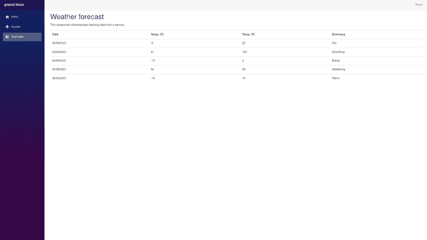
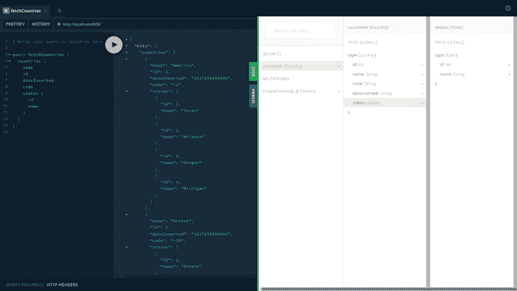
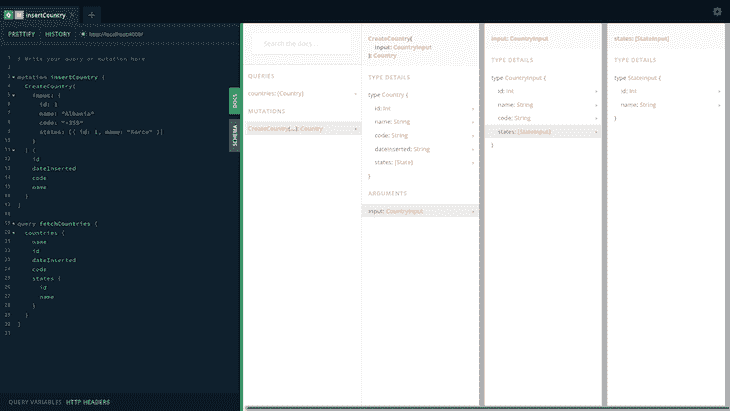
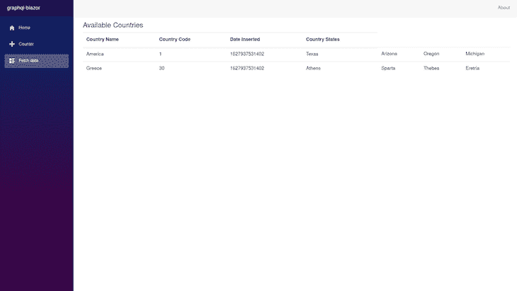
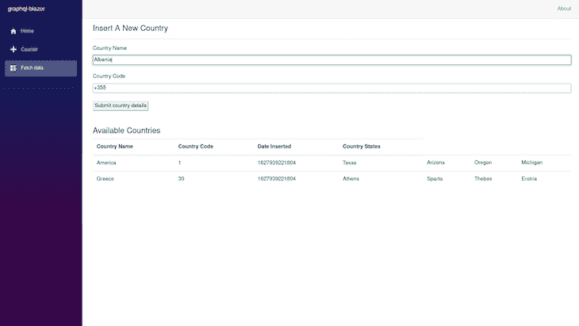
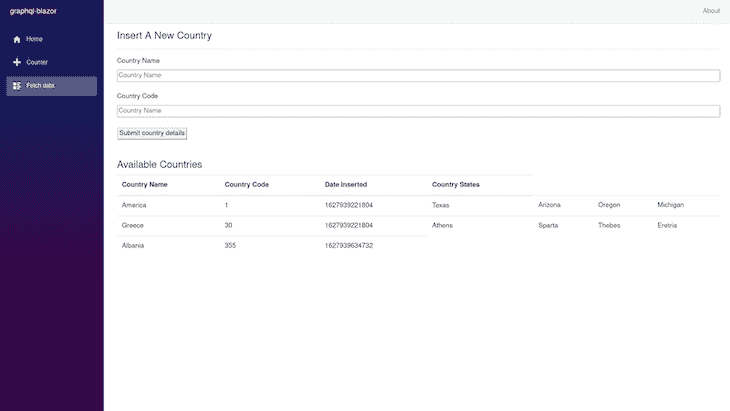

# 在 Blazor 应用程序中集成 GraphQL

> 原文：<https://blog.logrocket.com/integrating-graphql-blazor-application/>

在最近的 JS State 调查中，开发人员对 GraphQL 的满意度高达 94 %, graph QL 正迅速成为开发人员在 web 应用程序中使用数据时的默认 API 选择。

GraphQL 承诺的性能提升是它在不同规模的应用程序中被越来越多采用的主要原因。

在本教程中，我们将学习如何在 Blazor WebAssembly 应用程序中使用 GraphQL API 中的数据。虽然我们不会考虑使用 GraphQL 对性能的影响，但我们将关注如何将 GraphQL API 集成到应用程序中。

## 入门指南

在开始本教程之前，请确保您对 C#有初步的了解，并有[。NET SDK](https://dotnet.microsoft.com/download/dotnet/5.0) 安装在您的本地计算机上。

## GraphQL 是什么？

Graph Query Language，通常称为 GraphQL，是一种 API 技术，它允许客户端通过请求查询所需的确切数据，以声明的方式从服务器获取数据。

使用 GraphQL API 时，可以对 GraphQL 服务器执行以下三个操作:

*   一个查询，类似于 REST API 中从服务器获取数据的`GET` HTTP 动词
*   一种变体，类似于 REST API 中的`POST`、`UPDATE`和`DELETE` HTTP 动词
*   订阅，连接到 GraphQL 服务器以重新提取数据，而无需重新启动连接

在本文中，我们将从 Blazor 应用程序对预构建的 Node.js 应用程序执行查询和变异操作。这将在启动时公开一个 GraphQL 端点。

首先，[在您的终端上使用 Git CLI 从 GitHub 存储库](https://github.com/vickywane/blazor-graphql-api.git)克隆 GraphQL 应用程序:

```
git clone https://github.com/vickywane/blazor-graphql-api.git

```

接下来，执行下面的命令，将终端的当前目录更改为克隆的`blazor-graphql-api`项目，并在项目中安装`package.json`文件中列出的两个依赖项:

```
# change directory
cd blazor-graphql-api

# install dependencies
npm install

```

安装项目依赖项后，执行以下命令启动应用程序:

```
yarn start

```

上面的命令执行项目中的`index.js`文件，该文件使用 [ApolloServer](https://www.apollographql.com/docs/apollo-server/) 在本地主机上运行 GraphQL 服务器，使其可以在端口`4000`访问。

保持 GraphQL 应用程序运行，直到本教程结束，因为我们将在本教程的后面部分使用 GraphQL API。

## 将 GraphQL 引入 Blazor

Blazor 是一个开源框架，允许开发人员利用 WebAssembly 使用 C#构建交互式用户界面。这允许非 JavaScript 代码在浏览器中执行。

一些可用于在. NET 应用程序中使用 GraphQL API 的客户端库包括:

对于本文，我们将使用 graphql-dotnet 库，因为它可以更快地启动。

## 演示 Blazor 应用程序

我们将从使用默认样板页面引导一个新的 Blazor 应用程序开始，并重写`FetchData.razor`页面以使用从 GraphQL API 获取的数据。

从本地终端执行以下命令，通过 dotnet CLI 创建一个新的 Blazor 应用程序:

```
dotnet new blazorserver -o BlazorApp --no-https

```

上面的命令创建了一个新目录，其中包含一个名为`Graphql-blazor`的. NET 5.0 应用程序，该应用程序具有使用 Razor 语法呈现的`FetchData`、`Counter`和`Index`页面[。](https://blog.logrocket.com/js-free-frontends-blazor/)

接下来，使用 dotnet CLI 将下面的包引用添加到新项目中:

```
# Graphql package
dotnet add package Graphql 

# NewtonsoftJsonSerializer package
dotnet add package GraphQL.Client.Serializer.Newtonsoft 

# GraphQLHttpClient package
dotnet add package GraphQL.Client.Http

```

上面安装的包将 Blazor 应用程序连接到一个 GraphQL API。

通过打开的终端，将默认的终端目录更改为`Graphql-blazor`目录，通过执行下面的命令，在手表模式下启动应用程序:

```
dotnet watch run

```

执行上面的命令后，Blazor 服务器在本地主机的端口`5000`上运行。

此时，我们可以通过 web 浏览器在 [http://localhost:5000](http://localhost:5000) 查看正在运行的应用程序。然而，我们的重点将放在[的`fetchData`页面上，该页面显示了天气预报的列表。](http://localhost:5000/fetchdata)

该表元素详细描述了从`fetchData.razor`文件中呈现的五天预测。



通过呈现上面页面的`fetchData.razor`文件， [`OnInitializedAsync`生命周期方法](https://docs.microsoft.com/en-us/aspnet/core/blazor/components/lifecycle?view=aspnetcore-5.0#component-initialization-oninitializedasync)从`data/WeatherForecastService`文件的`WeatherForecastService`类中的`GetForecastAsync`方法获取模拟预测数据。

接下来，我们将把天气预报数据改为国家数据，以展示如何使用外部 GraphQL API。

为此，我们必须创建一个新的`GraphqlService`类，包含一个 GraphQL 客户端，以及一个执行 GraphQL 查询的方法，该查询通过 GraphQL 客户端获取数据。

## 定义 GraphQL 数据

类似于在 C#应用程序中存储数据，我们必须创建具有字段和属性的类来存储和组织从每个 GraphQL 操作返回的数据。

不通过 API 的代码库，了解 GraphQL API 的模式定义的一种方法是通过自省 GraphQL API 模式。

大多数 GraphQL APIs 都有一个运动场，允许用户针对 API 编写和执行 GraphQL 操作。操场上的 Docs 部分也允许用户使用 web 浏览器反省 API。

在您的 web 浏览器中打开 GraphiQL Playground，在 http://localhost:4000 处找到克隆的 GraphQL API。

我们将执行下面的查询来检索 GraphQL 应用程序中所有现有的国家:

```
 query {
    name
    id
    dateInserted
    states {
      id
      name
    }
  }

```

点击灰色的**播放**按钮执行上面的查询。这将在请求完成后返回一个数据对象。

单击 GraphiQL Playground 中的绿色 **Docs** 按钮，打开模式定义，我们可以在其中检查 API 中的 GraphQL 操作，包括它们的返回类型。

下图显示了克隆的 GraphQL API 中的单个`countries`查询的模式定义，该查询返回包含一个`id`、`name`、`code`、`dateInserted`的国家数组和一个嵌套的`states`数组。



切换到突变，从 GraphiQL playground 执行下面代码块中的文字，对 GraphQL API 执行一个突变操作来创建一个国家。

克隆的 GraphQL API 中单个`CreateCountries`突变的模式定义接受一个整数 ID，以及字符串类型的名称和代码。这将返回一个包含一个`id`、`name`、`code`、`dateInserted`和一个嵌套的`states`数组的对象。



现在我们已经知道了变异和查询操作返回的数据类型，我们可以继续创建类来在 Blazor 应用程序中构建它们。

在`data`目录下创建一个`GraphqlData.cs`文件。这存储了获取可用国家/地区的返回查询数据定义。

下面的文件包含四个类，它们定义了从查询和变异操作返回的数据结构:

```
// ./data/GraphqlData.cs
using System.Collections.Generic;

namespace graphql_blazor.Data
{
    public class CreateCountry
    {
        public int id { get; set; }
        public string name { get; set; }
        public string dateInserted { get; set; }
        public string code { get; set; }
    } 

    public class GraphqlData
    {
        public List<Countries> countries { get; set; }
    }

    public class Countries
    { 
        public string name { get; set; }
        public int id { get; set; }
        public string dateInserted { get; set; }
        public int code { get; set; }

        public List<State> states { get; set; }
    }

    public class State
    {
        public int id { get; set; }

        public string name { get; set; }
    }
}

```

从最顶层的类开始，`GraphqlData`使用来自[通用名称空间](https://docs.microsoft.com/en-us/dotnet/api/system.collections.generic?view=net-5.0)的[列表集合](https://docs.microsoft.com/en-us/dotnet/api/system.collections.generic.list-1?view=net-5.0)和公共`Countries`类来描述整个数据响应。

`Countries`类包含`name`、`id`、`code`、`dateInserted`属性，`State`类包含`name`和`id`属性。

所有这些类都使用较短的自动属性语法来定义每个类中的`GET` / `SET`访问器，并且它们都被标记为`public`。

## 创建单一服务

接下来，我们必须创建一个定制的单体服务来创建 GraphQL 客户端。这将应用程序通过其 URL 端点连接到克隆的 GraphQL 应用程序。方法也通过连接的 API 发送 GraphQL 操作。

首先，创建一个`GraphqlService.cs`文件，并添加以下代码块的内容:

```
# ./data/GraphqlService.cs

using GraphQL.Client.Serializer.Newtonsoft;
using GraphQL.Client.Http;

namespace graphql_blazor.Data
{
    public class GraphqlService
    {
       private readonly GraphQL.Client.Http.GraphQLHttpClient _graphqlClient =
        new GraphQLHttpClient("http://localhost:4000", new NewtonsoftJsonSerializer());
 }
}

```

注意，在部署这个应用程序时，考虑使用[环境变量来存储和检索 GraphQL API 端点 URL](https://docs.microsoft.com/en-us/dotnet/api/system.environment.getenvironmentvariable) ，而不是将其硬编码在类中。

## 创建 GraphQL 查询

有了在`GraphqlService`类中可用的 GraphQL 客户端实例，下一步是使用该实例发送 GraphQL 查询操作。

为此，将下面的代码块添加到`GraphqlService.cs`文件中:

```
// ./data/GraphqlService.cs

using GraphQL.Client.Serializer.Newtonsoft;
using GraphQL;
using GraphQL.Client.Http;
using System.Threading.Tasks;

namespace graphql_blazor.Data
{
    public class GraphqlService
    {
       private readonly GraphQL.Client.Http.GraphQLHttpClient _graphqlClient =
       new GraphQLHttpClient("http://localhost:4000", new NewtonsoftJsonSerializer());

        private readonly GraphQLRequest _fetchCountriesQuery = new GraphQLRequest
        {
            Query = @"
            query FetchCountries {
                countries {
                    name
                    id
                    dateInserted
                    code
                    states {
                      id
                      name
                    }
                  }
            }
        ",
            OperationName = "FetchCountries"
        };

        public async Task<GraphQL.GraphQLResponse<graphql_blazor.Data.GraphqlData>> FetchCountries()
        {
            var fetchQuery = await _graphqlClient.SendQueryAsync<GraphqlData>(_fetchCountriesQuery);

            return fetchQuery;
        }
    }
}

```

这个代码块包含一个保存 GraphQL 查询字符串的新私有字段和一个异步方法`FetchCountries`，该方法从 GraphQL 客户端类执行`SendQueryAsync`方法。

这将从连接的 GraphQL API 获取数据并返回结果。

## 创建 GraphQL 变异

除了 GraphQL 查询之外，我们希望将更多的国家数据插入到 GraphQL 应用程序中。这可以通过在`GraphqlService`类中实现一个变异来实现。

将下面代码块中的新方法添加到`/data/GraphqlService.cs`文件中，通过连接的 GraphQL API 向克隆的 GraphQL 应用程序发送 GraphQL 变异。

这将一个新的参数化方法`InsertCountry`添加到`GraphqlService`类中:

```
# ./data/GraphqlService.cs

using GraphQL.Client.Serializer.Newtonsoft;
using GraphQL;
using GraphQL.Client.Http;
using System.Threading.Tasks;

        public async Task InsertCountry(string countryName, string code)
        {
            var createCountryMutationString = new GraphQLRequest
            {
                Query = @"            
                 mutation insertCountry($code : String, $countryName : String) {
                   CreateCountry(input: {
                       name: $countryName
                       code: $code
                     }) 
                    {
                      id
                      dateInserted
                      code
                      name
                     }
                 }
             ",
                OperationName = "insertCountry",
                Variables = new
                {
                    countryName,
                    code
                }
            };

            await _graphqlClient.SendMutationAsync<CreateCountry>(createCountryMutation);
        }

```

`InsertCountry`方法签名包含两个字符串参数，当执行时，`createCountryMutation`变量形成，包含带有`countryName`和`code`参数值的变异的 GraphQL 字符串。

最后，GraphQL 客户端实例的`SendMutationAsync`方法通过连接的 GraphQL API 发送包含在`createCountryMutation`变量中的突变。

在下一节中，当我们重新构建样板文件`fetchData.razor`以使用`GraphqlService`类时，我们将测试添加到`GraphqlService`类中的两个新方法。

## 重建`FetchData`页面

到目前为止，我们创建了一个包含两个方法的`GraphqlService`类，分别发送一个突变和查询操作。我们现在只剩下从`fetchData`页面执行这些方法。

然而，我们必须首先将定制的`GraphqlService`服务添加到应用程序中已配置的服务中，然后才能将其注入到`fetchData`组件中。

使用您的代码编辑器，打开`Startup.cs`文件，将新的`GraphqlService`类添加到`Startup`类的`ConfigureServices`方法中的现有默认服务列表中:

```
# ./Startup.cs

    services.AddSingleton<GraphqlService>();

```

接下来，用下面代码块的内容替换`fetchData.razor`文件中的整个代码，重新设计`FetchData`页面。这允许我们使用`GraphqlService`服务中的方法:

```
//./pages/fetchData.cs
@page "/fetchdata";

@using graphql_blazor.Data;
@using System.ComponentModel.DataAnnotations
@inject GraphqlService GraphqlOps;

<section>
    <h4> Available Countries </h4>

    <div>
        @if (countriesData == null)
        {
            <p>
                <em>Loading...</em>
            </p>
        }
        else
        {
            <table class="table">
                <thead>
                <tr>
                    <th>Country Name</th>
                    <th>Country Code </th>
                    <th> Date Inserted </th>
                    <th>Country States </th>
                </tr>
                </thead>
                <tbody>
                @foreach (var item in countriesData.Data.countries)
                {
                    <tr>
                        <td>@item.name</td>
                        <td>@item.code</td>
                        <td format-value="yyyy-MM-dd" >@item.dateInserted</td>

                        @if (item.states != null)
                        {
                            @foreach (var state in item.states)
                            {
                                <td> @state.name </td>
                            }
                        }

                    </tr>
                }
                </tbody>
            </table>
        }
    </div>
</section>

@code {
   // countries state data
    private GraphQL.GraphQLResponse<graphql_blazor.Data.GraphqlData> countriesData;

    private async Task FetchCountryData()
    {
        countriesData = await GraphqlOps.FetchCountries();
    } 

    // Executed immediately component is created
    protected override async Task OnInitializedAsync()
    {
        await FetchCountryData();
    }
}

```

上面的组件被重新设计，通过`@inject`自定义指令注入`GraphqlService`服务。

立即创建了`FetchData`组件，`OnInitializedAsync`生命周期方法执行`FetchCountryData`方法，该方法在 HTTP 请求中向克隆的 GraphQL 应用程序发送 GraphQL 查询。

从`FetchCountryData`返回的查询结果中的数据存储在`countriesData`本地状态中。

当组件的界面在`OnInitializedAsync`生命周期事件执行之后呈现时，存储在`countriesData`组件状态中的查询结果数据呈现了从 GraphQL API 返回的国家列表。

在您的本地浏览器中打开位于[http://localhost:5000/fetch data](http://localhost:5000/fetchdata)的`fetchData`页面，查看新的更改。



现在我们剩下的是通过从`fetchData`页突变插入一个新的国家。将下面的代码块添加到`fetchData.cs`文件中:

```
// ./pages/fetchData.cs

<section id="create-country" >
    <div>
        <h4> Insert A New Country </h4>
        <hr/>

        <form>
            <div class="input-container" style="display: flex; flex-direction: column;" >
                <label> Country Name </label>
                <input @bind="countryName" placeholder="Country Name"/>
            </div>

            <br />
            <div style="display: flex; flex-direction: column;"  class="input-container">
                <label> Country Code </label>
                <input @bind="countryCode" placeholder="Country Name"/>
            </div>
            <br />

            <button
                @onclick="HandleCreateCountry"
            @onclick:preventDefault="true"
                > Submit country details </button>
        </form>
    </div>
</section>

<br/>
<br/>

@code {
    bool _isLoading;

    private string countryName { get; set; }
    private string countryCode { get; set; }

    async void HandleCreateCountry()
    {
        _isLoading = true;

        await GraphqlOps.InsertCountry(countryName, countryCode);
        await FetchCountryData();

        _isLoading = false;
        this.StateHasChanged();
    }
}

```

`fetchData`组件中的`create-country`部分包含两个输入字段，分别绑定到`countryName`和`countryCode`属性。

在填充了两个输入字段后，`HandleCreateCountry`方法执行`GraphqlService`定制服务中的`InsertCountry`方法，将字符串`countryName`和`countryCode`输入值作为参数。

要测试突变，请在**国家名称**文本字段中输入国家名称，并在**国家代码**文本字段中输入相应的国家代码。对于本教程，我们将使用“阿尔巴尼亚”作为国家名称，使用“+355”作为国家代码。



点击**提交** **国家** **细节**按钮，发送由`fetchData`页面中两个输入字段的输入值组成的 GraphQL 变异。

变异操作成功执行后，`FetchCountryData`方法重新提取新国家的数据。

最后，在`FetchCountryData` resolve 中的两个异步操作之后，调用 [StateHasChanged 方法](https://docs.microsoft.com/en-us/dotnet/api/microsoft.aspnetcore.components.componentbase.statehaschanged?view=aspnetcore-5.0)来手动通知组件一个状态变化。这将重新呈现组件以显示新数据。



## 结论

此时，整个应用程序已经完全重建，可以使用 GraphQL API。您可以使用输入字段添加更多数据，重复创建新国家的过程。

为了进一步清理应用程序，您可以删除未使用的`WeatherForcast.cs`和`WeatherForcastService.cs`文件，并从`Startup.cs`文件中的`ConfigureServices`方法内的注册服务中移除服务。

在本教程[中构建的整个 Blazor 应用程序已经被推送到这个 GitHub 存储库](https://github.com/vickywane/graphql-blazor)中。您可以随意下载或克隆该应用程序以供个人使用。

## 监控生产中失败和缓慢的 GraphQL 请求

虽然 GraphQL 有一些调试请求和响应的特性，但确保 GraphQL 可靠地为您的生产应用程序提供资源是一件比较困难的事情。如果您对确保对后端或第三方服务的网络请求成功感兴趣，

[try LogRocket](https://lp.logrocket.com/blg/graphql-signup)

.

[](https://lp.logrocket.com/blg/graphql-signup)[https://logrocket.com/signup/](https://lp.logrocket.com/blg/graphql-signup)

LogRocket 就像是网络和移动应用的 DVR，记录下你网站上发生的每一件事。您可以汇总并报告有问题的 GraphQL 请求，以快速了解根本原因，而不是猜测问题发生的原因。此外，您可以跟踪 Apollo 客户机状态并检查 GraphQL 查询的键值对。

LogRocket 检测您的应用程序以记录基线性能计时，如页面加载时间、到达第一个字节的时间、慢速网络请求，还记录 Redux、NgRx 和 Vuex 操作/状态。

[Start monitoring for free](https://lp.logrocket.com/blg/graphql-signup)

.