# 将 MongoDB 集成到 Go 应用程序中

> 原文：<https://blog.logrocket.com/integrating-mongodb-go-applications/>

***编者按**:本文最后一次更新是在 2022 年 10 月 7 日，包括了关于用 MongoDB 文档映射 Go 结构的信息。*

对使用基于 NoSQL 的数据库的应用程序的需求正在上升，许多开发人员希望学习如何将像 MongoDB 这样的数据库集成到用他们喜欢的语言和框架构建的应用程序中。

在本教程中，我将通过使用官方的 MongoDB Go 驱动程序执行 CRUD 操作并提供代码示例，教您如何将 MongoDB 集成到 Go 应用程序中。

向前跳:

## 先决条件

要跟随并理解本教程，您需要以下内容:

*   MongoDB 安装在您的机器上
*   [围棋工作知识](https://blog.logrocket.com/getting-started-with-go-for-frontend-developers/)
*   安装在您机器上的 Go 1.x
*   Go 开发环境(例如，文本编辑器、IDE)

## MongoDB 入门

第一步是安装 [MongoDB Go 驱动](https://github.com/mongodb/mongo-go-driver)，MongoDB 的官方 Go 驱动。它提供了允许 Go 应用程序连接到 MongoDB 数据库并执行查询的功能。

### 设置您的开发环境

在您的文本编辑器或 IDE 中创建一个新的 Go 项目，并初始化您的`go.mod`文件。您可以自由地为您的包使用任何名称:

```
go mod init mongo-with-golang

```

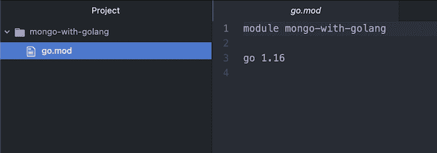

### 安装 MongoDB Go 驱动程序

在项目中安装 MongoDB Go 驱动程序包。在终端中，键入以下内容:

```
go get go.mongodb.org/mongo-driver/mongo
go get go.mongodb.org/mongo-driver/bson

```

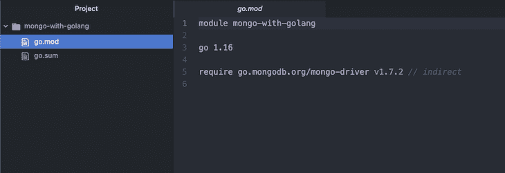

### 创建一个 MongoDB 客户端实例

将 Go 驱动程序包导入到应用程序中，然后在端口`27017` (MongoDB 的默认端口)上为数据库创建一个 MongoDB 客户端实例。

创建一个名为`main.go`的文件，并将以下代码保存在其中:

```
package main

import (
        "context"
        "go.mongodb.org/mongo-driver/mongo"
        "go.mongodb.org/mongo-driver/mongo/options"
        "go.mongodb.org/mongo-driver/mongo/readpref"
)

func main() {
        client, err := mongo.Connect(context.TODO(), options.Client().ApplyURI("mongodb://localhost:27017"))
        if err != nil {
                panic(err)
        }
}

```

在这里，您将`mongo`、`mongo/options`和`mongo/readpref`模块从 Go 驱动程序导入到您的应用程序中，以连接到本地数据库。

然后，您使用`mongo.Connect()`函数创建了一个客户端实例，并向它传递了一个 Go `context`。每当您向服务器(在本例中是数据库)发出请求时，您应该使用服务器将接受的`context.TODO()`创建一个[上下文](https://pkg.go.dev/context)。

最后，您使用从调用`mongo.Connect()`返回的`err`变量检查数据库连接中的错误。如果`err`值不为空，这意味着有一个错误(错误的凭证或连接到一个不存在的数据库)，您应该使用`panic()`终止应用程序。

> [`mongo.Connect`文档](https://www.mongodb.com/docs/manual/reference/method/connect/)包含创建 MongoDB 客户端实例的更多高级配置，包括认证。

### ping MongoDB 数据库

MongoDB 客户端提供了一个`Ping()`方法来告诉您是否找到并连接了 MongoDB 数据库。

让我们看看如何使用它:

```
if err := client.Ping(context.TODO(), readpref.Primary()); err != nil {
        panic(err)
}

```

这里，您调用了`Ping()`方法，并使用`readpref.Primary()`向其传递了一个`context`和一个主读取首选项，它告诉 MongoDB 客户端如何读取副本集成员的操作。

然后，像前面一样使用`err`变量检查错误，如果需要，使用`panic()`终止程序。如果代码运行时没有任何错误，就意味着数据库连接成功。

### 创建一个 MongoDB 集合实例

在连接到 MongoDB 数据库之后，您需要从用于执行查询的`client`实例创建一个`Collection`实例。

将以下代码添加到`main.go`文件中，创建一个从名为`"testing"`的`"users"`集合中检索的`Collection`实例:

```
usersCollection := client.Database("testing").Collection("users")

```

这段代码从本地 MongoDB 数据库中的`"testing"`数据库中检索`"users"`集合。如果数据库或集合在检索之前不存在，MongoDB 将自动创建它。

## 使用 MongoDB 执行 CRUD

现在您已经成功地建立了到 MongoDB 服务器的连接，并创建了一个`Collection`实例，让我们从 Go 开始在数据库中执行查询。本节介绍如何使用 Go 驱动程序在 MongoDB 数据库中插入、获取、更新和删除数据。

在 MongoDB 中处理数据之前，首先将我们之前安装的`bson`包导入到您的项目中。

将`"go.mongodb.org/mongo-driver/bson"`添加到您的导入中:

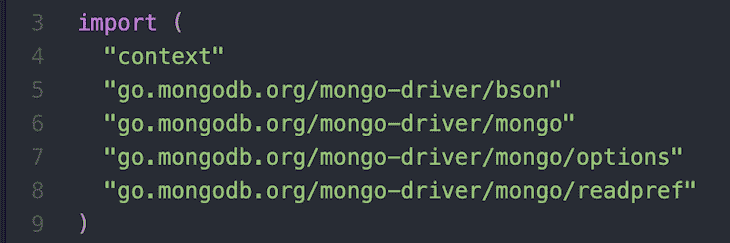

### 在 MongoDB 中创建新文档

为了在 MongoDB 集合中创建新文档，数据库客户机提供了一个允许插入单个文档的`InsertOne()`方法和一个插入多个文档的`InsertMany()`方法。

让我们看看如何使用它们:

```
// insert a single document into a collection
// create a bson.D object
user := bson.D{{"fullName", "User 1"}, {"age", 30}}
// insert the bson object using InsertOne()
result, err := usersCollection.InsertOne(context.TODO(), user)
// check for errors in the insertion
if err != nil {
        panic(err)
}
// display the id of the newly inserted object
fmt.Println(result.InsertedID)

// insert multiple documents into a collection
// create a slice of bson.D objects
users := []interface{}{
        bson.D{{"fullName", "User 2"}, {"age", 25}},
        bson.D{{"fullName", "User 3"}, {"age", 20}},
        bson.D{{"fullName", "User 4"}, {"age", 28}},
}
// insert the bson object slice using InsertMany()
results, err := usersCollection.InsertMany(context.TODO(), users)
// check for errors in the insertion
if err != nil {
        panic(err)
}
// display the ids of the newly inserted objects
fmt.Println(results.InsertedIDs)

```

这里，您创建了一个`bson`对象来存储您想要插入到数据库中的数据，因为 MongoDB Go 驱动程序要求您将数据准备为`bson`。你也可以创建一个数组和一个`bson`对象来存储多个值。

然后，使用`InsertOne()`方法插入单个对象，使用`InsertMany()`方法将对象列表插入数据库集合。

最后，使用该方法返回的`err`变量检查操作中是否有错误，并使用插入结果的`InsertedID`和`InsertedIDs`字段显示新插入文档的 ID:

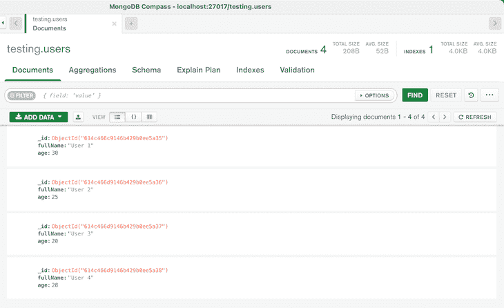

### 从 MongoDB 读取文档

为了从 MongoDB 集合中检索文档，数据库客户机提供了一个返回所有匹配搜索过滤器的文档的`Find()`方法和一个只返回第一个匹配过滤器的文档的`FindOne()`方法。

让我们看看如何使用它们:

```
// retrieve single and multiple documents with a specified filter using FindOne() and Find()
// create a search filer
filter := bson.D{
        {"$and",
                bson.A{
                        bson.D{
                                {"age", bson.D{{"$gt", 25}}},
                        },
                },
        },
}

// retrieve all the documents that match the filter
cursor, err := usersCollection.Find(context.TODO(), filter)
// check for errors in the finding
if err != nil {
        panic(err)
}

// convert the cursor result to bson
var results []bson.M
// check for errors in the conversion
if err = cursor.All(context.TODO(), &results); err != nil {
        panic(err)
}

// display the documents retrieved
fmt.Println("displaying all results from the search query")
for _, result := range results {
        fmt.Println(result)
}

// retrieving the first document that matches the filter
var result bson.M
// check for errors in the finding
if err = usersCollection.FindOne(context.TODO(), filter).Decode(&result); err != nil {
        panic(err)
}

// display the document retrieved
fmt.Println("displaying the first result from the search filter")
fmt.Println(result)

```

在这里，您创建了一个搜索过滤器来查询数据库中那些在`age`字段中值大于`25`的文档。过滤器定义了一组参数，MongoDB 应该使用这些参数来匹配数据库中的文档并为用户检索它们。

接下来，通过提供请求上下文和搜索过滤器作为参数，使用`Find()`方法检索所有匹配搜索过滤器的文档。`Find()`方法返回一个代表检索到的文档的`cursor`对象和一个包含查询数据库时出现的任何错误的`error`变量。

在得到结果`cursor`对象后，您使用`cursor.All()`函数将光标数据转换成一片`bson`对象。然后，我们使用`err`变量检查错误，并在终端中显示检索到的文档。

然后，使用`FindOne()`方法检索第一个匹配搜索过滤器的文档。`FindOne()`方法返回一个对象，您可以使用`Decode()`方法将其转换为`bson`对象。

最后，您使用`err`变量检查了`Find()`和`Decode()`操作中的错误，并在终端中显示了检索到的文档:

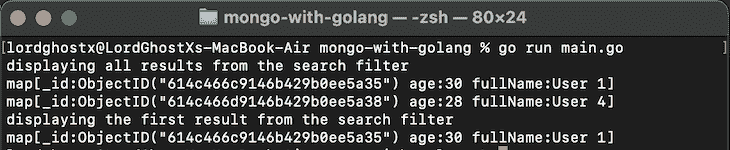

您还可以通过将`Find()`方法与空过滤器匹配来检索集合中的每个文档:

```
// retrieve all the documents in a collection
cursor, err := usersCollection.Find(context.TODO(), bson.D{})
// check for errors in the finding
if err != nil {
        panic(err)
}

// convert the cursor result to bson
var results []bson.M
// check for errors in the conversion
if err = cursor.All(context.TODO(), &results); err != nil {
        panic(err)
}

// display the documents retrieved
fmt.Println("displaying all results in a collection")
for _, result := range results {
        fmt.Println(result)
}

```

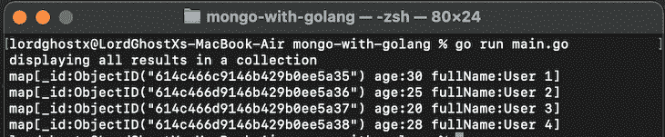

> 当你关心`bson`对象中的字段顺序时，你应该使用`bson.D`对象(例如，命令和过滤文档)，然后当你不关心字段顺序时，使用`bson.M`对象。

### 在 MongoDB 中更新文档

MongoDB 提供了两个操作来改变集合中的文档:`Update`和`Replace`。`Update`仅更改文档中指定的字段，而`Replace`用您提供的新字段覆盖现有数据。

MongoDB Go 驱动程序还提供了以下函数来更改集合中的文档。它们是:

*   `UpdateByID()`
*   `UpdateOne()`
*   `UpdateMany()`
*   `ReplaceOne()`
*   `FindOneAndUpdate()`
*   `FindOneAndReplace()`

让我们研究一下每个函数，从`UpdateByID()`开始，它用指定的`ObjectID`更新单个文档的字段:

```
// update a single document with a specified ObjectID using UpdateByID()
// insert a new document to the collection
user := bson.D{{"fullName", "User 5"}, {"age", 22}}
insertResult, err := usersCollection.InsertOne(context.TODO(), user)
if err != nil {
        panic(err)
}

// create the update query for the client
update := bson.D{
        {"$set",
                bson.D{
                        {"fullName", "User V"},
                },
        },
        {"$inc",
                bson.D{
                        {"age", 1},
                },
        },
}

// execute the UpdateByID() function with the filter and update query
result, err := usersCollection.UpdateByID(context.TODO(), insertResult.InsertedID, update)
// check for errors in the updating
if err != nil {
        panic(err)
}
// display the number of documents updated
fmt.Println("Number of documents updated:", result.ModifiedCount)

```

这里，您向集合中插入了一个新文档，并创建了一个更新查询，该查询将使用`"User V"`设置匹配文档的`fullName`字段，然后将`age`字段增加`1`。

接下来，您使用了`UpdateByID()`函数来更新指定的文档，方法是提供一个上下文、您想要修改的文档的`ObjectID`以及作为参数执行的`update`查询。

最后，您使用`err`变量检查了`update`操作中的错误，并使用调用`UpdateByID()`返回的`UpdateResult`对象显示了修改文档的数量:

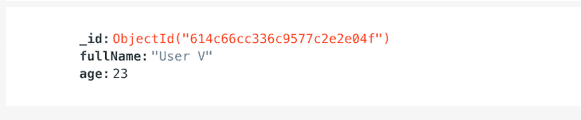

现在，让我们看一下`UpdateOne()`和`UpdateMany()`函数，它们用来更新符合指定搜索过滤器的单个和多个文档:

```
// update single and multiple documents with a specified filter using UpdateOne() and UpdateMany()
// create a search filer
filter := bson.D{
        {"$and",
                bson.A{
                        bson.D{
                                {"age", bson.D{{"$gt", 25}}},
                        },
                },
        },
}

// create the update query
update := bson.D{
        {"$set",
                bson.D{
                        {"age", 40},
                },
        },
}

// execute the UpdateOne() function to update the first matching document
result, err := usersCollection.UpdateOne(context.TODO(), filter, update)
// check for errors in the updating
if err != nil {
        panic(err)
}
// display the number of documents updated
fmt.Println("Number of documents updated:", result.ModifiedCount)

// execute the UpdateMany() function to update all matching first document
results, err := usersCollection.UpdateMany(context.TODO(), filter, update)
// check for errors in the updating
if err != nil {
        panic(err)
}
// display the number of documents updated
fmt.Println("Number of documents updated:", results.ModifiedCount)

```

这里，您首先创建了一个搜索过滤器，它匹配那些在`age`字段中值大于`25`的文档。然后，您创建了一个`update`查询，将`age`字段的值更改为`40`。

接下来，通过提供上下文、匹配文档的过滤器和作为参数执行的`update`查询，使用`UpdateOne()`函数更新第一个匹配搜索过滤器的文档。

`UpdateOne()`方法返回一个包含操作结果信息的`UpdateResult`对象，以及一个包含数据库更新错误的`error`变量。

最后，通过提供与上面的`UpdateOne()`函数相同的参数，使用`UpdateMany()`函数更新所有匹配搜索过滤器的文档:


现在，让我们来看一下`ReplaceOne()`函数，它覆盖文档中与指定搜索过滤器匹配的数据:

```
// replace the fields of a single document with ReplaceOne()
// create a search filer
filter := bson.D{{"fullName", "User 1"}}

// create the replacement data
replacement := bson.D{
        {"firstName", "John"},
        {"lastName", "Doe"},
        {"age", 30},
        {"emailAddress", "[email protected]"},
}

// execute the ReplaceOne() function to replace the fields
result, err := usersCollection.ReplaceOne(context.TODO(), filter, replacement)
// check for errors in the replacing
if err != nil {
        panic(err)
}
// display the number of documents updated
fmt.Println("Number of documents updated:", result.ModifiedCount)

```

这里，您创建了一个搜索过滤器，它匹配在`fullName`字段中值为`"User 1"`的文档和一个包含要存储的新数据的`bson`对象。

然后，通过提供上下文、匹配文档的过滤器和替换数据作为参数，使用`ReplaceOne()`函数覆盖匹配搜索过滤器的第一个文档的数据。

最后，使用`err`变量检查替换操作中的错误，并使用调用`ReplaceOne()`返回的`UpdateResult`对象显示修改的文档数量:

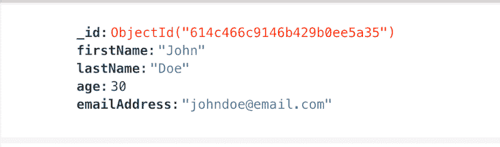

`FindOneAndUpdate()`和`FindOneAndReplace()`功能执行与`FindOne()`和`ReplaceOne()`相同的操作，但会在修改前返回文档的副本。

### 从 MongoDB 中删除文档

为了从 MongoDB 集合中删除文档，数据库客户机提供了一个删除单个文档的`DeleteOne()`方法和一个删除集合中多个文档的`DeleteMany()`方法。

让我们看看如何使用它们:

```
// delete single and multiple documents with a specified filter using DeleteOne() and DeleteMany()
// create a search filter
filter := bson.D{
        {"$and",
                bson.A{
                        bson.D{
                                {"age", bson.D{{"$gt", 25}}},
                        },
                },
        },
}

// delete the first document that match the filter
result, err := usersCollection.DeleteOne(context.TODO(), filter)
// check for errors in the deleting
if err != nil {
        panic(err)
}
// display the number of documents deleted
fmt.Println("deleting the first result from the search filter")
fmt.Println("Number of documents deleted:", result.DeletedCount)

// delete every document that match the filter
results, err := usersCollection.DeleteMany(context.TODO(), filter)
// check for errors in the deleting
if err != nil {
        panic(err)
}
// display the number of documents deleted
fmt.Println("deleting every result from the search filter")
fmt.Println("Number of documents deleted:", results.DeletedCount)

```

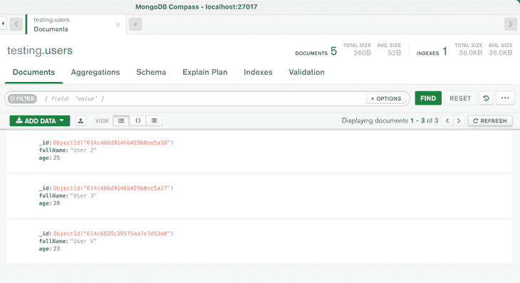

## 用 MongoDB 文档映射 Go 结构

在 Go 中处理`bson`文档可能是一项艰巨的任务，尤其是当你的操作变得更加复杂的时候。如果你正在使用`bson`，函数返回`map[string]interface{}`类型，随着文档数量的增加，根据你的操作，界面可能很难使用。

MongoDB Go 驱动程序也支持使用 Go 结构。您可以将文档映射到 Go 结构，以便于操作和数据迁移。因为大多数 Go 数据库包也使用结构，所以这个特性对于使用其他数据库和基于结构的操作非常有用。

下面是一个 struct 匹配 MongoDB 数据库中的文档的示例:

```
type Person struct {
   ID       primitive.ObjectID `bson:"_id,omitempty"`
   Age      int                `bson:"age,omitempty"`
   FullName string             `bson:"full_name,omitempty"`
}

```

`ID`字段属于`primitive.ObjectID`类型，这是文档的 ObjectID。您需要为字段名称添加相应的`bson`标签。您还可以为其他操作添加额外的 struct 标记:

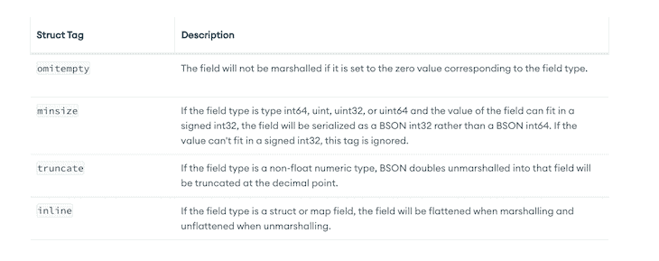

您还需要通过大写标识符来导出字段，以便进行有效的数据迁移。

## 使用结构插入 MongoDB 文档

连接到数据库和集合实例后，可以使用数据库方法来处理结构和结构实例。

下面是初始化了`Age`和`FullName`字段的实例化结构。您不必实例化`ObjectID`字段:

```
individual := Person{
   Age:      390,
   FullName: "John James Doe",
}

```

您可以使用 insert 方法在数据库中创建文档。以下是如何使用`individual`结构插入单个文档的方法:

```
_, err = collection.InsertOne(context.TODO(), &individual)
if err != nil {
   log.Fatalln("Error Inserting Document", err)
}

```

`InsertOne`方法将单个文档插入到 MongoDB 数据库集合中。您可以传递对实例化结构的引用，以将数据迁移到数据库。

下面是数据库中的操作结果:

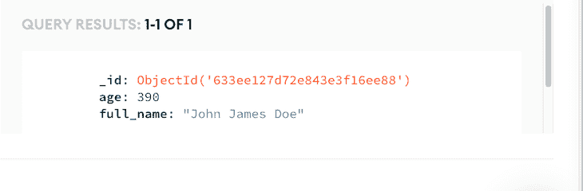

## 使用 Go 结构查询 MongoDB 文档

您还可以使用 Go structs 查询 MongoDB 数据库，以便更容易访问数据。查询的输出将被解码成一个可以轻松访问和操作的 struct 实例。

下面是一个使用`Age`字段查询插入文档集合的例子:

```
cursor, err := collection.Find(ctx, bson.M{"age": 390})
if err != nil {
   panic(err)
}

```

`Find`方法从集合中返回查询结果。在这种情况下，它返回的文档中`age`字段的值为 380。

您必须实例化一个类似于文档的结构模型实例(在这种情况下,`Person`结构匹配文档):

```
for _, entry := range person {
   fmt.Println(entry.FullName)
   fmt.Println(entry.Age)
   fmt.Println(entry.ID)

}

```

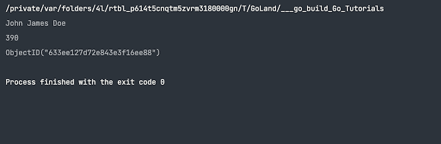

对于大多数使用 map 数据结构的操作，都可以使用 structs。查看 Go packages 网站文档,了解更多关于在 MongoDB 中使用 Go 结构的信息。

## 结论

我希望这是一个有帮助的指南，可以经常是一个具有挑战性的任务。由于缺乏使用 MongoDB 和 Go 的直接资源，开发人员需要花费大量时间研究文档。以本文为参考指南，您可以放心地将 MongoDB 集成到 Go 应用程序中。

你可以去官方的 [MongoDB](https://docs.mongodb.com) 和 [Go 驱动文档](https://docs.mongodb.com/drivers/go/current/)去探索 MongoDB 提供的更多功能。此外，您还可以访问 [MongoDB 大学](https://university.mongodb.com)，通过课程和证书来培养您的技能并推进您的职业发展。

## 使用 [LogRocket](https://lp.logrocket.com/blg/signup) 消除传统错误报告的干扰

[](https://lp.logrocket.com/blg/signup)

[LogRocket](https://lp.logrocket.com/blg/signup) 是一个数字体验分析解决方案，它可以保护您免受数百个假阳性错误警报的影响，只针对几个真正重要的项目。LogRocket 会告诉您应用程序中实际影响用户的最具影响力的 bug 和 UX 问题。

然后，使用具有深层技术遥测的会话重放来确切地查看用户看到了什么以及是什么导致了问题，就像你在他们身后看一样。

LogRocket 自动聚合客户端错误、JS 异常、前端性能指标和用户交互。然后 LogRocket 使用机器学习来告诉你哪些问题正在影响大多数用户，并提供你需要修复它的上下文。

关注重要的 bug—[今天就试试 LogRocket】。](https://lp.logrocket.com/blg/signup-issue-free)