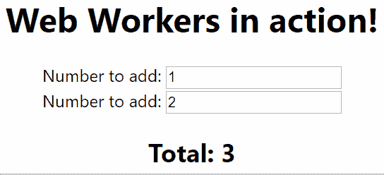
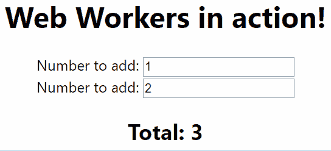

# 用 Comlink - LogRocket Blog 在 React 应用程序中集成网络工作者

> 原文：<https://blog.logrocket.com/integrating-web-workers-in-a-react-app-with-comlink/>

JavaScript 是出了名的单线程。然而，如果你正在为 web 开发，你可能很清楚这是不太准确的。还有[网络工作者](https://developer.mozilla.org/en-US/docs/Web/API/Web_Workers_API/Using_web_workers):

> 工作者是使用运行命名的 JavaScript 文件的构造器(例如，`Worker()`)创建的对象——该文件包含将在工作者线程中运行的代码；工作线程在不同于当前窗口的另一个全局上下文中运行。

既然有办法使用其他线程进行后台处理，为什么不是一直都这样呢？嗯，有很多原因，不仅仅是与网络工作者互动的礼仪。请考虑下面的示例，该示例说明了如何将计算移入 worker:

```
// main.js
function add2NumbersUsingWebWorker() {
    const myWorker = new Worker("worker.js");

    myWorker.postMessage([42, 7]);
    console.log('Message posted to worker');

    myWorker.onmessage = function(e) {
        console.log('Message received from worker', e.data);
    }
}

add2NumbersUsingWebWorker();

// worker.js
onmessage = function(e) {
  console.log('Worker: Message received from main script');
  const result = e.data[0] * e.data[1];
  if (isNaN(result)) {
    postMessage('Please write two numbers');
  } else {
    const workerResult = 'Result: ' + result;
    console.log('Worker: Posting message back to main script');
    postMessage(workerResult);
  }
}
```

这不简单；很难理解正在发生的事情。此外，这种方法只支持单个方法调用。我更愿意写一些看起来更像这样的东西:

```
// main.js
function add2NumbersUsingWebWorker() {
    const myWorker = new Worker("worker.js");

    const total = myWorker.add2Numbers([42, 7]);
    console.log('Message received from worker', total);
}

add2NumbersUsingWebWorker();

// worker.js
export function add2Numbers(firstNumber, secondNumber) {
  const result = firstNumber + secondNumber;
  return (isNaN(result))
    ? 'Please write two numbers'
    : 'Result: ' + result;
}
```

有一种方法可以做到这一点，使用谷歌制作的名为 [Comlink](https://github.com/GoogleChromeLabs/comlink) 的库。这篇文章将展示我们如何使用它。我们将使用 TypeScript 和 webpack。我们还将研究如何将这种方法集成到 React 应用程序中。

## 一个网络工作者的用例

让我们为自己制作一个 TypeScript web 应用程序。为此，我们将使用`create-react-app`:

```
npx create-react-app webworkers-comlink-typescript-react --template typescript
```

在`index.tsx`旁边创建一个`takeALongTimeToDoSomething.ts`文件:

```
export function takeALongTimeToDoSomething() {
    console.log('Start our long running job...');
    const seconds = 5;
    const start = new Date().getTime();
    const delay = seconds * 1000;

    while (true) {
        if ((new Date().getTime() - start) > delay) {
            break;
        }
    }
    console.log('Finished our long running job');
}
```

向`index.tsx`添加以下代码:

```
import { takeALongTimeToDoSomething } from './takeALongTimeToDoSomething';

// ...

console.log('Do something');
takeALongTimeToDoSomething();
console.log('Do another thing');
```

当我们的应用程序运行时，我们会看到这种行为:


应用程序启动并将`Do something`和`Start our long running job...`记录到控制台。然后它阻塞用户界面，直到`takeALongTimeToDoSomething`函数完成运行。在此期间，屏幕是空的，没有反应。这是很差的用户体验。

## 你好`worker-plugin`和`comlink`

要开始使用 Comlink，我们需要弹出我们的`create-react-app`应用程序。`create-react-app`的工作方式是通过给你一个设置来处理一个典型的 web 应用程序的大部分需求。当您遇到不支持的用例时，您可以运行`yarn eject`命令来直接访问您的设置的配置。

Web workers 目前在日常开发中并不常用。因此，对于受`create-react-app`支持的员工来说，还没有一个“即插即用”的解决方案。有许多潜在的方法来支持这个用例，您可以跟踪针对涵盖这个用例的`create-react-app`发生的各种讨论。现在，让我们弹出:

```
yarn eject
```

然后，让我们安装将要使用的软件包:

*   这个 webpack 插件自动编译 web workers 中加载的模块
*   这个库提供了我们希望从工作人员那里得到的类似 RPC 的体验

```
yarn add comlink worker-plugin
```

我们现在需要调整我们的`webpack.config.js`来使用`worker-plugin`:

```
const WorkerPlugin = require('worker-plugin');

// ....

    plugins: [
      new WorkerPlugin(),

// ....
```

请注意在`webpack.config.js`中有许多`plugins`语句。你要顶级的那个；留意`new HtmlWebpackPlugin`陈述，并将你的`new WorkerPlugin(),`放在那之前。

## 使我们缓慢的过程工作化

现在，我们准备将我们的长时间运行的流程转移到一个 worker 中。在`src`文件夹中，创建一个名为`my-first-worker`的新文件夹。我们的工人将住在这里。在这个文件夹中，我们将添加一个`tsconfig.json`文件:

```
{
  "compilerOptions": {
    "strict": true,
    "target": "esnext",
    "module": "esnext",
    "lib": [
      "webworker",
      "esnext"
    ],
    "moduleResolution": "node",
    "noUnusedLocals": true,
    "sourceMap": true,
    "allowJs": false,
    "baseUrl": "."
  }
}
```

该文件的存在是为了告诉 TypeScript 这是一个 web worker。请注意`"lib": [ "webworker"`的用法，它就是这样做的。

除了`tsconfig.json`文件，让我们创建一个`index.ts`文件。这将是我们的工人:

```
import { expose } from 'comlink';
import { takeALongTimeToDoSomething } from '../takeALongTimeToDoSomething';

const exports = {
    takeALongTimeToDoSomething
};
export type MyFirstWorker = typeof exports;

expose(exports);
```

我们的小工档案里发生了很多事。让我们一条一条地看这个声明:

```
import { expose } from 'comlink';
```

这里我们从 Comlink 导入了`expose`方法。Comlink 的目标是使一个线程中公开的值在另一个线程中可用。`expose`方法可以被看作是`export`的 Comlink 等价物。它用于导出我们的 worker 的 RPC 样式签名。我们稍后会看到它的用途。

```
import { takeALongTimeToDoSomething } from '../takeALongTimeToDoSomething';
```

这里我们将导入我们之前编写的`takeALongTimeToDoSomething`函数，这样我们就可以在我们的 worker 中使用它。

```
const exports = {
    takeALongTimeToDoSomething
};
```

在这里，我们正在创建面向公众的 API，我们将公开它。

```
export type MyFirstWorker = typeof exports;
```

我们希望我们的工人是强类型的。这一行创建了一个名为`MyFirstWorker`的类型，它是从我们的`exports`对象文本中派生出来的。

```
expose(exports);
```

最后，我们使用 Comlink 公开了`exports`。我们完了——我们的工人完了。现在让我们消费它。让我们更改我们的`index.tsx`文件来使用它。替换我们进口的`takeALongTimeToDoSomething`:

```
import { takeALongTimeToDoSomething } from './takeALongTimeToDoSomething';
```

通过从 Comlink 导入`wrap`,创建了一个本地`takeALongTimeToDoSomething`函数，该函数包装了与我们的工人的交互:

```
import { wrap } from 'comlink';

function takeALongTimeToDoSomething() {
    const worker = new Worker('./my-first-worker', { name: 'my-first-worker', type: 'module' });
    const workerApi = wrap<import('./my-first-worker').MyFirstWorker>(worker);
    workerApi.takeALongTimeToDoSomething();    
}
```

现在，我们准备使用卸载到 web worker 中的函数来演示我们的应用程序。它现在的行为如下:


这里有一些令人兴奋的事情需要注意:

1.  应用程序现在是非阻塞的。我们长期运行的函数现在不会阻止用户界面的更新
2.  该功能通过由`worker-plugin`和`comlink`创建的`my-first-worker.chunk.worker.js`被延迟加载

## 在 React 中使用 web workers

到目前为止，我们展示的例子展示了如何使用 web workers 以及为什么您可能想要这样做。然而，这与真实世界的用例相去甚远。让我们进行下一步，将我们的 web worker 应用程序插入到 React 应用程序中。那会是什么样子？让我们找出答案。

我们将把`index.tsx`返回到它的初始状态。然后，我们将制作一个简单的加法器函数，它接受一些值并返回它们的总和。对于我们的`takeALongTimeToDoSomething.ts`模块，让我们添加:

```
export function takeALongTimeToAddTwoNumbers(number1: number, number2: number) {
    console.log('Start to add...');
    const seconds = 5;
    const start = new Date().getTime();
    const delay = seconds * 1000;
    while (true) {
        if ((new Date().getTime() - start) > delay) {
            break;
        }
    }
    const total = number1 + number2;
    console.log('Finished adding');
    return total;
}
```

让我们开始在 React 组件中使用长期运行的计算器。我们将更新我们的`App.tsx`来使用这个函数并创建一个简单的加法器组件:

```
import React, { useState } from "react";
import "./App.css";
import { takeALongTimeToAddTwoNumbers } from "./takeALongTimeToDoSomething";

const App: React.FC = () => {
  const [number1, setNumber1] = useState(1);
  const [number2, setNumber2] = useState(2);

  const total = takeALongTimeToAddTwoNumbers(number1, number2);

  return (
    <div className="App">
      <h1>Web Workers in action!</h1>

      <div>
        <label>Number to add: </label>
        <input
          type="number"
          onChange={e => setNumber1(parseInt(e.target.value))}
          value={number1}
        />
      </div>
      <div>
        <label>Number to add: </label>
        <input
          type="number"
          onChange={e => setNumber2(parseInt(e.target.value))}
          value={number2}
        />
      </div>
      <h2>Total: {total}</h2>
    </div>
  );
};

export default App;
```

当您尝试时，您会注意到输入一个数字会在添加数字时锁定用户界面五秒钟。从光标停止闪烁到屏幕更新，UI 无响应:



到目前为止，很经典。让我们把它网络化吧！

我们将更新我们的`my-first-worker/index.ts`来导入这个新函数:

```
import { expose } from "comlink";
import {
  takeALongTimeToDoSomething,
  takeALongTimeToAddTwoNumbers
} from "../takeALongTimeToDoSomething";

const exports = {
  takeALongTimeToDoSomething,
  takeALongTimeToAddTwoNumbers
};
export type MyFirstWorker = typeof exports;

expose(exports);
```

除了我们的`App.tsx`文件，让我们创建一个`App.hooks.ts`文件。

```
import { wrap, releaseProxy } from "comlink";
import { useEffect, useState, useMemo } from "react";

/**
 * Our hook that performs the calculation on the worker
 */
export function useTakeALongTimeToAddTwoNumbers(
  number1: number,
  number2: number
) {
  // We'll want to expose a wrapping object so we know when a calculation is in progress
  const [data, setData] = useState({
    isCalculating: false,
    total: undefined as number | undefined
  });

  // acquire our worker
  const { workerApi } = useWorker();

  useEffect(() => {
    // We're starting the calculation here
    setData({ isCalculating: true, total: undefined });

    workerApi
      .takeALongTimeToAddTwoNumbers(number1, number2)
      .then(total => setData({ isCalculating: false, total })); // We receive the result here
  }, [workerApi, setData, number1, number2]);

  return data;
}

function useWorker() {
  // memoise a worker so it can be reused; create one worker up front
  // and then reuse it subsequently; no creating new workers each time
  const workerApiAndCleanup = useMemo(() => makeWorkerApiAndCleanup(), []);

  useEffect(() => {
    const { cleanup } = workerApiAndCleanup;

    // cleanup our worker when we're done with it
    return () => {
      cleanup();
    };
  }, [workerApiAndCleanup]);

  return workerApiAndCleanup;
}

/**
 * Creates a worker, a cleanup function and returns it
 */
function makeWorkerApiAndCleanup() {
  // Here we create our worker and wrap it with comlink so we can interact with it
  const worker = new Worker("./my-first-worker", {
    name: "my-first-worker",
    type: "module"
  });
  const workerApi = wrap<import("./my-first-worker").MyFirstWorker>(worker);

  // A cleanup function that releases the comlink proxy and terminates the worker
  const cleanup = () => {
    workerApi[releaseProxy]();
    worker.terminate();
  };

  const workerApiAndCleanup = { workerApi, cleanup };

  return workerApiAndCleanup;
}
```

`useWorker`和`makeWorkerApiAndCleanup`函数构成了可共享工人挂钩方法的基础。这将需要很少的工作来参数化它们，所以这可以用在其他地方。这超出了本文的范围，但是完成起来非常简单。

考验的时候到了！我们将改变我们的`App.tsx`来使用新的`useTakeALongTimeToAddTwoNumbers`钩子:

```
import React, { useState } from "react";
import "./App.css";
import { useTakeALongTimeToAddTwoNumbers } from "./App.hooks";

const App: React.FC = () => {
  const [number1, setNumber1] = useState(1);
  const [number2, setNumber2] = useState(2);

  const total = useTakeALongTimeToAddTwoNumbers(number1, number2);

  return (
    <div className="App">
      <h1>Web Workers in action!</h1>

      <div>
        <label>Number to add: </label>
        <input
          type="number"
          onChange={e => setNumber1(parseInt(e.target.value))}
          value={number1}
        />
      </div>
      <div>
        <label>Number to add: </label>
        <input
          type="number"
          onChange={e => setNumber2(parseInt(e.target.value))}
          value={number2}
        />
      </div>
      <h2>
        Total:{" "}
        {total.isCalculating ? (
          <em>Calculating...</em>
        ) : (
          <strong>{total.total}</strong>
        )}
      </h2>
    </div>
  );
};

export default App;
```

现在我们的计算发生在主线程之外，UI 不再被阻塞！



## [LogRocket](https://lp.logrocket.com/blg/react-signup-general) :全面了解您的生产 React 应用

调试 React 应用程序可能很困难，尤其是当用户遇到难以重现的问题时。如果您对监视和跟踪 Redux 状态、自动显示 JavaScript 错误以及跟踪缓慢的网络请求和组件加载时间感兴趣，

[try LogRocket](https://lp.logrocket.com/blg/react-signup-general)

.

[ ](https://lp.logrocket.com/blg/react-signup-general) [](https://lp.logrocket.com/blg/react-signup-general) 

LogRocket 结合了会话回放、产品分析和错误跟踪，使软件团队能够创建理想的 web 和移动产品体验。这对你来说意味着什么？

LogRocket 不是猜测错误发生的原因，也不是要求用户提供截图和日志转储，而是让您回放问题，就像它们发生在您自己的浏览器中一样，以快速了解哪里出错了。

不再有嘈杂的警报。智能错误跟踪允许您对问题进行分类，然后从中学习。获得有影响的用户问题的通知，而不是误报。警报越少，有用的信号越多。

LogRocket Redux 中间件包为您的用户会话增加了一层额外的可见性。LogRocket 记录 Redux 存储中的所有操作和状态。

现代化您调试 React 应用的方式— [开始免费监控](https://lp.logrocket.com/blg/react-signup-general)。

## [LogRocket](https://lp.logrocket.com/blg/typescript-signup) :全面了解您的网络和移动应用

[](https://lp.logrocket.com/blg/typescript-signup)

LogRocket 是一个前端应用程序监控解决方案，可以让您回放问题，就像问题发生在您自己的浏览器中一样。LogRocket 不需要猜测错误发生的原因，也不需要向用户询问截图和日志转储，而是让您重放会话以快速了解哪里出错了。它可以与任何应用程序完美配合，不管是什么框架，并且有插件可以记录来自 Redux、Vuex 和@ngrx/store 的额外上下文。

除了记录 Redux 操作和状态，LogRocket 还记录控制台日志、JavaScript 错误、堆栈跟踪、带有头+正文的网络请求/响应、浏览器元数据和自定义日志。它还使用 DOM 来记录页面上的 HTML 和 CSS，甚至为最复杂的单页面和移动应用程序重新创建像素级完美视频。

[Try it for free](https://lp.logrocket.com/blg/typescript-signup)

.