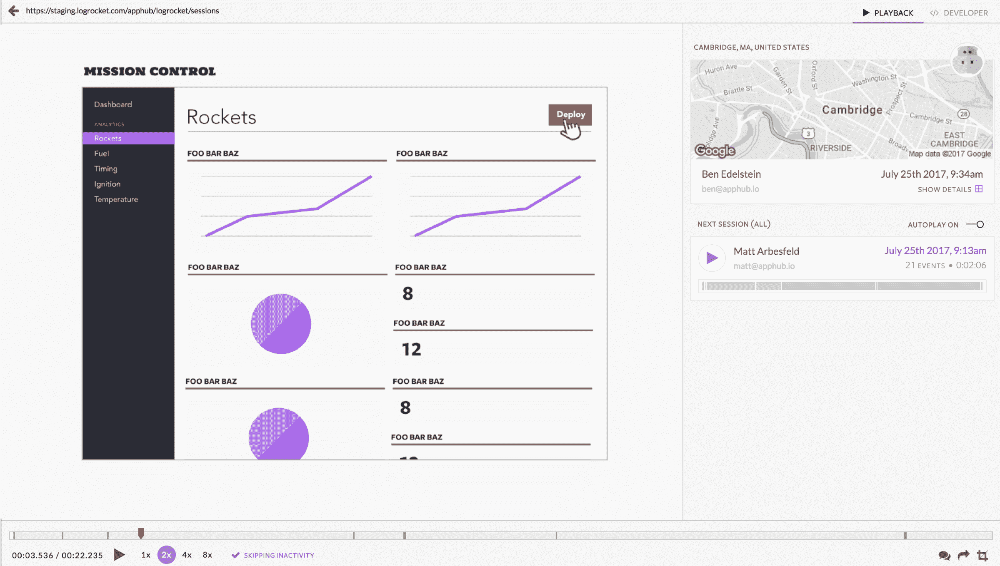
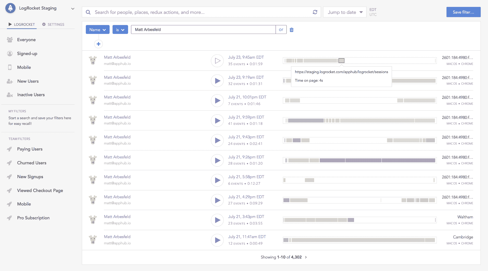
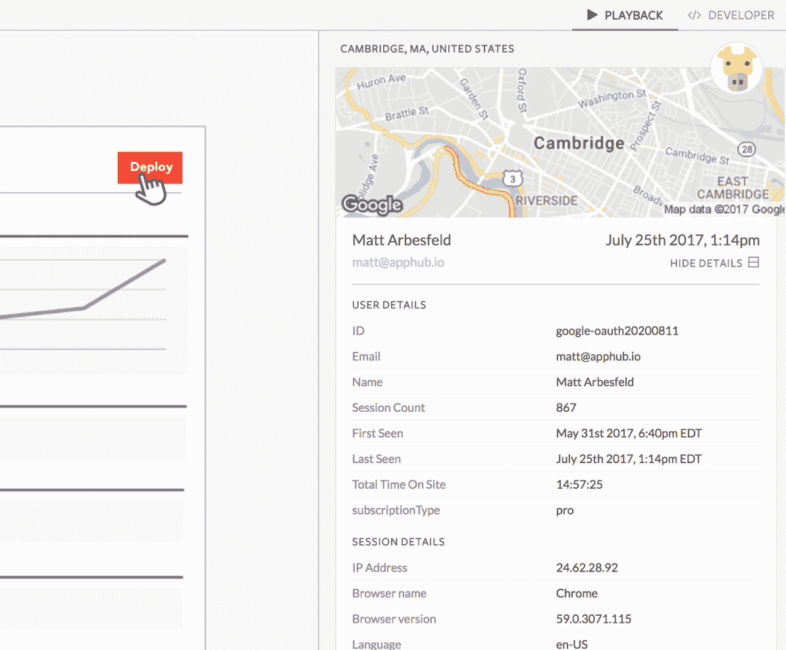
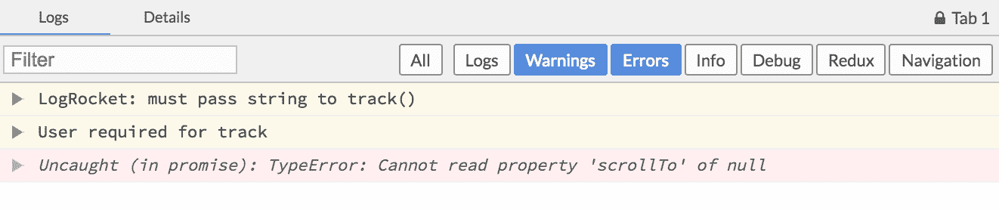
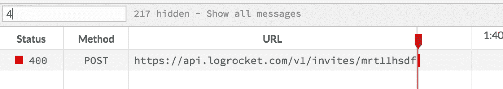
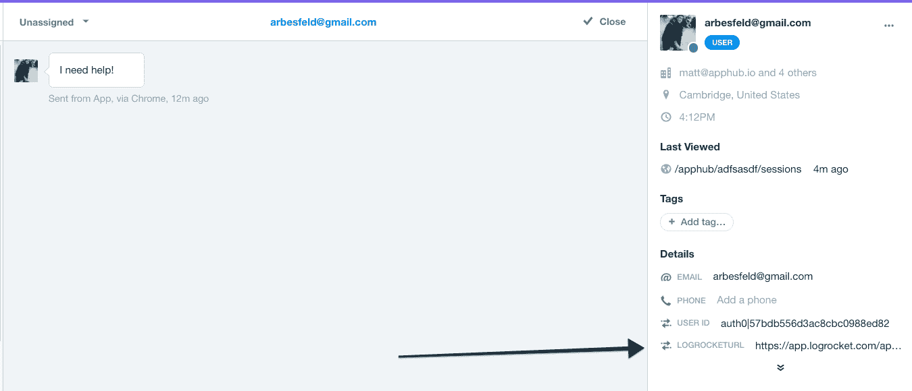
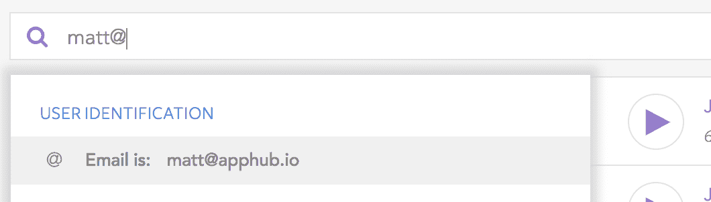

# LogRocket 的智能支持

> 原文：<https://blog.logrocket.com/intelligent-support-with-logrocket-bd4bfd18c580/>

# 使用 LogRocket 的智能支持

## 

2017 年 7 月 25 日 1 分钟阅读 530

 [https://www.youtube.com/embed/1GFbKYQhDMU?version=3&rel=1&showsearch=0&showinfo=1&iv_load_policy=1&fs=1&hl=en-US&autohide=2&wmode=transparent](https://www.youtube.com/embed/1GFbKYQhDMU?version=3&rel=1&showsearch=0&showinfo=1&iv_load_policy=1&fs=1&hl=en-US&autohide=2&wmode=transparent)

视频

当用户需要支持时，提供快速、智能的帮助是您整体客户体验的重要组成部分。在许多情况下，这可能意味着一个快乐的用户和一个搅拌的用户之间的差异。

因此，我们一些最热情的 LogRocket 客户是支持团队就不足为奇了。在这篇文章中，我将简要介绍 LogRocket 如何帮助您的支持团队更快地解决问题并改善您的客户体验。

### 支持功能

这种情况经常发生——用户说他们无法登录。或者可能是结账页面坏了，阻止了他们付款。LogRocket 的视频播放意味着，当用户寻求帮助时，你可以准确地观看他们看到的内容——无需要求澄清。

有时，用户会在遇到问题几小时甚至几天后寻求帮助。LogRocket sessions 列表提供了用户最近所有会话的概述。通过将鼠标悬停在每个会话的活动栏上，您可以看到用户在该会话中访问过的页面，这有助于您跟踪他们遇到错误的会话。

除了每个视频，LogRocket 还包括用户的高级上下文以及他们会话的详细信息。您可以查看他们使用的浏览器、IP 地址等信息，以及来自您的应用程序的自定义信息，如他们的计划或他们所在的组织。

### 技术支持(第 2 层)

视频有助于从用户的角度来看你的应用程序，但是有时候，仅仅从视频上看不清楚“幕后”发生了什么。很难知道用户是感到困惑，还是真的遇到了问题。通过查看会话中的控制台和网络日志，您可以很容易地做出这种区分。

日志查看器允许您过滤日志，仅显示警告和错误。这将向您显示在观看视频时用户会话中发生的错误。

同样，网络活动查看器允许您过滤网络错误。在这里，通过键入“4 ”,我们可以快速看到用户遇到的任何 400 个请求。

### 集成

LogRocket 集成了各种支持工具，让您可以尽快看到相关的用户会话。

#### 对讲机(和其他聊天支持工具)

LogRocket Intercom 集成在每个 Intercom 对话的旁边添加了一个链接，直接带您进入用户会话列表。这样，一旦用户开始聊天，你就可以在你的应用中看到他们最近所做的一切，并了解他们的问题。

与其他聊天支持工具如 **Drift** 、 **Olark** 和 **Freshdesk** 的集成以同样的方式工作。查看[文档](https://docs.logrocket.com)获取设置说明。

#### 电子邮件

有时用户通过电子邮件请求帮助。要查看他们最近的会话列表，您可以通过他们的电子邮件进行搜索。

### TLDR

LogRocket 帮助团队为用户提供快速智能的支持。通过将 LogRocket 集成到您的支持工作流中，您可以快速了解是什么导致用户寻求帮助，并引导他们找到解决方案。

首先，参观了[https://logrocket.com/signup.](https://logrocket.com.)