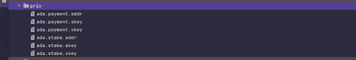
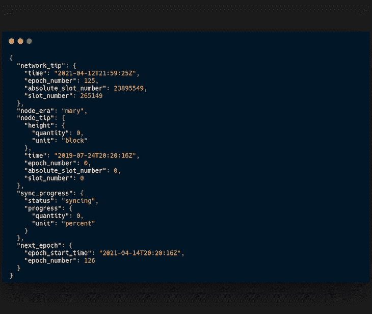
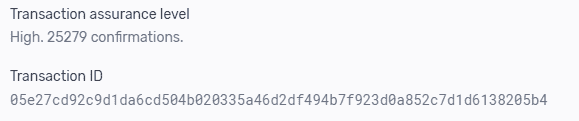

# 使用 JavaScript 与 Cardano 区块链交互

> 原文：<https://blog.logrocket.com/interacting-cardano-blockchain-using-javascript/>

Cardano 是一个公共的、股权证明的、去中心化的第三代区块链网络，由以太坊联合创始人 Charles Hoskinson 于 2015 年创立。

卡尔达诺区块链旨在促进区块链的互操作性、可伸缩性和分散化，从而促进大规模采用。

卡尔达诺的发展原生于**普路托斯、马洛或格洛；**然而，Cardano 社区提供了一个用于 JavaScript 和其他编程语言开发的 SDK。

本教程将指导您使用 Cardanocli-js 和 Cardano-wallet-js 开始使用 Javascript 进行 Cardano 开发。

## 什么是 Cardanocli-JS 和 Cardano WalletJS？

js 是 Cardano 区块链开发中最流行的 javascript SDK。它支持你在卡达诺区块链上开发的各种功能，包括铸造 NFT。

js 是一个 javascript SDK，用于 Cardano 区块链开发，支持类型脚本。它可以用来创建本机令牌和 NFT 以及一些功能。

在本书中，您将了解如何在您的 Javascript 应用程序中集成卡尔达诺区块链的功能，如创建钱包、赌注池和获取网络信息。

### 先决条件

首先，你需要在你的电脑上安装这些软件。

1.  从 NodeJs 官网下载安装 NodeJs [，最好下载 NodeJs 最新的 LTS 版本。](https://nodejs.org/en/download/)
2.  在你的机器上下载并安装 CardanoCli 可执行文件，这是对 CardanoCli-JS SDK 的依赖，因为它有助于连接到你需要在 Cardano 区块链上查询和开发的 Cardano 区块链节点。
3.  安装 NodeJs: `npm install cardanocli-js`之后，可以使用这个命令安装 Cardanocli-JS
4.  Cardano-wallet-js 可以使用这个 npm 命令安装:`npm install cardano-wallet-js`

Cardano-wallet-js 要求您运行 Cardano-wallet 服务器。您可以使用 docker 通过运行下面的命令来启动服务器，或者按照这些指令来启动并运行 wallet cardano-wallet 服务器。

```
wget <https://raw.githubusercontent.com/input-output-hk/cardano-wallet/master/docker-compose.yml>

NETWORK=testnet docker-compose up

```

选择您选择的文本编辑器或 IDE。在本教程中，我将使用 [Jetbrains Webstorm](https://www.jetbrains.com/webstorm/) 。

完成所有这些设置后，在您的工作区中为本教程创建一个 javascript 文件。

我用的是 Ubuntu 操作系统，如果你用的是 Windows 或 macOS，设置可能会有细微的差别。

## 开始使用 Cardanocli-js

### 使用 Cardanocli-js 连接到 Cardano 节点

获取 IOHK 网站的[节点构建号。当您在浏览器中打开链接时，节点内部版本号是 URL 中的编号。](https://hydra.iohk.io/build/7926804/download/1/testnet-shelley-genesis.json)

在您的工作区中创建一个 bash 脚本，并输入以下命令。

```
wget -N <https://hydra.iohk.io/build/${NBM}/download/1/mainnet-shelley-genesis.json>

```

用网站上的节点构建号替换`${NBM}`,并在终端中使用这个命令运行 bash 脚本。

```
chmod +x fileName.sh

./fileName.sh

```

第一行修改权限以使文件可执行，而第二行执行该文件，在您的工作区中创建一个 JSON 配置文件，其中包含必要的配置。

配置文件有助于连接到您在程序中指定的 mainnet 或 testnet 上的 Cardano 节点。

### 使用 Cardanocli-js 开发 Cardano

首先，导入 cardanocli-js SDK 用于您的程序。在本例中，它被命名为 clijs。

```
const clijs = require("cardanocli-js")

```

接下来，您必须创建一个导入实例，您将在其中指定网络、配置文件路径和输出目录。

```
const cclijs = new cjs({
network: "mainnet",

directory: __dirname + "output Directory here",

shelleyGenesisPath: __dirname + "config file path here"
})

```

根据您的使用情况，网络可以是主网或测试网。

您可以按照本教程和 mainnet 开发 testnet。

* * *

### 更多来自 LogRocket 的精彩文章:

* * *

现在您已经设置了一个区块链连接实例，您可以使用 Cardanocli-js 执行多个操作

### 使用 Cardanocli-js 创建 Cardano 钱包

创建一个 Cardano 钱包相当容易；您必须在 cardanocli-js 实例的方法中指定一个 wallet 名称作为参数，如下所示。

```
const createAWallet = (walletName) => {
cclijs.addressKeyGen(walletName)

cclijs.stakeAddressKeyGen(walletName)

cclijs.stakeAddressBuild(walletName)

cclijs.addressBuild(walletName)

return cclijs.wallet(walletName)

}

```

上面的函数在被调用时创建一个带有指定名称的钱包。

```
console.log(createAWallet('your wallet name here"))

```

一旦在链上执行了该函数，就会在您指定的 outputs 文件夹中创建一个名为 priv 的目录，其中包含您刚刚创建的 wallet 的私钥和公钥。



### 使用 Cardanocli-js 查询钱包余额

您可以通过在 cardanocli-js 实例的 wallet 方法中指定 wallet 的名称来查询 wallet 余额。

```
const getBalances = (walletName) => {
const query = cardano.wallet(walletName)

return query.balance()
}

```

上面的函数以 JSON 格式返回指定钱包名称的钱包余额，如下所示。

```
{
utxo : [

    {

        txHash: "7436d178c092222396bd0b5cb71211bd87b098bb9e7e98d1a0f41390c1604711",

        txId: 0,

        amount: [Object]

    }

],

    amount:

{

    lovelace : 350000000

}

```

在上面的输出中，假设 wallet 具有 Cardano 本地资产$ADA。

余额显示在 Lovelaces 中，可以通过将该值除以一百万转换为 ADA。

## 使用 Cardanocli-js 创建赌注池

赌注池是 Cardano 节点的自定义名称。它们的操作类似于以太坊节点，除了卡达诺是区块链股份的证明。

赌注池可以是公共的或私有的，并且它们具有公共地址，网络参与者可以将他们的 ADA 令牌委托给该公共地址以获得奖励。

使用 Cardanocli-js 创建一个赌注池是很容易的，类似于创建一个钱包。

```
const createAStakePool = (poolName) => {
cclijs.nodeKeyGenKES(poolName);

cclijs.nodeKeyGen(poolName);

cclijs.nodeIssueOpCert(poolName);

cclijs.nodeKeyGenVRF(poolName);

return cclijs.pool(poolName);
};

```

上面的函数创建一个与您指定的名称相关联的赌注池，并像`createAWallet`函数一样输出您指定目录中的文件。该函数在被调用时返回池名。

```
console.log(createAWallet('your stakepool name here"))

```

您已经成功创建了一个 Cardano 赌注池，就像您在上面创建钱包一样，文件已经在您的输出目录中创建。

## Cardano-wallet-js 入门

一旦安装了 Cardano-wallet-js，就可以导入使用了。

```
const { seed, WalletServer: walletserver } = require('cardano-wallet-js');

let walletServer = WalletServer.init('Your wallet server host URL');

```

使用到您的钱包服务器的链接来创建和初始化钱包服务器实例。种子将用于创建钱包。

### 使用 Cardano-wallet-js 创建钱包

使用 Cardano-wallet-js 创建 Cardano 钱包比 Cardanocli-js 更实用。您可以使用以下功能创建钱包。

```
let recoveryPhrase = seed.generateRecoveryPhrase()

let passPhrase = "name"

let walletName = "name"

let wallet = await walletServer.createOrRestoreShelleyWallet(walletName, mnemonic, passPhrase)

console.log(seed.toMnemonicList(recoveryPhrase))

```

在上面的代码中，种子用于生成恢复短语，然后，`passPhrase`和`walletName`变量被创建并传递给 wallet 变量，该变量创建或恢复 Cardano Shelley wallet。

最后一行记录了控制台的助记符列表，Shelly era wallet 助记符是 24 个单词。

### 查询 Cardano 区块链信息

您可以在您创建的 wallet 服务器实例上使用`getNetworkInformation`方法查询 Cardano 区块链的状态。

```
let query = await walletServer.getNetworkInformation()

console.log(query)

```

这将输出一个 JSON，其中包含各种参数，如网络状态、节点信息、区块链同步进度和纪元信息，您可以从中选择所需的特定数据。



### 查询钱包地址交易

在许多情况下，查询钱包地址的交易可以派上用场。您可以使用 wallet 实例的`getTransactions`方法来做到这一点。

```
let transactions = await wallet.getTransactions();

console.log(transactions)

```

您可以向`getTransactions`方法传递一个日期范围，以选择特定日期范围内的事务。

### 查询特定交易详细信息

查询特定事务细节的功能可以通过传递事务的事务 ID 来完成。

```
let transaction = await wallet.getTransaction("transaction id");

```

交易 ID 是一组在交易完成后分配的随机字符串，可以从钱包或区块链提供商处复制。



## 结论

Cardanocli-js 和 Cardano-wallet-js SDK 使得使用 Javascript 与 Cardano 区块链进行交互变得容易，而不是编写普路托斯、马洛格洛或 *Bash 脚本来与区块链进行交互。*

 *但是，当时不可能用 javascript 编写 Cardano 原生智能合约。您可以随意将 Cardanocli-js 和 Cardano-wallet-js SDK 集成到您的 Web3.0 和 Web2.0 项目中。

## 加入像 Bitso 和 Coinsquare 这样的组织，他们使用 LogRocket 主动监控他们的 Web3 应用

影响用户在您的应用中激活和交易的能力的客户端问题会极大地影响您的底线。如果您对监控 UX 问题、自动显示 JavaScript 错误、跟踪缓慢的网络请求和组件加载时间感兴趣，

[try LogRocket](https://lp.logrocket.com/blg/web3-signup)

.

[](https://lp.logrocket.com/blg/web3-signup)[https://logrocket.com/signup/](https://lp.logrocket.com/blg/web3-signup)

LogRocket 就像是网络和移动应用的 DVR，记录你的网络应用或网站上发生的一切。您可以汇总和报告关键的前端性能指标，重放用户会话和应用程序状态，记录网络请求，并自动显示所有错误，而不是猜测问题发生的原因。

现代化您调试 web 和移动应用的方式— [开始免费监控](https://lp.logrocket.com/blg/web3-signup)。*