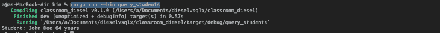

# 使用 Diesel 与 SQLx 在 Rust 中与数据库交互

> 原文：<https://blog.logrocket.com/interacting-databases-rust-diesel-vs-sqlx/>

在本教程中，我们将探索在 Rust 中与关系数据库交互时使用的两个库:Diesel 和 SQLx。

本文将使用一个简单的课堂数据库和学生来演示每种方法。我们将使用 Diesel ORM 和 SQLx 执行 CRUD 操作。

我们将涵盖的内容:

要跟随本教程，您将需要 Rust 的[工作知识，以及访问和使用 Rust、](https://blog.logrocket.com/full-stack-rust-a-complete-tutorial-with-examples/) [Rust 的构建系统和软件包管理器货物](https://blog.logrocket.com/demystifying-cargo-in-rust/)以及一个 MySQL 服务器实例的能力。

## 柴油是什么？

Diesel 是一个 ORM，支持 PostgreSQL，MySQL，SQLite。ORM 代表对象关系映射。ORMs 帮助面向对象的程序员抽象关系数据库的细节。

ORM 附带了查询构建器，所以您不必担心编写原始的 SQL 查询。使用 ORM，您可以与关系数据库通信，就像它们是面向对象的一样。

对于经验不足的开发人员来说，使用 ORM 可能更好，因为 ORM 可以处理优化的 SQL 查询。ORM 也让你不容易受到 SQL 注入攻击。

## 什么是 SQLx？

与 Diesel 不同，SQLx 不是 ORM。 [SQLx 是一个异步 Rust SQL 库](https://crates.io/crates/sqlx),具有编译时 SQL 查询检查功能。它是数据库和运行时不可知的。

SQLx 支持连接池、跨平台开发、嵌套池、异步通知、传输层安全性和其他令人兴奋的特性。使用 SQLx 时，您必须自己设计 SQL 查询和迁移。

已经触及了表面，让我们探索如何用 Diesel 和 SQLx 与关系数据库交互。

## Diesel ORM 入门

以下步骤演示了如何为使用 Diesel ORM 的货物设置 Rust 项目。

### 用 Diesel ORM 初始化一个新项目

第一步是通过运行以下命令来初始化项目:

```
cargo new -- lib classroom_diesel
cd classroom_diesel

```

在上面的代码中，我们设置了项目并将其命名为`classroom_diesel`。新项目目录应该如下所示:

```
./
│
├── src/
│   └── lib.rs
│
├── .gitignore
└── Cargo.toml

```

我们还需要用项目中需要的依赖项更新`Cargo.toml`文件，如下所示:

```
[dependencies]
diesel = { version = "1.4.4", features = ["mysql"] }
dotenv = "0.15.0"

```

`dotenv`依赖关系帮助我们管理项目中的环境变量。

### 安装 Diesel CLI

[Diesel 使用单独的 CLI 工具](https://crates.io/crates/diesel_cli)。它是一个独立的二进制文件；我们不需要将它作为依赖项添加到`cargo.toml`文件中。只需用下面的命令安装它:

```
cargo install diesel_cli

```

### 设置我们的柴油环境

我们需要在我们的环境中设置一个`DATABASE_URL`变量。这就是 Diesel 知道连接到哪个 MySQL 数据库的方法:

```
echo DATABASE_URL=mysql://<username>:<password>@localhost/<database>  > .env

```

编辑连接字符串以匹配您的本地数据库凭据。

您的项目目录现在将如下所示:

```
./
│
├── src/
│   └── lib.rs
│
├── .env
├── .gitignore
└── Cargo.toml

```

现在运行以下命令:

```
diesel setup

```

这个命令将帮助我们设置数据库，并创建一个空的迁移目录来管理数据库模式。

### 设置柴油迁移

迁移有助于 ORM 跟踪数据库操作，比如添加一个字段或删除一个表。您可以将它们视为数据库的版本控制系统。

首先，让我们使用 Diesel CLI 为教室应用程序创建一些迁移。理想情况下，我们应该有一个包含课堂学生数据的表。我们需要创建空的迁移文件，然后用 SQL 填充它们以创建一个表。

```
diesel migration generate create_students

```

您的文件树将如下所示:

```
./
│
├── migrations/
│   │
│   ├── 2022-07-04-062521_create_students/
│   │   ├── down.sql
│   │   └── up.sql
│   │
│   └── .gitkeep
│
├── src/
│   └── lib.rs
│
├── .env
├── .gitignore
├── Cargo.toml
└── diesel.toml

```

`up.sql`文件用于创建迁移，而`down.sql`文件用于撤销迁移。

使用用于迁移的 SQL 更新`up.sql`文件:

```
sql
CREATE TABLE students (
  id INTEGER AUTO_INCREMENT PRIMARY KEY,
  firstname VARCHAR(255) NOT NULL,
  lastname TEXT NOT NULL,
  age INTEGER NOT NULL
);

```

用可以反向迁移的 SQL 修改`down.sql`文件:

```
sql
DROP TABLE students;

```

在创建了`up`和`down`迁移之后，我们需要在数据库上执行 SQL:

```
diesel migration run

```

我们可以开始编写 Rust 来执行表上的查询。

### 使用 Diesel ORM 创建行

让我们编写代码，使用在`.env`文件中设置的连接字符串建立到 MySQL 服务器的连接。

```
#[macro_use]
extern crate diesel;
extern crate dotenv;

pub mod models;
pub mod schema;

use diesel::prelude::*;
use dotenv::dotenv;
use std::env;

pub fn create_connection() -> MysqlConnection {
    dotenv().ok();

    let database_url = env::var("DATABASE_URL").expect("DATABASE_URL must be set");
    MysqlConnection::establish(&database_url)
        .unwrap_or_else(|_| panic!("Error connecting to {}", database_url))
}

```

接下来，我们必须为`Students`表编写一个模型。模型是对象关系映射发生的地方。该模型将生成将`Students`表上的一行或多行转换为 Rust 中的`Student` [结构所需的代码。](https://blog.logrocket.com/fundamentals-for-using-structs-in-rust/)

```
cd ./src
touch model.rs

```

在我们刚刚创建的新`model.rs`文件中，添加以下内容:

```
use super::schema::students;

#[derive(Queryable)]
pub struct Student {
    pub id: i32,
    pub firstname: String,
    pub lastname: String,
    pub age: i32,
}

#[derive(Insertable)]
#[table_name = "students"]
pub struct NewStudent<'a> {
    pub firstname: &'a str,
    pub lastname: &'a str,
    pub age: &'a i32,
}

```

有了这个模型，`Students`表中的信息将映射到 Rust 中相应的`Student`结构。`src`文件夹现在应该是这样的:

```
src/
├── lib.rs
├── models.rs
└── schema.rs

```

现在，我们可以编写一个脚本来添加学生:

```
cd src
mkdir bin
cd bin
touch create_students.rs

```

在`create_students.rs`文件中，我们可以调用前面编写的模型和函数来创建一个新学生:

```
extern crate classroom_diesel;
extern crate diesel;

use self::classroom_diesel::*;
fn main() {
    let connection = create_connection();
    let firstname = "John";
    let lastname = "Doe";
    let age: i32 = 64;

    let student = create_post(&connection, firstname, lastname, &age);
    println!(
        "Saved student {} with id {}",
        student.firstname, student.id
    );
}

```

项目的结构现在看起来如下所示:

```
./
│
├── migrations/
│   │
│   ├── 2022-07-04-062521_create_students/
│   │   ├── down.sql
│   │   └── up.sql
│   │
│   └── .gitkeep
│
├── src/
│   │
│   ├── bin/
│   │   └── create_students.rs
│   │
│   ├── lib.rs
│   ├── models.rs
│   └── schema.rs
│
├── .env
├── .gitignore
├── Cargo.lock
├── Cargo.toml
└── diesel.toml

```

使用以下命令执行新脚本:

```
cargo run --bin create_students

```

如下图所示，`John`的新学生档案已经保存，并带有`1`的`id`。我们可以使用这个`id`来查询 Rust 数据库，这将在下一节中介绍。



### 用 Diesel ORM 查询铁锈数据库

在上一节中，我们回顾了如何使用 Diesel ORM 在 Rust 中写入数据库。理解查询或阅读是如何工作的也很重要。

让我们写一个脚本来查询一个`id`是`1`的学生。首先创建一个`query_students.rs`文件:

```
cd bin
touch query_students.rs

```

然后，在我们刚刚创建的`query_students.rs`文件中，添加以下内容:

```
extern crate classroom_diesel;
extern crate diesel;

use self::models::*;
use classroom_diesel::*;
use diesel::prelude::*;

fn main() {
    use self::schema::students::dsl::*;

    let connection = create_connection();
    let result = students
        .filter(id.eq(1))
        .load::<Student>(&connection)
        .expect("Error loading students");

    println!(
        "Student: {} {} {} years",
        result[0].firstname, result[0].lastname, result[0].age
    );
}

```

执行脚本:

```
cargo run --bin query_students

```

如下图所示，结果是一个打印行，包含我们从数据库中查询的学生文件的名字、姓氏和年龄:


## SQLx 入门

现在我们知道了如何创建一个使用 Diesel ORM 与 Rust 中的数据库进行交互的项目，让我们看看如何创建一个使用 SQLx 的项目。

### 用 SQLx 初始化新项目

通过运行以下命令开始:

```
cargo new classroom_sqlx --bin

```

然后，将所需的依赖项添加到`cargo.toml`文件中:

```
[dependencies]
sqlx = { version = "0.5", features = [  "runtime-async-std-native-tls", "mysql" ] }
async-std = { version = "1", features = [ "attributes" ] }

```

关于设置，这就是你所需要的全部。简单吧？

要使用 SQLx 与 Rust 中的数据库进行交互，我们所要做的就是编写一些 SQL 查询和 Rust 代码。在 Diesel ORM 部分，我们创建并读取了一个学生记录；在本节中，我们将编写查询来更新和删除记录。

### 使用 SQLx 和 Rust 更新或删除数据库记录

首先，我们需要编写一些 Rust 代码来将 SQLx 连接到 MySQL 服务器:

```
//main.rs

use sqlx::mysql::MySqlPoolOptions;

#[async_std::main]
async fn main() -> Result<(), sqlx::Error> {
    let pool = MySqlPoolOptions::new()
        .max_connections(7)
        .connect("mysql://root:@localhost/classroom_diesel")
        .await?;

    Ok(())
}

```

SQLx 支持准备好的和未准备好的 SQL 查询。准备好的 SQL 查询反对 SQL 注入。

让我们看看如何更新主键为 1 的记录的名字和姓氏:

```
use sqlx::mysql::MySqlPoolOptions;

#[async_std::main]
async fn main() -> Result<(), sqlx::Error> {
    let pool = MySqlPoolOptions::new()
        .max_connections(5)
        .connect("mysql://root:@localhost/classroom_diesel")
        .await?;

    sqlx::query("UPDATE students SET firstname=?, lastname=? WHERE id=?")
        .bind("Richard")
        .bind("Roe")
        .bind(1)
        .execute(&pool)
        .await?;
    Ok(())
}

```

使用以下命令执行脚本:

```
cargo run

```

删除记录也采用类似的模式；唯一的区别是 SQL 查询:

```
use sqlx::mysql::MySqlPoolOptions;

#[async_std::main]
async fn main() -> Result<(), sqlx::Error> {
    let pool = MySqlPoolOptions::new()
        .max_connections(5)
        .connect("mysql://root:@localhost/classroom_diesel")
        .await?;

    sqlx::query("DELETE FROM students WHERE id=?")
        .bind(1)
        .execute(&pool)
        .await?;
    Ok(())
}

```

使用以下命令执行脚本:

```
cargo run

```

现在，您可以使用 Diesel 或 SQLx 与 Rust 中的数据库进行交互。

## 结论

柴油之类的 ORM 就足够了；它们帮助您生成一些您需要的 SQL。大多数情况下，在应用程序中，足够是您所需要的。

然而，在更广泛的应用程序中，要让 ORM 正常工作并生成高性能的 SQL 查询，可能需要更多的“魔力”——换句话说，需要您的时间和精力。

如果需要创建具有高容量和低延迟需求的更复杂的查询，使用像 SQLx 这样的库来执行原始 SQL 查询可能会更好。

## [log rocket](https://lp.logrocket.com/blg/rust-signup):Rust 应用的 web 前端的全面可见性

调试 Rust 应用程序可能很困难，尤其是当用户遇到难以重现的问题时。如果您对监控和跟踪 Rust 应用程序的性能、自动显示错误、跟踪缓慢的网络请求和加载时间感兴趣，

[try LogRocket](https://lp.logrocket.com/blg/rust-signup)

.

[](https://lp.logrocket.com/blg/rust-signup)

LogRocket 就像是网络和移动应用程序的 DVR，记录你的 Rust 应用程序上发生的一切。您可以汇总并报告问题发生时应用程序的状态，而不是猜测问题发生的原因。LogRocket 还可以监控应用的性能，报告客户端 CPU 负载、客户端内存使用等指标。

现代化调试 Rust 应用的方式— [开始免费监控](https://lp.logrocket.com/blg/rust-signup)。