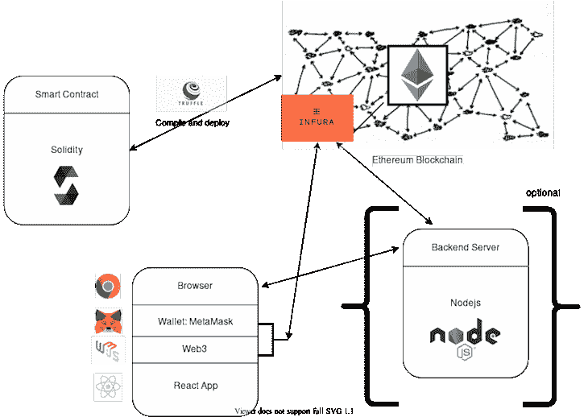
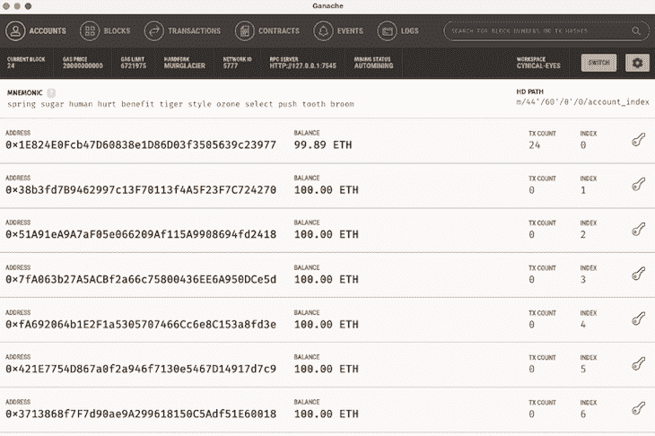
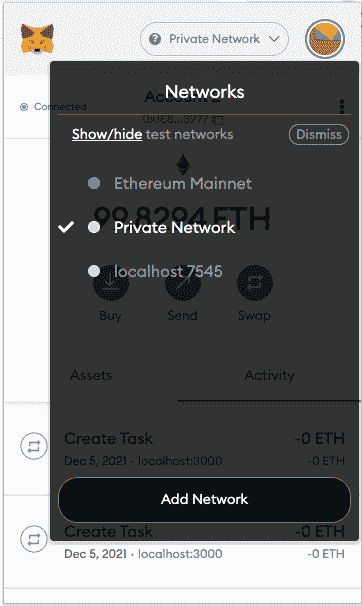
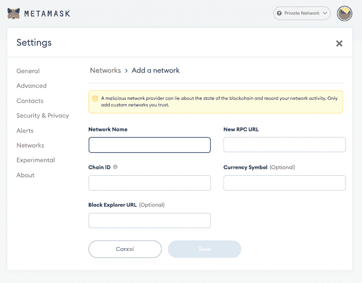
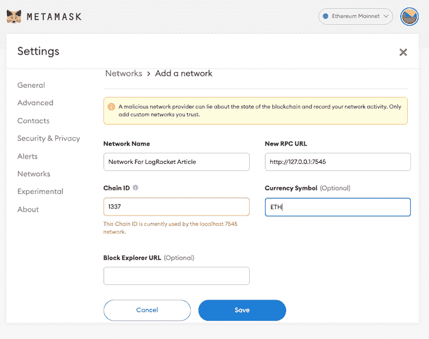

# 通过 React 和 Node.js API - LogRocket 博客与智能合约进行交互

> 原文：<https://blog.logrocket.com/interacting-smart-contracts-via-nodejs-api/>

构建 DApp 时，您和您的用户都需要一个第三方的、特定于浏览器的插件或扩展，以便用户与您的智能合约进行交互。在撰写本文时，还没有主流浏览器具备在区块链节点上与智能合约交互的内置能力。

如果用户不用安装所需的扩展，而是可以使用您的 DApp 立即与智能合约进行交互，会怎么样？在本文中，我们将构建一个 Node.js API，它将使用 [Web3.js](https://web3js.readthedocs.io/en/v1.7.0/) 与区块链网络交互并从其检索数据，然后使用 React 在浏览器应用程序上将数据发送回用户。

要继续阅读本文，您可以在这个 [GitHub 库](https://github.com/zafar-saleem/blockchain-node)访问完整的代码。但是在我们开始我们的项目之前，让我们考虑一下区块链技术的一些基本原理。



## 区块链技术基础

区块链技术基于一个去中心化的系统。要理解分散式系统，我们首先需要理解集中式系统。脸书、谷歌、Twitter、Instagram 和 WhatsApp 等大多数在线服务都使用集中式系统，这意味着用户数据存储在他们的服务器上，组织可以在集中式服务器或数据库中完全访问这些数据。

在分散式系统中，用户数据分布在区块链网络的几个节点中，每个节点都包含该数据的完整副本。这些节点不属于一个单一的实体，而是属于全世界的个人

要理解区块链，您需要理解三个重要的概念，块、挖掘器和节点。

区块链网络由链组成，每个链由块组成。块有三个元素:块中的数据、一个 nonce(32 位整数)和一个 hash(256 位数字)。

通过采矿过程，矿工们在矿链中创造出新的区块。挖掘一个块是一个相当困难的过程，因为每个块都有一个对链中前一个块的散列的引用。

节点是指区块链中的计算机或任何其他电子设备。去中心化是区块链技术的核心。没有一台计算机或组织可以拥有这个链；相反，它是通过连接到链上的节点来分发的。

## 入门指南

为了开始我们的项目，我们需要设置 [Ganache 和 Truffle，这允许我们使用智能合约](https://blog.logrocket.com/develop-test-deploy-smart-contracts-ganache/)。

首先，[从其官网下载松露](https://trufflesuite.com/)，然后用下面的命令安装:

```
npm i truffle -g
```

要安装 Ganache，你可以[跟随官方文档](https://trufflesuite.com/ganache/)。打开后，您会看到如下所示的屏幕:



### **设置元掩码**

继续将 [Metamask](https://chrome.google.com/webstore/detail/metamask/nkbihfbeogaeaoehlefnkodbefgpgknn?hl=en) 扩展添加到 Google Chrome。一旦 Metamask 被添加到你的 Chrome 浏览器中，点击**扩展**图标，你应该会看到一个类似下面的屏幕。请记住，如果这是您第一次打开元掩码，您可能看不到列表中的任何网络:


现在，点击**私有网络**。您应该会看到下面的屏幕，其中列出了所有不同的网络。



点击**添加网络**，你应该会被重定向到一个不同的页面，类似下图。



在表格中填写以下详细信息:



请忽略链 ID 的错误。元掩码将接受这一点。现在，您可以点击**保存**，当您点击 Chrome 中的 Metamask 扩展时，您应该会在列表中看到您新创建的网络，如下所示:


## 设置后端

要开始构建我们的后端，首先，确保已经在您的机器上全局安装了 pnpm。我们将使用 pnpm 而不是 npm 或 Yarn。如果您还没有安装 pnpm，请运行下面的命令来安装它:

```
npm install pnpm -g

```

接下来，确保您已经全局安装了 nodemon 如果没有，请运行以下命令进行安装:

```
npm install nodemon -g

```

启动 Ganache，然后打开您的终端，按照下面的命令操作:

```
mkdir blockchain-node
cd blockchain-node
mkdir blockchain-node-api
cd blockchain-node-api
pnpm init -y

```

在您喜欢的代码编辑器中打开您的项目，打开`package.json`文件，然后在该文件中添加以下代码:

```
{
  "name": "blockchain-node-api",
  "version": "1.0.0",
  "description": "",
  "main": "index.js",
  "scripts": {
    "test": "echo \"Error: no test specified\" && exit 1",
    "start": "nodemon server.js",
    "build": "node server.js"
  },
  "keywords": [],
  "author": "",
  "license": "ISC",
  "dependencies": {
    "@truffle/contract": "^4.4.1",
    "cors": "^2.8.5",
    "express": "^4.17.2",
    "mongodb": "^4.2.2",
    "nodemon": "^2.0.15",
    "web3": "^1.6.1"
  }
}

```

要安装上述所有依赖项，请运行以下命令:

```
pnpm install

```

## 撰写您的第一份智能合同

要将您的项目初始化为 Truffle 项目，请在`blockchain-node-api`中运行以下命令:

```
truffle init

```

上面的命令将生成几个文件夹。在`contracts`文件夹中，创建一个名为`Contacts.sol`的新文件，并将下面的代码粘贴到其中:

```
pragma solidity ^0.8.10;

contract Contacts {
  uint public count = 0; // state variable

  struct Contact {
    uint id;
    string name;
    string phone;
  }

  constructor() public {
    createContact('Zafar Saleem', '123123123');
  }

  mapping(uint => Contact) public contacts;

  function createContact(string memory _name, string memory _phone) public {
    count++;
    contacts[count] = Contact(count, _name, _phone);
  }
}

```

现在，你有了[你的第一个使用 Solidity](https://blog.logrocket.com/writing-smart-contracts-solidity/) 的智能合约。我们使用关键字`contract`创建了一个智能契约，并将其命名为`Contacts`。在`Contacts`内部，我们创建了一个名为`count`的状态公共变量。

接下来，我们使用关键字`struct`创建了一个结构，并将其命名为`Contact`。我们添加了`id`、`name`和`phone`作为属性。之后，我们创建了一个构造函数。在该函数中，我们通过调用`createContact`函数向契约添加了一个联系人，该函数在契约类的末尾声明。

我们创建了`map`来在合同中添加联系人。我们声明了`createContact`，并将`name`和`phone`作为参数传递。请注意，这是一个公共函数。然后，我更新状态变量`count`，我在`contacts map`中将其用作`id`。

至此，我们已经完成了我们的第一份智能合同。现在，我们将把我们的智能合约部署到 Truffle。在`migrations`文件夹中创建一个名为`2_deploy_contacts.js`的新文件，并粘贴以下代码:

```
const Contacts = artifacts.require("./Contacts.sol");

module.exports = function(deployer) {
  deployer.deploy(Contacts);
};

```

接下来，打开您的`truffle-config.js`文件并将下面的代码粘贴到其中:

```
module.exports = {
  networks: {
    development: {
      host: "127.0.0.1",
      port: 7545,
      network_id: "*"
    }
  },
  compilers: {
    solc: {
      version: "0.8.10",
      optimizer: {
        enabled: true,
        runs: 200
      }
    }
  }
}

```

确保上述所有信息与您的 Ganache 网络设置一致，尤其是`host`和`port`。然后，运行以下命令:

```
truffle migrate

```

该命令可能需要几秒钟时间来迁移您的智能合同。

## 编写 Node.js API

随着我们的智能契约编写并部署到 Truffle，我们可以编写 API，作为我们的前端应用程序和我们的智能契约之间的一个层。在`blockchain-node-api`文件夹中，创建名为`routes.js`、`server.js`和`config.js`的文件。然后，打开`server.js`文件，粘贴下面的代码:

```
const express = require('express');
const app = express();
const cors = require('cors');
const routes = require('./routes');
const Web3 = require('web3');
const mongodb = require('mongodb').MongoClient;
const contract = require('@truffle/contract');
const artifacts = require('./build/contracts/Contacts.json');
const CONTACT_ABI = require('./config');
const CONTACT_ADDRESS = require('./config');

app.use(cors());
app.use(express.json());

if (typeof web3 !== 'undefined') {
        var web3 = new Web3(web3.currentProvider); 
} else {
        var web3 = new Web3(new Web3.providers.HttpProvider('http://localhost:7545'));
}

mongodb.connect('mongodb://127.0.0.1:27017/blockchain-node-api',
        {
                useUnifiedTopology: true,
        }, async (err, client) => {
        const db =client.db('Cluster0');
        const accounts = await web3.eth.getAccounts();
        const contactList = new web3.eth.Contract(CONTACT_ABI.CONTACT_ABI, CONTACT_ADDRESS.CONTACT_ADDRESS);

        routes(app, db, accounts, contactList);
        app.listen(process.env.PORT || 3001, () => {
                console.log('listening on port '+ (process.env.PORT || 3001));
        });
});

```

`server.js`是作为 Node.js 服务器运行的主文件。我需要文件开头的所有依赖项。然后，使用`cors`和 Express，我检查 Web3.js 并通过提供一个`localhost`地址使它与区块链网络交互。

接下来，我将连接到一个 MongoDB 数据库。虽然在本文中我们没有使用任何数据库，但是为将来的使用做好准备是很好的。在`mongodb.connect()`函数的回调函数中，我正在连接`Cluster0`并从以太坊区块链网络获取`accounts`。

使用`web3 Contract`函数，其中我传递了`CONTACT_ABI`和`CONTACT_ADDRESS`，我与智能合同建立了连接。我们将把这些信息添加到我们之前创建的`config.js`文件中。

接下来，我们将使用所有参数调用`routes()`。我将在我们之前创建的`routes.js`文件中创建这个`routes`函数。可以在`port 3001`上听 app。让我们转到`config.js`文件，打开它，并添加下面的代码:

```
const CONTACT_ADDRESS = '0xB7fC6C3DFebD24EAe16E307Ea39EdF7c93ff7866';

const CONTACT_ABI = [
        {
    "inputs": [],
    "stateMutability": "nonpayable",
    "type": "constructor"
  },
  {
    "inputs": [
      {
        "internalType": "uint256",
        "name": "",
        "type": "uint256"
      }
    ],
    "name": "contacts",
    "outputs": [
      {
        "internalType": "uint256",
        "name": "id",
        "type": "uint256"
      },
      {
        "internalType": "string",
        "name": "name",
        "type": "string"
      },
      {
        "internalType": "string",
        "name": "phone",
        "type": "string"
      }
    ],
    "stateMutability": "view",
    "type": "function",
    "constant": true
  },
  {
    "inputs": [],
    "name": "count",
    "outputs": [
      {
        "internalType": "uint256",
        "name": "",
        "type": "uint256"
      }
    ],
    "stateMutability": "view",
    "type": "function",
    "constant": true
  },
  {
    "inputs": [
      {
        "internalType": "string",
        "name": "_name",
        "type": "string"
      },
      {
        "internalType": "string",
        "name": "_phone",
        "type": "string"
      }
    ],
    "name": "createContact",
    "outputs": [],
    "stateMutability": "nonpayable",
    "type": "function"
  }
];

module.exports = {
        CONTACT_ABI,
        CONTACT_ADDRESS,
};

```

我们将需要这些信息来使用`server.js`文件中的 Web3.js 连接智能合约，就像我们之前所做的那样。接下来，我们将以下代码添加到我们的`routes.js`文件中:

```
function routes(app, db, accounts, contactList) {
        app.get('/contacts', async (request, response) => {
                let cache = [];
                const COUNTER = await contactList.methods.count().call();

                for (let i = 1; i <= COUNTER; i++) {
      const contact = await contactList.methods.contacts(i).call();
      cache = [...cache, contact];
    }

    response.json(cache);
  });
}

module.exports = routes

```

在这个文件中，我用所有需要的参数创建了一个`routes`函数。接下来，我将使用`GET`路由作为`/contacts`端点。在回调函数中，我创建了一个缓存变量。然后，我们通过调用`count()`函数从智能契约中获得一个`COUNTER`，这是在我们创建一个名为`count`的公共状态变量时自动创建的。

然后，我们遍历所有的`COUNTER`并从`contactList`中逐个获取`contacts`，我将它放在`cache`变量中，最后作为响应发送到前端。

在文件的最后，我们将导出`routes`函数，这样我们就可以在其他函数中使用它，比如本例中的`server.js`。

* * *

### 更多来自 LogRocket 的精彩文章:

* * *

现在，使用以下命令运行服务器:

```
nodemon server.js

```

上面的命令将运行服务器，服务器现在准备好接收来自 React 应用程序的请求。

## 用 React 构建我们的前端

现在，我们的智能合约、Node.js 服务器和 API 已经准备好了，我们可以编写前端 React 应用程序了。`CD`到`blockchain-node`文件夹，然后运行下面的命令创建一个 React 项目:

```
pnpx create-react-app blockchain-node-api-react

```

新项目加载后，打开您的`App.js`文件，用以下代码替换现有代码:

```
import { useEffect, useState } from 'react';
import logo from './logo.svg';
import './App.css';

function App() {
        const [contacts, setContacts] = useState([]);

        useEffect(() => {
                async function fetcher() {
                        const response = await fetch('http://localhost:3001/contacts');        
                        const contacts = await response.json();

                        setContacts(contacts);
                }

                fetcher();
        }, []);

  return (
    <div>
            <ul>
      {
              contacts.map(contact => (
                      <li key={contact.id}>
                              <p>Name: {contact.name}</p>
                              <span>Phone: {contact.phone}</span>
                      </li>
              ))
      }
      </ul>
    </div>
  );
}

export default App;

```

上面的代码生成了一个简单的 React 函数组件，我在其中声明了局部状态变量`contacts`。

在`useEffect`钩子中，我们向刚刚创建的 Node.js 服务器发出请求。我们的服务器使用 Web3.js 从区块链网络获取所有联系人，然后将这些联系人发送到我们的 React 应用程序。我们将这些来自服务器的联系人放入一个`contacts`变量，并在本地状态变量`contacts`中设置它。在`jsx`中，我们循环遍历所有的联系人，并将它们呈现在屏幕上。

使用以下命令运行 React 应用程序:

```
yarn start

```

上面的命令将打开您的浏览器，您将看到如下所示的输出:


## 结论

在本文中，我们创建了一个 Node.js API，它允许您的用户与智能合约进行交互，而无需安装第三方扩展。我们讲述了理解区块链技术的一些基础知识，用 Node.js 构建我们的后端，编写智能合同，最后用 React 构建我们的前端。

我希望你喜欢这个教程，如果你有任何问题，一定要留下评论。此外，不要忘记关注我的简历中链接的社交媒体账户，并与我联系。

## [LogRocket](https://lp.logrocket.com/blg/react-signup-general) :全面了解您的生产 React 应用

调试 React 应用程序可能很困难，尤其是当用户遇到难以重现的问题时。如果您对监视和跟踪 Redux 状态、自动显示 JavaScript 错误以及跟踪缓慢的网络请求和组件加载时间感兴趣，

[try LogRocket](https://lp.logrocket.com/blg/react-signup-general)

.

[ ](https://lp.logrocket.com/blg/react-signup-general) [](https://lp.logrocket.com/blg/react-signup-general) 

LogRocket 结合了会话回放、产品分析和错误跟踪，使软件团队能够创建理想的 web 和移动产品体验。这对你来说意味着什么？

LogRocket 不是猜测错误发生的原因，也不是要求用户提供截图和日志转储，而是让您回放问题，就像它们发生在您自己的浏览器中一样，以快速了解哪里出错了。

不再有嘈杂的警报。智能错误跟踪允许您对问题进行分类，然后从中学习。获得有影响的用户问题的通知，而不是误报。警报越少，有用的信号越多。

LogRocket Redux 中间件包为您的用户会话增加了一层额外的可见性。LogRocket 记录 Redux 存储中的所有操作和状态。

现代化您调试 React 应用的方式— [开始免费监控](https://lp.logrocket.com/blg/react-signup-general)。