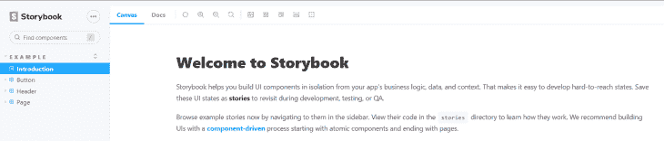
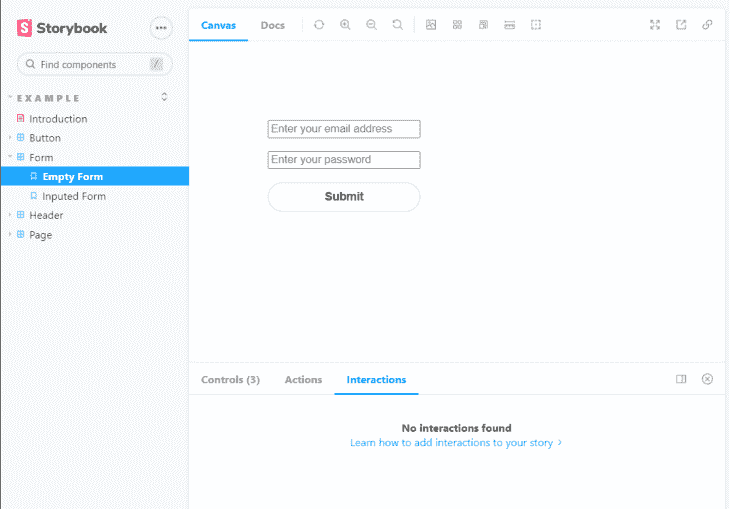
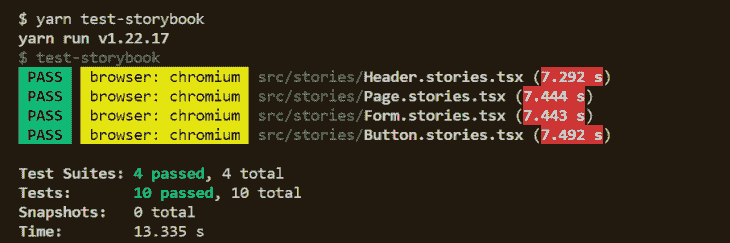
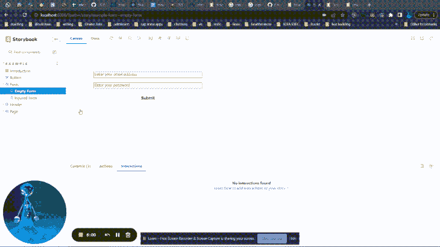

# 如何用 React 18 和 Storybook 做交互测试

> 原文：<https://blog.logrocket.com/interaction-testing-react-storybook/>

在本文中，我们将重点测试使用 React 18 和 Storybook 时组件的交互。在我们开始之前，你可能想要阅读这篇来自 Chak 顺宇的介绍性文章，它探索了 React 18 的新 API，以及宣布 React 18 的博客文章[，它提供了对 React 18 的新的、选择加入的并发渲染能力的深入见解。](https://reactjs.org/blog/2022/03/29/react-v18.html)

## 什么是交互测试？

交互测试包括测试 React 组件内的交互。这些测试模拟应用程序中的用户操作，例如通过单击按钮或输入输入组件与组件进行交互，以及此类交互后应用程序的行为。

在现代应用程序中，组件承担了比以前更多的责任，因为开发人员已经开始在组件中包含数据获取操作和状态管理工具等内容。通过交互测试，我们可以更有效地验证应用程序用户界面的功能。

## 故事书如何帮助交互测试？

Storybook 是一个开源工具，可以让你独立地构建 UI 组件和页面。它允许您为组件构建文档，这使得组件易于重用，并允许对它们进行可视化测试，这有助于防止错误。

要开始使用 Storybook，我们需要在现有项目的根目录下运行 Storybook CLI。在本例中，我们的项目是一个 React 应用程序，使用 [Create React App](https://blog.logrocket.com/tag/create-react-app) 创建。

运行下面的命令，引导 React 应用程序并添加一个故事。

创建 React 应用程序:

```
npx create-react-app reactstorybook -template typescript
yarn start
```

打开另一个终端窗口，初始化我们项目根目录下的 Storybook。

```
npx storybook init
yarn storybook
```

初始化完成后，Storybook 应该在本地启动并输出一个地址。根据计算机的配置，故事书环境可能会在浏览器中自动打开。



故事是接受一组参数的组件，这些参数描述了如何呈现组件。它本质上捕获了 UI 组件的呈现状态。

在我们的 Create React 应用程序中初始化 Storybook 后，Storybook 创建示例组件，演示可以用 Storybook 构建的组件类型，即按钮、标题和页面。

示例组件概述了 Storybook 如何管理不同故事的状态。Storybook UI 上显示的按钮组件的故事可以在我们的代码编辑器中找到。

在 React 应用程序的根目录中，打开终端窗口并输入以下命令来查看按钮组件的代码及其故事。

```
code src/stories/Button.stories.tsx 
code src/stories/Button.tsx
```

Storybook 中的故事的一个关键重要性是使开发人员能够跟踪 UI 在发生变化时的外观。这有助于防止[意外回归](https://blog.logrocket.com/automated-visual-regression-testing-with-jest/)，Timothy Vernon 在他的帖子中对此进行了更多的讨论，该帖子为开发人员提供了使用 Jest 处理视觉回归的测试策略。

## 故事书中组件的测试方法

Storybook 提供了一个独立测试组件的环境。测试已经写好的故事是很重要的，因为它有助于随着时间的推移防止 UI 错误。

Storybook 附带了各种工具，可以测试 UI、模拟数据或依赖关系，甚至模拟网络请求。[测试转轮](https://storybook.js.org/docs/react/writing-tests/test-runner)就是这样的工具之一。它使开发人员能够自动测试整本故事书并捕捉破碎的故事。

当使用 Storybook 进行测试时，开发人员可以使用各种测试方法。

### 视觉回归测试

视觉回归测试有助于捕捉 UI 外观中的错误。它的工作原理是截取每个故事的截图，然后进行比较，找出变化。Storybook 非常适合运行可视化测试，因为每个故事都是一个测试规范。

视觉回归测试不应该与快照测试混淆，因为快照是通过将每个故事的渲染标记与已知基线进行比较来工作的。快照测试不如视觉回归测试准确，因为它们比较的是 HTML 的 blobs，而不是显示给用户的内容。这可能导致误报，因为代码变化不会产生视觉变化。

### 可访问性测试

质量保证专家依靠易访问性测试来捕捉应用程序开发过程中出现的易访问性变化。可访问性测试依赖于 [Web 内容可访问性指南](https://www.w3.org/WAI/standards-guidelines/wcag/) (WCAG)规则来审核呈现的 DOM。如果呈现的 DOM 中的元素不符合 WCAG 规则，就会抛出可访问性违规。

Storybook 为使用 [a11y 附加组件](https://storybook.js.org/addons/@storybook/addon-a11y)测试应用程序的可访问性[提供了一个非常方便的工具。](https://blog.logrocket.com/testing-accessibility-storybook/)

## 如何在 React 18 中用故事书进行交互测试

现在，是时候看看 Storybook 和 React 18 的交互测试是如何工作的了。

如前所述，交互测试测试与 React 组件的交互。在交互测试中，目标是假装成用户，这涉及到诸如打字和点击按钮之类的动作，并确保收到预期的输出。

React 组件的主要目标是在给定一组道具的情况下呈现 UI，但也有一些复杂的组件跟踪应用程序状态。

Storybook 版本中包含的`play`函数会在故事加载后立即执行。`play`函数是测试我们组件的关键；通过`play`功能，你可以模拟用户的行为。然后可以使用[测试运行器](https://storybook.js.org/docs/react/writing-tests/test-runner)来确认组件是否正确渲染，并检查与`play`函数的交互测试是否通过。

要做到这一点，您需要安装两个关键包:

在我们项目的根目录下打开终端，安装列出的包。

* * *

### 更多来自 LogRocket 的精彩文章:

* * *

```
yarn add -dev @storybook/testing-library @storybook/jest @storybook/test-runner [email protected]
```

如果你使用的是旧版本的故事书，检查你的`package.json`以确认`@storybook/addon-interactions`包在`devDependencies`中可用。如果不是，安装带有`--dev` 标志的包，因为它是在 Storybook 中设置交互测试不可或缺的。

### 如何使用 interactions 附加组件更新您的故事书配置

```
module.exports = {
  stories: ["../src/**/*.stories.mdx", "../src/**/*[email protected](js|jsx|ts|tsx)"],
  addons: [
    "@storybook/addon-links",
    "@storybook/addon-essentials",
    "@storybook/addon-interactions", // Addon has to be registered
    "@storybook/preset-create-react-app",
  ],
  features: {
    interactionsDebugger: true, // enable playback controls
  },
  framework: "@storybook/react",
  core: {
    builder: "@storybook/builder-webpack5",
  },
};

```

## 用 Storybook 和`play`函数创建一个交互测试

`play`函数保存测试的逻辑，并连接到我们想要测试的故事。让我们看看如何用 Storybook 和`play`函数设置一个交互测试。

我们依靠`@storybook/testing-library`和`@storybook/jest`包来帮助解决这个问题。

### 创建故事书组件

为了体验幕后发生的事情，我们将创建一个具有两种状态的表单组件:

1.  表单没有输入的一种状态
2.  一种状态由`play`函数处理，使用交互来填充输入

在`stories`目录下，创建文件`Form.tsx`和`Form.stories.tsx`。

```
touch src/stories/Form.tsx
touch src/stories/form.css
touch src/stories/Form.stories.tsx
```

是我们的第一个组成部分。在该文件中，粘贴以下代码:

```
import React from "react";
import { Button } from "./Button";
import "./form.css";

interface FormProps {
  placeholder?: string;
  label?: string;
  name?: string;
}

export const Form = ({
  placeholder = "Enter your email",
  ...props
}: FormProps) => {
  const [details, setDetails] = React.useState(false);

  const onClick = () => {
    setDetails(true);
  };

  return (
    <div className="form-wrapper">
      <input
        autoComplete="off"
        placeholder="Enter your email address"
        className={"storybook-input"}
        name="email"
        aria-label="email"
        id="email"
        data-testid="email"
        {...props}
      />
      <input
        autoComplete="off"
        placeholder="Enter your password"
        className={"storybook-input"}
        name="password"
        id="password"
        data-testid="password"
        {...props}
      />
      <Button label="Submit" onClick={() => onClick()} />
      {details === true ? (
        <p>
          Get ready to experience great development experience with storybook
        </p>
      ) : (
        ""
      )}
    </div>
  );
};

```

创建我们的 CSS 文件。

```
code src/stories/form.css
```

```
.form-wrapper {
  padding: 5rem;
  display: flex;
  flex-direction: column;
  gap: 1rem;
  width: 30%;
}

```

### 创建组件的初始状态

现在，父表单已经设置好了，是时候创建组件的初始状态了。让我们从设置一个故事来设置表单的初始状态开始。

```
code src/stories/Form.stories.tsx
```

```
import React from "react";
import { ComponentStory, ComponentMeta } from "@storybook/react";
import { within, userEvent } from "@storybook/testing-library";
import { expect } from "@storybook/jest";
import { Form } from "./Form";

export default {
  title: "Example/Form",
  component: Form,
} as ComponentMeta<typeof Form>;

const Template: ComponentStory<typeof Form> = (args) => <Form {...args} />;

export const EmptyForm = Template.bind({});

export const InputedForm = Template.bind({});

```

在上面的代码块中，我们故事的基础部分已经构建好了。



### 添加`play`功能

是时候设置在故事渲染完成后运行的`play`函数了。使用`play`功能，可以测试用户工作流。

```
// the play function comes into use
InputedForm.play = async ({ canvasElement }) => {
  // start querying the component from its root element
  const canvas = within(canvasElement);

  // the key part, where the interactions are defined
  // Simulate interactions with the component
  await userEvent.type(canvas.getByTestId("email"), "[email protected]");

  await userEvent.type(canvas.getByTestId("password"), "a-due-password");

  await userEvent.click(canvas.getByRole("button"));

  // assert DOM structure
  await expect(
    canvas.getByText(
      "Get ready to experience great development experience with storybook"
    )
  ).toBeInTheDocument();
};

```

使用上面的代码块，我们已经建立了交互测试。模拟用户与组件的交互，即填写表单和提交表单。

我们将依靠`test-runner` 来确认组件是否正确渲染。更新您的`package.json`脚本来启用测试运行程序。

```
  "scripts": {
    "test-storybook": "test-storybook",
  },

```

使用以下命令运行测试运行程序。

```
yarn test-storybook
```



确认通过测试后，我们可以导航到包含故事书 UI 组件的浏览器窗口，观察交互测试的运行情况。



故事书中的交互测试类似于测试图书馆的用户事件 API。如果您使用用户事件 API，您将获得使用`[fireEvent](https://testing-library.com/docs/dom-testing-library/api-events#fireevent)`方法执行浏览器交互的高级模拟的能力。

## 结论

构建复杂的 ui 可能是一项困难的活动，尤其是在多个团队成员之间进行开发的时候。但是用 Storybook 构建 ui，非常重视构建小的原子组件，意味着可以更有效地测试组件。

视觉测试是 Storybook 擅长的一个领域，有了新的交互测试工具，我们可以很容易地看到 Storybook 生态系统已经变得多么强大。

## [LogRocket](https://lp.logrocket.com/blg/react-signup-general) :全面了解您的生产 React 应用

调试 React 应用程序可能很困难，尤其是当用户遇到难以重现的问题时。如果您对监视和跟踪 Redux 状态、自动显示 JavaScript 错误以及跟踪缓慢的网络请求和组件加载时间感兴趣，

[try LogRocket](https://lp.logrocket.com/blg/react-signup-general)

.

[ ](https://lp.logrocket.com/blg/react-signup-general) [](https://lp.logrocket.com/blg/react-signup-general) 

LogRocket 结合了会话回放、产品分析和错误跟踪，使软件团队能够创建理想的 web 和移动产品体验。这对你来说意味着什么？

LogRocket 不是猜测错误发生的原因，也不是要求用户提供截图和日志转储，而是让您回放问题，就像它们发生在您自己的浏览器中一样，以快速了解哪里出错了。

不再有嘈杂的警报。智能错误跟踪允许您对问题进行分类，然后从中学习。获得有影响的用户问题的通知，而不是误报。警报越少，有用的信号越多。

LogRocket Redux 中间件包为您的用户会话增加了一层额外的可见性。LogRocket 记录 Redux 存储中的所有操作和状态。

现代化您调试 React 应用的方式— [开始免费监控](https://lp.logrocket.com/blg/react-signup-general)。