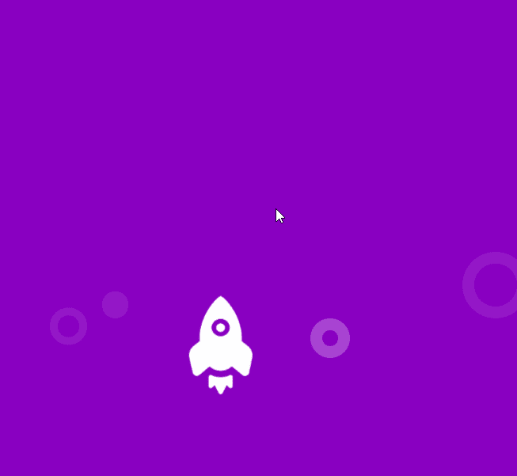
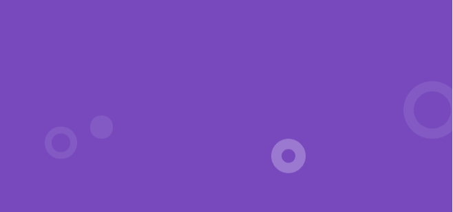
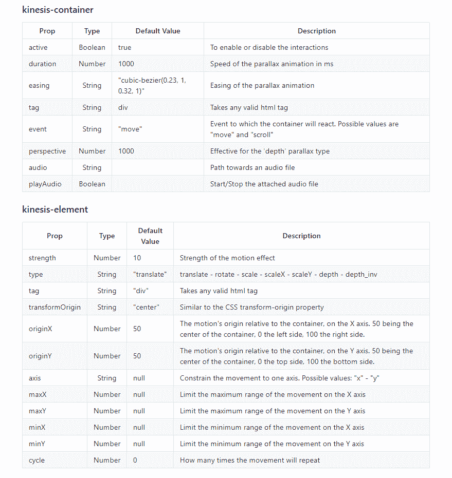
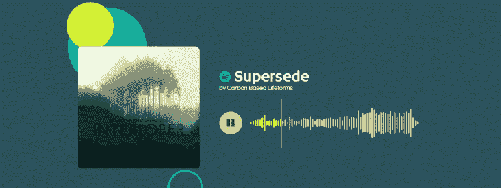

# 互动 Vue 动画与 Kinesis - LogRocket 博客

> 原文：<https://blog.logrocket.com/interactive-vue-animations-with-kinesis/>

如果你已经使用网络和移动应用有一段时间了，你会知道优秀的动画会给你的应用带来惊喜，并给你的用户留下印象。

他们在用户中的吸引力使得动画成为提升 UX 的一个很好的方式。

有时，您需要这些动画根据用户交互做出反应，例如，滚动、光标移动或单击。

在这篇文章中，我们将把 Vue Kinesis 交互式动画库集成到我们的 Vue.js 应用程序中。

Vue.js 是一个开发人员友好的、渐进的 JavaScript 框架，非常适合用一个软的学习曲线来制作快速的应用程序。

Vue 的易用性在很大程度上归功于其 CLI 库，它使任何人都可以快速构建应用程序，而无需花费数小时进行配置。

[另一方面，Vue Kinesis](https://www.instagram.com/aminerman/) 是一组组件，允许你为你的 Vue.js 应用程序创建交互式动画。

## 我们正在创造的东西

我们想创建一个互动的 LogRocket 标志动画，对光标移动作出反应。



从上面牛逼的 gif 可以看出，火箭是根据光标移动的。

背景中的元素也跟着运动。

### 入门指南

在开始之前，我们将创建 Vue.js 项目，然后安装 Kinesis 库。

没有什么比创建一个 Vue.js 项目更简单的了:首先，安装 [Vue CLI](https://cli.vuejs.org/guide/installation.html) 。

然后，在您的终端中，键入`vue create <project-name>`并简单地遵循默认步骤。

安装完成后，可以清除不用的组件(Hello.vue)，保持一个干净的 App.vue。

我们需要一个干净的项目来开始玩给定的例子。

### 添加 Kinesis 插件

现在我们需要安装我们的交互式动画库，Kinesis。进入项目文件后，我们将在终端中运行以下命令:

```
npm install -i vue-kinesis
```

打开您的`main.js`文件，复制以下代码，将 Kinesis 添加到您的 Vue 项目中:

```
import Vue from 'vue'
import VueKinesis from 'vue-kinesis'

Vue.use(VueKinesis)
```

现在你已经添加了`VueKinesis`，你可以在你的 Vue `<template>`标签中使用任何 Kinesis 组件。

### 玩一个简单的例子

在我们实现我们想要的动画之前，为了让我们自己更熟悉 Kinesis 库，我们将旋转一个取自其网站的例子。

这将有助于我们理解图书馆的行为。

```
<div id="app">    
    <kinesis-container>
     Here, you can put
       <kinesis-element :strength="10">
          whatever
       </kinesis-element>
       <kinesis-element :strength="20">
          content!
       </kinesis-element>
    </kinesis-container>
</div>
```

以上是我从 [Kinesis 的主页](https://www.aminerman.com/kinesis/#/)上得到的片段。

这些标签是 Kinesis 组件:`kinesis-container`标签能够容纳大量的`kinesis-element`。然而，一个元素不可能离开它的容器而存在。

`strength`属性其实就是动画因子。更高的强度将导致更高的运动。

下面是使用 [2 材质 svg 图标](https://material.io/resources/icons/)的示例说明。(试着在两个图标周围移动鼠标。)

> > runtime-haze-3sqge 由 blurdylan 使用@vue/cli-plugin-babel，vue，vue-kinesis

### 创造我们的互动动画

让我们开始用 Vue Kinesis 构建我们的自定义交互动画。

* * *

### 更多来自 LogRocket 的精彩文章:

* * *

从上面我们的 gif 分析来看，我们只有一个紫色的背景，一个动画的火箭，后面还有一些移动的圆圈。

我们如何通过 Kinesis 实现这一点？

首先，清理您的`App.vue`文件中的模板标签。

请注意，唯一移动的元素是火箭和四个圆圈。

这仅仅意味着我们应该拥有的唯一的`kinesis-element`标签将在这五个元素上。我们已经可以这样构造模板文件了:

```
<template>
  <div id="app">
    <kinesis-container class="container">
      <kinesis-element>
        <!-- LogRocket logo -->
      </kinesis-element>

      <!-- background-circles-props -->
      <kinesis-element>
        <div class="circle circle-purple"></div>
      </kinesis-element>
      <kinesis-element>
        <div class="circle circle-purple1"></div>
      </kinesis-element>
      <kinesis-element>
        <div class="circle circle-purple2"></div>
      </kinesis-element>
      <kinesis-element>
        <div class="circle circle-purple3"></div>
      </kinesis-element>
    </kinesis-container>
  </div>
</template>
```

结构化之后，我们将在我们的`App.vue`文件中添加一些样式来创建纯紫色背景和圆形设计。

```
<style>
#app {
  text-align: center;
}

.container {
  padding: 15rem 0;
  background-color: #7749BD;
}

.circle {
  position: absolute;
  border-radius: 100%;
}

.circle.circle-purple {
  border: 10px solid #f2eafa;
  opacity: 0.1;
  width: 4vw;
  height: 4vw;
  left: 10%;
  top: 25%;
}

.circle.circle-purple1 {
  border: 15px solid #f2eafa;
  opacity: 0.1;
  width: 8vw;
  height: 8vw;
  right: -2%;
  bottom: 17%;
}
.circle.circle-purple2 {
  background-color: #f2eafa;
  opacity: 0.1;
  width: 5vw;
  height: 5vw;
  left: 20%;
  bottom: 17%;
}

.circle.circle-purple3 {
  border: 15px solid #f2eafa;
  opacity: 0.3;
  width: 3vw;
  height: 3vw;
  top: 80%;
  left: 60%;
}
</style>
```

我们将得到这个很酷的动画背景:



### Kinesis 选项

`kinesis-container`和`kinesis-element`标签能够接受[属性](https://github.com/Aminerman/vue-kinesis#props)，这将帮助我们使它看起来和感觉起来像我们想要的那样。



现在，你可能想知道:如果我们需要配置这个插件，为什么我们之前创建的背景已经是动画了？

这是因为它们有预定义的默认值，这有助于它们在不使用任何指定属性的情况下完成工作。

## 设置我们的动画

当创作一部动画时，我们应该始终有一个目标，因为动画给用户一种他们正在生活的感觉。

这种感觉有助于“哇”的效果。

### 编辑约束

我们的四个圆应该在 y 轴上有一个受限的运动。

我们希望圆圈只是上下移动，给人以起飞和降落的印象。

没必要让他们走来走去。

为此，我们将属性`axis=y`添加到圆圈的 Kinesis 元素中。

我们的代码现在看起来像这样:

```
<template>
  <div id="app">
    <kinesis-container class="container">
      <kinesis-element>
        <!-- LogRocket logo -->
      </kinesis-element>

      <!-- background-circles-props -->
      <kinesis-element axis="y">
        <div class="circle circle-purple"></div>
      </kinesis-element>
      <kinesis-element axis="y">
        <div class="circle circle-purple1"></div>
      </kinesis-element>
      <kinesis-element axis="y">
        <div class="circle circle-purple2"></div>
      </kinesis-element>
      <kinesis-element axis="y">
        <div class="circle circle-purple3"></div>
      </kinesis-element>
    </kinesis-container>
  </div>
</template>
```

我们的动画似乎已经设置好了——然而，我们还没有调整最重要的属性。

Vue Kinesis 的整个运动魔法都发生在`strength`属性上。

该属性是将元素从其原点保持住的力。

把它想象成重力。然而，在这种情况下，强度越大，元素能够走得越远(因此它更像是反向重力)。

默认情况下，`kinesis-element`上的`strength`属性被设置为 10。

在我们的动画中，我们需要从圆圈和火箭图像中获得更多的运动。

我们希望火箭能够移动得最远，所以它必须比圆圈更自由。

```
<template>
  <div id="app">
    <kinesis-container class="container">
      <kinesis-element :strength="150">
        <!-- LogRocket logo -->
      </kinesis-element>

      <!-- background-circles-props -->
      <kinesis-element :strength="50" axis="y">
        <div class="circle circle-purple"></div>
      </kinesis-element>
      <kinesis-element :strength="80" axis="y">
        <div class="circle circle-purple1"></div>
      </kinesis-element>
      <kinesis-element :strength="80" axis="y">
        <div class="circle circle-purple2"></div>
      </kinesis-element>
      <kinesis-element :strength="80" axis="y">
        <div class="circle circle-purple3"></div>
      </kinesis-element>
    </kinesis-container>
  </div>
</template>
```

完成后，我们可以将我们的 LogRocket logo.png 添加到它的`kinesis-element`:

```
<kinesis-element :strength="150">
    
</kinesis-element>
```

其风格:

```
img {
  width: 4rem;
}
```

这将创建我们想要的动画。

因为我们需要确保火箭可以自由移动，我们必须给它一个更高的强度值。

随意调整所有元素的强度属性，看看这是什么感觉。

> > blurdylan 使用@vue/cli-plugin-babel，vue，vue-kinesis 的智能-flower-70iny

## 更多动画和互动

Vue Kinesis [能够做更多](https://www.aminerman.com/kinesis/#/)的事情，而不仅仅是交互地将一个物体从一个地方移动到另一个地方。

这个库也可以使用陀螺仪在滚动深度上制作动画。我们甚至可以根据声波制作动画。



```
<kinesis-container :audio="audio">
    <kinesis-audio :audioIndex="10">
        <kinesis-element :strength="10" type="depth">
         <!-- cover art -->
        </kinesis-element>
    </kinesis-audio>
</kinesis-container>
```

这里，音频文件的路径链接在`kinesis-container`上。

`kinesis-audio`组件是容器的子组件，而`:audioIndex`是动画反应的频率。

最后，我们将添加一个`kinesis-element`组件来设置动画，如上例所示。

### 更多约束

我们可以设置更多的限制来使我们的动画符合我们的愿望。

如上所示，可以在运动轴(水平或垂直)上添加约束。

此外，我们可以使用`kinesis-element`组件上的`transformOrigin, maxY, minY, maxX`和`minX`来限制对象从它们的原点移动一定的距离。

此外，您可以将动画类型从平移切换到旋转、缩放和深度。

## 结论

Vue Kinesis 是一个强大的动画工具，可以帮助 Vue 开发人员快速为他们的任何网站带来活力。

它允许他们基于各种事件创建令人惊叹的交互式动画。

它还支持一整套定制属性，以帮助实现所需的效果。

## 像用户一样体验您的 Vue 应用

调试 Vue.js 应用程序可能会很困难，尤其是当用户会话期间有几十个(如果不是几百个)突变时。如果您对监视和跟踪生产中所有用户的 Vue 突变感兴趣，

[try LogRocket](https://lp.logrocket.com/blg/vue-signup)

.

[](https://lp.logrocket.com/blg/vue-signup)[https://logrocket.com/signup/](https://lp.logrocket.com/blg/vue-signup)

LogRocket 就像是网络和移动应用程序的 DVR，记录你的 Vue 应用程序中发生的一切，包括网络请求、JavaScript 错误、性能问题等等。您可以汇总并报告问题发生时应用程序的状态，而不是猜测问题发生的原因。

LogRocket Vuex 插件将 Vuex 突变记录到 LogRocket 控制台，为您提供导致错误的环境，以及出现问题时应用程序的状态。

现代化您调试 Vue 应用的方式- [开始免费监控](https://lp.logrocket.com/blg/vue-signup)。